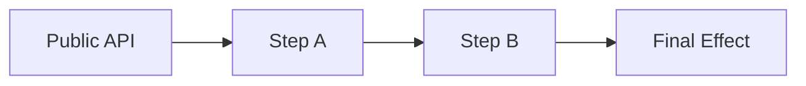

# Enterprise-Grade System Code Review

## Architecture, Design, and Foundational Assessment

> **Purpose**
>
> This document defines a **result-oriented, enterprise-grade code review** process for **core systems**
> (frameworks, platforms, infrastructure components, SDKs, shared libraries).
>
> This is **not** a PR review.
> The output of this review must enable a **clear technical decision** about the system’s future.

---

## Review Contract

### What This Review IS

- System-level analysis
- Architecture and design validation
- Foundational assumption challenge
- Performance-by-design evaluation
- Failure-mode and diagnostic surface sanity check (minimal, not a tooling deep dive)

### What This Review IS NOT

- Style or formatting review
- Line-by-line refactor suggestions
- Feature-level feedback
- Full observability or tooling audit (dashboards, vendors, agents, pipelines)

---

## Expected Final Outcomes (Non-Negotiable)

At the end of this review, we must be able to answer **unambiguously**:

1. **Is the system fundamentally sound?**
2. **Is evolution safe, or does complexity compound?**
3. **What is the correct next action?**

The review must conclude with **exactly one** of the following outcomes:

- ✅ **Keep and Improve**: system is sound, proceed with incremental evolution
- ⚠️ **Redesign**: core assumptions are stressed, targeted redesign required
- 🚨 **Rewrite Candidate**: foundational design is flawed, rewrite is rational

If the review cannot support one of these decisions, **it is incomplete**.

---

## Hard Gates (Stop Conditions)

Stop the review immediately if any of the following cannot be produced:

- A correct **as-built execution flow**
- A **primary axis** statement (central abstraction)
- A completed **responsibility and boundary map**
- A set of **system invariants** (at least 5)

---


---

## Review Rules (Mandatory)

1. Do **not** propose fixes in Phase 1.
2. Do **not** start from individual files.
3. Do **not** optimize before reconstructing the architecture.
4. Every finding must include:
    - **Symptom**: what is observed
    - **Root Cause**: why it exists
    - **Impact**: why it matters
    - **Evidence**: concrete pointers (files, classes, call paths, scenarios)
    - **Risk Level**: Low / Medium / High / Rewrite Risk

---

## Mandatory Recursive Governance Review Before Commit

### Status

MANDATORY.

Implementation is not complete when tests pass.

Implementation is complete only when:

1. implementation/refactor/fix is done
2. required validation passes
3. required gates pass
4. governance code review passes
5. evidence is written
6. truth/backlog files match reality
7. staged files are intentional
8. no forbidden generated/cache/local files are committed

### Rule

After every implementation, refactor, remediation, test fix, validation fix, or gate fix, the agent MUST perform a
governance code review before commit or push.

The review MUST check the changed scope against:

- `AGENTS.md`
- `.agents/how-to/how-to-code-review.md`
- every applicable `.agents/how-to/how-to-*.md`
- current stage evidence
- current acceptance criteria
- component-specific governance
- production-readiness rules

### Recursive Loop

The required loop is:

```text
implement/fix
run validation
run gates
perform governance review
fix every BLOCKER/HIGH/MEDIUM finding
rerun validation
perform governance review again
repeat until clean
write evidence
update truth/backlog
commit
push only if requested/allowed
```

### After Broken Test Fixes

Fixing broken tests is new implementation work.

Therefore, after fixing a failing test, PHPStan error, gate failure, or validation issue, the agent MUST run governance
review again before commit.

A test fix MUST NOT be committed only because the test now passes.

### Required Review Checks

The review MUST explicitly check:

* architecture placement
* naming rules
* DI/container ownership
* runtime composition leaks
* ServiceProvider/Configuration ownership
* Configuration/Builders boundary
* PublicSurface delegation
* Foundation misuse
* hidden fallback construction
* static state and reset safety
* test quality
* gate quality
* evidence/truth consistency
* no broad suppressions
* no fake shims
* no fake GREEN

### Commit Rule

Commit is FORBIDDEN if:

* validation is failing
* mandatory gates are failing
* governance review has unresolved BLOCKER/HIGH/MEDIUM findings
* truth files disagree with validation
* evidence is missing
* unrelated dirty files are staged
* cache/generated/local files are staged without explicit approval

### Recursive Review Accepted Debt Rule

A recursive governance review is clean only when it has zero unresolved findings.

Unresolved YELLOW findings are allowed only as accepted governance debt.

If any YELLOW finding remains, the phase MUST NOT be reported as pure FULL_GREEN.

Allowed final statuses:

- FULL_GREEN: validation clean, gates clean, governance review has zero unresolved findings.
- GREEN_WITH_ACCEPTED_YELLOW_DEBT: validation/gates clean, no BLOCKER/HIGH/MEDIUM remains, but YELLOW findings are
  formally accepted.
- YELLOW_WITH_EXACT_BLOCKERS: findings remain and may affect readiness.
- RED: validation, security, truth, or mandatory gates are broken.

Accepted YELLOW debt MUST include:

- affected files
- exact pattern
- severity
- why it is not HIGH/BLOCKER
- owner
- target phase/version
- expiry or review date
- risk
- mitigation
- evidence location
- V5.9 blocking decision
- truth/backlog entry

Commit is allowed with accepted YELLOW debt only if:

- no BLOCKER/HIGH/MEDIUM review finding remains
- no HIGH/BLOCKER security issue remains
- YELLOW debt is tracked with owner/target/risk/expiry
- truth files clearly say it is not pure FULL_GREEN

### Final Acceptance

A pass may be marked FULL_GREEN only when validation and governance review are both clean.

If validation is green but governance review is not clean, status is YELLOW or RED depending on severity.

If a mandatory `how-to-*.md` rule is violated, the scope MUST NOT be marked GREEN.

---

## Cross-Governance Compliance Gate (Mandatory)

This review MUST verify that the reviewed code, tests, architecture, and documentation comply with **every applicable
rule from every `how-to-*.md` governance document** in the repository.

This is not optional.
This is not a reminder.
This is a hard review gate.

A code review that does not explicitly check the `how-to-*.md` governance set is incomplete, even if the architecture
analysis is strong.

### Governance Inventory Rule

Before writing findings, the reviewer MUST discover and list all governance documents matching:

```text
**/how-to-*.md
```

The inventory MUST include at least:

- file path
- document title or main purpose
- applicable scope: architecture / clean code / code style / coding standards / testing / documentation / review
  process / other
- whether the document applies to this reviewed system
- if not applicable, the exact reason why it does not apply

The reviewer MUST NOT silently ignore a `how-to-*.md` document.

If a governance document exists but cannot be read, parsed, or reconciled with the review scope, the review MUST mark
this as a **Governance Blocker**.

### Rule Extraction Rule

For every applicable `how-to-*.md` document, the reviewer MUST extract and enforce:

- every `MUST` rule
- every `MUST NOT` rule
- every `HARD RULE`
- every `Mandatory` section
- every `Non-Negotiable` section
- every explicit checklist item
- every required output or deliverable
- every forbidden anti-pattern
- every naming, ownership, testing, documentation, style, or architecture law

`SHOULD` rules must also be reviewed, but they may be treated as improvement opportunities when the trade-off is
justified.

The reviewer MUST NOT cherry-pick only the obvious rules.
The reviewer MUST treat the governance set as a complete contract.

### Compliance Matrix Rule

The review output MUST include a `GOVERNANCE COMPLIANCE REPORT` section with a matrix like this:

| Governance Document      | Rule / Requirement                                                                   | Applies? | Status                | Evidence                           | Missing / Weak Area | Required Action                                | Severity                      |
|--------------------------|--------------------------------------------------------------------------------------|----------|-----------------------|------------------------------------|---------------------|------------------------------------------------|-------------------------------|
| `how-to-architecture.md` | folder says flow or capability, unit says responsibility, function says exact action | Yes      | Pass / Partial / Fail | file/folder/class/function pointer | exact gap           | keep / rename / move / split / merge / rewrite | Low / Medium / High / Blocker |

Status values:

- **Pass**: rule is clearly satisfied
- **Partial**: rule is attempted but incomplete, vague, weak, inconsistent, or under-documented
- **Fail**: rule is violated
- **Not Applicable**: rule honestly does not apply, with a concrete reason
- **Blocked**: rule cannot be evaluated because evidence is missing or the governance source cannot be read

The matrix MUST be concrete.
Do not write vague entries like "mostly follows clean code" or "tests are okay".

### Exact Gap Reporting Rule

For every `Partial`, `Fail`, or `Blocked` item, the review MUST state exactly:

- **what is missing**
- **where it is missing**: file, class, method, folder, test, doc, public API, or flow
- **why it matters**
- **which governance document and rule it violates**
- **what should be done next**
- whether the required action is:
    - add
    - remove
    - rename
    - move
    - split
    - merge
    - simplify
    - document
    - test
    - harden
    - rewrite
    - deprecate

The report MUST include concrete suggestions, rewrites, or replacement shapes when they improve clarity.

If the reviewer believes a rule should not be followed in this specific case, they MUST write an explicit exception
with:

- reason
- trade-off
- risk
- owner of the exception
- expiration or revisit condition

Silent exceptions are forbidden.

### Governance Coverage Summary

The review MUST include a short summary:

```text
Governance documents found: <number>
Governance documents applied: <number>
Rules checked: <number or best-effort count>
Passed: <number>
Partial: <number>
Failed: <number>
Blocked: <number>
Highest severity: Low / Medium / High / Blocker
```

If the reviewer cannot count every rule exactly, they MUST provide a best-effort count and explain why exact counting
was not possible.

### Governance Failure Impact Rule

Governance failures MUST influence the final decision.

Use this interpretation:

- **Low**: local improvement, does not change the final decision by itself
- **Medium**: affects maintainability, documentation, tests, naming, or local ownership
- **High**: affects architecture, correctness, safety, public API stability, test trust, or evolution safety
- **Blocker**: review cannot approve the system until the gap is resolved or explicitly accepted

A system may not receive **✅ Keep and Improve** if there is an unresolved governance blocker.

A system may not receive a clean approval if any `MUST`, `MUST NOT`, `HARD RULE`, or `Non-Negotiable` item fails without
an explicit exception.

### Mandatory Governance Finding Template

Use this template for governance-specific findings:

```md
### Governance Finding: <short title>

- **Governance Source:** `<how-to-file.md>` -> `<section/rule>`
- **Required Rule:** ...
- **Observed Gap:** ...
- **Where It Fails:** file/folder/class/method/test/doc path
- **Why It Matters:** ...
- **Required Action:** add / remove / rename / move / split / merge / simplify / document / test / harden / rewrite / deprecate
- **Suggested Fix:** concrete proposed change, rewrite, or replacement shape
- **Severity:** Low / Medium / High / Blocker
- **Evidence:** concrete pointers
```

### Cross-Document Conflict Rule

If two `how-to-*.md` documents appear to conflict, the reviewer MUST NOT guess.

Resolve conflicts using this priority order:

1. correctness and safety
2. explicit project governance
3. architecture and ownership clarity
4. public API stability
5. testability
6. documentation truthfulness
7. coding standards and style
8. local taste

The review MUST record the conflict and the chosen interpretation in `DECISIONS-LOG`.

### Minimum Required Governance Checks

When these files exist, the review MUST check them explicitly:

- `how-to-architecture.md`: ownership, screaming architecture, flow/capability slicing, hierarchy, boundaries, locality,
  public surface, security, refactoring, and change governance
- `how-to-design-components.md`: component shape, filesystem law, PublicSurface, Flows, Capabilities, forbidden folders
- `how-to-architecture-extension-with-ddd.md`: DDD application, bounded context, entities, value objects
- `how-to-use-advanced-architecture-patterns.md`: advanced patterns, GoF application, event sourcing, CQRS
- `how-to-clean-code.md`: correctness, readability, simplicity, naming, function design, module design, error handling,
  testing, refactoring discipline, anti-pattern rejection
- `how-to-code-style.md`: project-specific formatting, typing, imports, constructor promotion, nullable type style,
  named arguments, static closures, pipe usage when applicable
- `how-to-coding-standards.md`: PHP version expectations, security, DevSecOps gates, modern language features, output
  expectations, privacy/legal notes where relevant
- `how-to-dogfooding.md`: internal component reuse, one capability one owner, dependency direction, PublicSurface
  thinness,
  hot-path efficiency, Filesystem/Storage/Queue/Messaging/Reliability/Observability/CallableSerialization adoption
  matrix,
  no raw file/process/serialization/retry logic outside owners
- `how-to-modern-php-attributes-di.md`: PHP 8.0-8.5 feature adoption, attribute compilation (not
  reflection-per-request),
  DI/autowiring discipline, constructor bloat rules (0-4 normal, 5-7 check, 8+ warning), compiled metadata vs hot-path
  reflection,
  WeakMap cache policy, property hooks, asymmetric visibility, NoDiscard, pipe operator for pure transformations only,
  superglobal isolation behind AvaX Request, tooling gates
- `how-to-unit-test.md`: behavior-first tests, happy/failure/edge/regression/security scenarios, naming,
  Arrange/Act/Assert, one-act rule, assertion precision, test data clarity
- `how-to-document.md`: docs location, filesystem-first documentation, `how-this-works.md`, mermaid diagrams, real
  triggers, debug-first guidance, documentation completeness
- `how-to-system-security.md`: security governance, boundaries, authentication, authorization, secrets, input
  validation, output encoding, naming rules
- `how-to-system-performance.md`: performance governance, hot paths, hidden I/O, bounding, latency budgets, memory
  management
- `how-to-production-readiness.md`: production gates, health checks, doctor, runtime safety, failure handling
- `how-to-dependency-injection.md`: DI/autowiring, ServiceProvider coverage, Container Ownership Rule, Approved
  Composition Contexts, Container Resolution Rule, Gate Enforcement Rule, Forbidden Patterns, factory precision, golden
  path examples
- `how-to-runtime-composition.md`: Runtime Composition Leak Law, Forbidden Patterns, Container Ownership Rule, static
  facade law, path/context-aware gate enforcement
- `how-to-code-review.md`: this review process itself, including hard gates, findings, decision, next steps, and
  governance compliance

Hard rule:

A code review that does not explicitly check `how-to-dogfooding.md` and `how-to-modern-php-attributes-di.md` when they
exist is incomplete.

These two documents are central to AvaX V5 governance.

If either is missing from the checklist, the checklist is stale and the review is invalid.

### Governance Drift Rule

If a new `how-to-*.md` document exists but is missing from this review checklist, the review checklist is stale.

A stale review checklist is a governance defect.

If any listed file is missing, the reviewer MUST state whether it is expected to exist for this repository.

### Deliverable

The final `review.md` MUST include:

- `GOVERNANCE INVENTORY`
- `GOVERNANCE COMPLIANCE REPORT`
- `GOVERNANCE FINDINGS`
- `GOVERNANCE EXCEPTIONS` if any
- `GOVERNANCE COVERAGE SUMMARY`
- `DECISIONS-LOG` entries for conflicts, exceptions, or waived rules

If these sections are missing, the review fails the review process itself.

---

## Risk Level Definitions (Mandatory)

| Risk Level   | Definition                                                                                                                           |
|--------------|--------------------------------------------------------------------------------------------------------------------------------------|
| Low          | Localized issue, does not spread across boundaries, low coupling, easy to test and fix without ripple effects.                       |
| Medium       | Crosses module boundaries or affects extension points, requires coordination, increases maintenance cost.                            |
| High         | Impacts correctness, safety, or evolution, forces touching multiple core classes, increases systemic fragility.                      |
| Rewrite Risk | Indicates the system’s axis is wrong or the complexity-to-capability ratio is compounding. Requires structural change, not patching. |

---

## Standard Finding Template (Use This Format)

### Finding: <short title>

- **Symptom:** …
- **Root Cause:** …
- **Impact:** …
- **Evidence:** …
- **Risk Level:** Low / Medium / High / Rewrite Risk
- **Notes (optional):** constraints, trade-offs, why it might be acceptable

---

## Required Artifacts (Deliverables)

The review must produce these file review.md as output
in the folder EVIDENCE with sections:

- `ARCHITECTURE NOTES` (or this doc filled in)
- `GOVERNANCE INVENTORY` (all discovered `how-to-*.md` documents)
- `GOVERNANCE COMPLIANCE REPORT` (rule-by-rule compliance matrix)
- `GOVERNANCE FINDINGS` (all governance gaps using the mandatory governance finding template)
- `GOVERNANCE EXCEPTIONS` (only when a rule is intentionally waived with justification)
- `FINDINGS` (all findings using the standard template)
- `DECISION` (final decision, max 10 sentences)
- `DECISIONS-LOG` (decision log entries, see template below)
- `NEXT STEPS` (action-oriented plan based on the decision)

NOTE: overwrite existing reviews
---

# PHASE 0: Context and Scope Gate (Mandatory)

**Goal:** Prevent wrong assumptions and opinion-based review.

### 0.1 System Identity

Fill in:

- **System Type:** library / framework / platform / infra component / SDK / shared module
- **Primary Consumers:** internal teams / public users / app layer / infra layer
- **Runtime Context:** HTTP request / CLI / worker / long-running process / mixed
- **Lifecycle:** prototype / stable core / legacy / replacement-in-progress

### 0.2 Intended Use-Cases and Anti-Use-Cases

- **Intended Use-Cases :**
    - …
- **Anti-Use-Cases (things the system explicitly should NOT do):**
    - …

### 0.3 Non-Goals

- List explicit non-goals, to prevent scope creep in review:
    - …

### 0.4 Compatibility Contract

- **Public API Stability Requirement:** strict / moderate / none
- **Backwards Compatibility:** required / optional / not required
- **Performance Budget:** expected scale and constraints (rough numbers are fine)

**Deliverable:** A filled Phase 0 section. If Phase 0 is missing, Phase 1 findings are invalid.

---

# PHASE 1: System and Architecture Review

**Goal:** Build a correct mental model of the system as it exists today.

---

## 1. System Model Reconstruction (Mandatory)

### 1.1 Actual Execution Flow (As-Built)

Reconstruct the real execution flow, ignoring documentation and intentions:

`Public API -> ? -> ? -> ? -> Final Effect`

Identify explicitly:

- Where state is **created**
- Where state is **mutated**
- Where decisions are **made**
- Where execution is **pure / mechanical**

**Deliverable:**

- One diagram (ASCII / Mermaid / external)
- A 5 to 10 line explanation titled:
  **"This is how the system actually works."**

Example Mermaid skeleton (optional):



If this cannot be produced, the review stops here.

---

## 2. Central Abstraction Identification

### 2.1 Primary Axis Rule (Mandatory)

Answer with one sentence only:

> "This system is fundamentally organized around **<PRIMARY_AXIS>**."

Examples:

- Kernel

- Pipeline

- Context

- Configuration

- Engine

- Other (explicitly name it)

### 2.2 Secondary Axis (Optional, but Controlled)

If a second axis exists, name it explicitly:

> "Secondary axis: **<SECONDARY_AXIS>** (adds complexity and must be justified)."

**Rule:** If a secondary axis exists, mark **Design Risk: Dual-axis complexity** and justify why it is necessary.

**Deliverable:**

- Primary axis sentence

- Optional secondary axis sentence + justification

---

## 3. Central Abstraction Stress Test

For the primary axis, answer Yes / No:

- Does every feature flow through it?

- Does it accumulate responsibilities over time?

- Is it harder to change than surrounding components?

**Assessment:**

- ✅ Pass: stable axis

- ⚠️ Weak: growing pressure

- 🚨 Fail: wrong axis

**Deliverable:**

- Classification (Pass / Weak / Fail)

- write clear justification(s) with evidence pointers

---

## 4. Responsibility and Boundary Mapping

Map responsibilities explicitly:

| Component | Orchestrates | Executes | Holds State | Notes |
|-----------|--------------|----------|-------------|-------|
|           |              |          |             |       |

**Red Flags:**

- One component does all three (orchestrates, executes, holds state)

- Responsibilities are inferred, not explicit

- State ownership is unclear

- Boundaries leak through "helper" backdoors

**Deliverable:**

- Completed table

- A 3 line summary:  
  **"Responsibility boundaries are: clear / stressed / violated."**

---

## 5. Pipeline and Control Flow Analysis (If Applicable)

### 5.1 Pipeline Inventory

List steps in actual execution order:

| Step | Mandatory | Conditional | Mutates State | Terminal |
|------|-----------|-------------|---------------|----------|
|      |           |             |               |          |

### 5.2 Determinism Check

Is this pipeline a formal state machine?

**Criteria for "Yes":**

- Explicit states exist

- Explicit transitions exist

- Explicit terminal and error states exist

**Deliverable:**

- Table

- Explicit answer: **Yes / No**

- If "No": mark as **Foundational Risk: Implicit ordering**

---

## 6. Mutability Audit (Mandatory)

List all mutable objects:

| Object | Scope | Lifetime | Why Mutable? | Classification                         |
|--------|-------|----------|--------------|----------------------------------------|
|        |       |          |              | Necessary / Convenience / Design Smell |

**Deliverable:**

- Table

- Summary sentence:  
  **"Mutability is: justified / excessive / misplaced."**

---

## 7. System Invariants (Mandatory)

Define invariants the system must preserve. Examples:

- Deterministic resolution under same inputs

- No hidden mutation outside the central context

- No global state access without explicit boundary

- Circular dependency handling is explicit and policy-driven

- Errors carry context and are classifiable

- Extensions cannot bypass safety rules

**Deliverable:**

- as much as possible invariants

- For each invariant, list where it is enforced (or not enforced)

Template:

| Invariant | Enforced Where | Evidence | Status                              |
|-----------|----------------|----------|-------------------------------------|
|           |                |          | Enforced / Partially / Not enforced |

---

# PHASE 2: Foundational and Critical Design Review

**Goal:** Decide whether the system’s initial assumptions were correct.

---

## 8. Routine Enterprise Design Failures

### 8.1 Framework-in-a-Framework Syndrome

Check if present:

- Excessive builders, registries, facades

- Abstractions mirroring popular frameworks without real need

- Complexity without proportional capability

**Deliverable:**

- Present / Not Present

- celar explanation(s) with evidence pointers

---

### 8.2 Abstractions Without Real Variance

Identify:

- Interfaces with a single implementation

- Extension points never exercised

- Configuration flags that mimic polymorphism

Classify each:

- Acceptable

- Premature abstraction

- Design debt

**Deliverable:**

- List + classification + evidence

---

### 8.3 "Too Clever" Design Test

Answer explicitly:

- Is the design optimized for **reading** or **writing**?

- Does usage require internal knowledge?

**Deliverable:**

- Clear / Risky / Over-engineered

- Short justification with one usage scenario

---

## 9. Configuration as Architectural Signal

Answer Yes / No:

- Has configuration become a proxy for architecture?

- Are behavioral modes encoded via flags?

- Are invalid combinations possible?

**Assessment:**

- Healthy

- Risky

- Fundamentally flawed

**Deliverable:**

- Classification + reasoning + evidence

---

## 10. Performance-by-Design Sanity Check

Answer Yes / No:

- Is caching required for acceptable performance?

- Are many objects created per request or resolve?

- Could parts be plain functions instead of objects?

- Is reflection on the hot path without mitigation?

If 2 or more are Yes, mark:  
**Design-Level Performance Risk**

**Deliverable:**

- Yes/No matrix

- Conclusion and evidence pointers

---

## 11. Failure Modes and Diagnostic Surface (Minimal, Mandatory)

This is not a tooling audit. This is a design sanity check.

Answer Yes / No:

- Are errors categorized (programmer error vs runtime error vs domain error)?

- Do exceptions include context (what, where, why)?

- Can the system explain "why a decision was made" in a minimal way (debug hooks, traces, or structured error details)?

- Are failure states explicit in the pipeline or axis?

**Deliverable:**

- Yes/No matrix

- write clear conclusion

---

## 12. Rewrite Heuristics (Mandatory, Weighted)

Check items and sum weights.

| Heuristic                                           | Weight | Checked |
|-----------------------------------------------------|--------|---------|
| Central abstraction is wrong                        | 2      | ☐       |
| Pipeline relies on implicit ordering                | 2      | ☐       |
| Configuration complexity mirrors design complexity  | 1      | ☐       |
| Usage requires explanation to avoid misuse          | 1      | ☐       |
| Performance depends on mitigation, not structure    | 1      | ☐       |
| New features require touching multiple core classes | 2      | ☐       |

**Rewrite Score:** sum of checked weights = `__`

**Interpretation:**

- Score 0 to 2: rewrite not justified by heuristics

- Score 3 to 4: redesign likely, rewrite possible depending on constraints

- Score 5+: rewrite is rational unless constraints prohibit it

**Deliverable:**

- Checked list

- Final score

- One paragraph justification referencing findings

---

## 13. Documentation Gates (Mandatory, Required for how-this-works.md)

This section is **non-negotiable** for any code review that touches documentation files.
All rules are defined in `how-to-document.md` - these are explicit enforcement checks.

### Pre-Review: Document Validation

Before reviewing any documentation, verify the documentation files meet quality gates:

#### For all `how-this-works.md` files:

- [ ] File contains **valid frontmatter** (title, owner, last_reviewed, classification)
- [ ] Contains **mermaid diagram block** (```mermaid``` fence)
- [ ] Mermaid uses **`sequenceDiagram`** or **`flowchart`** type
- [ ] Uses `autonumber` where flow order matters
- [ ] All participant names are **real** (file/function names, NOT "Upstream", "Main Handler", etc.)

#### Ship Check (from how-to-document.md):

- [ ] Reader can retell **one exact path** from command to result WITHOUT opening code
- [ ] Uses **real** participant names (not generic placeholders)
- [ ] Uses **real command or trigger** at the start
- [ ] Explains **what gets written to disk** or left as evidence
- [ ] Explains **what user sees** on screen
- [ ] Contains **where to debug first** section

### Quality Anti-Patterns (Explicitly Forbidden)

DO NOT APPROVE if documentation contains:

- [ ] Generic placeholders like "Upstream Flow", "Main Handler", "Data Handler"
- [ ] "handles", "works with", "supports" without concrete behavior
- [ ] No mermaid diagram when flow is sequential
- [ ] No flowchart when topology is more important than sequence
- [ ] Missing "what gets written" explanation
- [ ] Missing failure/shutdown path

### Deliverable for Documentation Review:

- [ ] All checked items from Document Validation
- [ ] Any anti-patterns found with specific file:line references
- [ ] Clear pass/fail decision for documentation quality

**If documentation fails any gate, the review FAILS.**

---

# FINAL DECISION (Required)

Select exactly one:

- ✅ **Keep and Improve**

- ⚠️ **Redesign**

- 🚨 **Rewrite Candidate**

## Justification (Strict)

- Write clear human-grade sentences (how, why, where..)

- Must reference findings above (by IDs or titles)

- Must explain why this is the correct next step under the constraints

---

# NEXT STEPS (Action-Oriented)

## Constraints (Mandatory)

Define the non-negotiables for the chosen direction:

- API stability requirement: …

- Performance budget: …

- Security boundaries: …

- Time and risk tolerance: …

- Migration expectations: …

## Kill Criteria (Mandatory)

Define signals that the decision is failing:

- Example: "After 2 iterations, adding one feature still requires touching 4+ core classes"

- Example: "We cannot explain resolution decisions without deep internal knowledge"

- Example: "Caching becomes mandatory to hide design issues"

---

## If Keep and Improve

- What must not change:

    - …

- What can be incrementally evolved:

    - …

- First 3 concrete actions:

    1. …

    2. …

    3. …

## If Redesign

- Which abstraction is being redesigned:

    - …

- What remains intact:

    - …

- First 3 concrete actions:

    1. …

    2. …

    3. …

## If Rewrite Candidate

- What core idea failed:

    - …

- What the new primary axis should be:

    - …

- Migration strategy (minimum viable):

    - parallel run / adapter layer / incremental replacement

- First 3 concrete actions:

    1. …

    2. …

    3. …

---

# DECISIONS LOG (Template)

Use one entry per significant decision.

## Decision:

- **Date:** YYYY-MM-DD

- **Context:** what triggered this decision

- **Decision:** what we chose

- **Alternatives:** what we rejected and why

- **Consequences:** expected outcomes and risks

- **Evidence:** findings and references

---

---

## 14. Quality and Safety Ratchets

### 14.1 Quality Ratchet Rule

Metrics and quality scores MUST NOT regress from the previously established baseline.

- **PHPStan Errors**: MUST stay at 0 or current baseline. New errors are BLOCKERS.
- **Test Coverage**: MUST NOT decrease for the affected component.
- **Runtime Leaks**: MUST stay at 0 confirmed leaks.
- **Namespace Drift**: MUST stay at 0.

**Status:** MANDATORY  
**Severity:** BLOCKER

### 14.2 Gate Self-Test Rule

Every mandatory validation gate or architecture test MUST have at least one negative test case (proving it fails when
the
rule is violated).

- A gate that cannot fail is not a gate.
- A gate with "0 scans" or "0 violations" is UNPROVEN until the scanner's ability to find violations is verified.
- Mandatory gate without self-test or proof is BLOCKER for production-ready GREEN status.

Required examples:

```text
Runtime composition gate must fail on:
  $dependency ?? new Dependency()
  $dependency ??= new Dependency()
  new BuildSomething() in runtime
  $middleware[] = new SomeMiddleware(...)
  class_exists() runtime wiring
  builder->build() in runtime

DI gate must fail on:
  hidden fallback construction
  nullable required services used as fallback
  container service locator in runtime code
  missing dependency checks in business/runtime code

Git gate must fail on:
  .phpunit.cache/**
  .qoder/worktrees/**
  avax.txt
  generated local cache files
  forbidden local AI cache files

Security gate must fail on:
  obvious SQL/query injection pattern
  unsafe redirect pattern
  sensitive logging pattern
  path traversal pattern
  unsafe command execution pattern
  weak hashing/crypto pattern where detectable
```

Rules:

- gate without self-test or proof is YELLOW at minimum
- mandatory gate without self-test or proof cannot close BLOCKER
- gate that scans zero active files is FAIL, not PASS
- gate PASS with RED content is FAIL

**Status:** MANDATORY  
**Severity:** BLOCKER

### 14.3 No Zero-Scan Gate Rule

A validation command that reports success but scanned 0 files/units is a failure.

- Every validation report MUST include the count of items scanned.
- 0 items scanned = UNPROVEN.

**Status:** MANDATORY  
**Severity:** BLOCKER

---

## 15. AI-Generated Code Suspicion Rule

### 15.1 Definition of AI Suspicion

All code generated or heavily assisted by an AI agent is classified as **UNPROVEN** by default.

### 15.2 Mandatory Behavioral Proof

AI-generated code MUST NOT be accepted based on "logic review" alone. It MUST be validated by:

1. **Negative Test Case**: Prove the code fails under incorrect conditions.
2. **Boundary Stress**: Prove the code handles null, empty, max, and invalid inputs.
3. **Recursive Governance Review**: The code must pass the full recursive review loop.

### 15.3 AI-Generated Exception Rule

If an AI agent proposes a governance exception, it MUST be independently verified by a human or a secondary,
disconnected validation process.

**Status:** MANDATORY  
**Severity:** HIGH

---

> **Final Rule**
>
> A review that does not clearly determine what to do next and why
> is not an enterprise-grade review.

---

## Completion Language

### Mandatory Status Definitions

A component, stage, or pass **MUST NOT** be marked GREEN unless:

- All MANDATORY rules pass
- All tests pass
- PHPStan passes (no errors)
- Relevant gates pass
- Evidence agrees with code
- No BLOCKER/HIGH issue remains unresolved
- Every deferred MEDIUM issue has owner, reason, and next action

A stage **MUST** be YELLOW if:

- Validation passes
- But mandatory evidence is incomplete
- Or MEDIUM/HIGH findings remain deferred
- Or implementation is partial

A stage **MUST** be RED if:

- Tests fail
- PHPStan fails with errors
- Security gate fails
- Evidence contradicts code
- Mandatory governance is ignored

### Code Review Output Requirements

Code review **MUST** produce for each finding:

- **finding**: what was discovered
- **governance source**: which how-to document and rule
- **violated MUST/MUST NOT rule**: the exact rule violated
- **file/path**: where the violation occurs
- **severity**: BLOCKER / HIGH / MEDIUM / LOW
- **why it matters**: impact explanation
- **required fix**: what needs to be done
- **whether it blocks GREEN**: yes/no with justification
- **test/gate proof required**: what validates the fix

Code review **MUST NOT** say "all findings fixed" if any HIGH/MEDIUM finding remains deferred.

Code review **MUST** distinguish:

- **fixed**: confirmed resolved
- **deferred**: acknowledged but not fixed, with owner and timeline
- **accepted exception**: explicitly accepted with reason, trade-off, risk, and owner
- **false positive**: incorrectly flagged
- **not applicable**: rule doesn't apply to this context

### Governance Compliance Summary

Every review **MUST** include:

```
Governance documents found: <number>
Governance documents applied: <number>
Rules checked: <number>
Passed: <number>
Partial: <number>
Failed: <number>
Blocked: <number>
Highest severity: BLOCKER / HIGH / MEDIUM / LOW
```

---

## 16. Security Must Scream Rule

### Status

**MANDATORY**
**Severity:** BLOCKER

### Rule

Security-sensitive findings MUST be loud, explicit, and blocking by default.

Any OWASP-class weakness, injection risk, authentication bypass, authorization bypass, sensitive data leak, unsafe
deserialization, unsafe redirect, filesystem traversal, command execution risk, SSRF risk, XSS risk, CSRF risk,
SQL/query injection risk, weak cryptography, secret exposure, unsafe logging, or session/cookie weakness MUST be
classified as HIGH or BLOCKER unless proven otherwise.

Security findings MUST NOT be hidden as:

```text
cleanup
style issue
minor refactor note
pre-existing harmless debt
accepted risk without owner/expiry
non-blocking note
code quality nit
low-priority cleanup
```

A security finding may be downgraded only with:

```text
exact threat explanation
affected path
exploitability assessment
mitigation proof
test or gate evidence
owner
expiry if accepted temporarily
truth/backlog entry
explicit stage-blocking decision
```

### Minimum Severity Rule

- exploitable or likely exploitable security weakness = **BLOCKER**
- potential OWASP-class weakness = **HIGH** or **BLOCKER**
- defense-in-depth gap = **MEDIUM** or **HIGH**, depending on blast radius
- documentation-only security clarification = **LOW** only when no exploit path exists

---

## 17. Security Review Trigger Rule

### Status

**MANDATORY**
**Severity:** HIGH

### Rule

Security review is mandatory when a change touches any of the following:

```text
authentication
authorization
roles/permissions
sessions
cookies
CSRF
CORS
redirects
user input
request parsing
validation
serialization/deserialization
database query building
filesystem I/O
file upload/download
logging
secrets
hashing
encryption
HTTP client/server
queues and message payloads
cache keys containing user or user-derived data
template/rendering
command/process execution
event payloads crossing boundaries
webhooks
signed URLs
tokens
API keys
password reset flows
rate limiting
tenant isolation
sandboxing
plugin execution
object storage paths
URL generation
proxy/trusted header handling
```

### Required Review Evidence

If triggered, the review MUST include this table:

| Area | Changed? | Risk checked | Finding | Severity | Fix/mitigation | Blocks commit? |
|---|---:|---|---|---|---:|

### Silent Skip Rule

If the change does not trigger security review, the governance review MUST explicitly state why.

Security review cannot be skipped silently.

---

## 18. Security Commit Block Rule

### Status

**MANDATORY**
**Severity:** BLOCKER

### Rule

A commit is FORBIDDEN if the current change introduces, exposes, or leaves unresolved any security issue classified as:

```text
BLOCKER
HIGH
OWASP-class weakness
authentication bypass
authorization bypass
injection risk
XSS risk
CSRF risk
SSRF risk
unsafe redirect
unsafe deserialization
path traversal
command execution risk
secret exposure
sensitive data logging
weak cryptography or hashing
session or cookie weakness
unsafe file upload or download
database query injection risk
unsafe event payload crossing trust boundary
unsafe queue payload handling
unsafe tenant boundary
unsafe plugin or sandbox execution
```

### Required Action

1. Do not commit.
2. Document the finding.
3. Fix it first.
4. Rerun validation.
5. Rerun security review.
6. Rerun recursive governance review.
7. Commit only when security review is clean.

### Temporary Acceptance

A security issue may remain only if final status is YELLOW or RED. Never GREEN.

If temporarily accepted, it MUST have:

```text
exact issue
affected path
severity
exploitability assessment
owner
mitigation
expiry or version
backlog or truth entry
evidence
explicit decision whether it blocks the current stage
```

### Forbidden Masking

Security issues MUST NOT be hidden as:

```text
cleanup
style issue
low priority
pre-existing harmless debt
non-blocking note
accepted risk without proof
```

---

## 20. Security and Performance Trigger Cross-Rule

Security review MUST be triggered by changes to areas listed in:

```text
.agents/how-to/how-to-system-security.md §44
```

Performance review MUST be triggered by changes to areas listed in:

```text
.agents/how-to/how-to-system-performance.md §44
```

If triggered, the review evidence MUST include the compliance matrix sections for security and performance. If not
triggered, the review MUST say why.

## 21. Large Unit Review Thresholds

Large code is not automatically wrong, but it is automatically suspicious.

Mandatory review triggers:

```text
Class over 300 lines:            mandatory responsibility review
Method over 50 lines:            mandatory extraction or explanation review
Constructor with 8+ dependencies: mandatory design review
PublicSurface over 150 lines:    mandatory behavior leak review
Builder over 300 lines:          BLOCKER until classified
ServiceProvider over 250 lines:  mandatory split review
Test class over 500 lines:       mandatory test organization review
```

Threshold trigger does not automatically mean refactor. It does require documented decision. No large unit may be called
GREEN without review decision.

## 22. Canonical Term Registry Rule

One concept must have one canonical name. If the same concept appears under multiple names, review MUST choose one
canonical term and mark the others as aliases, deprecated terms, or wrong terms.

Check the registry at:

```text
docs/governance/canonical-terms.md
```

before introducing or accepting new terminology.

**Severity escalation:** Default HIGH. BLOCKER when naming drift affects PublicSurface, DI/container, Response layer,
Events, Runtime, Boot DSL, FailureBoundary, Database lifecycle, security-sensitive APIs, or public compatibility.

## 23. Governance Exception Register Rule

A documented governance exception is valid only when recorded in the exception register at:

```text
EVIDENCE/accepted-exceptions-ledger.md
```

An exception without owner and expiry is not an exception. It is unresolved governance debt.

For the full exception format, see:

```text
.agents/how-to/how-to-production-readiness.md §8
```

## 24. PHPDoc Review Rule

### Status

**MANDATORY**
**Severity:** HIGH

### Rule

Code review MUST check PHPDoc quality.

A scope cannot be GREEN if:

```text
a production class has no semantic class PHPDoc
a public/protected method has no semantic method PHPDoc
a method that throws lacks @throws
array shapes, generics, or iterables are undocumented
PHPDoc lies or drifts from implementation
PHPDoc merely repeats code without explaining intent
PHPDoc hides architecture confusion behind vague language
PHPDoc uses fully-qualified names instead of imports
PHPDoc conflicts with native types or PHPStan/Psalm analysis
```

### Severity

```text
BLOCKER: misleading docs that can cause wrong usage, security risk, public API misuse, or runtime misunderstanding
HIGH:    public API or framework behavior is undocumented
MEDIUM:  internal behavior is under-documented but not dangerous
LOW:     wording polish
```

### Cross-Reference

For full PHPDoc rules including class, method, tag, flow/action documentation, gate, severity, phased adoption, and
GREEN status rule, see:

```text
.agents/how-to/how-to-document.md — Semantic PHPDoc Rule
```

---

## 25. Critical Quality Signal Rule

### Status

**MANDATORY**
**Severity:** HIGH (escalates to BLOCKER — see below)

### Severity Escalation

Default severity is HIGH.

Escalates to **BLOCKER** when the issue threatens:

```text
security
data integrity
runtime safety
long-lived worker safety
truth/evidence integrity
public API compatibility
dependency graph correctness
rollback/recovery safety
```

Examples that MUST be BLOCKER when active:

```text
exploitable security issue
data corruption risk
request state stored in singleton
unresolved runtime composition leak in active runtime
fake GREEN
gate PASS with RED content
mandatory gate scans zero active files
hidden fallback dependency in runtime
missing required dependency discovered in business/runtime code
service locator in business/runtime code
```

### Rule

The review MUST loudly flag anything that threatens:

```text
security
data integrity
runtime safety
long-lived worker safety
dependency graph correctness
public API compatibility
static analysis baseline
test reliability
performance hot paths
observability of failures
rollback or recovery safety
container verification
request scope isolation
tenant isolation
state reset safety
failure boundary correctness
```

The following must not pass silently:

```text
hidden fallback construction
runtime service assembly
service locator usage in business code
missing dependency checks in business or runtime code
mutable static state without reset proof
request state stored in singleton
fake ServiceProvider
fake PublicSurface
broad try/catch swallowing errors
broad PHPStan ignores
weak tests
assertTrue(true)
evidence claiming GREEN while validation says otherwise
gate PASS with RED content
mandatory gate with zero scanned files
fake compatibility shim
duplicate canonical concepts
large builders acting as hidden containers
examples showing non-canonical style
```

### Core Principle

If it can create a security hole, corrupt data, hide a runtime failure, break long-lived workers, or fake correctness,
it must scream in review.
