# HotelSync ↔ BridgeOne: Integration Plan

This document is the project-level map for the integration service.

Its job is simple:

- explain what the service must do
- show how the current repository solves it
- make the implementation easy to review without reverse-engineering the whole codebase

The original interview brief is kept in [`INTERVIEW_TASK.md`](INTERVIEW_TASK.md).

---

## Mission Snapshot

The service connects:

- HotelSync as the upstream source of truth
- BridgeOne as the downstream local integration target

The repository implements a procedural PHP 8 service with:

- feature-first business folders
- `mysqli` for database access
- `cURL` for outbound HTTP
- MySQL as the persistence layer
- Docker for reproducible local verification

### Quick read

- `app/` contains technical runtime code
- `features/` contains business flows
- `public/webhooks/otasync.php` is the inbound webhook entrypoint
- `setup/database/create_schema.sql` defines the local schema
- `tests/` proves mapping rules, idempotency, retry behavior, and webhook deduplication

---

## Task Coverage

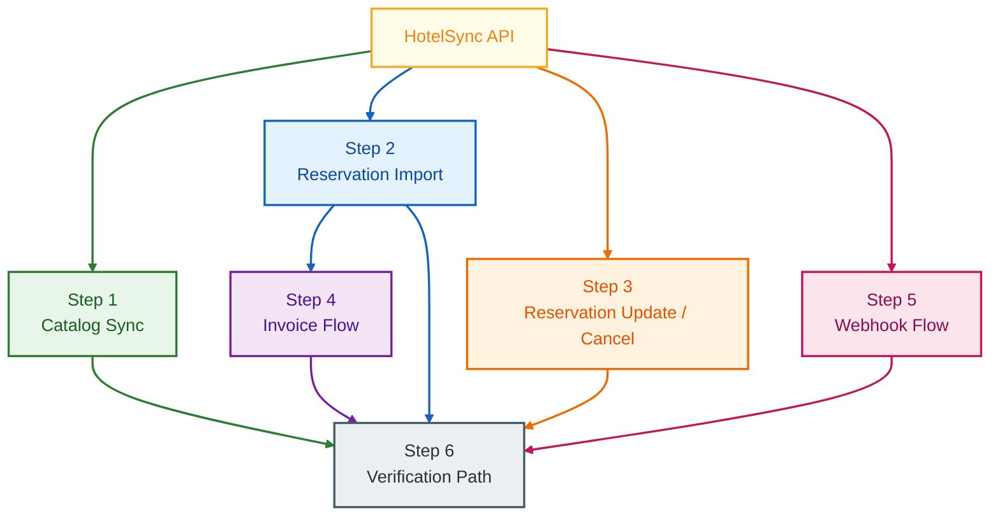

### Quick read

- catalog flow is implemented
- reservation import and update flow are implemented
- invoice queueing and retry flow are implemented
- webhook ingestion and duplicate suppression are implemented
- local proof path is implemented and verified through Docker

### Step by step

- 🟩 Step 1: We sync the catalog so local room and rate-plan mappings exist.
- 🟦 Step 2: We import reservations and shape them into the local data model.
- 🟧 Step 3: We update or cancel one reservation without duplicating local state.
- 🟪 Step 4: We generate and queue one invoice from a synced reservation.
- 🟥 Step 5: We receive webhook events and reuse the reservation sync logic.
- ⬛ Step 6: We verify the service through Docker, tests, and webhook replay.

---

## Runtime Architecture

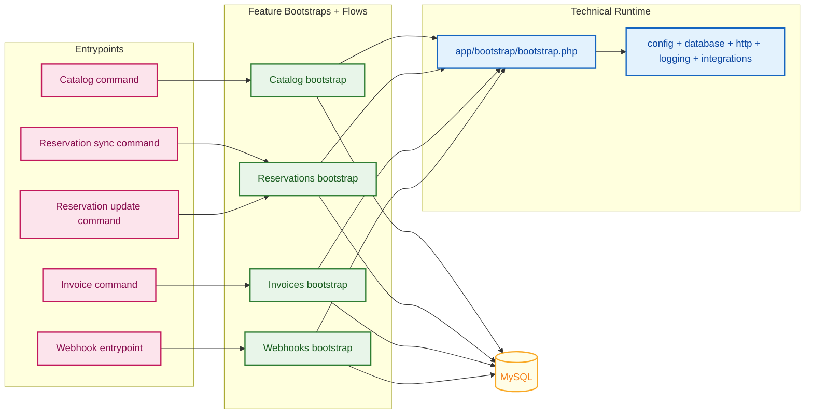

### What this means

- `app/bootstrap/bootstrap.php` loads only technical runtime code
- each feature owns its own composition file
- business flows stay close to their own feature folder
- inbound HTTP and CLI entrypoints remain thin wrappers

This is intentional. It keeps `app/` technical and prevents the bootstrap from becoming a global business registry.

This overview is intentionally neutral and does not use business step numbering, because it supports multiple flows at once.

---

## Repository Map

```text
app/
  bootstrap/bootstrap.php
  cli/cli.php
  config/config.php
  database/db.php
  http/http.php
  integrations/hotelsync/hotelsync.php
  logging/logger.php
  support/helpers.php

features/
  catalog/
    catalog_bootstrap.php
    commands/run_catalog_sync_command.php
    rooms/
    rate_plans/
    sync_catalog_from_hotelsync.php
  reservations/
    reservations_bootstrap.php
    commands/
    import/
    update/
    local_state/
  invoices/
    invoices_bootstrap.php
    commands/run_invoice_generation_command.php
    payload/
    queue/
    delivery/
    generate_and_queue_invoice_for_reservation.php
  webhooks/
    webhooks_bootstrap.php
    reservations/

public/
  webhooks/otasync.php

setup/
  database/create_schema.sql
  proof/sample_reservation_created_webhook.json

tests/
  unit/
    app/
    features/
  integration/
    features/
  run.php

sync_catalog.php
sync_reservations.php
update_reservation.php
generate_invoice.php
```

### Quick read

- `app/` is technical
- `features/` is business
- `public/` exposes the webhook entrypoint
- `setup/` carries schema and local proof assets
- `tests/` proves both pure logic and DB-backed behavior

---

## Delivery Board

This board is meant to feel like an execution board, not a product backlog.

It tracks:

- what is already verified in the local runtime
- what is implemented and ready for live upstream proof
- what remains as a deliberate next production step

### Green Lane: Verified in Local Runtime

| Task ID | Area | Summary | Priority | Status | Evidence |
| :--- | :--- | :--- | :--- | :--- | :--- |
| T-0 | Foundation | Runtime, config, DB, logging, HTTP helpers, HotelSync client seams | P0 | `Verified` | Docker runtime works and the local test suite passes |
| T-4 | Invoices | Queueing, numbering, retry handling, outbound delivery state | P1 | `Verified` | Invoice integration tests cover numbering, queue reuse, retry, and failure state |
| T-5 | Webhooks | Inbound webhook validation, dedupe, and reservation sync reuse | P0 | `Verified` | `GET` returns `405`, first `POST` processes, duplicate `POST` is safely ignored |
| T-6 | Verification | Docker proof path, local test run, webhook replay proof | P0 | `Verified` | `tests/run.php` passed with `passed=41 failed=0` |

### Blue Lane: Implemented and Ready for Live Upstream Proof

| Task ID | Area | Summary | Priority | Status | Evidence |
| :--- | :--- | :--- | :--- | :--- | :--- |
| T-1 | Catalog | Authenticate, fetch boards, rooms, and rate plans, then sync local catalog | P0 | `Implemented` | Code path is complete and locally covered; live HotelSync proof needs valid demo credentials |
| T-2 | Reservations | Import reservations by date range, map child rows, persist audit trail | P0 | `Implemented` | Local DB-backed tests pass; live upstream run depends on `.env` credentials |
| T-3 | Reservation Delta | Fetch one reservation, detect changes, keep cancellations auditable | P0 | `Implemented` | Local tests cover update and cancel behavior; live upstream run depends on `.env` credentials |

### Gray Lane: Next Production Steps

| Task ID | Area | Summary | Priority | Status | Evidence |
| :--- | :--- | :--- | :--- | :--- | :--- |
| N-1 | Webhooks | Add signed sender verification when upstream provides a signature contract | P1 | `Next Step` | Documented in the security and limitations sections |
| N-2 | Outbound HTTP | Restrict invoice delivery targets through an allow-list policy | P1 | `Next Step` | Documented as a production hardening measure |
| N-3 | Invoice Delivery | Move retries into a dedicated worker lane instead of inline delivery | P1 | `Next Step` | Documented in the invoice and limitations sections |
| N-4 | Observability | Add structured logs on top of the implemented correlation ids | P2 | `Next Step` | Documented in the next production steps section |

---

## Foundation Overview

The technical layer is deliberately small and direct.

- configuration is loaded through `config/` and `app/config/config.php`
- the DB layer uses `mysqli` only
- HTTP calls use `cURL` only
- helpers stay lightweight and procedural
- logging writes plain text operational traces without leaking secrets

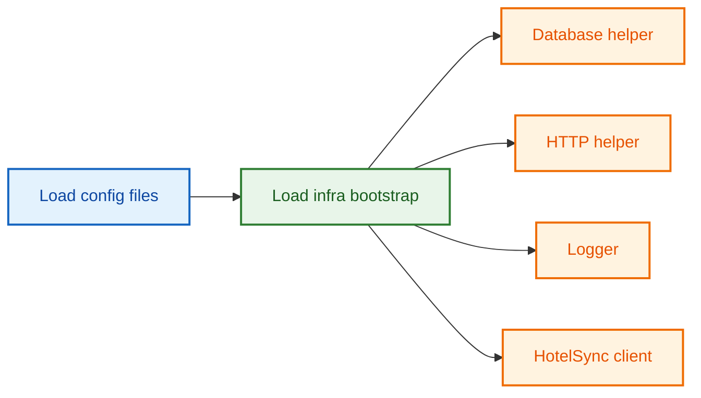

### Quick read

- no framework
- no ORM
- no hidden magic layer
- everything needed by the runtime is visible in one place

This overview is intentionally neutral and does not use business step numbering, because it prepares every feature flow.

## Step 1: Catalog Sync

The catalog flow is responsible for stable local room and rate-plan mappings.

Main files:

- `sync_catalog.php`
- `features/catalog/commands/run_catalog_sync_command.php`
- `features/catalog/sync_catalog_from_hotelsync.php`
- `features/catalog/rooms/fetch_rooms_from_hotelsync.php`
- `features/catalog/rooms/transform_room_payload_to_catalog_record.php`
- `features/catalog/rooms/upsert_room_catalog_record.php`
- `features/catalog/rate_plans/fetch_boards_from_hotelsync.php`
- `features/catalog/rate_plans/fetch_rate_plans_from_hotelsync.php`
- `features/catalog/rate_plans/transform_boards_payload_to_board_names_by_id.php`
- `features/catalog/rate_plans/transform_rate_plan_payload_to_catalog_record.php`
- `features/catalog/rate_plans/upsert_rate_plan_catalog_record.php`

What it does:

- logs in to HotelSync
- fetches boards because the API exposes meal-plan semantics there
- fetches rooms
- fetches pricing plans
- generates stable local codes
- compares canonical payload hashes
- upserts only changed rows

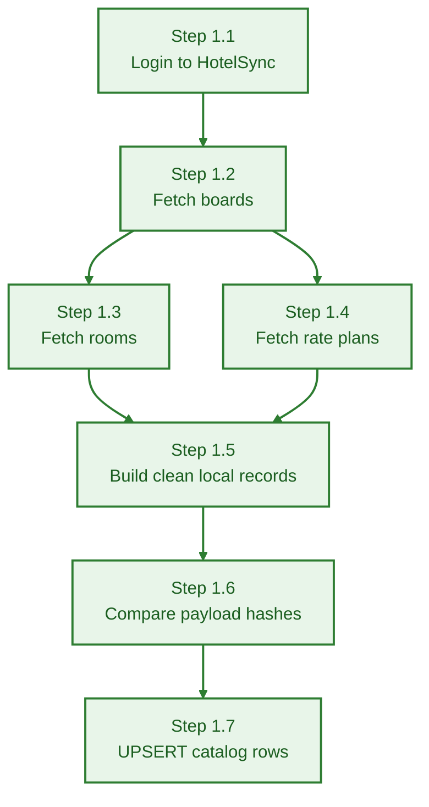

### Quick read

- room code format is `HS-{ROOM_ID}-{slug_room_name}`
- rate-plan code format is `RP-{RATE_PLAN_ID}-{meal_plan}`
- canonical hashes avoid pointless updates
- unique DB constraints keep mappings stable

### Step by step

- 🟩 Step 1.1: We log in to HotelSync so the catalog flow can start.
- 🟩 Step 1.2: We fetch boards because meal plan names live there.
- 🟩 Step 1.3: We fetch room payloads from the API.
- 🟩 Step 1.4: We fetch rate-plan payloads from the API.
- 🟩 Step 1.5: We build clean local records from the raw payloads.
- 🟩 Step 1.6: We compare payload hashes against local state.
- 🟩 Step 1.7: We UPSERT only the catalog rows that changed.

### How this works

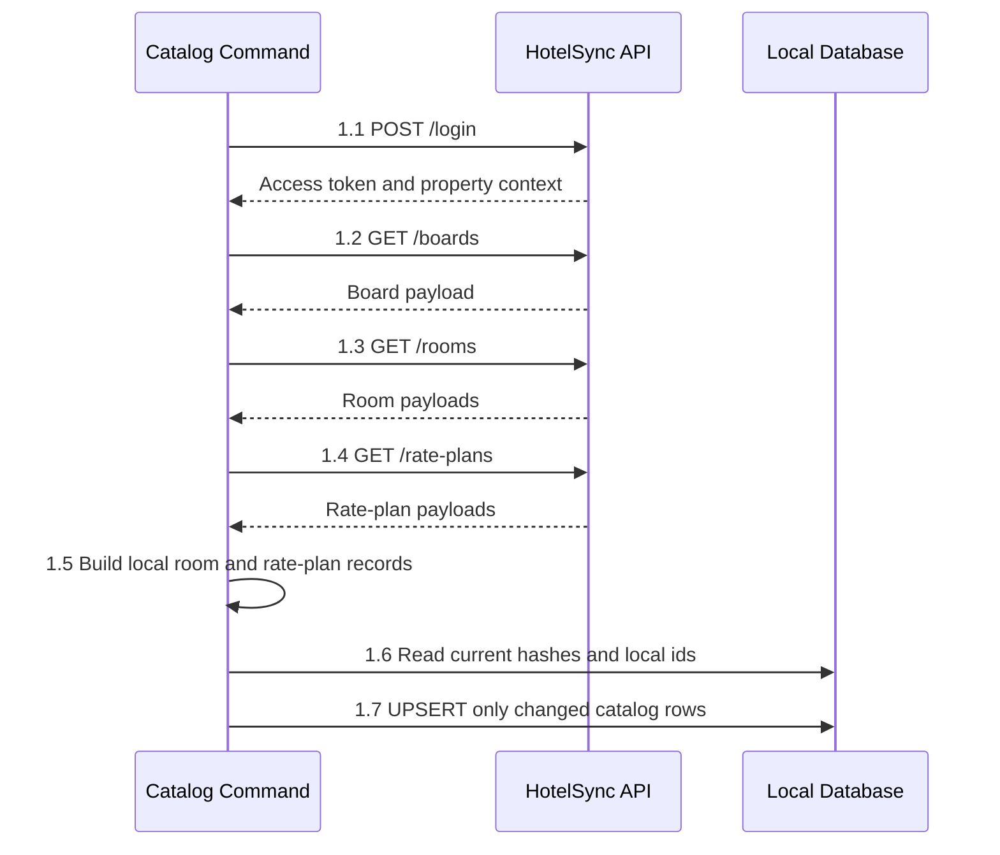

The catalog command starts by opening a valid HotelSync session. After that it reads boards, rooms, and rate plans, converts those upstream payloads into the local catalog shape, and checks the stored hashes in MySQL before writing anything. This keeps the flow idempotent and avoids rewriting rows that did not change.

## Step 2: Reservation Import

The reservation import flow syncs date-ranged upstream reservations into the local model.

Main files:

- `sync_reservations.php`
- `features/reservations/commands/run_reservation_import_command.php`
- `features/reservations/import/fetch_reservations_from_hotelsync_by_date_range.php`
- `features/reservations/import/sync_reservations_from_hotelsync_by_date_range.php`
- `features/reservations/local_state/transform_reservation_payload_to_local_record_set.php`
- `features/reservations/local_state/save_reservation_record_set_to_local_database.php`
- `features/reservations/local_state/sync_reservation_payload_to_local_state.php`

What it does:

- fetches reservations by `--from` and `--to`
- maps one reservation into a parent row plus child room and rate-plan rows
- generates `LOCK-{reservation_id}-{arrival_date}`
- compares hashes to skip unchanged payloads
- replaces child snapshots when the payload changes
- writes audit entries for imported, updated, unchanged, and canceled states

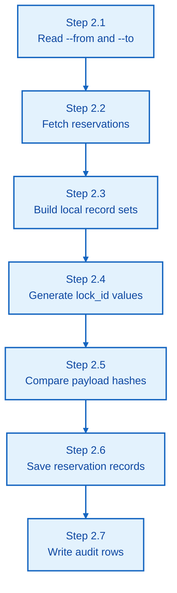

### Quick read

- one reservation may contain many rooms
- one reservation may contain many rate plans
- local child rows are treated as a fresh snapshot of the latest payload
- unchanged hashes become a no-op instead of a duplicate write

### Step by step

- 🟦 Step 2.1: We read the date range from the CLI command.
- 🟦 Step 2.2: We fetch reservation payloads for that period.
- 🟦 Step 2.3: We split each reservation into local parent and child records.
- 🟦 Step 2.4: We generate `lock_id` values for local tracking.
- 🟦 Step 2.5: We compare payload hashes to detect real changes.
- 🟦 Step 2.6: We save the reservation records into the local schema.
- 🟦 Step 2.7: We write audit rows for the result of that sync.

### How this works

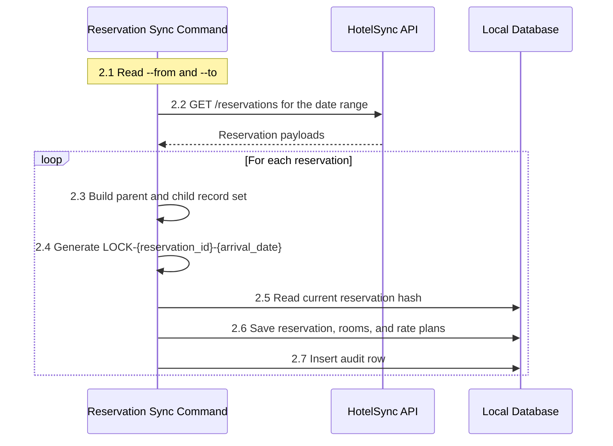

The reservation import command reads a date range and asks HotelSync for all reservations inside that window. For each payload it builds one local reservation snapshot, generates the local `lock_id`, compares the current hash, and only then writes the parent row, child rows, and audit trace. The database becomes the durable record of what was imported and what changed.

## Step 3: Reservation Update / Cancel

The single-reservation update flow reuses the same local-state logic as the import flow.

Main files:

- `update_reservation.php`
- `features/reservations/commands/run_reservation_update_command.php`
- `features/reservations/update/fetch_reservation_from_hotelsync_by_id.php`
- `features/reservations/update/sync_reservation_from_hotelsync_by_id.php`
- `features/reservations/local_state/detect_cancelled_reservation_from_payload.php`
- `features/reservations/local_state/load_or_sync_reservation_by_external_id.php`

What it does:

- fetches one reservation by external id
- checks whether the reservation already exists locally
- compares payload hashes
- updates only when there is an actual change
- keeps canceled reservations in place instead of deleting them
- writes audit records for state transitions

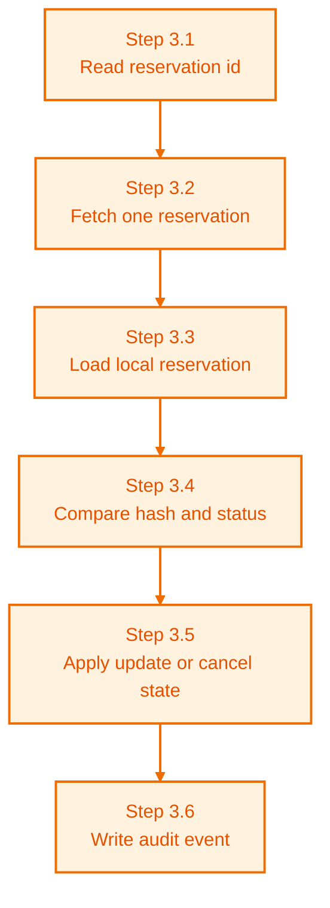

### Quick read

- cancel is treated as a business event, not a hard delete
- local state remains auditable
- the same sync logic is reused by CLI update flow and webhook flow

### Step by step

- 🟧 Step 3.1: We read the reservation id from the CLI command.
- 🟧 Step 3.2: We fetch that one reservation from HotelSync.
- 🟧 Step 3.3: We load the local reservation if it already exists.
- 🟧 Step 3.4: We compare the new hash and status with local state.
- 🟧 Step 3.5: We apply an update or cancel state only when needed.
- 🟧 Step 3.6: We write an audit event for the final state change.

### How this works

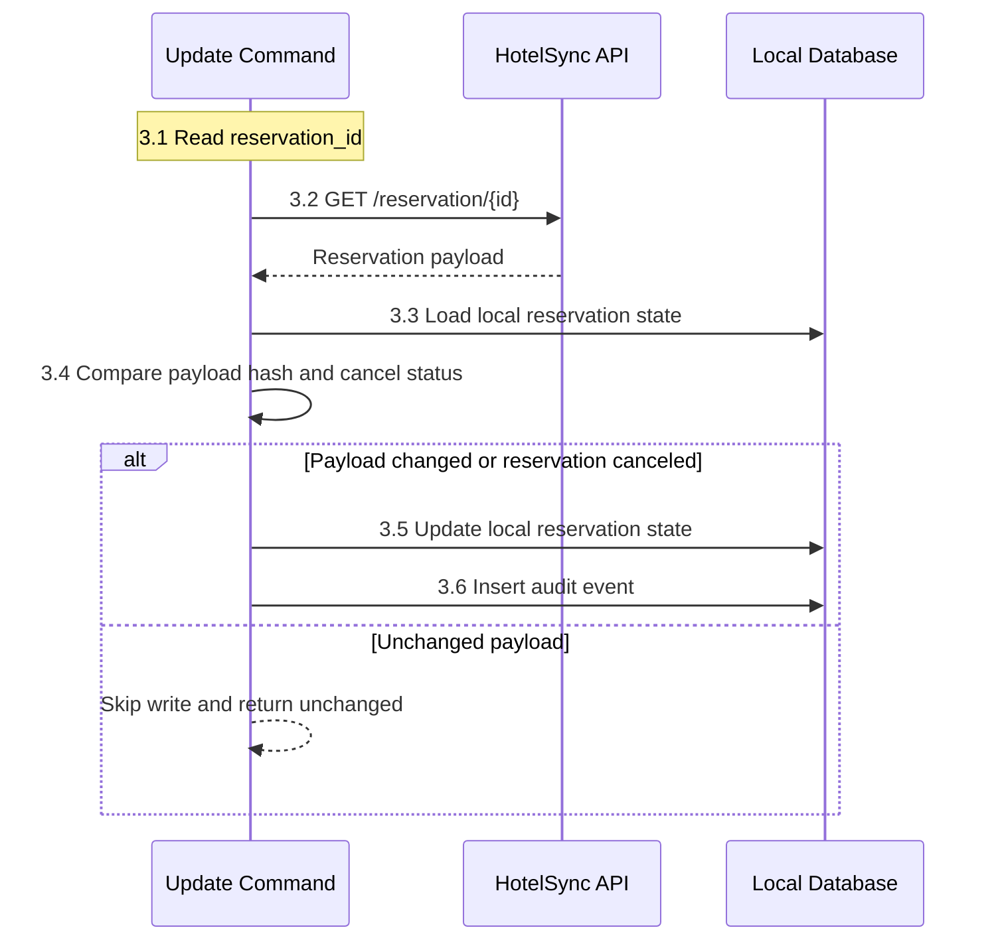

This flow is narrow on purpose: it works on one reservation only. The command fetches the latest upstream payload, checks the local version, and decides whether the record is unchanged, updated, or canceled. A cancellation is stored as a state change, not as a delete, so the reservation history stays visible.

## Step 4: Invoice Flow

The invoice flow turns one synced reservation into one queued invoice payload.

Main files:

- `generate_invoice.php`
- `features/invoices/commands/run_invoice_generation_command.php`
- `features/invoices/payload/transform_reservation_payload_to_invoice_line_items.php`
- `features/invoices/payload/transform_local_reservation_to_invoice_payload.php`
- `features/invoices/queue/find_invoice_queue_item_by_reservation_id.php`
- `features/invoices/queue/find_invoice_queue_item_by_id.php`
- `features/invoices/queue/reserve_next_invoice_number.php`
- `features/invoices/queue/save_invoice_queue_item.php`
- `features/invoices/queue/mark_invoice_queue_item_as_processing.php`
- `features/invoices/queue/mark_invoice_queue_item_as_sent.php`
- `features/invoices/queue/mark_invoice_queue_item_for_retry.php`
- `features/invoices/generate_and_queue_invoice_for_reservation.php`
- `features/invoices/delivery/deliver_invoice_from_queue.php`

What it does:

- loads or synchronizes the reservation first
- reserves the next invoice number atomically
- builds line items from the stored reservation payload
- prepares the BridgeOne payload
- inserts or reuses the queue row
- sends the invoice to the configured endpoint
- retries failed delivery up to the configured limit

```mermaid
flowchart LR
    classDef step4 fill:#F3E5F5,stroke:#7B1FA2,stroke-width:2px,color:#4A148C;

    A["Step 4.1<br/>Load or sync reservation"]:::step4 --> B["Step 4.2<br/>Lock invoice counter"]:::step4
    B --> C["Step 4.3<br/>Generate invoice number"]:::step4
    C --> D["Step 4.4<br/>Build invoice payload"]:::step4
    D --> E["Step 4.5<br/>Insert or reuse queue row"]:::step4
    E --> F["Step 4.6<br/>Deliver invoice payload"]:::step4
    F --> G["Step 4.7<br/>Mark retry or failure state"]:::step4

    linkStyle 0,1,2,3,4,5 stroke:#7B1FA2,stroke-width:2px;
```

### Quick read

- numbering is DB-backed, not in-memory
- queue rows are unique per reservation
- failures move through retry state and stop at `failed`
- HTTPS is required for outbound invoice delivery by default

### Step by step

- 🟪 Step 4.1: We load or synchronize the reservation before invoicing it.
- 🟪 Step 4.2: We lock the invoice counter in the database.
- 🟪 Step 4.3: We generate the next unique invoice number.
- 🟪 Step 4.4: We build the full invoice payload.
- 🟪 Step 4.5: We insert or reuse the queue row for delivery.
- 🟪 Step 4.6: We send the invoice payload to the configured endpoint.
- 🟪 Step 4.7: We mark retry or failure state when delivery does not succeed.

### How this works

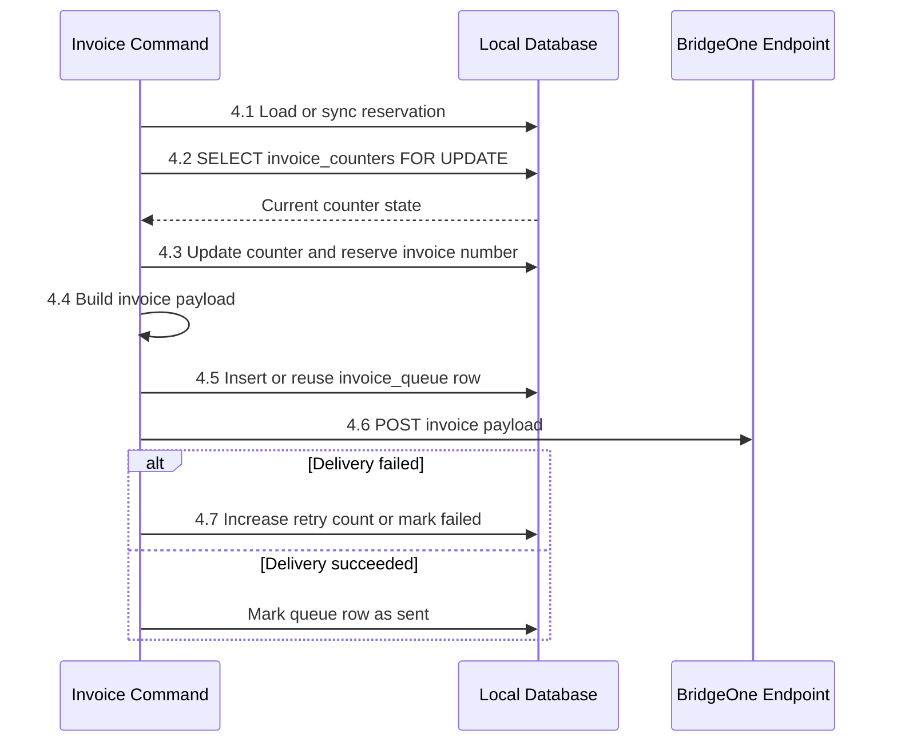

The invoice command uses the local reservation as its source data. It reserves the invoice number inside MySQL with a locked counter, prepares the outbound payload, stores the queue row, and then attempts delivery to the configured BridgeOne endpoint. If delivery fails, the queue state is updated so retries remain controlled and visible.

## Step 5: Webhook Flow

The webhook flow is the inbound integration surface.

Main files:

- `public/webhooks/otasync.php`
- `features/webhooks/reservations/receive_reservation_webhook_request.php`
- `features/webhooks/reservations/transform_webhook_payload_to_webhook_context.php`
- `features/webhooks/reservations/manage_webhook_event_inbox.php`
- `features/webhooks/reservations/process_reservation_webhook_event.php`

What it does:

- accepts only `POST`
- accepts only JSON content types
- rejects oversized payloads
- parses the webhook body
- derives a dedupe key from upstream event id or canonical payload hash
- stores the inbox event in `webhook_events`
- reuses reservation sync logic
- returns duplicate-safe responses when the same event arrives again

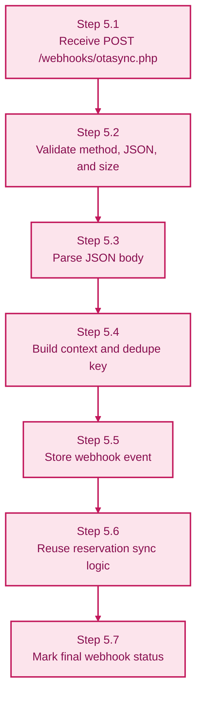

### Quick read

- if upstream sends an event id, that becomes the primary dedupe key
- if upstream does not send one, the payload hash becomes the fallback dedupe key
- duplicate webhook delivery stays harmless
- transport validation is implemented; signed sender verification is intentionally documented as a next production step

### Step by step

- 🟥 Step 5.1: HotelSync sends a message to the webhook URL.
- 🟥 Step 5.2: We fail closed unless the request method, JSON type, and size are valid.
- 🟥 Step 5.3: We parse the request body into readable data.
- 🟥 Step 5.4: We build the context and the dedupe key.
- 🟥 Step 5.5: We store the incoming event in the inbox table.
- 🟥 Step 5.6: We reuse reservation sync logic instead of duplicating reservation update code.
- 🟥 Step 5.7: We mark the event as processed, duplicate, or failed.

### How this works

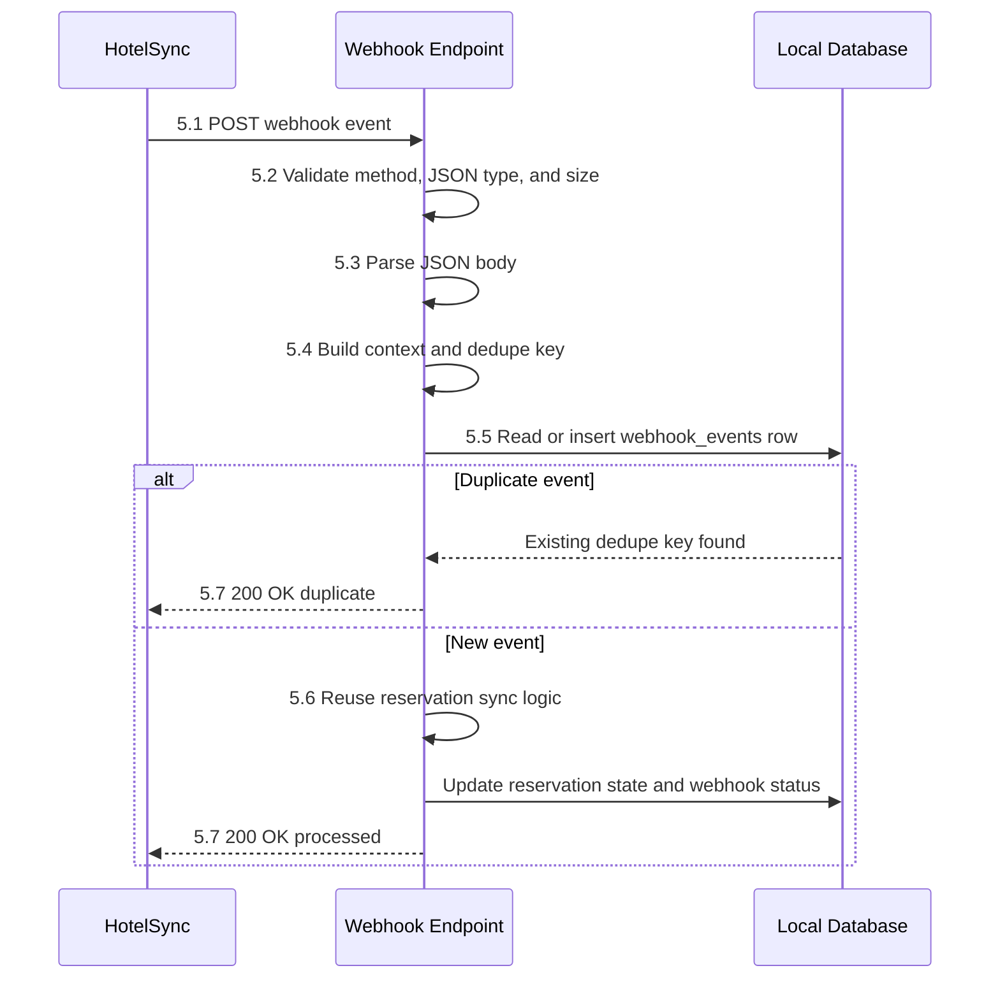

The webhook endpoint behaves like an inbound inbox. It first validates the transport layer, then turns the request into a dedupe-aware event record, and only after that does it touch reservation state. If the same event arrives again, the database dedupe key lets the service return a safe response without creating duplicate updates.

---

## Database and Integrity Model

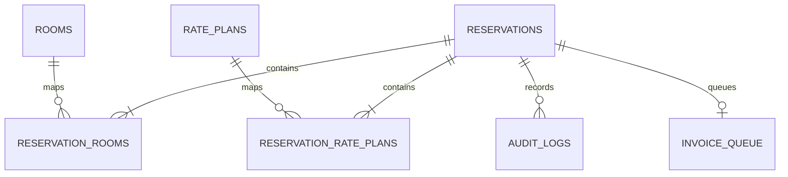

Important guarantees from `setup/database/create_schema.sql`:

- `rooms.external_room_type_id` is unique
- `rate_plans.external_rate_plan_id` is unique
- `reservations.external_reservation_id` is unique
- `reservations.lock_id` is unique
- `invoice_queue.reservation_id` is unique
- `invoice_queue.invoice_number` is unique
- `webhook_events.dedupe_key` is unique
- `audit_logs` keeps helper indexes for reservation and external reservation history reads
- `invoice_queue` keeps a helper index for queue status scans
- `webhook_events` keeps a helper index for reservation-centric event history reads
- invoice numbering is coordinated through `invoice_counters`

### Quick read

- HotelSync is the source of truth for reservation content
- MySQL is the source of truth for idempotency, audit, queue state, and local mappings
- the schema prevents the most important duplicate-write failure modes
- only a few helper indexes were added, because this repository stays correctness-first instead of chasing a bigger performance stack

This overview is intentionally neutral and does not use business step numbering, because the schema supports all flows together.

---

## Security Posture

This repository is interview-scoped, but it is not naive.

Implemented safeguards:

- prepared statements through `mysqli`
- canonical payload hashing for idempotency decisions
- webhook method validation
- webhook content-type validation
- webhook payload size limit
- duplicate suppression through DB-backed dedupe keys
- HTTPS enforcement for invoice delivery unless explicitly relaxed
- correlation ids propagated through CLI entrypoints, webhook requests, logs, and outbound HTTP headers
- `nginx` exposes only the webhook entrypoint from `public/`
- code is mounted read-only into the PHP containers during Docker verification
- secrets are not written into logs

OWASP-minded interpretation:

- fail closed on malformed or unexpected webhook requests
- minimize exposed HTTP surface
- avoid duplicate state transitions under replay
- keep a durable audit trail for operational review
- keep outbound delivery explicit and configurable

### Quick read

- this is not full production hardening
- it is a deliberate integration-safe baseline
- signature verification and rate limiting are documented as next steps, not silently ignored

### Small performance notes

- no Redis or external cache layer was added
- reservation persistence now loads only the room ids and rate plan ids referenced by the current payload
- helper indexes were added only where the repository already has obvious read patterns
- the database remains the source of truth for correctness, not a cache layer

---

## Step 6: Verification Path

Verified locally through Docker on `2026-03-12`.

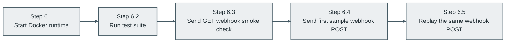

### Step by step

- ⬛ Step 6.1: We start the Docker runtime needed for local proof.
- ⬛ Step 6.2: We run the full test suite inside the CLI container.
- ⬛ Step 6.3: We send a GET request to prove the webhook entrypoint is alive and guarded.
- ⬛ Step 6.4: We send the sample webhook once to prove normal processing.
- ⬛ Step 6.5: We replay the same webhook to prove duplicate suppression.

Proof steps already executed:

```bash
docker compose up -d mysql php-fpm nginx
docker compose run --rm php-cli tests/run.php
curl -i http://localhost:8080/webhooks/otasync.php
curl -i \
  -X POST http://localhost:8080/webhooks/otasync.php \
  -H 'Content-Type: application/json' \
  --data @setup/proof/sample_reservation_created_webhook.json
curl -i \
  -X POST http://localhost:8080/webhooks/otasync.php \
  -H 'Content-Type: application/json' \
  --data @setup/proof/sample_reservation_created_webhook.json
```

Observed results:

- `tests/run.php` passed with `passed=41 failed=0`
- `GET /webhooks/otasync.php` returned `405 Method Not Allowed`
- the first proof webhook returned `200 OK` with an `ok` response
- replaying the same webhook returned `200 OK` with a `duplicate` response
- replaying one fresh webhook payload in parallel returned one normal `ok` response and one duplicate-safe `200 OK` response instead of a server error
- running the invoice command twice in parallel for the same reservation returned one `queued` result and one `existing` result instead of colliding on queue creation

Two-part proof model:

- local deterministic proof through Docker, tests, and webhook replay
- live HotelSync flow proof once valid demo credentials are provided in `.env`

---

## Design Decisions and Trade-offs

- The project stays procedural because the task explicitly asks for procedural PHP and forbids framework-style HTTP/DB abstraction.
- The code uses feature-first folders because the evaluator should be able to find the business flow quickly.
- `boards` are fetched during catalog sync because meal-plan naming comes from that upstream concept.
- Webhook dedupe prefers upstream event ids and falls back to canonical payload hashes when needed.
- Webhook inbox persistence reuses the same row on the unique dedupe key, so replay races stay duplicate-safe at the database boundary.
- Invoice numbering is serialized in MySQL because uniqueness is more important than optimistic convenience.
- Invoice queue creation also locks the local reservation row, so concurrent queue creation for the same reservation remains deterministic.
- Reservation persistence prefers narrow lookup queries over full local catalog scans when it resolves room and rate plan ids.
- Docker exists to prove reproducibility locally, not to pretend this repository is already a full deployment platform.

### Quick read

- the goal was clarity over abstraction
- the goal was stable integration behavior over cleverness
- the goal was a clean interview submission, not a fake framework

---

## Known Limits

- Live HotelSync command execution still depends on valid demo credentials in `.env`.
- `.env.example` intentionally keeps `HS_TOKEN` as a placeholder instead of shipping a concrete demo token value.
- Webhook authenticity is currently based on transport and payload validation because the brief does not define a signature contract.
- Invoice delivery currently runs inline with queue-state updates; a production version would split delivery into a worker path.
- Logging is plain text for the interview scope; correlation ids already exist, and a production service would add structured logs on top of them.
- Retry behavior is currently bounded by one shared invoice retry budget; a production version would classify transient and permanent delivery failures differently.
- Reservation import currently processes the requested range directly; a production version would add chunking, checkpoints, and shorter transaction scopes for larger sync windows.

---

## Next Production Steps

- add signed webhook verification if upstream supports it
- add outbound host allow-listing for invoice delivery
- move invoice delivery and retries into a dedicated worker lane
- add rate limiting on the public webhook surface
- add structured logs on top of the existing correlation ids
- classify outbound retry behavior by error type so transport failures retry and permanent validation failures fail fast
- add chunked reservation import with resumable checkpoints for larger date ranges
- add health checks and operational probes if the service becomes long-running

---

## Final Note

This file is not meant to be a fantasy architecture document.

It is meant to mirror the current repository truthfully:

- what the task asked for
- what was implemented
- what was verified
- what would be the next responsible production steps

That is the standard this submission is aiming for.
