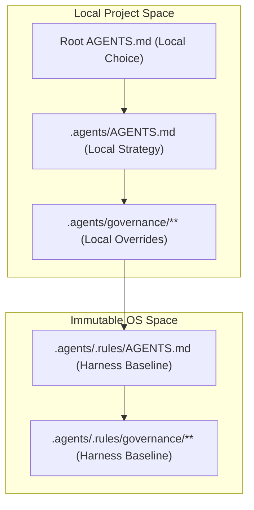
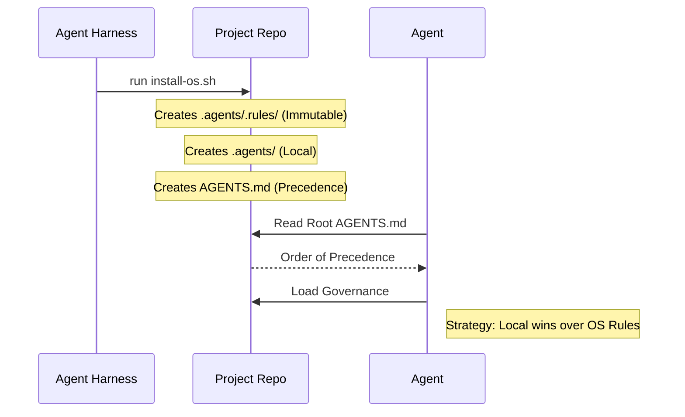

# Adoption Model — Rules Engine & Precedence

This document defines how the Agent Harness is adopted into project repositories and how the rules engine handles the "two sources of truth" problem.

## 1. The Rules Engine (`.agents/.rules/`)

When `install-os.sh` is run, it copies the canonical governance from the harness into the target repository's `.agents/.rules/` directory.

- **`.agents/.rules/`**: This is a **read-only, frozen copy** of the harness version used at install/upgrade time. It contains the universal "laws" of the OS.
- **`.agents/governance/`**: This directory in the target project contains the **local specialization**.
- **Root `AGENTS.md`**: The primary entry point and conflict resolver.

### Precedence Diagram

## 2. Resolving "Two Sources of Truth"

To prevent ambiguity:

1. **Explicit Precedence**: The root `AGENTS.md` MUST define the `Order Of Precedence`. If a rule exists in both `.agents/governance/` and `.agents/.rules/governance/`, the one higher in the precedence list wins.
2. **Frozen Base**: The `.agents/.rules/` directory should NEVER be modified by agents or humans in the child project. It is managed exclusively via `./install-os.sh --upgrade`.
3. **Local Shadowing**: If you need to change a global rule for a specific project, do not edit `.rules/`. Instead, create a file in `.agents/governance/` and place it higher in the precedence list.

## 3. Adoption Flow

## 4. Why `.rules`?

Without `.rules`, a project only has its local copies. If the local copies drift or are poorly edited, the "identity" of the Agent OS is lost. The `.rules` folder acts as the **"Constitutional Baseline"** that can be verified via `./install-os.sh --validate`.
