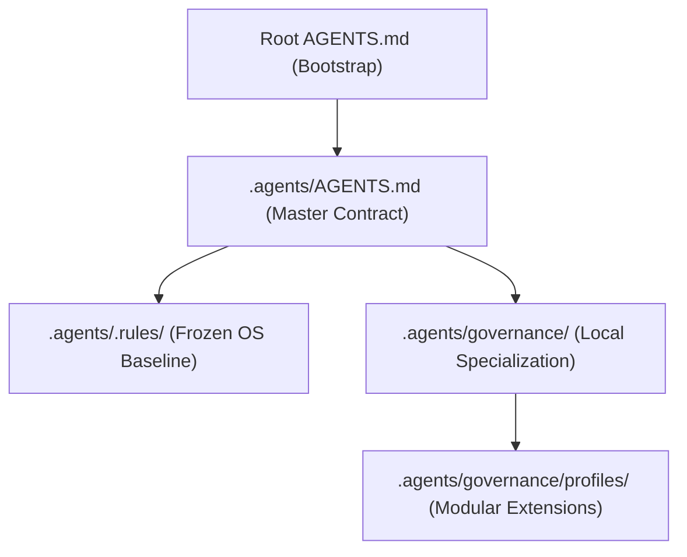

# Final Truth Pass — Phase 2: Source of Truth Map

This document provides the definitive map of the Agent Harness V3 Operating System.

## 1. Governance Architecture

## 2. Location Matrix

| Component | Location | Owner |
|---|---|---|
| **Entrypoint** | `AGENTS.md` (root) | Project Lead |
| **Reusable OS Rules** | `.agents/.rules/` | Agent OS |
| **Local Project Rules** | `.agents/governance/` | Project Team |
| **Machine Evidence** | `.agents/management/evidence/` | Agents |
| **Human Dashboard** | `EVIDENCE/` | Humans |
| **Profiles** | `.agents/governance/profiles/` | Reusable Assets |
| **Schemas** | `.agents/config/schemas/` | Governance Engine |
| **Compatibility Layer**| `projects/` | Legacy Samples |

## 3. Lifecycles

### Bootstrap Lifecycle
1.  **Read**: Agent reads root `AGENTS.md`.
2.  **Verify**: Agent verifies OS installation via `.agents/.rules/`.
3.  **Resolve**: Agent resolves the `Applied Governance Stack`.
4.  **Adopt**: Agent loads relevant profiles from `.agents/governance/profiles/`.

### Evidence Lifecycle
1.  **Phase**: Agent executes a phase (e.g., implementation).
2.  **Raw**: Agent captures raw logs to `.agents/management/evidence/raw/`.
3.  **Machine**: Agent writes schema-validated proof to `.agents/management/evidence/phases/`.
4.  **Human**: Agent updates the human-readable dashboard in `EVIDENCE/`.

## 4. Rule Precedence (High to Low)
1.  Root `AGENTS.md` (Overrides everything)
2.  `.agents/AGENTS.md` (Global project rules)
3.  `.agents/governance/core/` (Critical OS lifecycle)
4.  `.agents/governance/profiles/` (Selected specializations)
5.  `.agents/.rules/` (Fallback OS baseline)
