# PolyMoly: Integration Plan

This document is the project-level map for the PolyMoly product and runtime
repository.

Its job is simple:

- explain what the product must do
- show how the current repository solves it
- make the implementation easy to review without reverse-engineering the whole
  codebase

The canonical product and release brief is kept in
[`README.md`](../../../../README.md), [`ARCHITECTURE.md`](../../../../ARCHITECTURE.md), and
[`system/docs/development/release/current.md`](../../development/release/current.md).

---

## Mission Snapshot

The product connects:

- developer intent as the starting point
- a generated `.polymoly/` sidecar as the managed project boundary
- a pure engine that turns intent into a runtime decision
- adapter lanes that touch Docker, files, shell, network, and release proof
- evidence and rollback paths so the operator can trust the result

The repository implements a Go-based product/runtime system with:

- `product/` for user-facing vocabulary and operator stories
- `system/engine/**` for `request -> resolve -> preview -> apply` law
- `system/adapters/**` for side effects and platform boundaries
- `system/tools/poly/**` for the thin CLI entrypoint and operator tooling
- docs, gates, review-pack flows, and release proof files for trust

### Quick read

- `product/` contains the user-facing flow lanes
- `system/engine/**` contains the pure decision core
- `system/adapters/**` contains execution boundaries
- `system/tools/poly/cmd/poly/main.go` is the canonical CLI entrypoint
- generated projects keep `src/` separate from `.polymoly/`
- `system/docs/development/release/current.md` is the active release truth

---

## Task Coverage

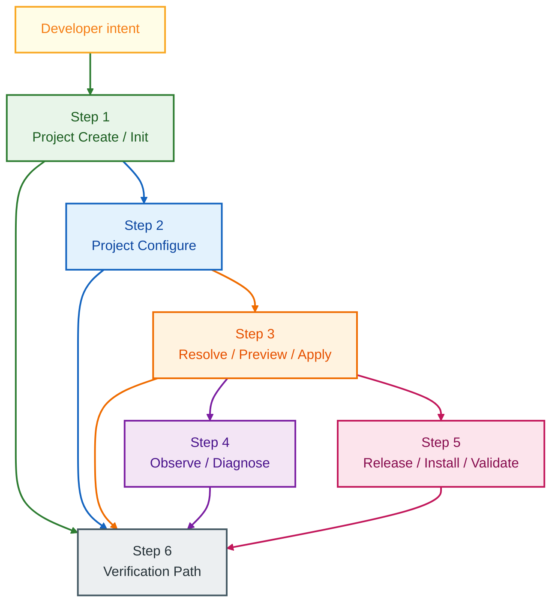

### Quick read

- project create and init flow are implemented
- configure and intent-mutation flow are implemented
- engine resolve, preview, and apply flow are implemented
- inspect and diagnosis flow are implemented
- install, release, and validation flow are implemented
- canonical verification path exists through tests, gates, and review artifacts

### Step by step

- Step 1: We create or initialize a managed project.
- Step 2: We change project intent without hand-editing hidden state.
- Step 3: We turn intent into a resolved plan, preview, and explicit apply
  handoff.
- Step 4: We read runtime state, preview diffs, and diagnose failures.
- Step 5: We prepare install artifacts, prove release safety, and validate
  promoted behavior.
- Step 6: We verify the repository through canonical gates, tests, and review
  artifacts.

---

## Runtime Architecture

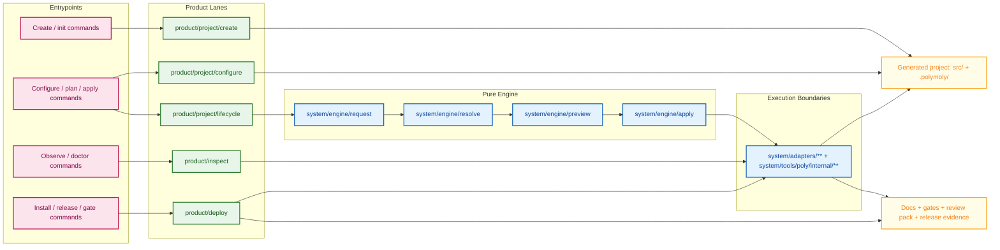

### What this means

- `system/tools/poly/cmd/poly/main.go` stays a thin CLI entrypoint
- `product/` owns user-facing words and operator stories
- `system/engine/**` stays pure and deterministic until the apply handoff
- `system/adapters/**` and tooling boundaries own side effects
- generated project state and proof artifacts stay visible instead of hidden

This is intentional. It keeps the product story readable and prevents the CLI,
engine, or adapters from silently becoming each other.

This overview is intentionally neutral and does not use business step numbering,
because it supports multiple flows at once.

---

## Repository Map

```text
product/
  deploy/
    prepare/
    release/
    validate/
  ecosystem/
    plugins/
  examples/
  inspect/
    diagnose/
    observe/
    preview/
  project/
    configure/
    create/
    lifecycle/

system/
  adapters/
  engine/
    apply/
    generate/
    preview/
    request/
    resolve/
  shared/
  tools/poly/
    cmd/poly/main.go
    internal/
  docs/development/
    architecture/
    governance/
    release/

ARCHITECTURE.md
README.md
QUICKSTART.md
TODO.md
BUGS.md
```

### Quick read

- `product/` is the human-facing system map
- `system/` is the technical execution map
- `system/tools/poly/` is the operator entrypoint and control surface
- `system/docs/development/` carries architecture, governance, and release truth
- root documents define the product contract and the active system story

---

## Delivery Board

This board is meant to feel like an execution board, not a product backlog.

It tracks:

- what is already grounded in the repository baseline
- what is implemented and ready for broader live environment proof
- what remains as a deliberate next production step

### Green Lane: Verified in Repository Baseline

| Task ID | Area | Summary | Priority | Status | Evidence |
| :--- | :--- | :--- | :--- | :--- | :--- |
| T-0 | Foundation | Thin CLI, product/system split, generated project boundary, active release contract | P0 | `Verified` | `README.md`, `ARCHITECTURE.md`, and `system/docs/development/release/current.md` describe the same baseline |
| T-1 | Project Flow | Create, init, wizard, template, and configure lanes shape project intent | P0 | `Verified` | `product/project/create/**` and `product/project/configure/**` are the shipped flow owners |
| T-2 | Engine Flow | Request, resolve, preview, and apply stay split from side effects | P0 | `Verified` | `system/engine/**` and `system/adapters/**` keep the boundary visible |
| T-3 | Inspect Flow | Observe, preview, describe, metrics, doctor, and history lanes are present | P1 | `Verified` | `product/inspect/**` owns the read and diagnosis story |
| T-4 | Release Flow | Install, release proof, rollback safety, and promoted validation are first-class | P0 | `Verified` | `product/deploy/**` plus release-proof docs keep this surface explicit |

### Blue Lane: Implemented and Ready for Live Upstream Proof

| Task ID | Area | Summary | Priority | Status | Evidence |
| :--- | :--- | :--- | :--- | :--- | :--- |
| B-1 | Install Channels | Homebrew, Scoop, and shell-install distribution stories exist in the product surface | P1 | `Implemented` | Live proof depends on target host and packaging environment |
| B-2 | Promoted Runtime | Stage smoke and promoted runtime checks exist as real validation paths | P0 | `Implemented` | Live proof depends on a real staged or promoted environment |
| B-3 | Optional Surfaces | Dashboard, enterprise, template catalog, and advisory surfaces exist as optional lanes | P2 | `Implemented` | Live proof depends on the specific external context for each lane |

### Gray Lane: Next Production Steps

| Task ID | Area | Summary | Priority | Status | Evidence |
| :--- | :--- | :--- | :--- | :--- | :--- |
| N-1 | Documentation | Keep this integration book synced with architecture, release, and command truth | P0 | `Next Step` | This file becomes misleading if the repo moves without it |
| N-2 | Runtime Proof | Add more public end-to-end proof stories for representative framework families | P1 | `Next Step` | The repository already has examples and generated project flows to anchor that proof |
| N-3 | Install Proof | Extend install and update proof across more host-family environments | P1 | `Next Step` | Current install surfaces exist, but broader host proof is environment-dependent |
| N-4 | Performance Posture | Publish measured examples for larger project topologies before making broader scale claims | P2 | `Next Step` | Current repository posture stays correctness-first instead of claiming unmeasured scale |

---

## Foundation Overview

The technical layer is deliberately split and direct.

- the CLI entrypoint stays thin
- `product/` owns user-visible flow language
- `system/engine/**` owns pure decision work
- `system/adapters/**` and tooling own external side effects
- generated project state, review artifacts, and release proof stay visible

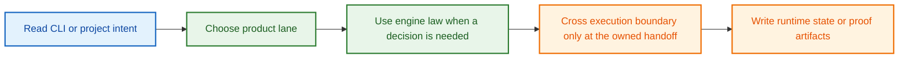

### Quick read

- no second hidden core
- no silent side effects inside the engine
- no mixing repository source with generated project state
- everything important to trust is meant to stay inspectable

This overview is intentionally neutral and does not use business step numbering,
because it prepares every feature flow.

## Step 1: Project Create / Init

The project create flow is responsible for turning an empty or existing target
directory into a safe PolyMoly-managed project start.

Main files:

- `product/project/create/create_pipeline.go`
- `product/project/create/create_request_contract.go`
- `product/project/create/runtime/resolve_scaffold_runtime.go`
- `product/project/create/scaffold/write_project_starter.go`
- `product/project/create/scaffold/ensure_target_directory_is_safe.go`
- `product/project/create/template/template_pipeline.go`
- `product/project/create/wizard/process_wizard_questionnaire.go`

What it does:

- reads a create, init, or wizard request
- decides runtime, framework, template, or guided path
- refuses unsafe target directories
- writes starter files plus the `.polymoly/` baseline
- prints next-step guidance instead of hiding follow-up work

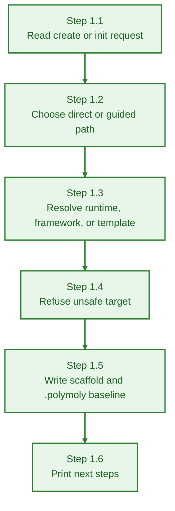

### Quick read

- create stays simple at the front door
- wizard joins only when the story needs it
- filesystem writes happen after the runtime decision is clear
- generated project source stays separate from repository source

### Step by step

- Step 1.1: We read whether the user wants `new`, `init`, or a guided wizard.
- Step 1.2: We decide whether the path is direct create or guided setup.
- Step 1.3: We resolve runtime, framework hints, and optional template choice.
- Step 1.4: We stop if the target directory is unsafe to change.
- Step 1.5: We write starter files and the initial `.polymoly/` sidecar.
- Step 1.6: We return concrete next steps such as runtime and command hints.

### How this works

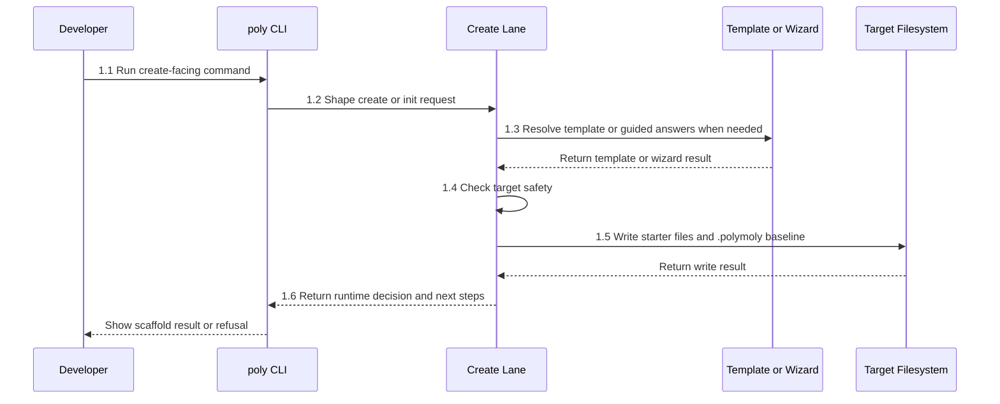

The create lane keeps runtime decision, template selection, and filesystem
safety together. That keeps project bootstrap from becoming a pile of partial
writes and hidden assumptions.

## Step 2: Project Configure

The configure flow changes an existing project setup safely.

Main files:

- `product/project/configure/configure_pipeline.go`
- `product/project/configure/configure_request_contract.go`
- `product/project/configure/baseline/prepare_configure_baseline_intent.go`
- `product/project/configure/parse/parse_requested_set_mutations.go`
- `product/project/configure/parse/parse_requested_service_shorthands.go`
- `product/project/configure/mutate/apply_configuration_mutations.go`
- `product/project/configure/mutate/mutation_options.go`
- `product/project/configure/mutate/preserve_explicit_template_overrides.go`
- `product/project/configure/render/render_profile_upgrade_summary.go`
- `product/project/configure/replace/replace_pipeline.go`

What it does:

- reads a configure-style mutation request
- parses key-value changes and shorthand service additions
- loads or prepares the base intent
- keeps explicit template overrides visible
- applies one normalized mutation result
- prints clear upgrade guidance before the next runtime step

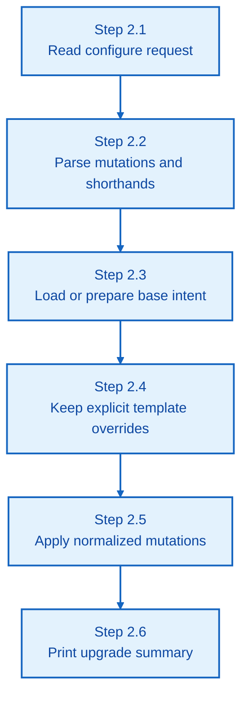

### Quick read

- no hand-editing hidden state
- one normalized intent result instead of several partial edits
- explicit template overrides stay visible
- profile upgrade notes stay human-readable

### Step by step

- Step 2.1: We read the requested setup change.
- Step 2.2: We turn raw input into typed mutations.
- Step 2.3: We load or prepare the current project intent.
- Step 2.4: We keep explicit template-driven overrides instead of losing them.
- Step 2.5: We apply the requested changes into one normalized next intent.
- Step 2.6: We print small guidance when the change widens profile capability.

### How this works

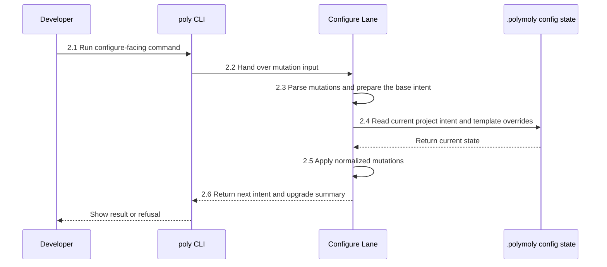

The configure lane is narrow on purpose. It turns raw input into one safe
intent result before any engine or runtime work continues.

## Step 3: Resolve / Preview / Apply

This is the pure engine path that turns project intent into a concrete runtime
decision.

Main files:

- `system/engine/request/read_and_validate_user_request.go`
- `system/engine/request/make_platform_config_ready.go`
- `system/engine/resolve/resolve_requested_modules.go`
- `system/engine/resolve/map_service_graph.go`
- `system/engine/resolve/merge_execution_policies.go`
- `system/engine/generate/make_final_render_model.go`
- `system/engine/preview/generate_system_diff_preview.go`
- `system/engine/preview/summarize_engine_preview.go`
- `system/engine/apply/apply_command_spec.go`
- `system/engine/apply/hand_over_engine_decision_to_adapters.go`

What it does:

- reads and validates the request
- makes platform config ready for the engine
- resolves requested modules and service topology
- merges execution policy into one decision
- makes the final render model and preview output
- hands the final command spec to adapters only at the explicit apply boundary

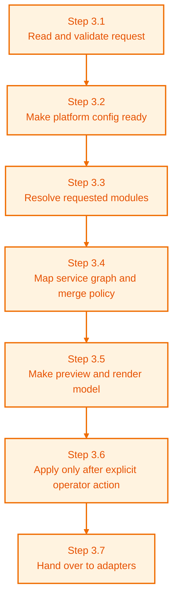

### Quick read

- the engine stays pure until adapter handoff
- preview is a first-class output instead of an afterthought
- apply is an explicit commit point
- the same law powers multiple product command stories

### Step by step

- Step 3.1: We read and validate the request.
- Step 3.2: We prepare platform config so the engine sees a clean input shape.
- Step 3.3: We resolve the requested modules and capability choices.
- Step 3.4: We map the service graph and merge execution policy.
- Step 3.5: We build the final render model and preview output.
- Step 3.6: We continue to apply only after explicit operator intent.
- Step 3.7: We hand the final command spec to adapters for side effects.

### How this works

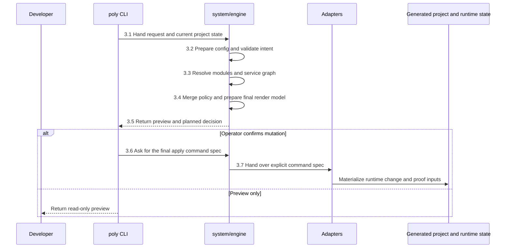

This is the most important boundary in the repository. The engine can reason,
compare, resolve, and preview, but it does not get to blur into runtime side
effects.

## Step 4: Observe / Diagnose

The inspect flow lets an operator understand the current system before making
another change.

Main files:

- `product/inspect/observe/observe_runtime_status.go`
- `product/inspect/observe/summarize_system_status.go`
- `product/inspect/observe/list_active_services.go`
- `product/inspect/observe/collect_runtime_metrics.go`
- `product/inspect/observe/describe_resource.go`
- `product/inspect/observe/visualize_system_graph.go`
- `product/inspect/diagnose/doctor_report.go`
- `product/inspect/diagnose/explain_state_logic.go`
- `product/inspect/observe/view_action_history.go`
- `product/inspect/preview/plan_execution_preview.go`
- `product/inspect/preview/render_state_diff.go`

What it does:

- reads project and runtime state without mutating it
- summarizes current status and active services
- describes one resource or the wider system graph
- collects metrics and history for debugging
- prepares preview and doctor output so the operator can act with context

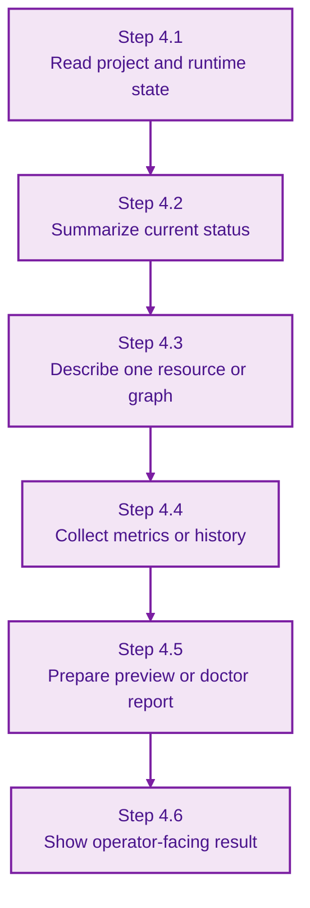

### Quick read

- inspect is read-first and explanation-first
- status, metrics, preview, and doctor stay close to one another
- the operator can answer "what is happening" before changing anything

### Step by step

- Step 4.1: We read the relevant project and runtime state.
- Step 4.2: We summarize the current status into a human-readable view.
- Step 4.3: We describe a service, resource, or whole graph when the operator drills down.
- Step 4.4: We collect metrics, action history, or supporting state.
- Step 4.5: We turn that data into preview or diagnosis output.
- Step 4.6: We return a visible result instead of forcing the operator to reverse-engineer internals.

### How this works

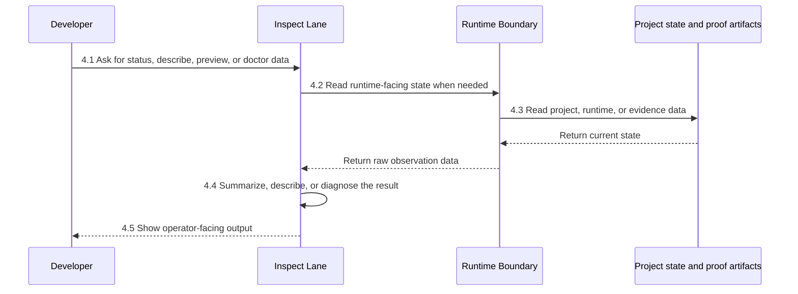

The inspect lane exists so operators do not have to treat runtime trust as a
guessing game. It gathers the read path, the preview path, and the diagnosis
path into one explainable surface.

## Step 5: Release / Install / Validate

The deploy flow turns the repository into a shippable and reviewable release
surface.

Main files:

- `product/deploy/deploy_pipeline.go`
- `product/deploy/install/install_project_cli.go`
- `product/deploy/release/prepare/generate_channels.go`
- `product/deploy/release/verify/check_release_proofs.go`
- `product/deploy/release/verify/check_rollback_safety.go`
- `product/deploy/release/verify/write_release_evidence_index.go`
- `product/deploy/validate/runtime/check_stage_smoke.go`
- `product/deploy/validate/runtime/check_promoted_runtime_state.go`
- `product/deploy/validate/runtime/restore_serving.go`

What it does:

- runs the deploy pipeline in a readable order: install, release prepare, release verify, validate runtime
- prepares install and distribution-channel artifacts from already-built release inputs
- checks release proof requirements before success is claimed
- checks rollback safety before promotion is considered complete
- validates stage smoke and promoted runtime state
- writes machine-readable evidence for later review

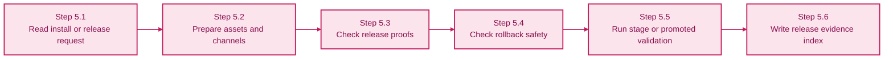

### Quick read

- install and release paths are explicit product surfaces
- evidence is part of success, not a side note
- rollback safety is checked before the release story is allowed to close
- the validate slice owns live promotion checks and containment helpers

### Step by step

- Step 5.1: We read whether the user wants install, release, or validation work.
- Step 5.2: We prepare artifacts, binaries, or distribution-channel outputs.
- Step 5.3: We refuse success when required release proofs are missing.
- Step 5.4: We check rollback safety before claiming the release path is safe.
- Step 5.5: We run stage smoke or promoted-runtime validation where that path is in scope.
- Step 5.6: We write evidence so later review does not depend on memory.

### How this works

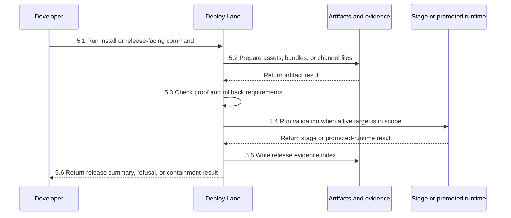

The deploy lane is where operator trust becomes formal. Install, release proof,
rollback safety, and validation are treated as part of the product surface
instead of as a pile of optional scripts.

---

## State and Integrity Model

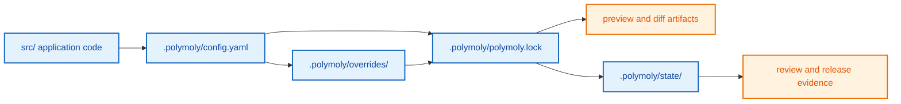

Important guarantees from the repository contract:

- repository source tree is separate from the generated project tree
- `src/` is application code, not hidden infrastructure state
- `.polymoly/config.yaml` is the editable intent boundary
- `.polymoly/overrides/` holds explicit exceptions instead of hidden magic
- `.polymoly/polymoly.lock` is the deterministic resolved baseline
- `.polymoly/state/` holds runtime-derived state and proof inputs
- review packs and release evidence turn claims into inspectable artifacts

### Quick read

- user code and managed state do not mean the same thing
- intent, lock, and state do not mean the same thing
- deterministic automation depends on that separation
- docs and proof files are part of integrity, not an afterthought

This overview is intentionally neutral and does not use business step numbering,
because the state model supports all flows together.

---

## Security Posture

This repository is broad in scope, but it is not casual about trust.

Implemented safeguards in the shipped contract and code paths:

- the pure engine is not allowed to perform shell execution, network calls,
  filesystem mutation, or runtime orchestration directly
- missing trust input, missing policy input, or missing evidence must fail
  closed
- unsafe behavior requires explicit opt-in and visibly unsafe output
- release and rollback proof are first-class outputs, not optional nice-to-have
- docs drift is treated as a real bug
- generated project state stays separate from application source
- policy boundaries live under
  `system/runtime/capabilities/security/policies/**`
- review-pack output keeps broad changes inspectable

Operator-minded interpretation:

- fail closed when trust or proof is missing
- keep side effects behind visible boundaries
- make rollback and containment explicit
- keep release claims tied to artifacts instead of tone

### Quick read

- this is not a claim that every live environment is already proven
- it is a deliberate fail-closed repository baseline
- production-ready labels depend on proof, not optimism

### Small performance notes

- deterministic lock and state handling are preferred over hidden caching
- diff-aware gate runs are local optimization only, not merge law
- profile layering reduces matrix sprawl without hiding behavior
- larger performance claims stay intentionally unclaimed unless measured

---

## Step 6: Verification Path

The canonical local verification path for this repository is below.

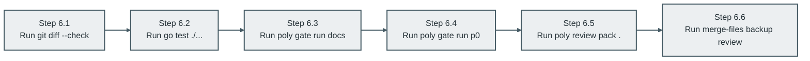

### Step by step

- Step 6.1: Check patch hygiene first.
- Step 6.2: Run the repository test baseline.
- Step 6.3: Validate docs truth through the canonical docs gate.
- Step 6.4: Validate the core product baseline through `p0`.
- Step 6.5: Produce the canonical review pack before final closure.
- Step 6.6: Produce the backup merged review artifact when a wide review is useful.

Canonical proof commands:

```bash
git diff --check
env TMPDIR=/tmp GOTMPDIR=/tmp GOCACHE=/tmp/gocache go test ./...
env TMPDIR=/tmp GOTMPDIR=/tmp GOCACHE=/tmp/gocache go run ./system/tools/poly/cmd/poly gate run docs
env TMPDIR=/tmp GOTMPDIR=/tmp GOCACHE=/tmp/gocache go run ./system/tools/poly/cmd/poly gate run p0
env TMPDIR=/tmp GOTMPDIR=/tmp GOCACHE=/tmp/gocache go run ./system/tools/poly/cmd/poly review pack .
env TMPDIR=/tmp GOTMPDIR=/tmp GOCACHE=/tmp/gocache bash merge-files.sh .
```

Expected success signals:

- `git diff --check` reports no patch hygiene errors
- `go test ./...` returns a clean package baseline
- `poly gate run docs` returns a passing docs contract
- `poly gate run p0` returns a passing core profile
- `poly review pack .` writes the review artifact path successfully
- `merge-files.sh .` produces a backup merged review artifact such as
  `polymoly.txt`

Two-part proof model:

- repository proof through the canonical commands above
- live operator proof through real generated-project stories such as
  `poly new -> poly up -> poly status` and release/stage validation in a target
  environment

---

## Design Decisions and Trade-offs

- The repository stays split into `product/` and `system/` so user vocabulary
  and execution law do not collapse into one layer.
- The CLI stays thin so command parsing does not become a second engine.
- The engine stays pure so request, resolve, preview, and apply remain
  deterministic and reviewable.
- Generated projects live outside repository source so operator state stays
  explicit.
- Evidence, rollback language, and release validation are treated as product
  requirements instead of as optional project management habits.
- Root docs, release docs, and code are expected to describe the same shipped
  system.
- Flow-first naming is used so a reader can move through the tree without a
  translation layer.
- Optional advanced surfaces are allowed, but they are not allowed to redefine
  the core ownership law.

### Quick read

- the goal was clarity over hidden automation
- the goal was operator trust over magic
- the goal was one system story from docs to runtime and back

---

## Known Limits

- Live install-channel proof still depends on real host-family environments and
  package-manager contexts.
- Promoted-runtime validation still depends on a real staged or promoted target.
- End-to-end generated-project proof across every framework family still depends
  on the host runtime and container environment available for that project.
- Optional advanced surfaces such as dashboard, enterprise, plugins, or
  advisory flows need their own live environment proof context.
- This file is a map of the system; it does not replace the narrower
  `how-this-works.md` pages inside the owned slices.
- If repository ownership or command truth moves, this file must move with it
  or it becomes a documentation bug.

---

## Next Production Steps

- keep this integration book synchronized with `README.md`,
  `ARCHITECTURE.md`, and the active release contract
- add more public end-to-end proof stories for representative framework
  families
- extend install and update proof across more host-family environments
- publish measured examples for larger project topologies before making broader
  scale claims
- keep optional advanced surfaces tied back to the same repository truth

---

## Final Note

This file is not meant to be a fantasy architecture document.

It is meant to mirror the current repository truthfully:

- what the product is trying to do
- how the repository is built
- which lanes own which parts of the story
- how the system is supposed to be verified
- what would be the next responsible production steps

That is the standard this repository is aiming for.

---

## 🦄 PolyMoly for Humans (PM Story: Laravel Edition)

This section exists for one very specific reason:

- you may not know the PolyMoly codebase yet
- you may not know Go yet
- you may still need a brutally clear explanation of what happens when you type
  a command

So this is the same system again, but told in a very direct PM-style way.

This is not the formal architecture layer.
This is the "make it impossible to misunderstand" layer.

---

### The shortest possible explanation

When you type:

```bash
poly new my-laravel-app --framework laravel
```

PolyMoly does six simple things:

1. it receives your command in the CLI
2. it decides what runtime you really asked for
3. it creates the first project intent
4. it writes starter files and the `.polymoly/` sidecar
5. later, it can turn that intent into a runtime plan
6. later, it can show status, diffs, and health for that project

```mermaid
flowchart LR
    classDef step1 fill:#E8F5E9,stroke:#2E7D32,stroke-width:2px,color:#1B5E20;
    classDef step2 fill:#E3F2FD,stroke:#1565C0,stroke-width:2px,color:#0D47A1;
    classDef step3 fill:#FFF3E0,stroke:#EF6C00,stroke-width:2px,color:#E65100;
    classDef step4 fill:#F3E5F5,stroke:#7B1FA2,stroke-width:2px,color:#4A148C;
    classDef step5 fill:#FCE4EC,stroke:#C2185B,stroke-width:2px,color:#880E4F;
    classDef step6 fill:#ECEFF1,stroke:#455A64,stroke-width:2px,color:#263238;

    A["1. You type<br/>poly new my-laravel-app --framework laravel"]:::step1 --> B["2. CLI receives the command"]:::step2
    B --> C["3. Runtime is inferred as php"]:::step3
    C --> D["4. Starter files are written"]:::step4
    D --> E["5. .polymoly config is written"]:::step5
    E --> F["6. Later: plan, apply, up, status"]:::step6
```

---

### What Laravel means inside PolyMoly

Laravel is not stored as "Laravel infrastructure".

Inside PolyMoly, `laravel` is first used as a **framework hint**.
That hint is translated into a **runtime**.
In the current repository, that means:

- `laravel` -> runtime `php`
- default starter shape for PHP is used
- default database for `php` runtime becomes `mysql` unless you override it

The important point is this:

- the framework name helps PolyMoly understand what kind of project you want
- the runtime is what PolyMoly actually uses to scaffold and reason about the
  project

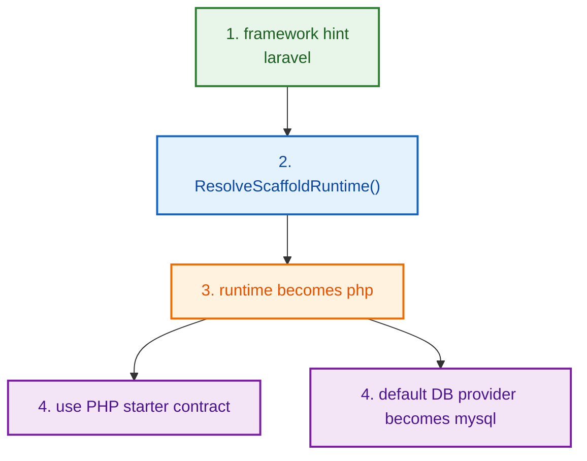

---

## PM Story 1: `poly new my-laravel-app --framework laravel`

This is the cleanest place to start, because it shows how PolyMoly receives a
human request and turns it into a project on disk.

### What you typed

```bash
poly new my-laravel-app --framework laravel
```

### What happens first

When you type that exact command, the first files and functions that matter are:

1. `system/tools/poly/cmd/poly/main.go`
   This is the process entrypoint for the PolyMoly binary.
2. `system/tools/poly/internal/cli/route_root_commands.go`
   Function: `RouteRootCommands(args []string) int`
   This reads the top-level command word.
3. `system/tools/poly/internal/cli/route_root_commands.go`
   In `RouteRootCommands`, the case `"new"` sends control into
   `runProjectNew(...)`.
4. `system/tools/poly/internal/cli/route_project_commands.go`
   Function: `runProjectNew(root string, args []string) int`
   This is the real front door for `poly new`.

If you want the ultra-literal version, the path is this:

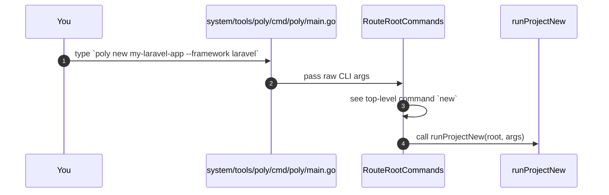

### What `runProjectNew(...)` actually does

`runProjectNew(...)` is not one giant magic function.
It does a series of very plain jobs:

- parse flags like `--framework`, `--lang`, `--profile`, `--database`
- figure out the target directory
- decide the runtime
- build the initial intent
- write starter source files
- write `.polymoly/config.yaml` and the rest of the sidecar
- print next steps

You can think of it like this:

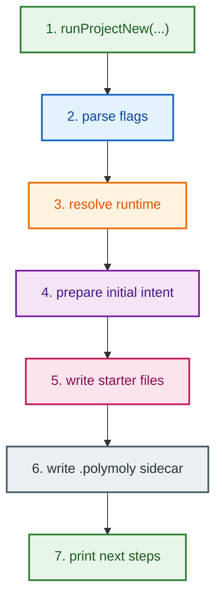

### Where Laravel becomes PHP

Inside `runProjectNew(...)`, one of the key calls is:

- file:
  `system/tools/poly/internal/cli/route_project_commands.go`
- function:
  `resolveScaffoldRuntime(selectedRuntime, framework, templateRef, allowPrompt)`

That helper forwards into:

- file:
  `system/tools/poly/internal/product/project/create/create_forwarder.go`
- function:
  `ResolveScaffoldRuntime(...)`

And that compatibility file forwards into the real root product file:

- file:
  `product/project/create/create_pipeline.go`
- function:
  `ResolveScaffoldRuntime(...)`

That root function does the important reasoning:

- if you gave `--lang`, it keeps your explicit runtime
- if you gave `--framework laravel`, it infers `php`
- if the framework hint is unknown, it refuses and tells you to use `--lang`
- if it is interactive and runtime is missing, it can ask you to choose

This is the core Laravel explanation in one picture:

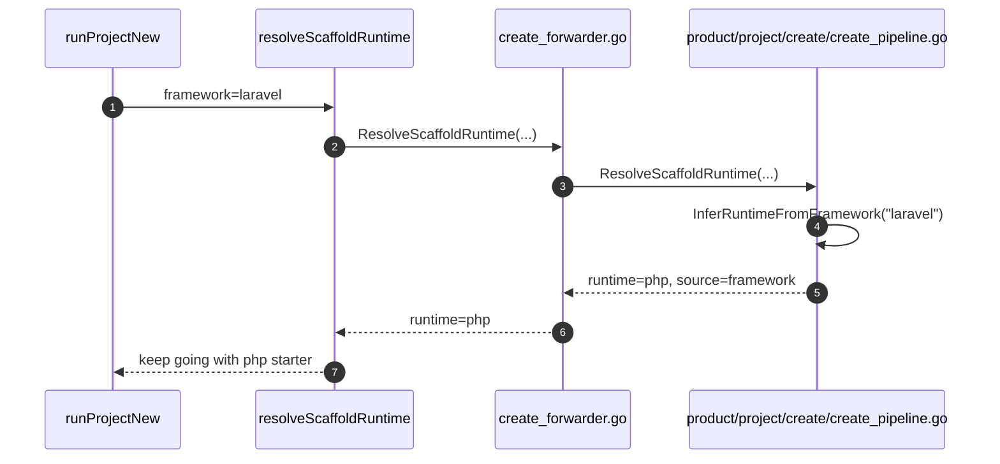

### What starter files get written for Laravel

In the current repository, Laravel does not mean "generate a full Laravel app".
It means:

- scaffold a PHP starter contract
- write a very small PHP-ready source shape
- create the PolyMoly sidecar for the managed project

The relevant file is:

- `product/project/create/create_pipeline.go`

Important functions there:

- `ExpectedStarterFiles(runtime string) []string`
- `WriteStarter(root, targetDir, runtime string) error`
- `ScaffoldNextSteps(projectName, runtime, framework) []string`

For runtime `php`, `WriteStarter(...)` writes:

- `src/public/index.php`
- `src/composer.json`

It copies the starter file from the PHP example starter and creates a minimal
`composer.json`.

### Where the `.polymoly` sidecar gets written

After the intent is prepared and starter files are in place, `runProjectNew(...)`
calls:

- compatibility file:
  `system/tools/poly/internal/system/shared/config/project_configuration.go`
- function:
  `WriteProject(projectRoot string, intent Intent) (Project, error)`

That forwards into the real shared config file:

- `system/shared/config/parse_project_configuration.go`
- function:
  `WriteProject(...)`

That is where the sidecar becomes real on disk.

So if you ask:

> "At what moment does this stop being just an idea and become an actual PolyMoly project?"

The short answer is:

- when `WriteStarter(...)` writes the source starter
- and when `WriteProject(...)` writes the `.polymoly` state

### What you see at the end of `poly new`

`runProjectNew(...)` prints a very direct summary:

- project path
- usage
- runtime
- framework hint, if you gave one
- profile
- recipe
- starter contract
- risk nudges
- next steps

For a Laravel-like story, the next steps come from:

- `product/project/create/create_pipeline.go`
- function:
  `ScaffoldNextSteps(...)`

That means the command is not only creating files.
It is also telling you what PolyMoly expects you to do next.

---

## PM Story 2: `poly wizard`

If `poly new` is the fast direct path, `poly wizard` is the path for someone
who wants the platform to ask questions first.

### What you typed

```bash
poly wizard
```

### Exact first hit

When you type that command, the path starts like this:

1. `system/tools/poly/cmd/poly/main.go`
2. `system/tools/poly/internal/cli/route_root_commands.go`
   Function: `RouteRootCommands(...)`
3. same file, case `"wizard"`
4. `system/tools/poly/internal/cli/route_project_commands.go`
   Function: `runProjectWizard(root, args)`

```mermaid
sequenceDiagram
    autonumber
    participant YOU as You
    participant ROOT as RouteRootCommands
    participant WIZARD as runProjectWizard

    YOU->>ROOT: type `poly wizard`
    ROOT->>ROOT: detect top-level command `wizard`
    ROOT->>WIZARD: call runProjectWizard(root, args)
```

### What `runProjectWizard(...)` does

`runProjectWizard(...)` handles:

- wizard mode:
  `quickstart`, `guided`, or `advanced`
- interactive answers
- non-interactive `--answers <file>`
- `--preview`
- optional `--write-answers`
- optional template onboarding via `--from`

That means `poly wizard` is not just "ask some cute questions".
It is a real onboarding interface for building the first project intent.

### What it asks in the wizard

There are two places to look:

- `product/project/create/wizard/default_flow.go`
  Function: `DefaultFlow() []Step`
- `product/project/create/wizard/process_wizard_questionnaire.go`
  Function: `DefaultQuestions() []Question`

Those define the base flow and the base question set.

The default human questions are:

- `What are you building?`
- `Which runtime should PolyMoly scaffold?`
- `Which profile should be the default?`

And the question contract options include:

- usage:
  `api`, `web`, `service`, `worker`, `custom`
- runtime:
  `php`, `node`, `go`, `fullstack`
- profile:
  `localhost`, `production`, `enterprise`

### What the CLI actually prompts

The real CLI prompt logic lives in:

- `system/tools/poly/internal/cli/collect_wizard_answers.go`

Important functions:

- `normalizeWizardMode(raw string) (string, error)`
- `promptWizardRuntime(reader, defaultValue)`
- `promptWizardAnswers(reader, base, mode)`
- `buildIntentFromWizardAnswers(cwd, base, answers, includeStarterServices)`
- `writeWizardAnswers(projectRoot, path, answers)`

If you run `poly wizard` interactively, the current code can ask things like:

- `Usage (api/web/service/worker/custom, ? for explain)`
- `Profile (localhost/production/enterprise, ? for explain)`
- `Recipe (standard/hardened/observability-plus, ? for explain)`
- `Database (postgres/mysql/none, ? for explain)`
- `Cache (redis/none, ? for explain)`
- `Gateway (traefik/none, ? for explain)`
- and in advanced mode:
  `Database mode (container/external, ? for explain)`

The runtime prompt is especially explicit.
It offers numbered choices:

- `1) go`
- `2) node`
- `3) php`
- `4) fullstack`

And if you type `?`, it explains the difference in plain language.

```mermaid
flowchart TD
    classDef step1 fill:#E8F5E9,stroke:#2E7D32,stroke-width:2px,color:#1B5E20;
    classDef step2 fill:#E3F2FD,stroke:#1565C0,stroke-width:2px,color:#0D47A1;
    classDef step3 fill:#FFF3E0,stroke:#EF6C00,stroke-width:2px,color:#E65100;
    classDef step4 fill:#F3E5F5,stroke:#7B1FA2,stroke-width:2px,color:#4A148C;
    classDef step5 fill:#FCE4EC,stroke:#C2185B,stroke-width:2px,color:#880E4F;

    A["1. poly wizard"]:::step1 --> B["2. runProjectWizard(...)"]:::step2
    B --> C["3. normalize wizard mode"]:::step3
    C --> D["4. collect answers"]:::step4
    D --> E["5. build intent from answers"]:::step5
    E --> F["6. preview or apply onboarding result"]:::step1
```

### What `--preview` changes

If you run:

```bash
poly wizard --preview
```

then `runProjectWizard(...)` does **not** write the project.

Instead, it:

- builds an intent from your answers
- creates a plan with `PlanIntentChanges(...)`
- prints a plan
- prints a diff
- prints next steps like:
  `poly wizard --yes`

That makes `wizard` safe for learning.
You can inspect what PolyMoly would do before letting it write anything.

---

## PM Story 3: `poly plan`

Once a project already exists, `poly plan` is the most important "show me
exactly what will change" command.

### What you typed

```bash
poly plan --runtime php --database mysql --profile production
```

### Exact first hit

The top-level path is:

1. `system/tools/poly/cmd/poly/main.go`
2. `system/tools/poly/internal/cli/route_root_commands.go`
   case `"plan"`
3. `system/tools/poly/internal/cli/route_project_commands.go`
   function `runProjectPlan(root, args)`

### What `runProjectPlan(...)` really does

It does these plain steps:

- load the current project
- read the requested mutations from flags
- calculate the desired next intent
- compare current vs desired
- save the pending plan into the sidecar
- print a human-readable plan
- print a diff

The key calls are:

- `loadProjectOrDefault(root)`
- `applyConfigurationMutations(project.Config, options)`
- `projectcfg.PlanIntentChanges(current, desired)`
- `projectcfg.SavePlan(project.Root, plan)`
- `projectcfg.RenderPlan(plan)`
- `projectcfg.RenderDiff(plan)`

This is the practical meaning of `poly plan`:

> "Do not change the project yet. Just show me the exact next state and save it
> as a pending plan."

```mermaid
sequenceDiagram
    autonumber
    participant YOU as You
    participant PLAN as runProjectPlan
    participant CFG as shared config helpers
    participant SIDECAR as .polymoly

    YOU->>PLAN: type `poly plan --runtime php --database mysql --profile production`
    PLAN->>CFG: load current project config
    PLAN->>CFG: apply requested mutations
    PLAN->>CFG: PlanIntentChanges(current, desired)
    PLAN->>SIDECAR: SavePlan(...)
    PLAN-->>YOU: print plan + diff + next steps
```

### Where the pending plan lives

The important thing to understand is this:

- `poly plan` is not just terminal output
- it also writes a real pending plan artifact into the sidecar

That is why `poly apply` can come later and know exactly what it is applying.

---

## PM Story 4: `poly apply`

`poly apply` is the moment where preview becomes commitment.

### What you typed

```bash
poly apply
```

### Exact first hit

The top-level path is:

1. `system/tools/poly/cmd/poly/main.go`
2. `system/tools/poly/internal/cli/route_root_commands.go`
   case `"apply"`
3. `system/tools/poly/internal/cli/route_project_commands.go`
   function `runProjectApply(root, args)`

That function immediately delegates to:

- `applyPendingPlan(root, yes, allowStalePlan, "poly apply", true)`

### Why this matters

PolyMoly does **not** trust a plan blindly.

`applyPendingPlan(...)` does important safety work:

- loads the pending plan
- refuses if no pending plan exists
- skips safely if the plan has no changes
- checks whether the current baseline still matches the plan baseline
- refuses stale plan apply unless unsafe override is explicit
- can ask for confirmation
- writes the new sidecar config
- clears the pending plan after success
- appends project history

This is one of the strongest trust points in the whole repo.

```mermaid
flowchart TD
    classDef step1 fill:#E8F5E9,stroke:#2E7D32,stroke-width:2px,color:#1B5E20;
    classDef step2 fill:#E3F2FD,stroke:#1565C0,stroke-width:2px,color:#0D47A1;
    classDef step3 fill:#FFF3E0,stroke:#EF6C00,stroke-width:2px,color:#E65100;
    classDef step4 fill:#F3E5F5,stroke:#7B1FA2,stroke-width:2px,color:#4A148C;
    classDef step5 fill:#FCE4EC,stroke:#C2185B,stroke-width:2px,color:#880E4F;
    classDef step6 fill:#ECEFF1,stroke:#455A64,stroke-width:2px,color:#263238;

    A["1. poly apply"]:::step1 --> B["2. runProjectApply(...)"]:::step2
    B --> C["3. applyPendingPlan(...)"]:::step3
    C --> D["4. load pending plan"]:::step4
    D --> E["5. check baseline digest"]:::step5
    E --> F["6. confirm with user"]:::step6
    F --> G["7. WriteProject(...)"]:::step1
    G --> H["8. ClearPlan(...)"]:::step2
    H --> I["9. AppendHistory(...)"]:::step3
```

### The plain-English meaning

If you want the most direct explanation possible:

- `poly plan` says:
  "here is what I would change"
- `poly apply` says:
  "I checked that the plan is still valid, I asked for confirmation if needed,
  and now I am making that sidecar change real"

Important nuance:

- this command updates the project sidecar state
- it does not automatically mean "all runtime containers are already started"

That is why runtime commands exist separately.

---

## PM Story 5: `poly up`

After the project intent and sidecar are in a good state, `poly up` is the
command people usually expect to "make the system run".

### What you typed

```bash
poly up
```

### Exact first hit

The command path is:

1. `system/tools/poly/cmd/poly/main.go`
2. `system/tools/poly/internal/cli/route_root_commands.go`
   case `"up"`
3. `system/tools/poly/internal/cli/route_runtime_commands.go`
   function `runRuntimeCommand(root, "up", args)`
4. same file
   function `runUp(root, envName, services, dryRun, fastStart)`

### What `runUp(...)` actually does

At a very direct level, `runUp(...)`:

- checks fast-start conditions if you asked for `--fast-start`
- makes sure the configurator image exists when needed
- creates a compose command contract
- runs that command
- prints runtime-ready and discovery summaries after success

Important files and functions in this path:

- `system/tools/poly/internal/cli/route_runtime_commands.go`
  - `runUp(...)`
- `system/tools/poly/internal/contracts/...`
  - `ComposeCommand(...)`
- `system/engine/apply/apply_command_spec.go`
  - `ApplyCommandSpec(...)`

Very important clarity point:

- `ApplyCommandSpec(...)` is a generic command executor
- it is **not** hardcoded to one specific shell string
- it executes the command spec that the runtime path decided to use

```mermaid
sequenceDiagram
    autonumber
    participant YOU as You
    participant ROOT as RouteRootCommands
    participant RT as runRuntimeCommand
    participant UP as runUp
    participant SPEC as ComposeCommand
    participant APPLY as ApplyCommandSpec

    YOU->>ROOT: type `poly up`
    ROOT->>RT: route action `up`
    RT->>UP: call runUp(...)
    UP->>SPEC: build runtime command spec
    SPEC-->>UP: return command spec
    UP->>APPLY: execute command spec
    APPLY-->>UP: exit code and output
    UP-->>YOU: print runtime-ready summary
```

### What you usually see after success

When `poly up` succeeds, PolyMoly can print:

- `Application ready`
- estimated endpoints
- service discovery hints

That summary is produced through:

- `printRuntimeReadySummary(root)`
- `printRuntimeReadySummaryFromIntent(intent)`
- `printRuntimeDiscoverySummary(root)`

So when you see "Application ready", that is not random text.
It comes from a very specific part of the runtime CLI flow.

---

## PM Story 6: `poly status`

If `poly up` is "start it", then `poly status` is:

> "Tell me what is actually happening right now."

### What you typed

```bash
poly status
```

### Exact first hit

The command path is:

1. `system/tools/poly/cmd/poly/main.go`
2. `system/tools/poly/internal/cli/route_root_commands.go`
   case `"status"`
3. `system/tools/poly/internal/cli/route_runtime_commands.go`
   function `runRuntimeCommand(root, "status", args)`
4. same file
   function `runStatus(root, envName, services)`

### What `runStatus(...)` does

This function is more interesting than it looks.
It does not just print "up" or "down".

It:

- loads the project
- calculates the effective intent for the chosen environment
- tries to load compose/runtime rows
- prints expected services
- prints observed services
- prints endpoints
- can also print runtime health warnings

Key calls in the file:

- `projectcfg.EffectiveIntent(project.Root, project.Config, envName)`
- `loadComposeRows(root, envName)`
- `renderIntentServiceSummary(...)`
- `buildRuntimeDelta(root, envName, effectiveIntent)`

This means `poly status` is really doing a comparison:

- what the project says should exist
- what the runtime actually shows right now

```mermaid
flowchart TD
    classDef step1 fill:#E8F5E9,stroke:#2E7D32,stroke-width:2px,color:#1B5E20;
    classDef step2 fill:#E3F2FD,stroke:#1565C0,stroke-width:2px,color:#0D47A1;
    classDef step3 fill:#FFF3E0,stroke:#EF6C00,stroke-width:2px,color:#E65100;
    classDef step4 fill:#F3E5F5,stroke:#7B1FA2,stroke-width:2px,color:#4A148C;
    classDef step5 fill:#FCE4EC,stroke:#C2185B,stroke-width:2px,color:#880E4F;
    classDef step6 fill:#ECEFF1,stroke:#455A64,stroke-width:2px,color:#263238;

    A["1. poly status"]:::step1 --> B["2. runStatus(...)"]:::step2
    B --> C["3. load current project"]:::step3
    C --> D["4. compute effective intent"]:::step4
    D --> E["5. read observed runtime rows"]:::step5
    E --> F["6. compare expected vs observed"]:::step6
    F --> G["7. print services, endpoints, warnings"]:::step1
```

### What "health" means here

This is important because it is easy to misunderstand.

The lifecycle helper:

- file:
  `product/project/lifecycle/control/check_project_runtime_health.go`
- function:
  `Healthy(root, envName, intent)`

does **not** simply ping one PHP port.

Instead, it asks the observe layer to describe runtime drift:

- `observe.DescribeRuntimeDelta(root, envName, intent)`
- `observe.RuntimeDeltaHasDrift(delta)`

So the real idea is:

- if actual runtime matches expected runtime closely enough, health is good
- if there is drift, missing services, or unexpected services, health is not good

That is a much more honest definition than "container process exists".

---

## One full Laravel onboarding story in one picture

If you want one giant visual summary, this is the one to keep in your head:

```mermaid
flowchart TD
    classDef step1 fill:#E8F5E9,stroke:#2E7D32,stroke-width:2px,color:#1B5E20;
    classDef step2 fill:#E3F2FD,stroke:#1565C0,stroke-width:2px,color:#0D47A1;
    classDef step3 fill:#FFF3E0,stroke:#EF6C00,stroke-width:2px,color:#E65100;
    classDef step4 fill:#F3E5F5,stroke:#7B1FA2,stroke-width:2px,color:#4A148C;
    classDef step5 fill:#FCE4EC,stroke:#C2185B,stroke-width:2px,color:#880E4F;
    classDef step6 fill:#ECEFF1,stroke:#455A64,stroke-width:2px,color:#263238;

    A["1. You type<br/>poly new my-laravel-app --framework laravel"]:::step1 --> B["2. RouteRootCommands -> runProjectNew"]:::step2
    B --> C["3. ResolveScaffoldRuntime -> runtime php"]:::step3
    C --> D["4. PrepareInitialIntent -> first project intent"]:::step4
    D --> E["5. WriteStarter -> src/public/index.php + composer.json"]:::step5
    E --> F["6. WriteProject -> .polymoly/config.yaml and sidecar files"]:::step6
    F --> G["7. poly plan -> save pending plan"]:::step1
    G --> H["8. poly apply -> validate and commit sidecar change"]:::step2
    H --> I["9. poly up -> build runtime command spec and execute"]:::step3
    I --> J["10. poly status -> compare expected state vs observed state"]:::step4
```

---

## If you only remember five things

1. `poly new` creates the project and sidecar.
2. `poly wizard` asks questions and can preview before writing.
3. `poly plan` saves a pending change without applying it.
4. `poly apply` validates and commits that pending sidecar change.
5. `poly up` and `poly status` are runtime commands, not just config commands.

---

## Final plain-language summary

If you want the most brutally direct explanation possible:

- when you type a PolyMoly command, it first hits the CLI router
- the CLI router picks the owned command function
- that function either creates intent, changes intent, previews intent, or runs
  a runtime command
- sidecar state lives under `.polymoly/`
- runtime action is a separate step from sidecar planning
- status and health are based on expected-vs-observed reality, not on wishful
  thinking

That is the practical mental model for reading this repository, even if you do
not know Go yet.
