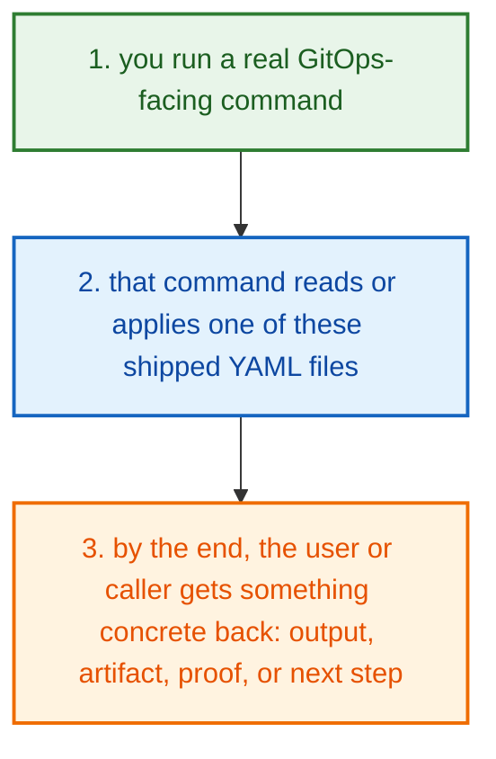
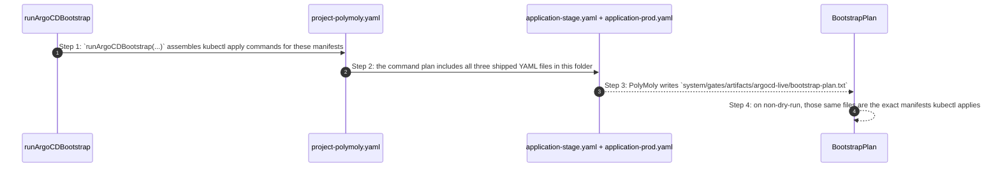
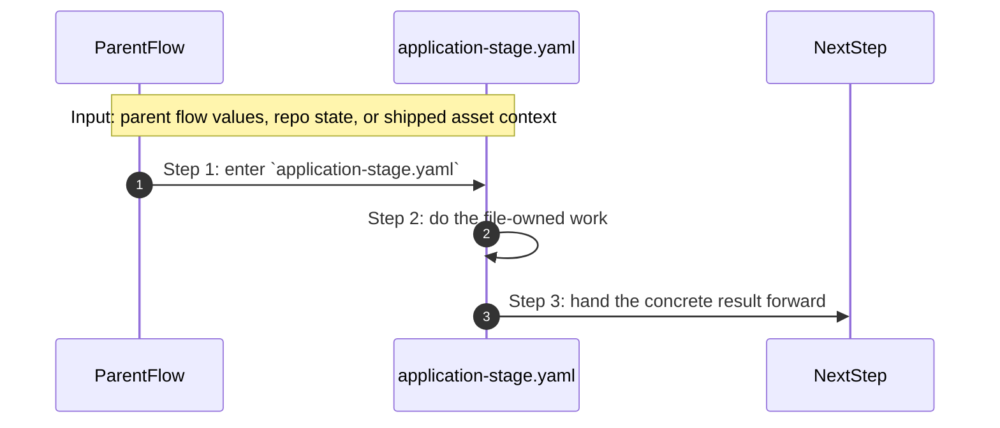

# Product Deploy Release Verify Gitops How This Works

## What this folder is

`product/deploy/release/verify/gitops/` is the home of the shipped GitOps manifests PolyMoly trusts and applies.

These YAML files are not abstract decoration. Real commands read or apply them.

## Real commands that reach this folder

- `poly argocd bootstrap`
- `poly argocd repo-lock`
- `poly release promoted-runtime-proof`
- `poly doctor`

## Exact CLI front doors

- `system/tools/poly/internal/cli/route_root_commands.go`
- function: `RouteRootCommands(args []string) int`
- `poly argocd ...` -> `runArgoCD(...)` in `route_argocd_commands.go`
- `poly release ...` -> `runRelease(...)` in `route_operator_commands.go`

## The simplest story

- you run a command that needs the shipped ArgoCD application manifests
- the command reads or applies one of the YAML files in this folder as-is
- by the end, PolyMoly either proves the GitOps contract, updates manifest references, or applies the manifests to the cluster



## The first important path

When you type:

```bash
poly argocd bootstrap --dry-run
```

the important path is:



- **Step 1:** This folder matters because the manifests here are directly applied, not regenerated on the fly.
- **Step 2:** `poly argocd bootstrap` is the clearest story because it names these files one by one.
- **Step 3:** Release checks and doctor checks also read these files to prove the GitOps contract is still present.
- **Step 4:** If GitOps behavior looks wrong, these YAML files are first-class debugging targets.

## Direct files in this folder

### `application-prod.yaml`

This file ships the `application-prod.yaml` config, policy, or data asset that the next technical step reads directly.

Why this name is honest:

- the file name already tells you what concrete artifact or config lives here

When the story opens this file:

- when the `product/deploy/release/verify/gitops/` story needs this responsibility, it opens `application-prod.yaml`

What arrives here:

- the next render, runtime, or browser step reads this shipped asset as-is

What leaves this file:

- the shipped `application-prod.yaml` asset
- a concrete file the next render or runtime step can read directly

Why you open it first:

- open this file when the generated or shipped asset itself looks wrong


- **Step 1:** The story reaches `application-prod.yaml` because this file owns the next small responsibility.
- **Step 2:** The file does its own narrow action instead of mixing it into a bigger caller.
- **Step 3:** The next caller gets a concrete result, not another vague promise.

Important functions:

This file does not expose top-level functions. That is fine. The file itself is the artifact the next step reads.

### `application-stage.yaml`

This file ships the `application-stage.yaml` config, policy, or data asset that the next technical step reads directly.

Why this name is honest:

- the file name already tells you what concrete artifact or config lives here

When the story opens this file:

- when the `product/deploy/release/verify/gitops/` story needs this responsibility, it opens `application-stage.yaml`

What arrives here:

- the next render, runtime, or browser step reads this shipped asset as-is

What leaves this file:

- the shipped `application-stage.yaml` asset
- a concrete file the next render or runtime step can read directly

Why you open it first:

- open this file when the generated or shipped asset itself looks wrong



- **Step 1:** The story reaches `application-stage.yaml` because this file owns the next small responsibility.
- **Step 2:** The file does its own narrow action instead of mixing it into a bigger caller.
- **Step 3:** The next caller gets a concrete result, not another vague promise.

Important functions:

This file does not expose top-level functions. That is fine. The file itself is the artifact the next step reads.

### `project-polymoly.yaml`

This file ships the `project-polymoly.yaml` config, policy, or data asset that the next technical step reads directly.

Why this name is honest:

- the file name already tells you what concrete artifact or config lives here

When the story opens this file:

- when the `product/deploy/release/verify/gitops/` story needs this responsibility, it opens `project-polymoly.yaml`

What arrives here:

- the next render, runtime, or browser step reads this shipped asset as-is

What leaves this file:

- the shipped `project-polymoly.yaml` asset
- a concrete file the next render or runtime step can read directly

Why you open it first:

- open this file when the generated or shipped asset itself looks wrong


- **Step 1:** The story reaches `project-polymoly.yaml` because this file owns the next small responsibility.
- **Step 2:** The file does its own narrow action instead of mixing it into a bigger caller.
- **Step 3:** The next caller gets a concrete result, not another vague promise.

Important functions:

This file does not expose top-level functions. That is fine. The file itself is the artifact the next step reads.

## Child folders in this folder

This folder has no child folders in scope.

## Debug first

- start with `application-prod.yaml` when the shipped asset or contract itself looks wrong
- start with `application-stage.yaml` when the shipped asset or contract itself looks wrong
- start with `project-polymoly.yaml` when the shipped asset or contract itself looks wrong

## What to remember

- `product/deploy/release/verify/gitops/` exists so this slice has one obvious home.
- The fastest map is still the naming law: folder for flow, file for responsibility, function for exact action.
- If the visible result is wrong, start with the first direct file that owns the next honest action in the flow.

## Dictionary

<a id="dictionary-product"></a>
- `product`: The product surface is the human-facing side of PolyMoly. It groups behavior into stories a user can name.
<a id="dictionary-command"></a>
- `command`: A command is the sentence the user types, like `poly install` or `poly status`. It is the thing that wakes the flow up.
<a id="dictionary-lane"></a>
- `lane`: A lane is one named stream of ownership. It tells you which folder should answer the next question.
<a id="dictionary-project"></a>
- `project`: A project is one real app workspace plus the `.polymoly/` sidecar that records what that workspace should become.
<a id="dictionary-intent"></a>
- `intent`: Intent is the desired project shape before the live runtime proves or disproves it.
<a id="dictionary-runtime"></a>
- `runtime`: Runtime is the live or rendered execution world PolyMoly starts, previews, reads, or validates.
<a id="dictionary-artifact"></a>
- `artifact`: An artifact is a file or bundle another step can read later, like a manifest, proof, package, or summary.
