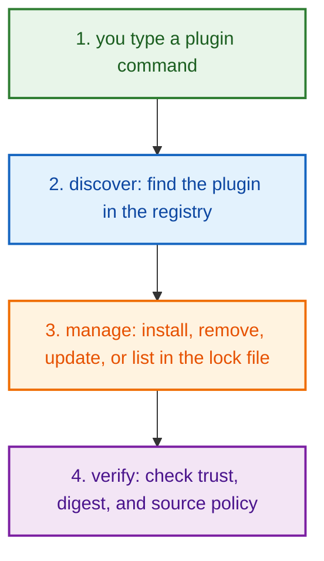

# Product Ecosystem How This Works

## What this folder is

`product/ecosystem/` is the product-facing ecosystem pipeline for PolyMoly.

It answers the question "what extra building block can I bring into this setup, and can PolyMoly trust it?"

## Pipeline law in this folder

- folder says the pipeline step
- file says one responsibility inside that step
- function says one exact action

The canonical pipeline shape here is:

```text
ecosystem/
  ecosystem_pipeline.go
  plugin/
  discover/
  manage/
  verify/
```

## Real commands that reach this folder

- `poly plugin search [term]`
- `poly plugin install <name>`
- `poly plugin list`
- `poly plugin update <name>`
- `poly plugin remove <name>`

## Exact CLI front doors

- `system/tools/poly/internal/cli/route_root_commands.go`
- function: `RouteRootCommands(args []string) int`
- `poly plugin ...` -> `runPlugin(...)` in `route_plugin_and_experience_commands.go`

## The simplest story

- you type `poly plugin ...`
- this folder sequences: discover the plugin in the registry, manage its lifecycle in the lock file, verify its trust
- by the end, PolyMoly either installs, lists, updates, removes, or refuses a plugin with a clear reason



## Direct files in this folder

### `ecosystem_pipeline.go`

- `RunEcosystemPipeline(input)`
  This is the canonical in-code orchestration map for the ecosystem pipeline.
  It runs only the steps the caller asked for, but it preserves the pipeline
  order: discover, manage, verify.

### `plugins.index.yaml`

This file ships the plugin catalog that the discover step reads directly.
When the catalog itself looks wrong, open this file.

## Child folders in this folder

### `plugin/`

Shared types and helpers used by all pipeline steps.

Contains: `PluginDescriptor`, `Registry`, `PluginLock`, `Compatibility`,
`NormalizeDescriptor()`, `CompareVersions()`, and constants.

### `discover/`

This step owns registry loading, searching, and resolution.

Use it when the story includes:

- `poly plugin search [term]`
- resolving a plugin by name and version from the registry

Key functions:

- `RegistryPath()` — resolves the registry file path
- `LoadRegistry()` — parses and normalizes the YAML registry
- `SearchRegistry()` — searches by name, command, or capability
- `ResolveFromRegistry()` — resolves a specific plugin by name+version

### `manage/`

This step owns plugin lifecycle: install, remove, update, and lock management.

Use it when the story includes:

- `poly plugin install <name>`
- `poly plugin list`
- `poly plugin update <name>`
- `poly plugin remove <name>`

Key functions:

- `LoadLock()` — reads the lock file
- `SaveLock()` — writes the lock file
- `ListInstalled()` — returns sorted installed plugins
- `Install()` — validates trust, writes to lock, records history
- `Remove()` — removes from lock, records history
- `ResolveInstall()` — resolves from registry for install
- `ResolveLatest()` — resolves latest version for update
- `FindInstalledByCommand()` — searches lock by command name

### `verify/`

This step owns trust validation and executable verification.

Use it when the story includes:

- checking whether a plugin source is trusted
- verifying a plugin digest against the executable

Key functions:

- `ValidateTrust()` — validates signature mode, source trust, and digest
- `ResolveExecutableForTrust()` — resolves executable path for digest checking
- `ResolveExecutable()` — resolves executable path (non-trust variant)

## Boundary Contracts

Each step has a strict boundary contract defined in its main file:

- **discover**: `MAY` read the registry and search/resolve plugins. `MUST NOT` read/write the lock file or perform trust validation. Mutating state is forbidden.
- **manage**: `MAY` read/write the lock file and call verify/discover. `MUST NOT` parse the registry directly (use discover) or implement trust logic natively (use verify).
- **verify**: `MAY` perform SHA-256 checks, validate signatures, and check trust policy. `MUST NOT` read the registry or the lock file.
- **plugin**: `MAY` define shared types and pure normalization/comparison logic. `MUST NOT` import any ecosystem sub-package (`plugin` is the leaf node) and `MUST NOT` perform I/O.

## Debug first

- open `discover/` when registry loading, search, or resolution looks wrong
- open `manage/` when install, update, list, or remove behavior looks wrong
- open `verify/` when trust validation or digest checking looks wrong
- start with `plugins.index.yaml` when the shipped catalog itself looks wrong

## What to remember

- `product/ecosystem/` is one pipeline slice, not just a loose collection of plugin helpers
- the root file is the canonical flow map
- the child folders are the real pipeline steps
- if a path is not a real pipeline step, it should not live directly here

## Dictionary

<a id="dictionary-product"></a>
- `product`: The product surface is the human-facing side of PolyMoly. It groups behavior into stories a user can name.
<a id="dictionary-command"></a>
- `command`: A command is the sentence the user types, like `poly install` or `poly status`. It is the thing that wakes the flow up.
<a id="dictionary-lane"></a>
- `lane`: A lane is one named stream of ownership. It tells you which folder should answer the next question.
<a id="dictionary-project"></a>
- `project`: A project is one real app workspace plus the `.polymoly/` sidecar that records what that workspace should become.
<a id="dictionary-runtime"></a>
- `runtime`: Runtime is the live or rendered execution world PolyMoly starts, previews, reads, or validates.
<a id="dictionary-artifact"></a>
- `artifact`: An artifact is a file or bundle another step can read later, like a manifest, proof, package, or summary.
