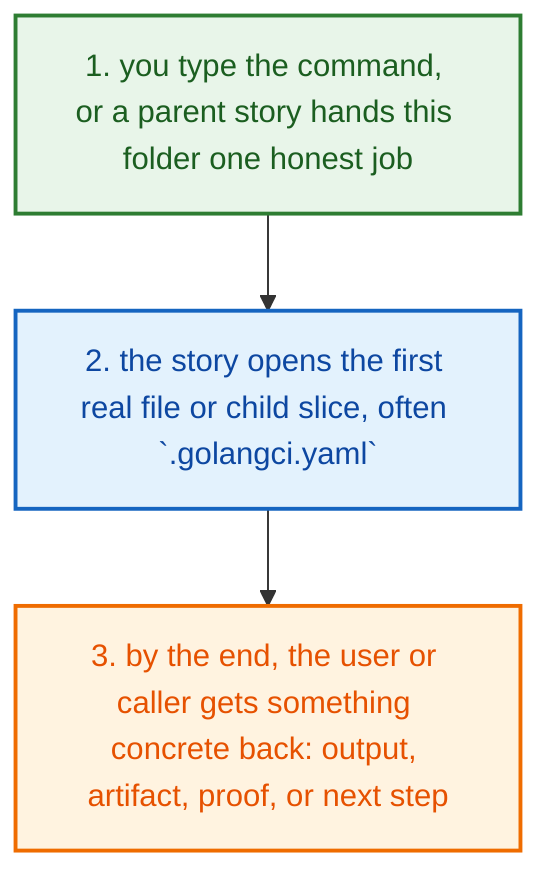
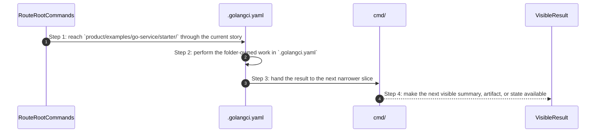
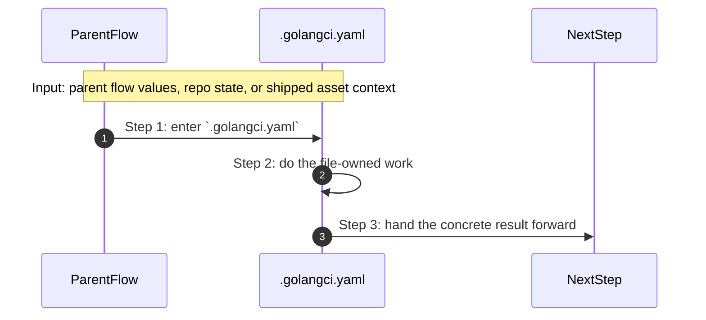
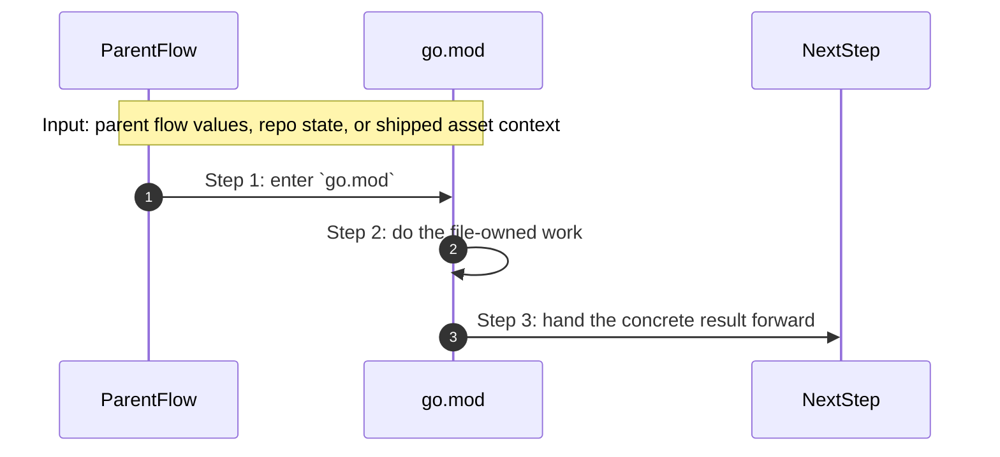

# Product Examples Go Service Starter How This Works

## What this folder is

`product/examples/go-service/starter/` holds the shipped starter version of this example.

Open it when you want to see the minimal file set PolyMoly would scaffold before a user starts customizing the app.

## Real commands that reach this folder

- example authors update these folders
- onboarding readers open these folders to compare starter output with a finished app

## Exact CLI front doors

- `system/tools/poly/internal/cli/route_root_commands.go`
- function: `RouteRootCommands(args []string) int`
- this folder is the product-facing map the CLI reaches after root routing chooses a human story

## The simplest story

- you type a real PolyMoly command, or a higher caller reaches this folder for one specific reason
- this folder opens the first direct file or child slice that does the next real job, often `.golangci.yaml`
- at the end, the caller has something concrete: a summary, an artifact, a proof, or a next step



## The first important path

When you type:

```text
example authors update these folders
```

the important path is:



- **Step 1:** This is the moment the story actually enters this folder instead of staying in a higher router or parent helper.
- **Step 2:** The first real work starts in `.golangci.yaml`.
- **Step 3:** From here, the story moves to one smaller file, child slice, or boundary that can do the next concrete job.
- **Step 4:** At the end, the caller has something concrete to carry forward: a file on disk, a rendered asset, a proof artifact, or a clear next state.

## Direct files in this folder

### `.golangci.yaml`

This file ships the `.golangci.yaml` config, policy, or data asset that the next technical step reads directly.

Why this name is honest:

- the file name already tells you what concrete artifact or config lives here

When the story opens this file:

- when the `product/examples/go-service/starter/` story needs this responsibility, it opens `.golangci.yaml`

What arrives here:

- the next render, runtime, or browser step reads this shipped asset as-is

What leaves this file:

- the shipped `.golangci.yaml` asset
- a concrete file the next render or runtime step can read directly

Why you open it first:

- open this file when the generated or shipped asset itself looks wrong



- **Step 1:** The story reaches `.golangci.yaml` because this file owns the next small responsibility.
- **Step 2:** The file does its own narrow action instead of mixing it into a bigger caller.
- **Step 3:** The next caller gets a concrete result, not another vague promise.

Important functions:

This file does not expose top-level functions. That is fine. The file itself is the artifact the next step reads.

### `go.mod`

This file ships the `go.mod` asset that the next technical step reads directly.

Why this name is honest:

- the file name already tells you what concrete artifact or config lives here

When the story opens this file:

- when the `product/examples/go-service/starter/` story needs this responsibility, it opens `go.mod`

What arrives here:

- the next render, runtime, or browser step reads this shipped asset as-is

What leaves this file:

- the shipped `go.mod` asset
- a concrete file the next render or runtime step can read directly

Why you open it first:

- open this file when the generated or shipped asset itself looks wrong



- **Step 1:** The story reaches `go.mod` because this file owns the next small responsibility.
- **Step 2:** The file does its own narrow action instead of mixing it into a bigger caller.
- **Step 3:** The next caller gets a concrete result, not another vague promise.

Important functions:

This file does not expose top-level functions. That is fine. The file itself is the artifact the next step reads.

### `go.sum`

This file ships the `go.sum` asset that the next technical step reads directly.

Why this name is honest:

- the file name already tells you what concrete artifact or config lives here

When the story opens this file:

- when the `product/examples/go-service/starter/` story needs this responsibility, it opens `go.sum`

What arrives here:

- the next render, runtime, or browser step reads this shipped asset as-is

What leaves this file:

- the shipped `go.sum` asset
- a concrete file the next render or runtime step can read directly

Why you open it first:

- open this file when the generated or shipped asset itself looks wrong


- **Step 1:** The story reaches `go.sum` because this file owns the next small responsibility.
- **Step 2:** The file does its own narrow action instead of mixing it into a bigger caller.
- **Step 3:** The next caller gets a concrete result, not another vague promise.

Important functions:

This file does not expose top-level functions. That is fine. The file itself is the artifact the next step reads.

## Child folders in this folder

### `cmd/`

Open [`cmd/how-this-works.md`](./cmd/how-this-works.md).

Use it when the story includes:

- example authors update these folders
- onboarding readers open these folders to compare starter output with a finished app

## Debug first

- start with `.golangci.yaml` when the shipped asset or contract itself looks wrong
- start with `go.mod` when the shipped asset or contract itself looks wrong
- start with `go.sum` when the shipped asset or contract itself looks wrong

## What to remember

- `product/examples/go-service/starter/` exists so this slice has one obvious home.
- The fastest map is still the naming law: folder for flow, file for responsibility, function for exact action.
- If the folder overview feels too wide, jump to the child slice that matches the current symptom instead of reading sideways.

## Dictionary

<a id="dictionary-product"></a>
- `product`: The product surface is the human-facing side of PolyMoly. It groups behavior into stories a user can name.
<a id="dictionary-command"></a>
- `command`: A command is the sentence the user types, like `poly install` or `poly status`. It is the thing that wakes the flow up.
<a id="dictionary-lane"></a>
- `lane`: A lane is one named stream of ownership. It tells you which folder should answer the next question.
<a id="dictionary-project"></a>
- `project`: A project is one real app workspace plus the `.polymoly/` sidecar that records what that workspace should become.
<a id="dictionary-intent"></a>
- `intent`: Intent is the desired project shape before the live runtime proves or disproves it.
<a id="dictionary-runtime"></a>
- `runtime`: Runtime is the live or rendered execution world PolyMoly starts, previews, reads, or validates.
<a id="dictionary-artifact"></a>
- `artifact`: An artifact is a file or bundle another step can read later, like a manifest, proof, package, or summary.
