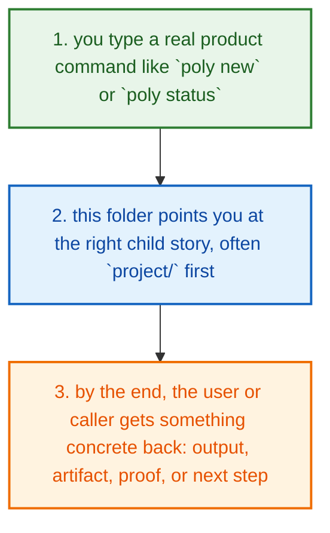
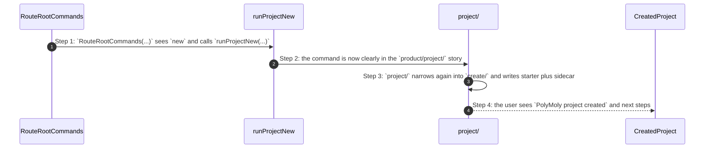

# Product How This Works

## What this folder is

`product/` is the human-facing map of PolyMoly.

When you type a real `poly ...` command, this is the part of the repo that
answers the simple question: "which big user story am I in right now?"

This map starts after you already have source code or a runnable Poly binary.
`git clone polymoly` is earlier than this folder. Clone only downloads source
into a developer workspace. It is not build, release, or deploy, and it does
not route through `product/`.

## Shape law inside product

`product/` is a flow map, not one giant pipeline.

The rule is:

- root `product/` maps a real command into the right product story
- each child story keeps the simplest honest shape for that domain
- some child stories are lanes, like `project/`, `inspect/`, and `ecosystem/`
- some child stories can be true pipelines when the work is ordered end to end

Current canonical pipeline example:

```text
product/deploy/
  deploy_pipeline.go
  install/
  release/
    prepare/
    verify/
  validate/
    runtime/
```

That means the naming law stays the same everywhere:

- folder says the flow
- file says one responsibility
- function says one exact action

## Real commands that reach this folder

- `poly new ...`
- `poly install`
- `poly self-update`
- `poly status`
- `poly release ...`
- `poly plugin ...`

## Exact CLI front doors

- `system/tools/poly/internal/cli/route_root_commands.go`
- function: `RouteRootCommands(args []string) int`
- `poly new ...` -> `runProjectNew(...)`
- `poly status` -> `runStatus(...)`
- `poly install` and `poly self-update` -> `runInstall(...)` and
  `runSelfUpdate(...)`
- `poly release ...` -> `runRelease(...)`
- `poly plugin ...` -> `runPlugin(...)`

## The simplest story

- you type a real command like `poly new`, `poly status`, or `poly plugin install`
- `RouteRootCommands(...)` picks the matching product story: `project/`, `inspect/`, `deploy/`, or `ecosystem/`
- once you are in the right child folder, the rest of the debugging story becomes much simpler
- the child names are meant to stay honest:
  `project/` shapes one project, `inspect/` reads the live world,
  `deploy/` ships or proves PolyMoly artifacts, and `ecosystem/` covers
  templates plus plugins



## The first important path

When you type:

```bash
poly new my-app --framework laravel
```

the important path is:



- **Step 1:** The CLI root router decides which product story owns the command.
- **Step 2:** For `poly new`, that story is `project/`, not deploy, inspect, or ecosystem.
- **Step 3:** The narrower project docs explain the real create files and functions in detail.
- **Step 4:** On success, the user gets a created app folder, a `.polymoly/` sidecar, and human next-step output.

## Direct files in this folder

This folder has no direct first-party files besides this guide.

## Child folders in this folder

### `deploy/`

Open [`deploy/how-this-works.md`](./deploy/how-this-works.md).

Use it when the story includes:

- shipping or installing PolyMoly itself instead of just cloning the repo
- `poly install`
- `poly self-update`
- `poly release <docker-preflight|promoted-runtime-proof|stage-load-smoke|restore-serving-proof|evidence-index|dist-channels>`

### `ecosystem/`

Open [`ecosystem/how-this-works.md`](./ecosystem/how-this-works.md).

Use it when the story includes:

- `poly plugin ...`
- `poly template search [term]`
- `poly template show <template>`
- `poly template install <template> [name]`

### `examples/`

Open [`examples/how-this-works.md`](./examples/how-this-works.md).

Use it when the story includes:

- example authors update these folders
- onboarding readers open these folders to compare starter output with a finished app

### `inspect/`

Open [`inspect/how-this-works.md`](./inspect/how-this-works.md).

Use it when the story includes:

- `poly status`
- `poly doctor`
- `poly logs`
- `poly dashboard [--open]`

### `project/`

Open [`project/how-this-works.md`](./project/how-this-works.md).

Use it when the story includes:

- `poly new ...`
- `poly init ...`
- `poly wizard ...`
- `poly set ...`
- `poly add ...`
- `poly open`
- `poly events`

## Debug first

- open `deploy/how-this-works.md` when the symptom clearly belongs to that child story
- open `ecosystem/how-this-works.md` when the symptom clearly belongs to that child story
- open `examples/how-this-works.md` when the symptom clearly belongs to that child story
- open `inspect/how-this-works.md` when the symptom clearly belongs to that child story
- open `project/how-this-works.md` when the symptom clearly belongs to that child story

## What to remember

- `git clone polymoly` is only a development start; `product/` begins when a
  real `poly ...` command or shipped Poly binary is in play.
- `product/` exists so each user story has one obvious home.
- not every child story is a pipeline, but every child story should still be
  readable through the same naming law.
- The fastest map is still the naming law: folder for flow, file for responsibility, function for exact action.
- If the folder overview feels too wide, jump to the child slice that matches the current symptom instead of reading sideways.

## Dictionary

<a id="dictionary-product"></a>
- `product`: The product surface is the human-facing side of PolyMoly. It groups behavior into stories a user can name.
<a id="dictionary-command"></a>
- `command`: A command is the sentence the user types, like `poly install` or `poly status`. It is the thing that wakes the flow up.
<a id="dictionary-lane"></a>
- `lane`: A lane is one named stream of ownership. It tells you which folder should answer the next question.
<a id="dictionary-project"></a>
- `project`: A project is one real app workspace plus the `.polymoly/` sidecar that records what that workspace should become.
<a id="dictionary-intent"></a>
- `intent`: Intent is the desired project shape before the live runtime proves or disproves it.
<a id="dictionary-runtime"></a>
- `runtime`: Runtime is the live or rendered execution world PolyMoly starts, previews, reads, or validates.
<a id="dictionary-artifact"></a>
- `artifact`: An artifact is a file or bundle another step can read later, like a manifest, proof, package, or summary.
