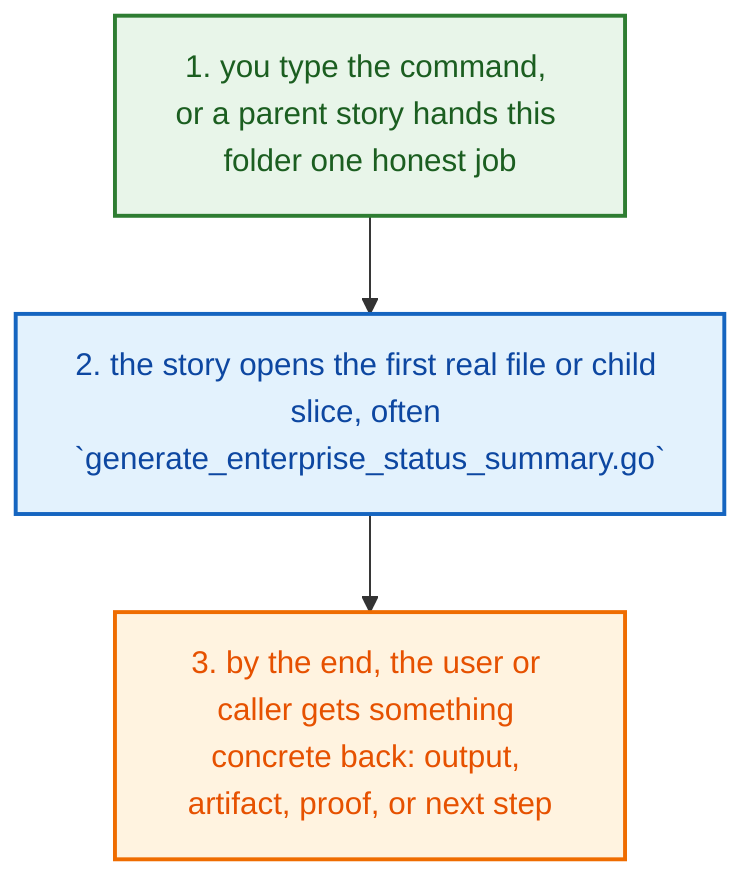
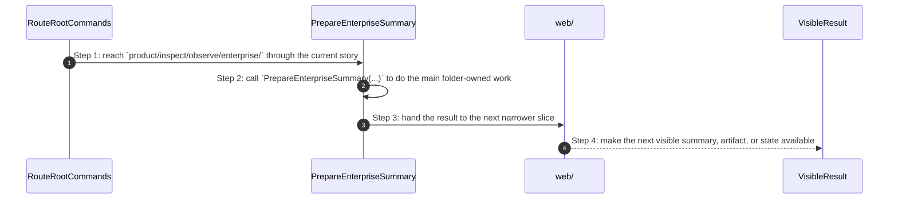
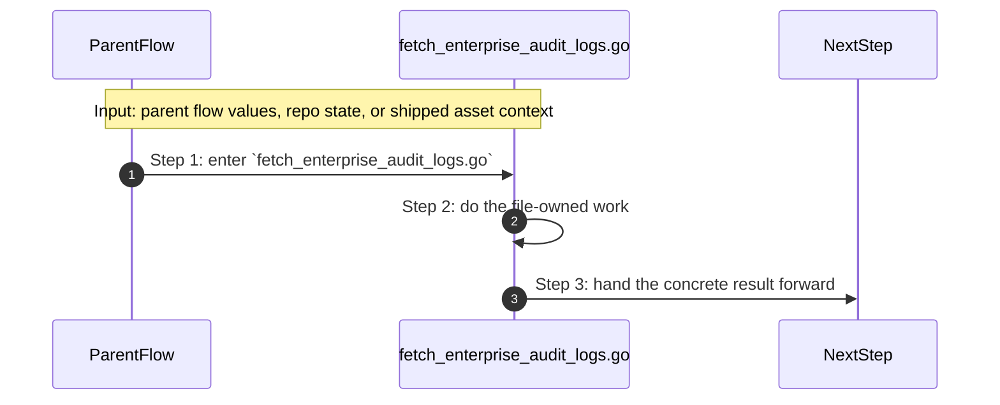
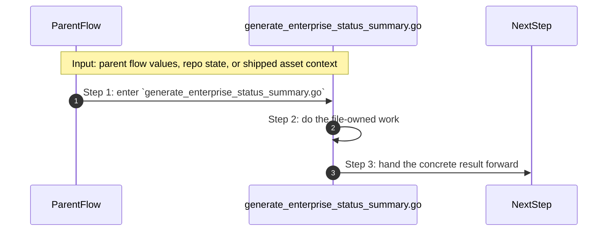

# Product Inspect Observe Enterprise How This Works

## What this folder is

`product/inspect/observe/enterprise/` is the enterprise-facing observe slice.

It gathers cluster, summary, and audit views that the enterprise story needs after the CLI or dashboard asks for them.

## Real commands that reach this folder

- `poly enterprise summary`
- `poly enterprise audit`
- `poly enterprise clusters`

## Exact CLI front doors

- `system/tools/poly/internal/cli/route_root_commands.go`
- function: `RouteRootCommands(args []string) int`
- `poly status` -> `runStatus(...)` in `route_runtime_commands.go`
- `poly doctor` -> `runDoctor(...)` in `route_runtime_commands.go`
- `poly dashboard ...` -> `runDashboard(...)` in `expand_variable_placeholders.go`
- `poly logs` and `poly events` -> `runLogs(...)` and `runProjectEvents(...)` in `route_runtime_commands.go`

## The simplest story

- you type a real PolyMoly command, or a higher caller reaches this folder for one specific reason
- this folder opens the first direct file or child slice that does the next real job, often `generate_enterprise_status_summary.go`
- at the end, the caller has something concrete: a summary, an artifact, a proof, or a next step



## The first important path

When you type:

```bash
poly enterprise summary
```

the important path is:



- **Step 1:** This is the moment the story actually enters this folder instead of staying in a higher router or parent helper.
- **Step 2:** The first real work starts in `generate_enterprise_status_summary.go` through `PrepareEnterpriseSummary(...)`.
- **Step 3:** From here, the story moves to one smaller file, child slice, or boundary that can do the next concrete job.
- **Step 4:** At the end, the caller has something concrete to carry forward: a file on disk, a rendered asset, a proof artifact, or a clear next state.

## Direct files in this folder

### `fetch_enterprise_audit_logs.go`

This file is one direct stop in the story for this folder.

Why this name is honest:

- its main action is still visible in the code, starting with `LimitAudit(...)`

When the story opens this file:

- when the `product/inspect/observe/enterprise/` story needs this responsibility, it opens `fetch_enterprise_audit_logs.go`

What arrives here:

- caller-provided values from the parent flow

What leaves this file:

- the result of `LimitAudit(...)` for the next caller
- a concrete return value, file write, check result, or summary depending on the path

Why you open it first:

- open this file when the symptom points to `LimitAudit(...)` doing the wrong thing



- **Step 1:** The story reaches `fetch_enterprise_audit_logs.go` because this file owns the next small responsibility.
- **Step 2:** The file does its own narrow action instead of mixing it into a bigger caller.
- **Step 3:** The next caller gets a concrete result, not another vague promise.

Important functions:

- `LimitAudit(...)`
  This is the main action in the file. It does the folder's primary job and returns the next concrete result.

### `generate_enterprise_status_summary.go`

This file is one direct stop in the story for this folder.

Why this name is honest:

- its main action is still visible in the code, starting with `PrepareEnterpriseSummary(...)`

When the story opens this file:

- when the `product/inspect/observe/enterprise/` story needs this responsibility, it opens `generate_enterprise_status_summary.go`

What arrives here:

- caller-provided values from the parent flow

What leaves this file:

- the result of `PrepareEnterpriseSummary(...)` for the next caller
- a concrete return value, file write, check result, or summary depending on the path

Why you open it first:

- open this file when the symptom points to `PrepareEnterpriseSummary(...)` doing the wrong thing



- **Step 1:** The story reaches `generate_enterprise_status_summary.go` because this file owns the next small responsibility.
- **Step 2:** The file does its own narrow action instead of mixing it into a bigger caller.
- **Step 3:** The next caller gets a concrete result, not another vague promise.

Important functions:

- `PrepareEnterpriseSummary(...)`
  This is the main action in the file. It does the folder's primary job and returns the next concrete result.
- `RenderSummary(...)`
  Small helper for one narrow sub-step. It exists so the main path stays readable.
- `LoadClusters(...)`
  Small helper for one narrow sub-step. It exists so the main path stays readable.
- `LoadAuditLog(...)`
  Small helper for one narrow sub-step. It exists so the main path stays readable.
- `MarshalSummary(...)`
  Small helper for one narrow sub-step. It exists so the main path stays readable.
- `parseClusterTarget(...)`
  Small helper for one narrow sub-step. It exists so the main path stays readable.
- `rbacReady(...)`
  Small helper for one narrow sub-step. It exists so the main path stays readable.
- `firstValueFile(...)`
  Small helper for one narrow sub-step. It exists so the main path stays readable.
- `blank(...)`
  Small helper for one narrow sub-step. It exists so the main path stays readable.

## Child folders in this folder

### `web/`

Open [`web/how-this-works.md`](./web/how-this-works.md).

Use it when the story includes:

- `poly enterprise summary`
- `poly enterprise audit`
- `poly enterprise clusters`

## Debug first

- start with `LimitAudit(...)` in `fetch_enterprise_audit_logs.go` when that action looks wrong
- start with `PrepareEnterpriseSummary(...)` in `generate_enterprise_status_summary.go` when that action looks wrong

## What to remember

- `product/inspect/observe/enterprise/` exists so this slice has one obvious home.
- The fastest map is still the naming law: folder for flow, file for responsibility, function for exact action.
- If the folder overview feels too wide, jump to the child slice that matches the current symptom instead of reading sideways.

## Dictionary

<a id="dictionary-product"></a>
- `product`: The product surface is the human-facing side of PolyMoly. It groups behavior into stories a user can name.
<a id="dictionary-command"></a>
- `command`: A command is the sentence the user types, like `poly install` or `poly status`. It is the thing that wakes the flow up.
<a id="dictionary-lane"></a>
- `lane`: A lane is one named stream of ownership. It tells you which folder should answer the next question.
<a id="dictionary-project"></a>
- `project`: A project is one real app workspace plus the `.polymoly/` sidecar that records what that workspace should become.
<a id="dictionary-intent"></a>
- `intent`: Intent is the desired project shape before the live runtime proves or disproves it.
<a id="dictionary-runtime"></a>
- `runtime`: Runtime is the live or rendered execution world PolyMoly starts, previews, reads, or validates.
<a id="dictionary-artifact"></a>
- `artifact`: An artifact is a file or bundle another step can read later, like a manifest, proof, package, or summary.
