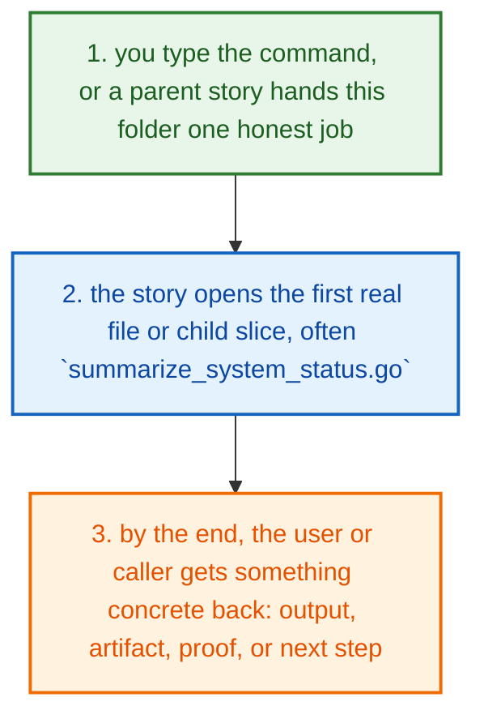
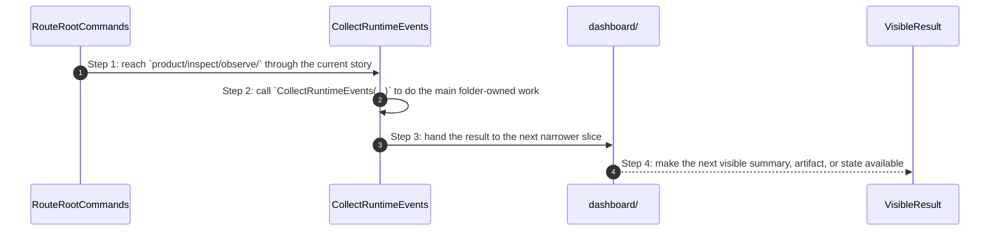
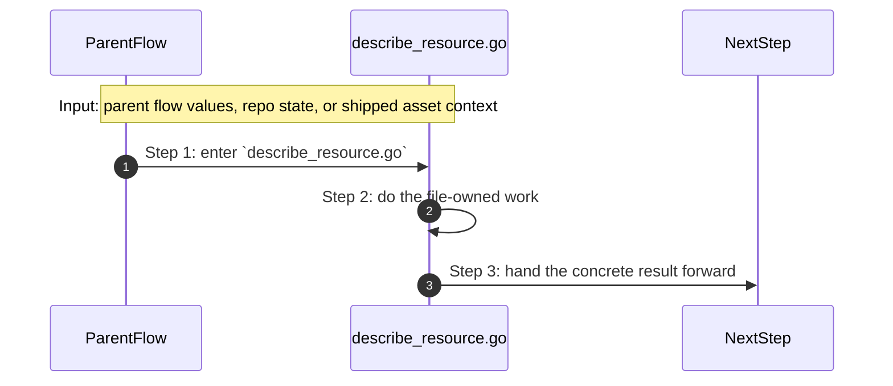
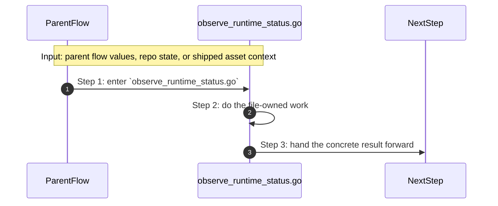
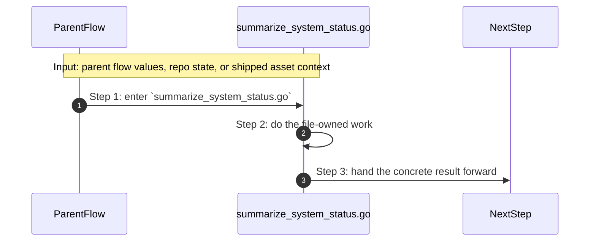
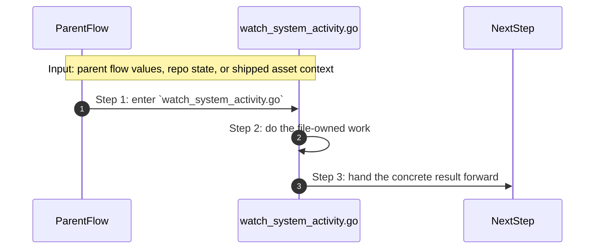

# Product Inspect Observe How This Works

## What this folder is

`product/inspect/observe/` is where PolyMoly reads live [runtime](#dictionary-runtime) state and turns it into status, logs, and topology views.

This folder is mostly about observation, not mutation. It asks the live system what is true right now.

## Real commands that reach this folder

- `poly status`
- `poly logs`
- `poly events`
- `poly dashboard [--open]`

## Exact CLI front doors

- `system/tools/poly/internal/cli/route_root_commands.go`
- function: `RouteRootCommands(args []string) int`
- `poly status` -> `runStatus(...)` in `route_runtime_commands.go`
- `poly doctor` -> `runDoctor(...)` in `route_runtime_commands.go`
- `poly dashboard ...` -> `runDashboard(...)` in `expand_variable_placeholders.go`
- `poly logs` and `poly events` -> `runLogs(...)` and `runProjectEvents(...)` in `route_runtime_commands.go`

## The simplest story

- you type a real PolyMoly command, or a higher caller reaches this folder for one specific reason
- this folder opens the first direct file or child slice that does the next real job, often `summarize_system_status.go`
- at the end, the caller has something concrete: a summary, an artifact, a proof, or a next step



## The first important path

When you type:

```bash
poly status
```

the important path is:



- **Step 1:** This is the moment the story actually enters this folder instead of staying in a higher router or parent helper.
- **Step 2:** The first real work starts in `summarize_system_status.go` through `CollectRuntimeEvents(...)`.
- **Step 3:** From here, the story moves to one smaller file, child slice, or boundary that can do the next concrete job.
- **Step 4:** At the end, the caller has something concrete to carry forward: a file on disk, a rendered asset, a proof artifact, or a clear next state.

## Direct files in this folder

### `collect_runtime_metrics.go`

This file is one direct stop in the story for this folder.

Why this name is honest:

- its main action is still visible in the code, starting with `CollectMetrics(...)`

When the story opens this file:

- when the `product/inspect/observe/` story needs this responsibility, it opens `collect_runtime_metrics.go`

What arrives here:

- caller-provided values from the parent flow

What leaves this file:

- the result of `CollectMetrics(...)` for the next caller
- a concrete return value, file write, check result, or summary depending on the path

Why you open it first:

- open this file when the symptom points to `CollectMetrics(...)` doing the wrong thing


- **Step 1:** The story reaches `collect_runtime_metrics.go` because this file owns the next small responsibility.
- **Step 2:** The file does its own narrow action instead of mixing it into a bigger caller.
- **Step 3:** The next caller gets a concrete result, not another vague promise.

Important functions:

- `CollectMetrics(...)`
  This is the main action in the file. It does the folder's primary job and returns the next concrete result.

### `describe_resource.go`

This file is one direct stop in the story for this folder.

Why this name is honest:

- its main action is still visible in the code, starting with `DescribeResourceSnapshot(...)`

When the story opens this file:

- when the `product/inspect/observe/` story needs this responsibility, it opens `describe_resource.go`

What arrives here:

- caller-provided values from the parent flow

What leaves this file:

- the result of `DescribeResourceSnapshot(...)` for the next caller
- a concrete return value, file write, check result, or summary depending on the path

Why you open it first:

- open this file when the symptom points to `DescribeResourceSnapshot(...)` doing the wrong thing



- **Step 1:** The story reaches `describe_resource.go` because this file owns the next small responsibility.
- **Step 2:** The file does its own narrow action instead of mixing it into a bigger caller.
- **Step 3:** The next caller gets a concrete result, not another vague promise.

Important functions:

- `DescribeResourceSnapshot(...)`
  This is the main action in the file. It does the folder's primary job and returns the next concrete result.

### `list_active_services.go`

This file is one direct stop in the story for this folder.

Why this name is honest:

- its main action is still visible in the code, starting with `DiscoverServices(...)`

When the story opens this file:

- when the `product/inspect/observe/` story needs this responsibility, it opens `list_active_services.go`

What arrives here:

- caller-provided values from the parent flow

What leaves this file:

- the result of `DiscoverServices(...)` for the next caller
- a concrete return value, file write, check result, or summary depending on the path

Why you open it first:

- open this file when the symptom points to `DiscoverServices(...)` doing the wrong thing


- **Step 1:** The story reaches `list_active_services.go` because this file owns the next small responsibility.
- **Step 2:** The file does its own narrow action instead of mixing it into a bigger caller.
- **Step 3:** The next caller gets a concrete result, not another vague promise.

Important functions:

- `DiscoverServices(...)`
  This is the main action in the file. It does the folder's primary job and returns the next concrete result.

### `observe_runtime_status.go`

This file is one direct stop in the story for this folder.

Why this name is honest:

- its main action is still visible in the code, starting with `DescribeStatusDelta(...)`

When the story opens this file:

- when the `product/inspect/observe/` story needs this responsibility, it opens `observe_runtime_status.go`

What arrives here:

- caller-provided values from the parent flow

What leaves this file:

- the result of `DescribeStatusDelta(...)` for the next caller
- a concrete return value, file write, check result, or summary depending on the path

Why you open it first:

- open this file when the symptom points to `DescribeStatusDelta(...)` doing the wrong thing



- **Step 1:** The story reaches `observe_runtime_status.go` because this file owns the next small responsibility.
- **Step 2:** The file does its own narrow action instead of mixing it into a bigger caller.
- **Step 3:** The next caller gets a concrete result, not another vague promise.

Important functions:

- `DescribeStatusDelta(...)`
  This is the main action in the file. It does the folder's primary job and returns the next concrete result.

### `Observe_System_Guide.md`

This file ships the `Observe_System_Guide.md` asset that the next technical step reads directly.

Why this name is honest:

- the file name already tells you what concrete artifact or config lives here

When the story opens this file:

- when the `product/inspect/observe/` story needs this responsibility, it opens `Observe_System_Guide.md`

What arrives here:

- the next render, runtime, or browser step reads this shipped asset as-is

What leaves this file:

- the shipped `Observe_System_Guide.md` asset
- a concrete file the next render or runtime step can read directly

Why you open it first:

- open this file when the generated or shipped asset itself looks wrong


- **Step 1:** The story reaches `Observe_System_Guide.md` because this file owns the next small responsibility.
- **Step 2:** The file does its own narrow action instead of mixing it into a bigger caller.
- **Step 3:** The next caller gets a concrete result, not another vague promise.

Important functions:

This file does not expose top-level functions. That is fine. The file itself is the artifact the next step reads.

### `summarize_system_status.go`

This file is one direct stop in the story for this folder.

Why this name is honest:

- its main action is still visible in the code, starting with `CollectRuntimeEvents(...)`

When the story opens this file:

- when the `product/inspect/observe/` story needs this responsibility, it opens `summarize_system_status.go`

What arrives here:

- caller-provided values from the parent flow

What leaves this file:

- the result of `CollectRuntimeEvents(...)` for the next caller
- a concrete return value, file write, check result, or summary depending on the path

Why you open it first:

- open this file when the symptom points to `CollectRuntimeEvents(...)` doing the wrong thing



- **Step 1:** The story reaches `summarize_system_status.go` because this file owns the next small responsibility.
- **Step 2:** The file does its own narrow action instead of mixing it into a bigger caller.
- **Step 3:** The next caller gets a concrete result, not another vague promise.

Important functions:

- `DescribeRuntimeDelta(...)`
  Small helper for one narrow sub-step. It exists so the main path stays readable.
- `RuntimeDeltaHasDrift(...)`
  Small helper for one narrow sub-step. It exists so the main path stays readable.
- `RenderRuntimeDeltaReport(...)`
  Small helper for one narrow sub-step. It exists so the main path stays readable.
- `CollectRuntimeEvents(...)`
  This is the main action in the file. It does the folder's primary job and returns the next concrete result.
- `CollectRuntimeMetrics(...)`
  Small helper for one narrow sub-step. It exists so the main path stays readable.
- `LoadComposeRows(...)`
  Small helper for one narrow sub-step. It exists so the main path stays readable.
- `NormalizeServiceName(...)`
  Small helper for one narrow sub-step. It exists so the main path stays readable.

### `visualize_system_graph.go`

This file is one direct stop in the story for this folder.

Why this name is honest:

- its main action is still visible in the code, starting with `LoadGraph(...)`

When the story opens this file:

- when the `product/inspect/observe/` story needs this responsibility, it opens `visualize_system_graph.go`

What arrives here:

- caller-provided values from the parent flow

What leaves this file:

- the result of `LoadGraph(...)` for the next caller
- a concrete return value, file write, check result, or summary depending on the path

Why you open it first:

- open this file when the symptom points to `LoadGraph(...)` doing the wrong thing


- **Step 1:** The story reaches `visualize_system_graph.go` because this file owns the next small responsibility.
- **Step 2:** The file does its own narrow action instead of mixing it into a bigger caller.
- **Step 3:** The next caller gets a concrete result, not another vague promise.

Important functions:

- `LoadGraph(...)`
  This is the main action in the file. It does the folder's primary job and returns the next concrete result.

### `watch_system_activity.go`

This file is one direct stop in the story for this folder.

Why this name is honest:

- its main action is still visible in the code, starting with `Snapshot(...)`

When the story opens this file:

- when the `product/inspect/observe/` story needs this responsibility, it opens `watch_system_activity.go`

What arrives here:

- caller-provided values from the parent flow

What leaves this file:

- the result of `Snapshot(...)` for the next caller
- a concrete return value, file write, check result, or summary depending on the path

Why you open it first:

- open this file when the symptom points to `Snapshot(...)` doing the wrong thing



- **Step 1:** The story reaches `watch_system_activity.go` because this file owns the next small responsibility.
- **Step 2:** The file does its own narrow action instead of mixing it into a bigger caller.
- **Step 3:** The next caller gets a concrete result, not another vague promise.

Important functions:

- `Snapshot(...)`
  This is the main action in the file. It does the folder's primary job and returns the next concrete result.

## Child folders in this folder

### `dashboard/`

Open [`dashboard/how-this-works.md`](./dashboard/how-this-works.md).

Use it when the story includes:

- `poly dashboard [--open]`
- `poly status`

### `enterprise/`

Open [`enterprise/how-this-works.md`](./enterprise/how-this-works.md).

Use it when the story includes:

- `poly enterprise summary`
- `poly enterprise audit`
- `poly enterprise clusters`

## Debug first

- start with `CollectMetrics(...)` in `collect_runtime_metrics.go` when that action looks wrong
- start with `DescribeResourceSnapshot(...)` in `describe_resource.go` when that action looks wrong
- start with `DiscoverServices(...)` in `list_active_services.go` when that action looks wrong
- start with `DescribeStatusDelta(...)` in `observe_runtime_status.go` when that action looks wrong
- start with `Observe_System_Guide.md` when the shipped asset or contract itself looks wrong
- start with `CollectRuntimeEvents(...)` in `summarize_system_status.go` when that action looks wrong
- start with `LoadGraph(...)` in `visualize_system_graph.go` when that action looks wrong
- start with `Snapshot(...)` in `watch_system_activity.go` when that action looks wrong

## What to remember

- `product/inspect/observe/` exists so this slice has one obvious home.
- The fastest map is still the naming law: folder for flow, file for responsibility, function for exact action.
- If the folder overview feels too wide, jump to the child slice that matches the current symptom instead of reading sideways.

## Dictionary

<a id="dictionary-product"></a>
- `product`: The product surface is the human-facing side of PolyMoly. It groups behavior into stories a user can name.
<a id="dictionary-command"></a>
- `command`: A command is the sentence the user types, like `poly install` or `poly status`. It is the thing that wakes the flow up.
<a id="dictionary-lane"></a>
- `lane`: A lane is one named stream of ownership. It tells you which folder should answer the next question.
<a id="dictionary-project"></a>
- `project`: A project is one real app workspace plus the `.polymoly/` sidecar that records what that workspace should become.
<a id="dictionary-intent"></a>
- `intent`: Intent is the desired project shape before the live runtime proves or disproves it.
<a id="dictionary-runtime"></a>
- `runtime`: Runtime is the live or rendered execution world PolyMoly starts, previews, reads, or validates.
<a id="dictionary-artifact"></a>
- `artifact`: An artifact is a file or bundle another step can read later, like a manifest, proof, package, or summary.
