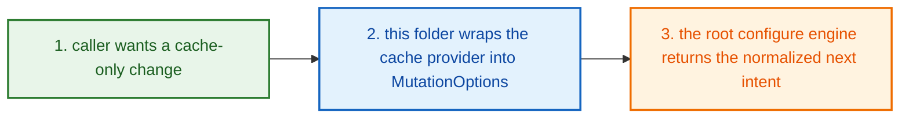
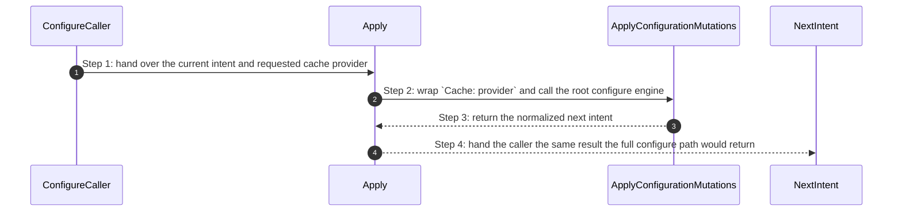
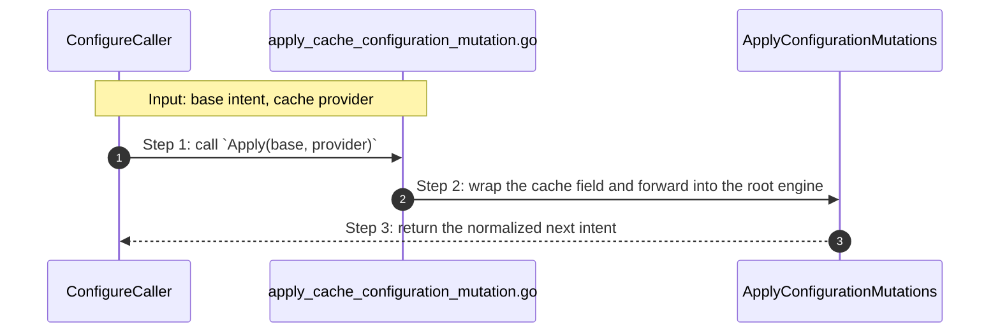

# Project Configure Cache How This Works

## What this folder is

`product/project/configure/cache/` is the tiny wrapper folder for the
[cache](#dictionary-cache) part of project setup.

It exists so a caller can say:

`change only the cache lane`

without rebuilding the whole configure request by hand.

## Real commands or triggers that reach this folder

- `poly set cache=redis`
- `poly add redis`
- parent configure callers that already have a
  [base intent](#dictionary-base-intent)

## Exact upstream handoffs

- [product/project/configure/how-this-works.md](/home/shomsy/projects/polymoly/product/project/configure/how-this-works.md)
  is the honest parent story for cache-only mutation work
- callers import `Apply(base, provider)` from
  [apply_cache_configuration_mutation.go](/home/shomsy/projects/polymoly/product/project/configure/cache/apply_cache_configuration_mutation.go)
- `Apply(...)` forwards into
  `rootconfigure.ApplyConfigurationMutations(...)` in
  [mutate/apply_configuration_mutations.go](/home/shomsy/projects/polymoly/product/project/configure/mutate/apply_configuration_mutations.go)

## The simplest story

- a caller already has a [base intent](#dictionary-base-intent) and only wants
  the cache lane to change
- this folder wraps the cache provider into `MutationOptions` and reuses the
  root configure engine
- the caller gets the same normalized next
  [intent](#dictionary-intent) the full configure path would return



## The first important path

When a real caller reaches this slice for this exact reason:

```bash
poly add redis
```

the important path is:



- **Step 1:** The parent configure story already knows the project shape before
  this cache-only wrapper wakes up.
- **Step 2:** This folder contributes only one thing: the cache field inside
  `MutationOptions`.
- **Step 3:** The root configure engine owns the real mutation and
  normalization rules.
- **Step 4:** The caller gets one clean next intent, not a partial cache edit.

## Direct files in this folder

### `apply_cache_configuration_mutation.go`

This file is one direct stop in the story for this folder.

Why this name is honest:

- it owns one cache-only wrapper and nothing else

When the story opens this file:

- a parent configure caller wants only the cache lane changed

What arrives here:

- the current [base intent](#dictionary-base-intent)
- the requested cache provider

What leaves this file:

- the normalized next [intent](#dictionary-intent)
- the same mutation result the full configure engine would return

Why you open it first:

- cache-only mutation behavior differs from the main configure path
- `poly add redis` and `poly set cache=...` disagree with full configure
  behavior



- **Step 1:** The caller arrives with an existing project plan.
- **Step 2:** This file fills only the cache field and reuses the main engine.
- **Step 3:** The caller gets one canonical configure result back.

Important functions:

- `Apply(base, provider)`
  Main action in this file. It wraps one cache-only request and forwards it
  into the root configure engine.

## Child folders in this folder

This folder has no child folders in scope.

## Debug first

- start with `Apply(...)` when cache-only mutation results differ from the main
  configure path

## What to remember

- this folder does not invent cache rules
- it only fills the cache field and forwards into the root configure engine
- that is why it should stay tiny and boring

## Dictionary

<a id="dictionary-cache"></a>
- `cache`: Cache is the fast helper service the app can use so it does not have
  to recompute or reload everything every time. In this slice, that usually
  means `redis` or `none`.
<a id="dictionary-provider"></a>
- `provider`: Provider means the concrete cache choice. It is the answer to
  "which cache product are we using?"
<a id="dictionary-base-intent"></a>
- `base intent`: Base intent is the project plan before the cache change is
  applied. This wrapper never starts from nothing; it always edits an existing
  plan.
<a id="dictionary-mutation-options"></a>
- `mutation options`: Mutation options are the small request object that says
  which part of the project should change. Here the wrapper fills only the
  cache field and leaves the rest alone.
<a id="dictionary-intent"></a>
- `intent`: Intent is the cleaned final project plan that comes back after the
  change. Think of it as the "now the project shape makes sense again" version.
