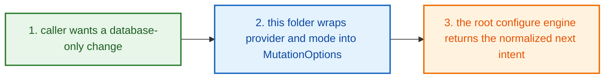
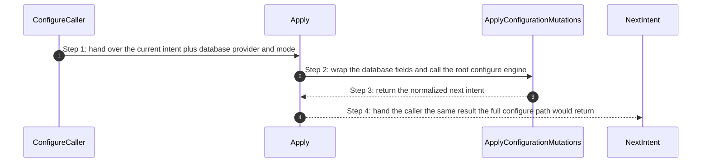
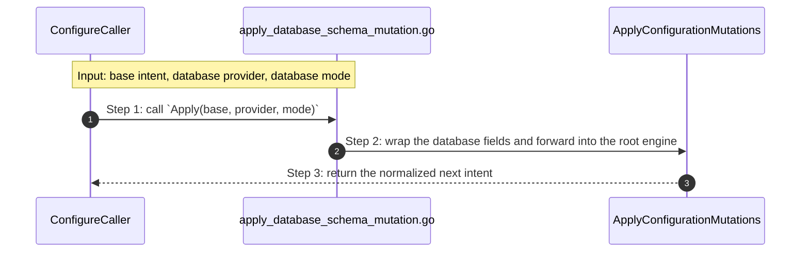

# Project Configure Database How This Works

## What this folder is

`product/project/configure/database/` is the
[database](#dictionary-database)-only wrapper folder.

It exists so a caller can say:

`change just the database part`

without rebuilding the full configure request manually.

## Real commands or triggers that reach this folder

- `poly set database=mysql database-mode=external`
- `poly add postgres`
- parent configure callers that already hold a
  [base intent](#dictionary-base-intent)

## Exact upstream handoffs

- [product/project/configure/how-this-works.md](/home/shomsy/projects/polymoly/product/project/configure/how-this-works.md)
  is the honest parent story for database-only mutations
- callers import `Apply(base, provider, mode)` from
  [apply_database_schema_mutation.go](/home/shomsy/projects/polymoly/product/project/configure/database/apply_database_schema_mutation.go)
- `Apply(...)` forwards into
  `rootconfigure.ApplyConfigurationMutations(...)` in
  [mutate/apply_configuration_mutations.go](/home/shomsy/projects/polymoly/product/project/configure/mutate/apply_configuration_mutations.go)

## The simplest story

- a caller already has a [base intent](#dictionary-base-intent) and only wants
  the database lane to change
- this folder wraps the database provider and mode into `MutationOptions`
- the root configure engine returns the normalized next
  [intent](#dictionary-intent)



## The first important path

When a real caller reaches this slice for this exact reason:

```bash
poly set database=mysql database-mode=external
```

the important path is:



- **Step 1:** The parent configure story already knows the project shape before
  this wrapper wakes up.
- **Step 2:** This folder contributes only the database provider and mode.
- **Step 3:** The root configure engine owns the actual mutation rules.
- **Step 4:** The caller gets one clean next intent, not a partial database
  edit.

## Direct files in this folder

### `apply_database_schema_mutation.go`

This file is one direct stop in the story for this folder.

Why this name is honest:

- it owns one narrow database wrapper and nothing else

When the story opens this file:

- a parent configure caller wants only the database lane changed

What arrives here:

- the current [base intent](#dictionary-base-intent)
- the requested database provider
- the requested database mode

What leaves this file:

- the normalized next [intent](#dictionary-intent)
- the same mutation result the full configure engine would return

Why you open it first:

- database provider is wrong
- database mode is wrong
- database-only mutation behavior differs from the main configure path



- **Step 1:** The caller arrives with an existing project plan.
- **Step 2:** This file fills only the database fields and reuses the main
  engine.
- **Step 3:** The caller gets one canonical configure result back.

Important functions:

- `Apply(base, provider, mode)`
  Main action in this file. It wraps one database-only request and forwards it
  into the root configure engine.

## Child folders in this folder

This folder has no child folders in scope.

## Debug first

- start with `Apply(...)` when database-only mutation behavior differs from the
  main configure path

## What to remember

- this folder is not the database rules engine
- it is a narrow wrapper around the main configure rules
- it should stay small enough that its only job is obvious

## Dictionary

<a id="dictionary-database"></a>
- `database`: Database is the persistent storage lane of the project. It is
  where the project keeps data that should still exist later.
<a id="dictionary-provider"></a>
- `provider`: Provider means which database product PolyMoly should model, such
  as `postgres` or `mysql`. It is the concrete choice inside the larger
  database lane.
<a id="dictionary-mode"></a>
- `mode`: Mode answers where that database lives. `container` means PolyMoly
  expects to run it locally; `external` means PolyMoly expects it to be managed
  somewhere else.
<a id="dictionary-wrapper"></a>
- `wrapper`: A wrapper is a tiny helper that keeps a narrow use case simple.
  This folder is a wrapper because it only fills the database fields and sends
  the request to the main configure engine.
<a id="dictionary-base-intent"></a>
- `base intent`: Base intent is the project plan before the database change is
  applied. This wrapper never starts from nothing; it always edits an existing
  plan.
<a id="dictionary-intent"></a>
- `intent`: Intent is the project plan before and after the database change.
  The goal is always to return one clear final plan, not a half-edited one.
