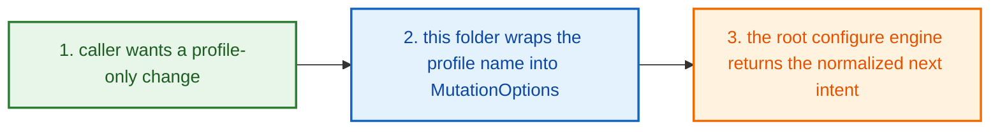
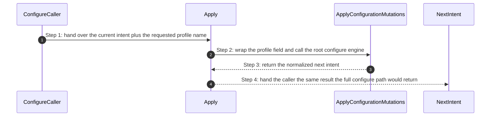
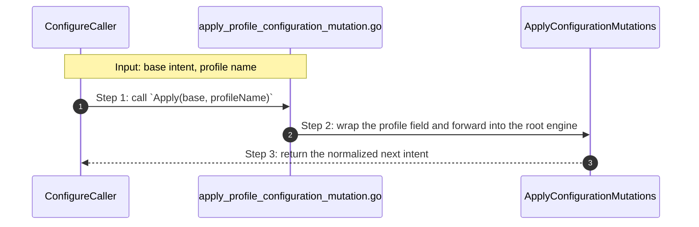

# Project Configure Profile How This Works

## What this folder is

`product/project/configure/profile/` is the
[profile](#dictionary-profile)-only wrapper folder.

It exists so a caller can say:

`change only the profile`

and reuse the same mutation and normalization path as the main configure
flow.

## Real commands or triggers that reach this folder

- `poly set profile=production`
- template-backed create or init flows that need a profile-only correction
- parent configure callers that already have a
  [base intent](#dictionary-base-intent)

## Exact upstream handoffs

- [product/project/configure/how-this-works.md](/home/shomsy/projects/polymoly/product/project/configure/how-this-works.md)
  is the honest parent story for profile-only mutations
- callers import `Apply(base, profileName)` from
  [apply_profile_configuration_mutation.go](/home/shomsy/projects/polymoly/product/project/configure/profile/apply_profile_configuration_mutation.go)
- `Apply(...)` forwards into
  `rootconfigure.ApplyConfigurationMutations(...)` in
  [mutate/apply_configuration_mutations.go](/home/shomsy/projects/polymoly/product/project/configure/mutate/apply_configuration_mutations.go)

## The simplest story

- a caller already has a [base intent](#dictionary-base-intent) and only wants
  the profile lane to change
- this folder wraps the requested profile into `MutationOptions`
- the root configure engine returns the normalized next
  [intent](#dictionary-intent)



## The first important path

When a real caller reaches this slice for this exact reason:

```bash
poly set profile=production
```

the important path is:



- **Step 1:** The parent configure story already knows the project shape before
  this wrapper wakes up.
- **Step 2:** This folder contributes only the profile field.
- **Step 3:** The root configure engine owns the actual mutation rules.
- **Step 4:** The caller gets one clean next intent, not a partial profile
  edit.

## Direct files in this folder

### `apply_profile_configuration_mutation.go`

This file is one direct stop in the story for this folder.

Why this name is honest:

- it owns one narrow profile wrapper and nothing else

When the story opens this file:

- a parent configure caller wants only the profile lane changed

What arrives here:

- the current [base intent](#dictionary-base-intent)
- the requested profile name

What leaves this file:

- the normalized next [intent](#dictionary-intent)
- the same mutation result the full configure engine would return

Why you open it first:

- profile-only mutation results are wrong
- profile wrapper behavior drifts away from the main configure engine



- **Step 1:** The caller arrives with an existing project plan.
- **Step 2:** This file fills only the profile field and reuses the main
  engine.
- **Step 3:** The caller gets one canonical configure result back.

Important functions:

- `Apply(base, profileName)`
  Main action in this file. It wraps one profile-only request and forwards it
  into the root configure engine.

## Child folders in this folder

This folder has no child folders in scope.

## Debug first

- start with `Apply(...)` when profile-only mutation behavior differs from the
  main configure path

## What to remember

- this folder keeps profile-only callers simple
- the real profile rules live in the main configure engine
- the whole value of this slice is reusing one canonical mutation path

## Dictionary

<a id="dictionary-profile"></a>
- `profile`: A profile is the operating posture of the project, like
  `localhost`, `production`, or `enterprise`. It tells PolyMoly how serious or
  expanded the project setup should be.
<a id="dictionary-profile-only"></a>
- `profile-only`: Profile-only means "change just the posture, not the rest of
  the project plan." It is a narrow request with one clear target.
<a id="dictionary-wrapper"></a>
- `wrapper`: A wrapper is a tiny forwarding layer that keeps callers from
  rebuilding the whole mutation request by hand. It exists to stay boring and
  obvious.
<a id="dictionary-base-intent"></a>
- `base intent`: Base intent is the current project plan before the profile
  change. This folder does not invent a new project; it edits the one it was
  given.
<a id="dictionary-intent"></a>
- `intent`: Intent is the cleaned final plan after the profile change. It is
  the version the rest of the system can trust.
