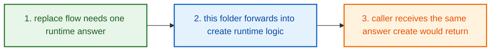
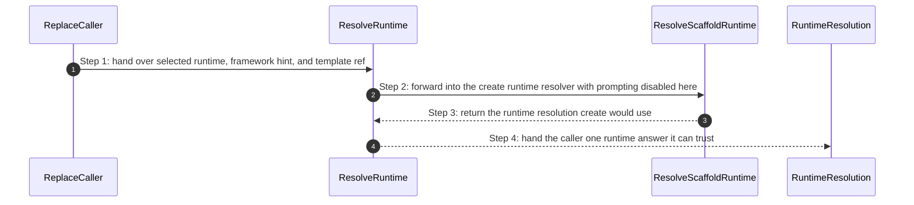
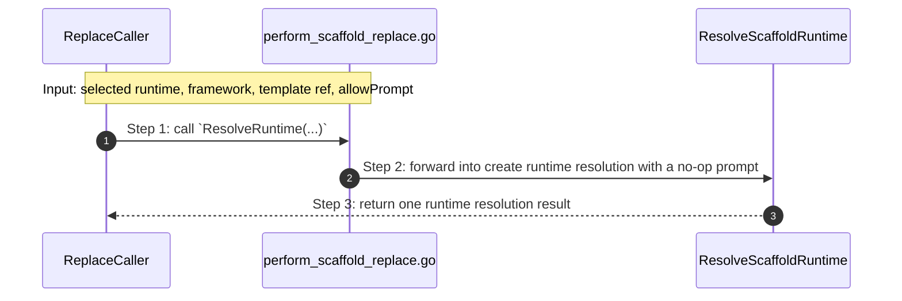

# Project Configure Replace How This Works

## What this folder is

`product/project/configure/replace/` is the mini-flow that bridges
[replace](#dictionary-replace)-oriented requests into three actions:

1. resolve runtime using create law
2. preview and back up the existing scaffold
3. swap the scaffold to the new runtime

Its whole point is:

`do not invent a second runtime decision system for replace`

## Real commands or triggers that reach this folder

- `poly replace --lang php`
- `poly replace --framework laravel`
- replace-oriented callers that need the same runtime answer create would use

## Exact upstream handoffs

- `RunProjectReplaceFlow(...)` in
  [configure_pipeline.go](/home/shomsy/projects/polymoly/product/project/configure/configure_pipeline.go)
  is the public story above this slice
- `RunReplaceScaffoldFlow(...)` in
  [replace_pipeline.go](/home/shomsy/projects/polymoly/product/project/configure/replace/replace_pipeline.go)
  orchestrates preview and scaffold swap
- `ResolveRuntime(...)` in
  [perform_scaffold_replace.go](/home/shomsy/projects/polymoly/product/project/configure/replace/perform_scaffold_replace.go)
  forwards into `create.ResolveScaffoldRuntime(...)` in
  [resolve_scaffold_runtime.go](/home/shomsy/projects/polymoly/product/project/create/runtime/resolve_scaffold_runtime.go)

## The simplest story

- a replace flow needs a runtime answer, a preview, and a safe scaffold swap
- this folder forwards runtime selection into the create resolver
- this folder generates a preview + backup and then swaps the scaffold



## The first important path

When a real caller reaches this slice for this exact reason:

```bash
poly replace --framework laravel
```

the important path is:



- **Step 1:** The replace story already knows it needs scaffold replacement.
- **Step 2:** This folder contributes one thing: consistent runtime resolution.
- **Step 3:** The real runtime-choice law lives in the create slice.
- **Step 4:** Replace continues with the same runtime answer create would have
  produced.

## Direct files in this folder

### `replace_pipeline.go`

This file is the mini-flow orchestrator for replace.

Functions:

- `RunReplaceScaffoldFlow(...)`

It builds the preview/backup and optionally applies the scaffold swap.

### `perform_scaffold_replace.go`

This file is one direct stop in the story for this folder.

Why this name is honest:

- it owns the replace-to-create bridge and nothing else

When the story opens this file:

- a replace flow needs to resolve runtime before scaffold replacement continues

What arrives here:

- the selected runtime, if one was given directly
- the framework hint, template reference, and prompt policy

What leaves this file:

- one [runtime resolution](#dictionary-runtime-resolution) result
- the same runtime answer create would return

Why you open it first:

- replace runtime behavior differs from create runtime behavior
- replace unexpectedly opens or depends on prompt behavior



- **Step 1:** The caller arrives with a replace-oriented runtime question.
- **Step 2:** This file reuses create law instead of inventing a second one.
- **Step 3:** The caller gets one consistent runtime answer back.

Important functions:

- `ResolveRuntime(selectedRuntime, framework, templateRef, allowPrompt)`
  Main action in this file. It forwards replace runtime questions into the
  create runtime resolver while keeping this slice non-interactive.

## Child folders in this folder

This folder has no child folders in scope.

It has a `testdata/` directory used by `perform_scaffold_replace_test.go`.

### `prepare_replace_preview.go`

Owns the preview + backup step before scaffold swap.

When the story opens this file:

- a replace flow needs to compute the files that will be removed and added
- a backup of the existing scaffold must be created before the swap

Important functions:

- `PrepareReplacePreview(projectRoot, fromRuntime, toRuntime) (removed, added, backupDir, error)`
  Main action in this file. It scans `src/`, backs it up, and computes the add/remove sets.

### `replace_scaffold.go`

Owns the actual scaffold swap execution.

When the story opens this file:

- a replace flow has been confirmed and needs to physically swap `src/`

Important functions:

- `ReplaceScaffold(repoRoot, projectRoot, runtime) error`
  Main action in this file. It removes the old scaffold entries and writes the
  new starter skeleton via `scaffold.WriteStarter(...)`.

## Debug first

- start with `ResolveRuntime(...)` when replace runtime behavior differs from
  create runtime behavior

## What to remember

- this folder is intentionally tiny
- its entire value is consistency with `create/`
- replace should never drift into a second runtime-decision law

## Dictionary

<a id="dictionary-replace"></a>
- `replace`: Replace means "swap the scaffold direction for this project on
  purpose." It is a controlled rewrite of starter shape, not a random live
  runtime mutation.
<a id="dictionary-runtime-resolution"></a>
- `runtime resolution`: Runtime resolution means choosing the final runtime
  answer, such as `php` or `go`. The system wants one clear answer before
  replace continues.
<a id="dictionary-interactive"></a>
- `interactive`: Interactive means the code is allowed to stop and ask the
  human a question. This folder forces that off so replace stays predictable.
<a id="dictionary-no-op-prompt"></a>
- `no-op prompt`: A no-op prompt is a fake prompt function that does nothing
  and returns no real choice. It is used here so the function signature stays
  satisfied without opening a question flow.
<a id="dictionary-consistency"></a>
- `consistency`: Consistency here means replace follows the same runtime-choice
  law as create. That avoids one command guessing differently from another.
