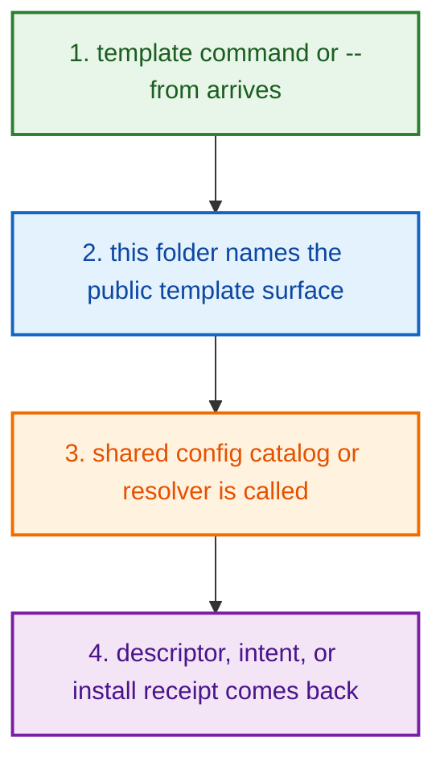
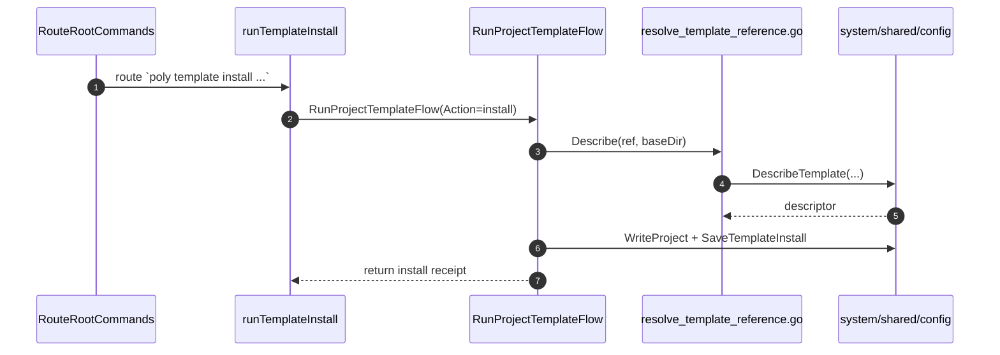
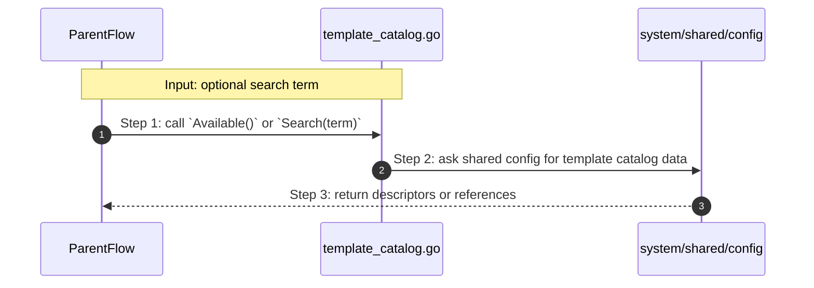
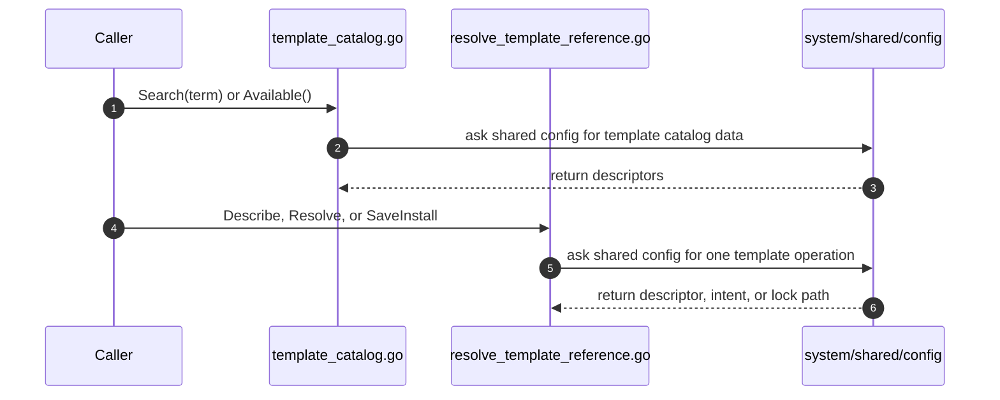

# Project Create Template How This Works

## What this folder is

`product/project/create/template/` is the folder that answers
[template](#dictionary-template) questions.

It helps PolyMoly do four very plain things:

1. list templates
2. search templates
3. show one template
4. turn a [template reference](#dictionary-template-reference) into a real
   project [intent](#dictionary-intent)

## Real commands that reach this folder

- `poly template search php`
- `poly template show shomsy/local-php-lamp`
- `poly template install shomsy/local-php-lamp my-app`
- `poly new my-app --from shomsy/local-php-lamp`
- `poly init --from shomsy/local-php-lamp`

## Exact CLI front doors

Public template commands enter through:

- `RouteRootCommands(...)` in `route_root_commands.go`
- `runTemplate(...)` in `expand_variable_placeholders.go`
- `RunProjectTemplateFlow(...)` in `template_pipeline.go`

Then the exact command-specific handoff is:

- `poly template search ...` -> `RunProjectTemplateFlow(Action=search)`
- `poly template show ...` -> `RunProjectTemplateFlow(Action=show)`
- `poly template install ...` -> `RunProjectTemplateFlow(Action=install)`

Important truth:

- the live CLI template commands now call `RunProjectTemplateFlow(...)` here
- `RunProjectTemplateFlow(...)` delegates to `Search(...)`, `Describe(...)`, and
  `SaveInstall(...)` which call shared config
- template-backed create (`poly new --from`, `poly init --from`) uses
  `Resolve(...)` from this folder to build intent

Template-backed create also does not go through `runTemplate(...)`.
The live create path uses:

- `create.RunProjectNewFlow(...)` or `create.RunProjectInitFlow(...)`
- `configure.PrepareConfigureBaselineIntent(...)`
- `template.Resolve(...)`

## The simplest story

- a template command or `--from` create story arrives
- this folder names the product-layer template responsibilities clearly
- shared config returns the descriptor, resolved intent, or install receipt the
  caller needs next



## The first important path

When you type:

```bash
poly template install shomsy/go-service my-app
```

the important path is:



## Direct files in this folder

### `template_pipeline.go`

This is the canonical entrypoint for template commands.

Functions:

- `RunProjectTemplateFlow(...)`

It orchestrates search, show, and install without hiding shared config calls.

### `search_starter_templates.go`

This file is only the `poly template search` request contract.

It defines:

- `SearchCommandName`

There are no functions here.
Its job is to keep the public command string for template search in one place.

### `view_template_details.go`

This file is only the `poly template show` request contract.

It defines:

- `ShowCommandName`

There are no functions here either.
Its job is to keep the public `template show` surface explicit.

### `install_starter_template.go`

This file is only the `poly template install` request contract.

It defines:

- `InstallCommandName`

There are no functions here either.
Its job is to keep the public `template install` surface explicit.

### `template_catalog.go`

This file is one direct stop in the story for this folder.

Why this name is honest:

- it owns catalog listing and search behavior, not one-template resolution

When the story opens this file:

- a caller wants the full catalog or wants to filter it by a search term

What arrives here:

- either no term at all or one search term

What leaves this file:

- the available template reference list
- filtered template descriptors for search results

Why you open it first:

- a template does not show up in search
- the list is incomplete
- filter behavior feels wrong



- **Step 1:** The caller wants catalog truth, not one resolved template yet.
- **Step 2:** This file keeps catalog work separate from template resolution.
- **Step 3:** The caller gets back the descriptor list it needs next.

Important functions:

- `Available()`
  Main list action in this file. It returns the full available template
  reference set.
- `Search(term)`
  Search action in this file. It filters template descriptors by the requested
  term.

### `resolve_template_reference.go`

This is the behavior file for one specific template reference.

Types:

- `Descriptor`
- `Lock`
- `Install`

Functions:

- `Describe(ref, baseDir) (Descriptor, error)`
  Loads the [descriptor](#dictionary-descriptor) for one template.
- `Resolve(ref, baseDir) (projectcfg.Intent, error)`
  Turns a [template reference](#dictionary-template-reference) into a real
  [intent](#dictionary-intent).
- `SaveInstall(projectRoot, descriptor) (string, error)`
  Saves the [install receipt](#dictionary-install-receipt) for a
  template-backed project.

This is the file to open when:

- a template exists but cannot be described
- a template exists but cannot be resolved into intent
- install metadata is not being written

## What this folder itself can do

If another caller imports this folder directly, the internal helper path is:



## What the user usually sees

- `poly template search php` prints `Poly Hub templates:` followed by one line
  per descriptor
- `poly template show ...` prints `Template:`, `Summary:`, `Source:`,
  `Version:`, `Digest:`, runtime, profile, and recipe
- `poly template install ...` prints `[ok] Installed template ...` and
  `Template lock: ...`

## Child folders in this folder

This folder has no child folders in scope.

## Debug first

- start in `RunProjectTemplateFlow(...)` or its internal
  `runTemplateSearch(...)`, `runTemplateShow(...)`, or `runTemplateInstall(...)`
  when the live CLI command behaves wrong
- start in `Search(...)` when a caller that imports this folder gets template
  search wrong
- start in `Describe(...)` when a caller that imports this folder gets template
  details wrong
- start in `Resolve(...)` when a caller that imports this folder resolves the
  wrong template intent
- start in `SaveInstall(...)` when a caller that imports this folder misses the
  install receipt

## What to remember

- this folder is small on purpose
- command-name files keep the public surfaces readable
- the live CLI path reaches shared config through `RunProjectTemplateFlow(...)`
- this folder is the product-layer owner of template search/show/install

## Dictionary

<a id="dictionary-template"></a>
- `template`: A template is a pre-shaped project starting point. Think of it
  like a box that already contains one opinionated project plan.
<a id="dictionary-template-reference"></a>
- `template reference`: A template reference is the name the user types, such
  as `shomsy/local-php-lamp`. It is the address PolyMoly uses to find the right
  template.
<a id="dictionary-descriptor"></a>
- `descriptor`: A descriptor is the readable identity card for a template. It
  tells you what the template is, where it came from, what runtime it wants,
  and other metadata.
<a id="dictionary-intent"></a>
- `intent`: Here, intent is the project plan hidden inside the template.
  Resolving the template means opening the box and reading that plan.
<a id="dictionary-install-receipt"></a>
- `install receipt`: An install receipt is the note PolyMoly writes after a
  template-backed install. It helps the system remember what template was used.
<a id="dictionary-lock"></a>
- `lock`: A lock is the machine-readable record that freezes one template
  choice in a stable way. It is there so later tools can say "yes, this exact
  template was used."
<a id="dictionary-catalog"></a>
- `catalog`: The catalog is the list of templates PolyMoly knows how to find.
  Search and list style behavior always starts from that catalog truth.
