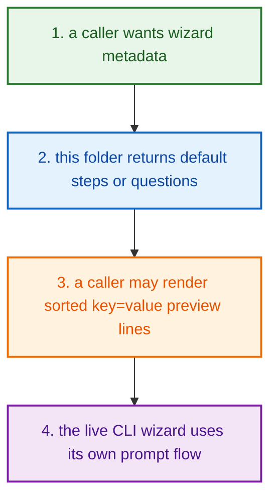
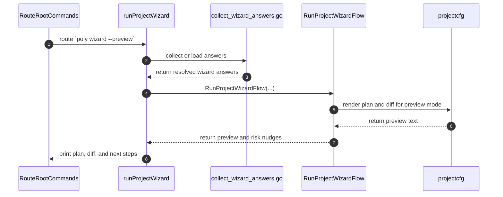
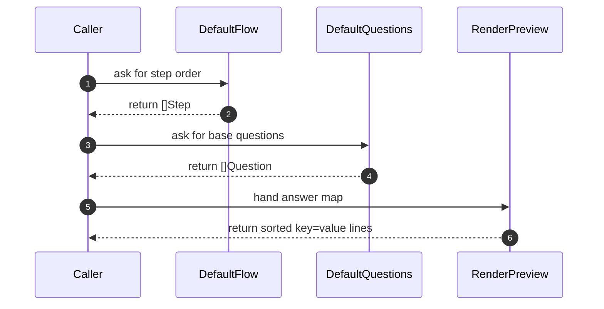

# Project Create Wizard How This Works

## What this folder is

`product/project/create/wizard/` is the small folder that makes guided
[wizard](#dictionary-wizard) project creation readable.

It owns:

- the wizard command name
- the default wizard step order
- the default wizard question set
- the [preview](#dictionary-preview) text for the current
  [answers](#dictionary-answer)

## Real commands that reach this folder

- `poly wizard`
- `poly wizard --preview`

## Exact CLI front doors

When you type `poly wizard` or `poly wizard --preview`, the first handoff is:

- `RouteRootCommands(...)` in `route_root_commands.go`
- `runProjectWizard(...)` in `route_project_commands.go`

Then `runProjectWizard(...)` stays inside CLI helpers:

- `normalizeWizardMode(...)`
- `promptWizardAnswers(...)`
- `loadWizardAnswers(...)`
- `create.RunProjectWizardFlow(...)`

Important truth:

- the live `poly wizard` command delegates orchestration to
  `create.RunProjectWizardFlow(...)`
- the live prompts and answer loading live in CLI
- this folder remains the canonical wizard model/helper slice for
  `DefaultFlow()`, `DefaultQuestions()`, and `RenderPreview(...)`

## The simplest story

- a caller wants wizard metadata, question order, or a small preview summary
- this folder returns the default steps or questions it owns locally
- the CLI collects answers and hands them to the create pipeline for preview or apply



## The first important path

When you type:

```bash
poly wizard --preview
```

the important path is:



## Direct files in this folder

### `wizard_contract.go`

This file is only the wizard contract.

It defines:

- `CommandName`
- `Answers`

There are no functions here.
Its job is to keep the public wizard surface and the answer-map type obvious.

### `default_flow.go`

This Go file defines the order of the base wizard.

Types:

- `Step`

Functions:

- `DefaultFlow() []Step`
  Returns the base wizard order: `usage -> runtime -> profile`

Open this file first when the wizard order itself feels wrong.

### `process_wizard_questionnaire.go`

This Go file defines the base wizard questions and options.

Types:

- `Question`

Functions:

- `DefaultQuestions() []Question`
  Returns the default question set: usage, runtime, and profile.

Open this file first when the wrong choices appear in the wizard.

### `render_wizard_selection_preview.go`

This Go file turns the current answer map into preview lines.

Functions:

- `RenderPreview(answers Answers) []string`
  Sorts the [answer](#dictionary-answer) keys and renders simple `key=value`
  lines.

Open this file first when:

- preview order is wrong
- preview lines are missing
- preview formatting looks wrong

## What this folder itself can do

If another caller imports this folder directly, the internal helper path is:



## What the wizard actually asks

The terminal questions live outside this folder in
`system/tools/poly/internal/cli/collect_wizard_answers.go`.

That CLI file asks:

- quickstart: runtime only
- guided: usage, runtime, profile, recipe, database, cache, gateway
- advanced: everything in guided, plus database mode

The actual prompt strings are very direct:

- `Usage (api/web/service/worker/custom, ? for explain)`
- `Profile (localhost/production/enterprise, ? for explain)`
- `Recipe (standard/hardened/observability-plus, ? for explain)`
- `Database (postgres/mysql/none, ? for explain)`
- `Cache (redis/none, ? for explain)`
- `Gateway (traefik/none, ? for explain)`

Runtime is handled by a numbered chooser:

- `1) go`
- `2) node`
- `3) php`
- `4) fullstack`

If the user types `?`, the CLI prints a short help line and asks again.

## What preview usually prints

For `poly wizard --preview`, the live CLI prints:

- `projectcfg.RenderPlan(plan)`
- one blank line
- `projectcfg.RenderDiff(plan)`
- risk nudges
- next steps such as `poly wizard --yes`

If `--write-answers` is used, the CLI also prints:

- `[ok] Answers file written: ...`

Preview output is generated from `projectcfg.RenderPlan(...)` and
`projectcfg.RenderDiff(...)`. `RenderPreview(...)` stays available for callers
who want a lightweight key=value summary.
It comes from the CLI preview path.

## Child folders in this folder

This folder has no child folders in scope.

## Debug first

- start in `runProjectWizard(...)` and `collect_wizard_answers.go` when the
  live `poly wizard` command behaves wrong
- start in `DefaultFlow()` when a caller that uses this folder gets the step
  order wrong
- start in `DefaultQuestions()` when a caller that uses this folder gets the
  base question list wrong
- start in `RenderPreview(...)` when a caller that uses this folder gets the
  sorted key=value preview wrong

## What to remember

- this folder is tiny, but it matters a lot for onboarding
- it does not own terminal IO
- it owns the shape and language of the guided create path

## Dictionary

<a id="dictionary-wizard"></a>
- `wizard`: A wizard is a guided question flow. Instead of asking the user to
  know every flag up front, it asks step by step and builds a result slowly.
<a id="dictionary-answer"></a>
- `answer`: An answer is one small user choice, like `runtime=php` or
  `profile=production`. Many tiny answers become one bigger project plan.
<a id="dictionary-preview"></a>
- `preview`: Preview means "show me the planned result before doing the
  mutation." It is the safe look-before-you-touch step.
<a id="dictionary-mode"></a>
- `mode`: A mode is the size of the wizard conversation. `quickstart` is short,
  `guided` is normal, and `advanced` asks for more details.
<a id="dictionary-question-set"></a>
- `question set`: A question set is the default pack of prompts the wizard
  uses. It is the scripted list of things PolyMoly thinks the user should
  decide.
<a id="dictionary-step-order"></a>
- `step order`: Step order means the sequence in which the wizard wants the
  user to think. Good step order reduces confusion before the project even
  exists.
