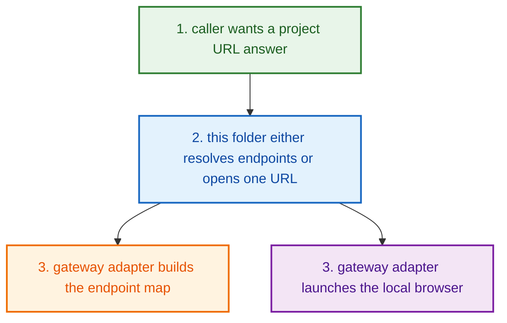
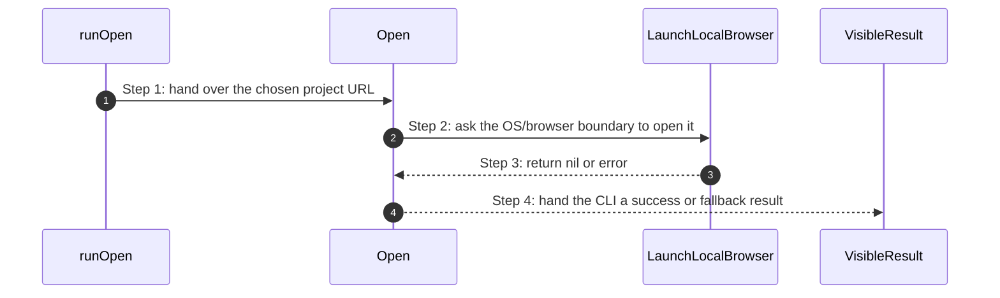
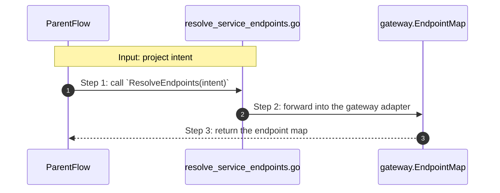
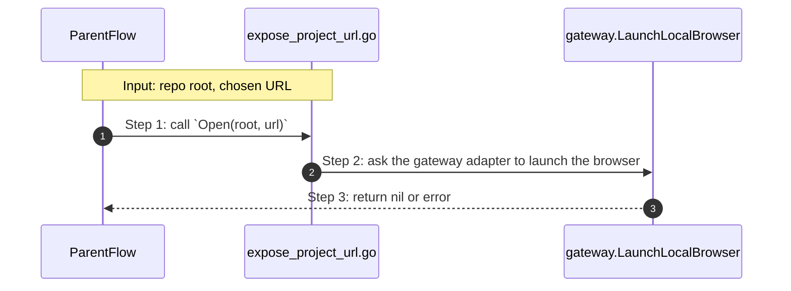

# Project Lifecycle Access How This Works

## What this folder is

`product/project/lifecycle/access/` is the folder that answers:

- what [URLs](#dictionary-url) belong to this project?
- can PolyMoly open one of them for me?

## Real commands or triggers that reach this folder

- `poly open`
- helper callers that only want the [endpoint](#dictionary-endpoint) map

## Exact CLI front doors

When you type `poly open`, the command path is:

- `RouteRootCommands(...)`
- `runOpen(...)`
- `access.Open(...)`
- `gateway.LaunchLocalBrowser(...)`

If a caller only wants URLs, it usually skips `runOpen(...)` and calls
`ResolveEndpoints(...)` directly.

## The simplest story

- a caller wants either one project URL or the full endpoint map
- this folder either resolves endpoints or opens one chosen URL
- the gateway adapter returns the endpoint map or performs the browser launch



## The first important path

When you type:

```bash
poly open
```

the important path is:



- **Step 1:** The CLI already chose the URL it wants to open.
- **Step 2:** This folder crosses into the adapter boundary instead of opening
  browsers by itself.
- **Step 3:** The gateway adapter returns success or error.
- **Step 4:** The caller decides whether to print success or a manual-open
  fallback message.

## Direct files in this folder

### `resolve_service_endpoints.go`

This file is one direct stop in the story for this folder.

Why this name is honest:

- it owns the endpoint-map handoff and nothing else

When the story opens this file:

- a caller only wants URLs and does not need browser launch

What arrives here:

- the current project intent

What leaves this file:

- the endpoint map for that intent
- one clean gateway handoff for URL discovery

Why you open it first:

- endpoint names are wrong
- endpoint values are wrong
- a project URL is missing



- **Step 1:** The caller already has the project shape it wants to inspect.
- **Step 2:** This file forwards URL discovery into the adapter boundary.
- **Step 3:** The caller gets one endpoint map back.

Important functions:

- `ResolveEndpoints(intent)`
  Main action in this file. It forwards the project intent into the gateway
  adapter and returns the resulting endpoint map.

### `expose_project_url.go`

This file is one direct stop in the story for this folder.

Why this name is honest:

- it owns one browser-open handoff and nothing else

When the story opens this file:

- `poly open` or another caller already knows which URL should be opened

What arrives here:

- the repo root
- one chosen URL

What leaves this file:

- a nil-or-error browser-open result
- one clean handoff into the gateway adapter

Why you open it first:

- `poly open` cannot launch the browser
- browser launch behavior changes



- **Step 1:** The caller already chose the URL.
- **Step 2:** This file pushes browser work into the adapter boundary.
- **Step 3:** The caller gets one success-or-error result back.

Important functions:

- `Open(root, url)`
  Main action in this file. It forwards one chosen URL into the gateway adapter
  so the local browser can be opened.

## Child folders in this folder

This folder has no child folders in scope.

## Debug first

- start in `ResolveEndpoints(...)` when the URL map itself is wrong
- start in `Open(...)` when browser launch is wrong

## What to remember

- [endpoint](#dictionary-endpoint) truth comes from the
  [gateway](#dictionary-gateway) adapter
- this folder keeps the product-facing names simple
- it does not implement browsers or endpoint rules by itself

## Dictionary

<a id="dictionary-endpoint"></a>
- `endpoint`: An endpoint is one concrete address the user or another tool can
  call, such as `http://localhost:8080`. It is the "here is where the app
  lives" answer.
<a id="dictionary-url"></a>
- `URL`: A URL is the literal text form of that address. It is what `poly open`
  eventually hands to the browser layer.
<a id="dictionary-gateway"></a>
- `gateway`: Gateway is the routing edge that knows how requests enter the
  project. In simple terms, it is the traffic doorman that tells requests where
  to go.
<a id="dictionary-browser-launch"></a>
- `browser launch`: Browser launch means asking the operating system to open a
  URL in a local browser. This folder does not implement browsers itself; it
  forwards that work to the adapter layer.
<a id="dictionary-adapter"></a>
- `adapter`: An adapter is the boundary piece that talks to the outside world
  for the product layer. Here the gateway adapter knows how to build endpoint
  maps and how to ask the OS to open a browser.
