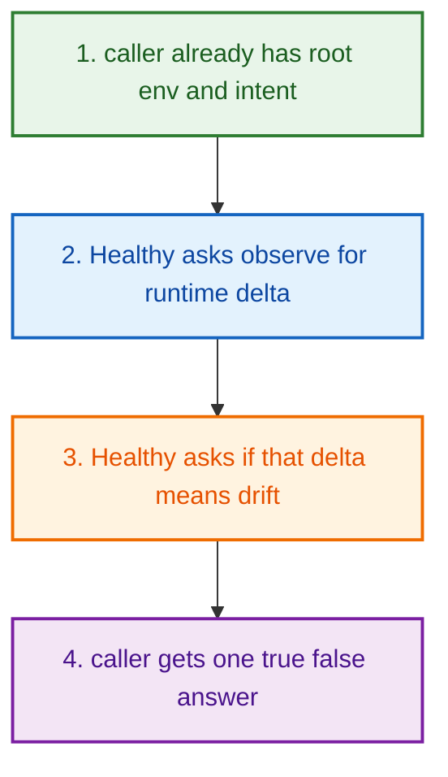
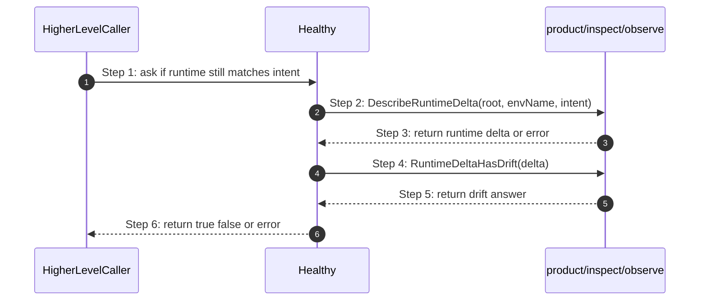

# Project Lifecycle Control How This Works

## What this folder is

`product/project/lifecycle/control/` is the folder that turns
[runtime delta](#dictionary-runtime-delta) truth into one simple
[health](#dictionary-health) answer.

This is the part that answers:

`Does runtime still match the project intent?`

## Real commands or triggers that reach this folder

- health checks inside higher-level product helpers
- doctor or support flows that already have a project
  [intent](../../how-this-works.md#dictionary-intent)
- any caller that wants one simple yes/no
  [health](#dictionary-health) answer instead of a full report

There is no single public `poly healthy` command in this slice today.
This folder exists as the thin reusable product helper above the richer observe
lane.

## Exact upstream handoffs

This folder does not have one dedicated CLI front door.

The real contract is the function call itself:

- `Healthy(root, envName, intent)`

That means the caller has already done the earlier work:

- found the project root
- picked the runtime environment name
- loaded or calculated the expected project intent

Then this folder gives that caller one simple answer:

- `true` if runtime does not drift
- `false` if runtime drifts
- `error` if the observe layer could not prove the answer

## The simplest story

This folder is intentionally tiny.
It does exactly three things:

1. ask observe for the current runtime delta
2. ask observe whether that delta means drift
3. return one boolean answer to the caller



## The first important path

When some higher-level code calls:

```go
ok, err := control.Healthy(root, envName, intent)
```

the important path is:



- **Step 1:** The caller already did the setup work and now wants one simple
  result.
- **Step 2:** This folder does not inspect runtime directly. It hands that job
  to the observe lane.
- **Step 3:** Observe returns the compare screen between expected and observed
  runtime.
- **Step 4:** This folder asks one narrow question: "does this count as
  drift?"
- **Step 5:** Observe answers that policy question.
- **Step 6:** The caller gets one product-friendly health result.

## Direct files in this folder

### `check_system_health.go`

Functions:

- `Healthy(root, envName, intent) (bool, error)`

What it does:

- calls `observe.DescribeRuntimeDelta(root, envName, intent)`
- then calls `observe.RuntimeDeltaHasDrift(delta)`
- returns `true` only when the runtime delta does not show drift

This is important:

- it does **not** just ping a single port
- it does **not** just look for one process
- it asks whether expected runtime and observed runtime still line up

## Child folders in this folder

This folder has no child folders.

That is intentional.
The whole slice is one narrow yes/no health helper.

## What the user usually sees

This folder usually does not print directly to the terminal.

Higher-level callers turn its answer into user-facing output such as:

- doctor summaries
- runtime health summaries
- support or recovery decisions

## Debug first

- open `Healthy(...)` first
- then follow the handoff into the observe layer if the delta itself looks wrong

## What to remember

- this folder is the yes/no [health](#dictionary-health) layer
- the richer runtime truth still lives below it in the observe lane
- if a caller needs a rich report instead of one boolean answer, this folder is
  too small and the observe lane is the right next stop

## Dictionary

<a id="dictionary-health"></a>
- `health`: Health is the short answer to a big question: "does the running project still match the expected project?" It is intentionally simpler than the full diagnostic report.
<a id="dictionary-runtime-delta"></a>
- `runtime delta`: Runtime delta is the difference between expected runtime and observed runtime. Think of it like a compare screen between the plan and the live world.
<a id="dictionary-drift"></a>
- `drift`: Drift means that compare screen found mismatches. It is the sign that something in runtime moved away from the expected project shape.
<a id="dictionary-observed-runtime"></a>
- `observed runtime`: Observed runtime is what PolyMoly can actually see happening right now. It is the evidence side of the comparison.
<a id="dictionary-yes-no-layer"></a>
- `yes/no layer`: A yes/no layer is a thin product-facing wrapper that turns rich lower-level data into one simple answer. This folder exists so callers do not all have to calculate drift by themselves.
