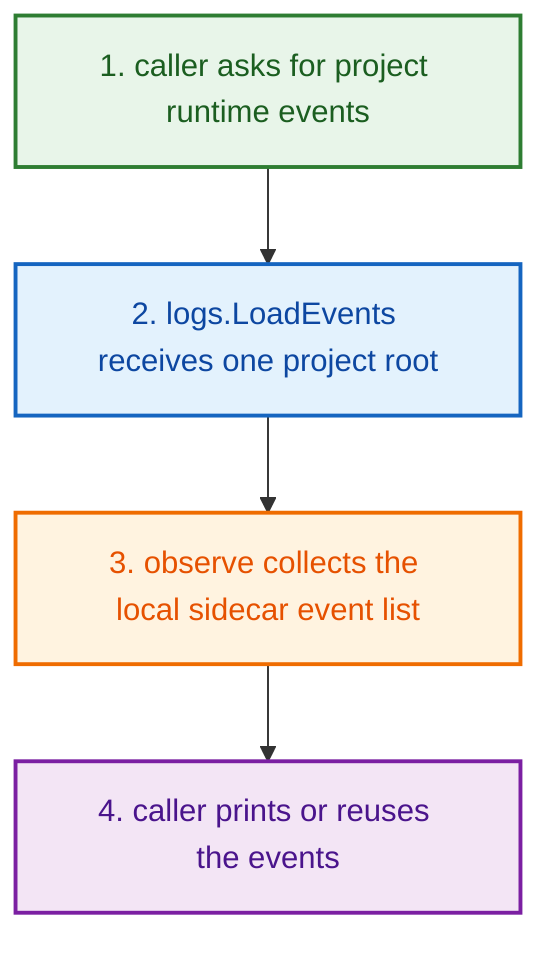
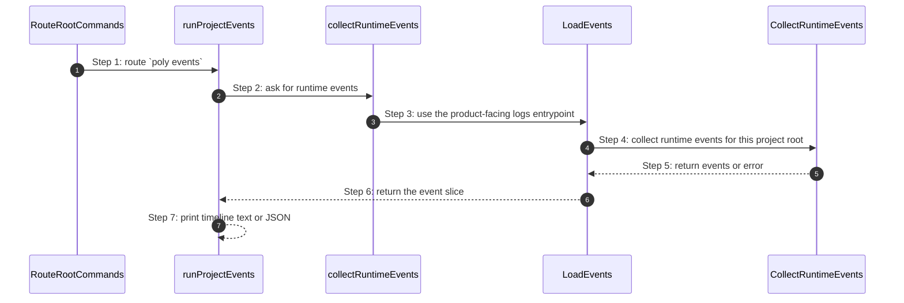

# Project Lifecycle Logs How This Works

## What this folder is

`product/project/lifecycle/logs/` is the small folder that reads
[runtime events](#dictionary-runtime-event) for one project.

This is the part that answers:

`What happened in this project runtime?`

## Real commands or triggers that reach this folder

The obvious public story is:

```bash
poly events
```

There may also be higher-level callers that want the raw
[event](#dictionary-event) list first.

## Exact CLI front door

When you type `poly events`, the command path is:

- `RouteRootCommands(...)`
- `runProjectEvents(...)`
- `collectRuntimeEvents(...)`
- `logs.LoadEvents(...)`
- `observe.CollectRuntimeEvents(...)`

## The simplest story

This folder is intentionally tiny.
It does three things:

1. accept one project root
2. ask observe to collect runtime events
3. return those events to the caller



## The first important path

When you type:

```bash
poly events
```

the important path is:



- **Step 1:** Root CLI routing recognizes the project-event command.
- **Step 2:** The runtime CLI helper keeps the terminal formatting concerns.
- **Step 3:** The product-facing lifecycle logs entrypoint is where this folder
  takes over.
- **Step 4:** This folder delegates the real collection work to the observe
  lane.
- **Step 5:** Observe returns the runtime event list.
- **Step 6:** This folder hands the events back without extra mutation.
- **Step 7:** The CLI decides whether to print text, JSON, or next-step hints.

## Direct files in this folder

### `read_system_events.go`

Functions:

- `LoadEvents(projectRoot) ([]observe.RuntimeEvent, error)`

What it does:

- forwards the project root to `observe.CollectRuntimeEvents(projectRoot)`
- returns the resulting runtime event slice

This is the first file to open when:

- `poly events` returns nothing
- runtime events look incomplete
- event read behavior changed

## Child folders in this folder

This folder has no child folders.

That is intentional.
The whole slice is one small wrapper around the deeper observe event collector.

## What the user usually sees

`runProjectEvents(...)` prints:

- `Runtime events (local sidecar timeline)`
- either `No events recorded yet.`
- or one line per event in the form `timestamp [level] message`

It also prints next-step hints like `poly history` or `poly metrics`.

## Debug first

- open `LoadEvents(...)` first
- then follow the call into the observe lane if event collection truth is wrong

## What to remember

- this folder is intentionally tiny
- it gives the project lane one named event-read
  [entrypoint](#dictionary-entrypoint)
- it does not invent, filter, or reinterpret the event data heavily; it mainly
  forwards collection through one stable product-facing function

## Dictionary

<a id="dictionary-event"></a>
- `event`: An event is one recorded thing that happened, with a time, a level, and a message. It is like one line in the project's running diary.
<a id="dictionary-timeline"></a>
- `timeline`: A timeline is the ordered list of those event lines. It helps you read the project story from earlier to later.
<a id="dictionary-runtime-event"></a>
- `runtime event`: A runtime event is an event specifically about the live project world, not only about static config files. It answers "what happened while this thing was running?"
<a id="dictionary-observe-lane"></a>
- `observe lane`: The observe lane is the deeper slice that actually collects the richer runtime truth. This folder just gives the project layer one clean way to ask for that data.
<a id="dictionary-entrypoint"></a>
- `entrypoint`: An entrypoint is the named function other code uses to begin this story. Here that entrypoint is `LoadEvents(...)`.
