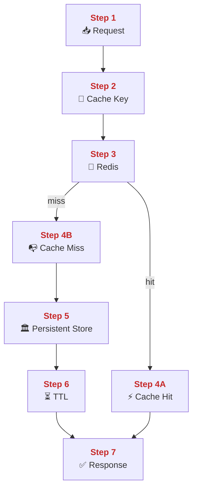
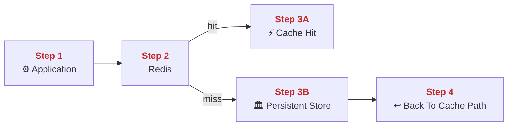
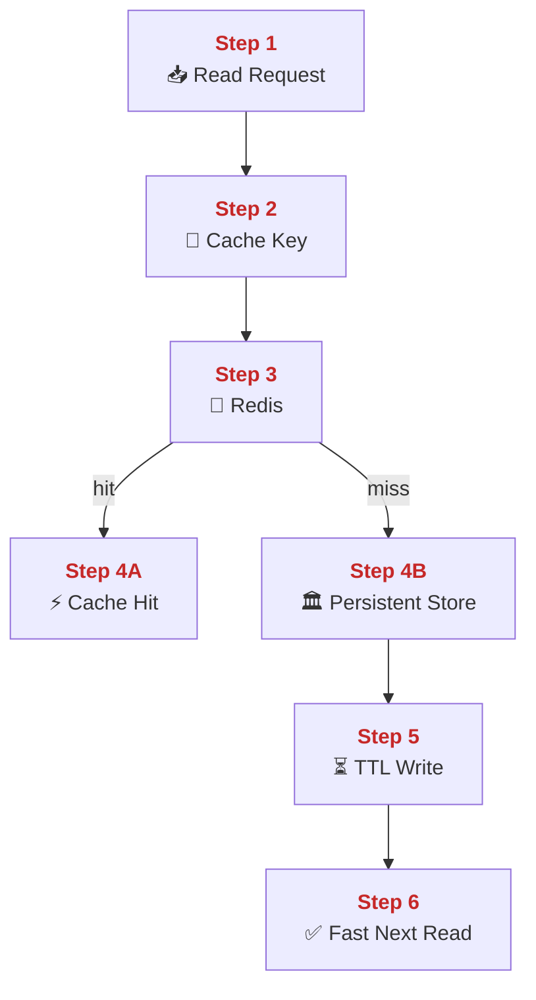
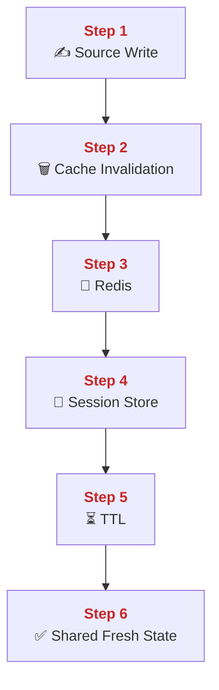
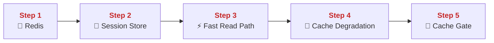
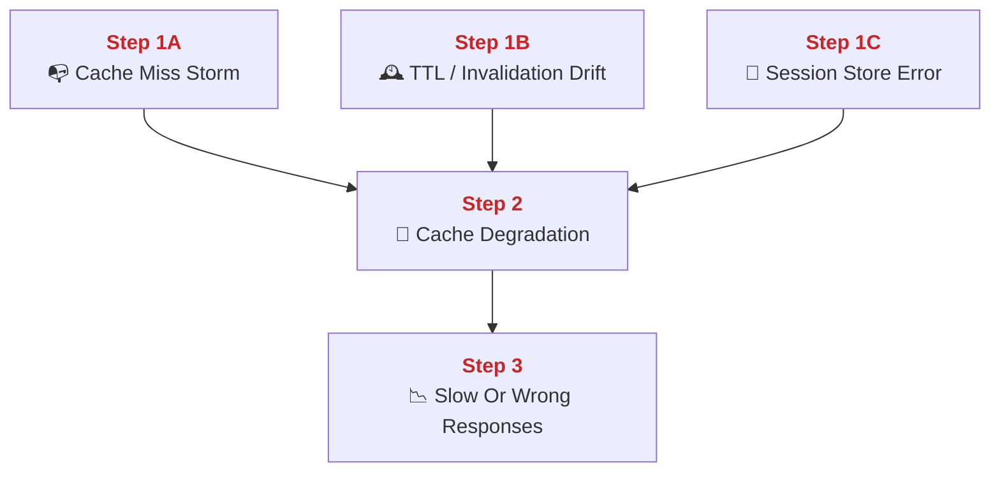
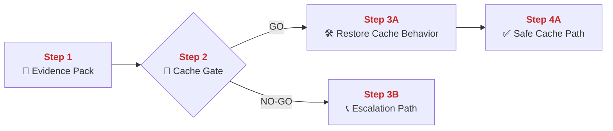
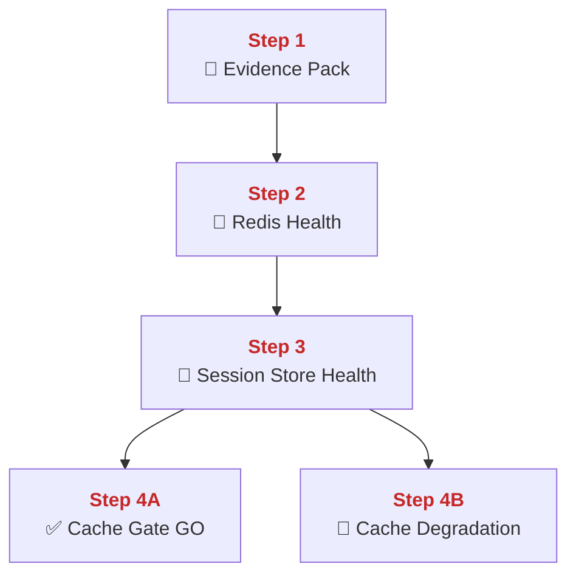

## 01 Redis and Caching

This chapter explains how PolyMoly uses Redis to answer repeated reads faster and to share short-lived state across disposable workers.
It also explains what a cache hit and cache miss really do, how TTL and invalidation work, and how to recover safely when Redis degrades.

---

## Quick Jump

- [Visual Contract Map](#visual-contract-map)
- [Vocabulary Dictionary](#vocabulary-dictionary)
- [1. Problem and Purpose](#1-problem-and-purpose)
- [2. End User Flow](#2-end-user-flow)
- [3. How It Works](#3-how-it-works)
- [4. Architectural Decision (ADR Format)](#4-architectural-decision-adr-format)
- [5. How It Fails](#5-how-it-fails)
- [6. How To Fix (Runbook Safety Standard)](#6-how-to-fix-runbook-safety-standard)
- [7. GO / NO-GO Panels](#7-go--no-go-panels)
- [8. Evidence Pack](#8-evidence-pack)
- [9. Operational Checklist](#9-operational-checklist)
- [10. CI / Quality Gate Reference](#10-ci--quality-gate-reference)
- [What Did We Learn](#what-did-we-learn)

---

## Visual Contract Map

### ADU: Cache Resolution Path

#### Technical Definition

- **[Cache Path](#term-cache-path)**: The request path that checks Redis before slower storage.
- **[Cache Key](#term-cache-key)**: The exact string used to look up one cached value.
- **[Cache Hit](#term-cache-hit)**: A lookup where Redis already has the needed value.
- **[Cache Miss](#term-cache-miss)**: A lookup where Redis does not have the needed value.
- **[TTL](#term-ttl)**: The expiration timer attached to a cached value.
- **[Redis](#term-redis)**: The in-memory data store used for fast lookups and shared short-lived state.
- **[Persistent Store](#term-persistent-store)**: The slower durable database used when cache does not have the answer.

#### Diagram



#### 📖 Deterministic Story

- <span style="color:#c62828"><strong>Step 1:</strong></span> A request enters the **[Cache Path](#term-cache-path)**.
- <span style="color:#c62828"><strong>Step 2:</strong></span> The application builds the **[Cache Key](#term-cache-key)** for that request.
- <span style="color:#c62828"><strong>Step 3:</strong></span> The application checks **[Redis](#term-redis)** first.
- <span style="color:#c62828"><strong>Step 4A:</strong></span> If **[Redis](#term-redis)** has the value, the result is a **[Cache Hit](#term-cache-hit)**.
- <span style="color:#c62828"><strong>Step 4B:</strong></span> If **[Redis](#term-redis)** does not have the value, the result is a **[Cache Miss](#term-cache-miss)**.
- <span style="color:#c62828"><strong>Step 5:</strong></span> A miss falls through to the **[Persistent Store](#term-persistent-store)**.
- <span style="color:#c62828"><strong>Step 6:</strong></span> The fresh value is written back to **[Redis](#term-redis)** with a **[TTL](#term-ttl)**.
- <span style="color:#c62828"><strong>Step 7:</strong></span> The response returns to the caller.

#### 🧠 Conceptual Layer

Here is what physically happens inside the system:

Step 1 starts inside one application process. A request already reached PHP, Node, or Go, and the process is now preparing to answer it. The network action is the live client or internal service connection that carried the request into the app. At the socket level, that connection is already open and the request bytes have already been read. In memory, the application keeps route parameters, headers, and request-local state for this call. The first decision is whether this code path uses caching at all. If yes, the next action is not a database query yet. The next action is to build the lookup name for Redis.

Step 2 is the **[Cache Key](#term-cache-key)** build. The application takes concrete request data such as tenant, route, object ID, locale, or query shape and joins them into one deterministic key string. There is no new network call yet. This is local string building in process memory. The important stored state is the exact naming convention the app uses, because the same request shape must build the same key every time. The decision here is whether the key is specific enough to avoid collisions and stable enough to be reused later. If yes, the next network action is a Redis lookup.

Step 3 happens when the app opens or reuses a TCP connection from its Redis client pool and sends a GET or similar command to **[Redis](#term-redis)**. Bytes move over the internal network from the app container to the Redis container. Inside the application process, the Redis client keeps connection pool state and the current pending command in memory. Inside Redis, the server process reads the command from its socket, parses the key, and checks its in-memory dictionary. The decision is whether that exact key currently exists and is still valid.

Step 4A is a **[Cache Hit](#term-cache-hit)**. Redis finds the key in memory, checks its expiration metadata, and returns the cached value on the same connection. The app process reads the returned bytes and deserializes them. The important memory state is the cached object already sitting in Redis RAM plus the app's current response state. The next network action is not a database call. The next action is to write the response back to the original caller.

Step 4B is a **[Cache Miss](#term-cache-miss)**. Redis does not find the key, or it finds an expired entry and treats it as unavailable. The app gets an empty result and keeps the request open. In memory, the app still has the original request state plus the generated key. The decision now is to fall through to durable storage, because Redis cannot answer this request. The next network action is a database query.

Step 5 happens at the **[Persistent Store](#term-persistent-store)**. The application opens or reuses a database connection, sends the query, and waits for rows. The database process reads the query, checks indexes and buffers, and returns the data. The app now holds fresh result data in memory. The decision is whether the returned data is safe to cache. If yes, the next network action is a SET back to Redis.

Step 6 is the write-back with **[TTL](#term-ttl)**. The application sends the cache key, value, and expiration to Redis. Redis stores the value in memory and stores the expire time next to it. That TTL metadata is what lets Redis delete or ignore old data later. The next network action after the write completes is to send the application response to the waiting caller.

Step 7 is the return path. The app writes the response bytes back to the original socket. That is the whole cache resolution path: build a key, ask Redis, fall back to durable storage only when needed, and write a timed copy back into memory for the next request.

#### 🧩 Imagine It Like

- You first look at the quick note wall ([Redis](#term-redis)) using one note label ([Cache Key](#term-cache-key)).
- If the note is already there, that is a fast answer ([Cache Hit](#term-cache-hit)).
- If the note is missing, you walk to the archive room ([Persistent Store](#term-persistent-store)), copy the answer, and pin it back with an expiry time ([TTL](#term-ttl)).

#### 🔎 Lemme Explain

- The cache exists to avoid repeating slow durable reads for the same question.
- If Redis fails, the request can still work, but the slower store takes the full load.

---

## Vocabulary Dictionary

### Technical Definition

- <a id="term-cache-path"></a> **[Cache Path](#term-cache-path)**: The request path that checks Redis before slower storage.
- <a id="term-cache-key"></a> **[Cache Key](https://redis.io/system/docs/latest/develop/use/keyspace/)**: The exact string used to look up one cached value.
- <a id="term-cache-hit"></a> **[Cache Hit](https://en.wikipedia.org/wiki/Cache_(computing))**: A lookup where Redis already has the needed value.
- <a id="term-cache-miss"></a> **[Cache Miss](https://en.wikipedia.org/wiki/Cache_(computing))**: A lookup where Redis does not have the needed value.
- <a id="term-ttl"></a> **[TTL](https://redis.io/system/docs/latest/commands/ttl/)**: The expiration timer attached to a cached value.
- <a id="term-redis"></a> **[Redis](https://redis.io/)**: The in-memory data store used for fast lookups and shared short-lived state.
- <a id="term-persistent-store"></a> **[Persistent Store](https://en.wikipedia.org/wiki/Database)**: The slower durable database used when cache does not have the answer.
- <a id="term-cache-invalidation"></a> **[Cache Invalidation](https://en.wikipedia.org/wiki/Cache_invalidation)**: The explicit removal of old cached values after source data changes.
- <a id="term-session-store"></a> **[Session Store](https://en.wikipedia.org/wiki/Session_(computer_science))**: Shared external storage for user session continuity.
- <a id="term-cache-degradation"></a> **[Cache Degradation](#term-cache-degradation)**: A state where Redis is slow, full, unreachable, or serving wrong freshness behavior.
- <a id="term-cache-gate"></a> **[Cache Gate](#term-cache-gate)**: The decision point that decides whether cache behavior is still safe enough for GO.
- <a id="term-evidence-pack"></a> **[Evidence Pack](#term-evidence-pack)**: The minimum set of metrics, logs, and runtime checks gathered before mutation.
- <a id="term-escalation-path"></a> **[Escalation Path](#term-escalation-path)**: The responder path used when direct cache mutation is unsafe.

---

## 1. Problem and Purpose

### Trust Boundary

- External entry: Application reads and writes enter the fast-memory path through Redis commands.
- Protected side: Durable business truth stays behind the cache and session boundary in the persistent store.
- Failure posture: If cache freshness or session continuity is uncertain, fall back to the source of truth before trusting memory.

### ADU: Why Memory Sits Before Disk

#### Technical Definition

- **[Redis](#term-redis)**: The in-memory data store used for fast lookups and shared short-lived state.
- **[Persistent Store](#term-persistent-store)**: The slower durable database used when cache does not have the answer.
- **[Cache Hit](#term-cache-hit)**: A lookup where Redis already has the needed value.
- **[Cache Miss](#term-cache-miss)**: A lookup where Redis does not have the needed value.
- **[Cache Path](#term-cache-path)**: The request path that checks Redis before slower storage.

#### Diagram



#### 📖 Deterministic Story

- <span style="color:#c62828"><strong>Step 1:</strong></span> The application starts the **[Cache Path](#term-cache-path)** before asking the durable store.
- <span style="color:#c62828"><strong>Step 2:</strong></span> **[Redis](#term-redis)** gets the first lookup.
- <span style="color:#c62828"><strong>Step 3A:</strong></span> A **[Cache Hit](#term-cache-hit)** ends the read quickly.
- <span style="color:#c62828"><strong>Step 3B:</strong></span> A **[Cache Miss](#term-cache-miss)** falls through to the **[Persistent Store](#term-persistent-store)**.
- <span style="color:#c62828"><strong>Step 4:</strong></span> The returned value goes back into the **[Cache Path](#term-cache-path)** for reuse.

#### 🧠 Conceptual Layer

Here is what physically happens inside the system:

Step 1 starts inside the application process before any database query leaves the service. The request is already open, the handler has the route arguments in memory, and the code decides whether this endpoint is on the **[Cache Path](#term-cache-path)**. The network action at this moment is still the already-open client connection to the app. No durable lookup has been sent yet. The decision is whether the request is eligible for a fast memory lookup first. If yes, the next network action is to ask Redis before asking disk-backed storage.

Step 2 is the first Redis call. The application takes the request data it already has in memory and sends a lookup command to **[Redis](#term-redis)**. That is a short internal network hop inside the platform. Redis is designed to answer from RAM, so the server process checks an in-memory key table instead of touching a disk-backed data file for this request path. The decision here is whether the needed value already sits in memory under the expected key. If yes, the next network action is a fast reply to the app. If not, the next network action must go to a slower durable system.

Step 3A is the **[Cache Hit](#term-cache-hit)** branch. Redis already has the answer, so the app receives the value and can continue building the response without touching the **[Persistent Store](#term-persistent-store)**. The important memory state is the cached object already stored in Redis and the in-flight response object inside the app. This branch matters because every hit removes one read from the slower system. The next network action is simply the response going back to the caller.

Step 3B is the **[Cache Miss](#term-cache-miss)** branch. Redis does not have the answer, so the app keeps the request open and opens a separate database query to the **[Persistent Store](#term-persistent-store)**. Now slower work happens: the database parses the query, checks its buffers and indexes, and returns rows. The app holds that fresh result in memory and now has a choice: return it only once or also store it for the next request. In PolyMoly, the point of this path is reuse, so the next action is usually a cache write-back.

Step 4 is the return into the cache path. The app writes the fresh value into Redis and then returns the response to the caller. That one extra write turns the next matching request into a hit instead of another miss. This is why memory sits before disk in the design. The system spends a small amount of RAM to avoid repeating a larger amount of slower database work.

#### 🧩 Imagine It Like

- The worker checks the memo board ([Redis](#term-redis)) before walking to the archive room ([Persistent Store](#term-persistent-store)).
- If the memo is there, the worker answers immediately ([Cache Hit](#term-cache-hit)).
- If not, the worker fetches the answer from storage and pins a new memo for later ([Cache Miss](#term-cache-miss)).

#### 🔎 Lemme Explain

- Cache exists because repeated reads are cheaper in RAM than in the main database.
- If hit rate falls, the database becomes the emergency backstop and will feel the load first.

---

## 2. End User Flow

### ADU: Request To Fast Read

#### Technical Definition

- **[Cache Key](#term-cache-key)**: The exact string used to look up one cached value.
- **[Redis](#term-redis)**: The in-memory data store used for fast lookups and shared short-lived state.
- **[Cache Hit](#term-cache-hit)**: A lookup where Redis already has the needed value.
- **[Cache Miss](#term-cache-miss)**: A lookup where Redis does not have the needed value.
- **[TTL](#term-ttl)**: The expiration timer attached to a cached value.
- **[Persistent Store](#term-persistent-store)**: The slower durable database used when cache does not have the answer.

#### Diagram



#### 📖 Deterministic Story

- <span style="color:#c62828"><strong>Step 1:</strong></span> A read request reaches the app.
- <span style="color:#c62828"><strong>Step 2:</strong></span> The app generates the **[Cache Key](#term-cache-key)**.
- <span style="color:#c62828"><strong>Step 3:</strong></span> The app asks **[Redis](#term-redis)** for that key.
- <span style="color:#c62828"><strong>Step 4A:</strong></span> A **[Cache Hit](#term-cache-hit)** returns the value immediately.
- <span style="color:#c62828"><strong>Step 4B:</strong></span> A **[Cache Miss](#term-cache-miss)** sends the read to the **[Persistent Store](#term-persistent-store)**.
- <span style="color:#c62828"><strong>Step 5:</strong></span> The fresh value is saved with a **[TTL](#term-ttl)**.
- <span style="color:#c62828"><strong>Step 6:</strong></span> The next matching read becomes fast.

#### 🧠 Conceptual Layer

Here is what physically happens inside the system:

Step 1 begins when a client sends a normal read request to the app. The network action is the request bytes arriving on the app socket. The handler parses the request and creates request-local state in memory. It now knows which object or page the caller wants. The next decision is how to ask for that data without doing unnecessary slow work.

Step 2 is cache key creation. The app process combines the values that define the data shape into one **[Cache Key](#term-cache-key)**. No external network call happens here. This is in-process work with strings and IDs already loaded in memory. The decision is whether the generated key is the same one that would have been used on an earlier identical read. If yes, the next network action is a Redis read.

Step 3 is the Redis lookup. The app uses its Redis client to send the key to **[Redis](#term-redis)**. Redis reads the bytes from its socket, parses the command, and checks its in-memory map. The important stored state is the key table plus the expiry data attached to each entry. The decision is whether the key exists and is still alive.

Step 4A is the hit branch. If the value exists and has not expired, Redis returns it. The app reads the bytes, decodes them, and writes the response back to the client. No database network call happens at all. The whole point of the hit path is that the request never reaches the slower durable system.

Step 4B is the miss branch. Redis returns no usable value, so the app opens a database call to the **[Persistent Store](#term-persistent-store)**. The database reads the query, finds the rows, and sends them back. The app now has the fresh data in memory. The decision is whether that value should be reusable for later requests. If yes, the next network action is a write back into Redis.

Step 5 is the TTL write. The app sends the value and the **[TTL](#term-ttl)** to Redis. Redis stores the value in memory and stores the expire time next to it. That expiry metadata is what stops stale values from living forever.

Step 6 is the future payoff. The current request finishes, and the next request that builds the same key can use the faster hit path. That is how one slow read turns into many fast reads.

#### 🧩 Imagine It Like

- You write a clear label on a drawer ([Cache Key](#term-cache-key)).
- You check the drawer in the fast room ([Redis](#term-redis)) first.
- If the drawer is empty, you visit the archive ([Persistent Store](#term-persistent-store)), then refill the drawer with a timer label ([TTL](#term-ttl)).

#### 🔎 Lemme Explain

- This is the basic read-through cache loop.
- A miss is normal sometimes. A miss storm is expensive.

---

## 3. How It Works

### ADU: Invalidation And Shared Session State

#### Technical Definition

- **[Cache Invalidation](#term-cache-invalidation)**: The explicit removal of old cached values after source data changes.
- **[Session Store](#term-session-store)**: Shared external storage for user session continuity.
- **[Redis](#term-redis)**: The in-memory data store used for fast lookups and shared short-lived state.
- **[TTL](#term-ttl)**: The expiration timer attached to a cached value.
- **[Cache Key](#term-cache-key)**: The exact string used to look up one cached value.

#### Diagram



#### 📖 Deterministic Story

- <span style="color:#c62828"><strong>Step 1:</strong></span> A source write changes the real value.
- <span style="color:#c62828"><strong>Step 2:</strong></span> **[Cache Invalidation](#term-cache-invalidation)** removes the old cache entry.
- <span style="color:#c62828"><strong>Step 3:</strong></span> **[Redis](#term-redis)** now holds either no entry or the next fresh entry.
- <span style="color:#c62828"><strong>Step 4:</strong></span> The same **[Redis](#term-redis)** cluster also acts as a **[Session Store](#term-session-store)** for shared user continuity.
- <span style="color:#c62828"><strong>Step 5:</strong></span> **[TTL](#term-ttl)** limits how long entries live.
- <span style="color:#c62828"><strong>Step 6:</strong></span> Workers keep shared fresh state instead of private stale state.

#### 🧠 Conceptual Layer

Here is what physically happens inside the system:

Step 1 starts when the application writes a new truth value to the durable store. The network action is the database write call, not a Redis call yet. The app and the database both hold write transaction state in memory. Once that write succeeds, the system knows the old cached copy may no longer match reality. The decision now is whether the cache entry tied to this changed object must be removed or replaced.

Step 2 is **[Cache Invalidation](#term-cache-invalidation)**. The application sends a DEL or similar command to Redis for the affected **[Cache Key](#term-cache-key)**. Redis reads that command from its socket and removes the key from its in-memory table. The important state here is the exact mapping between changed source objects and the cache keys that depend on them. If the system invalidates the right keys, the next request will rebuild fresh data. If it invalidates nothing, stale data can survive longer than intended.

Step 3 is the post-invalidation cache state inside **[Redis](#term-redis)**. The key is now absent, or it is replaced later by a fresh value. Redis keeps this state fully in RAM, which is why reads remain fast. The next network action depends on future requests: either a new miss-to-refill flow or a hit on a newly written fresh value.

Step 4 is shared session behavior through the same Redis system. A worker handling a logged-in user reads the session ID from a cookie or header, then uses Redis as the **[Session Store](#term-session-store)**. The network action is a Redis GET or HGET on the session key. The reason this matters is that one worker restart does not erase the user's session. Another worker can read the same session state from Redis because the state is outside process memory.

Step 5 is **[TTL](#term-ttl)** on both cache and session data where appropriate. Redis stores expiration metadata in memory next to the value. When time passes, Redis treats the entry as expired and later removes it. The decision is time-based instead of request-based here. The next network action for an expired item is usually a miss and refill, or a login refresh for a session flow.

Step 6 is the stable result. Workers stay disposable because shared short-lived state lives outside them, and freshness is controlled through invalidation plus TTL rather than through guesswork inside one process.

#### 🧩 Imagine It Like

- When a real record changes, you tear down the old note card ([Cache Invalidation](#term-cache-invalidation)).
- The same fast cabinet ([Redis](#term-redis)) also keeps visitor badges in one shared drawer ([Session Store](#term-session-store)).
- A timer tag ([TTL](#term-ttl)) stops old cards from sitting there forever.

#### 🔎 Lemme Explain

- Fast cache only helps if old values are removed or expire on time.
- Shared session state is one reason workers can restart without logging everyone out.

---

## 4. Architectural Decision (ADR Format)

### ADU: Redis Is Shared Memory, Not Source Of Truth

#### Technical Definition

- **[Redis](#term-redis)**: The in-memory data store used for fast lookups and shared short-lived state.
- **[Persistent Store](#term-persistent-store)**: The slower durable database used when cache does not have the answer.
- **[Session Store](#term-session-store)**: Shared external storage for user session continuity.
- **[Cache Degradation](#term-cache-degradation)**: A state where Redis is slow, full, unreachable, or serving wrong freshness behavior.
- **[Cache Gate](#term-cache-gate)**: The decision point that decides whether cache behavior is still safe enough for GO.

#### Diagram



#### 📖 Deterministic Story

- <span style="color:#c62828"><strong>Step 1:</strong></span> **[Redis](#term-redis)** is used as shared fast memory.
- <span style="color:#c62828"><strong>Step 2:</strong></span> It also serves as the **[Session Store](#term-session-store)**.
- <span style="color:#c62828"><strong>Step 3:</strong></span> It accelerates the fast read path.
- <span style="color:#c62828"><strong>Step 4:</strong></span> If **[Redis](#term-redis)** degrades, the state becomes **[Cache Degradation](#term-cache-degradation)**.
- <span style="color:#c62828"><strong>Step 5:</strong></span> The **[Cache Gate](#term-cache-gate)** decides whether the platform can safely continue with degraded cache behavior.

#### 🧠 Conceptual Layer

Here is what physically happens inside the system:

Step 1 is the architectural choice to use **[Redis](#term-redis)** as shared fast memory, not as the only durable truth for business records. Redis stores values in RAM and can recover from persistence settings if configured, but the design assumes the durable truth still lives in the **[Persistent Store](#term-persistent-store)**. The network action in normal operation is many short internal requests from app containers to the Redis port. In memory, Redis keeps key-value state and expiry metadata for quick reuse. The decision behind this design is that fast memory is valuable, but durable business truth must survive beyond one memory process.

Step 2 is the shared session role. Workers in PolyMoly are disposable, so user continuity cannot live only inside one worker process. The app reads session IDs from the request and then asks Redis for the current session payload. The network action is again a short internal Redis call. In memory, the app keeps only the current session data for the duration of the request, while Redis keeps the shared copy. That is why a request can land on worker A and the next request can land on worker B without losing the login state.

Step 3 is the fast read path. Many endpoints use Redis to avoid repeating the same database reads. The network action is a read from Redis instead of a slower read from the database. The decision is always whether the cached value is usable now. If yes, the system saves database work. If no, it falls back to the durable system and rebuilds cache state.

Step 4 is **[Cache Degradation](#term-cache-degradation)**. This can mean Redis is unreachable, memory pressure is high, latency is rising, or freshness behavior is wrong because invalidation is broken. The app can still keep working in many cases, but the next network action shifts toward the database path. The important memory state is no longer only in Redis. It now includes growing connection pressure and slower in-flight request state elsewhere in the platform.

Step 5 is the **[Cache Gate](#term-cache-gate)**. Operators need to decide whether the current degraded cache condition is still safe enough for continued operation or whether changes must stop until cache behavior is restored. This is where observability matters. The right question is not “is Redis alive.” The right question is “can the platform still carry the shifted read load and preserve correct session behavior safely.”

#### 🧩 Imagine It Like

- [Redis](#term-redis) is the shared whiteboard room, not the permanent archive vault.
- Workers read quick notes and visitor badges there, but the permanent records stay elsewhere.
- If the whiteboard room slows down, more people have to walk back to the archive.

#### 🔎 Lemme Explain

- Redis is fast shared memory. It is not the place where the platform stores permanent truth.
- When Redis degrades, the rest of the system pays the price immediately.

---

## 5. How It Fails

### ADU: Cache Failure Modes

#### Technical Definition

- **[Cache Miss](#term-cache-miss)**: A lookup where Redis does not have the needed value.
- **[Cache Invalidation](#term-cache-invalidation)**: The explicit removal of old cached values after source data changes.
- **[TTL](#term-ttl)**: The expiration timer attached to a cached value.
- **[Cache Degradation](#term-cache-degradation)**: A state where Redis is slow, full, unreachable, or serving wrong freshness behavior.
- **[Session Store](#term-session-store)**: Shared external storage for user session continuity.

#### Diagram



#### 📖 Deterministic Story

- <span style="color:#c62828"><strong>Step 1A:</strong></span> Too many repeated **[Cache Miss](#term-cache-miss)** calls can overload the slower store.
- <span style="color:#c62828"><strong>Step 1B:</strong></span> Broken **[TTL](#term-ttl)** or **[Cache Invalidation](#term-cache-invalidation)** can keep wrong data alive.
- <span style="color:#c62828"><strong>Step 1C:</strong></span> A broken **[Session Store](#term-session-store)** can break user continuity.
- <span style="color:#c62828"><strong>Step 2:</strong></span> Any of these paths becomes **[Cache Degradation](#term-cache-degradation)**.
- <span style="color:#c62828"><strong>Step 3:</strong></span> Users see slow answers, stale answers, or broken login continuity.

#### 🧠 Conceptual Layer

Here is what physically happens inside the system:

Step 1A is a miss storm. The app keeps building valid cache keys, but Redis keeps returning empty or expired results for many requests in a row. The network action shifts from cheap Redis GET calls to many more database reads. In memory, the application now holds more waiting query state, and the database sees more active work than normal. The decision path is still correct, but the cost changes. That is why a miss storm can turn a healthy database into a pressured database very quickly.

Step 1B is freshness drift. The source data changes, but **[Cache Invalidation](#term-cache-invalidation)** does not remove the old key, or the **[TTL](#term-ttl)** is too long for the data type. Redis still answers quickly, but it answers with the wrong value. The network action looks healthy from a latency point of view, which makes this failure dangerous. In memory, Redis holds stale bytes under a still-valid key. The decision error is freshness, not availability.

Step 1C is session trouble in the **[Session Store](#term-session-store)**. The app reads a session cookie, asks Redis for the shared session object, and gets timeout, empty data, or inconsistent state. The network action is the failed or delayed Redis lookup. In memory, the app now has a request that cannot reconstruct user identity cleanly. The next action may be forced logout, 401 behavior, or repeated redirects.

Step 2 is the grouped degraded state, **[Cache Degradation](#term-cache-degradation)**. The root causes are different, but the platform now has to operate with weaker fast-state behavior. Some failures push load to the database. Some return wrong data. Some break user continuity. The important point is that cache failure is not one thing. It has several mechanical failure modes.

Step 3 is user impact. The caller sees higher latency, stale reads, or broken sessions. That is why the cache path needs real observability. A green TCP port alone is not enough to prove the cache layer is healthy.

#### 🧩 Imagine It Like

- Sometimes the fast note wall is empty too often.
- Sometimes the note wall answers fast but with old notes.
- Sometimes the visitor badge drawer loses track of who is inside.

#### 🔎 Lemme Explain

- Cache failure can be speed failure, freshness failure, or continuity failure.
- Those are different incidents and they need to be told apart early.

| Symptom | Root Cause | Severity | Fastest confirmation step |
| :--- | :--- | :--- | :--- |
| High DB read load after stable traffic | miss storm | Sev-2 | `docker compose exec redis redis-cli info stats` |
| Correct latency but wrong values | invalidation or TTL drift | Sev-1 | compare source row vs cached value |
| Login/session loss | session store lookup failure | Sev-1 | inspect Redis session key presence |
| Elevated Redis latency | Redis resource pressure | Sev-2 | `docker compose exec redis redis-cli --latency-history -i 1` |

---

## 6. How To Fix (Runbook Safety Standard)

### ADU: Restore Safe Cache Behavior

#### Technical Definition

- **[Evidence Pack](#term-evidence-pack)**: The minimum set of metrics, logs, and runtime checks gathered before mutation.
- **[Cache Degradation](#term-cache-degradation)**: A state where Redis is slow, full, unreachable, or serving wrong freshness behavior.
- **[Cache Gate](#term-cache-gate)**: The decision point that decides whether cache behavior is still safe enough for GO.
- **[Cache Invalidation](#term-cache-invalidation)**: The explicit removal of old cached values after source data changes.
- **[Escalation Path](#term-escalation-path)**: The responder path used when direct cache mutation is unsafe.

#### Diagram



#### 📖 Deterministic Story

- <span style="color:#c62828"><strong>Step 1:</strong></span> Gather the **[Evidence Pack](#term-evidence-pack)** before mutation.
- <span style="color:#c62828"><strong>Step 2:</strong></span> Use the **[Cache Gate](#term-cache-gate)** to decide whether direct action is safe.
- <span style="color:#c62828"><strong>Step 3A:</strong></span> If GO, restore the broken cache behavior or restart the degraded Redis service path.
- <span style="color:#c62828"><strong>Step 4A:</strong></span> Verify that the cache path is fast and correct again.
- <span style="color:#c62828"><strong>Step 3B:</strong></span> If NO-GO, use the **[Escalation Path](#term-escalation-path)** instead of forcing mutation.

#### 🧠 Conceptual Layer

Here is what physically happens inside the system:

Step 1 is evidence collection. Operators do read-only checks first. They look at Redis latency, memory usage, error logs, session failures, and whether the database is receiving fallback pressure. The network actions are read-only CLI calls to Redis and read-only artifact reads from monitoring. In memory, the responder builds a current picture of whether the problem is availability, freshness, or session continuity.

Step 2 is the **[Cache Gate](#term-cache-gate)**. This is the decision point between safe direct correction and unsafe guessing. The responder compares the observed problem with the current blast radius. If the issue is narrow, such as a single Redis process stall or a clear invalidation bug already understood, the next network action can be a controlled service mutation. If the issue is broad, unclear, or already causing heavy database pressure, the next action should be escalation.

Step 3A is the GO branch. The operator may restart Redis, repair a key invalidation path, or restore normal service connectivity. The network action is now a Docker Engine control call or a precise application-side mutation. In memory, the new Redis process or fixed app path starts rebuilding normal cache behavior. This step is only safe because the evidence already identified the failure mode.

Step 4A is verification. The responder runs the same Redis reads, checks latency again, checks memory again, and confirms that request behavior is back to normal. The next network action is still read-only inspection. Only when both speed and correctness look healthy is the cache incident closed.

Step 3B is the NO-GO branch. The responder stops instead of adding blind mutations to an already unclear state. The next action is the **[Escalation Path](#term-escalation-path)**.

#### 🧩 Imagine It Like

- First you inspect the fast-note room and the archive pressure before touching anything.
- Then you decide whether this is one bad drawer or a wider room problem.
- You only reopen normal traffic after speed and correctness both look right again.

#### 🔎 Lemme Explain

- Redis incidents are not fixed by reflex. They are fixed by identifying which cache promise broke.
- Speed without correctness is still a failed cache.

### Exact Runbook Commands

```bash
# Read-only checks
go run ./system/tools/poly/cmd/poly gate check performance-review
docker compose ps redis redis-exporter postgres
docker compose exec redis redis-cli ping
docker compose exec redis redis-cli info memory
docker compose exec redis redis-cli info stats
```

```bash
# Mutation (only after Evidence Pack is captured and Cache Gate is GO)
docker compose restart redis redis-exporter
```

```bash
# Verify
docker compose exec redis redis-cli ping
docker compose exec redis redis-cli info memory
docker compose exec redis redis-cli info stats
go run ./system/tools/poly/cmd/poly gate check performance-review
```

Rollback rule:
- If Redis restart worsens latency or shifts sustained error pressure to the database, STOP and escalate.
- Do not flush broad keyspace state as a first response during live user impact.

---

## 7. GO / NO-GO Panels

### ADU: Cache Readiness Gate

#### Technical Definition

- **[Cache Gate](#term-cache-gate)**: The decision point that decides whether cache behavior is still safe enough for GO.
- **[Cache Degradation](#term-cache-degradation)**: A state where Redis is slow, full, unreachable, or serving wrong freshness behavior.
- **[Redis](#term-redis)**: The in-memory data store used for fast lookups and shared short-lived state.
- **[Session Store](#term-session-store)**: Shared external storage for user session continuity.
- **[Evidence Pack](#term-evidence-pack)**: The minimum set of metrics, logs, and runtime checks gathered before mutation.

#### Diagram



#### 📖 Deterministic Story

- <span style="color:#c62828"><strong>Step 1:</strong></span> The **[Evidence Pack](#term-evidence-pack)** enters the decision point.
- <span style="color:#c62828"><strong>Step 2:</strong></span> **[Redis](#term-redis)** health and latency are checked.
- <span style="color:#c62828"><strong>Step 3:</strong></span> **[Session Store](#term-session-store)** continuity and correctness are checked.
- <span style="color:#c62828"><strong>Step 4A:</strong></span> If both are healthy enough, the **[Cache Gate](#term-cache-gate)** stays GO.
- <span style="color:#c62828"><strong>Step 4B:</strong></span> If either one is unsafe, the state remains **[Cache Degradation](#term-cache-degradation)**.

#### 🧠 Conceptual Layer

Here is what physically happens inside the system:

Step 1 starts with data already gathered from Redis, the application, and the database side. The network actions are read-only checks. In memory, the responder holds the latest latency, memory, hit or miss behavior, and session symptoms for the incident window.

Step 2 is the Redis health check. Operators confirm that the Redis process is reachable, not overloaded, and returning commands in reasonable time. The decision is whether Redis can still act as fast shared memory instead of as a bottleneck.

Step 3 is the session continuity check. Even if cache reads look acceptable, the platform is not safe if shared login state is failing. Operators confirm that session lookups behave normally and that the app is not losing user continuity. This is the fork point.

Step 4A is GO when both fast-state behavior and shared session behavior are acceptable. Step 4B is NO-GO when either speed, correctness, or continuity is unsafe. That is what the cache gate really means.

#### 🧩 Imagine It Like

- You check the fast-note wall first.
- Then you check the shared badge drawer.
- If either one is failing, normal work should not pretend everything is fine.

#### 🔎 Lemme Explain

- Cache GO is not only about Redis being up.
- It is about fast reads and shared session state both being safe enough.

---

## 8. Evidence Pack

Collect before mutation:

- Redis ping, memory, and stats output.
- Current Redis and app logs for cache or session errors.
- Current DB pressure signal while Redis is degraded.
- Cache symptom classification: miss storm, freshness drift, or session failure.
- Current dashboard or alert references for Redis latency and memory.
- Last known healthy time anchor.

---

## 9. Operational Checklist

- [ ] Cache failure mode is classified.
- [ ] Redis basic reachability is confirmed.
- [ ] Session continuity impact is checked.
- [ ] Database fallback pressure is checked.
- [ ] Mutation decision is explicit.
- [ ] Verification confirms both speed and correctness.

---

## 10. CI / Quality Gate Reference

Run:

```bash
task docs:governance
task docs:governance:strict
go run ./system/tools/poly/cmd/poly gate check performance-review
go run ./system/tools/poly/cmd/poly gate check hardening-core
```

Related workflows and evidence:

- `monitoring/prometheus/alerts.yaml`
- `monitoring/grafana/dashboards/overview.json`
- `monitoring/grafana/dashboards/slo-and-capacity.json`
- `tools/artifacts/performance-review/`
- `tools/artifacts/docs-governance/`
- `tools/artifacts/docs-links/`

---

## What Did We Learn

- Redis removes repeated read pressure from the slower durable store.
- Cache correctness depends on key design, TTL, and invalidation together.
- Shared session state is another reason Redis matters to disposable workers.
- Cache incidents must separate speed problems from freshness problems.

👉 Next Chapter: **[02-databases-and-scaling.md](./02-databases-and-scaling.md)**
