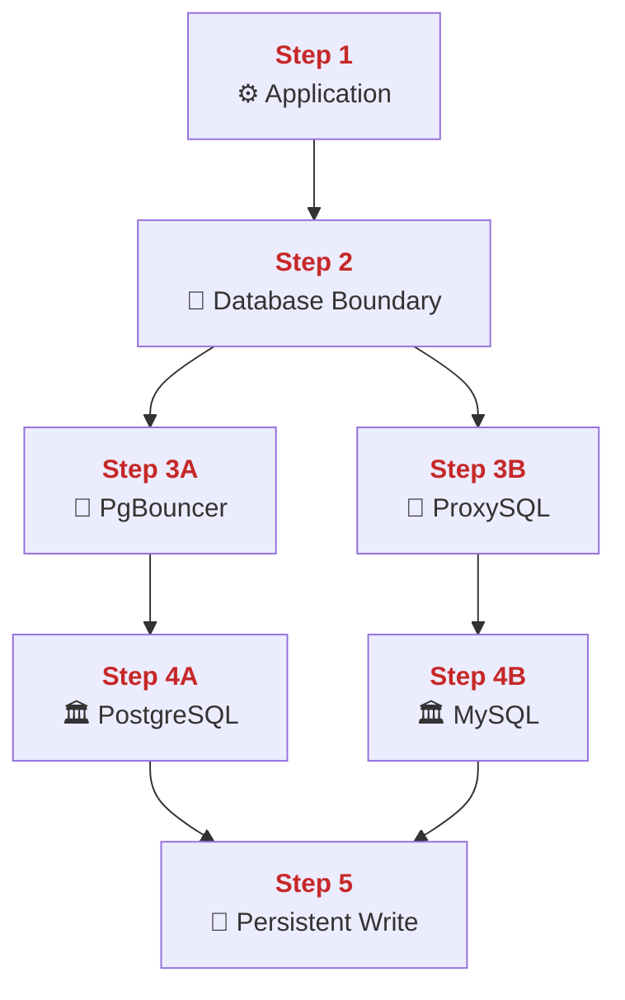
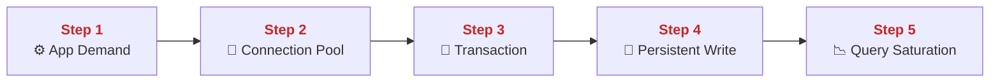
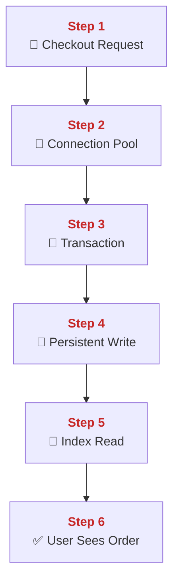
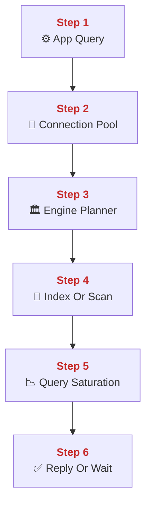
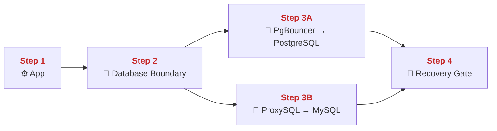
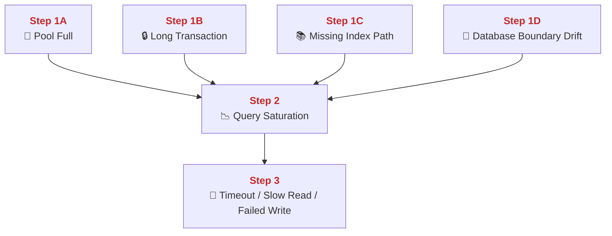
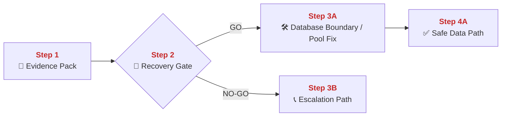
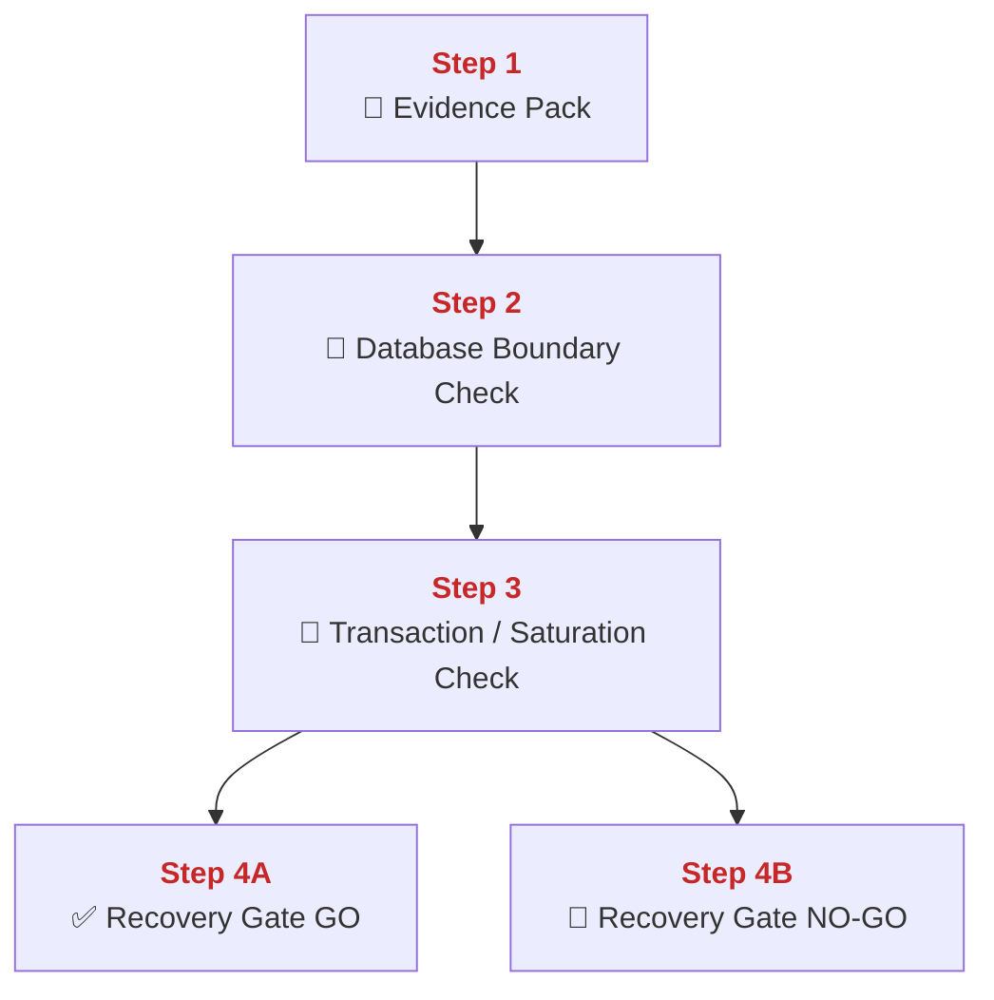

## 02 Databases and Scaling

This chapter explains how PolyMoly keeps durable truth in PostgreSQL and MySQL while placing connection boundaries in front of them.
It also explains how pooling, indexing, saturation control, and backup-aware operations keep the data layer fast enough for live traffic and safe enough for recovery.

---

## Quick Jump

- [Visual Contract Map](#visual-contract-map)
- [Vocabulary Dictionary](#vocabulary-dictionary)
- [1. Problem and Purpose](#1-problem-and-purpose)
- [2. End User Flow](#2-end-user-flow)
- [3. How It Works](#3-how-it-works)
- [4. Architectural Decision (ADR Format)](#4-architectural-decision-adr-format)
- [5. How It Fails](#5-how-it-fails)
- [6. How To Fix (Runbook Safety Standard)](#6-how-to-fix-runbook-safety-standard)
- [7. GO / NO-GO Panels](#7-go--no-go-panels)
- [8. Evidence Pack](#8-evidence-pack)
- [9. Operational Checklist](#9-operational-checklist)
- [10. CI / Quality Gate Reference](#10-ci--quality-gate-reference)
- [What Did We Learn](#what-did-we-learn)

---

## Visual Contract Map

### ADU: Durable Data Path

#### Technical Definition

- **[Database Boundary](#term-database-boundary)**: The controlled path between applications and the durable database engines.
- **[PgBouncer](#term-pgbouncer)**: The PostgreSQL pooling boundary used by applications before PostgreSQL.
- **[ProxySQL](#term-proxysql)**: The MySQL pooling boundary used by applications before MySQL.
- **[PostgreSQL](#term-postgresql)**: The durable relational engine used for transactional truth on the PostgreSQL side.
- **[MySQL](#term-mysql)**: The durable relational engine used for transactional truth on the MySQL side.
- **[Connection Pool](#term-connection-pool)**: The bounded set of reusable database connections kept in front of the engine.
- **[Persistent Write](#term-persistent-write)**: The database operation that durably commits business state.

#### Diagram



#### 📖 Deterministic Story

- <span style="color:#c62828"><strong>Step 1:</strong></span> The application starts a durable data operation.
- <span style="color:#c62828"><strong>Step 2:</strong></span> The operation enters the **[Database Boundary](#term-database-boundary)**.
- <span style="color:#c62828"><strong>Step 3A:</strong></span> **[PostgreSQL](#term-postgresql)** traffic first reaches **[PgBouncer](#term-pgbouncer)**.
- <span style="color:#c62828"><strong>Step 3B:</strong></span> **[MySQL](#term-mysql)** traffic first reaches **[ProxySQL](#term-proxysql)**.
- <span style="color:#c62828"><strong>Step 4A:</strong></span> The pooled path reaches **[PostgreSQL](#term-postgresql)**.
- <span style="color:#c62828"><strong>Step 4B:</strong></span> The pooled path reaches **[MySQL](#term-mysql)**.
- <span style="color:#c62828"><strong>Step 5:</strong></span> The engine performs the **[Persistent Write](#term-persistent-write)** or read operation.

#### 🧠 Conceptual Layer

Here is what physically happens inside the system:

Step 1 starts inside an application process that already parsed a request and now needs durable truth. The network action is not direct client traffic anymore. It is an internal database client call created by PHP, Node, or Go. In memory, the app keeps SQL text or ORM query state, transaction flags, and current request state. The first decision is which database contract this code path belongs to: PostgreSQL or MySQL.

Step 2 is the **[Database Boundary](#term-database-boundary)** itself. PolyMoly does not send application traffic straight to the raw engines. The app environment points PostgreSQL traffic at **[PgBouncer](#term-pgbouncer)** through `DB_HOST=pgbouncer` and MySQL traffic at **[ProxySQL](#term-proxysql)** through `MYSQL_HOST=proxysql`. The network action is a TCP client connection from the app to one of those boundary services. In memory, the application client pool and the boundary service both keep connection state and query state. The decision here is which pooled path the request should enter.

Step 3A happens at **[PgBouncer](#term-pgbouncer)**. The pooler process accepts the incoming PostgreSQL client connection, reads the query stream, and maps the client to one of its backend server connections. The important in-memory structure is the **[Connection Pool](#term-connection-pool)** on the PostgreSQL side. Step 3B does the equivalent job at **[ProxySQL](#term-proxysql)** for the MySQL side. In both cases, the decision is whether there is a healthy backend connection available or whether the request must wait. This is where saturation starts showing up before the raw engine itself is fully overwhelmed.

Step 4A is the actual PostgreSQL engine path. Once PgBouncer selects a backend connection, bytes move from the pooler to **[PostgreSQL](#term-postgresql)**. Step 4B is the same shape for **[MySQL](#term-mysql)** behind ProxySQL. The database engine parses the SQL, checks transaction state, looks at buffers and indexes, and decides which rows or pages must be read or written. In memory, the engine uses its own buffers, lock tables, transaction state, and planner structures. The decision is whether the query can run now, must wait, or fails because of timeout or lock conditions.

Step 5 is the **[Persistent Write](#term-persistent-write)** or durable read result. If the statement is a write inside a valid transaction, the engine commits it to durable state. If the statement is a read, it returns rows that reflect durable state. The next network action is the engine sending result bytes back through PgBouncer or ProxySQL and then back to the application. That is the full durable path under the hood: application process, pooling boundary, engine buffers and locks, then result or commit confirmation back to the caller.

#### 🧩 Imagine It Like

- The worker does not enter the vault directly.
- The worker first passes through a front desk ([PgBouncer](#term-pgbouncer)) or another front desk ([ProxySQL](#term-proxysql)).
- Only then does the request reach the real archive room ([PostgreSQL](#term-postgresql)) or ([MySQL](#term-mysql)).

#### 🔎 Lemme Explain

- Durable truth is slow enough that direct uncontrolled access would overload it quickly.
- Pooling boundaries exist so app traffic reaches the engines in a controlled shape.

---

## Vocabulary Dictionary

### Technical Definition

- <a id="term-database-boundary"></a> **[Database Boundary](#term-database-boundary)**: The controlled path between applications and the durable database engines.
- <a id="term-pgbouncer"></a> **[PgBouncer](https://www.pgbouncer.org/)**: The PostgreSQL pooling boundary used by applications before PostgreSQL.
- <a id="term-proxysql"></a> **[ProxySQL](https://proxysql.com/)**: The MySQL pooling boundary used by applications before MySQL.
- <a id="term-postgresql"></a> **[PostgreSQL](https://www.postgresql.org/)**: The durable relational engine used for transactional truth on the PostgreSQL side.
- <a id="term-mysql"></a> **[MySQL](https://www.mysql.com/)**: The durable relational engine used for transactional truth on the MySQL side.
- <a id="term-connection-pool"></a> **[Connection Pool](https://en.wikipedia.org/wiki/Connection_pool)**: The bounded set of reusable database connections kept in front of the engine.
- <a id="term-index"></a> **[Index](https://en.wikipedia.org/wiki/Database_index)**: The data structure that lets the engine find rows without scanning the full table.
- <a id="term-transaction"></a> **[Transaction](https://en.wikipedia.org/wiki/Database_transaction)**: The database unit of work that commits or rolls back as one logical action.
- <a id="term-persistent-write"></a> **[Persistent Write](#term-persistent-write)**: The database operation that durably commits business state.
- <a id="term-query-saturation"></a> **[Query Saturation](#term-query-saturation)**: A condition where connection limits, locks, or slow work prevent the data path from serving normal traffic safely.
- <a id="term-recovery-gate"></a> **[Recovery Gate](#term-recovery-gate)**: The GO / NO-GO decision point before data-layer mutation.
- <a id="term-evidence-pack"></a> **[Evidence Pack](#term-evidence-pack)**: The minimum set of pool, engine, and backup proof gathered before mutation.
- <a id="term-escalation-path"></a> **[Escalation Path](#term-escalation-path)**: The responder path used when direct data-layer mutation is unsafe.

---

## 1. Problem and Purpose

### Trust Boundary

- External entry: App queries and writes enter the database engine through the pool and query path.
- Protected side: Committed rows, index state, and transactional truth stay inside the database boundary.
- Failure posture: If lock, timeout, or planner safety is unclear, prefer stop and rollback over blind write retries.

### ADU: Why Durable Truth Needs Boundaries

#### Technical Definition

- **[Database Boundary](#term-database-boundary)**: The controlled path between applications and the durable database engines.
- **[Connection Pool](#term-connection-pool)**: The bounded set of reusable database connections kept in front of the engine.
- **[Transaction](#term-transaction)**: The database unit of work that commits or rolls back as one logical action.
- **[Persistent Write](#term-persistent-write)**: The database operation that durably commits business state.
- **[Query Saturation](#term-query-saturation)**: A condition where connection limits, locks, or slow work prevent the data path from serving normal traffic safely.

#### Diagram



#### 📖 Deterministic Story

- <span style="color:#c62828"><strong>Step 1:</strong></span> Applications create real demand on the durable data path.
- <span style="color:#c62828"><strong>Step 2:</strong></span> The **[Connection Pool](#term-connection-pool)** shapes that demand before it hits the engine.
- <span style="color:#c62828"><strong>Step 3:</strong></span> A **[Transaction](#term-transaction)** groups related work into one unit.
- <span style="color:#c62828"><strong>Step 4:</strong></span> The database performs the **[Persistent Write](#term-persistent-write)** or read.
- <span style="color:#c62828"><strong>Step 5:</strong></span> Without boundaries, the system drifts toward **[Query Saturation](#term-query-saturation)**.

#### 🧠 Conceptual Layer

Here is what physically happens inside the system:

Step 1 starts when many app requests all need real durable data at once. Each application process can open database client sessions and send SQL. The network action is a burst of client connections and query bytes heading toward the data layer. In memory, each app process keeps its own request state and wants the database to do work immediately.

Step 2 is the **[Connection Pool](#term-connection-pool)** boundary. Instead of letting every app request open unlimited direct engine connections, PgBouncer and ProxySQL keep bounded backend connection sets. The network action is client queries entering the pooler and then being multiplexed or assigned to available backend sessions. In memory, the pooler keeps queues of waiting clients, active backend sessions, and per-connection state. The decision is whether work can move now or must wait.

Step 3 is the **[Transaction](#term-transaction)** unit inside the engine. Once a pooled connection is assigned, the engine reads the statements and groups them under transaction state. In memory, the engine now has lock state, row visibility state, and transaction metadata. The decision is whether the requested work can commit safely together or must roll back.

Step 4 is the **[Persistent Write](#term-persistent-write)** or consistent read. The engine changes durable pages or reads them under transaction rules, then returns results. This is slower and heavier than in-memory cache work because the engine must protect correctness, not only speed.

Step 5 is what happens without enough control. If too many requests, long transactions, or bad query shapes pile up, the pool fills, locks wait, and the system enters **[Query Saturation](#term-query-saturation)**. That is why the boundary exists at all. The data layer needs shaping before it needs heroics.

#### 🧩 Imagine It Like

- Too many people want the vault at once.
- The front desk ([Connection Pool](#term-connection-pool)) lines them up before they reach the vault room.
- Inside the vault, each signed operation ([Transaction](#term-transaction)) must finish cleanly before the next one can safely change the records.

#### 🔎 Lemme Explain

- Databases are not slow because they are bad. They are slow because they protect durable correctness.
- The job of the boundary is to stop uncontrolled app demand from crushing that correctness path.

---

## 2. End User Flow

### ADU: Checkout Write And Read Back

#### Technical Definition

- **[Transaction](#term-transaction)**: The database unit of work that commits or rolls back as one logical action.
- **[Index](#term-index)**: The data structure that lets the engine find rows without scanning the full table.
- **[PostgreSQL](#term-postgresql)**: The durable relational engine used for transactional truth on the PostgreSQL side.
- **[Connection Pool](#term-connection-pool)**: The bounded set of reusable database connections kept in front of the engine.
- **[Persistent Write](#term-persistent-write)**: The database operation that durably commits business state.

#### Diagram



#### 📖 Deterministic Story

- <span style="color:#c62828"><strong>Step 1:</strong></span> A checkout request starts a durable write path.
- <span style="color:#c62828"><strong>Step 2:</strong></span> The request uses the **[Connection Pool](#term-connection-pool)** before reaching the engine.
- <span style="color:#c62828"><strong>Step 3:</strong></span> The engine opens a **[Transaction](#term-transaction)** for the business change.
- <span style="color:#c62828"><strong>Step 4:</strong></span> The order becomes a **[Persistent Write](#term-persistent-write)**.
- <span style="color:#c62828"><strong>Step 5:</strong></span> The follow-up read uses an **[Index](#term-index)** to find the new order quickly.
- <span style="color:#c62828"><strong>Step 6:</strong></span> The user sees the committed result.

#### 🧠 Conceptual Layer

Here is what physically happens inside the system:

Step 1 begins in the application when a user clicks pay. The app has the order payload, user identity, and business rules in memory. The next network action is a database client call because the order cannot stay only in process memory.

Step 2 is the pool boundary. The application connects to the **[Connection Pool](#term-connection-pool)** instead of to the raw engine directly. The pooler accepts the connection, reads the SQL stream, and chooses a backend session. In memory, the pool tracks which backend sessions are busy and which are free. The decision is whether the request can move immediately or wait for a free slot.

Step 3 is the **[Transaction](#term-transaction)** inside **[PostgreSQL](#term-postgresql)** or **[MySQL](#term-mysql)**. The engine parses the statements, opens transaction state, checks locks, and decides whether all business changes can commit together. The network action is the SQL stream moving between pooler and engine. The important memory state is the transaction record, lock state, and changed row state.

Step 4 is the **[Persistent Write](#term-persistent-write)** itself. The engine writes the order row and any related stock or payment state under the same transaction. If commit succeeds, the engine sends success back to the app. If not, it rolls back and returns failure.

Step 5 is the read-back. Moments later the user opens the order page. The app sends a SELECT and the engine uses the **[Index](#term-index)** to find the new order without a full table scan. The network action is another pooled query. The memory structures now are planner state, buffer cache, and index pages.

Step 6 is the response back to the user. The app receives the committed row and writes it to the client connection. That is the practical point of transactions plus indexes: correct writes first, then fast reads after commit.

#### 🧩 Imagine It Like

- You submit one signed order form.
- The desk routes it through the front queue ([Connection Pool](#term-connection-pool)) into one clean filing action ([Transaction](#term-transaction)).
- After filing, the librarian uses the book index ([Index](#term-index)) to find the new page quickly.

#### 🔎 Lemme Explain

- Durable writes and fast reads are separate mechanical problems.
- Transactions protect correctness first. Indexes protect lookup speed after that.

---

## 3. How It Works

### ADU: Pooling, Planning, And Saturation Control

#### Technical Definition

- **[PgBouncer](#term-pgbouncer)**: The PostgreSQL pooling boundary used by applications before PostgreSQL.
- **[ProxySQL](#term-proxysql)**: The MySQL pooling boundary used by applications before MySQL.
- **[Connection Pool](#term-connection-pool)**: The bounded set of reusable database connections kept in front of the engine.
- **[Index](#term-index)**: The data structure that lets the engine find rows without scanning the full table.
- **[Query Saturation](#term-query-saturation)**: A condition where connection limits, locks, or slow work prevent the data path from serving normal traffic safely.

#### Diagram



#### 📖 Deterministic Story

- <span style="color:#c62828"><strong>Step 1:</strong></span> The app sends a query.
- <span style="color:#c62828"><strong>Step 2:</strong></span> **[PgBouncer](#term-pgbouncer)** or **[ProxySQL](#term-proxysql)** applies the **[Connection Pool](#term-connection-pool)** boundary.
- <span style="color:#c62828"><strong>Step 3:</strong></span> The database engine plans the query.
- <span style="color:#c62828"><strong>Step 4:</strong></span> The engine chooses an **[Index](#term-index)** path or a broader scan path.
- <span style="color:#c62828"><strong>Step 5:</strong></span> Too much work or too many waits produce **[Query Saturation](#term-query-saturation)**.
- <span style="color:#c62828"><strong>Step 6:</strong></span> The system either returns a result or makes the caller wait too long.

#### 🧠 Conceptual Layer

Here is what physically happens inside the system:

Step 1 is a plain application query. The app writes SQL bytes onto a database client socket. The query text, parameters, and timeout state all live in app memory while this happens.

Step 2 is the pooling boundary. **[PgBouncer](#term-pgbouncer)** or **[ProxySQL](#term-proxysql)** receives the query, chooses a backend connection, and forwards the bytes if capacity is available. In memory, the pooler tracks active clients, idle backend sessions, and waiting clients. The decision is whether the query can move now or whether it must queue.

Step 3 is engine planning. The database parses the SQL and decides how it will access the data. In memory, the engine builds planner state and checks table statistics. The next decision is about the access path.

Step 4 is the data path choice. If the needed columns and predicates match a useful **[Index](#term-index)**, the engine can walk a smaller structure. If not, it may read a much larger amount of table data. The difference between those two choices often decides whether the platform stays healthy under traffic or drifts into slowness.

Step 5 is **[Query Saturation](#term-query-saturation)**. Saturation can come from too many waiting connections, long locks, slow scans, or transactions that stay open too long. The network action may still look like ordinary database traffic, but the waiting time between packets grows. In memory, queues get longer and transaction state stays alive longer.

Step 6 is the user-facing result. Either the result comes back on time, or the caller experiences delay or timeout. That is how pooling and planning become visible to users.

#### 🧩 Imagine It Like

- One front desk controls how many people enter the archive room.
- Inside, the librarian either uses a table of contents ([Index](#term-index)) or walks the whole shelf.
- If too many people wait or too much shelf-walking happens, the line becomes saturation.

#### 🔎 Lemme Explain

- Pooling limits how much pressure reaches the engines.
- Query planning decides whether each request is cheap or expensive once it gets there.

---

## 4. Architectural Decision (ADR Format)

### ADU: Two Engines, One Boundary Rule

#### Technical Definition

- **[Database Boundary](#term-database-boundary)**: The controlled path between applications and the durable database engines.
- **[PgBouncer](#term-pgbouncer)**: The PostgreSQL pooling boundary used by applications before PostgreSQL.
- **[ProxySQL](#term-proxysql)**: The MySQL pooling boundary used by applications before MySQL.
- **[PostgreSQL](#term-postgresql)**: The durable relational engine used for transactional truth on the PostgreSQL side.
- **[MySQL](#term-mysql)**: The durable relational engine used for transactional truth on the MySQL side.
- **[Recovery Gate](#term-recovery-gate)**: The GO / NO-GO decision point before data-layer mutation.

#### Diagram



#### 📖 Deterministic Story

- <span style="color:#c62828"><strong>Step 1:</strong></span> The app always starts at one data contract.
- <span style="color:#c62828"><strong>Step 2:</strong></span> That contract enters the **[Database Boundary](#term-database-boundary)**.
- <span style="color:#c62828"><strong>Step 3A:</strong></span> PostgreSQL traffic uses **[PgBouncer](#term-pgbouncer)** before **[PostgreSQL](#term-postgresql)**.
- <span style="color:#c62828"><strong>Step 3B:</strong></span> MySQL traffic uses **[ProxySQL](#term-proxysql)** before **[MySQL](#term-mysql)**.
- <span style="color:#c62828"><strong>Step 4:</strong></span> Recovery and change decisions respect the same boundary rule.

#### 🧠 Conceptual Layer

Here is what physically happens inside the system:

Step 1 is the application opening its database client call. The app does not get to improvise the host path. The environment already tells it which boundary service to use.

Step 2 is the architectural rule. PostgreSQL paths must use **[PgBouncer](#term-pgbouncer)** and MySQL paths must use **[ProxySQL](#term-proxysql)**. The `tools/ops/dual-db-boundaries.json` contract and `tools/ops/dual-db-boundaries gate` exist to verify that this is still true. The network action is always app to boundary first, not app to raw engine first.

Step 3A and Step 3B are the two concrete branches. They are different engines, but the control rule is the same: one pooler boundary sits in front of one engine. This makes behavior more predictable under load and easier to review during incidents. In memory, the boundary services keep pool state while the engines keep actual transaction state.

Step 4 is the operational consequence. If responders need to inspect or recover the data layer, they should respect the same boundary rule instead of bypassing it casually. The **[Recovery Gate](#term-recovery-gate)** exists because changing the data path is high blast-radius work.

#### 🧩 Imagine It Like

- There are two archive rooms.
- Each archive room has its own front desk.
- The rule is simple: nobody skips the desk just because the archive room is busy.

#### 🔎 Lemme Explain

- Dual-engine does not mean dual-chaos.
- The common rule is that applications talk to poolers first and engines second.

---

## 5. How It Fails

### ADU: Saturation, Locking, And Boundary Drift

#### Technical Definition

- **[Connection Pool](#term-connection-pool)**: The bounded set of reusable database connections kept in front of the engine.
- **[Index](#term-index)**: The data structure that lets the engine find rows without scanning the full table.
- **[Transaction](#term-transaction)**: The database unit of work that commits or rolls back as one logical action.
- **[Query Saturation](#term-query-saturation)**: A condition where connection limits, locks, or slow work prevent the data path from serving normal traffic safely.
- **[Database Boundary](#term-database-boundary)**: The controlled path between applications and the durable database engines.

#### Diagram



#### 📖 Deterministic Story

- <span style="color:#c62828"><strong>Step 1A:</strong></span> A full **[Connection Pool](#term-connection-pool)** makes callers wait.
- <span style="color:#c62828"><strong>Step 1B:</strong></span> A long **[Transaction](#term-transaction)** holds locks too long.
- <span style="color:#c62828"><strong>Step 1C:</strong></span> A bad **[Index](#term-index)** path forces more expensive work.
- <span style="color:#c62828"><strong>Step 1D:</strong></span> **[Database Boundary](#term-database-boundary)** drift breaks the intended access path.
- <span style="color:#c62828"><strong>Step 2:</strong></span> These paths create **[Query Saturation](#term-query-saturation)**.
- <span style="color:#c62828"><strong>Step 3:</strong></span> Users see slow reads, timeouts, or failed writes.

#### 🧠 Conceptual Layer

Here is what physically happens inside the system:

Step 1A is pool pressure. Too many clients want backend sessions at once, so the pool keeps more waiting clients than healthy latency allows. The network action is still client-to-pool traffic, but the time between request and backend assignment grows.

Step 1B is long transaction locking. A **[Transaction](#term-transaction)** stays open too long and keeps row or table locks in memory inside the engine. Other queries now wait behind that lock state.

Step 1C is a missing or ineffective **[Index](#term-index)** path. The engine reads much more data than needed and holds buffers and CPU longer than a targeted index path would. That slows not only one query but everything competing for the same engine resources.

Step 1D is **[Database Boundary](#term-database-boundary)** drift. An app bypasses PgBouncer or ProxySQL, or the boundary contract changes silently. This breaks the expected pool and observability behavior and can make incidents harder to diagnose.

Step 2 is the shared result, **[Query Saturation](#term-query-saturation)**. The causes differ, but waiting time grows, connection pressure rises, and transaction state stays open longer.

Step 3 is user impact. Reads take too long, writes time out, or errors begin to appear. That is how a data-layer problem becomes an application outage.

#### 🧩 Imagine It Like

- Too many people in one queue, one clerk holding the vault open too long, one missing table of contents, or one side door around the desk all create the same problem.
- The room slows down and everyone behind it pays the delay.

#### 🔎 Lemme Explain

- Most database incidents are pressure incidents before they become hard-down incidents.
- The earlier you detect the pressure source, the less risky the recovery becomes.

| Symptom | Root Cause | Severity | Fastest confirmation step |
| :--- | :--- | :--- | :--- |
| Many waiting clients | pool saturation | Sev-2 | check pgbouncer or proxysql connection counts |
| Queries hang behind one writer | long transaction / lock wait | Sev-1 | inspect active transaction duration |
| Sudden slow read path | bad scan path | Sev-2 | inspect EXPLAIN or slow query signal |
| App points at raw engine | boundary drift | Sev-1 | `go run ./system/tools/poly/cmd/poly gate check dual-db-boundaries` |

---

## 6. How To Fix (Runbook Safety Standard)

### ADU: Restore Safe Data Boundaries

#### Technical Definition

- **[Evidence Pack](#term-evidence-pack)**: The minimum set of pool, engine, and backup proof gathered before mutation.
- **[Query Saturation](#term-query-saturation)**: A condition where connection limits, locks, or slow work prevent the data path from serving normal traffic safely.
- **[Recovery Gate](#term-recovery-gate)**: The GO / NO-GO decision point before data-layer mutation.
- **[Database Boundary](#term-database-boundary)**: The controlled path between applications and the durable database engines.
- **[Escalation Path](#term-escalation-path)**: The responder path used when direct data-layer mutation is unsafe.

#### Diagram



#### 📖 Deterministic Story

- <span style="color:#c62828"><strong>Step 1:</strong></span> Capture the **[Evidence Pack](#term-evidence-pack)** first.
- <span style="color:#c62828"><strong>Step 2:</strong></span> Use the **[Recovery Gate](#term-recovery-gate)** to decide whether direct action is safe.
- <span style="color:#c62828"><strong>Step 3A:</strong></span> If GO, restore the broken **[Database Boundary](#term-database-boundary)** or relieve **[Query Saturation](#term-query-saturation)** with controlled action.
- <span style="color:#c62828"><strong>Step 4A:</strong></span> Verify that the data path is healthy again.
- <span style="color:#c62828"><strong>Step 3B:</strong></span> If NO-GO, use the **[Escalation Path](#term-escalation-path)**.

#### 🧠 Conceptual Layer

Here is what physically happens inside the system:

Step 1 is read-only evidence gathering. Operators inspect pool state, engine health, active transactions, and boundary configuration. The network actions are read-only SQL or CLI inspection calls plus artifact reads. In memory, the responder builds a current map of which branch is failing: pool pressure, long locks, bad query path, or boundary drift.

Step 2 is the **[Recovery Gate](#term-recovery-gate)**. The responder asks whether the failing path is narrow and understood enough for direct correction. If yes, the next action can be a precise mutation such as pool restart, controlled connection drain, or configuration correction. If not, the next action should be escalation because careless mutation on a data path can widen the outage or threaten durable state.

Step 3A is the GO branch. The operator fixes the narrow issue. That may mean restoring the correct boundary contract, restarting the boundary service, or reducing pressure on one pooler. The network action is now a Docker Engine or database admin call. In memory, the pool and engine state begin to settle into a healthier pattern.

Step 4A is verification. The responder repeats the same checks and confirms that pool pressure is lower, transaction waits are acceptable, and the boundary path matches the expected contract again. Only then is the data path considered safe.

Step 3B is the NO-GO branch. The responder does not improvise destructive change on the live data path. The next step is the **[Escalation Path](#term-escalation-path)**.

#### 🧩 Imagine It Like

- First you inspect the front desks, the waiting line, and the vault room.
- Then you decide whether this is one broken desk or a deeper vault issue.
- You only reopen full traffic after the line and the filing path both look healthy again.

#### 🔎 Lemme Explain

- Data-layer fixes must be narrow and evidence-based.
- Restarting a pooler without understanding the pressure source can hide the symptom but not solve the cause.

### Exact Runbook Commands

```bash
# Read-only checks
go run ./system/tools/poly/cmd/poly gate check dual-db-boundaries
docker compose ps postgres pgbouncer mysql proxysql
docker compose logs pgbouncer proxysql --tail=100
go run ./system/tools/poly/cmd/poly gate check performance-review
```

```bash
# Mutation (only after Evidence Pack is captured and Recovery Gate is GO)
docker compose restart pgbouncer proxysql
```

```bash
# Verify
go run ./system/tools/poly/cmd/poly gate check dual-db-boundaries
docker compose ps postgres pgbouncer mysql proxysql
go run ./system/tools/poly/cmd/poly gate check performance-review
```

Rollback rule:
- If pool restarts increase errors or break active recovery, STOP and escalate.
- Do not bypass PgBouncer or ProxySQL as a quick fix during live incident response.

---

## 7. GO / NO-GO Panels

### ADU: Durable Path Decision

#### Technical Definition

- **[Recovery Gate](#term-recovery-gate)**: The GO / NO-GO decision point before data-layer mutation.
- **[Database Boundary](#term-database-boundary)**: The controlled path between applications and the durable database engines.
- **[Query Saturation](#term-query-saturation)**: A condition where connection limits, locks, or slow work prevent the data path from serving normal traffic safely.
- **[Transaction](#term-transaction)**: The database unit of work that commits or rolls back as one logical action.
- **[Evidence Pack](#term-evidence-pack)**: The minimum set of pool, engine, and backup proof gathered before mutation.

#### Diagram



#### 📖 Deterministic Story

- <span style="color:#c62828"><strong>Step 1:</strong></span> The **[Evidence Pack](#term-evidence-pack)** enters the decision point.
- <span style="color:#c62828"><strong>Step 2:</strong></span> The **[Database Boundary](#term-database-boundary)** is checked first.
- <span style="color:#c62828"><strong>Step 3:</strong></span> Current **[Transaction](#term-transaction)** pressure and **[Query Saturation](#term-query-saturation)** are checked.
- <span style="color:#c62828"><strong>Step 4A:</strong></span> If the path is stable enough, the **[Recovery Gate](#term-recovery-gate)** stays GO.
- <span style="color:#c62828"><strong>Step 4B:</strong></span> If the path is unstable or unclear, the gate stays NO-GO.

#### 🧠 Conceptual Layer

Here is what physically happens inside the system:

Step 1 starts with collected evidence. Operators have pool state, logs, and performance signals in hand.

Step 2 checks the **[Database Boundary](#term-database-boundary)**. If apps are not using the expected poolers, the system is already in a riskier state and should not pretend the incident is narrow.

Step 3 checks live pressure. That means active waits, long transactions, and saturation signals. The decision is whether the data path is calm enough for a precise corrective action or too unstable for safe mutation.

Step 4A is GO when both boundary and pressure state are acceptable. Step 4B is NO-GO when the team still lacks a safe, narrow understanding of the problem.

#### 🧩 Imagine It Like

- You check the right entrance desks first.
- Then you check whether the vault room is calm or jammed.
- If the room is jammed, you do not start random repairs inside it.

#### 🔎 Lemme Explain

- Data-layer GO depends on both path correctness and live pressure.
- A database that is reachable but saturated is still a NO-GO state for risky changes.

---

## 8. Evidence Pack

Collect before mutation:

- Current `dual-db-boundaries gate` output.
- Current pool and engine status.
- Latest saturation signals and slow-query evidence.
- Current pressure or lock symptom classification.
- Backup and restore relevance if mutation touches durable state.
- Last known healthy time anchor.

---

## 9. Operational Checklist

- [ ] Failing branch is classified.
- [ ] Boundary path is confirmed.
- [ ] Pool or engine pressure is measured.
- [ ] Mutation decision is explicit.
- [ ] Verification confirms healthier pool and engine behavior.
- [ ] No direct boundary bypass was used as a shortcut.

---

## 10. CI / Quality Gate Reference

Run:

```bash
task docs:governance
task docs:governance:strict
go run ./system/tools/poly/cmd/poly gate check dual-db-boundaries
go run ./system/tools/poly/cmd/poly gate check performance-review
```

Related workflows and evidence:

- `tools/ops/dual-db-boundaries.json`
- `tools/artifacts/performance-review/`
- `.github/workflows/backup-restore-drill.yml`
- `tools/artifacts/docs-governance/`
- `tools/artifacts/docs-links/`

---

## What Did We Learn

- Durable truth needs pooling boundaries before it needs scale slogans.
- Transactions and indexes solve different problems and both matter.
- Saturation usually appears before total outage.
- Dual-engine setup is manageable when the boundary rule stays strict.

👉 Next Chapter: **[01-metrics-and-logs.md](../../guides/troubleshooting/01-metrics-and-logs.md)**
