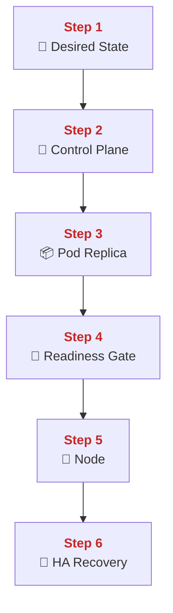
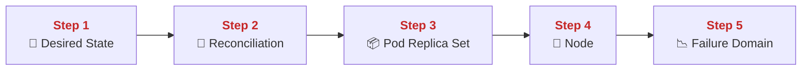
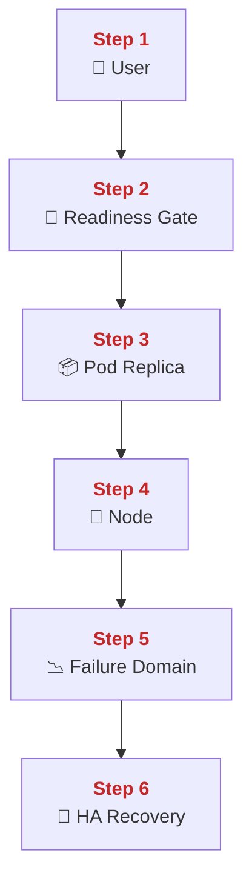
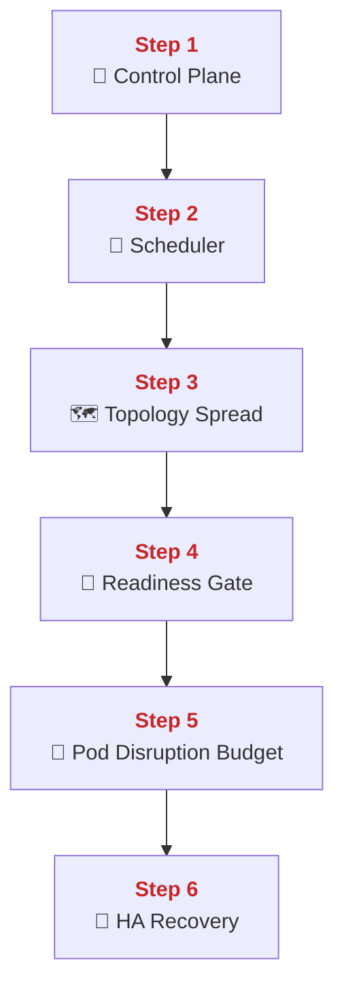
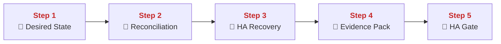
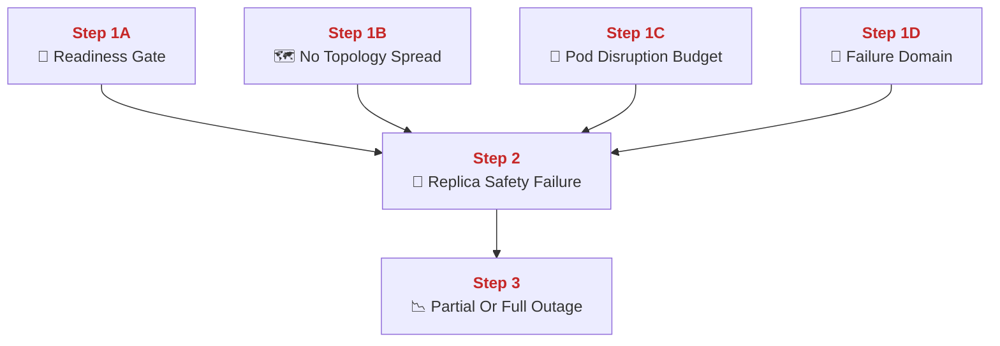
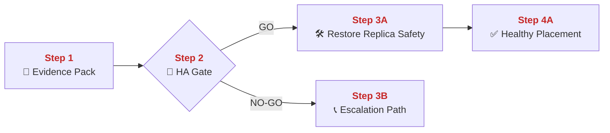
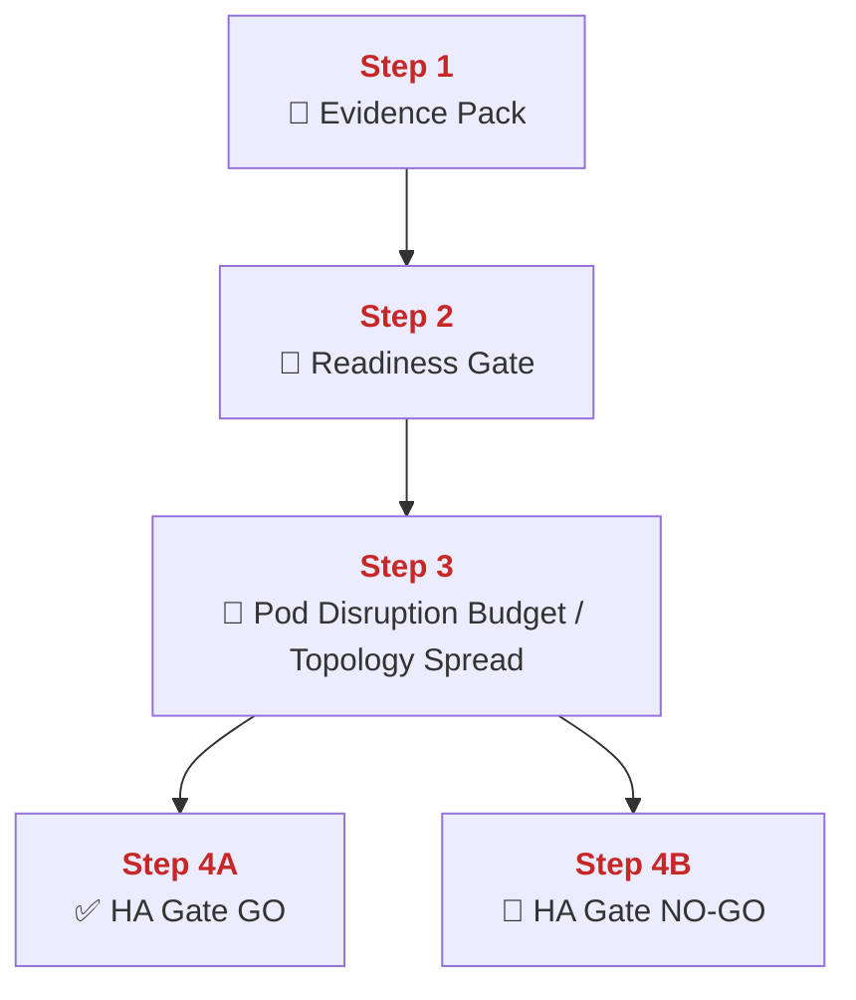

## 01 Orchestration and HA

This chapter explains how PolyMoly uses Kubernetes-style orchestration concepts to keep workloads running through normal process loss and node-level disruption.
It also explains desired state, scheduling, readiness, and high-availability guardrails so service recovery is performed by control loops instead of by human guessing.

---

## Quick Jump

- [Visual Contract Map](#visual-contract-map)
- [Vocabulary Dictionary](#vocabulary-dictionary)
- [1. Problem and Purpose](#1-problem-and-purpose)
- [2. End User Flow](#2-end-user-flow)
- [3. How It Works](#3-how-it-works)
- [4. Architectural Decision (ADR Format)](#4-architectural-decision-adr-format)
- [5. How It Fails](#5-how-it-fails)
- [6. How To Fix (Runbook Safety Standard)](#6-how-to-fix-runbook-safety-standard)
- [7. GO / NO-GO Panels](#7-go--no-go-panels)
- [8. Evidence Pack](#8-evidence-pack)
- [9. Operational Checklist](#9-operational-checklist)
- [10. CI / Quality Gate Reference](#10-ci--quality-gate-reference)
- [What Did We Learn](#what-did-we-learn)

---

## Visual Contract Map

### ADU: Desired State Control Loop

#### Technical Definition

- **[Desired State](#term-desired-state)**: The declared workload shape that the orchestrator is supposed to maintain.
- **[Control Plane](#term-control-plane)**: The API, scheduler, and controller processes that watch desired and actual state.
- **[Pod Replica](#term-pod-replica)**: One running workload instance scheduled by the orchestrator.
- **[Node](#term-node)**: The worker machine that runs pods.
- **[Readiness Gate](#term-readiness-gate)**: The health condition that decides whether traffic may reach a pod.
- **[HA Recovery](#term-ha-recovery)**: Automatic replacement or redistribution of replicas after failure.

#### Diagram



#### 📖 Deterministic Story

- <span style="color:#c62828"><strong>Step 1:</strong></span> The team declares **[Desired State](#term-desired-state)**.
- <span style="color:#c62828"><strong>Step 2:</strong></span> The **[Control Plane](#term-control-plane)** watches and compares that state to reality.
- <span style="color:#c62828"><strong>Step 3:</strong></span> The **[Control Plane](#term-control-plane)** creates or deletes **[Pod Replica](#term-pod-replica)** instances to reduce drift.
- <span style="color:#c62828"><strong>Step 4:</strong></span> Each replica passes the **[Readiness Gate](#term-readiness-gate)** before it should receive traffic.
- <span style="color:#c62828"><strong>Step 5:</strong></span> **[Pod Replica](#term-pod-replica)** instances run on one or more **[Node](#term-node)** machines.
- <span style="color:#c62828"><strong>Step 6:</strong></span> If a replica or **[Node](#term-node)** fails, **[HA Recovery](#term-ha-recovery)** tries to restore the declared shape.

#### 🧠 Conceptual Layer

Here is what physically happens inside the system:

Step 1 starts when a workload definition is stored in YAML or chart values. That **[Desired State](#term-desired-state)** includes replica count, image, probes, resources, and other policy fields. The network action is an API submission to the cluster or a GitOps sync that later submits the same desired object. In memory, the control system now has an object record that says what should exist.

Step 2 happens in the **[Control Plane](#term-control-plane)**. The API server stores the object, the scheduler watches for pending work, and controllers compare desired replicas with actual replicas. The important in-memory state is the live object graph: deployments, replica sets, pods, nodes, and their statuses. The decision here is simple but continuous: does reality match the declared object set or is there drift that needs action. If there is drift, the next network action is scheduling and pod creation work.

Step 3 is **[Pod Replica](#term-pod-replica)** creation. The scheduler chooses a target **[Node](#term-node)** based on available resources and placement rules. The kubelet on that node then pulls the image, creates the container sandbox, and starts the pod process. The network action is control traffic from the control plane to the node, then image pulls from a registry if needed. In memory, the node keeps pod status, container runtime state, and resource assignments.

Step 4 is the **[Readiness Gate](#term-readiness-gate)**. Even though the process may be running, traffic should not hit it until the readiness condition passes. Probes run, responses are checked, and the pod is marked ready or not ready. The decision is whether this replica is safe for live service traffic. If yes, the service endpoints update and the next network action is normal user traffic to the ready pod.

Step 5 is runtime on the **[Node](#term-node)**. Each node holds multiple pods, resource pressure, local network state, and kubelet health. This is where failures become physical: the node can go away, resource pressure can spike, or one pod can crash. The control plane keeps watching these changes through status updates.

Step 6 is **[HA Recovery](#term-ha-recovery)**. If a pod exits or a node becomes unavailable, controllers notice that the current actual state no longer satisfies the desired count and placement. The next network action is another schedule-and-start cycle on a healthy node if possible. That is how recovery becomes an automated loop instead of a manual late-night relocation exercise.

#### 🧩 Imagine It Like

- You pin one target map on the wall ([Desired State](#term-desired-state)).
- A command desk ([Control Plane](#term-control-plane)) keeps counting rooms and people.
- If one room fails, the desk opens another room and moves people there ([HA Recovery](#term-ha-recovery)).

#### 🔎 Lemme Explain

- Orchestration is a constant compare-and-repair loop.
- High availability starts with declared state plus readiness, not with heroic manual intervention.

---

## Vocabulary Dictionary

### Technical Definition

- <a id="term-desired-state"></a> **[Desired State](https://kubernetes.io/system/docs/concepts/overview/working-with-objects/kubernetes-objects/)**: The declared workload shape that the orchestrator is supposed to maintain.
- <a id="term-control-plane"></a> **[Control Plane](https://kubernetes.io/system/docs/concepts/overview/components/)**: The API, scheduler, and controller processes that watch desired and actual state.
- <a id="term-pod-replica"></a> **[Pod Replica](https://kubernetes.io/system/docs/concepts/workloads/pods/)**: One running workload instance scheduled by the orchestrator.
- <a id="term-node"></a> **[Node](https://kubernetes.io/system/docs/concepts/architecture/nodes/)**: The worker machine that runs pods.
- <a id="term-readiness-gate"></a> **[Readiness Gate](https://kubernetes.io/system/docs/tasks/configure-pod-container/configure-liveness-readiness-startup-probes/)**: The health condition that decides whether traffic may reach a pod.
- <a id="term-ha-recovery"></a> **[HA Recovery](#term-ha-recovery)**: Automatic replacement or redistribution of replicas after failure.
- <a id="term-reconciliation"></a> **[Reconciliation](https://kubernetes.io/system/docs/concepts/architecture/controller/)**: The repeated comparison between desired state and actual state.
- <a id="term-pod-disruption-budget"></a> **[Pod Disruption Budget](https://kubernetes.io/system/docs/tasks/run-application/configure-pdb/)**: The rule that limits how many replicas may be unavailable during voluntary disruption.
- <a id="term-topology-spread"></a> **[Topology Spread](https://kubernetes.io/system/docs/concepts/scheduling-eviction/topology-spread-constraints/)**: Placement rules that avoid packing all replicas into one failure domain.
- <a id="term-failure-domain"></a> **[Failure Domain](#term-failure-domain)**: The shared blast area such as one node or one zone.
- <a id="term-replica-safety-failure"></a> **[Replica Safety Failure](#term-replica-safety-failure)**: The state where replica policy is too weak to preserve healthy service during loss or disruption.
- <a id="term-ha-gate"></a> **[HA Gate](#term-ha-gate)**: The GO / NO-GO decision point for rollout or recovery when replica safety is in question.
- <a id="term-evidence-pack"></a> **[Evidence Pack](#term-evidence-pack)**: The minimum set of readiness, rollout, and placement proof gathered before mutation.
- <a id="term-escalation-path"></a> **[Escalation Path](#term-escalation-path)**: The responder path used when direct rollout or recovery action is unsafe.

---

## 1. Problem and Purpose

### Trust Boundary

- External entry: User traffic and rollout changes enter the scheduler-managed replica path.
- Protected side: Ready replicas, disruption policy, and failure-domain placement stay behind cluster control boundaries.
- Failure posture: If readiness or replica spread is weak, rollout and failover decisions must stop until placement is safe.

### ADU: Why Manual Placement Fails At Scale

#### Technical Definition

- **[Control Plane](#term-control-plane)**: The API, scheduler, and controller processes that watch desired and actual state.
- **[Reconciliation](#term-reconciliation)**: The repeated comparison between desired state and actual state.
- **[Pod Replica](#term-pod-replica)**: One running workload instance scheduled by the orchestrator.
- **[Node](#term-node)**: The worker machine that runs pods.
- **[Failure Domain](#term-failure-domain)**: The shared blast area such as one node or one zone.

#### Diagram



#### 📖 Deterministic Story

- <span style="color:#c62828"><strong>Step 1:</strong></span> The team declares how many replicas should exist.
- <span style="color:#c62828"><strong>Step 2:</strong></span> **[Reconciliation](#term-reconciliation)** keeps comparing that goal to live state.
- <span style="color:#c62828"><strong>Step 3:</strong></span> The control loop maintains the needed **[Pod Replica](#term-pod-replica)** count.
- <span style="color:#c62828"><strong>Step 4:</strong></span> Replicas are placed onto **[Node](#term-node)** machines.
- <span style="color:#c62828"><strong>Step 5:</strong></span> Placement must account for each **[Failure Domain](#term-failure-domain)**.

#### 🧠 Conceptual Layer

Here is what physically happens inside the system:

Step 1 begins with a workload object that says how many replicas should be alive. Humans write that intent once, but they do not keep retyping it every time a process dies.

Step 2 is **[Reconciliation](#term-reconciliation)**. The control plane watches the live cluster and compares the actual pod count and status to the desired count. This is continuous background logic, not a one-time script.

Step 3 is replica management. If one pod disappears, the controller notices the count is too low and starts the process to create another **[Pod Replica](#term-pod-replica)**.

Step 4 is placement on a **[Node](#term-node)**. The scheduler chooses where the next replica should go based on resources and rules. This is where the system prevents the cluster from becoming a manual spreadsheet of hand-placed processes.

Step 5 is failure-domain thinking. If all replicas land on the same node, one node failure can still take everything out. That is why placement policy matters as much as replica count.

#### 🧩 Imagine It Like

- You do not keep moving workers by hand every time one room fails.
- A control desk counts missing workers and opens new rooms automatically.
- It also tries not to put every worker in the same fragile room.

#### 🔎 Lemme Explain

- Replicas alone do not create availability.
- Replicas plus controlled placement and reconciliation create availability.

---

## 2. End User Flow

### ADU: User Traffic Through Pod Loss

#### Technical Definition

- **[Pod Replica](#term-pod-replica)**: One running workload instance scheduled by the orchestrator.
- **[Readiness Gate](#term-readiness-gate)**: The health condition that decides whether traffic may reach a pod.
- **[HA Recovery](#term-ha-recovery)**: Automatic replacement or redistribution of replicas after failure.
- **[Node](#term-node)**: The worker machine that runs pods.
- **[Failure Domain](#term-failure-domain)**: The shared blast area such as one node or one zone.

#### Diagram



#### 📖 Deterministic Story

- <span style="color:#c62828"><strong>Step 1:</strong></span> User traffic targets a service.
- <span style="color:#c62828"><strong>Step 2:</strong></span> Only pods that pass the **[Readiness Gate](#term-readiness-gate)** are eligible for traffic.
- <span style="color:#c62828"><strong>Step 3:</strong></span> One **[Pod Replica](#term-pod-replica)** handles the request.
- <span style="color:#c62828"><strong>Step 4:</strong></span> That **[Pod Replica](#term-pod-replica)** lives on one **[Node](#term-node)**.
- <span style="color:#c62828"><strong>Step 5:</strong></span> If that **[Node](#term-node)** becomes the active **[Failure Domain](#term-failure-domain)**, the replica path breaks.
- <span style="color:#c62828"><strong>Step 6:</strong></span> **[HA Recovery](#term-ha-recovery)** creates or reuses another ready replica elsewhere.

#### 🧠 Conceptual Layer

Here is what physically happens inside the system:

Step 1 starts with normal user traffic entering a service endpoint. The network action is a service-level connection that should eventually be sent to one ready backend pod.

Step 2 is the **[Readiness Gate](#term-readiness-gate)**. The service endpoint list only contains pods that currently report ready. This matters because a process can be alive but still not safe for traffic.

Step 3 is the request hitting one **[Pod Replica](#term-pod-replica)**. The request bytes are delivered to that pod over cluster networking and the app begins handling them.

Step 4 is the physical hosting **[Node](#term-node)**. Every pod sits on one machine at a time, so there is always a real physical dependency underneath the abstract service.

Step 5 is node or domain failure. If that machine or that placement zone fails, the request path to that pod breaks. This is where a single failure domain becomes user-visible.

Step 6 is **[HA Recovery](#term-ha-recovery)**. The control loop notices the missing ready replica and starts another one on a healthy node if the cluster has capacity. The service then points traffic at the new ready pod. That is the user path through failure and recovery.

#### 🧩 Imagine It Like

- Users go only to rooms with the green light on.
- One green room sits inside one building.
- If the building fails, the control desk lights another room in another building.

#### 🔎 Lemme Explain

- Readiness plus replacement is what makes pod loss survivable.
- Without spare healthy placement, orchestration cannot invent capacity from nothing.

---

## 3. How It Works

### ADU: Scheduler, Readiness, And Disruption Policy

#### Technical Definition

- **[Control Plane](#term-control-plane)**: The API, scheduler, and controller processes that watch desired and actual state.
- **[Readiness Gate](#term-readiness-gate)**: The health condition that decides whether traffic may reach a pod.
- **[Pod Disruption Budget](#term-pod-disruption-budget)**: The rule that limits how many replicas may be unavailable during voluntary disruption.
- **[Topology Spread](#term-topology-spread)**: Placement rules that avoid packing all replicas into one failure domain.
- **[HA Recovery](#term-ha-recovery)**: Automatic replacement or redistribution of replicas after failure.

#### Diagram



#### 📖 Deterministic Story

- <span style="color:#c62828"><strong>Step 1:</strong></span> The **[Control Plane](#term-control-plane)** owns the orchestration loop.
- <span style="color:#c62828"><strong>Step 2:</strong></span> The scheduler picks where pods should run.
- <span style="color:#c62828"><strong>Step 3:</strong></span> **[Topology Spread](#term-topology-spread)** keeps replicas from collapsing into one place.
- <span style="color:#c62828"><strong>Step 4:</strong></span> The **[Readiness Gate](#term-readiness-gate)** blocks premature traffic.
- <span style="color:#c62828"><strong>Step 5:</strong></span> A **[Pod Disruption Budget](#term-pod-disruption-budget)** limits safe disruption during maintenance.
- <span style="color:#c62828"><strong>Step 6:</strong></span> Together these rules support **[HA Recovery](#term-ha-recovery)**.

#### 🧠 Conceptual Layer

Here is what physically happens inside the system:

Step 1 is the control plane watching objects and statuses. It sees which pods exist, which are pending, and which nodes are healthy.

Step 2 is scheduling. The scheduler evaluates resource fit and policy constraints, then binds a pending pod to a chosen node.

Step 3 is **[Topology Spread](#term-topology-spread)**. Placement rules try to keep replicas across nodes or zones instead of stacking them into one spot. This changes how much one failure domain can hurt.

Step 4 is the **[Readiness Gate](#term-readiness-gate)**. After start, probes must pass before service endpoints include the pod.

Step 5 is the **[Pod Disruption Budget](#term-pod-disruption-budget)**. During planned maintenance or voluntary disruption, it limits how many replicas may be unavailable at once.

Step 6 is the combined result, **[HA Recovery](#term-ha-recovery)**. The system has both replacement logic and guardrails that keep recovery from silently dropping too much availability during change.

#### 🧩 Imagine It Like

- The command desk chooses rooms.
- A spacing rule keeps those rooms spread across buildings.
- A green-light test and a "never close too many at once" rule protect traffic during both failure and maintenance.

#### 🔎 Lemme Explain

- High availability is a stack of small rules, not one switch.
- Scheduler, readiness, placement, and disruption policy work together or not at all.

---

## 4. Architectural Decision (ADR Format)

### ADU: Declarative Recovery Over Manual Repair

#### Technical Definition

- **[Desired State](#term-desired-state)**: The declared workload shape that the orchestrator is supposed to maintain.
- **[Reconciliation](#term-reconciliation)**: The repeated comparison between desired state and actual state.
- **[HA Recovery](#term-ha-recovery)**: Automatic replacement or redistribution of replicas after failure.
- **[HA Gate](#term-ha-gate)**: The GO / NO-GO decision point for rollout or recovery when replica safety is in question.
- **[Evidence Pack](#term-evidence-pack)**: The minimum set of readiness, rollout, and placement proof gathered before mutation.

#### Diagram



#### 📖 Deterministic Story

- <span style="color:#c62828"><strong>Step 1:</strong></span> The platform keeps **[Desired State](#term-desired-state)** as the source of intent.
- <span style="color:#c62828"><strong>Step 2:</strong></span> **[Reconciliation](#term-reconciliation)** is the mechanism that notices drift.
- <span style="color:#c62828"><strong>Step 3:</strong></span> **[HA Recovery](#term-ha-recovery)** should come from the control loop before it comes from humans.
- <span style="color:#c62828"><strong>Step 4:</strong></span> Operators still gather an **[Evidence Pack](#term-evidence-pack)** before risky changes.
- <span style="color:#c62828"><strong>Step 5:</strong></span> The **[HA Gate](#term-ha-gate)** decides whether rollout or intervention is safe.

#### 🧠 Conceptual Layer

Here is what physically happens inside the system:

Step 1 is the decision to keep one declarative source of truth. Operators say what should exist, not which exact process on which exact node should be restarted every time.

Step 2 is **[Reconciliation](#term-reconciliation)** using live cluster status. The system keeps comparing actual running objects to declared objects.

Step 3 is **[HA Recovery](#term-ha-recovery)** through controllers and scheduling rather than through manual ssh-and-restart habits. Human action is still possible, but it should reinforce the declared state path, not replace it.

Step 4 is evidence gathering before higher-risk intervention. Even in an automated system, the operator still needs to know whether placement, readiness, and capacity are healthy enough for another change.

Step 5 is the **[HA Gate](#term-ha-gate)**. This is where rollout or manual intervention is blocked if replica safety is too weak.

#### 🧩 Imagine It Like

- You keep one map of how many safe rooms should exist.
- The command desk keeps trying to make the real city match that map.
- Humans step in carefully only when the desk alone is not enough.

#### 🔎 Lemme Explain

- Declarative orchestration reduces routine repair work.
- It does not remove the need for evidence before risky intervention.

---

## 5. How It Fails

### ADU: Replica Safety Failure Modes

#### Technical Definition

- **[Readiness Gate](#term-readiness-gate)**: The health condition that decides whether traffic may reach a pod.
- **[Topology Spread](#term-topology-spread)**: Placement rules that avoid packing all replicas into one failure domain.
- **[Pod Disruption Budget](#term-pod-disruption-budget)**: The rule that limits how many replicas may be unavailable during voluntary disruption.
- **[Failure Domain](#term-failure-domain)**: The shared blast area such as one node or one zone.
- **[HA Recovery](#term-ha-recovery)**: Automatic replacement or redistribution of replicas after failure.
- **[Replica Safety Failure](#term-replica-safety-failure)**: The state where replica policy is too weak to preserve healthy service during loss or disruption.

#### Diagram



#### 📖 Deterministic Story

- <span style="color:#c62828"><strong>Step 1A:</strong></span> A weak **[Readiness Gate](#term-readiness-gate)** sends traffic too early.
- <span style="color:#c62828"><strong>Step 1B:</strong></span> Missing **[Topology Spread](#term-topology-spread)** packs replicas into one place.
- <span style="color:#c62828"><strong>Step 1C:</strong></span> Missing **[Pod Disruption Budget](#term-pod-disruption-budget)** allows too many pods down at once.
- <span style="color:#c62828"><strong>Step 1D:</strong></span> One **[Failure Domain](#term-failure-domain)** can still take out too much capacity.
- <span style="color:#c62828"><strong>Step 2:</strong></span> These problems create **[Replica Safety Failure](#term-replica-safety-failure)**.
- <span style="color:#c62828"><strong>Step 3:</strong></span> User traffic sees degraded or failed service.

#### 🧠 Conceptual Layer

Here is what physically happens inside the system:

Step 1A is readiness weakness. A pod is marked ready before the app can really serve traffic, so the service sends requests into a pod that is still cold or broken.

Step 1B is placement weakness. Replicas are allowed to land on the same node or the same zone, so one physical loss event removes too much capacity at once.

Step 1C is maintenance weakness. Without a **[Pod Disruption Budget](#term-pod-disruption-budget)**, voluntary changes can evict too many pods together.

Step 1D is the shared **[Failure Domain](#term-failure-domain)** itself. Even with multiple replicas, their physical fate can still be coupled too tightly.

Step 2 is the failed HA posture. The system looks replicated on paper but behaves as if it has less spare capacity than expected.

Step 3 is outage impact. Requests land on bad pods, too few pods, or no pods in a healthy domain.

#### 🧩 Imagine It Like

- Green lights turn on too early.
- Too many safe rooms are in one building.
- Maintenance closes too many rooms together.

#### 🔎 Lemme Explain

- HA failures are often policy failures before they become raw infrastructure failures.
- Replica count alone is not a reliable availability signal.

| Symptom | Root Cause | Severity | Fastest confirmation step |
| :--- | :--- | :--- | :--- |
| Traffic hits warming pods | weak readiness | Sev-1 | inspect readiness probe behavior |
| One node loss drops too much traffic | bad spread | Sev-1 | inspect pod placement |
| Planned change causes wide outage | missing PDB | Sev-1 | inspect disruption budget |
| Cluster cannot reschedule safely | no spare healthy capacity | Sev-1 | inspect pending pods and node pressure |

---

## 6. How To Fix (Runbook Safety Standard)

### ADU: Restore Replica Safety

#### Technical Definition

- **[Evidence Pack](#term-evidence-pack)**: The minimum set of readiness, rollout, and placement proof gathered before mutation.
- **[HA Gate](#term-ha-gate)**: The GO / NO-GO decision point for rollout or recovery when replica safety is in question.
- **[Readiness Gate](#term-readiness-gate)**: The health condition that decides whether traffic may reach a pod.
- **[Topology Spread](#term-topology-spread)**: Placement rules that avoid packing all replicas into one failure domain.
- **[Escalation Path](#term-escalation-path)**: The responder path used when direct rollout or recovery action is unsafe.

#### Diagram



#### 📖 Deterministic Story

- <span style="color:#c62828"><strong>Step 1:</strong></span> Gather the **[Evidence Pack](#term-evidence-pack)** first.
- <span style="color:#c62828"><strong>Step 2:</strong></span> Use the **[HA Gate](#term-ha-gate)** to decide whether direct change is safe.
- <span style="color:#c62828"><strong>Step 3A:</strong></span> If GO, restore the **[Readiness Gate](#term-readiness-gate)** or **[Topology Spread](#term-topology-spread)** problem with controlled change.
- <span style="color:#c62828"><strong>Step 4A:</strong></span> Verify that replicas are healthy and correctly placed again.
- <span style="color:#c62828"><strong>Step 3B:</strong></span> If NO-GO, follow the **[Escalation Path](#term-escalation-path)**.

#### 🧠 Conceptual Layer

Here is what physically happens inside the system:

Step 1 is read-only inspection. Operators check pod readiness, placement, pending status, and rollout state before they mutate anything.

Step 2 is the **[HA Gate](#term-ha-gate)**. The responder asks whether the issue is narrow enough for a safe configuration or rollout correction, or whether the cluster is too unstable for more change right now.

Step 3A is the GO branch. The team may correct readiness settings, placement rules, or rollout state. The network action is a control-plane update through kubectl, helm, or GitOps sync.

Step 4A is verification. The same placement and readiness checks are repeated to prove replica safety is restored.

Step 3B is escalation when direct correction is still too risky.

#### 🧩 Imagine It Like

- First count the safe rooms and where they are.
- Then decide whether one careful room policy change is safe.
- After the change, count again before calling it fixed.

#### 🔎 Lemme Explain

- HA repair is mostly about restoring safe replica behavior, not only restarting pods.
- If placement and readiness are still wrong, the outage is not really solved.

### Exact Runbook Commands

```bash
# Read-only checks
go run ./system/tools/poly/cmd/poly gate check k8s-readiness
task k8s:status
helm list -A
```

```bash
# Mutation (only after Evidence Pack is captured and HA Gate is GO)
task k8s:setup
```

```bash
# Verify
go run ./system/tools/poly/cmd/poly gate check k8s-readiness
task k8s:status
```

Rollback rule:
- If rollout changes reduce healthy replicas or widen placement risk, STOP and revert the last orchestration change.
- Do not remove readiness or disruption protections to make red state look green faster.

---

## 7. GO / NO-GO Panels

### ADU: Replica Safety Gate

#### Technical Definition

- **[HA Gate](#term-ha-gate)**: The GO / NO-GO decision point for rollout or recovery when replica safety is in question.
- **[Readiness Gate](#term-readiness-gate)**: The health condition that decides whether traffic may reach a pod.
- **[Pod Disruption Budget](#term-pod-disruption-budget)**: The rule that limits how many replicas may be unavailable during voluntary disruption.
- **[Topology Spread](#term-topology-spread)**: Placement rules that avoid packing all replicas into one failure domain.
- **[Evidence Pack](#term-evidence-pack)**: The minimum set of readiness, rollout, and placement proof gathered before mutation.

#### Diagram



#### 📖 Deterministic Story

- <span style="color:#c62828"><strong>Step 1:</strong></span> The **[Evidence Pack](#term-evidence-pack)** enters the gate.
- <span style="color:#c62828"><strong>Step 2:</strong></span> The **[Readiness Gate](#term-readiness-gate)** status is checked.
- <span style="color:#c62828"><strong>Step 3:</strong></span> **[Pod Disruption Budget](#term-pod-disruption-budget)** and **[Topology Spread](#term-topology-spread)** are checked.
- <span style="color:#c62828"><strong>Step 4A:</strong></span> If replica safety holds, the **[HA Gate](#term-ha-gate)** can be GO.
- <span style="color:#c62828"><strong>Step 4B:</strong></span> If replica safety is weak, the gate stays NO-GO.

#### 🧠 Conceptual Layer

Here is what physically happens inside the system:

Step 1 starts with evidence already gathered from cluster state.

Step 2 checks whether pods that are receiving traffic are really ready.

Step 3 checks whether disruption and placement policy still protect the replica set.

Step 4A is GO when both conditions are true. Step 4B is NO-GO when the cluster still has fragile replica safety.

#### 🧩 Imagine It Like

- First check if the open rooms really have green lights.
- Then check if too many rooms share one building or can close together.
- Only then decide whether more change is safe.

#### 🔎 Lemme Explain

- GO depends on safe traffic entry and safe replica distribution together.
- If either one is weak, rollout and recovery become riskier than they look.

---

## 8. Evidence Pack

Collect before mutation:

- Current pod readiness and pending state.
- Current placement spread across nodes or zones.
- Current disruption budget posture.
- Current rollout state and replica counts.
- Relevant k8s-readiness output.
- Current UTC time anchor.

---

## 9. Operational Checklist

- [ ] Replica count is confirmed.
- [ ] Ready vs non-ready pods are identified.
- [ ] Placement is checked across failure domains.
- [ ] Disruption budget state is checked.
- [ ] Mutation decision is explicit.
- [ ] Verification confirms restored replica safety.

---

## 10. CI / Quality Gate Reference

Run:

```bash
task docs:governance
task docs:governance:strict
go run ./system/tools/poly/cmd/poly gate check k8s-readiness
go run ./system/tools/poly/cmd/poly gate check gitops-rollout
```

Related workflows and evidence:

- `system/gates/artifacts/k8s-readiness/`
- `system/gates/artifacts/gitops-rollout/`
- `.github/workflows/ha-failure-demo.yml`
- `system/gates/artifacts/docs-governance/`
- `system/gates/artifacts/docs-links/`

---

## What Did We Learn

- High availability is declared first and repaired continuously.
- Readiness, placement, and disruption policy are all part of replica safety.
- One lost node should trigger controlled replacement, not operator panic.
- Rollout decisions must respect current HA posture.

👉 Next Chapter: **[02-helm-and-packaging.md](./02-helm-and-packaging.md)**
