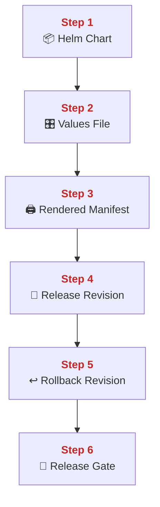
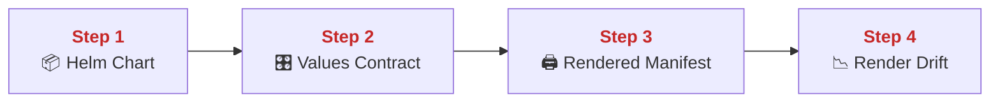
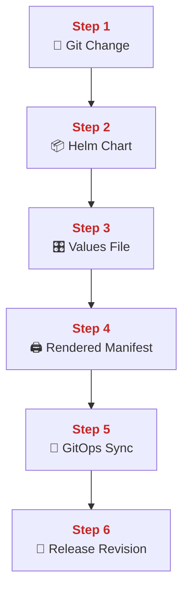
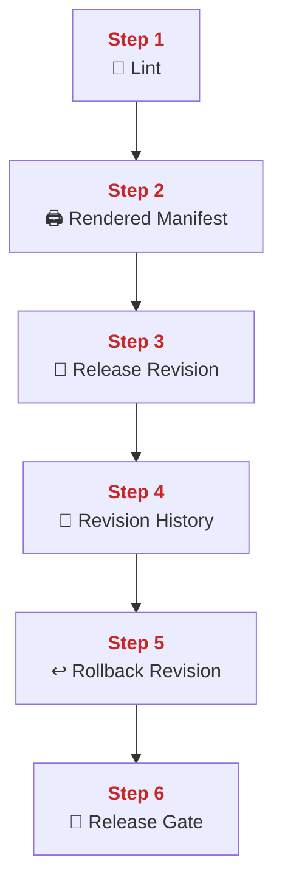
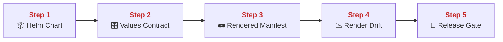
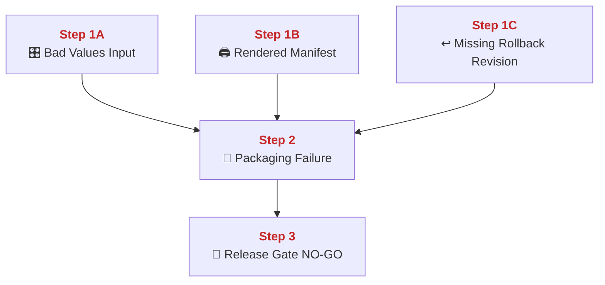
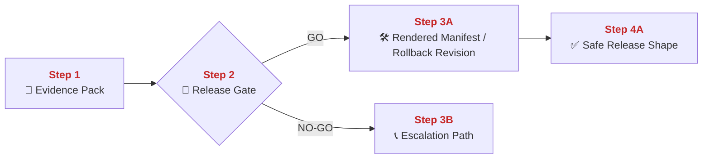
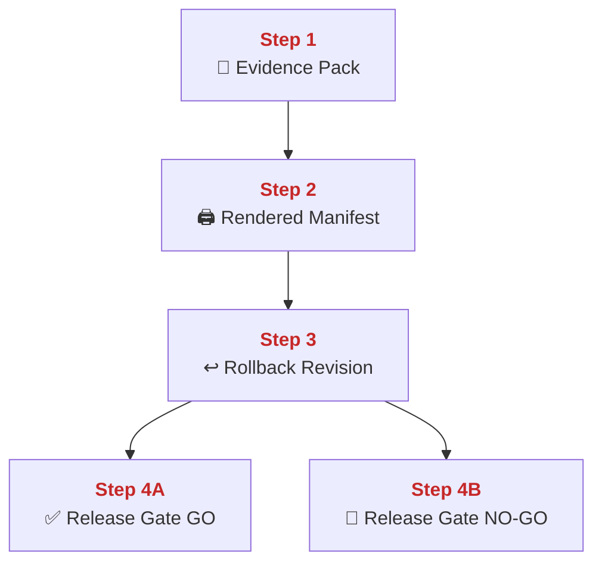

## 02 Helm and Packaging

This chapter explains how PolyMoly turns one chart plus one values set into one deployable release shape.
It also explains rendering, release history, rollback, and why packaging discipline prevents copy-paste drift across environments.

---

## Quick Jump

- [Visual Contract Map](#visual-contract-map)
- [Vocabulary Dictionary](#vocabulary-dictionary)
- [1. Problem and Purpose](#1-problem-and-purpose)
- [2. End User Flow](#2-end-user-flow)
- [3. How It Works](#3-how-it-works)
- [4. Architectural Decision (ADR Format)](#4-architectural-decision-adr-format)
- [5. How It Fails](#5-how-it-fails)
- [6. How To Fix (Runbook Safety Standard)](#6-how-to-fix-runbook-safety-standard)
- [7. GO / NO-GO Panels](#7-go--no-go-panels)
- [8. Evidence Pack](#8-evidence-pack)
- [9. Operational Checklist](#9-operational-checklist)
- [10. CI / Quality Gate Reference](#10-ci--quality-gate-reference)
- [What Did We Learn](#what-did-we-learn)

---

## Visual Contract Map

### ADU: Chart To Release Path

#### Technical Definition

- **[Helm Chart](#term-helm-chart)**: The versioned package that contains Kubernetes templates and defaults.
- **[Values File](#term-values-file)**: The environment-specific input that fills template variables.
- **[Rendered Manifest](#term-rendered-manifest)**: The concrete YAML produced after chart rendering.
- **[Release Revision](#term-release-revision)**: One deployed instance of a chart state in a cluster.
- **[Rollback Revision](#term-rollback-revision)**: The previously known good release revision used for reversal.
- **[Release Gate](#term-release-gate)**: The GO / NO-GO decision point before or after chart deployment.

#### Diagram



#### 📖 Deterministic Story

- <span style="color:#c62828"><strong>Step 1:</strong></span> A **[Helm Chart](#term-helm-chart)** defines the package structure.
- <span style="color:#c62828"><strong>Step 2:</strong></span> A **[Values File](#term-values-file)** defines environment-specific input.
- <span style="color:#c62828"><strong>Step 3:</strong></span> Rendering produces a **[Rendered Manifest](#term-rendered-manifest)**.
- <span style="color:#c62828"><strong>Step 4:</strong></span> Deployment creates a **[Release Revision](#term-release-revision)**.
- <span style="color:#c62828"><strong>Step 5:</strong></span> A previous **[Rollback Revision](#term-rollback-revision)** remains available for reversal.
- <span style="color:#c62828"><strong>Step 6:</strong></span> The **[Release Gate](#term-release-gate)** decides whether the rendered and deployed state is safe enough.

#### 🧠 Conceptual Layer

Here is what physically happens inside the system:

Step 1 begins with the **[Helm Chart](#term-helm-chart)** on disk. The chart contains template files, helper functions, and default settings. This is not yet cluster state. It is a packaging source.

Step 2 is the **[Values File](#term-values-file)**. Environment-specific values are loaded into memory by Helm. These values change things like replica counts, rollout settings, autoscaling toggles, or hostnames without duplicating the entire manifest set.

Step 3 is rendering. Helm parses template files, substitutes values, and writes one **[Rendered Manifest](#term-rendered-manifest)** stream. The network action can still be zero at this point if the operator is only templating locally. The important memory state is the combined chart-plus-values rendering context.

Step 4 is the **[Release Revision](#term-release-revision)**. When Helm or a GitOps controller applies the rendered manifests, the cluster stores one concrete release state. That state now exists as actual cluster objects, not only as templates on disk.

Step 5 is rollback memory. Helm release history or GitOps history gives the team a known earlier state, the **[Rollback Revision](#term-rollback-revision)**. This matters because deployment safety depends on a real reversal path.

Step 6 is the **[Release Gate](#term-release-gate)**. The team checks whether rendered output, cluster result, and rollback path are all sane enough for the environment. That is how packaging turns into controlled release, not just YAML generation.

#### 🧩 Imagine It Like

- One blueprint box ([Helm Chart](#term-helm-chart)) holds the building plan.
- One settings card ([Values File](#term-values-file)) picks the room color and size.
- The printer makes the real instruction sheet ([Rendered Manifest](#term-rendered-manifest)), and the builder keeps the previous sheet for undo ([Rollback Revision](#term-rollback-revision)).

#### 🔎 Lemme Explain

- Helm exists to produce repeatable release shapes from one package plus one input set.
- Release safety depends on render correctness and rollback availability together.

---

## Vocabulary Dictionary

### Technical Definition

- <a id="term-helm-chart"></a> **[Helm Chart](https://helm.sh/system/docs/topics/charts/)**: The versioned package that contains Kubernetes templates and defaults.
- <a id="term-values-file"></a> **[Values File](https://helm.sh/system/docs/chart_template_guide/values_files/)**: The environment-specific input that fills template variables.
- <a id="term-rendered-manifest"></a> **[Rendered Manifest](#term-rendered-manifest)**: The concrete YAML produced after chart rendering.
- <a id="term-release-revision"></a> **[Release Revision](https://helm.sh/system/docs/helm/helm_history/)**: One deployed instance of a chart state in a cluster.
- <a id="term-rollback-revision"></a> **[Rollback Revision](#term-rollback-revision)**: The previously known good release revision used for reversal.
- <a id="term-release-gate"></a> **[Release Gate](#term-release-gate)**: The GO / NO-GO decision point before or after chart deployment.
- <a id="term-gitops-sync"></a> **[GitOps Sync](#term-gitops-sync)**: The controller action that applies desired chart state from Git into the cluster.
- <a id="term-render-drift"></a> **[Render Drift](#term-render-drift)**: A mismatch between intended chart output and actual applied manifest state.
- <a id="term-values-contract"></a> **[Values Contract](#term-values-contract)**: The expected set of configurable inputs that the chart supports safely.
- <a id="term-evidence-pack"></a> **[Evidence Pack](#term-evidence-pack)**: The minimum render, lint, and rollout proof gathered before mutation.
- <a id="term-escalation-path"></a> **[Escalation Path](#term-escalation-path)**: The responder path used when direct release correction is unsafe.

---

## 1. Problem and Purpose

### Trust Boundary

- External entry: Chart changes and values inputs enter the release path through render and sync steps.
- Protected side: Applied revisions and rollback history stay behind the release packaging boundary.
- Failure posture: If rendered output or rollback history is unclear, the release stays NO-GO.

### ADU: Why Packaging Beats Copy Paste

#### Technical Definition

- **[Helm Chart](#term-helm-chart)**: The versioned package that contains Kubernetes templates and defaults.
- **[Values File](#term-values-file)**: The environment-specific input that fills template variables.
- **[Rendered Manifest](#term-rendered-manifest)**: The concrete YAML produced after chart rendering.
- **[Values Contract](#term-values-contract)**: The expected set of configurable inputs that the chart supports safely.
- **[Render Drift](#term-render-drift)**: A mismatch between intended chart output and actual applied manifest state.

#### Diagram



#### 📖 Deterministic Story

- <span style="color:#c62828"><strong>Step 1:</strong></span> One **[Helm Chart](#term-helm-chart)** holds the reusable package.
- <span style="color:#c62828"><strong>Step 2:</strong></span> The **[Values Contract](#term-values-contract)** defines safe input knobs.
- <span style="color:#c62828"><strong>Step 3:</strong></span> Rendering creates the **[Rendered Manifest](#term-rendered-manifest)** for one environment.
- <span style="color:#c62828"><strong>Step 4:</strong></span> Without discipline, packaging drifts into **[Render Drift](#term-render-drift)**.

#### 🧠 Conceptual Layer

Here is what physically happens inside the system:

Step 1 is the package source. One chart holds templates for Deployments, Services, HPA, PDB, NetworkPolicy, and other resources. This avoids copying full YAML sets into each environment.

Step 2 is the **[Values Contract](#term-values-contract)**. Instead of editing raw manifests everywhere, operators change declared inputs. This narrows where configuration differences are allowed to live.

Step 3 is rendering. Helm merges the chart with the chosen values and produces one environment-specific **[Rendered Manifest](#term-rendered-manifest)**. That makes the final YAML explicit before it reaches the cluster.

Step 4 is drift risk. If chart logic and values logic are not kept disciplined, the output can diverge from what operators think they are deploying. That is why lint, render, and rollout checks matter.

#### 🧩 Imagine It Like

- One master blueprint box holds the common plan.
- A settings card changes only the allowed knobs.
- The printed plan must match what the builder expects, or the building drifts.

#### 🔎 Lemme Explain

- Packaging exists to reduce duplicated YAML and reduce config drift.
- It only works if the chart and its values stay reviewable and testable.

---

## 2. End User Flow

### ADU: Commit To Cluster Shape

#### Technical Definition

- **[Helm Chart](#term-helm-chart)**: The versioned package that contains Kubernetes templates and defaults.
- **[Values File](#term-values-file)**: The environment-specific input that fills template variables.
- **[Rendered Manifest](#term-rendered-manifest)**: The concrete YAML produced after chart rendering.
- **[GitOps Sync](#term-gitops-sync)**: The controller action that applies desired chart state from Git into the cluster.
- **[Release Revision](#term-release-revision)**: One deployed instance of a chart state in a cluster.

#### Diagram



#### 📖 Deterministic Story

- <span style="color:#c62828"><strong>Step 1:</strong></span> A Git change updates the release input.
- <span style="color:#c62828"><strong>Step 2:</strong></span> The change affects the **[Helm Chart](#term-helm-chart)** package.
- <span style="color:#c62828"><strong>Step 3:</strong></span> The matching **[Values File](#term-values-file)** provides environment input.
- <span style="color:#c62828"><strong>Step 4:</strong></span> Helm produces a **[Rendered Manifest](#term-rendered-manifest)**.
- <span style="color:#c62828"><strong>Step 5:</strong></span> A **[GitOps Sync](#term-gitops-sync)** applies that state.
- <span style="color:#c62828"><strong>Step 6:</strong></span> The cluster records one **[Release Revision](#term-release-revision)**.

#### 🧠 Conceptual Layer

Here is what physically happens inside the system:

Step 1 begins in Git. A change lands in the chart or values path. That change is now the release input.

Step 2 is the package layer. Helm reads the **[Helm Chart](#term-helm-chart)** files and loads the templates into memory.

Step 3 is environment input. The chosen **[Values File](#term-values-file)** is read and merged into the render context.

Step 4 is rendering. One **[Rendered Manifest](#term-rendered-manifest)** stream is produced. At this point, the team can inspect the exact cluster object set before apply.

Step 5 is **[GitOps Sync](#term-gitops-sync)**. A controller like ArgoCD notices desired-state change and applies it to the cluster.

Step 6 is the new **[Release Revision](#term-release-revision)**. The cluster now has one concrete deployed state and one history point that can be inspected or rolled back later.

#### 🧩 Imagine It Like

- A new instruction change enters the blueprint box.
- The settings card for the right city is chosen.
- The printer makes the final plan, and the automatic builder follows that plan into the real city.

#### 🔎 Lemme Explain

- Packaging is the path from reusable template to real cluster object set.
- GitOps turns that path into a repeatable sync loop.

---

## 3. How It Works

### ADU: Render, Lint, History, Rollback

#### Technical Definition

- **[Rendered Manifest](#term-rendered-manifest)**: The concrete YAML produced after chart rendering.
- **[Release Revision](#term-release-revision)**: One deployed instance of a chart state in a cluster.
- **[Rollback Revision](#term-rollback-revision)**: The previously known good release revision used for reversal.
- **[Release Gate](#term-release-gate)**: The GO / NO-GO decision point before or after chart deployment.
- **[Values Contract](#term-values-contract)**: The expected set of configurable inputs that the chart supports safely.

#### Diagram



#### 📖 Deterministic Story

- <span style="color:#c62828"><strong>Step 1:</strong></span> The chart is linted first.
- <span style="color:#c62828"><strong>Step 2:</strong></span> Rendering produces the **[Rendered Manifest](#term-rendered-manifest)**.
- <span style="color:#c62828"><strong>Step 3:</strong></span> Apply creates a new **[Release Revision](#term-release-revision)**.
- <span style="color:#c62828"><strong>Step 4:</strong></span> Revision history keeps older states.
- <span style="color:#c62828"><strong>Step 5:</strong></span> A **[Rollback Revision](#term-rollback-revision)** remains available.
- <span style="color:#c62828"><strong>Step 6:</strong></span> The **[Release Gate](#term-release-gate)** decides whether the new revision may stand.

#### 🧠 Conceptual Layer

Here is what physically happens inside the system:

Step 1 is linting. Helm or supporting checks parse chart files and look for template or value-structure problems before cluster mutation begins.

Step 2 is manifest rendering. Helm expands template functions and values into final YAML that can be read and diffed.

Step 3 is release creation. The cluster stores the new object states, and Helm or GitOps records a new revision number or history state.

Step 4 is revision history. The system keeps track of what was previously deployed. This history is not decoration. It is the technical memory needed for rollback.

Step 5 is rollback availability. A **[Rollback Revision](#term-rollback-revision)** can be re-applied when the new revision proves unsafe.

Step 6 is the **[Release Gate](#term-release-gate)**. The decision depends on whether lint, render output, rollout behavior, and rollback path all look sane together.

#### 🧩 Imagine It Like

- First check the blueprint for obvious mistakes.
- Then print the exact construction sheet.
- Keep the old construction sheet nearby in case the new room build goes wrong.

#### 🔎 Lemme Explain

- Packaging safety is render safety plus rollback memory.
- If you cannot see the exact output or reverse it, the release path is weaker than it looks.

---

## 4. Architectural Decision (ADR Format)

### ADU: Package Once, Tune By Values

#### Technical Definition

- **[Helm Chart](#term-helm-chart)**: The versioned package that contains Kubernetes templates and defaults.
- **[Values File](#term-values-file)**: The environment-specific input that fills template variables.
- **[Values Contract](#term-values-contract)**: The expected set of configurable inputs that the chart supports safely.
- **[Render Drift](#term-render-drift)**: A mismatch between intended chart output and actual applied manifest state.
- **[Release Gate](#term-release-gate)**: The GO / NO-GO decision point before or after chart deployment.

#### Diagram



#### 📖 Deterministic Story

- <span style="color:#c62828"><strong>Step 1:</strong></span> One **[Helm Chart](#term-helm-chart)** should be reusable across environments.
- <span style="color:#c62828"><strong>Step 2:</strong></span> Environment changes should stay inside the **[Values Contract](#term-values-contract)**.
- <span style="color:#c62828"><strong>Step 3:</strong></span> Rendering shows the real output.
- <span style="color:#c62828"><strong>Step 4:</strong></span> If output diverges from expectation, the state becomes **[Render Drift](#term-render-drift)**.
- <span style="color:#c62828"><strong>Step 5:</strong></span> The **[Release Gate](#term-release-gate)** blocks unsafe drift.

#### 🧠 Conceptual Layer

Here is what physically happens inside the system:

Step 1 is the packaging rule. Teams do not fork whole manifest trees for each environment when one chart can express the common structure.

Step 2 is the values rule. Allowed differences are placed into structured input instead of scattered raw YAML edits.

Step 3 is output visibility. The team renders the final manifest so the real object set can be inspected.

Step 4 is drift detection. If the rendered output is surprising or no longer matches the intended contract, that is **[Render Drift](#term-render-drift)**.

Step 5 is the gate. That drift must be caught before or during deployment rather than after outage starts.

#### 🧩 Imagine It Like

- One master blueprint.
- Different setting cards.
- The printed result must still look like the room you meant to build.

#### 🔎 Lemme Explain

- This decision keeps packaging differences concentrated in one safe input layer.
- It reduces random environment-specific YAML edits that are hard to review later.

---

## 5. How It Fails

### ADU: Template, Values, And Revision Failure Modes

#### Technical Definition

- **[Values File](#term-values-file)**: The environment-specific input that fills template variables.
- **[Rendered Manifest](#term-rendered-manifest)**: The concrete YAML produced after chart rendering.
- **[Render Drift](#term-render-drift)**: A mismatch between intended chart output and actual applied manifest state.
- **[Rollback Revision](#term-rollback-revision)**: The previously known good release revision used for reversal.
- **[Release Gate](#term-release-gate)**: The GO / NO-GO decision point before or after chart deployment.

#### Diagram



#### 📖 Deterministic Story

- <span style="color:#c62828"><strong>Step 1A:</strong></span> A bad **[Values File](#term-values-file)** can inject unsafe input.
- <span style="color:#c62828"><strong>Step 1B:</strong></span> A bad **[Rendered Manifest](#term-rendered-manifest)** can create unsafe objects.
- <span style="color:#c62828"><strong>Step 1C:</strong></span> Missing **[Rollback Revision](#term-rollback-revision)** removes the safe undo path.
- <span style="color:#c62828"><strong>Step 2:</strong></span> These conditions become packaging failure or **[Render Drift](#term-render-drift)**.
- <span style="color:#c62828"><strong>Step 3:</strong></span> The **[Release Gate](#term-release-gate)** must stay NO-GO.

#### 🧠 Conceptual Layer

Here is what physically happens inside the system:

Step 1A is bad input. One wrong value can change replica count, hostnames, policy toggles, or rollout settings in ways the team did not intend.

Step 1B is bad output. The chart renders without a syntax crash, but the resulting YAML still represents unsafe or surprising cluster state.

Step 1C is rollback weakness. Even if the new revision deploys, the path is unsafe if the team does not know which previous revision should be restored or if that history is not usable.

Step 2 is packaging failure. The chart path is no longer a safe abstraction layer because its output or recovery path is wrong.

Step 3 is the gate staying NO-GO. This is where packaging discipline prevents a bad config from becoming a live cluster problem.

#### 🧩 Imagine It Like

- A wrong dial on the settings card changes the whole room build.
- A misprinted construction sheet still prints, but it builds the wrong room.
- No undo sheet means the builder is trapped with the bad room.

#### 🔎 Lemme Explain

- Packaging can fail quietly if teams only check syntax and not meaning.
- Rollback history is part of packaging safety, not an afterthought.

| Symptom | Root Cause | Severity | Fastest confirmation step |
| :--- | :--- | :--- | :--- |
| Chart renders but deploys wrong config | bad values | Sev-1 | `helm template` with target values |
| Rollout surprises operators | render drift | Sev-1 | compare rendered output to intended contract |
| No clean reversal path | missing rollback revision | Sev-1 | inspect release history |
| GitOps keeps reapplying bad state | wrong desired input | Sev-1 | inspect chart and values source together |

---

## 6. How To Fix (Runbook Safety Standard)

### ADU: Restore Safe Release Packaging

#### Technical Definition

- **[Evidence Pack](#term-evidence-pack)**: The minimum render, lint, and rollout proof gathered before mutation.
- **[Release Gate](#term-release-gate)**: The GO / NO-GO decision point before or after chart deployment.
- **[Rendered Manifest](#term-rendered-manifest)**: The concrete YAML produced after chart rendering.
- **[Rollback Revision](#term-rollback-revision)**: The previously known good release revision used for reversal.
- **[Escalation Path](#term-escalation-path)**: The responder path used when direct release correction is unsafe.

#### Diagram



#### 📖 Deterministic Story

- <span style="color:#c62828"><strong>Step 1:</strong></span> Build the **[Evidence Pack](#term-evidence-pack)** first.
- <span style="color:#c62828"><strong>Step 2:</strong></span> Use the **[Release Gate](#term-release-gate)** to decide whether direct correction is safe.
- <span style="color:#c62828"><strong>Step 3A:</strong></span> If GO, correct the render input or use the **[Rollback Revision](#term-rollback-revision)**.
- <span style="color:#c62828"><strong>Step 4A:</strong></span> Verify that the release shape is safe again.
- <span style="color:#c62828"><strong>Step 3B:</strong></span> If NO-GO, use the **[Escalation Path](#term-escalation-path)**.

#### 🧠 Conceptual Layer

Here is what physically happens inside the system:

Step 1 is evidence build. The team captures lint output, rendered manifest output, and current release history before mutation.

Step 2 is the gate. The responder decides whether the problem is a narrow packaging issue that can be fixed directly or a wider release-state problem that needs higher-risk coordination.

Step 3A is the GO branch. The team either corrects the chart or values input and re-renders, or it rolls back to a safe earlier revision. The network action is Helm CLI or GitOps state change.

Step 4A is verification. The corrected render or rollback result is checked again for safe output and stable rollout behavior.

Step 3B is escalation instead of forced release manipulation when the state is still unclear.

#### 🧩 Imagine It Like

- First gather the printed plan, the settings card, and the previous good plan.
- Then decide whether one dial fix or one undo step is enough.
- Re-check the printed result before letting builders continue.

#### 🔎 Lemme Explain

- Packaging fixes are safe only when the team can see both the output and the undo path.
- If either one is unclear, stop and escalate.

### Exact Runbook Commands

```bash
# Read-only checks
helm lint system/runtime/networking/helm/polyglot-engine
helm template polyglot-engine system/runtime/networking/helm/polyglot-engine -f system/runtime/networking/helm/polyglot-engine/values.yaml >/tmp/polyglot-engine.rendered.yaml
go run ./system/tools/poly/cmd/poly gate check gitops-rollout
```

```bash
# Mutation (only after Evidence Pack is captured and Release Gate is GO)
helm rollback polyglot-engine <REVISION>
```

```bash
# Verify
helm list -A
go run ./system/tools/poly/cmd/poly gate check gitops-rollout
```

Rollback rule:
- If a values correction still renders unsafe output, STOP and do not deploy it.
- Prefer rollback over piling more template edits onto a live failing rollout.

---

## 7. GO / NO-GO Panels

### Rollout Decision Matrix

| Signal | Canary Rule | Roll Forward | Rollback Trigger |
| :--- | :--- | :--- | :--- |
| Rendered manifest matches the intended release shape | Apply the chart first to one canary release or one low-blast namespace before the broader sync | Continue when render, apply, and first health window all match the reviewed manifest | Render drift, bad rollout status, or missing rollback revision |
| Rollout status is healthy for the canary revision | Expand only after the first revision stays healthy long enough to trust readiness and service reachability | Promote the same chart and values pair to the wider target without changing inputs mid-rollout | New failing pods, readiness regression, or unexpected object drift |
| Rollback revision is known and usable | Keep rolling only while the previous stable revision remains intact and quickly reachable | Continue when rollback history and current evidence still point to the same release chain | Rollback path missing, broken history, or operator uncertainty about the previous good state |

### ADU: Packaging Safety Gate

#### Technical Definition

- **[Release Gate](#term-release-gate)**: The GO / NO-GO decision point before or after chart deployment.
- **[Rendered Manifest](#term-rendered-manifest)**: The concrete YAML produced after chart rendering.
- **[Rollback Revision](#term-rollback-revision)**: The previously known good release revision used for reversal.
- **[Values Contract](#term-values-contract)**: The expected set of configurable inputs that the chart supports safely.
- **[Evidence Pack](#term-evidence-pack)**: The minimum render, lint, and rollout proof gathered before mutation.

#### Diagram



#### 📖 Deterministic Story

- <span style="color:#c62828"><strong>Step 1:</strong></span> The **[Evidence Pack](#term-evidence-pack)** enters the gate.
- <span style="color:#c62828"><strong>Step 2:</strong></span> The **[Rendered Manifest](#term-rendered-manifest)** is checked against the intended contract.
- <span style="color:#c62828"><strong>Step 3:</strong></span> The **[Rollback Revision](#term-rollback-revision)** path is checked.
- <span style="color:#c62828"><strong>Step 4A:</strong></span> If both are healthy, the **[Release Gate](#term-release-gate)** may be GO.
- <span style="color:#c62828"><strong>Step 4B:</strong></span> If either one is weak, the gate stays NO-GO.

#### 🧠 Conceptual Layer

Here is what physically happens inside the system:

Step 1 starts with lint, render, and release-history evidence in hand.

Step 2 checks the actual output. The team asks whether the rendered objects still represent the intended safe system shape.

Step 3 checks the rollback path. The team asks whether a clear previous revision exists and can be used quickly if needed.

Step 4A is GO when both output and reversal are trustworthy. Step 4B is NO-GO when either one is weak.

#### 🧩 Imagine It Like

- Check the printed build sheet.
- Check the undo sheet.
- If either one is wrong, do not let the builder continue.

#### 🔎 Lemme Explain

- Safe packaging always has a visible output and a visible undo path.
- That is what the release gate is checking.

---

## 8. Evidence Pack

Collect before mutation:

- Helm lint output.
- Rendered manifest output for the target environment.
- Current release history.
- Rollout and rollback status references.
- Values diff or config explanation for the intended change.
- Current UTC time anchor.

---

## 9. Operational Checklist

- [ ] Chart input is identified.
- [ ] Values input is identified.
- [ ] Rendered output is reviewed.
- [ ] Rollback revision is known.
- [ ] Mutation decision is explicit.
- [ ] Verification confirms safe release shape.

---

## 10. CI / Quality Gate Reference

Run:

```bash
task docs:governance
task docs:governance:strict
go run ./system/tools/poly/cmd/poly gate check k8s-readiness
go run ./system/tools/poly/cmd/poly gate check gitops-rollout
```

Related workflows and evidence:

- `system/runtime/networking/helm/polyglot-engine/Chart.yaml`
- `system/runtime/networking/helm/polyglot-engine/templates/`
- `infrastructure/gitops/argocd/application-stage.yaml`
- `infrastructure/gitops/argocd/application-prod.yaml`
- `tools/artifacts/gitops-rollout/`
- `tools/artifacts/k8s-readiness/`
- `tools/artifacts/docs-governance/`
- `tools/artifacts/docs-links/`

---

## What Did We Learn

- One reusable chart plus controlled values beats environment YAML cloning.
- Render output must be inspected, not assumed.
- Rollback path is part of package safety.
- GitOps sync still needs human release judgment at the gate.

👉 Next Chapter: **[03-capacity-lab-go-no-go.md](./03-capacity-lab-go-no-go.md)**
