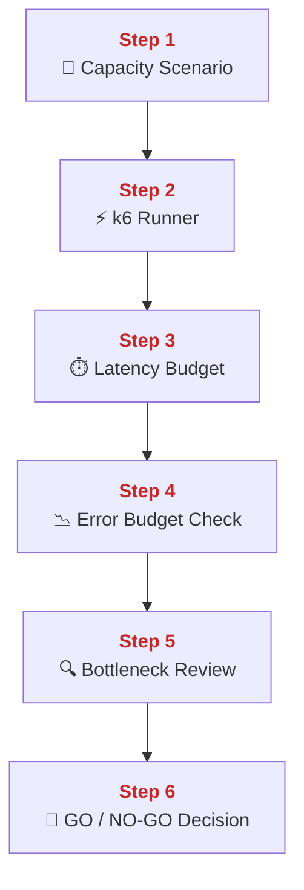
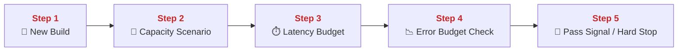
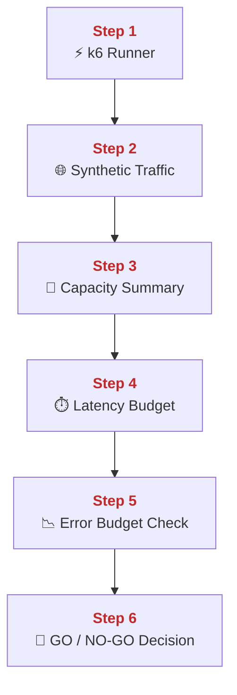
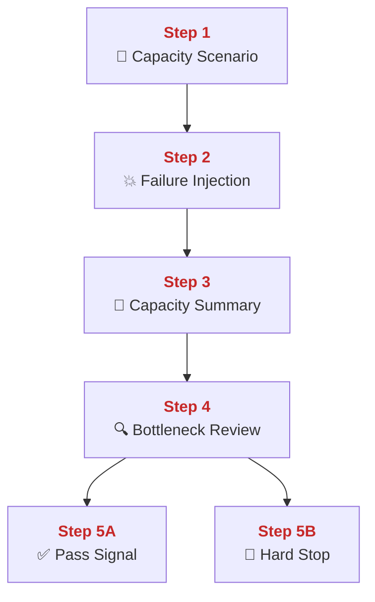
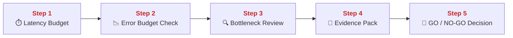
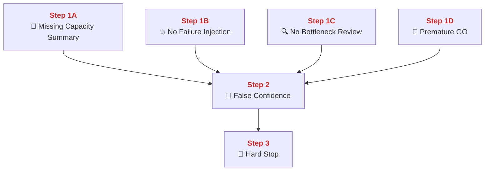
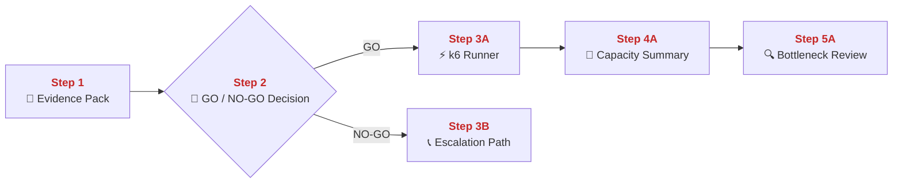
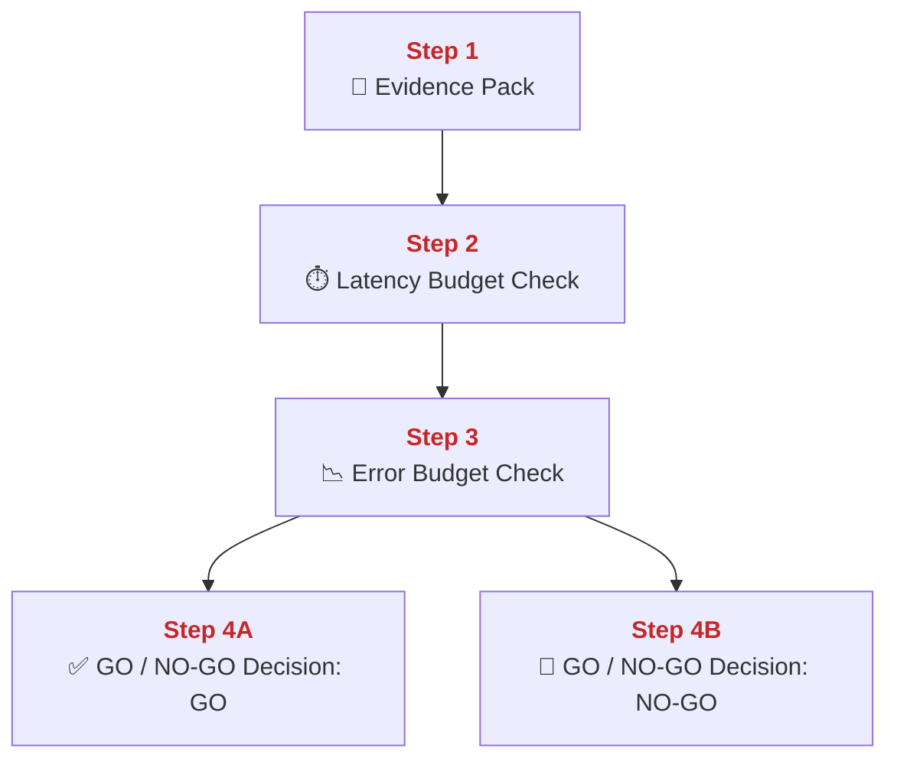

## 03 Capacity Lab Go No-Go

This chapter explains how PolyMoly turns load testing into a release gate instead of a confidence ritual.
It also explains how k6 scenarios, latency thresholds, failure injection, and bottleneck review produce a real GO or NO-GO decision before release.

---

## Quick Jump

- [Visual Contract Map](#visual-contract-map)
- [Vocabulary Dictionary](#vocabulary-dictionary)
- [1. Problem and Purpose](#1-problem-and-purpose)
- [2. End User Flow](#2-end-user-flow)
- [3. How It Works](#3-how-it-works)
- [4. Architectural Decision (ADR Format)](#4-architectural-decision-adr-format)
- [5. How It Fails](#5-how-it-fails)
- [6. How To Fix (Runbook Safety Standard)](#6-how-to-fix-runbook-safety-standard)
- [7. GO / NO-GO Panels](#7-go--no-go-panels)
- [8. Evidence Pack](#8-evidence-pack)
- [9. Operational Checklist](#9-operational-checklist)
- [10. CI / Quality Gate Reference](#10-ci--quality-gate-reference)
- [What Did We Learn](#what-did-we-learn)

---

## Visual Contract Map

### ADU: Load Proof Decision Loop

#### Technical Definition

- **[Capacity Scenario](#term-capacity-scenario)**: One defined load pattern such as steady, spike, soak, ramp, or failure injection.
- **[k6 Runner](#term-k6-runner)**: The process that generates synthetic load and records latency or error results.
- **[Latency Budget](#term-latency-budget)**: The allowed response-time target under test.
- **[Error Budget Check](#term-error-budget-check)**: The threshold check for failed requests during the test window.
- **[Bottleneck Review](#term-bottleneck-review)**: The follow-up inspection that explains which subsystem saturated first.
- **[GO / NO-GO Decision](#term-go-no-go-decision)**: The release verdict produced from capacity evidence.

#### Diagram



#### 📖 Deterministic Story

- <span style="color:#c62828"><strong>Step 1:</strong></span> The team selects a **[Capacity Scenario](#term-capacity-scenario)**.
- <span style="color:#c62828"><strong>Step 2:</strong></span> The **[k6 Runner](#term-k6-runner)** executes that scenario.
- <span style="color:#c62828"><strong>Step 3:</strong></span> The result is compared to the **[Latency Budget](#term-latency-budget)**.
- <span style="color:#c62828"><strong>Step 4:</strong></span> The result is also compared to the **[Error Budget Check](#term-error-budget-check)**.
- <span style="color:#c62828"><strong>Step 5:</strong></span> The **[Bottleneck Review](#term-bottleneck-review)** explains where pressure appeared first.
- <span style="color:#c62828"><strong>Step 6:</strong></span> A **[GO / NO-GO Decision](#term-go-no-go-decision)** is made from those signals.

#### 🧠 Conceptual Layer

Here is what physically happens inside the system:

Step 1 starts with scenario selection. The team chooses whether it wants steady traffic, a spike, a soak period, or a failure-injection path. This matters because each scenario stresses a different part of the system.

Step 2 is the **[k6 Runner](#term-k6-runner)** process. k6 opens many HTTP client connections, sends requests according to the scenario, and records response times and failures. The network action is synthetic user traffic hitting the platform like real load.

Step 3 is latency comparison. The test summary and time-series data are checked against the **[Latency Budget](#term-latency-budget)**. The decision is whether the service still responds within the agreed window under this load.

Step 4 is the **[Error Budget Check](#term-error-budget-check)**. Even if latency looks acceptable, the run is unsafe if too many requests fail. This separates fast-enough success from fast-enough failure.

Step 5 is the **[Bottleneck Review](#term-bottleneck-review)**. Dashboards and review scripts are used to see whether pressure appeared first in CPU, memory, gateway, queue, Redis, or database behavior.

Step 6 is the **[GO / NO-GO Decision](#term-go-no-go-decision)**. The team only approves release when the system meets the load target and the observed bottleneck picture is understood well enough to trust the result.

#### 🧩 Imagine It Like

- First choose the kind of storm you want to test.
- Then send a robot crowd at the city gates.
- After that, measure both the wait time and the number of people turned away before deciding if the walls are ready.

#### 🔎 Lemme Explain

- Capacity testing is useful only when it ends in a real decision.
- The decision needs both numbers and a bottleneck explanation.

---

## Vocabulary Dictionary

### Technical Definition

- <a id="term-capacity-scenario"></a> **[Capacity Scenario](#term-capacity-scenario)**: One defined load pattern such as steady, spike, soak, ramp, or failure injection.
- <a id="term-k6-runner"></a> **[k6 Runner](https://k6.io/system/docs/)**: The process that generates synthetic load and records latency or error results.
- <a id="term-latency-budget"></a> **[Latency Budget](#term-latency-budget)**: The allowed response-time target under test.
- <a id="term-error-budget-check"></a> **[Error Budget Check](#term-error-budget-check)**: The threshold check for failed requests during the test window.
- <a id="term-bottleneck-review"></a> **[Bottleneck Review](#term-bottleneck-review)**: The follow-up inspection that explains which subsystem saturated first.
- <a id="term-go-no-go-decision"></a> **[GO / NO-GO Decision](#term-go-no-go-decision)**: The release verdict produced from capacity evidence.
- <a id="term-failure-injection"></a> **[Failure Injection](#term-failure-injection)**: A test phase that intentionally degrades one dependency while load is active.
- <a id="term-capacity-summary"></a> **[Capacity Summary](#term-capacity-summary)**: The recorded output JSON or report from the capacity test run.
- <a id="term-pass-signal"></a> **[Pass Signal](#term-pass-signal)**: The measurable condition that must be true for GO.
- <a id="term-hard-stop"></a> **[Hard Stop](#term-hard-stop)**: The measured condition that forces NO-GO or rollback.
- <a id="term-evidence-pack"></a> **[Evidence Pack](#term-evidence-pack)**: The minimum test summary, dashboard, and bottleneck proof gathered before release.
- <a id="term-escalation-path"></a> **[Escalation Path](#term-escalation-path)**: The responder path used when the capacity result is unclear or unsafe.
- <a id="term-false-confidence"></a> **[False Confidence](#term-false-confidence)**: A release belief produced from incomplete or weak capacity evidence.

---

## 1. Problem and Purpose

### Trust Boundary

- External entry: A release candidate enters the load lab through one named test scenario.
- Protected side: Promotion decisions stay behind measured latency, failure, and bottleneck evidence.
- Failure posture: If thresholds or bottleneck evidence are unclear, capacity stays NO-GO and release does not advance.

### ADU: Why Feeling Fast Is Not Evidence

#### Technical Definition

- **[Capacity Scenario](#term-capacity-scenario)**: One defined load pattern such as steady, spike, soak, ramp, or failure injection.
- **[Latency Budget](#term-latency-budget)**: The allowed response-time target under test.
- **[Error Budget Check](#term-error-budget-check)**: The threshold check for failed requests during the test window.
- **[Pass Signal](#term-pass-signal)**: The measurable condition that must be true for GO.
- **[Hard Stop](#term-hard-stop)**: The measured condition that forces NO-GO or rollback.

#### Diagram



#### 📖 Deterministic Story

- <span style="color:#c62828"><strong>Step 1:</strong></span> A new build is a release candidate, not proof of production fitness.
- <span style="color:#c62828"><strong>Step 2:</strong></span> The build enters a **[Capacity Scenario](#term-capacity-scenario)**.
- <span style="color:#c62828"><strong>Step 3:</strong></span> The run is checked against the **[Latency Budget](#term-latency-budget)**.
- <span style="color:#c62828"><strong>Step 4:</strong></span> The run is checked against the **[Error Budget Check](#term-error-budget-check)**.
- <span style="color:#c62828"><strong>Step 5:</strong></span> The result becomes a **[Pass Signal](#term-pass-signal)** or a **[Hard Stop](#term-hard-stop)**.

#### 🧠 Conceptual Layer

Here is what physically happens inside the system:

Step 1 is the release candidate entering evaluation. A successful build is only the start of the question. The system still does not know how that build behaves under real concurrency.

Step 2 is the selected **[Capacity Scenario](#term-capacity-scenario)**. This makes the test explicit instead of vague. The team knows what load pattern it is applying and why.

Step 3 is latency measurement against the **[Latency Budget](#term-latency-budget)**. The team checks whether the service stays fast enough while synthetic traffic is active.

Step 4 is the **[Error Budget Check](#term-error-budget-check)**. A run with acceptable median latency can still be a bad run if too many requests fail.

Step 5 is the gate output. The numbers become either a **[Pass Signal](#term-pass-signal)** that allows release to continue or a **[Hard Stop](#term-hard-stop)** that blocks it.

#### 🧩 Imagine It Like

- A new car leaving the factory is not automatically race-safe.
- It goes onto a test track.
- If it is fast but keeps dropping wheels, it still fails.

#### 🔎 Lemme Explain

- Load testing exists to replace intuition with measured release proof.
- One acceptable graph is not enough; both speed and failure rate matter.

---

## 2. End User Flow

### ADU: Synthetic Crowd To Release Verdict

#### Technical Definition

- **[k6 Runner](#term-k6-runner)**: The process that generates synthetic load and records latency or error results.
- **[Capacity Summary](#term-capacity-summary)**: The recorded output JSON or report from the capacity test run.
- **[Latency Budget](#term-latency-budget)**: The allowed response-time target under test.
- **[Error Budget Check](#term-error-budget-check)**: The threshold check for failed requests during the test window.
- **[GO / NO-GO Decision](#term-go-no-go-decision)**: The release verdict produced from capacity evidence.

#### Diagram



#### 📖 Deterministic Story

- <span style="color:#c62828"><strong>Step 1:</strong></span> The **[k6 Runner](#term-k6-runner)** starts the test.
- <span style="color:#c62828"><strong>Step 2:</strong></span> Synthetic traffic hits the platform.
- <span style="color:#c62828"><strong>Step 3:</strong></span> The run writes a **[Capacity Summary](#term-capacity-summary)**.
- <span style="color:#c62828"><strong>Step 4:</strong></span> The summary is checked against the **[Latency Budget](#term-latency-budget)**.
- <span style="color:#c62828"><strong>Step 5:</strong></span> The summary is checked against the **[Error Budget Check](#term-error-budget-check)**.
- <span style="color:#c62828"><strong>Step 6:</strong></span> The result becomes a **[GO / NO-GO Decision](#term-go-no-go-decision)**.

#### 🧠 Conceptual Layer

Here is what physically happens inside the system:

Step 1 is the start of the k6 process. k6 loads the script, environment variables, thresholds, and output path into memory.

Step 2 is the actual synthetic network load. k6 opens client connections and sends requests to the target routes using the configured scenario profile.

Step 3 is the **[Capacity Summary](#term-capacity-summary)**. k6 writes counters, trends, and threshold results into its summary output.

Step 4 is the latency check. The team compares the measured response-time distribution to the **[Latency Budget](#term-latency-budget)**.

Step 5 is the failure check. The same run is checked against the **[Error Budget Check](#term-error-budget-check)** thresholds. This is where the team sees whether the service stayed not only fast enough but also successful enough.

Step 6 is the verdict. The release path moves only when both checks stay inside the allowed envelope.

#### 🧩 Imagine It Like

- The robot crowd starts running at the gates.
- The timekeeper writes the full timing sheet.
- The judge looks at both how fast people moved and how many fell over before deciding.

#### 🔎 Lemme Explain

- One load run becomes useful only when it ends in a stored summary and a clear verdict.
- Without thresholds, the same summary can be argued about forever.

---

## 3. How It Works

### ADU: Scenarios, Failure Injection, And Bottleneck Review

#### Technical Definition

- **[Capacity Scenario](#term-capacity-scenario)**: One defined load pattern such as steady, spike, soak, ramp, or failure injection.
- **[Failure Injection](#term-failure-injection)**: A test phase that intentionally degrades one dependency while load is active.
- **[Capacity Summary](#term-capacity-summary)**: The recorded output JSON or report from the capacity test run.
- **[Bottleneck Review](#term-bottleneck-review)**: The follow-up inspection that explains which subsystem saturated first.
- **[Pass Signal](#term-pass-signal)**: The measurable condition that must be true for GO.
- **[Hard Stop](#term-hard-stop)**: The measured condition that forces NO-GO or rollback.

#### Diagram



#### 📖 Deterministic Story

- <span style="color:#c62828"><strong>Step 1:</strong></span> The team chooses a **[Capacity Scenario](#term-capacity-scenario)**.
- <span style="color:#c62828"><strong>Step 2:</strong></span> The run may include **[Failure Injection](#term-failure-injection)**.
- <span style="color:#c62828"><strong>Step 3:</strong></span> The run writes a **[Capacity Summary](#term-capacity-summary)**.
- <span style="color:#c62828"><strong>Step 4:</strong></span> A **[Bottleneck Review](#term-bottleneck-review)** explains what saturated first.
- <span style="color:#c62828"><strong>Step 5A:</strong></span> If the system stays inside limits, the result becomes a **[Pass Signal](#term-pass-signal)**.
- <span style="color:#c62828"><strong>Step 5B:</strong></span> If it crosses the stop line, the result becomes a **[Hard Stop](#term-hard-stop)**.

#### 🧠 Conceptual Layer

Here is what physically happens inside the system:

Step 1 is scenario selection. The k6 script accepts env options that choose which load branch to run. This makes the test explicit and repeatable.

Step 2 is **[Failure Injection](#term-failure-injection)** when the scenario includes degraded backend or error-rate pressure. The network action is still synthetic load, but now one controlled bad condition is introduced to see whether the platform degrades safely.

Step 3 is summary generation. k6 records request counts, failures, response-time trends, and threshold status into the **[Capacity Summary](#term-capacity-summary)** output file.

Step 4 is the **[Bottleneck Review](#term-bottleneck-review)**. Operators compare the summary with dashboards and review scripts to see whether the first saturation appeared in gateway, database, Redis, queue, or CPU pressure.

Step 5A is the **[Pass Signal](#term-pass-signal)** branch. Step 5B is the **[Hard Stop](#term-hard-stop)** branch. The distinction matters because a run can fail either by numbers alone or by an unacceptable bottleneck shape even when some thresholds look close enough.

#### 🧩 Imagine It Like

- First choose the storm type.
- Then, if needed, break one bridge on purpose while the storm is active.
- After the storm, inspect which wall bent first before deciding if the city passed.

#### 🔎 Lemme Explain

- Scenario choice changes what kind of truth the test can reveal.
- Bottleneck review explains why the verdict is GO or NO-GO, not only whether it is.

---

## 4. Architectural Decision (ADR Format)

### ADU: Release By Measured Capacity, Not Hope

#### Technical Definition

- **[GO / NO-GO Decision](#term-go-no-go-decision)**: The release verdict produced from capacity evidence.
- **[Latency Budget](#term-latency-budget)**: The allowed response-time target under test.
- **[Error Budget Check](#term-error-budget-check)**: The threshold check for failed requests during the test window.
- **[Bottleneck Review](#term-bottleneck-review)**: The follow-up inspection that explains which subsystem saturated first.
- **[Evidence Pack](#term-evidence-pack)**: The minimum test summary, dashboard, and bottleneck proof gathered before release.

#### Diagram



#### 📖 Deterministic Story

- <span style="color:#c62828"><strong>Step 1:</strong></span> The release path first respects the **[Latency Budget](#term-latency-budget)**.
- <span style="color:#c62828"><strong>Step 2:</strong></span> It also respects the **[Error Budget Check](#term-error-budget-check)**.
- <span style="color:#c62828"><strong>Step 3:</strong></span> The **[Bottleneck Review](#term-bottleneck-review)** explains the limiting subsystem.
- <span style="color:#c62828"><strong>Step 4:</strong></span> The result becomes an **[Evidence Pack](#term-evidence-pack)**.
- <span style="color:#c62828"><strong>Step 5:</strong></span> The release verdict is a **[GO / NO-GO Decision](#term-go-no-go-decision)**.

#### 🧠 Conceptual Layer

Here is what physically happens inside the system:

Step 1 is the latency rule. The team defines what response-time distribution is acceptable for the release.

Step 2 is the failure rule. The team also defines how many failed requests are acceptable during the same test.

Step 3 is the bottleneck explanation. A system can fail because it is slow, because it errors, or because one subsystem saturates first and creates risk for later traffic. The review step names that subsystem.

Step 4 is evidence storage. The test summary, dashboard state, and bottleneck explanation are kept together.

Step 5 is the release verdict. The organization treats that evidence as a release control surface, not as a nice-to-have lab report.

#### 🧩 Imagine It Like

- The city must pass both the speed clock and the collapse count.
- Then the inspectors name which wall bent first.
- Only after that does the mayor say GO or NO-GO.

#### 🔎 Lemme Explain

- Capacity results become operationally valuable only when they control release.
- The verdict should be grounded in both thresholds and subsystem explanation.

---

## 5. How It Fails

### ADU: False Confidence Failure Modes

#### Technical Definition

- **[Capacity Summary](#term-capacity-summary)**: The recorded output JSON or report from the capacity test run.
- **[Failure Injection](#term-failure-injection)**: A test phase that intentionally degrades one dependency while load is active.
- **[Bottleneck Review](#term-bottleneck-review)**: The follow-up inspection that explains which subsystem saturated first.
- **[Hard Stop](#term-hard-stop)**: The measured condition that forces NO-GO or rollback.
- **[GO / NO-GO Decision](#term-go-no-go-decision)**: The release verdict produced from capacity evidence.
- **[False Confidence](#term-false-confidence)**: A release belief produced from incomplete or weak capacity evidence.

#### Diagram



#### 📖 Deterministic Story

- <span style="color:#c62828"><strong>Step 1A:</strong></span> Missing **[Capacity Summary](#term-capacity-summary)** leaves the run unprovable.
- <span style="color:#c62828"><strong>Step 1B:</strong></span> Missing **[Failure Injection](#term-failure-injection)** hides degraded behavior.
- <span style="color:#c62828"><strong>Step 1C:</strong></span> Missing **[Bottleneck Review](#term-bottleneck-review)** hides the limiting subsystem.
- <span style="color:#c62828"><strong>Step 1D:</strong></span> A premature **[GO / NO-GO Decision](#term-go-no-go-decision)** creates false release confidence.
- <span style="color:#c62828"><strong>Step 2:</strong></span> These gaps become **[False Confidence](#term-false-confidence)**.
- <span style="color:#c62828"><strong>Step 3:</strong></span> The correct response is **[Hard Stop](#term-hard-stop)**, not release.

#### 🧠 Conceptual Layer

Here is what physically happens inside the system:

Step 1A is missing summary output. The test may have run, but the system does not have a durable result file that proves what happened.

Step 1B is missing degraded-path coverage. The load test may show baseline success but reveal nothing about behavior when one dependency weakens.

Step 1C is missing explanation. Numbers alone show that something hurt, but not what subsystem bent first.

Step 1D is premature GO. The organization moves toward release without enough evidence to justify that confidence.

Step 2 is false confidence. The team thinks it has validated the system, but important failure behavior is still unknown.

Step 3 is the proper stop condition. When evidence is incomplete, the release path should block rather than celebrate a shallow pass.

#### 🧩 Imagine It Like

- The city ran one race but kept no timing sheet.
- It never tested the bridge with one support weakened.
- It still declared the walls certified.

#### 🔎 Lemme Explain

- Incomplete load evidence is not neutral. It is actively misleading.
- False confidence is one of the most expensive failure modes in release engineering.

| Symptom | Root Cause | Severity | Fastest confirmation step |
| :--- | :--- | :--- | :--- |
| No saved result file | missing summary | Sev-1 | check capacity summary path |
| Load pass but outage under dependency loss | missing failure injection | Sev-1 | inspect scenario coverage |
| Team knows it failed but not why | no bottleneck review | Sev-2 | compare k6 output vs dashboards |
| Release approved with weak evidence | premature GO | Sev-1 | inspect gate artifact bundle |

---

## 6. How To Fix (Runbook Safety Standard)

### ADU: Produce A Trustworthy Capacity Verdict

#### Technical Definition

- **[Evidence Pack](#term-evidence-pack)**: The minimum test summary, dashboard, and bottleneck proof gathered before release.
- **[k6 Runner](#term-k6-runner)**: The process that generates synthetic load and records latency or error results.
- **[Capacity Summary](#term-capacity-summary)**: The recorded output JSON or report from the capacity test run.
- **[Bottleneck Review](#term-bottleneck-review)**: The follow-up inspection that explains which subsystem saturated first.
- **[GO / NO-GO Decision](#term-go-no-go-decision)**: The release verdict produced from capacity evidence.
- **[Escalation Path](#term-escalation-path)**: The responder path used when the capacity result is unclear or unsafe.

#### Diagram



#### 📖 Deterministic Story

- <span style="color:#c62828"><strong>Step 1:</strong></span> Gather the **[Evidence Pack](#term-evidence-pack)** and target thresholds first.
- <span style="color:#c62828"><strong>Step 2:</strong></span> Decide whether a release verdict can be made or whether more proof is required.
- <span style="color:#c62828"><strong>Step 3A:</strong></span> If GO for test execution, run the **[k6 Runner](#term-k6-runner)**.
- <span style="color:#c62828"><strong>Step 4A:</strong></span> Save the **[Capacity Summary](#term-capacity-summary)**.
- <span style="color:#c62828"><strong>Step 5A:</strong></span> Complete the **[Bottleneck Review](#term-bottleneck-review)** before final release approval.
- <span style="color:#c62828"><strong>Step 3B:</strong></span> If evidence is still unsafe or incomplete, use the **[Escalation Path](#term-escalation-path)**.

#### 🧠 Conceptual Layer

Here is what physically happens inside the system:

Step 1 is evidence preparation. The team identifies thresholds, target route, and where the summary output will be stored. This avoids running a test that later cannot be judged cleanly.

Step 2 is the first fork point. If the test plan or current system state is too unclear, the team should not pretend the run will produce a trustworthy verdict.

Step 3A is the k6 execution branch. The **[k6 Runner](#term-k6-runner)** sends the test traffic and records live metrics. Step 3B is escalation instead of shallow testing.

Step 4A is summary storage. The run result is written to the configured **[Capacity Summary](#term-capacity-summary)** path so the evidence survives after the terminal scroll disappears.

Step 5A is bottleneck explanation. The team compares the summary with monitoring data and writes down the limiting subsystem before using the run as release proof.

#### 🧩 Imagine It Like

- Set the exam rules before the exam starts.
- Run the robot crowd.
- Save the result sheet and inspect which wall bent before saying the city passed.

#### 🔎 Lemme Explain

- A trustworthy capacity verdict needs stored result, measured thresholds, and subsystem explanation.
- Without all three, the release decision is weaker than it appears.

### Exact Runbook Commands

```bash
# Read-only checks
go run ./system/tools/poly/cmd/poly gate check performance-review
cat system/gates/artifacts/capacity-summary.json 2>/dev/null || true
```

```bash
# Mutation (only after Evidence Pack is captured and test scope is approved)
task performance:capacity-test
```

```bash
# Verify
cat system/gates/artifacts/capacity-summary.json
go run ./system/tools/poly/cmd/poly gate check performance-review
```

Rollback rule:
- If capacity test crosses hard-stop thresholds, NO-GO the release.
- Do not waive a failing capacity verdict without a new explicit evidence pack.

---

## 7. GO / NO-GO Panels

### Rollout Decision Matrix

| Signal | Canary Rule | Roll Forward | Rollback Trigger |
| :--- | :--- | :--- | :--- |
| Canary slice stays inside latency and error thresholds | Send the new build through one narrow traffic slice or one staged load lane before broader rollout | Expand only when the same build stays inside the agreed latency and error envelope | p95 or error thresholds fail during the canary window |
| Bottleneck review explains the first pressure point | Keep the canary small until the first saturation point is understood and accepted | Continue only when the observed bottleneck is expected and still inside safe capacity | Unknown saturation path, silent queue growth, or unexplained resource spike |
| Capacity evidence bundle remains complete | Treat the stored summary, dashboards, and bottleneck notes as the only authority for promotion | Roll forward while the evidence bundle still describes the exact build under discussion | Missing summary artifact, stale dashboard window, or evidence drift between runs |

### ADU: Release Readiness Gate

#### Technical Definition

- **[Latency Budget](#term-latency-budget)**: The allowed response-time target under test.
- **[Error Budget Check](#term-error-budget-check)**: The threshold check for failed requests during the test window.
- **[Bottleneck Review](#term-bottleneck-review)**: The follow-up inspection that explains which subsystem saturated first.
- **[GO / NO-GO Decision](#term-go-no-go-decision)**: The release verdict produced from capacity evidence.
- **[Evidence Pack](#term-evidence-pack)**: The minimum test summary, dashboard, and bottleneck proof gathered before release.

#### Diagram



#### 📖 Deterministic Story

- <span style="color:#c62828"><strong>Step 1:</strong></span> The **[Evidence Pack](#term-evidence-pack)** enters the release gate.
- <span style="color:#c62828"><strong>Step 2:</strong></span> The result is checked against the **[Latency Budget](#term-latency-budget)**.
- <span style="color:#c62828"><strong>Step 3:</strong></span> The result is checked against the **[Error Budget Check](#term-error-budget-check)**.
- <span style="color:#c62828"><strong>Step 4A:</strong></span> If both stay healthy enough, the **[GO / NO-GO Decision](#term-go-no-go-decision)** may be GO.
- <span style="color:#c62828"><strong>Step 4B:</strong></span> If either one fails, the decision is NO-GO.

#### 🧠 Conceptual Layer

Here is what physically happens inside the system:

Step 1 starts with the saved capacity summary and bottleneck notes already collected.

Step 2 checks speed. The team asks whether the measured response-time distribution stayed within the allowed limit.

Step 3 checks failure rate. The team asks whether enough requests still succeeded while the load was active.

Step 4A is GO when both checks pass and the bottleneck picture is acceptable. Step 4B is NO-GO when either one fails.

#### 🧩 Imagine It Like

- Bring the exam paper to the desk.
- Check the speed score.
- Check the failure score.
- Only then stamp GO or NO-GO.

#### 🔎 Lemme Explain

- Release readiness under load is a two-key check: speed and failure rate.
- Capacity GO should stay simple enough that no one can pretend not to understand it.

---

## 8. Evidence Pack

Collect before release decision:

- Latest capacity summary JSON.
- Scenario name and target route.
- Thresholds used for latency and failure rate.
- Bottleneck review result.
- Dashboard references for the same time window.
- Current UTC time anchor.

---

## 9. Operational Checklist

- [ ] Scenario is named.
- [ ] Thresholds are explicit.
- [ ] Summary artifact exists.
- [ ] Bottleneck review is written.
- [ ] GO / NO-GO decision is explicit.
- [ ] Failed runs block release.

---

## 10. CI / Quality Gate Reference

Run:

```bash
task docs:governance
task docs:governance:strict
task performance:capacity-test
go run ./system/tools/poly/cmd/poly gate check performance-review
```

Related workflows and evidence:

- `system/scripts/dev/performance/capacity-test.js`
- `system/gates/artifacts/capacity-summary.json`
- `system/gates/artifacts/performance-review/`
- `system/runtime/capabilities/observability/providers/grafana/dashboards/slo-and-capacity.json`
- `system/gates/artifacts/docs-governance/`
- `system/gates/artifacts/docs-links/`

---

## What Did We Learn

- Capacity testing is a release gate, not a motivational dashboard.
- Scenario choice changes the truth you learn.
- Saved summary plus bottleneck review is what makes a run reusable.
- NO-GO is a valid engineering outcome.
