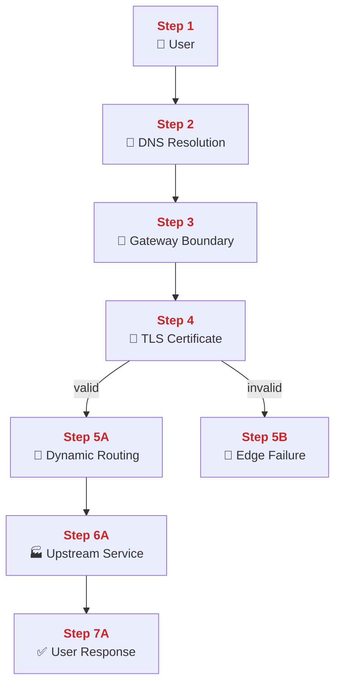
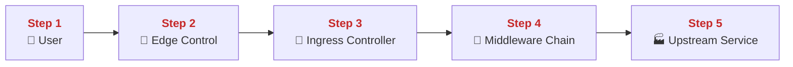
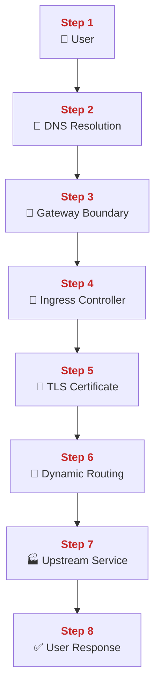
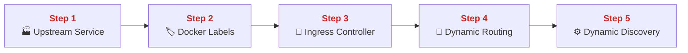
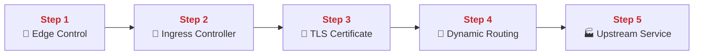
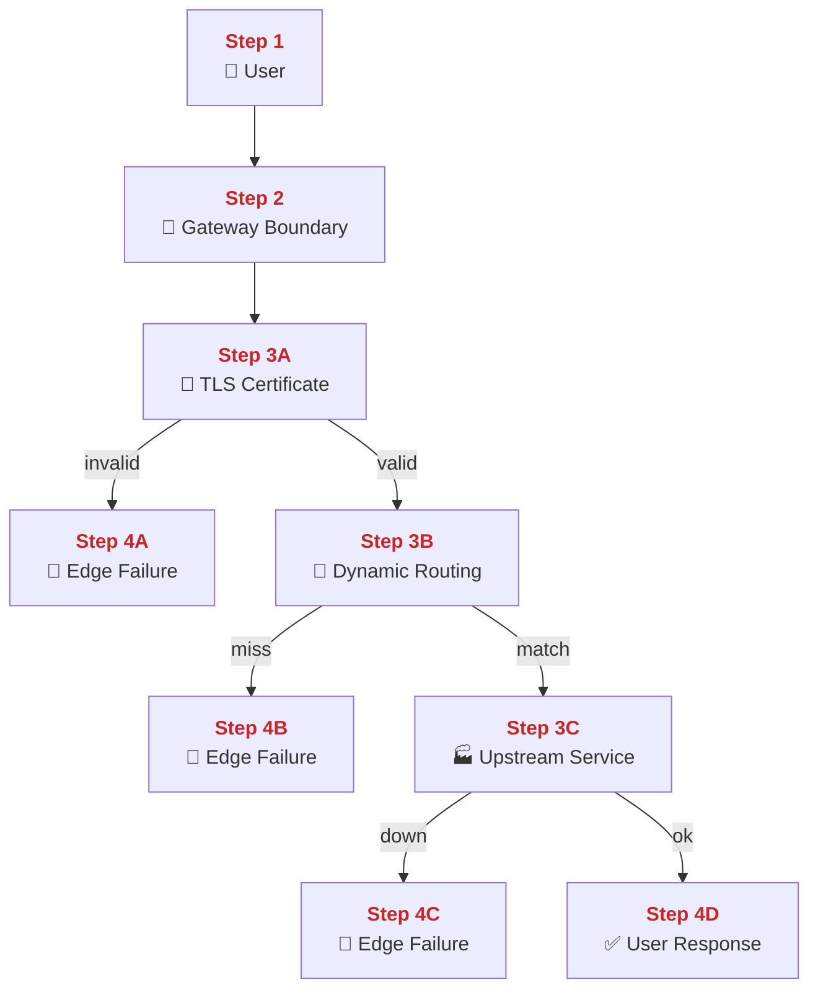
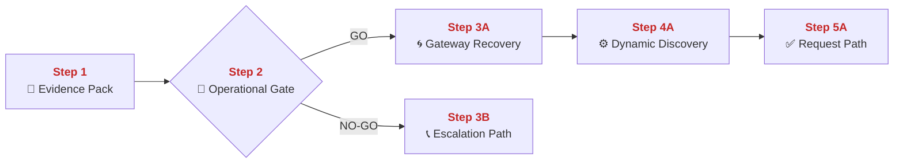
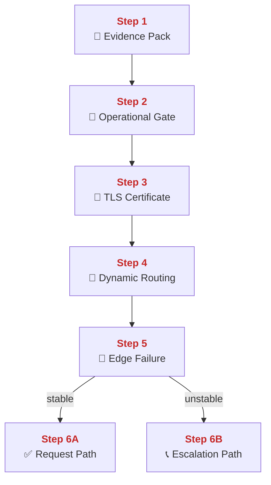

## 01 User Entry and Routing

This chapter explains how PolyMoly accepts a public HTTPS request, verifies trust, selects the right backend, and sends the response back.
It also explains where that flow breaks, how to recover safely, and which signals decide GO or NO-GO.

---

## Quick Jump

- [Visual Contract Map](#visual-contract-map)
- [Vocabulary Dictionary](#vocabulary-dictionary)
- [1. Problem and Purpose](#1-problem-and-purpose)
- [2. End User Flow](#2-end-user-flow)
- [3. How It Works](#3-how-it-works)
- [4. Architectural Decision (ADR Format)](#4-architectural-decision-adr-format)
- [5. How It Fails](#5-how-it-fails)
- [6. How To Fix (Runbook Safety Standard)](#6-how-to-fix-runbook-safety-standard)
- [7. GO / NO-GO Panels](#7-go-no-go-panels)
- [8. Evidence Pack](#8-evidence-pack)
- [9. Operational Checklist](#9-operational-checklist)
- [10. CI / Quality Gate Reference](#10-ci--quality-gate-reference)
- [What Did We Learn](#what-did-we-learn)

---

## Visual Contract Map

### ADU: Ingress Life Cycle

#### Technical Definition

- **[Ingress Life Cycle](#term-ingress-lifecycle)**: The full request path from public hostname lookup to internal service response.
- **[User](#term-user)**: The external actor who starts the request.
- **[DNS Resolution](#term-dns-resolution)**: The lookup step that turns the hostname into a reachable IP address.
- **[Gateway Boundary](#term-gateway-boundary)**: The public HTTPS entry point where trust is checked.
- **[TLS Certificate](#term-tls-certificate)**: The certificate presented at the edge during HTTPS trust validation.
- **[Dynamic Routing](#term-dynamic-routing)**: The live route selection logic that matches host and path to a backend.
- **[Upstream Service](#term-upstream-service)**: The internal service container that receives forwarded traffic.
- **[Edge Failure](#term-edge-failure)**: A stop at the edge caused by trust failure, route miss, or backend unreachability.

#### Diagram



#### 📖 Deterministic Story

- <span style="color:#c62828"><strong>Step 1:</strong></span> The **[User](#term-user)** starts the **[Ingress Life Cycle](#term-ingress-lifecycle)** by opening a public HTTPS URL.
- <span style="color:#c62828"><strong>Step 2:</strong></span> **[DNS Resolution](#term-dns-resolution)** returns the IP address that will receive the connection.
- <span style="color:#c62828"><strong>Step 3:</strong></span> The connection reaches the **[Gateway Boundary](#term-gateway-boundary)** on port 443.
- <span style="color:#c62828"><strong>Step 4:</strong></span> The **[Gateway Boundary](#term-gateway-boundary)** presents and checks the **[TLS Certificate](#term-tls-certificate)** before forwarding is allowed.
- <span style="color:#c62828"><strong>Step 5A:</strong></span> If the **[TLS Certificate](#term-tls-certificate)** is valid, **[Dynamic Routing](#term-dynamic-routing)** selects the matching internal destination.
- <span style="color:#c62828"><strong>Step 5B:</strong></span> If the **[TLS Certificate](#term-tls-certificate)** is invalid, the request stops as an **[Edge Failure](#term-edge-failure)**.
- <span style="color:#c62828"><strong>Step 6A:</strong></span> The request is forwarded to the selected **[Upstream Service](#term-upstream-service)**.
- <span style="color:#c62828"><strong>Step 7A:</strong></span> The response returns to the **[User](#term-user)** through the same edge path.

#### 🧠 Conceptual Layer

Here is what physically happens inside the system:

Step 1 starts in the browser on the **[User](#term-user)** machine. The browser process has the URL in memory, but it cannot open an HTTPS session yet because it does not know which IP address owns that hostname. So the first network action is a DNS query. The browser sends the hostname to a resolver and waits for the answer. While it waits, it keeps a small request state object in memory. That object holds the URL, the hostname, the method, and the fact that connection setup has not happened yet.

Step 2 happens inside **[DNS Resolution](#term-dns-resolution)**. A resolver process reads the hostname, checks its cache, and if needed checks the current record set. Bytes now move back to the browser as a DNS reply. Inside the resolver, cached entries and TTL data are used to decide whether the answer is still valid. This is the first fork point: either there is a usable IP address for this hostname or there is not. If the answer is yes, the browser moves to the next network action and opens a TCP connection to that IP on port 443. If the answer is no, the request never reaches the edge at all.

Step 3 happens at the **[Gateway Boundary](#term-gateway-boundary)**. On the PolyMoly host, the operating system is already listening on port 443 for the edge proxy. In PolyMoly that live process is the **[Ingress Controller](#term-ingress-controller)**. The kernel accepts the incoming TCP handshake and hands the new socket to that process. In memory, the controller creates live connection state for that socket. It now knows a client is connected, but it does not trust the client yet.

Step 4 is the TLS handshake. The **[Ingress Controller](#term-ingress-controller)** reads the client hello, chooses the correct **[TLS Certificate](#term-tls-certificate)** for the requested host, and sends certificate data back to the browser. The browser checks expiration, hostname match, and trust chain. The controller keeps handshake state for this connection in memory while those messages move back and forth. The decision is whether the HTTPS session becomes trusted. If the handshake fails, the next network action is an error and a closed socket. Nothing deeper inside the system is touched.

Step 5A begins only after trust succeeds. The browser now sends encrypted HTTP bytes across the same connection. The **[Ingress Controller](#term-ingress-controller)** reads those bytes, parses the request line and headers, and extracts the host and path. Inside the controller process, the important memory structure is the in-memory route table for **[Dynamic Routing](#term-dynamic-routing)**. That table was built earlier from container metadata. This is the next fork point. The controller compares the incoming host and path with the loaded route rules and decides which backend target matches. If one route matches, the next network action is a new internal connection to the chosen **[Upstream Service](#term-upstream-service)**.

Step 5B is the failure branch. If trust failed, the request becomes an **[Edge Failure](#term-edge-failure)** immediately. The connection is closed or an error is returned, and no internal route lookup or backend call happens. In memory, the controller keeps the failure reason long enough for logs and metrics to record it.

Step 6A happens on the private service network. The **[Ingress Controller](#term-ingress-controller)** opens an internal HTTP connection to the selected **[Upstream Service](#term-upstream-service)**. It forwards the request bytes, waits for the backend response, and keeps both sides of the exchange in memory: the original client connection and the upstream connection. The decision is whether the backend answers in time and with a valid response.

Step 7A is the return path. The controller reads the backend response from the internal connection and writes it back to the original encrypted client socket. The browser receives the response and finishes the request cycle. If the backend is down, the controller returns an edge-side error instead. That is the whole flow from hostname lookup to response delivery.

#### 🧩 Imagine It Like

- You first check the address book ([DNS Resolution](#term-dns-resolution)) to find the right building.
- At the building entrance ([Gateway Boundary](#term-gateway-boundary)), a guard checks your pass ([TLS Certificate](#term-tls-certificate)).
- Inside, a direction board ([Dynamic Routing](#term-dynamic-routing)) points you to the right worker room ([Upstream Service](#term-upstream-service)).
- If the pass check fails, the trip ends at the entrance ([Edge Failure](#term-edge-failure)).

#### 🔎 Lemme Explain

- The edge works in a strict order: resolve, connect, verify, match, forward, return.
- If trust fails at the edge, application code never runs.

---

## Vocabulary Dictionary

### Technical Definition

- <a id="term-ingress-lifecycle"></a> **[Ingress Life Cycle](#term-ingress-lifecycle)**: The full request path from public hostname lookup to internal service response.
- <a id="term-user"></a> **[User](https://en.wikipedia.org/wiki/End_user)**: The external actor who starts the request.
- <a id="term-dns-resolution"></a> **[DNS Resolution](https://en.wikipedia.org/wiki/Domain_Name_System)**: The lookup step that turns the hostname into a reachable IP address.
- <a id="term-gateway-boundary"></a> **[Gateway Boundary](https://en.wikipedia.org/wiki/Reverse_proxy)**: The public HTTPS edge where traffic is accepted and verified before internal forwarding.
- <a id="term-ingress-controller"></a> **[Ingress Controller](https://en.wikipedia.org/wiki/Reverse_proxy)**: The running edge proxy process that accepts public traffic and forwards it to internal services.
- <a id="term-tls-certificate"></a> **[TLS Certificate](https://en.wikipedia.org/wiki/Public_key_certificate)**: The certificate used during HTTPS identity and trust validation.
- <a id="term-edge-control"></a> **[Edge Control](#term-edge-control)**: The decision to keep trust, routing, and policy at one public boundary.
- <a id="term-middleware-chain"></a> **[Middleware Chain](https://doc.traefik.io/traefik/middlewares/overview/)**: The ordered set of request checks and request mutations executed at the edge before the backend call.
- <a id="term-dynamic-routing"></a> **[Dynamic Routing](https://en.wikipedia.org/wiki/Routing)**: The live route selection logic that matches host and path to a backend.
- <a id="term-upstream-service"></a> **[Upstream Service](https://en.wikipedia.org/wiki/Microservices)**: The internal service container that receives forwarded traffic.
- <a id="term-request-path"></a> **[Request Path](#term-request-path)**: The full movement of one request from browser to backend and back again.
- <a id="term-dynamic-discovery"></a> **[Dynamic Discovery](#term-dynamic-discovery)**: The automatic refresh of live routing state when service metadata changes.
- <a id="term-docker-labels"></a> **[Docker Labels](https://docs.docker.com/config/labels-custom-metadata/)**: The container metadata fields used to declare route intent.
- <a id="term-edge-failure"></a> **[Edge Failure](#term-edge-failure)**: A stop at the edge caused by trust failure, route miss, or backend unreachability.
- <a id="term-gateway-recovery"></a> **[Gateway Recovery](#term-gateway-recovery)**: The controlled recovery sequence for the public edge after degradation.
- <a id="term-operational-gate"></a> **[Operational Gate](#term-operational-gate)**: The explicit GO / NO-GO decision point before mutation.
- <a id="term-evidence-pack"></a> **[Evidence Pack](#term-evidence-pack)**: The minimum evidence set collected before any recovery action starts.
- <a id="term-escalation-path"></a> **[Escalation Path](#term-escalation-path)**: The responder path used when direct mutation is unsafe or ineffective.

---

## 1. Problem and Purpose

### Trust Boundary

- External entry: Public DNS and HTTPS traffic enter through the gateway hostname and port 443.
- Protected side: Internal service containers and private routing state stay behind the edge boundary.
- Failure posture: If trust, route lookup, or upstream reachability is unclear, the request stops at the edge.

### ADU: Centralized Edge Control

#### Technical Definition

- **[Edge Control](#term-edge-control)**: The decision to keep trust, routing, and policy at one public boundary.
- **[User](#term-user)**: The external actor who starts the request.
- **[Ingress Controller](#term-ingress-controller)**: The running edge proxy process that accepts public traffic and forwards it to internal services.
- **[Middleware Chain](#term-middleware-chain)**: The ordered set of request checks and request mutations executed at the edge before the backend call.
- **[Upstream Service](#term-upstream-service)**: The internal service container that receives forwarded traffic.

#### Diagram



#### 📖 Deterministic Story

- <span style="color:#c62828"><strong>Step 1:</strong></span> The **[User](#term-user)** reaches one public edge instead of many service-specific public ports.
- <span style="color:#c62828"><strong>Step 2:</strong></span> **[Edge Control](#term-edge-control)** defines that one public edge as the shared trust boundary.
- <span style="color:#c62828"><strong>Step 3:</strong></span> The **[Ingress Controller](#term-ingress-controller)** is the running process that owns that boundary.
- <span style="color:#c62828"><strong>Step 4:</strong></span> The **[Middleware Chain](#term-middleware-chain)** runs before the backend is reached.
- <span style="color:#c62828"><strong>Step 5:</strong></span> Only after those edge checks does traffic reach the **[Upstream Service](#term-upstream-service)**.

#### 🧠 Conceptual Layer

Here is what physically happens inside the system:

Step 1 starts with the public client. The **[User](#term-user)** does not connect directly to many different backend containers. The browser or API client opens one public connection toward one published edge address. That is the first network action. In memory, the client keeps one destination host and one destination port for the request. The important decision at this point is architectural but very concrete: public traffic goes to one shared front door, not to many private service ports.

Step 2 is the effect of **[Edge Control](#term-edge-control)**. On the PolyMoly host, only the edge listener is exposed to the outside world. The operating system accepts inbound traffic for that listener and hands the sockets to the edge process. This means the first public bytes always enter the same place. In memory, the host and the edge process keep connection state for that one boundary instead of spreading public state across many service processes. The decision here is that trust and policy are checked once at the edge before traffic is allowed deeper inside.

Step 3 happens inside the **[Ingress Controller](#term-ingress-controller)** process. In PolyMoly that process is Traefik, but the canonical role here is the **[Ingress Controller](#term-ingress-controller)**. It is already running and already listening. It accepts the socket, reads the request, keeps route data in memory, and owns the first parsing and trust checks. The network action is still on the same accepted client connection. The controller now has the live request, the loaded configuration, and the connection state in memory. The decision is which edge logic must run before any backend sees this request.

Step 4 is the **[Middleware Chain](#term-middleware-chain)**. These checks happen inside the same edge process. No backend connection is opened yet. The controller reads headers, applies policy, may add or rewrite headers, may block the request, and may continue. The network action is still the same public connection while the request is being processed. In memory, the controller uses loaded middleware configuration plus current request state. The decision is whether the request is safe and valid enough to continue.

Step 5 happens only if the earlier checks pass. The **[Ingress Controller](#term-ingress-controller)** opens a private internal connection to the **[Upstream Service](#term-upstream-service)** and forwards the request. The backend never sees raw public traffic first. It only sees traffic that already passed the shared edge checks. In memory, the controller keeps both sides together: the original client connection and the selected backend connection. That is why this pattern matters. It puts the first public trust decision, the first route decision, and the first policy decision in one place.

#### 🧩 Imagine It Like

- Everyone enters through one guarded lobby ([Edge Control](#term-edge-control)).
- The lobby desk ([Ingress Controller](#term-ingress-controller)) checks every visitor before sending them onward.
- The rule desk ([Middleware Chain](#term-middleware-chain)) stands before any worker room ([Upstream Service](#term-upstream-service)).

#### 🔎 Lemme Explain

- This pattern exists so public trust and public policy are not scattered across many services.
- If the edge is weak, every exposed route becomes harder to secure and harder to debug.

---

## 2. End User Flow

### ADU: Request Path

#### Technical Definition

- **[Request Path](#term-request-path)**: The full movement of one request from browser to backend and back again.
- **[User](#term-user)**: The external actor who starts the request.
- **[DNS Resolution](#term-dns-resolution)**: The lookup step that turns the hostname into a reachable IP address.
- **[Gateway Boundary](#term-gateway-boundary)**: The public HTTPS edge where traffic is accepted and verified before internal forwarding.
- **[Ingress Controller](#term-ingress-controller)**: The running edge proxy process that accepts public traffic and forwards it to internal services.
- **[TLS Certificate](#term-tls-certificate)**: The certificate used during HTTPS identity and trust validation.
- **[Dynamic Routing](#term-dynamic-routing)**: The live route selection logic that matches host and path to a backend.
- **[Upstream Service](#term-upstream-service)**: The internal service container that receives forwarded traffic.

#### Diagram



#### 📖 Deterministic Story

- <span style="color:#c62828"><strong>Step 1:</strong></span> The **[User](#term-user)** starts the **[Request Path](#term-request-path)** by opening a public HTTPS URL.
- <span style="color:#c62828"><strong>Step 2:</strong></span> **[DNS Resolution](#term-dns-resolution)** returns the IP address for the target hostname.
- <span style="color:#c62828"><strong>Step 3:</strong></span> The connection reaches the **[Gateway Boundary](#term-gateway-boundary)**.
- <span style="color:#c62828"><strong>Step 4:</strong></span> The **[Ingress Controller](#term-ingress-controller)** accepts the connection on the edge.
- <span style="color:#c62828"><strong>Step 5:</strong></span> The **[Ingress Controller](#term-ingress-controller)** completes the **[TLS Certificate](#term-tls-certificate)** check.
- <span style="color:#c62828"><strong>Step 6:</strong></span> **[Dynamic Routing](#term-dynamic-routing)** matches host and path to a backend target.
- <span style="color:#c62828"><strong>Step 7:</strong></span> The selected **[Upstream Service](#term-upstream-service)** receives the forwarded request.
- <span style="color:#c62828"><strong>Step 8:</strong></span> The response travels back through the edge to the **[User](#term-user)**.

#### 🧠 Conceptual Layer

Here is what physically happens inside the system:

Step 1 begins inside the browser. The browser stores the URL in memory, including the hostname, path, method, and headers it plans to send later. It cannot start HTTPS yet, because HTTPS needs a remote address. So the first real network action is a DNS query. The browser sends the hostname out to the configured resolver and waits.

Step 2 happens inside **[DNS Resolution](#term-dns-resolution)**. A resolver process reads the hostname and returns an IP address. The network action is the DNS response packet flowing back to the browser. In memory, the resolver uses cached records, TTL values, and the current zone data to decide whether that answer is valid. Once the browser has the IP address, it performs the next network action and opens a TCP connection to port 443 on that address.

Step 3 is where the connection reaches the **[Gateway Boundary](#term-gateway-boundary)**. The public host is already listening on port 443. The operating system finishes the TCP handshake and hands the accepted socket to the **[Ingress Controller](#term-ingress-controller)**. In memory, the edge process creates live state for this connection. At this point, the system knows a client is connected, but it still does not trust the client and it still has not picked a backend.

Step 4 happens in the **[Ingress Controller](#term-ingress-controller)** itself. The process reads from the accepted socket and begins the HTTPS session. The network action is the client hello arriving from the browser and the corresponding edge response going back. In memory, the controller keeps connection state, handshake state, and the loaded configuration for this edge listener. The decision is whether the TLS handshake may continue with the expected host.

Step 5 is the **[TLS Certificate](#term-tls-certificate)** check. The controller selects the certificate for this hostname and sends it to the browser. The browser checks expiration, hostname match, and chain trust. The network action is still the handshake on the same connection. In memory, the controller uses its certificate store and session state. If the trust check fails, the next network action is error and socket close. If the trust check succeeds, the browser sends the encrypted HTTP request.

Step 6 is **[Dynamic Routing](#term-dynamic-routing)**. The controller reads the encrypted request bytes, parses the request line and headers, and extracts the host and path. In memory, it uses the in-memory route table loaded from current container metadata. The decision is which route matches these request values. If there is no match, the edge returns a 404-style response. If there is a match, the next network action is a new internal connection to the chosen backend.

Step 7 happens when the controller opens that private connection to the selected **[Upstream Service](#term-upstream-service)**. It forwards the request bytes into the service network and waits for the backend response. In memory, the edge keeps the client-side connection and backend-side connection associated with the same request. The backend does the work and returns response bytes.

Step 8 is the return trip. The controller reads the backend response from the internal connection and writes it back to the browser over the original encrypted client socket. The browser receives the response and completes the **[Request Path](#term-request-path)**. If the backend cannot be reached, the controller returns a 502 or 503 style error instead of hanging forever.

#### 🧩 Imagine It Like

- You first find the building address ([DNS Resolution](#term-dns-resolution)).
- A front desk ([Gateway Boundary](#term-gateway-boundary)) hands you to the desk officer ([Ingress Controller](#term-ingress-controller)).
- The officer checks your pass ([TLS Certificate](#term-tls-certificate)), reads the room number board ([Dynamic Routing](#term-dynamic-routing)), and sends you to the worker room ([Upstream Service](#term-upstream-service)).

#### 🔎 Lemme Explain

- This is the full user-facing path from browser action to backend action and back again.
- If any early step fails, users never reach application logic.

---

## 3. How It Works

### ADU: Dynamic Discovery

#### Technical Definition

- **[Dynamic Discovery](#term-dynamic-discovery)**: The automatic refresh of live routing state when service metadata changes.
- **[Docker Labels](#term-docker-labels)**: The container metadata fields used to declare route intent.
- **[Ingress Controller](#term-ingress-controller)**: The running edge proxy process that accepts public traffic and forwards it to internal services.
- **[Dynamic Routing](#term-dynamic-routing)**: The live route selection logic that matches host and path to a backend.
- **[Upstream Service](#term-upstream-service)**: The internal service container that receives forwarded traffic.

#### Diagram



#### 📖 Deterministic Story

- <span style="color:#c62828"><strong>Step 1:</strong></span> A new **[Upstream Service](#term-upstream-service)** appears in runtime.
- <span style="color:#c62828"><strong>Step 2:</strong></span> Its **[Docker Labels](#term-docker-labels)** describe the intended route.
- <span style="color:#c62828"><strong>Step 3:</strong></span> The **[Ingress Controller](#term-ingress-controller)** observes that metadata change.
- <span style="color:#c62828"><strong>Step 4:</strong></span> The **[Ingress Controller](#term-ingress-controller)** rebuilds **[Dynamic Routing](#term-dynamic-routing)** from that metadata.
- <span style="color:#c62828"><strong>Step 5:</strong></span> **[Dynamic Discovery](#term-dynamic-discovery)** makes the updated route live without manual edge edits.

#### 🧠 Conceptual Layer

Here is what physically happens inside the system:

Step 1 starts when an **[Upstream Service](#term-upstream-service)** container is created or restarted by the container runtime. The network action is that the new container joins the private service network and becomes reachable on an internal address and port. In memory, the container runtime stores the container state, the network attachments, and the metadata attached to that container object. The service is now alive, but the public edge does not become aware of it by magic.

Step 2 is where **[Docker Labels](#term-docker-labels)** matter. Those labels are already attached to the container as key-value metadata. They describe host rules, service names, ports, and other routing intent. There is no separate config file copied into the edge at this moment. Instead, the metadata lives with the container object itself. In memory, the runtime keeps those labels as part of the container description. The next network action is that the edge watcher reads those values through the container engine control path.

Step 3 happens inside the **[Ingress Controller](#term-ingress-controller)**. The controller keeps a live connection to the Docker API or to the event stream that represents runtime changes. When the new service appears or changes, the controller receives that event across the management connection. That is the network action. In memory, the controller updates its internal cache of known services and their labels. The decision is whether this service should produce a public route entry.

Step 4 is the rebuild of **[Dynamic Routing](#term-dynamic-routing)**. The controller takes the cached label data and constructs or refreshes the in-memory route table. This is not a human editing a static gateway file. It is one process recomputing route entries in memory from live metadata. The network action here is mostly on the control connection to the runtime while data is being refreshed. The important memory structure is the route table itself: host rules, path rules, and backend targets. This is the validation point for the new table. If the route data is coherent enough to load, the controller swaps the active route state for future lookups. Existing connections continue using the older in-memory state until they finish.

Step 5 is **[Dynamic Discovery](#term-dynamic-discovery)** becoming visible to real traffic. The next public request arrives at the edge, and the controller now uses the fresh route table instead of the old one. The network action is a normal client request hitting the edge and then being matched against the new route state. In memory, only new lookups see the refreshed entries immediately. If the labels were correct, traffic reaches the new service. If the labels were wrong, the service can be healthy and still remain unreachable because the route table now points to the wrong place or no place at all.

#### 🧩 Imagine It Like

- A new worker room appears ([Upstream Service](#term-upstream-service)).
- The room gets a door card ([Docker Labels](#term-docker-labels)).
- The front desk system ([Ingress Controller](#term-ingress-controller)) reads that card and updates the hallway map ([Dynamic Routing](#term-dynamic-routing)) by itself ([Dynamic Discovery](#term-dynamic-discovery)).

#### 🔎 Lemme Explain

- This is why route state in PolyMoly is live data, not hand-edited edge text.
- Wrong metadata can break reachability even when the backend process itself is healthy.

---

## 4. Architectural Decision (ADR Format)

### ADU: Single Public Edge

#### Technical Definition

- **[Edge Control](#term-edge-control)**: The decision to keep trust, routing, and policy at one public boundary.
- **[Ingress Controller](#term-ingress-controller)**: The running edge proxy process that accepts public traffic and forwards it to internal services.
- **[Dynamic Routing](#term-dynamic-routing)**: The live route selection logic that matches host and path to a backend.
- **[TLS Certificate](#term-tls-certificate)**: The certificate used during HTTPS identity and trust validation.
- **[Upstream Service](#term-upstream-service)**: The internal service container that receives forwarded traffic.

#### Diagram



#### 📖 Deterministic Story

- <span style="color:#c62828"><strong>Step 1:</strong></span> **[Edge Control](#term-edge-control)** puts one public boundary in front of all exposed services.
- <span style="color:#c62828"><strong>Step 2:</strong></span> The **[Ingress Controller](#term-ingress-controller)** is the single process that owns that boundary.
- <span style="color:#c62828"><strong>Step 3:</strong></span> The **[Ingress Controller](#term-ingress-controller)** applies **[TLS Certificate](#term-tls-certificate)** trust checks for all exposed routes.
- <span style="color:#c62828"><strong>Step 4:</strong></span> The same process applies **[Dynamic Routing](#term-dynamic-routing)** for all exposed routes.
- <span style="color:#c62828"><strong>Step 5:</strong></span> Only after those shared edge decisions does traffic reach an **[Upstream Service](#term-upstream-service)**.

#### 🧠 Conceptual Layer

Here is what physically happens inside the system:

Step 1 is the architectural choice that only one public listener is exposed. Instead of publishing many backend ports, the host publishes the edge listener. That means every public TCP connection lands in one place first. The network action is one shared stream of inbound connections toward the same listener. In memory, the system concentrates public connection state in one edge process instead of spreading it across many backend processes.

Step 2 is the **[Ingress Controller](#term-ingress-controller)** process itself. It is the one process that receives those public sockets from the operating system. It keeps the certificate store, the route table, and the middleware configuration in memory. It parses the incoming requests and makes the first decision for every public route. The network action is still the accepted client connection. The key point is that the first public decision is shared.

Step 3 is the shared **[TLS Certificate](#term-tls-certificate)** logic. Every exposed hostname reaches the same edge process for trust validation. The controller chooses the certificate, performs the handshake, and either keeps the connection alive or kills it. The network action is the TLS exchange on the accepted client socket. In memory, the controller uses one certificate store and one handshake state model for all public routes. That makes trust behavior uniform across the platform.

Step 4 is the shared **[Dynamic Routing](#term-dynamic-routing)** logic. After trust succeeds, the same edge process parses host and path and matches them against one in-memory route table. The network action is still on the same client connection until a backend target is chosen. In memory, that route table holds all current public route entries. The decision is always taken in the same place, with the same loaded route state.

Step 5 is the backend handoff. The controller opens the internal connection to the chosen **[Upstream Service](#term-upstream-service)** and forwards traffic. This gives one public entry pattern for the whole platform. The cost is also concrete: if the edge process fails, many routes fail together. That is why the chapter front matter already requires `gateway-overview`, `gateway-5xx-burn-rate`, and `gateway-cert-expiry`. If the shared edge owns the shared risk, it must also have shared observability and a shared recovery path.

#### 🧩 Imagine It Like

- One building uses one guarded lobby ([Edge Control](#term-edge-control)).
- The lobby desk ([Ingress Controller](#term-ingress-controller)) checks passes ([TLS Certificate](#term-tls-certificate)) and reads the room map ([Dynamic Routing](#term-dynamic-routing)).
- Only then does a visitor reach the worker room ([Upstream Service](#term-upstream-service)).

#### 🔎 Lemme Explain

- This decision gives one clean public edge and one place to diagnose trust and route problems.
- The cost is shared blast radius, so dashboards, alerts, and recovery steps are mandatory, not optional.

---

## 5. How It Fails

### ADU: Edge Failure Classification

#### Technical Definition

- **[Gateway Boundary](#term-gateway-boundary)**: The public HTTPS edge where traffic is accepted and verified before internal forwarding.
- **[TLS Certificate](#term-tls-certificate)**: The certificate used during HTTPS identity and trust validation.
- **[Dynamic Routing](#term-dynamic-routing)**: The live route selection logic that matches host and path to a backend.
- **[Upstream Service](#term-upstream-service)**: The internal service container that receives forwarded traffic.
- **[Edge Failure](#term-edge-failure)**: A stop at the edge caused by trust failure, route miss, or backend unreachability.
- **[User](#term-user)**: The external actor who starts the request.

#### Diagram



#### 📖 Deterministic Story

- <span style="color:#c62828"><strong>Step 1:</strong></span> The **[User](#term-user)** sends a public request toward the edge.
- <span style="color:#c62828"><strong>Step 2:</strong></span> The request reaches the **[Gateway Boundary](#term-gateway-boundary)**.
- <span style="color:#c62828"><strong>Step 3A:</strong></span> The **[TLS Certificate](#term-tls-certificate)** is checked for trust.
- <span style="color:#c62828"><strong>Step 4A:</strong></span> If trust fails, the request becomes an **[Edge Failure](#term-edge-failure)**.
- <span style="color:#c62828"><strong>Step 3B:</strong></span> If trust passes, **[Dynamic Routing](#term-dynamic-routing)** tries to match a route.
- <span style="color:#c62828"><strong>Step 4B:</strong></span> If no route matches, the request becomes an **[Edge Failure](#term-edge-failure)**.
- <span style="color:#c62828"><strong>Step 3C:</strong></span> If a route matches, traffic is forwarded to the **[Upstream Service](#term-upstream-service)**.
- <span style="color:#c62828"><strong>Step 4C:</strong></span> If the backend is unavailable, the request becomes an **[Edge Failure](#term-edge-failure)**.
- <span style="color:#c62828"><strong>Step 4D:</strong></span> If the backend is healthy, the **[User](#term-user)** receives a successful response.

#### 🧠 Conceptual Layer

Here is what physically happens inside the system:

Step 1 begins as a normal client request. The **[User](#term-user)** opens the public connection and sends the request toward the edge. The network action is an inbound HTTPS connection to the public listener. In memory, the edge creates live connection state for this request. At this point, the request is only present at the edge. No backend has seen it yet.

Step 2 is the request sitting at the **[Gateway Boundary](#term-gateway-boundary)** waiting for edge decisions. The network action is the accepted client connection staying open while the edge reads handshake data and later request headers. In memory, the controller keeps the socket state, the handshake state, and later the parsed request values. The next decisions split into trust, route, and backend availability.

Step 3A is the **[TLS Certificate](#term-tls-certificate)** check. The controller chooses the certificate and continues the handshake. The network action is the handshake traffic on the client socket. In memory, the controller uses certificate data and current handshake state. Step 4A is the failure branch for this decision. If the certificate is wrong for the host, expired, or otherwise invalid, the edge stops the request immediately. The network action becomes a TLS failure and then socket close. The request is now an **[Edge Failure](#term-edge-failure)** before any route lookup or backend connection happens.

Step 3B happens when trust succeeds. The controller reads the encrypted HTTP request, parses the host and path, and consults the in-memory route table for **[Dynamic Routing](#term-dynamic-routing)**. The network action is still the same client connection while the route match is computed. In memory, the route table holds the current route entries loaded from live metadata. Step 4B is the route-miss failure branch. If nothing matches, the edge sends a 404-style response and stops there. That is also an **[Edge Failure](#term-edge-failure)**, but it happens later than certificate failure.

Step 3C happens when a route matches. The controller opens an internal connection to the selected **[Upstream Service](#term-upstream-service)**. That internal backend call is the next network action. In memory, the controller now keeps both the client-side state and the backend target state for the same request. Step 4C is the backend failure branch. If the backend cannot be reached or does not answer in time, the controller returns a 502 or 503 style error and the request becomes an **[Edge Failure](#term-edge-failure)**.

Step 4D is the success branch. The backend returns a response, the edge reads it, and the edge writes it back to the client connection. The important point is that different failures happen at different layers and at different times. Trust failure stops before routing. Route miss stops before backend connection. Backend failure happens after trust and routing already succeeded. That is why these classes must stay separate during incident response.

#### 🧩 Imagine It Like

- A gate check ([TLS Certificate](#term-tls-certificate)) can fail before you enter.
- A hallway map ([Dynamic Routing](#term-dynamic-routing)) can point nowhere.
- A worker room ([Upstream Service](#term-upstream-service)) can be closed even after the gate and map were correct.
- Each stop is a different kind of failed trip ([Edge Failure](#term-edge-failure)).

#### 🔎 Lemme Explain

- Separate failure classes stop on-call from restarting the wrong layer.
- Trust failure, route miss, and backend failure are not the same incident.

| Symptom | Root Cause | Severity | Fastest confirmation step |
| :--- | :--- | :--- | :--- |
| Browser certificate warning | **[TLS Certificate](#term-tls-certificate)** failure | Sev-1 | `docker compose logs traefik --tail=100 | rg -i acme` |
| 404 from gateway | **[Dynamic Routing](#term-dynamic-routing)** route miss | Sev-2 | `docker compose logs traefik --tail=100 | rg -i router` |
| 502/503 from gateway | **[Upstream Service](#term-upstream-service)** unavailable | Sev-1 | `docker compose ps && docker compose logs --tail=100` |

---

## 6. How To Fix (Runbook Safety Standard)

### ADU: Gateway Recovery

#### Technical Definition

- **[Evidence Pack](#term-evidence-pack)**: The minimum evidence set collected before any recovery action starts.
- **[Operational Gate](#term-operational-gate)**: The explicit GO / NO-GO decision point before mutation.
- **[Gateway Recovery](#term-gateway-recovery)**: The controlled recovery sequence for the public edge after degradation.
- **[Dynamic Discovery](#term-dynamic-discovery)**: The automatic refresh of live routing state when service metadata changes.
- **[Request Path](#term-request-path)**: The full movement of one request from browser to backend and back again.
- **[Escalation Path](#term-escalation-path)**: The responder path used when direct mutation is unsafe or ineffective.

#### Diagram



#### 📖 Deterministic Story

- <span style="color:#c62828"><strong>Step 1:</strong></span> The **[Evidence Pack](#term-evidence-pack)** is collected before any mutation begins.
- <span style="color:#c62828"><strong>Step 2:</strong></span> The **[Operational Gate](#term-operational-gate)** decides whether direct mutation is safe.
- <span style="color:#c62828"><strong>Step 3A:</strong></span> If the gate is GO, **[Gateway Recovery](#term-gateway-recovery)** starts as a controlled edge action.
- <span style="color:#c62828"><strong>Step 4A:</strong></span> **[Dynamic Discovery](#term-dynamic-discovery)** refreshes the live route view after recovery.
- <span style="color:#c62828"><strong>Step 5A:</strong></span> The **[Request Path](#term-request-path)** is checked again to confirm user traffic is healthy.
- <span style="color:#c62828"><strong>Step 3B:</strong></span> If the gate is NO-GO, the operator switches to the **[Escalation Path](#term-escalation-path)** instead of mutating the edge.

#### 🧠 Conceptual Layer

Here is what physically happens inside the system:

Step 1 is evidence collection. The operator does not start by restarting containers. The first network actions are read-only checks: HTTPS probes, dashboard queries, log reads, and trace lookups. In memory, the operator tools and browser tabs hold current status codes, recent errors, alert states, and timestamps. That combined state is the **[Evidence Pack](#term-evidence-pack)**. The main decision here is whether the edge is really the failing layer and whether the operator has enough current evidence to touch it safely.

Step 2 is the **[Operational Gate](#term-operational-gate)**. This is still read-only work. There is no separate gate service. The gate is a human decision enforced by runbook rules. The operator compares the evidence with known safe and unsafe conditions. The network actions are more read-only queries, not mutation calls yet. In memory, the operator now has a decision state: green enough for direct edge recovery, or too unstable for local mutation. This step exists because a blind restart can erase context or add more instability while the real failure lives elsewhere.

Step 3A is the GO branch. Now **[Gateway Recovery](#term-gateway-recovery)** begins. The network action is a control request from `docker compose` to the Docker Engine asking it to restart the edge service. On the host, the old edge process stops and a new edge process starts. In memory, the engine replaces live container state for that service. The key decision here is whether the new edge process came up cleanly and is listening again on the public port.

Step 4A happens after restart. The new edge process reconnects to the runtime control path and reloads route state. That is where **[Dynamic Discovery](#term-dynamic-discovery)** happens again after recovery. The network action is the edge reading current service metadata from the runtime and rebuilding the in-memory route table. In memory, the old route state is replaced by fresh route state for the current runtime. The decision is whether the route table now matches the live service set.

Step 5A is verification of the **[Request Path](#term-request-path)**. The operator sends fresh client requests through the edge. The network action is real test traffic moving through the public listener, through route lookup, and into backends. In memory, the new edge process keeps fresh connection state, handshake state, and route lookup state for these checks. If these requests return healthy responses and the supporting signals stay stable, recovery is complete.

Step 3B is the NO-GO branch. If the evidence says the edge is not safe to mutate, the operator uses the **[Escalation Path](#term-escalation-path)** instead. The network action becomes paging, responder handoff, or incident communication. In memory, the operator keeps the incident evidence but does not trigger a restart. That path exists to prevent making the incident worse.

#### 🧩 Imagine It Like

- You gather all proof into one folder ([Evidence Pack](#term-evidence-pack)).
- You check the control light ([Operational Gate](#term-operational-gate)) before touching the front desk system.
- If the light stays green, you reset the desk system ([Gateway Recovery](#term-gateway-recovery)) so the floor map can rebuild ([Dynamic Discovery](#term-dynamic-discovery)).
- If the light stays red, you call the next responder route ([Escalation Path](#term-escalation-path)).

#### 🔎 Lemme Explain

- This runbook exists to stop reflex restarts at the edge.
- If a restart does not restore the **[Request Path](#term-request-path)**, the incident is no longer a simple edge-state problem.

### Exact Runbook Commands

```bash
# Read-only checks
curl -vkI https://api.poly-moly.com/health
curl -vkI https://ui.poly-moly.com/
docker compose ps traefik
docker compose logs traefik --tail=100
```

```bash
# Mutation (only after Evidence Pack is captured and Operational Gate is GO)
docker compose restart traefik
```

```bash
# Verify
docker compose logs traefik --since=2m
curl -vkI https://api.poly-moly.com/health
curl -vkI https://ui.poly-moly.com/
```

---

## 7. GO / NO-GO Panels

### ADU: Operational Gating

#### Technical Definition

- **[Evidence Pack](#term-evidence-pack)**: The minimum evidence set collected before any recovery action starts.
- **[Operational Gate](#term-operational-gate)**: The explicit GO / NO-GO decision point before mutation.
- **[TLS Certificate](#term-tls-certificate)**: The certificate used during HTTPS identity and trust validation.
- **[Dynamic Routing](#term-dynamic-routing)**: The live route selection logic that matches host and path to a backend.
- **[Edge Failure](#term-edge-failure)**: A stop at the edge caused by trust failure, route miss, or backend unreachability.
- **[Request Path](#term-request-path)**: The full movement of one request from browser to backend and back again.
- **[Escalation Path](#term-escalation-path)**: The responder path used when direct mutation is unsafe or ineffective.

#### Diagram



#### 📖 Deterministic Story

- <span style="color:#c62828"><strong>Step 1:</strong></span> The **[Evidence Pack](#term-evidence-pack)** enters the decision flow.
- <span style="color:#c62828"><strong>Step 2:</strong></span> The **[Operational Gate](#term-operational-gate)** starts the GO / NO-GO evaluation.
- <span style="color:#c62828"><strong>Step 3:</strong></span> The **[Operational Gate](#term-operational-gate)** checks **[TLS Certificate](#term-tls-certificate)** health.
- <span style="color:#c62828"><strong>Step 4:</strong></span> The **[Operational Gate](#term-operational-gate)** checks **[Dynamic Routing](#term-dynamic-routing)** correctness.
- <span style="color:#c62828"><strong>Step 5:</strong></span> The **[Operational Gate](#term-operational-gate)** checks whether **[Edge Failure](#term-edge-failure)** signals remain elevated.
- <span style="color:#c62828"><strong>Step 6A:</strong></span> If the edge is stable, the **[Request Path](#term-request-path)** may continue under GO conditions.
- <span style="color:#c62828"><strong>Step 6B:</strong></span> If the edge is unstable, the operator must switch to the **[Escalation Path](#term-escalation-path)**.

#### 🧠 Conceptual Layer

Here is what physically happens inside the system:

Step 1 starts with the **[Evidence Pack](#term-evidence-pack)** already collected. The network actions here are read-only: health probes, dashboard queries, log reads, and trace lookups. In memory, the operator tools now hold the current evidence snapshot. This matters because the gate decision is not made from memory or intuition. It is made from current data.

Step 2 is the **[Operational Gate](#term-operational-gate)** itself. There is no separate gate service in PolyMoly. The gate is a human decision enforced by runbook rules and current evidence. The network actions are still read-only checks while the operator compares live signals with safe thresholds. In memory, the operator now has a current state picture of the edge. This is the point where direct mutation is either allowed or blocked.

Step 3 checks **[TLS Certificate](#term-tls-certificate)** health first because trust failure blocks every route before routing even begins. The network action is certificate inspection through live HTTPS checks or alert state that comes from those checks. In memory, the operator compares the current certificate state and expiry state with what the system should be serving. If trust is broken, the gate should stay closed.

Step 4 checks **[Dynamic Routing](#term-dynamic-routing)** next. The network action is route probing or controller-state inspection to confirm that expected hosts and paths still map to the correct backend targets. In memory, the operator compares current route behavior with the expected route behavior. If routing is wrong, mutation may still be possible, but it must be the right mutation. This step prevents blaming the certificate when the real problem is the route table.

Step 5 checks whether **[Edge Failure](#term-edge-failure)** signals are still elevated. The network action is reading current 4xx or 5xx rates, recent failed probes, and current gateway logs. In memory, the operator now has a simple stability picture: are failures falling, flat, or still rising. This is where the gate becomes practical. Even if one single probe looks okay, a wide failure signal means the edge is still unstable.

Step 6A is the GO branch. If the checks show stable trust, correct routing, and controlled failure signals, the **[Request Path](#term-request-path)** is considered safe enough for continued action or normal traffic. Step 6B is the NO-GO branch. If those checks stay bad, the next network action is not mutation. It is the **[Escalation Path](#term-escalation-path)**. That is how the gate prevents operators from stacking risky change on top of an already unstable edge.

#### 🧩 Imagine It Like

- You bring one folder of proof to the control table ([Evidence Pack](#term-evidence-pack)).
- The table ([Operational Gate](#term-operational-gate)) checks the trust lamp ([TLS Certificate](#term-tls-certificate)), the map lamp ([Dynamic Routing](#term-dynamic-routing)), and the trouble lamp ([Edge Failure](#term-edge-failure)).
- If the table stays green, people keep moving safely ([Request Path](#term-request-path)).
- If the table stays red, the work goes to the next responder route ([Escalation Path](#term-escalation-path)).

#### 🔎 Lemme Explain

- The gate exists to block unsafe mutation during unstable edge conditions.
- Ignoring the gate increases blast radius and recovery time.

---

## 8. Evidence Pack

Collect before mutation:

- **Metrics snapshot**: `gateway-overview` with p95 latency, 4xx/5xx, request rate, and certificate state.
- **Alert state**: current state of `gateway-5xx-burn-rate` and `gateway-cert-expiry`.
- **Logs export**: `docker compose logs traefik --since=15m`.
- **Traces**: 3 recent edge trace IDs from Tempo or Jaeger.
- **Time anchor**: UTC incident timestamp.
- **Version context**: current Git SHA and image tag.

---

## 9. Operational Checklist

- [ ] On-call owner is assigned.
- [ ] **[Evidence Pack](#term-evidence-pack)** is captured before mutation.
- [ ] `gateway-overview` was reviewed.
- [ ] `gateway-5xx-burn-rate` and `gateway-cert-expiry` are checked.
- [ ] **[Operational Gate](#term-operational-gate)** is green before restart.
- [ ] **[Request Path](#term-request-path)** is healthy after action.

---

## 10. CI / Quality Gate Reference

Run:

```bash
task docs:governance
task docs:governance:strict
task docs:links:strict
```

---

## What Did We Learn

- **[Edge Control](#term-edge-control)** gives one public trust boundary.
- **[Dynamic Discovery](#term-dynamic-discovery)** keeps route state live, so metadata quality matters.
- **[Operational Gate](#term-operational-gate)** is what stops unsafe recovery under pressure.

👉 Next Chapter: **[02-supply-chain-and-ci-cd.md](./02-supply-chain-and-ci-cd.md)**
