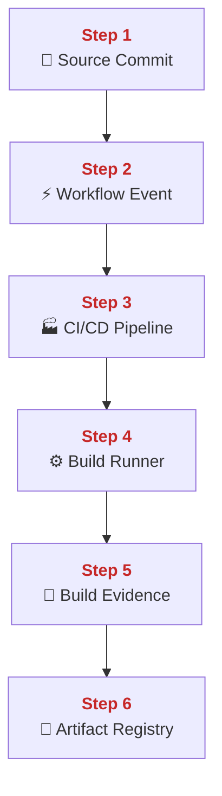
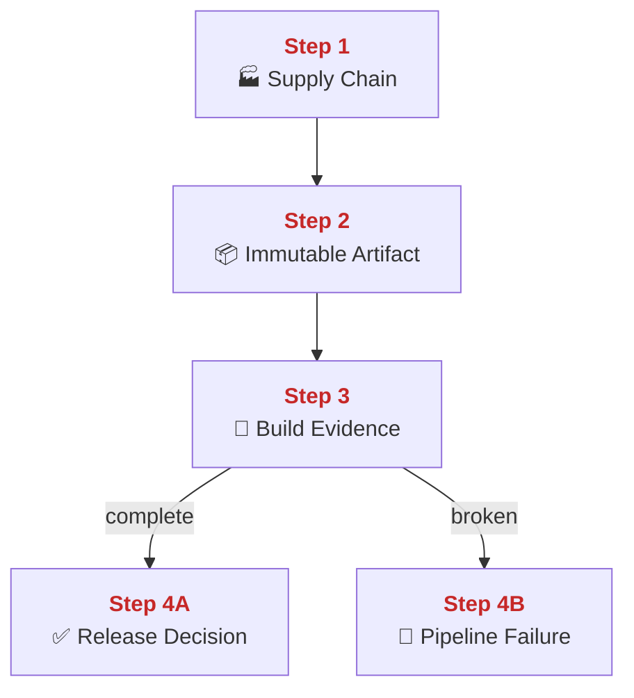
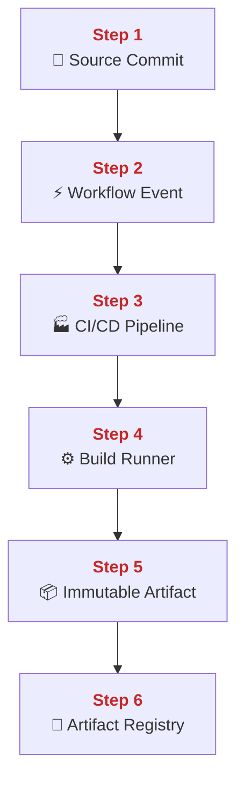
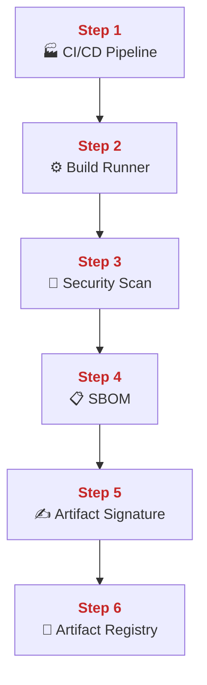
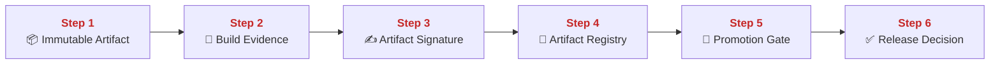
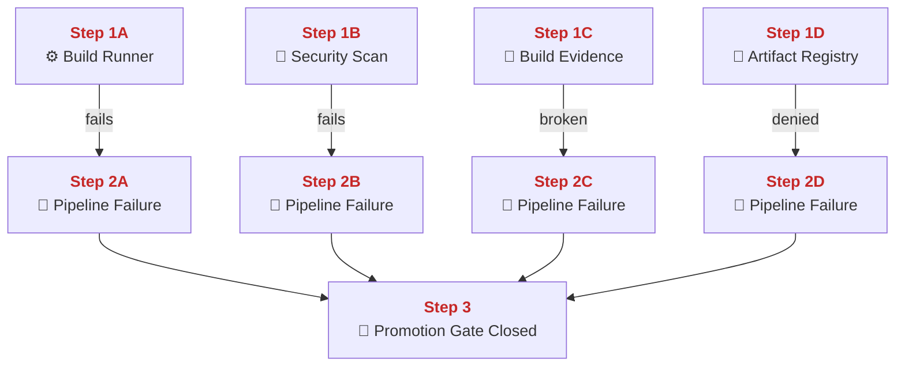
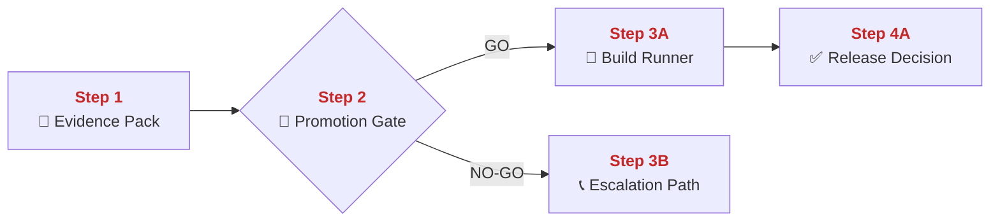
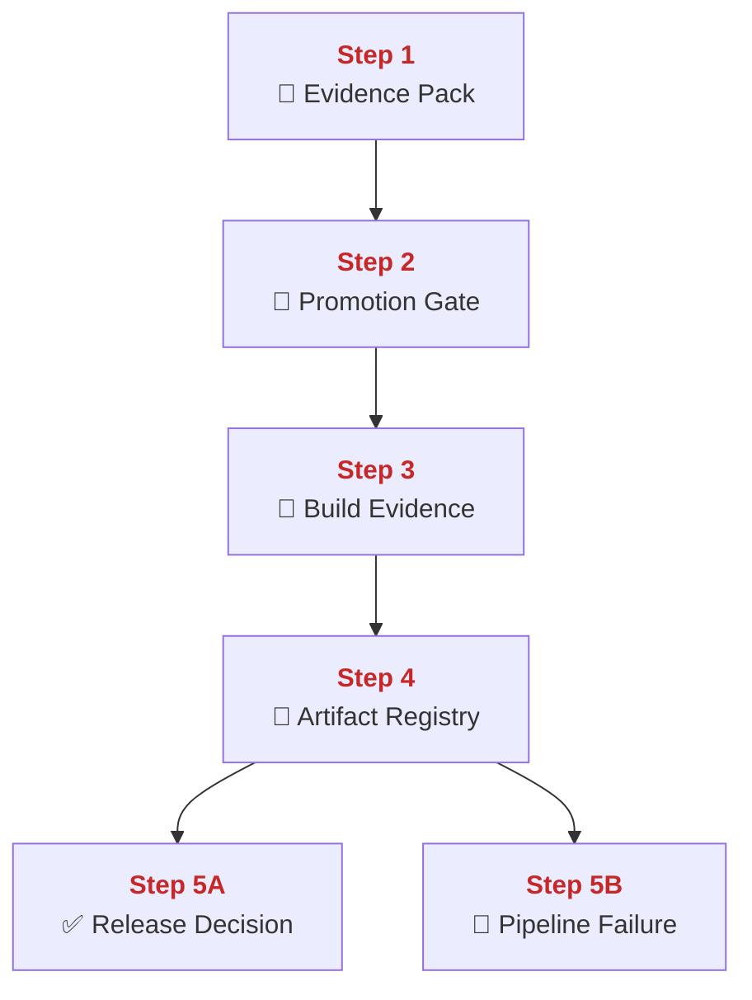

## 02 Supply Chain and CI/CD

This chapter explains how PolyMoly turns one source change into one stored release artifact with evidence.
It also explains where that path can break, how to recover safely, and how GO / NO-GO is decided before promotion.

---

## Quick Jump

- [Visual Contract Map](#visual-contract-map)
- [Vocabulary Dictionary](#vocabulary-dictionary)
- [1. Problem and Purpose](#1-problem-and-purpose)
- [2. End User Flow](#2-end-user-flow)
- [3. How It Works](#3-how-it-works)
- [4. Architectural Decision (ADR Format)](#4-architectural-decision-adr-format)
- [5. How It Fails](#5-how-it-fails)
- [6. How To Fix (Runbook Safety Standard)](#6-how-to-fix-runbook-safety-standard)
- [7. GO / NO-GO Panels](#7-go--no-go-panels)
- [8. Evidence Pack](#8-evidence-pack)
- [9. Operational Checklist](#9-operational-checklist)
- [10. CI / Quality Gate Reference](#10-ci--quality-gate-reference)
- [What Did We Learn](#what-did-we-learn)

---

## Visual Contract Map

### ADU: Verified Delivery Path

#### Technical Definition

- **[Supply Chain](#term-supply-chain)**: The full delivery path from source commit to stored release artifact.
- **[Source Commit](#term-source-commit)**: The exact Git revision that starts the build flow.
- **[Workflow Event](#term-workflow-event)**: The repository event that tells CI to start work for one change.
- **[CI/CD Pipeline](#term-ci-cd-pipeline)**: The workflow system that schedules and records build jobs.
- **[Build Runner](#term-build-runner)**: The worker process that executes one job.
- **[Build Evidence](#term-build-evidence)**: The stored proof that links commit, run, artifact digest, and scan output.
- **[Artifact Registry](#term-artifact-registry)**: The storage boundary that keeps the built artifact by digest.

#### Diagram



#### 📖 Deterministic Story

- <span style="color:#c62828"><strong>Step 1:</strong></span> A **[Source Commit](#term-source-commit)** enters the **[Supply Chain](#term-supply-chain)**.
- <span style="color:#c62828"><strong>Step 2:</strong></span> A **[Workflow Event](#term-workflow-event)** is emitted for that change.
- <span style="color:#c62828"><strong>Step 3:</strong></span> The **[CI/CD Pipeline](#term-ci-cd-pipeline)** creates a workflow run for the event.
- <span style="color:#c62828"><strong>Step 4:</strong></span> A **[Build Runner](#term-build-runner)** executes the required job steps.
- <span style="color:#c62828"><strong>Step 5:</strong></span> The run produces **[Build Evidence](#term-build-evidence)** for that exact output.
- <span style="color:#c62828"><strong>Step 6:</strong></span> The **[Artifact Registry](#term-artifact-registry)** stores the final artifact by digest.

#### 🧠 Conceptual Layer

Here is what physically happens inside the system:

Step 1 starts in Git. A developer pushes a **[Source Commit](#term-source-commit)** to the remote repository. The network action is `git push`. Git objects move over the network to the Git hosting service. On the server side, the Git service writes those objects into repository storage and updates the branch reference to the new commit SHA. In memory, the hosting platform now has branch state, actor metadata, repository metadata, and the exact commit hash that was just accepted. The first decision is simple and physical: did the remote repository accept this commit on a branch that is watched by automation. If yes, the next network action is the internal trigger path that turns this repository change into a workflow event.

Step 2 happens inside the eventing part of the source hosting platform. A **[Workflow Event](#term-workflow-event)** is created because the branch changed. The network action is an internal control-plane event from the repository service to the workflow scheduler. The scheduler reads the repository event payload. In memory, it now holds the commit SHA, branch name, repository name, actor, and event type. The decision here is whether this event matches any configured workflow trigger. If the event matches, the next network action is job scheduling for the workflow controller.

Step 3 happens in the **[CI/CD Pipeline](#term-ci-cd-pipeline)** controller. The workflow service reads `.github/workflows/ci-factory.yml` or `.github/workflows/security-supply-chain.yml` from the repository at the correct revision. It parses the jobs, builds the dependency graph, and creates one workflow run record. The network action is control traffic between the workflow scheduler and the runner fleet. In memory, the controller stores the run ID, the commit SHA, the list of pending jobs, the job dependency order, and the environment state for that run. The decision is which job may start now and which jobs must wait. If a job is ready, the next network action is dispatch to a runner.

Step 4 happens on the **[Build Runner](#term-build-runner)**. The runner opens its control connection, claims the job, checks out the exact commit, creates a workspace, and starts executing commands. In PolyMoly today that includes build and guard steps such as `docker compose --project-directory . -f system/adapters/docker/compose.yaml build --pull nginx node go`, `go run ./system/tools/poly/cmd/poly gate check hardening-core`, `bash go run ./system/tools/poly/cmd/poly security generate-sbom`, and `bash go run ./system/tools/poly/cmd/poly security scan-sbom`. Network traffic now includes repository checkout, base image pulls, container engine calls, and scanner image pulls. In memory, the runner keeps workspace paths, environment variables, temporary credentials, step logs, and current job state. The decision at this point is whether the job completed cleanly enough to produce a candidate artifact and supporting outputs. If yes, the next network action is artifact upload and registry publication.

Step 5 is **[Build Evidence](#term-build-evidence)** creation. The runner writes out the evidence that proves what just happened. In PolyMoly today that evidence is built from the workflow run record, the exact commit SHA, the built image listing, the rendered compose file in `system/gates/artifacts/ci-factory/`, the repository SBOM in `system/gates/artifacts/sbom/repository.spdx.json`, and the Grype scan result. If signing material exists, the runner can also produce an SBOM signature through `go run ./system/tools/poly/cmd/poly security sign-sbom`. The network action is artifact upload to workflow storage and optional signing calls. In memory, the runner keeps the digest, artifact paths, run ID, and signing state long enough to persist them. The decision here is whether the system has enough stored proof to connect one commit to one output. If yes, the next network action is pushing the artifact to the registry.

Step 6 happens at the **[Artifact Registry](#term-artifact-registry)**. The runner opens a registry connection, uploads layers and manifests, and the registry writes them to durable storage. In memory, the registry keeps upload session state, digest state, repository path state, and manifest assembly state until the push is complete. The final decision is whether the manifest commit succeeded and whether later systems can look up the same digest that the workflow just recorded. If yes, the verified delivery path exists end to end: one commit, one workflow run, one build runner, one evidence trail, and one stored digest.

#### 🧩 Imagine It Like

- One signed order card enters the factory ([Source Commit](#term-source-commit)).
- The alarm bell rings for that order ([Workflow Event](#term-workflow-event)) and the factory control room ([CI/CD Pipeline](#term-ci-cd-pipeline)) assigns one machine station ([Build Runner](#term-build-runner)).
- The station writes the proof folder ([Build Evidence](#term-build-evidence)) before the finished box reaches the warehouse shelf ([Artifact Registry](#term-artifact-registry)).

#### 🔎 Lemme Explain

- A release path is only trustworthy when one exact commit can be traced to one exact stored digest.
- If the evidence trail is broken, the registry contains bytes, but not a safe release input.

---

## Vocabulary Dictionary

### Technical Definition

- <a id="term-supply-chain"></a> **[Supply Chain](#term-supply-chain)**: The full delivery path from source commit to stored release artifact.
- <a id="term-source-commit"></a> **[Source Commit](https://git-scm.com/system/docs/git-commit)**: The exact Git revision that starts the build flow.
- <a id="term-workflow-event"></a> **[Workflow Event](https://docs.github.com/en/actions/writing-workflows/choosing-when-your-workflow-runs/events-that-trigger-workflows)**: The repository event that tells CI to start work for one change.
- <a id="term-ci-cd-pipeline"></a> **[CI/CD Pipeline](https://en.wikipedia.org/wiki/CI/CD)**: The workflow system that schedules and records build jobs.
- <a id="term-build-runner"></a> **[Build Runner](https://docs.github.com/en/actions/concepts/runners/about-runners)**: The worker process that executes one job.
- <a id="term-immutable-artifact"></a> **[Immutable Artifact](https://github.com/opencontainers/image-spec/blob/main/descriptor.md)**: A build output that is identified by digest instead of by a mutable tag alone.
- <a id="term-security-scan"></a> **[Security Scan](https://en.wikipedia.org/wiki/Vulnerability_assessment)**: The policy check that rejects unsafe build output or unsafe repository content.
- <a id="term-sbom"></a> **[SBOM](https://en.wikipedia.org/wiki/Software_bill_of_materials)**: The machine-readable inventory of software contents produced by the build path.
- <a id="term-build-evidence"></a> **[Build Evidence](#term-build-evidence)**: The stored proof set that links commit, workflow run, artifact digest, scan result, and evidence artifacts.
- <a id="term-artifact-signature"></a> **[Artifact Signature](https://docs.sigstore.dev/cosign/overview/)**: The cryptographic proof produced for build evidence when signing material is configured.
- <a id="term-artifact-registry"></a> **[Artifact Registry](https://en.wikipedia.org/wiki/Container_registry)**: The storage boundary that keeps the built artifact by digest.
- <a id="term-promotion-gate"></a> **[Promotion Gate](#term-promotion-gate)**: The explicit rule set that decides whether a candidate artifact may move forward.
- <a id="term-release-decision"></a> **[Release Decision](#term-release-decision)**: The final GO or NO-GO result for promotion.
- <a id="term-pipeline-failure"></a> **[Pipeline Failure](#term-pipeline-failure)**: Any condition that stops safe build, evidence creation, signing, or storage.
- <a id="term-evidence-pack"></a> **[Evidence Pack](#term-evidence-pack)**: The minimum collection of workflow, scan, signing, and registry proof used before mutation.
- <a id="term-escalation-path"></a> **[Escalation Path](#term-escalation-path)**: The responder route used when the verified delivery path cannot be restored safely by direct action.

---

## 1. Problem and Purpose

### Trust Boundary

- External entry: Source commits and workflow events enter the delivery path from Git and CI triggers.
- Protected side: Promotable digests, registry state, and release decisions remain behind verified evidence checks.
- Failure posture: If evidence, scan results, or registry state do not agree, promotion stops before release.

### ADU: Trusted Release Input

#### Technical Definition

- **[Supply Chain](#term-supply-chain)**: The full delivery path from source commit to stored release artifact.
- **[Immutable Artifact](#term-immutable-artifact)**: A build output that is identified by digest instead of by a mutable tag alone.
- **[Build Evidence](#term-build-evidence)**: The stored proof set that links commit, workflow run, artifact digest, scan result, and evidence artifacts.
- **[Release Decision](#term-release-decision)**: The final GO or NO-GO result for promotion.
- **[Pipeline Failure](#term-pipeline-failure)**: Any condition that stops safe build, evidence creation, signing, or storage.

#### Diagram



#### 📖 Deterministic Story

- <span style="color:#c62828"><strong>Step 1:</strong></span> The **[Supply Chain](#term-supply-chain)** exists to produce a trustworthy release input.
- <span style="color:#c62828"><strong>Step 2:</strong></span> The build output becomes an **[Immutable Artifact](#term-immutable-artifact)** that can be referenced by digest.
- <span style="color:#c62828"><strong>Step 3:</strong></span> **[Build Evidence](#term-build-evidence)** must connect that digest back to the exact workflow and source change.
- <span style="color:#c62828"><strong>Step 4A:</strong></span> If the evidence is complete, a **[Release Decision](#term-release-decision)** can be made safely.
- <span style="color:#c62828"><strong>Step 4B:</strong></span> If the evidence is broken, the result becomes a **[Pipeline Failure](#term-pipeline-failure)** instead of a release candidate.

#### 🧠 Conceptual Layer

Here is what physically happens inside the system:

Step 1 is the reason the **[Supply Chain](#term-supply-chain)** exists at all. PolyMoly does not treat a green workflow badge as the release object. The real object is the full path that starts with a commit and ends with a stored artifact plus proof. The network action at this stage is not yet the final registry push. It is the whole chain of repository events, workflow scheduling, runner execution, artifact upload, and evidence publication that later lets someone ask, “What exact code produced this exact digest?” In memory, different systems keep different parts of that chain: the repository keeps commit state, the workflow service keeps run state, the runner keeps execution state, and the registry keeps upload state. The decision here is architectural but concrete. The system must decide whether it will trust a release because a job looked green, or because a connected chain of stored facts exists.

Step 2 is the creation of the **[Immutable Artifact](#term-immutable-artifact)**. A runner builds something that can be named by digest. The network actions that lead here include source checkout, image layer pulls, local build engine calls, and finally digest calculation. In memory, the build engine keeps the layer graph, workspace mapping, and current build state while it works. The important decision is whether the output can be referenced in a stable way later. If the answer is yes, the system now has one exact artifact object to talk about. If the answer is no, later release talk stays vague, because no exact object exists to compare across systems.

Step 3 is **[Build Evidence](#term-build-evidence)**. This is the point where the system writes down what happened. In PolyMoly today, the evidence lives in workflow records and artifact files such as the rendered compose config, the built image list, the SBOM JSON, and the scan outputs in `system/gates/artifacts/`. The network action is upload to workflow artifact storage and optional signature generation if signing material is configured. In memory, the runner holds the commit SHA, run ID, artifact digest, evidence file paths, and scan status long enough to persist them. This is the hard fork point. If the evidence is complete and matches the digest under discussion, later systems can trust the path. If the evidence is partial, stale, or missing, then the artifact may still exist, but the trust story is broken.

Step 4A is the healthy branch. A **[Release Decision](#term-release-decision)** can happen because the release process can read one digest from the registry, read the workflow that produced it, read the evidence files attached to that workflow, and see that all of those values line up. The network actions are read-only lookups. In memory, the release path keeps the current candidate digest, the expected commit SHA, and the evidence state side by side while it compares them.

Step 4B is the broken branch. A **[Pipeline Failure](#term-pipeline-failure)** does not only mean “the build command crashed.” It also means the proof path is incomplete. If the artifact exists but the evidence is wrong, promotion becomes unsafe because the system cannot prove what it is about to ship. That is why this chapter matters. The goal is not only automation. The goal is a release input that is mechanically traceable and therefore safe to approve.

#### 🧩 Imagine It Like

- The factory line ([Supply Chain](#term-supply-chain)) makes one sealed box ([Immutable Artifact](#term-immutable-artifact)).
- The paperwork folder ([Build Evidence](#term-build-evidence)) must follow the same box.
- If the folder matches, the shipping clerk can approve the truck ([Release Decision](#term-release-decision)).
- If the folder is missing, the truck becomes a blocked shipment ([Pipeline Failure](#term-pipeline-failure)).

#### 🔎 Lemme Explain

- The build result is not enough by itself. The release decision depends on stored proof that matches the digest.
- If evidence breaks, promotion must stop even when the build command itself succeeded.

---

## 2. End User Flow

### ADU: Commit To Registry Flow

#### Technical Definition

- **[Source Commit](#term-source-commit)**: The exact Git revision that starts the build flow.
- **[Workflow Event](#term-workflow-event)**: The repository event that tells CI to start work for one change.
- **[CI/CD Pipeline](#term-ci-cd-pipeline)**: The workflow system that schedules and records build jobs.
- **[Build Runner](#term-build-runner)**: The worker process that executes one job.
- **[Immutable Artifact](#term-immutable-artifact)**: A build output that is identified by digest instead of by a mutable tag alone.
- **[Artifact Registry](#term-artifact-registry)**: The storage boundary that keeps the built artifact by digest.

#### Diagram



#### 📖 Deterministic Story

- <span style="color:#c62828"><strong>Step 1:</strong></span> A **[Source Commit](#term-source-commit)** lands on a tracked branch.
- <span style="color:#c62828"><strong>Step 2:</strong></span> A **[Workflow Event](#term-workflow-event)** is emitted for that branch change.
- <span style="color:#c62828"><strong>Step 3:</strong></span> The **[CI/CD Pipeline](#term-ci-cd-pipeline)** creates a workflow run.
- <span style="color:#c62828"><strong>Step 4:</strong></span> A **[Build Runner](#term-build-runner)** executes the job for that run.
- <span style="color:#c62828"><strong>Step 5:</strong></span> The job produces an **[Immutable Artifact](#term-immutable-artifact)**.
- <span style="color:#c62828"><strong>Step 6:</strong></span> The **[Artifact Registry](#term-artifact-registry)** stores the artifact by digest.

#### 🧠 Conceptual Layer

Here is what physically happens inside the system:

Step 1 begins when a developer pushes a **[Source Commit](#term-source-commit)** to the repository. The network action is Git transport from the local machine to the remote Git service. The server writes the objects to repository storage and moves the branch pointer to the new SHA. In memory, the Git hosting platform keeps branch state, commit metadata, and event metadata for that exact change. The first decision is whether this branch and this repository are configured to trigger CI. If yes, the next network action is event delivery to the workflow layer.

Step 2 is the **[Workflow Event](#term-workflow-event)**. The repository host creates a push or pull request event and hands it to the workflow service. The network action is control-plane delivery inside the hosting platform. In memory, the event payload now contains the repository name, branch, commit SHA, actor, and trigger type. The decision here is whether the event matches one of the configured workflow trigger rules. If it does, the next network action is workflow scheduling.

Step 3 happens inside the **[CI/CD Pipeline](#term-ci-cd-pipeline)** controller. The controller reads the workflow YAML from the repository, parses the job graph, and writes one workflow run record. The network action is scheduling traffic from the workflow controller to the runner fleet. In memory, the controller keeps the run ID, the commit SHA, job dependency state, queued job state, and current run status. The decision is which job is ready to start now and which jobs must wait for earlier checks. Once a job is ready, the next network action is dispatch to a worker.

Step 4 happens on the **[Build Runner](#term-build-runner)**. The runner accepts the job, opens its workspace, checks out the exact source revision, and begins executing commands. In PolyMoly, that includes real commands from the repo workflow, such as lint or hardening checks in `ci-factory.yml`, then image builds, SBOM generation, or Grype scanning in the security workflow. The network actions now include repository checkout, container engine calls, base image downloads, and scanner image execution. In memory, the runner keeps the workspace tree, execution logs, temporary tokens, and current job state. The decision here is whether the job completes in a clean state or stops with failure before the build output is ready. If it completes, the next network action is artifact publication.

Step 5 is artifact creation. The build runner or build engine produces an **[Immutable Artifact](#term-immutable-artifact)** and computes a digest for it. The network actions include manifest assembly and possibly push preparation. In memory, the build engine keeps layer state, build cache state, and the mapping between input files and output layers. The decision is whether the artifact is complete enough to be stored and later referenced by digest. If the answer is yes, the next network action is a push to the registry.

Step 6 happens at the **[Artifact Registry](#term-artifact-registry)**. The runner opens a session to the registry, uploads layers, uploads the manifest, and finalizes the digest-addressed object. The registry keeps upload session state and manifest state in memory until commit is complete, then writes the final result to durable storage. The decision here is whether the registry accepted the upload cleanly. If yes, the commit-to-registry path is complete and later promotion logic can inspect that exact digest.

#### 🧩 Imagine It Like

- One order card enters the system ([Source Commit](#term-source-commit)).
- The bell rings for that order ([Workflow Event](#term-workflow-event)) and the factory controller ([CI/CD Pipeline](#term-ci-cd-pipeline)) sends it to one station ([Build Runner](#term-build-runner)).
- The finished box ([Immutable Artifact](#term-immutable-artifact)) reaches the warehouse shelf ([Artifact Registry](#term-artifact-registry)).

#### 🔎 Lemme Explain

- This flow matters because one exact commit must map to one exact stored digest.
- If the mapping is fuzzy, rollback and promotion both become guesswork.

---

## 3. How It Works

### ADU: Build, Scan, Evidence, Publish

#### Technical Definition

- **[CI/CD Pipeline](#term-ci-cd-pipeline)**: The workflow system that schedules and records build jobs.
- **[Build Runner](#term-build-runner)**: The worker process that executes one job.
- **[Security Scan](#term-security-scan)**: The policy check that rejects unsafe build output or unsafe repository content.
- **[SBOM](#term-sbom)**: The machine-readable inventory of software contents produced by the build path.
- **[Artifact Signature](#term-artifact-signature)**: The cryptographic proof produced for build evidence when signing material is configured.
- **[Artifact Registry](#term-artifact-registry)**: The storage boundary that keeps the built artifact by digest.

#### Diagram



#### 📖 Deterministic Story

- <span style="color:#c62828"><strong>Step 1:</strong></span> The **[CI/CD Pipeline](#term-ci-cd-pipeline)** starts the verified build path.
- <span style="color:#c62828"><strong>Step 2:</strong></span> The **[Build Runner](#term-build-runner)** performs checkout, build, and job execution work.
- <span style="color:#c62828"><strong>Step 3:</strong></span> A **[Security Scan](#term-security-scan)** checks the result before it is trusted.
- <span style="color:#c62828"><strong>Step 4:</strong></span> The workflow writes an **[SBOM](#term-sbom)** for the repository or build scope.
- <span style="color:#c62828"><strong>Step 5:</strong></span> The **[Artifact Signature](#term-artifact-signature)** path adds cryptographic proof when signing keys are configured.
- <span style="color:#c62828"><strong>Step 6:</strong></span> The **[Artifact Registry](#term-artifact-registry)** receives the publishable output only after the earlier checks are complete.

#### 🧠 Conceptual Layer

Here is what physically happens inside the system:

Step 1 starts in the **[CI/CD Pipeline](#term-ci-cd-pipeline)** controller. The workflow run already exists, and the controller decides which job should execute now. The network action is job dispatch over the workflow control plane. In memory, the controller keeps the run graph, current job states, commit SHA, and dependency order for the run. The decision is whether the build path is allowed to continue from queued state to running state. If yes, the next network action is assignment to a runner.

Step 2 happens on the **[Build Runner](#term-build-runner)**. The runner claims the job, checks out the exact revision, creates the working directory, and runs the actual commands. In PolyMoly today this includes workflow steps like `task lint:all`, `go run ./system/tools/poly/cmd/poly gate check hardening-core`, and `docker compose --project-directory . -f system/adapters/docker/compose.yaml build --pull nginx node go`. The network actions include repository checkout, base image pulls, docker engine calls, and local log streaming back to the CI platform. In memory, the runner keeps the workspace tree, current shell environment, step logs, and temporary credentials for the job. The decision here is whether the build stage completes with a usable output. If not, the flow stops before any evidence is trusted. If yes, the next network action is scan execution.

Step 3 is the **[Security Scan](#term-security-scan)** stage. The runner now executes policy checks against the repository or generated evidence. In the security workflow this includes Trivy for critical issues and Grype against the SBOM output. The network actions include scanner container execution, filesystem reads, and vulnerability database access inside the scanner image. In memory, the scanner keeps the current findings, the severity thresholds, and the input under inspection. This is a hard fork point. If the scan result crosses the blocking threshold, the flow stops even though a build may already exist. If the result is clean enough, the next network action is evidence generation and upload.

Step 4 is **[SBOM](#term-sbom)** creation. The runner uses `go run ./system/tools/poly/cmd/poly security generate-sbom` to write `system/gates/artifacts/sbom/repository.spdx.json` and optionally image SBOM files when configured. The network action is a Syft container reading the repository or image contents and writing JSON artifacts back into the workspace and then into workflow artifact storage. In memory, the SBOM generator keeps package inventories, file metadata, and document assembly state until the SPDX JSON is complete. The decision is whether the evidence file was generated cleanly and is available for later inspection. If yes, the next network action is optional signing and then artifact upload.

Step 5 is the **[Artifact Signature](#term-artifact-signature)** path. This step is conditional in PolyMoly today. If `COSIGN_PRIVATE_KEY` is configured in the workflow, the runner installs cosign and signs the SBOM file. The network action is the signing process writing `.sig` and `.pem` files and then uploading them as workflow artifacts. In memory, the runner keeps the SBOM path, signing key path, signature payload, and certificate output state long enough to persist them. The decision here is whether signed evidence exists for environments that require it. If signing keys are absent, the system can still keep unsigned evidence, but the promotion gate for a signed-required release must stay closed. Once the signing state is known, the next network action is registry publication or release evaluation.

Step 6 happens at the **[Artifact Registry](#term-artifact-registry)**. The runner opens the registry session, uploads the blobs and manifest, and the registry writes them into durable storage under the final digest. In memory, the registry keeps the upload session, manifest assembly, repository path, and digest state until the push is complete. The decision is whether the registry committed the artifact cleanly and whether the digest visible in storage is the same digest referenced by the workflow evidence. If yes, the build, scan, evidence, and publish path is complete in a form that later promotion logic can inspect.

#### 🧩 Imagine It Like

- The control room ([CI/CD Pipeline](#term-ci-cd-pipeline)) starts one machine station ([Build Runner](#term-build-runner)).
- The product goes through the safety machine ([Security Scan](#term-security-scan)) and gets its parts list ([SBOM](#term-sbom)).
- If the seal station is active ([Artifact Signature](#term-artifact-signature)), it adds a seal before the warehouse shelf accepts the box ([Artifact Registry](#term-artifact-registry)).

#### 🔎 Lemme Explain

- A fast build is not enough. The path must also prove what was built and whether it passed policy.
- Publication is the last step in trust, not the first proof of success.

---

## 4. Architectural Decision (ADR Format)

### ADU: Registry As Promotion Boundary

#### Technical Definition

- **[Immutable Artifact](#term-immutable-artifact)**: A build output that is identified by digest instead of by a mutable tag alone.
- **[Build Evidence](#term-build-evidence)**: The stored proof set that links commit, workflow run, artifact digest, scan result, and evidence artifacts.
- **[Artifact Signature](#term-artifact-signature)**: The cryptographic proof produced for build evidence when signing material is configured.
- **[Artifact Registry](#term-artifact-registry)**: The storage boundary that keeps the built artifact by digest.
- **[Promotion Gate](#term-promotion-gate)**: The explicit rule set that decides whether a candidate artifact may move forward.
- **[Release Decision](#term-release-decision)**: The final GO or NO-GO result for promotion.

#### Diagram



#### 📖 Deterministic Story

- <span style="color:#c62828"><strong>Step 1:</strong></span> An **[Immutable Artifact](#term-immutable-artifact)** exists before promotion is discussed.
- <span style="color:#c62828"><strong>Step 2:</strong></span> **[Build Evidence](#term-build-evidence)** connects that artifact to the exact workflow and commit.
- <span style="color:#c62828"><strong>Step 3:</strong></span> The **[Artifact Signature](#term-artifact-signature)** path adds or checks cryptographic proof when signing is required.
- <span style="color:#c62828"><strong>Step 4:</strong></span> The **[Artifact Registry](#term-artifact-registry)** stores the candidate artifact by digest.
- <span style="color:#c62828"><strong>Step 5:</strong></span> The **[Promotion Gate](#term-promotion-gate)** checks whether the candidate is allowed to move forward.
- <span style="color:#c62828"><strong>Step 6:</strong></span> The **[Release Decision](#term-release-decision)** is made only after those checks line up.

#### 🧠 Conceptual Layer

Here is what physically happens inside the system:

Step 1 means there is already one **[Immutable Artifact](#term-immutable-artifact)** identified by digest. The system does not reason about release using a branch name alone or a human memory of “the last green run.” The network action here is usually read-only lookup of the artifact digest and repository location. In memory, the release process keeps that digest as the exact object under review. The first decision is whether the thing being discussed is a stable object that can be looked up again later. If not, the rest of release control is already weak.

Step 2 is **[Build Evidence](#term-build-evidence)** lookup. The release path reads the workflow run that built the artifact, the evidence artifacts uploaded by that run, and the scan outputs linked to the same execution. The network actions are read-only GitHub Actions API calls and artifact storage reads. In memory, the release process now keeps the candidate digest, the expected commit SHA, the run ID, and the evidence file references. The decision is whether those values all point to the same candidate object. If they do, the next network action is signature state verification when required.

Step 3 is the **[Artifact Signature](#term-artifact-signature)** check. In PolyMoly today, this path is conditional because signing happens only when the workflow has key material. The network action is reading `.sig` and `.pem` outputs or verifying their existence for the candidate evidence file. In memory, the release logic keeps the expected evidence path, the signature state, and the policy requirement for the target environment. This is a hard fork point. If the environment requires signed evidence and the signature path is missing or broken, the gate must stay closed even if the artifact and evidence files exist. If the policy does not require a signature, or the signature verifies correctly, the next network action is registry validation.

Step 4 treats the **[Artifact Registry](#term-artifact-registry)** as the promotion boundary. The registry is not just passive storage. It is the place from which later environments consume the artifact. The network action is registry inspection by digest. In memory, the release path keeps repository path, digest, and evidence state together while it confirms that the candidate object visible in the registry is the same object described by the workflow evidence. The decision is whether the candidate is present, intact, and identical to the object previously checked.

Step 5 is the **[Promotion Gate](#term-promotion-gate)**. There is no magic gate service hidden behind this term. The gate is the policy plus the human or automation applying it. The network actions are still read-only. The system checks workflow status, hardening state, scan state, signature state, and registry state. In memory, the release process keeps a pass or fail state for each required check. This is why the gate is practical, not philosophical. It is one decision table built from stored facts.

Step 6 is the **[Release Decision](#term-release-decision)**. Only now can the system say GO or NO-GO. This decision is why this architecture uses the registry as the promotion boundary. If the pipeline later fails, the dashboards and alerts that matter are `pipeline-metrics`, `pipeline-failure-rate`, and `registry-space-low`, because those signals tell responders whether the candidate path failed during build, evidence generation, or storage. The release process needs those observability anchors because the boundary owns the risk. A missing artifact, broken evidence, or missing signature all stop promotion for different mechanical reasons, and this boundary is where that difference becomes visible.

#### 🧩 Imagine It Like

- One sealed box ([Immutable Artifact](#term-immutable-artifact)) is matched to its paperwork folder ([Build Evidence](#term-build-evidence)).
- The seal check ([Artifact Signature](#term-artifact-signature)) happens before the warehouse shelf ([Artifact Registry](#term-artifact-registry)) is treated as the shipping source.
- The shipping desk ([Promotion Gate](#term-promotion-gate)) decides whether that box becomes an approved shipment ([Release Decision](#term-release-decision)).

#### 🔎 Lemme Explain

- Stored does not mean approved. The registry is where a candidate waits to be evaluated, not where release is assumed.
- This boundary also forces observability to be explicit, because the release decision depends on evidence, storage, and policy signals together.

---

## 5. How It Fails

### ADU: Pipeline Failure Modes

#### Technical Definition

- **[Build Runner](#term-build-runner)**: The worker process that executes one job.
- **[Security Scan](#term-security-scan)**: The policy check that rejects unsafe build output or unsafe repository content.
- **[Build Evidence](#term-build-evidence)**: The stored proof set that links commit, workflow run, artifact digest, scan result, and evidence artifacts.
- **[Artifact Registry](#term-artifact-registry)**: The storage boundary that keeps the built artifact by digest.
- **[Promotion Gate](#term-promotion-gate)**: The explicit rule set that decides whether a candidate artifact may move forward.
- **[Pipeline Failure](#term-pipeline-failure)**: Any condition that stops safe build, evidence creation, signing, or storage.

#### Diagram



#### 📖 Deterministic Story

- <span style="color:#c62828"><strong>Step 1A:</strong></span> A **[Build Runner](#term-build-runner)** failure stops the job before a safe output exists.
- <span style="color:#c62828"><strong>Step 1B:</strong></span> A **[Security Scan](#term-security-scan)** failure stops trust even if a build output exists.
- <span style="color:#c62828"><strong>Step 1C:</strong></span> Broken **[Build Evidence](#term-build-evidence)** stops promotion even when the artifact exists.
- <span style="color:#c62828"><strong>Step 1D:</strong></span> An **[Artifact Registry](#term-artifact-registry)** failure stops storage even after earlier checks passed.
- <span style="color:#c62828"><strong>Step 3:</strong></span> Any of these conditions becomes a **[Pipeline Failure](#term-pipeline-failure)** and keeps the **[Promotion Gate](#term-promotion-gate)** closed.

#### 🧠 Conceptual Layer

Here is what physically happens inside the system:

Step 1A is **[Build Runner](#term-build-runner)** failure. The runner claims the job, starts work, and then exits early, loses disk, loses credentials, or fails a command. The network actions up to that point can include repository checkout, base image pulls, and docker engine traffic. In memory, the runner had workspace state, environment state, and step logs, but no clean completed output state. The decision is simple: there is no trustworthy candidate yet. The next network action is not publication. It is failure reporting back to the CI controller.

Step 2A is the resulting **[Pipeline Failure](#term-pipeline-failure)** state for this branch. The workflow controller records the job as failed, and the gate stays closed because the path stopped before clean build completion. The important detail is timing. This failure happened before later trust stages had a chance to run.

Step 1B is **[Security Scan](#term-security-scan)** failure. Here the runner finished enough work to produce a candidate output or evidence file, but the scanner found a blocking issue. The network actions include scanner execution against repository content or SBOM input, plus any vulnerability database lookups the scanner performs. In memory, the scanner keeps findings, severity counts, and fail thresholds. The decision is whether policy allows the candidate to continue. If the answer is no, the next network action is failure reporting, not registry push.

Step 2B is again **[Pipeline Failure](#term-pipeline-failure)**, but it happens later than runner failure. The artifact may exist temporarily, yet it is still unsafe to promote. This is why “a build exists” is weaker than “a safe artifact exists.”

Step 1C is broken **[Build Evidence](#term-build-evidence)**. The build may succeed and the scan may even pass, but the proof set can still be incomplete. A run artifact can be missing. The SBOM can fail to generate. The signing step can be required by policy but absent because no key was configured. The network actions are evidence upload, artifact reads, and optional signing operations. In memory, the pipeline keeps run ID, digest, file paths, and signature state. The decision is whether the candidate can still be traced and checked later. If the answer is no, the next network action is again failure reporting, not release approval.

Step 2C is the failure state for evidence problems. This class is especially dangerous because it can fool people. Something was built. Something may even be stored. But the proof chain is broken, so promotion must still stop.

Step 1D is **[Artifact Registry](#term-artifact-registry)** failure. The runner has a candidate and tries to push it, but authentication fails, storage is full, or the manifest commit is rejected. The network action is the registry push itself. In memory, both the runner and the registry keep upload session state while the push is active. The decision is whether the manifest commit completed. If not, the next network action is the error return to the runner and the workflow failure update.

Step 2D is the failure state for storage problems. The earlier stages may be good, but the system still has no trustworthy stored object for later environments.

Step 3 explains why the **[Promotion Gate](#term-promotion-gate)** stays closed for all of these branches. They happen at different times, use different state, and need different fixes. Runner failure means no stable build. Scan failure means unsafe build. Evidence failure means untrusted build. Registry failure means unstored build. They are all red, but they are not the same red.

#### 🧩 Imagine It Like

- The machine station can stop before the box exists ([Build Runner](#term-build-runner)).
- The safety station can reject the box ([Security Scan](#term-security-scan)).
- The paperwork folder can break even if the box is real ([Build Evidence](#term-build-evidence)).
- The warehouse shelf can still refuse the box ([Artifact Registry](#term-artifact-registry)), so the shipping desk stays closed ([Promotion Gate](#term-promotion-gate)).

#### 🔎 Lemme Explain

- Different pipeline failures happen at different times and need different recovery actions.
- “CI is red” is not enough information for safe incident handling.

| Symptom | Root Cause | Severity | Fastest confirmation step |
| :--- | :--- | :--- | :--- |
| Build job exits before image list is written | **[Build Runner](#term-build-runner)** failure | Sev-2 | `gh run view "$RUN_ID" --log-failed` |
| Trivy or Grype blocks the run | **[Security Scan](#term-security-scan)** failure | Sev-1 | `gh run view "$RUN_ID" --log-failed` |
| SBOM or signature files are missing | **[Build Evidence](#term-build-evidence)** failure | Sev-1 | `ls -1 system/gates/artifacts/sbom/` |
| Digest cannot be inspected in registry | **[Artifact Registry](#term-artifact-registry)** failure | Sev-1 | `docker buildx imagetools inspect "$IMAGE_REF"` |

---

## 6. How To Fix (Runbook Safety Standard)

### ADU: Restore The Verified Path

#### Technical Definition

- **[Evidence Pack](#term-evidence-pack)**: The minimum collection of workflow, scan, signing, and registry proof used before mutation.
- **[Promotion Gate](#term-promotion-gate)**: The explicit rule set that decides whether a candidate artifact may move forward.
- **[Build Runner](#term-build-runner)**: The worker process that executes one job.
- **[Artifact Registry](#term-artifact-registry)**: The storage boundary that keeps the built artifact by digest.
- **[Release Decision](#term-release-decision)**: The final GO or NO-GO result for promotion.
- **[Escalation Path](#term-escalation-path)**: The responder route used when the verified delivery path cannot be restored safely by direct action.

#### Diagram



#### 📖 Deterministic Story

- <span style="color:#c62828"><strong>Step 1:</strong></span> The **[Evidence Pack](#term-evidence-pack)** is collected before any rerun or release action starts.
- <span style="color:#c62828"><strong>Step 2:</strong></span> The **[Promotion Gate](#term-promotion-gate)** decides whether direct mutation is safe.
- <span style="color:#c62828"><strong>Step 3A:</strong></span> If the gate is GO, the operator restores the path by rerunning the failed workflow or failed job on a **[Build Runner](#term-build-runner)**.
- <span style="color:#c62828"><strong>Step 4A:</strong></span> A fresh **[Release Decision](#term-release-decision)** is made only after verification succeeds.
- <span style="color:#c62828"><strong>Step 3B:</strong></span> If the gate is NO-GO, the operator uses the **[Escalation Path](#term-escalation-path)** instead of forcing promotion.

#### 🧠 Conceptual Layer

Here is what physically happens inside the system:

Step 1 is evidence collection. The responder starts with read-only checks, not reruns. The network actions are GitHub Actions API reads, artifact storage reads, registry inspection, and local reads of generated evidence such as `system/gates/artifacts/sbom/repository.spdx.json`. In memory, the operator shell and CLI tools now hold the failing run ID, the commit SHA, the candidate digest, the failed job name, and the current evidence state. The decision is whether the responder knows exactly which stage failed and whether the current candidate is still the same object discussed by the workflow. If the answer is no, mutation would be blind and unsafe. If the answer is yes, the next network action is gate evaluation.

Step 2 is the **[Promotion Gate](#term-promotion-gate)**. There is no separate gate daemon doing magic here. The gate is a rule set plus the human or automation applying it. The network actions are still read-only: workflow status reads, log reads, signature-state reads, and registry inspection. In memory, the responder compares the evidence bundle against the safe conditions for rerun. Was the failure mechanical and isolated. Was it a policy failure that should not be bypassed. Is the candidate digest already stored. Is a signature required for this environment. This is the main fork point. If the issue is local, reproducible, and safe to rerun, the next network action is a rerun request. If not, the next network action must be escalation.

Step 3A is the GO branch. The responder calls the workflow control plane to rerun the failed job or workflow. The network action is `gh run rerun "$RUN_ID" --failed` or another explicit workflow dispatch. The **[Build Runner](#term-build-runner)** then receives a new job, creates a new workspace, and repeats the build path. In memory, the CI platform keeps a fresh run state while the old failed run remains available for comparison. The decision is whether the rerun now produced the missing build, evidence, or registry state without changing the safety contract. The next network action is verification of the new run and the candidate digest.

Step 4A is verification and the new **[Release Decision](#term-release-decision)**. The responder reads the new run status, confirms that the expected evidence files exist, confirms that the scan outcome is clean enough, and confirms that the **[Artifact Registry](#term-artifact-registry)** can now inspect the expected digest. The network actions are again read-only API calls and registry reads. In memory, the responder compares old failed state and new successful state side by side. If the verified path is now complete, the gate may reopen for release. If it is still incomplete, the release stays blocked.

Step 3B is the NO-GO branch. The responder does not force a green pipeline. The next network action becomes page, handoff, or deeper incident routing through the **[Escalation Path](#term-escalation-path)**. In memory, the release state stays blocked and visible. This is what keeps a supply-chain incident from becoming a release integrity incident. The real recovery goal is not “make the badge green.” The real goal is “restore the verified path.”

#### 🧩 Imagine It Like

- You collect the broken order, the scan printout, the paperwork folder, and the shelf record into one folder ([Evidence Pack](#term-evidence-pack)).
- The shipping desk ([Promotion Gate](#term-promotion-gate)) decides whether the line can safely rerun one station ([Build Runner](#term-build-runner)) or whether the case goes to the next responder route ([Escalation Path](#term-escalation-path)).
- Only after the new paperwork matches the box does the shipment become reviewable again ([Release Decision](#term-release-decision)).

#### 🔎 Lemme Explain

- This runbook restores the verified path, not just the green badge.
- If the evidence stays incomplete after rerun, the only correct state is still NO-GO.

### Exact Runbook Commands

```bash
# Replace placeholders before running
export RUN_ID="<failed-run-id>"
export IMAGE_REF="<registry>/<repo>@sha256:<digest>"

# Read-only checks
gh run view "$RUN_ID" --json conclusion,jobs,headSha,url
gh run view "$RUN_ID" --log-failed
go run ./system/tools/poly/cmd/poly gate check hardening-core
task security:sbom
task security:scan-sbom
docker buildx imagetools inspect "$IMAGE_REF"
ls -1 system/gates/artifacts/sbom/
```

```bash
# Mutation (only after Evidence Pack is captured and Promotion Gate is GO)
gh run rerun "$RUN_ID" --failed
```

```bash
# Verify
gh run view "$RUN_ID" --json conclusion,jobs,headSha,url
test -f system/gates/artifacts/sbom/repository.spdx.json
test -f system/gates/artifacts/ci-factory/built-images.txt
docker buildx imagetools inspect "$IMAGE_REF"
```

Rollback rule:
- Keep the current released digest pinned.
- Do not promote the candidate digest while the Promotion Gate is NO-GO.

---

## 7. GO / NO-GO Panels

### Rollout Decision Matrix

| Signal | Canary Rule | Roll Forward | Rollback Trigger |
| :--- | :--- | :--- | :--- |
| Verified digest, SBOM, provenance, and scan state all match | Promote one candidate digest to stage first and keep prod pinned to the previous digest until the stage pull and smoke path are green | Advance the same digest to the next environment only after the stage proof bundle stays consistent | Digest mismatch, missing evidence, failing smoke, or new blocking scan result |
| Registry pull and promoted runtime smoke are green | Expand from one canary deployment slice or one stage instance to the broader target ring | Continue only when the same digest stays healthy across repeated health windows | Any failed health window, registry pull regression, or rollback proof mismatch |
| Manual release review agrees with the evidence bundle | Approve the next promotion step only after the canary evidence bundle is complete and reviewable | Keep rolling forward while the same digest and evidence namespace stay unchanged | Reviewer cannot prove what is being shipped or the evidence bundle becomes incomplete |

### ADU: Promotion Gate Decision

#### Technical Definition

- **[Evidence Pack](#term-evidence-pack)**: The minimum collection of workflow, scan, signing, and registry proof used before mutation.
- **[Promotion Gate](#term-promotion-gate)**: The explicit rule set that decides whether a candidate artifact may move forward.
- **[Build Evidence](#term-build-evidence)**: The stored proof set that links commit, workflow run, artifact digest, scan result, and evidence artifacts.
- **[Artifact Registry](#term-artifact-registry)**: The storage boundary that keeps the built artifact by digest.
- **[Release Decision](#term-release-decision)**: The final GO or NO-GO result for promotion.
- **[Pipeline Failure](#term-pipeline-failure)**: Any condition that stops safe build, evidence creation, signing, or storage.

#### Diagram



#### 📖 Deterministic Story

- <span style="color:#c62828"><strong>Step 1:</strong></span> The **[Evidence Pack](#term-evidence-pack)** enters the decision flow.
- <span style="color:#c62828"><strong>Step 2:</strong></span> The **[Promotion Gate](#term-promotion-gate)** starts the GO / NO-GO evaluation.
- <span style="color:#c62828"><strong>Step 3:</strong></span> The gate checks **[Build Evidence](#term-build-evidence)** for the candidate.
- <span style="color:#c62828"><strong>Step 4:</strong></span> The gate checks the candidate state in the **[Artifact Registry](#term-artifact-registry)**.
- <span style="color:#c62828"><strong>Step 5A:</strong></span> If the checks agree, the **[Release Decision](#term-release-decision)** may remain GO.
- <span style="color:#c62828"><strong>Step 5B:</strong></span> If the checks break, the result remains a **[Pipeline Failure](#term-pipeline-failure)**.

#### 🧠 Conceptual Layer

Here is what physically happens inside the system:

Step 1 begins with the **[Evidence Pack](#term-evidence-pack)** already assembled. The network actions are read-only calls into the workflow system, reads of the stored SBOM and scan outputs, optional reads of signature files, and read-only registry inspection. In memory, the responder now has one candidate digest, one commit SHA, one run ID, and one current set of supporting evidence. The first decision is whether the decision bundle is complete enough to evaluate at all. If key evidence is still missing, the next safe state is already NO-GO.

Step 2 is the **[Promotion Gate](#term-promotion-gate)**. Again, this is not a secret service running somewhere else. It is the policy plus the human or automation applying it. The network actions remain read-only. In memory, the release logic holds one pass or fail slot for each requirement: workflow success, hardening result, scan result, evidence presence, signature state when required, and registry visibility. The decision here is whether the candidate should even be considered a release input. If the answer is yes, the next network action is direct evidence checking against the stored candidate.

Step 3 is the **[Build Evidence](#term-build-evidence)** check. The release path reads the run that built the candidate and the artifacts that prove what happened in that run. The network actions are workflow artifact reads and local inspection of the generated files. In memory, the gate compares the candidate digest, the commit SHA, the run metadata, and the presence of required evidence files. This is the first hard fork. If the values do not line up, the next safe action is NO-GO, because the system cannot prove what artifact is under review.

Step 4 is the **[Artifact Registry](#term-artifact-registry)** check. The release path looks up the candidate digest in storage and confirms that the object is really present where later environments will pull it from. The network action is registry inspection by digest. In memory, the gate now compares the registry digest with the digest already validated in the evidence bundle. This is the second hard fork. If the registry does not contain the expected object, or contains a different object than the one referenced by the evidence, the candidate is not promotion-safe.

Step 5A is the GO branch. The **[Release Decision](#term-release-decision)** may remain GO because evidence and storage agree on the same candidate object. Step 5B is the NO-GO branch. The state remains **[Pipeline Failure](#term-pipeline-failure)** because one proof path is missing, broken, or mismatched. That is the real meaning of the gate. It stops unsafe release when the stored object and the stored proof no longer tell the same story.

#### 🧩 Imagine It Like

- You bring one proof folder to the shipping desk ([Evidence Pack](#term-evidence-pack)).
- The desk ([Promotion Gate](#term-promotion-gate)) reads the paperwork ([Build Evidence](#term-build-evidence)) and then checks the exact box on the warehouse shelf ([Artifact Registry](#term-artifact-registry)).
- If both agree, the shipment can be approved ([Release Decision](#term-release-decision)).
- If they disagree, it stays a blocked shipment ([Pipeline Failure](#term-pipeline-failure)).

#### 🔎 Lemme Explain

- “Build passed” is weaker than “proof and storage match.”
- The gate exists to block promotion when those two states diverge.

---

## 8. Evidence Pack

Collect before mutation:

- Failed workflow URL and exact failed job or step.
- Commit SHA and branch under investigation.
- Candidate artifact digest under investigation.
- Hardening result for the same repository state.
- SBOM path and Grype outcome for the same candidate.
- Signature state for environments that require signed evidence.
- Registry inspection result for the candidate digest.

---

## 9. Operational Checklist

- [ ] Failing run ID is captured.
- [ ] Commit SHA and candidate digest are linked in incident notes.
- [ ] Hardening result is checked before rerun.
- [ ] SBOM and scan outputs are present for the candidate.
- [ ] Signature requirement is evaluated before promotion.
- [ ] Registry inspection matches the candidate digest.
- [ ] Promotion stayed blocked while evidence was incomplete.
- [ ] Escalation owner is known before forcing deeper action.

---

## 10. CI / Quality Gate Reference

Run:

```bash
task docs:governance
task docs:governance:strict
go run ./system/tools/poly/cmd/poly gate check hardening-core
task security:images
task security:sbom
task security:scan-sbom
# Optional when signing material exists
task security:sign-sbom
```

Related workflows and evidence:

- `.github/workflows/ci-factory.yml`
- `.github/workflows/security-supply-chain.yml`
- `system/gates/artifacts/ci-factory/*`
- `system/gates/artifacts/sbom/*`
- `system/gates/artifacts/docs-governance/checks.tsv`
- `system/gates/artifacts/docs-links/checks.tsv`

---

## What Did We Learn

- The supply chain is a proof path, not just an automation path.
- One exact commit must map to one exact stored digest and one exact evidence trail.
- Stored artifact is not the same thing as approved release.
- Promotion must stop as soon as proof and storage diverge.

👉 Next Chapter: **[03-container-hardening.md](./03-container-hardening.md)**
