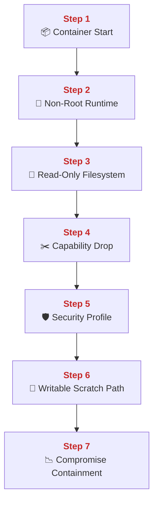
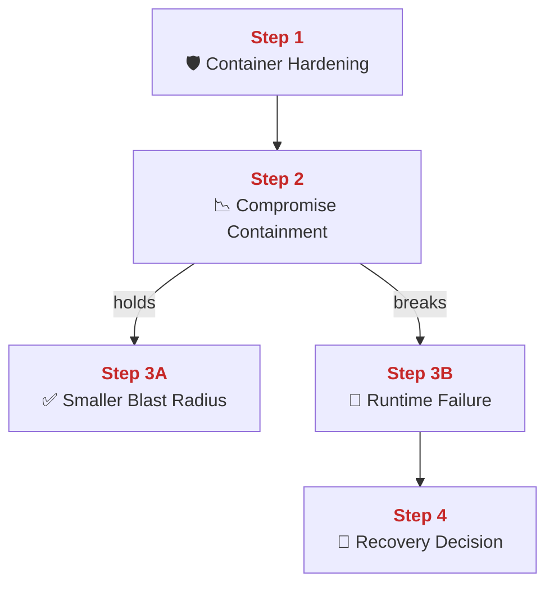
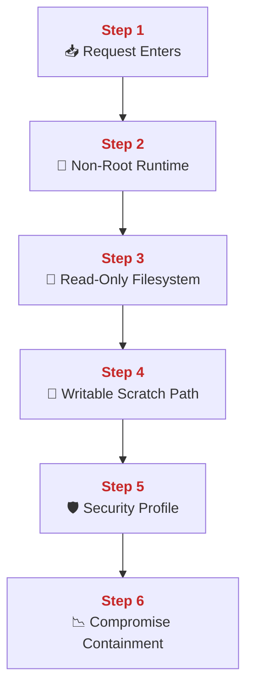
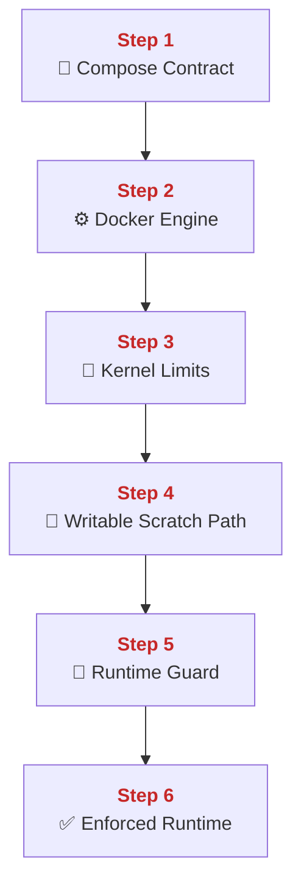
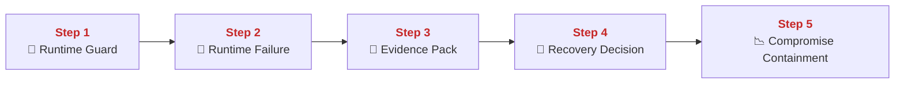
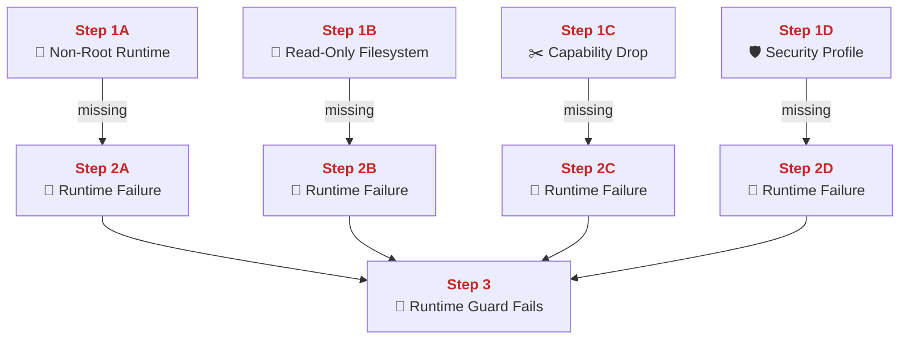
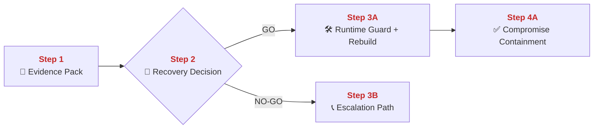
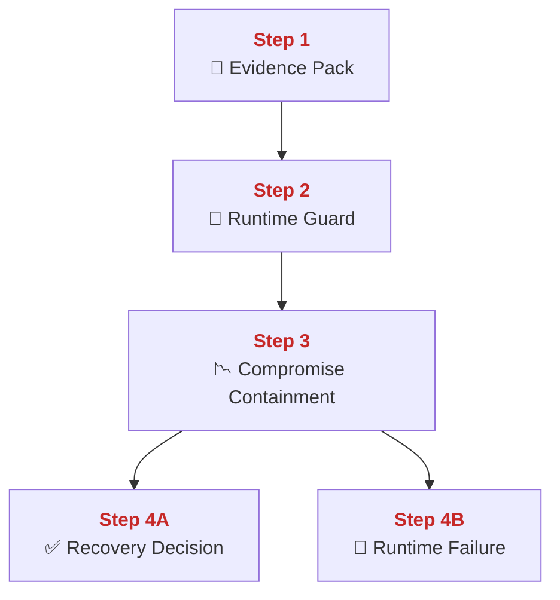

## 03 Container Hardening

This chapter explains how PolyMoly reduces container blast radius before traffic reaches business logic.
It also explains how runtime identity, filesystem limits, and kernel-level restrictions stop one compromised process from becoming a wider platform incident.

---

## Quick Jump

- [Visual Contract Map](#visual-contract-map)
- [Vocabulary Dictionary](#vocabulary-dictionary)
- [1. Problem and Purpose](#1-problem-and-purpose)
- [2. End User Flow](#2-end-user-flow)
- [3. How It Works](#3-how-it-works)
- [4. Architectural Decision (ADR Format)](#4-architectural-decision-adr-format)
- [5. How It Fails](#5-how-it-fails)
- [6. How To Fix (Runbook Safety Standard)](#6-how-to-fix-runbook-safety-standard)
- [7. GO / NO-GO Panels](#7-go--no-go-panels)
- [8. Evidence Pack](#8-evidence-pack)
- [9. Operational Checklist](#9-operational-checklist)
- [10. CI / Quality Gate Reference](#10-ci--quality-gate-reference)
- [What Did We Learn](#what-did-we-learn)

---

## Visual Contract Map

### ADU: Runtime Isolation Path

#### Technical Definition

- **[Container Hardening](#term-container-hardening)**: The runtime restrictions that limit what one container process can do.
- **[Non-Root Runtime](#term-non-root-runtime)**: Running the main application process as an unprivileged user instead of root.
- **[Read-Only Filesystem](#term-read-only-filesystem)**: A container root filesystem that cannot be modified during normal runtime.
- **[Capability Drop](#term-capability-drop)**: Removal of Linux kernel capabilities not required by the process.
- **[Security Profile](#term-security-profile)**: Runtime restrictions such as `no-new-privileges` and related kernel guardrails.
- **[Writable Scratch Path](#term-writable-scratch-path)**: A small allowed write target such as tmpfs for runtime needs.
- **[Compromise Containment](#term-compromise-containment)**: The reduced blast radius created by the hardening set.

#### Diagram



#### 📖 Deterministic Story

- <span style="color:#c62828"><strong>Step 1:</strong></span> A container starts under the **[Container Hardening](#term-container-hardening)** contract.
- <span style="color:#c62828"><strong>Step 2:</strong></span> The main process runs under a **[Non-Root Runtime](#term-non-root-runtime)** identity.
- <span style="color:#c62828"><strong>Step 3:</strong></span> The container root uses a **[Read-Only Filesystem](#term-read-only-filesystem)** when runtime writes are not required.
- <span style="color:#c62828"><strong>Step 4:</strong></span> **[Capability Drop](#term-capability-drop)** removes kernel powers the process does not need.
- <span style="color:#c62828"><strong>Step 5:</strong></span> A **[Security Profile](#term-security-profile)** limits privilege escalation paths.
- <span style="color:#c62828"><strong>Step 6:</strong></span> A **[Writable Scratch Path](#term-writable-scratch-path)** is used only for the few paths that must stay writable.
- <span style="color:#c62828"><strong>Step 7:</strong></span> The result is **[Compromise Containment](#term-compromise-containment)** instead of full host-level freedom.

#### 🧠 Conceptual Layer

Here is what physically happens inside the system:

Step 1 begins before the app even serves traffic. Docker reads the service definition from `system/adapters/docker/compose.yaml` or an overlay and creates the container with the runtime settings attached. The network action is not an app request yet. It is the control traffic between the `docker compose` client and the Docker Engine API. In memory, Docker keeps the container configuration, mounted volumes, tmpfs settings, user ID, security options, and capability set. The first decision is whether the service is allowed to start with the expected hardening fields present. If yes, the next action is process launch inside the container namespace.

Step 2 is the **[Non-Root Runtime](#term-non-root-runtime)** check in practice. The kernel starts the container process with the configured user, such as `nginx`, `daemon`, `app`, or `nobody` instead of UID 0. No network packet changes here. The running process simply starts with less authority. In memory, the kernel stores the process credentials and effective user/group IDs for that process. The decision is whether the process identity has host-level power or only application-level power. If it is non-root, the next action is to apply filesystem and capability rules around that lower-privilege process.

Step 3 is the **[Read-Only Filesystem](#term-read-only-filesystem)** layer. When `read_only: true` is set, Docker mounts the container root filesystem as read-only. The network action is still not external traffic. It is filesystem access inside the container. At the syscall level, a write attempt to a read-only path fails. In memory, the kernel tracks mounted filesystem flags and the process file descriptors that are trying to access them. The decision is whether a write should succeed. For most runtime paths the answer is no, and the next action for the process is either to continue using an allowed read path or to switch to a dedicated writable scratch area.

Step 4 is **[Capability Drop](#term-capability-drop)**. Docker removes Linux capabilities such as extra network, admin, or system powers from the container process. The network action is still indirect. The real change is what the kernel will allow when the process makes privileged syscalls. In memory, the kernel holds the capability bitmap for that process. The decision is whether a syscall that would need elevated capability should be accepted or denied. If the capability is missing, the kernel rejects the request. The next action is that the process either continues with normal app work or fails on the blocked privileged operation.

Step 5 is the **[Security Profile](#term-security-profile)**. In PolyMoly this includes `no-new-privileges:true`, and in production it is checked by the hardening guard together with other runtime restrictions. The network action remains whatever the app is already doing, but the important part is what cannot happen next. In memory, the runtime and kernel keep the security option state for that container. The decision is whether the process can gain more privilege later through exec or helper binaries. With `no-new-privileges`, the answer is no. The next action is that the process continues with the same privilege ceiling it started with.

Step 6 is the **[Writable Scratch Path](#term-writable-scratch-path)**. Some services still need tiny writable areas, for example tmpfs mounts for cache, runtime sockets, or temp files. Docker mounts those explicit tmpfs paths separately. The network action is still local container I/O. At the kernel layer, writes are allowed only to those mounted writable paths. In memory, the mount table now contains a narrow list of allowed write targets. The decision is whether a write goes to an approved scratch path or an unsafe general path. If approved, the next action succeeds. If not, the write is blocked.

Step 7 is **[Compromise Containment](#term-compromise-containment)**. If an attacker or buggy process gets code execution inside the container, the process still runs as a low-privilege user, cannot rewrite the whole image, has fewer kernel powers, and can write only to limited paths. Network traffic can still happen through the app, but host takeover paths are reduced. In memory, the kernel and runtime continue enforcing the same limits for every syscall and every file access. That is the practical result of hardening: not magic protection, but smaller damage when something goes wrong.

#### 🧩 Imagine It Like

- One worker enters the room wearing a low-access badge ([Non-Root Runtime](#term-non-root-runtime)).
- Most drawers are sealed shut ([Read-Only Filesystem](#term-read-only-filesystem)) and most master keys are removed ([Capability Drop](#term-capability-drop)).
- The worker gets one small notepad for temporary notes ([Writable Scratch Path](#term-writable-scratch-path)) so damage stays local ([Compromise Containment](#term-compromise-containment)).

#### 🔎 Lemme Explain

- Hardening does not promise that bugs never happen. It limits what one compromised process can touch after the bug happens.
- If the runtime contract weakens, a single service bug can turn into host-level or multi-service damage.

---

## Vocabulary Dictionary

### Technical Definition

- <a id="term-container-hardening"></a> **[Container Hardening](#term-container-hardening)**: The runtime restrictions that limit what one container process can do.
- <a id="term-non-root-runtime"></a> **[Non-Root Runtime](https://docs.docker.com/engine/features/security/rootless/)**: Running the main application process as an unprivileged user instead of root.
- <a id="term-read-only-filesystem"></a> **[Read-Only Filesystem](https://docs.docker.com/reference/compose-file/lanes/#read_only)**: A container root filesystem that cannot be modified during normal runtime.
- <a id="term-capability-drop"></a> **[Capability Drop](https://man7.org/linux/man-pages/man7/capabilities.7.html)**: Removal of Linux kernel capabilities not required by the process.
- <a id="term-security-profile"></a> **[Security Profile](https://docs.docker.com/engine/features/security/)**: Runtime restrictions such as `no-new-privileges` and related kernel guardrails.
- <a id="term-writable-scratch-path"></a> **[Writable Scratch Path](#term-writable-scratch-path)**: A small allowed write target such as tmpfs for runtime needs.
- <a id="term-compromise-containment"></a> **[Compromise Containment](#term-compromise-containment)**: The reduced blast radius created by the hardening set.
- <a id="term-runtime-guard"></a> **[Runtime Guard](#term-runtime-guard)**: The automated check path that validates runtime hardening rules before release.
- <a id="term-runtime-failure"></a> **[Runtime Failure](#term-runtime-failure)**: A hardening break that lets a container start in a weaker state than intended.
- <a id="term-recovery-decision"></a> **[Recovery Decision](#term-recovery-decision)**: The explicit GO or NO-GO result before rebuilding or restarting a weakened service.
- <a id="term-evidence-pack"></a> **[Evidence Pack](#term-evidence-pack)**: The minimum runtime, compose, and gate proof gathered before mutation.
- <a id="term-escalation-path"></a> **[Escalation Path](#term-escalation-path)**: The responder route used when hardening cannot be restored safely by direct action.

---

## 1. Problem and Purpose

### Trust Boundary

- External entry: A container starts from an image plus runtime flags provided by Compose or the orchestrator.
- Protected side: The app process, kernel limits, and filesystem policy stay inside the hardened runtime boundary.
- Failure posture: If one runtime guard is missing, rebuild and reapply the container instead of trusting degraded isolation.

### ADU: Why Runtime Boundaries Matter

#### Technical Definition

- **[Container Hardening](#term-container-hardening)**: The runtime restrictions that limit what one container process can do.
- **[Compromise Containment](#term-compromise-containment)**: The reduced blast radius created by the hardening set.
- **[Runtime Failure](#term-runtime-failure)**: A hardening break that lets a container start in a weaker state than intended.
- **[Recovery Decision](#term-recovery-decision)**: The explicit GO or NO-GO result before rebuilding or restarting a weakened service.

#### Diagram



#### 📖 Deterministic Story

- <span style="color:#c62828"><strong>Step 1:</strong></span> **[Container Hardening](#term-container-hardening)** defines the runtime boundary before traffic begins.
- <span style="color:#c62828"><strong>Step 2:</strong></span> That boundary creates **[Compromise Containment](#term-compromise-containment)** when one service is hit.
- <span style="color:#c62828"><strong>Step 3A:</strong></span> If the boundary holds, damage stays smaller.
- <span style="color:#c62828"><strong>Step 3B:</strong></span> If the boundary breaks, the system enters **[Runtime Failure](#term-runtime-failure)**.
- <span style="color:#c62828"><strong>Step 4:</strong></span> A **[Recovery Decision](#term-recovery-decision)** is required before mutation.

#### 🧠 Conceptual Layer

Here is what physically happens inside the system:

Step 1 is the hardening contract itself. Docker Compose contains service fields such as `user`, `read_only`, `cap_drop`, `tmpfs`, and `security_opt`. The network action is the control call that sends those settings to Docker Engine. In memory, the engine stores those service settings as the runtime blueprint for the container. The decision is whether the container should launch with limited power or broad power. If the hardening fields are present, the next action is a constrained process launch.

Step 2 is **[Compromise Containment](#term-compromise-containment)** in practice. Once the service is running, every file write, every privileged syscall, and every exec attempt is filtered through the limits defined at start time. There may be normal application network traffic at this point, but the important runtime action is what the kernel refuses. In memory, the kernel tracks process credentials, mount flags, and capability state. The decision is repeated over and over: may this process write here, may it gain privilege, may it call this operation. If the answer stays no where it should, the next action is normal app work inside a smaller box.

Step 3A is the healthy branch. If the service is compromised, the process still meets barriers when it tries to step outside its allowed area. The network action may still be attacker-driven app traffic, but the containment limits what can happen after that traffic lands. In memory, the same user ID, capability set, and mount state remain enforced. The next action stays bounded inside the container.

Step 3B is **[Runtime Failure](#term-runtime-failure)**. This happens when a service starts as root, mounts too many writable paths, keeps broad capabilities, or misses the expected profile options. The network action can still look like normal app traffic from the outside, which is why the failure is dangerous. In memory, the kernel now has a weaker credential set and weaker mount or capability state for that service. The next action for responders is not guesswork. It is to confirm the exact broken boundary and decide whether a direct fix is safe.

Step 4 is the **[Recovery Decision](#term-recovery-decision)**. Operators gather rendered compose state, hardening guard output, and live container metadata. The network action is read-only inspection against Docker Engine and CI artifacts. In memory, the responder compares intended hardening state with actual hardening state. If the mismatch is narrow and understood, the next network action can be rebuild or controlled restart. If it is broad or ambiguous, the next action is escalation.

#### 🧩 Imagine It Like

- You first build a room with small locks and sealed cabinets ([Container Hardening](#term-container-hardening)).
- If one person in the room turns bad, the locks keep damage local ([Compromise Containment](#term-compromise-containment)).
- If the locks are missing, the case becomes a broken room state ([Runtime Failure](#term-runtime-failure)) and someone must choose the safe repair path ([Recovery Decision](#term-recovery-decision)).

#### 🔎 Lemme Explain

- Hardening exists so one bad process is forced to fail in a smaller box.
- When the box is weak, every later incident becomes harder and riskier.

---

## 2. End User Flow

### ADU: Request Inside A Hardened Container

#### Technical Definition

- **[Non-Root Runtime](#term-non-root-runtime)**: Running the main application process as an unprivileged user instead of root.
- **[Read-Only Filesystem](#term-read-only-filesystem)**: A container root filesystem that cannot be modified during normal runtime.
- **[Writable Scratch Path](#term-writable-scratch-path)**: A small allowed write target such as tmpfs for runtime needs.
- **[Security Profile](#term-security-profile)**: Runtime restrictions such as `no-new-privileges` and related kernel guardrails.
- **[Compromise Containment](#term-compromise-containment)**: The reduced blast radius created by the hardening set.

#### Diagram



#### 📖 Deterministic Story

- <span style="color:#c62828"><strong>Step 1:</strong></span> A request enters a running application container.
- <span style="color:#c62828"><strong>Step 2:</strong></span> The request is handled by a **[Non-Root Runtime](#term-non-root-runtime)** process.
- <span style="color:#c62828"><strong>Step 3:</strong></span> The process meets a **[Read-Only Filesystem](#term-read-only-filesystem)** for normal image paths.
- <span style="color:#c62828"><strong>Step 4:</strong></span> Only an explicit **[Writable Scratch Path](#term-writable-scratch-path)** stays open for allowed temp writes.
- <span style="color:#c62828"><strong>Step 5:</strong></span> The **[Security Profile](#term-security-profile)** blocks later privilege jumps.
- <span style="color:#c62828"><strong>Step 6:</strong></span> The result is **[Compromise Containment](#term-compromise-containment)** during real runtime traffic.

#### 🧠 Conceptual Layer

Here is what physically happens inside the system:

Step 1 begins when an app listener inside the container accepts a real request. The network action is a normal HTTP, gRPC, or internal service connection. The process reads bytes from the socket and creates request state in memory. The decision is not about hardening yet. The request is already inside the service. The next action is that the process tries to do its normal work under the runtime limits it was given at start.

Step 2 is the **[Non-Root Runtime](#term-non-root-runtime)** effect. The app process handling the request already runs as a low-privilege user. In memory, the kernel keeps the current process credentials for that handler. If the code path later tries to do something that would only work as root, the process identity does not have that authority. The next action is either ordinary app logic or a denied privileged operation.

Step 3 is the **[Read-Only Filesystem](#term-read-only-filesystem)** boundary. If the request handler or an attacker-controlled code path tries to write into the image filesystem, the kernel checks the mount flags for that path. In memory, the kernel has the mount table and the open file descriptor state. The decision is whether the target path is writable. For most image paths the answer is no. The next action is either an application error for that write attempt or continued processing without the write.

Step 4 is the **[Writable Scratch Path](#term-writable-scratch-path)**. Some runtime actions still need safe temporary storage, such as cache files or small temp outputs. Docker provides tmpfs or another narrow write target for that purpose. The network action is still app traffic, but the filesystem action now targets only the allowed scratch mount. In memory, the kernel checks the specific mount that owns that path. The decision is whether the request is trying to use an approved temporary path or a broader unsafe path. If approved, the write succeeds there and nowhere else.

Step 5 is the **[Security Profile](#term-security-profile)**. Even after the request is inside the process, the runtime still blocks later privilege increases. `no-new-privileges` means the process cannot suddenly become more powerful through exec tricks. In memory, the runtime keeps that security flag tied to the process. The decision is whether any later step can climb above its original privilege ceiling. The answer stays no. The next action is either the request finishing normally or the blocked operation failing.

Step 6 is **[Compromise Containment](#term-compromise-containment)**. If the request was malicious, the process still had less authority, fewer writable targets, and fewer kernel powers the whole time. The network action remains whatever app traffic came in, but the blast radius after that traffic is smaller. That is what hardening changes during real runtime: not the arrival of the request, but what the process can do after it receives the request.

#### 🧩 Imagine It Like

- A visitor reaches the worker desk, but the worker still has a low-access badge ([Non-Root Runtime](#term-non-root-runtime)).
- Most cabinets stay locked ([Read-Only Filesystem](#term-read-only-filesystem)) except one tiny note drawer ([Writable Scratch Path](#term-writable-scratch-path)).
- Even under pressure, the worker cannot grab master keys later ([Security Profile](#term-security-profile)), so the mess stays smaller ([Compromise Containment](#term-compromise-containment)).

#### 🔎 Lemme Explain

- Hardening still matters after the request gets in.
- The point is to limit post-request damage, not just startup-time compliance.

---

## 3. How It Works

### ADU: Compose To Kernel Enforcement

#### Technical Definition

- **[Container Hardening](#term-container-hardening)**: The runtime restrictions that limit what one container process can do.
- **[Capability Drop](#term-capability-drop)**: Removal of Linux kernel capabilities not required by the process.
- **[Security Profile](#term-security-profile)**: Runtime restrictions such as `no-new-privileges` and related kernel guardrails.
- **[Writable Scratch Path](#term-writable-scratch-path)**: A small allowed write target such as tmpfs for runtime needs.
- **[Runtime Guard](#term-runtime-guard)**: The automated check path that validates runtime hardening rules before release.

#### Diagram



#### 📖 Deterministic Story

- <span style="color:#c62828"><strong>Step 1:</strong></span> The hardening intent is declared in the compose contract.
- <span style="color:#c62828"><strong>Step 2:</strong></span> Docker Engine converts that intent into a real container runtime setup.
- <span style="color:#c62828"><strong>Step 3:</strong></span> The kernel enforces **[Capability Drop](#term-capability-drop)** and the **[Security Profile](#term-security-profile)** during execution.
- <span style="color:#c62828"><strong>Step 4:</strong></span> A narrow **[Writable Scratch Path](#term-writable-scratch-path)** remains available where required.
- <span style="color:#c62828"><strong>Step 5:</strong></span> The **[Runtime Guard](#term-runtime-guard)** checks that the hardening contract still exists.
- <span style="color:#c62828"><strong>Step 6:</strong></span> The service runs as an enforced runtime, not as a best-effort suggestion.

#### 🧠 Conceptual Layer

Here is what physically happens inside the system:

Step 1 begins in configuration. Compose files define `security_opt`, `cap_drop`, `user`, `tmpfs`, and `read_only` for services. The network action is a control-plane render or deploy call, not user traffic. In memory, the compose client builds the full service model from the YAML and overlays. The decision is whether the rendered service spec contains the intended hardening fields.

Step 2 happens in Docker Engine. The engine receives the service spec and prepares the container namespaces, mount list, process user, and security options. In memory, the engine keeps the container creation state and passes the low-level config to the runtime. The next action is process launch with those constraints attached.

Step 3 happens in the kernel. When the process starts, the kernel enforces the reduced capability set and the no-new-privileges setting for that process. There may be normal app network traffic later, but the key system action here is syscall evaluation. In memory, the kernel keeps the process credential state and capability state. The decision is whether a privileged action is allowed or denied.

Step 4 is the **[Writable Scratch Path](#term-writable-scratch-path)** carve-out. Docker mounts tmpfs or a narrow writable area for the few runtime paths that need writes. In memory, the mount table distinguishes between read-only image paths and allowed scratch mounts. The decision is whether a write targets the approved scratch area or a forbidden general path.

Step 5 is the **[Runtime Guard](#term-runtime-guard)**. In PolyMoly this is the hardening check path, especially `go run ./system/tools/poly/cmd/poly gate check hardening-core`, plus related CI gate scripts. The network action is CI or local command execution against repo files and rendered compose output. In memory, the guard process keeps regex matches, service names, and pass/fail state for each rule. The decision is whether the hardening contract is still present in configuration and overlays.

Step 6 is enforced runtime, not convention. If the compose contract, engine setup, kernel restrictions, scratch mounts, and guard checks all agree, the service runs in the expected reduced-power state. That means the runtime boundary exists both in config and in live execution.

#### 🧩 Imagine It Like

- The building plan writes the locks on paper first.
- The building crew installs those locks into the real room.
- The house rules and guard checklist make sure the locks are still there later.

#### 🔎 Lemme Explain

- Hardening only matters if configuration, runtime, and validation all line up.
- A nice Dockerfile comment is not protection. Enforced runtime state is protection.

---

## 4. Architectural Decision (ADR Format)

### ADU: Fail Closed On Weak Runtime

#### Technical Definition

- **[Runtime Guard](#term-runtime-guard)**: The automated check path that validates runtime hardening rules before release.
- **[Runtime Failure](#term-runtime-failure)**: A hardening break that lets a container start in a weaker state than intended.
- **[Recovery Decision](#term-recovery-decision)**: The explicit GO or NO-GO result before rebuilding or restarting a weakened service.
- **[Compromise Containment](#term-compromise-containment)**: The reduced blast radius created by the hardening set.
- **[Evidence Pack](#term-evidence-pack)**: The minimum runtime, compose, and gate proof gathered before mutation.

#### Diagram



#### 📖 Deterministic Story

- <span style="color:#c62828"><strong>Step 1:</strong></span> The **[Runtime Guard](#term-runtime-guard)** checks whether the hardening contract is still intact.
- <span style="color:#c62828"><strong>Step 2:</strong></span> If the contract breaks, the state becomes a **[Runtime Failure](#term-runtime-failure)**.
- <span style="color:#c62828"><strong>Step 3:</strong></span> Operators collect an **[Evidence Pack](#term-evidence-pack)** before touching the service.
- <span style="color:#c62828"><strong>Step 4:</strong></span> A **[Recovery Decision](#term-recovery-decision)** is made from evidence.
- <span style="color:#c62828"><strong>Step 5:</strong></span> Recovery exists to restore **[Compromise Containment](#term-compromise-containment)**, not just green status.

#### 🧠 Conceptual Layer

Here is what physically happens inside the system:

Step 1 is the guard check itself. A local or CI process runs `go run ./system/tools/poly/cmd/poly gate check hardening-core` and related policy checks against compose files and runtime contracts. The network action is mostly local file reads, plus CI artifact writing. In memory, the check script keeps the current list of required services and required rules. The decision is whether core services still declare non-root users, security options, capability drops, tmpfs rules, and the other enforced invariants.

Step 2 is **[Runtime Failure](#term-runtime-failure)**. If a rule is missing, the guard returns failure before release. The important point is that the failure is not only “style wrong.” It means the next container could start with more power than intended. In memory, the guard marks that service and rule as failed. The next action is not deploy. The next action is evidence collection and review.

Step 3 is the **[Evidence Pack](#term-evidence-pack)**. Operators gather the guard output, rendered compose config, relevant Dockerfile, and current running service metadata if needed. The network action is read-only CLI inspection and artifact reads. In memory, the responder compares intended runtime state with actual runtime state. The decision is whether the gap is clearly understood and safely correctable.

Step 4 is the **[Recovery Decision](#term-recovery-decision)**. There is no automatic “safe enough” fairy here. The responder or automation must decide whether to rebuild, restart, or block the service. The network action becomes mutation only after the evidence is clear. In memory, the responder now has pass/fail state for the exact runtime boundary that broke.

Step 5 is the reason this decision exists. The goal is not to get a green badge. The goal is to restore **[Compromise Containment](#term-compromise-containment)**. If a service runs with broader power than intended, every future request through that service carries more risk than before.

#### 🧩 Imagine It Like

- The safety inspector ([Runtime Guard](#term-runtime-guard)) checks whether the room still has the right locks.
- If a lock is missing, the room becomes a broken safe zone ([Runtime Failure](#term-runtime-failure)).
- The repair decision only matters if it restores the smaller damage zone ([Compromise Containment](#term-compromise-containment)).

#### 🔎 Lemme Explain

- This is a fail-closed decision: weak hardening is a release blocker, not a warning badge.
- The right question is “is the boundary restored,” not “did the script pass after we clicked rerun.”

---

## 5. How It Fails

### ADU: Runtime Boundary Breaks

#### Technical Definition

- **[Non-Root Runtime](#term-non-root-runtime)**: Running the main application process as an unprivileged user instead of root.
- **[Read-Only Filesystem](#term-read-only-filesystem)**: A container root filesystem that cannot be modified during normal runtime.
- **[Capability Drop](#term-capability-drop)**: Removal of Linux kernel capabilities not required by the process.
- **[Security Profile](#term-security-profile)**: Runtime restrictions such as `no-new-privileges` and related kernel guardrails.
- **[Runtime Failure](#term-runtime-failure)**: A hardening break that lets a container start in a weaker state than intended.
- **[Runtime Guard](#term-runtime-guard)**: The automated check path that validates runtime hardening rules before release.

#### Diagram



#### 📖 Deterministic Story

- <span style="color:#c62828"><strong>Step 1A:</strong></span> Missing **[Non-Root Runtime](#term-non-root-runtime)** weakens process identity.
- <span style="color:#c62828"><strong>Step 1B:</strong></span> Missing **[Read-Only Filesystem](#term-read-only-filesystem)** widens writable state.
- <span style="color:#c62828"><strong>Step 1C:</strong></span> Missing **[Capability Drop](#term-capability-drop)** widens kernel power.
- <span style="color:#c62828"><strong>Step 1D:</strong></span> Missing **[Security Profile](#term-security-profile)** widens privilege-escalation paths.
- <span style="color:#c62828"><strong>Step 3:</strong></span> Any of those gaps becomes a **[Runtime Failure](#term-runtime-failure)** and the **[Runtime Guard](#term-runtime-guard)** must fail.

#### 🧠 Conceptual Layer

Here is what physically happens inside the system:

Step 1A is missing **[Non-Root Runtime](#term-non-root-runtime)**. The container process starts as root or an overly powerful identity. The network action may still look normal from outside, because the service still answers requests. In memory, the kernel now stores a stronger process credential set than intended. The decision that should have been “low privilege” is now “broad privilege.”

Step 2A is the resulting **[Runtime Failure](#term-runtime-failure)**. Any later exploit or bad code path now starts from a stronger base.

Step 1B is missing **[Read-Only Filesystem](#term-read-only-filesystem)**. The process can now modify far more of the container root filesystem. Again, the network action may still look normal to a user. In memory, the mount table now marks more paths as writable than intended. The decision that should have denied broad writes now allows them.

Step 2B is the failure state for filesystem widening. A compromised process can now rewrite runtime files, drop tools, or change more state during execution.

Step 1C is missing **[Capability Drop](#term-capability-drop)**. The process keeps kernel powers it does not need. In memory, the capability bitmap stays too broad. The decision that should have rejected privileged syscalls now allows more of them.

Step 2C is the resulting runtime failure for kernel power widening. The danger is not cosmetic. It changes what the process can ask the kernel to do.

Step 1D is missing **[Security Profile](#term-security-profile)**. The process may now have more room for privilege escalation later in its life. In memory, the runtime no longer carries the same protection flags for that container. The decision that should have blocked later privilege jumps is now weaker.

Step 2D is the failure state for profile weakening. The process still serves traffic, but the security posture is lower than the contract says.

Step 3 is why the **[Runtime Guard](#term-runtime-guard)** must fail on any one of these gaps. They are different failure classes, but they all widen the damage boundary. If the guard allows them through, the platform starts treating weaker isolation as normal.

#### 🧩 Imagine It Like

- One missing low-access badge, one unlocked wall, one extra master key, or one missing house rule all widen the room.
- They are different mistakes, but each one turns a smaller room into a riskier room.

#### 🔎 Lemme Explain

- Runtime hardening failures are different in mechanism, but equal in one result: the blast radius grows.
- A service that still answers traffic can still be in a failed security state.

| Symptom | Root Cause | Severity | Fastest confirmation step |
| :--- | :--- | :--- | :--- |
| Container runs as root | missing **[Non-Root Runtime](#term-non-root-runtime)** | Sev-1 | `docker compose config | rg -n 'user:'` |
| Service root is writable | missing **[Read-Only Filesystem](#term-read-only-filesystem)** | Sev-1 | `docker compose config | rg -n 'read_only:'` |
| Capabilities too broad | missing **[Capability Drop](#term-capability-drop)** | Sev-1 | `docker compose config | rg -n 'cap_drop:'` |
| Profile not enforced | missing **[Security Profile](#term-security-profile)** | Sev-1 | `docker compose config | rg -n 'no-new-privileges'` |

---

## 6. How To Fix (Runbook Safety Standard)

### ADU: Restore Runtime Boundaries

#### Technical Definition

- **[Evidence Pack](#term-evidence-pack)**: The minimum runtime, compose, and gate proof gathered before mutation.
- **[Runtime Guard](#term-runtime-guard)**: The automated check path that validates runtime hardening rules before release.
- **[Runtime Failure](#term-runtime-failure)**: A hardening break that lets a container start in a weaker state than intended.
- **[Recovery Decision](#term-recovery-decision)**: The explicit GO or NO-GO result before rebuilding or restarting a weakened service.
- **[Compromise Containment](#term-compromise-containment)**: The reduced blast radius created by the hardening set.
- **[Escalation Path](#term-escalation-path)**: The responder route used when hardening cannot be restored safely by direct action.

#### Diagram



#### 📖 Deterministic Story

- <span style="color:#c62828"><strong>Step 1:</strong></span> The **[Evidence Pack](#term-evidence-pack)** is captured before rebuild or restart.
- <span style="color:#c62828"><strong>Step 2:</strong></span> The **[Recovery Decision](#term-recovery-decision)** decides whether direct correction is safe.
- <span style="color:#c62828"><strong>Step 3A:</strong></span> If GO, operators restore the contract and rerun the **[Runtime Guard](#term-runtime-guard)**.
- <span style="color:#c62828"><strong>Step 4A:</strong></span> The result must restore **[Compromise Containment](#term-compromise-containment)**.
- <span style="color:#c62828"><strong>Step 3B:</strong></span> If NO-GO, operators use the **[Escalation Path](#term-escalation-path)** instead of forcing redeploy.

#### 🧠 Conceptual Layer

Here is what physically happens inside the system:

Step 1 is evidence collection. The responder starts with rendered compose config, current hardening guard output, and the live service identity if the container already exists. The network action is read-only Docker CLI or CI artifact access. In memory, the responder keeps the current service definition, the expected hardening contract, and the failing rule names. The decision is whether the broken boundary is specific and understood.

Step 2 is the **[Recovery Decision](#term-recovery-decision)**. There is no automatic safe answer here. The responder compares current live state and intended state. The network action is still read-only. In memory, the responder marks the service as GO for direct correction only if the mismatch is narrow and clearly understood. If the mismatch is broader or touches many services, the next action should be escalation.

Step 3A is the GO branch. The operator corrects the compose or image contract and reruns the **[Runtime Guard](#term-runtime-guard)**, then rebuilds or restarts the affected service. The network action is a Docker Engine control call for build or restart plus a local guard execution. In memory, Docker updates the container creation state, and the guard updates pass/fail state for the corrected service. The decision is whether the new runtime now starts with the intended restrictions.

Step 4A is verification of **[Compromise Containment](#term-compromise-containment)**. The responder checks rendered config again, checks the guard output again, and confirms that the live service is back inside the intended boundary. The network action is read-only inspection. In memory, the responder compares old weak state and new constrained state. Only then is the hardening incident considered closed.

Step 3B is the NO-GO branch. The responder does not guess and redeploy under uncertainty. The network action becomes escalation through the **[Escalation Path](#term-escalation-path)**. In memory, the release remains blocked while the deeper issue is investigated.

#### 🧩 Imagine It Like

- You photograph the broken locks first ([Evidence Pack](#term-evidence-pack)).
- Then you decide whether this is one lock replacement or a whole-building problem ([Recovery Decision](#term-recovery-decision)).
- You only reopen the room after the smaller damage boundary is really back ([Compromise Containment](#term-compromise-containment)).

#### 🔎 Lemme Explain

- The fix is not “restart the container.” The fix is “restore the missing boundary.”
- If you cannot prove the boundary is back, the incident is not closed.

### Exact Runbook Commands

```bash
# Read-only checks
go run ./system/tools/poly/cmd/poly gate check hardening-core
docker compose config | rg -n 'user:|read_only:|cap_drop:|security_opt:|tmpfs:'
docker compose ps
```

```bash
# Mutation (only after Evidence Pack is captured and Recovery Decision is GO)
docker compose build nginx php node go
docker compose up -d nginx php node go
```

```bash
# Verify
go run ./system/tools/poly/cmd/poly gate check hardening-core
docker compose config | rg -n 'user:|read_only:|cap_drop:|security_opt:|tmpfs:'
docker compose ps
```

Rollback rule:
- Do not deploy a weaker runtime contract to restore availability faster.
- If the fixed image or compose change fails, revert to the last known hardened release.

---

## 7. GO / NO-GO Panels

### ADU: Hardening Release Gate

#### Technical Definition

- **[Runtime Guard](#term-runtime-guard)**: The automated check path that validates runtime hardening rules before release.
- **[Evidence Pack](#term-evidence-pack)**: The minimum runtime, compose, and gate proof gathered before mutation.
- **[Recovery Decision](#term-recovery-decision)**: The explicit GO or NO-GO result before rebuilding or restarting a weakened service.
- **[Runtime Failure](#term-runtime-failure)**: A hardening break that lets a container start in a weaker state than intended.
- **[Compromise Containment](#term-compromise-containment)**: The reduced blast radius created by the hardening set.

#### Diagram



#### 📖 Deterministic Story

- <span style="color:#c62828"><strong>Step 1:</strong></span> The **[Evidence Pack](#term-evidence-pack)** enters the release gate.
- <span style="color:#c62828"><strong>Step 2:</strong></span> The **[Runtime Guard](#term-runtime-guard)** checks the hardening contract.
- <span style="color:#c62828"><strong>Step 3:</strong></span> The gate evaluates whether **[Compromise Containment](#term-compromise-containment)** still holds.
- <span style="color:#c62828"><strong>Step 4A:</strong></span> If yes, the **[Recovery Decision](#term-recovery-decision)** may remain GO.
- <span style="color:#c62828"><strong>Step 4B:</strong></span> If not, the state remains **[Runtime Failure](#term-runtime-failure)**.

#### 🧠 Conceptual Layer

Here is what physically happens inside the system:

Step 1 begins with the **[Evidence Pack](#term-evidence-pack)** already assembled. The network actions are read-only guard outputs, rendered compose reads, and service inspection calls. In memory, the responder now has the specific service name, the failed hardening rule, and the current runtime picture.

Step 2 is the **[Runtime Guard](#term-runtime-guard)** evaluation. The guard process reads the compose files and checks for required settings. In memory, it tracks pass/fail state for each invariant. The decision is whether the runtime contract is intact or broken.

Step 3 is the actual containment question. A passing rule set means the running service still has the expected smaller boundary. A failing rule set means the service may now have broader powers than intended. The network action is still read-only inspection, but the decision is operationally critical.

Step 4A is GO. The service can continue or the corrected release can proceed because the hardening boundary is present. Step 4B is NO-GO. The service or release stays blocked because the weakened runtime is still unsafe. That is the real gate meaning.

#### 🧩 Imagine It Like

- You bring the lock report to the safety desk.
- The desk checks whether the small-room rule still holds.
- If the room is still small, work continues. If the room is wide open, work stops.

#### 🔎 Lemme Explain

- Availability is not enough. The runtime also has to stay constrained.
- This gate exists to stop “works, but too dangerous” releases.

---

## 8. Evidence Pack

Collect before mutation:

- Latest `hardening-core` gate output.
- Rendered compose view for affected service.
- Current service name and image under investigation.
- Specific missing hardening fields.
- Current service health and restart state.
- Last known hardened image or release reference.

---

## 9. Operational Checklist

- [ ] Affected service is identified.
- [ ] Missing hardening rule is identified.
- [ ] Guard output is captured before rebuild.
- [ ] Runtime mutation is approved explicitly.
- [ ] Post-fix guard is green.
- [ ] Service is still healthy after the fix.

---

## 10. CI / Quality Gate Reference

Run:

```bash
task docs:governance
task docs:governance:strict
go run ./system/tools/poly/cmd/poly gate check hardening-core
bash features/security/check-image-hardening-level2.sh
```

Related workflows and evidence:

- `.github/workflows/ci-factory.yml`
- `.github/workflows/image-hardening-level2-gate.yml`
- `tools/artifacts/docs-governance/checks.tsv`
- `tools/artifacts/docs-links/checks.tsv`
- `tools/artifacts/image-hardening-level2/*`

---

## What Did We Learn

- Hardening is a runtime boundary, not a decorative security theme.
- Non-root, read-only, capability drop, and no-new-privileges work together.
- The right fix is to restore the missing boundary, not just restart the service.

👉 Next Chapter: **[01-stateless-design.md](../state-and-runtime/01-stateless-design.md)**
