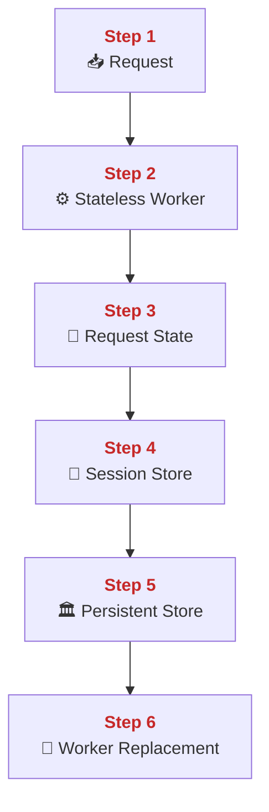
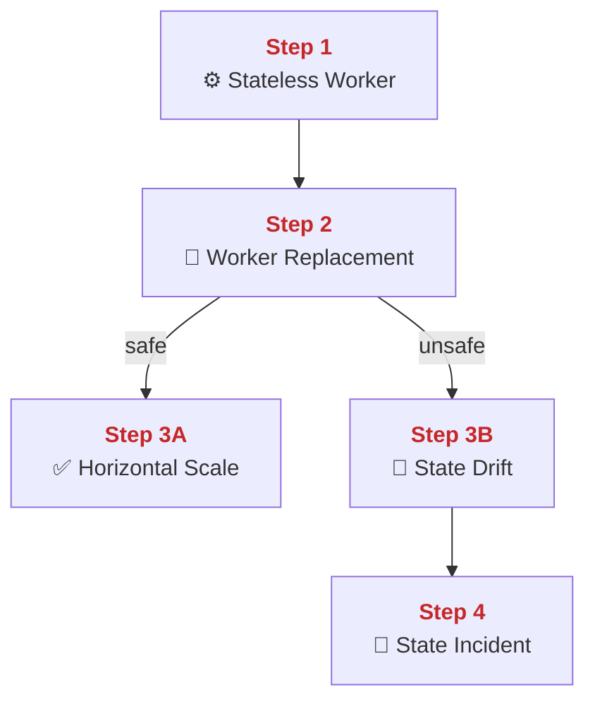
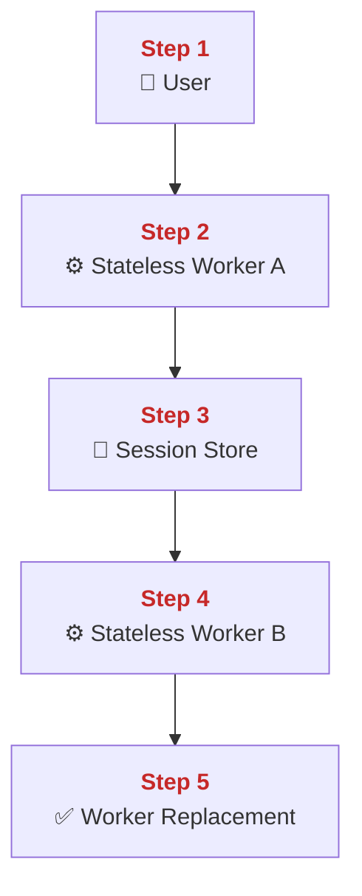
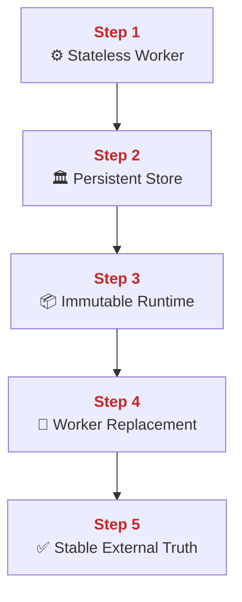
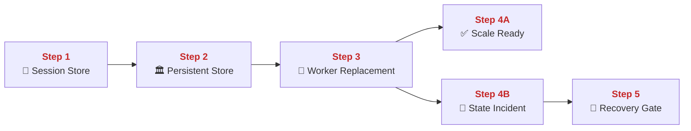
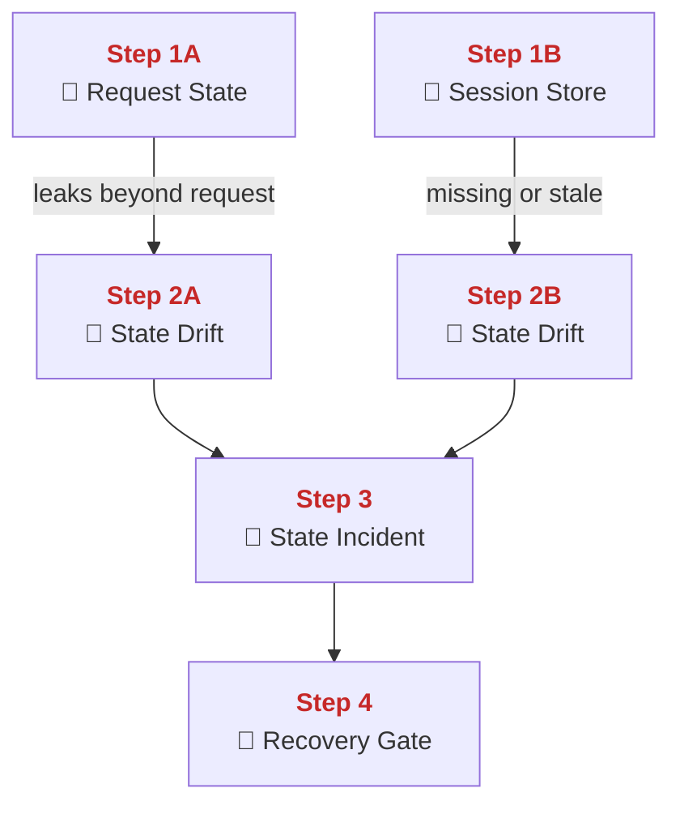
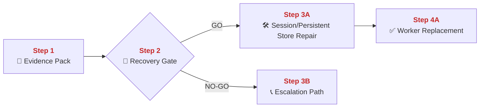
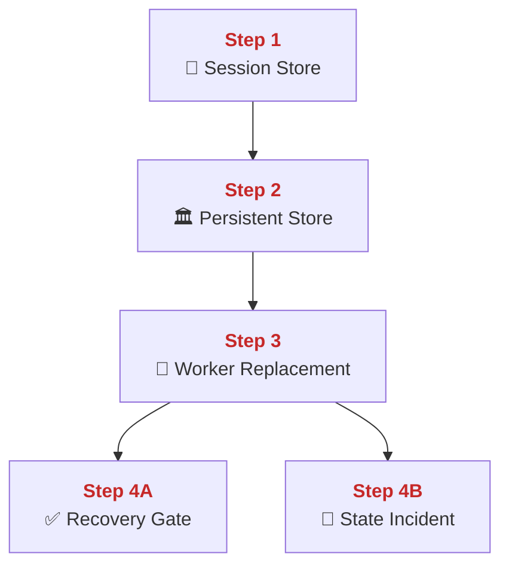

## 01 Stateless Design

This chapter explains how PolyMoly keeps app workers disposable by moving durable state outside the app process.
It also explains how sessions, cache, and database state let one worker die without taking user identity or business data with it.

---

## Quick Jump

- [Visual Contract Map](#visual-contract-map)
- [Vocabulary Dictionary](#vocabulary-dictionary)
- [1. Problem and Purpose](#1-problem-and-purpose)
- [2. End User Flow](#2-end-user-flow)
- [3. How It Works](#3-how-it-works)
- [4. Architectural Decision (ADR Format)](#4-architectural-decision-adr-format)
- [5. How It Fails](#5-how-it-fails)
- [6. How To Fix (Runbook Safety Standard)](#6-how-to-fix-runbook-safety-standard)
- [7. GO / NO-GO Panels](#7-go--no-go-panels)
- [8. Evidence Pack](#8-evidence-pack)
- [9. Operational Checklist](#9-operational-checklist)
- [10. CI / Quality Gate Reference](#10-ci--quality-gate-reference)
- [What Did We Learn](#what-did-we-learn)

---

## Visual Contract Map

### ADU: Disposable Worker Flow

#### Technical Definition

- **[Stateless Worker](#term-stateless-worker)**: An application worker that keeps no durable business state inside its own process memory.
- **[Request State](#term-request-state)**: Temporary in-memory data that lives only for one active request.
- **[Session Store](#term-session-store)**: External storage used for user session continuity across workers.
- **[Persistent Store](#term-persistent-store)**: External system that keeps durable business data.
- **[Worker Replacement](#term-worker-replacement)**: The ability to stop one worker and send the next request to another worker without losing durable state.
- **[State Drift](#term-state-drift)**: Wrong behavior caused when different workers hold conflicting private state.

#### Diagram



#### 📖 Deterministic Story

- <span style="color:#c62828"><strong>Step 1:</strong></span> A request reaches a **[Stateless Worker](#term-stateless-worker)**.
- <span style="color:#c62828"><strong>Step 2:</strong></span> The worker keeps only **[Request State](#term-request-state)** in memory while handling the call.
- <span style="color:#c62828"><strong>Step 3:</strong></span> User continuity comes from an external **[Session Store](#term-session-store)**.
- <span style="color:#c62828"><strong>Step 4:</strong></span> Durable business data lives in a **[Persistent Store](#term-persistent-store)**.
- <span style="color:#c62828"><strong>Step 5:</strong></span> Another worker can serve the next request using the same external state.
- <span style="color:#c62828"><strong>Step 6:</strong></span> The result is safe **[Worker Replacement](#term-worker-replacement)** instead of private-memory dependence.

#### 🧠 Conceptual Layer

Here is what physically happens inside the system:

Step 1 begins when a request lands on one **[Stateless Worker](#term-stateless-worker)**. That worker can be a PHP, Node, or Go app container. The network action is a normal inbound request on the application socket. In memory, the worker creates request-local objects such as parsed headers, route name, authentication state, and handler variables. The decision is whether the request can be handled from external state sources rather than private long-lived worker memory. If yes, the next network action is reads to the external state systems.

Step 2 is **[Request State](#term-request-state)**. This is the in-memory data that exists only while the current request is running. It can include variables, parsed JSON, trace context, and temporary computed values. The network action here is still the live request being processed. In memory, this state sits inside the worker process and disappears when the request ends. The decision is whether the data belongs only to this request or needs to survive after the request. If it needs to survive, the next action is not “leave it in RAM.” The next action is to write or read it from an external store.

Step 3 is the **[Session Store](#term-session-store)** path. For user identity continuity, the worker reads or writes session data in Redis or another shared external store. The network action is a service-to-service connection from the worker to the session backend. In memory, the worker keeps the session key and the current session payload long enough to read or update it. The decision is whether the worker can trust its own old memory for the next request. The answer is no. The next request may hit another worker, so the shared session state must live outside the worker.

Step 4 is the **[Persistent Store](#term-persistent-store)** path. Durable business data such as orders, users, or inventory is written to PostgreSQL or MySQL through the configured data path. The network action is a database connection and query execution. In memory, the worker keeps only the current query result or write payload. The durable truth lives in the external store, not in the worker process. The decision is whether the next request should depend on this worker still being alive. The answer is again no.

Step 5 is the handoff to another worker. The first worker can stop, restart, or be replaced. The next network action is simply a new request landing on another worker instance. In memory, that second worker starts with its own empty process memory, but it can still read the same external session and persistent data. That is what makes the architecture scale and recover cleanly.

Step 6 is **[Worker Replacement](#term-worker-replacement)**. The system can restart or move workers because durable truth and user continuity are already outside the worker. If the platform kept too much private state inside each worker, the next request would depend on hitting the same process again. That would create **[State Drift](#term-state-drift)** and fragile scaling.

#### 🧩 Imagine It Like

- One clerk handles the visitor, but the official file is not kept in the clerk's pocket.
- The ID drawer ([Session Store](#term-session-store)) and the main archive ([Persistent Store](#term-persistent-store)) are shared across all clerks.
- That is why one clerk can leave and another can continue the job ([Worker Replacement](#term-worker-replacement)).

#### 🔎 Lemme Explain

- Stateless design means workers are temporary and shared state is external.
- If state stays trapped inside one worker, scaling and failover both become unsafe.

---

## Vocabulary Dictionary

### Technical Definition

- <a id="term-stateless-worker"></a> **[Stateless Worker](#term-stateless-worker)**: An application worker that keeps no durable business state inside its own process memory.
- <a id="term-request-state"></a> **[Request State](#term-request-state)**: Temporary in-memory data that lives only for one active request.
- <a id="term-session-store"></a> **[Session Store](#term-session-store)**: External storage used for user session continuity across workers.
- <a id="term-persistent-store"></a> **[Persistent Store](#term-persistent-store)**: External system that keeps durable business data.
- <a id="term-worker-replacement"></a> **[Worker Replacement](#term-worker-replacement)**: The ability to stop one worker and send the next request to another worker without losing durable state.
- <a id="term-state-drift"></a> **[State Drift](#term-state-drift)**: Wrong behavior caused when different workers hold conflicting private state.
- <a id="term-immutable-runtime"></a> **[Immutable Runtime](#term-immutable-runtime)**: A worker image that is replaced as a whole instead of edited in place.
- <a id="term-state-incident"></a> **[State Incident](#term-state-incident)**: A failure caused by missing or inconsistent externalized state.
- <a id="term-recovery-gate"></a> **[Recovery Gate](#term-recovery-gate)**: The GO / NO-GO decision made before state repair or worker restart.
- <a id="term-evidence-pack"></a> **[Evidence Pack](#term-evidence-pack)**: The minimum session, datastore, and worker evidence gathered before mutation.
- <a id="term-escalation-path"></a> **[Escalation Path](#term-escalation-path)**: The responder route used when state consistency cannot be restored safely by direct action.

---

## 1. Problem and Purpose

### Trust Boundary

- External entry: User requests may land on any worker instance in the pool.
- Protected side: Session truth and durable state live outside worker memory in shared stores.
- Failure posture: If state depends on one worker memory path, scaling and failover must stop until state is externalized.

### ADU: Why Workers Must Forget

#### Technical Definition

- **[Stateless Worker](#term-stateless-worker)**: An application worker that keeps no durable business state inside its own process memory.
- **[Worker Replacement](#term-worker-replacement)**: The ability to stop one worker and send the next request to another worker without losing durable state.
- **[State Drift](#term-state-drift)**: Wrong behavior caused when different workers hold conflicting private state.
- **[State Incident](#term-state-incident)**: A failure caused by missing or inconsistent externalized state.

#### Diagram



#### 📖 Deterministic Story

- <span style="color:#c62828"><strong>Step 1:</strong></span> A **[Stateless Worker](#term-stateless-worker)** is designed to forget durable state.
- <span style="color:#c62828"><strong>Step 2:</strong></span> That design allows safe **[Worker Replacement](#term-worker-replacement)**.
- <span style="color:#c62828"><strong>Step 3A:</strong></span> If replacement is safe, horizontal scale works.
- <span style="color:#c62828"><strong>Step 3B:</strong></span> If replacement depends on private memory, **[State Drift](#term-state-drift)** appears.
- <span style="color:#c62828"><strong>Step 4:</strong></span> Drift turns into a **[State Incident](#term-state-incident)**.

#### 🧠 Conceptual Layer

Here is what physically happens inside the system:

Step 1 is the design choice that the worker forgets durable state. The worker process starts, handles requests, and may keep live variables in RAM, but it must not become the only owner of session or business truth. The network action is normal request traffic. In memory, the worker uses temporary request variables that disappear after the request. The decision is whether anything important survives only in that worker's RAM. If yes, the design is already drifting toward failure.

Step 2 is **[Worker Replacement](#term-worker-replacement)**. A platform can restart or reschedule the worker and still keep serving traffic because the next worker can read the same external state. The network action is a new request reaching another worker. In memory, the new worker begins with empty local state but can still rebuild context from the shared stores. The decision is whether replacing the worker changes user-visible truth.

Step 3A is the healthy branch. If state was externalized correctly, replacement is boring. The next request reaches another worker, which reads the shared session and durable data and continues normally. That is what safe scale looks like.

Step 3B is **[State Drift](#term-state-drift)**. If one worker held the only copy of something important, another worker cannot reconstruct it correctly. The network action still looks like a normal request, but the result now differs based on which worker handled it. In memory, different workers carry different private truth. That is the mechanical meaning of drift.

Step 4 is the **[State Incident](#term-state-incident)**. Users see broken sessions, missing updates, or inconsistent responses. At that point the platform is not just slow. It is telling different truths depending on which worker answered.

#### 🧩 Imagine It Like

- One clerk should not be the only person who remembers the case.
- If the case file lives only in one clerk's head, the next clerk tells a different story.
- That is how a forgetful worker is actually safer than a remembering worker.

#### 🔎 Lemme Explain

- Stateless workers are not “weaker.” They are easier to replace safely.
- Private worker memory becomes dangerous the moment the platform scales or restarts.

---

## 2. End User Flow

### ADU: User Session Across Workers

#### Technical Definition

- **[Session Store](#term-session-store)**: External storage used for user session continuity across workers.
- **[Stateless Worker](#term-stateless-worker)**: An application worker that keeps no durable business state inside its own process memory.
- **[Request State](#term-request-state)**: Temporary in-memory data that lives only for one active request.
- **[Worker Replacement](#term-worker-replacement)**: The ability to stop one worker and send the next request to another worker without losing durable state.
- **[State Drift](#term-state-drift)**: Wrong behavior caused when different workers hold conflicting private state.

#### Diagram



#### 📖 Deterministic Story

- <span style="color:#c62828"><strong>Step 1:</strong></span> A user starts one request.
- <span style="color:#c62828"><strong>Step 2:</strong></span> **[Stateless Worker](#term-stateless-worker)** A handles the request and keeps only **[Request State](#term-request-state)** locally.
- <span style="color:#c62828"><strong>Step 3:</strong></span> Session continuity is written to the **[Session Store](#term-session-store)**.
- <span style="color:#c62828"><strong>Step 4:</strong></span> The next request may land on **[Stateless Worker](#term-stateless-worker)** B.
- <span style="color:#c62828"><strong>Step 5:</strong></span> Because the session is shared, **[Worker Replacement](#term-worker-replacement)** works without **[State Drift](#term-state-drift)**.

#### 🧠 Conceptual Layer

Here is what physically happens inside the system:

Step 1 begins in the client. The user sends a request with a session cookie or other identity token. The network action is the normal inbound HTTP request to the application layer. In memory, the selected worker stores the parsed headers and the current request context. The decision is whether the worker can reconstruct user continuity from shared external state instead of private memory.

Step 2 happens in **[Stateless Worker](#term-stateless-worker)** A. The worker reads the request and may create local variables for the current handler. Those variables are **[Request State](#term-request-state)** only. They are not trusted beyond this single request. The network action at this moment is still the request being processed. In memory, the worker has the temporary state but no durable ownership of the session. The next network action is a read or write to the shared session backend.

Step 3 is the **[Session Store](#term-session-store)**. The worker opens a connection to Redis or the configured shared session backend, reads the session payload, updates it if needed, and closes or returns the connection. In memory, the session backend keeps the authoritative session record while the worker keeps only a temporary copy during the request. The decision is whether the next worker can retrieve the same session state later. If yes, the next network action can safely go to any healthy worker.

Step 4 is the next request landing on **[Stateless Worker](#term-stateless-worker)** B. The network action is again a normal request, but now a different worker accepts it. In memory, worker B starts with its own empty local state. It does not know anything private from worker A. That is intentional. The next action is again a shared session lookup.

Step 5 is **[Worker Replacement](#term-worker-replacement)** succeeding. Worker B reads the same session record and continues. If the session had lived only in worker A memory, this step would turn into **[State Drift](#term-state-drift)**. Instead, the same user continuity survives worker changes because the durable session state was already external.

#### 🧩 Imagine It Like

- One clerk serves you first, but your ID card lives in the shared drawer.
- The next clerk can open the same drawer and continue the same case.
- That is why changing clerks does not change your identity.

#### 🔎 Lemme Explain

- Session continuity is the simplest test of stateless design.
- If a user must hit the same worker twice, the platform is carrying the wrong kind of state.

---

## 3. How It Works

### ADU: External Truth And Immutable Workers

#### Technical Definition

- **[Persistent Store](#term-persistent-store)**: External system that keeps durable business data.
- **[Immutable Runtime](#term-immutable-runtime)**: A worker image that is replaced as a whole instead of edited in place.
- **[Stateless Worker](#term-stateless-worker)**: An application worker that keeps no durable business state inside its own process memory.
- **[Worker Replacement](#term-worker-replacement)**: The ability to stop one worker and send the next request to another worker without losing durable state.
- **[State Drift](#term-state-drift)**: Wrong behavior caused when different workers hold conflicting private state.

#### Diagram



#### 📖 Deterministic Story

- <span style="color:#c62828"><strong>Step 1:</strong></span> A **[Stateless Worker](#term-stateless-worker)** handles requests without becoming the durable truth holder.
- <span style="color:#c62828"><strong>Step 2:</strong></span> Durable business data lives in a **[Persistent Store](#term-persistent-store)**.
- <span style="color:#c62828"><strong>Step 3:</strong></span> The worker itself is an **[Immutable Runtime](#term-immutable-runtime)**.
- <span style="color:#c62828"><strong>Step 4:</strong></span> That runtime can be replaced through **[Worker Replacement](#term-worker-replacement)**.
- <span style="color:#c62828"><strong>Step 5:</strong></span> The result is stable external truth instead of **[State Drift](#term-state-drift)**.

#### 🧠 Conceptual Layer

Here is what physically happens inside the system:

Step 1 starts in the app worker. The worker receives a request, runs code, and may compute temporary values in memory. The network action is request processing and any backend calls required by the feature. In memory, the worker has temporary execution state, but the key design rule is that this state is not the long-term truth.

Step 2 is the **[Persistent Store](#term-persistent-store)** path. The worker opens a database connection and reads or writes business data there. The network action is the database round trip. In memory, the worker keeps only the query result or write payload long enough to finish the request. The durable record lives in the external data system, not in the worker process. The decision is whether later requests should read the same truth from a shared place. If yes, the next action can be safe worker replacement.

Step 3 is the **[Immutable Runtime](#term-immutable-runtime)** idea. The worker image is treated as a replaceable package. Operators rebuild and redeploy the image instead of editing the running worker in place. The network action is image pull and container start, not in-place mutation. In memory, the new worker starts clean. The decision is whether the next worker can begin from zero local memory and still function. If yes, the design is healthy.

Step 4 is **[Worker Replacement](#term-worker-replacement)**. The old worker can stop and a new one can start. The next request goes to the new worker, which rebuilds context from the shared stores. The network action is that new request plus the new worker's session and database reads. In memory, the new worker again starts with empty local truth and that is fine.

Step 5 is stable external truth. If the system instead relied on private in-process memory or edited live workers in place, the next request could see a different truth depending on which worker answered. That would be **[State Drift](#term-state-drift)**. Externalized truth plus immutable workers avoids that drift.

#### 🧩 Imagine It Like

- The clerk can be replaced, but the official archive stays the archive.
- A new clerk walks in with a clean desk and still reads the same official file.
- That is why replacing the clerk does not rewrite history.

#### 🔎 Lemme Explain

- Stateless design and immutable runtime belong together.
- If workers are replaceable but truth is not external, replacement still breaks users.

---

## 4. Architectural Decision (ADR Format)

### ADU: Externalize Before Scale

#### Technical Definition

- **[Session Store](#term-session-store)**: External storage used for user session continuity across workers.
- **[Persistent Store](#term-persistent-store)**: External system that keeps durable business data.
- **[Worker Replacement](#term-worker-replacement)**: The ability to stop one worker and send the next request to another worker without losing durable state.
- **[State Incident](#term-state-incident)**: A failure caused by missing or inconsistent externalized state.
- **[Recovery Gate](#term-recovery-gate)**: The GO / NO-GO decision made before state repair or worker restart.

#### Diagram



#### 📖 Deterministic Story

- <span style="color:#c62828"><strong>Step 1:</strong></span> User continuity must live in the **[Session Store](#term-session-store)**.
- <span style="color:#c62828"><strong>Step 2:</strong></span> Durable business truth must live in the **[Persistent Store](#term-persistent-store)**.
- <span style="color:#c62828"><strong>Step 3:</strong></span> Only then is safe **[Worker Replacement](#term-worker-replacement)** possible.
- <span style="color:#c62828"><strong>Step 4A:</strong></span> If that externalization exists, the service is scale-ready.
- <span style="color:#c62828"><strong>Step 4B:</strong></span> If not, replacement turns into a **[State Incident](#term-state-incident)**.
- <span style="color:#c62828"><strong>Step 5:</strong></span> Repair requires a **[Recovery Gate](#term-recovery-gate)** decision before mutation.

#### 🧠 Conceptual Layer

Here is what physically happens inside the system:

Step 1 is the session boundary. The system writes user continuity to a shared external store. The network action is a worker-to-Redis read or write for session keys. In memory, the worker keeps a temporary session copy, but the durable shared value lives in the session backend. The decision is whether user continuity survives a worker change.

Step 2 is the business-data boundary. The worker reads and writes durable records in the database tier. The network action is the database query path. In memory, the worker again keeps only temporary copies while the durable truth stays external. The decision is whether the next worker can rebuild the same state without knowing anything private from the previous worker.

Step 3 is **[Worker Replacement](#term-worker-replacement)**. A restart, scale event, or node move sends the next request to a new worker. The network action is a new request plus the usual shared-store lookups. The new worker starts with empty memory. That is only safe because steps 1 and 2 already externalized the important state.

Step 4A is the healthy branch. The worker swap is invisible to users because the new worker reads the same shared state. Step 4B is the failure branch. If a session or durable fact lived only inside the old worker, the new worker cannot reconstruct it. That becomes a **[State Incident](#term-state-incident)**.

Step 5 is the **[Recovery Gate](#term-recovery-gate)**. Operators need to know whether the issue is only a worker restart problem or a deeper state-consistency problem before they mutate anything. That is why scale comes after externalization, not before it.

#### 🧩 Imagine It Like

- The shared ID drawer and main archive must exist before you rotate clerks.
- If you rotate clerks first and build the archive later, you lose the story in the middle.

#### 🔎 Lemme Explain

- Externalize first, scale second.
- If that order is reversed, restarts become state-loss events instead of routine operations.

---

## 5. How It Fails

### ADU: Hidden State Failure Modes

#### Technical Definition

- **[Request State](#term-request-state)**: Temporary in-memory data that lives only for one active request.
- **[Session Store](#term-session-store)**: External storage used for user session continuity across workers.
- **[State Drift](#term-state-drift)**: Wrong behavior caused when different workers hold conflicting private state.
- **[State Incident](#term-state-incident)**: A failure caused by missing or inconsistent externalized state.
- **[Recovery Gate](#term-recovery-gate)**: The GO / NO-GO decision made before state repair or worker restart.

#### Diagram



#### 📖 Deterministic Story

- <span style="color:#c62828"><strong>Step 1A:</strong></span> **[Request State](#term-request-state)** becomes dangerous when it survives beyond one request.
- <span style="color:#c62828"><strong>Step 1B:</strong></span> The **[Session Store](#term-session-store)** becomes dangerous when it is missing or inconsistent.
- <span style="color:#c62828"><strong>Step 2A:</strong></span> Both paths can create **[State Drift](#term-state-drift)**.
- <span style="color:#c62828"><strong>Step 3:</strong></span> Drift becomes a **[State Incident](#term-state-incident)** when users receive conflicting truth.
- <span style="color:#c62828"><strong>Step 4:</strong></span> A **[Recovery Gate](#term-recovery-gate)** is required before mutation.

#### 🧠 Conceptual Layer

Here is what physically happens inside the system:

Step 1A is leaked **[Request State](#term-request-state)**. A worker keeps something in memory that should have died with the request, and later requests depend on it. The network action may still look normal, but in memory the worker now carries stale or private truth from an older request. The decision that should have been “recompute or reread from shared state” becomes “reuse leftover in-process state.”

Step 1B is missing or stale **[Session Store](#term-session-store)** state. The worker asks the shared session backend for user continuity and gets missing, expired, or conflicting data. The network action is the Redis read or write path. In memory, the worker now has uncertain session truth.

Step 2A and 2B both lead to **[State Drift](#term-state-drift)**. Different workers or different requests now operate from different state assumptions. The same user can see one answer on one request and another answer on the next. The next network action is still ordinary user traffic, which is why the problem hides easily.

Step 3 is the **[State Incident](#term-state-incident)**. The platform is now inconsistent. Users may be logged out, see stale data, or hit logic that only works on one worker. In memory, each worker may believe a different version of the truth.

Step 4 is the **[Recovery Gate](#term-recovery-gate)**. Operators need to know whether they are fixing a cache/session issue, a database truth issue, or hidden in-process state before restarting workers. Otherwise they can make the drift worse.

#### 🧩 Imagine It Like

- One clerk remembers an old note that should have been thrown away.
- Another clerk opens the shared drawer and finds a different note.
- Now the same customer gets two different answers.

#### 🔎 Lemme Explain

- Stateless failures often look like random app bugs, but the real problem is hidden state ownership.
- Restarting workers blindly can hide the symptom without fixing the state contract.

| Symptom | Root Cause | Severity | Fastest confirmation step |
| :--- | :--- | :--- | :--- |
| Same user gets different responses | leaked **[Request State](#term-request-state)** | Sev-1 | `docker compose logs --tail=100 php node go` |
| User is logged out after worker hop | broken **[Session Store](#term-session-store)** | Sev-1 | `docker compose logs redis --tail=100` |
| Behavior changes after restart | hidden private memory | Sev-2 | compare requests across two workers |

---

## 6. How To Fix (Runbook Safety Standard)

### ADU: Restore Shared State Contract

#### Technical Definition

- **[Evidence Pack](#term-evidence-pack)**: The minimum session, datastore, and worker evidence gathered before mutation.
- **[Recovery Gate](#term-recovery-gate)**: The GO / NO-GO decision made before state repair or worker restart.
- **[Session Store](#term-session-store)**: External storage used for user session continuity across workers.
- **[Persistent Store](#term-persistent-store)**: External system that keeps durable business data.
- **[Worker Replacement](#term-worker-replacement)**: The ability to stop one worker and send the next request to another worker without losing durable state.
- **[Escalation Path](#term-escalation-path)**: The responder route used when state consistency cannot be restored safely by direct action.

#### Diagram



#### 📖 Deterministic Story

- <span style="color:#c62828"><strong>Step 1:</strong></span> The **[Evidence Pack](#term-evidence-pack)** is collected before any restart.
- <span style="color:#c62828"><strong>Step 2:</strong></span> The **[Recovery Gate](#term-recovery-gate)** decides whether direct repair is safe.
- <span style="color:#c62828"><strong>Step 3A:</strong></span> If GO, operators repair the **[Session Store](#term-session-store)** or **[Persistent Store](#term-persistent-store)** path first.
- <span style="color:#c62828"><strong>Step 4A:</strong></span> The fix is accepted only if **[Worker Replacement](#term-worker-replacement)** works again.
- <span style="color:#c62828"><strong>Step 3B:</strong></span> If NO-GO, operators use the **[Escalation Path](#term-escalation-path)**.

#### 🧠 Conceptual Layer

Here is what physically happens inside the system:

Step 1 is evidence collection. The responder checks session behavior across two requests, worker logs, Redis health, and database state for the affected flow. The network actions are read-only HTTP checks plus backend reads. In memory, the responder now has request IDs, session behavior, and current backend status.

Step 2 is the **[Recovery Gate](#term-recovery-gate)**. The responder decides whether the issue is in shared state or in the app logic itself. The network action is still read-only. In memory, the responder compares the evidence with the expected state contract. If the state source is clearly broken or stale, the next action can be direct repair. If the root cause is still ambiguous, the next action is escalation.

Step 3A is the GO branch. The responder repairs the shared state path first. That can mean fixing Redis availability, correcting session configuration, or restoring correct database-backed truth before restarting workers. The network action is a controlled backend repair or configuration correction. In memory, the backend state begins returning to the expected truth model.

Step 4A is verification through **[Worker Replacement](#term-worker-replacement)**. The responder repeats the same flow across different workers. The network action is real test traffic plus session or database reads. In memory, different workers should now rebuild the same state from the same external truth. If they do, the contract is restored.

Step 3B is the NO-GO branch. The responder does not keep bouncing workers without understanding the state source. The next action is escalation because repeated worker restarts can erase clues and waste time.

#### 🧩 Imagine It Like

- You first check the shared drawers and archive before replacing the clerks.
- Only when the drawers tell one consistent story do you test clerk rotation again.

#### 🔎 Lemme Explain

- The recovery target is not “worker healthy.” The recovery target is “shared truth healthy.”
- If worker rotation still changes behavior, the state contract is still broken.

### Exact Runbook Commands

```bash
# Read-only checks
docker compose ps redis postgres mysql php node go
docker compose logs redis --tail=100
docker compose logs php node go --tail=100
```

```bash
# Mutation (only after Evidence Pack is captured and Recovery Gate is GO)
docker compose restart redis php node go
```

```bash
# Verify
docker compose ps redis php node go
docker compose logs redis --since=2m
docker compose logs php node go --since=2m
```

Rollback rule:
- Do not keep scaling or restarting workers while shared state remains inconsistent.
- Return to the last known good session or datastore configuration before further rollout.

---

## 7. GO / NO-GO Panels

### ADU: Statelessness Gate

#### Technical Definition

- **[Session Store](#term-session-store)**: External storage used for user session continuity across workers.
- **[Persistent Store](#term-persistent-store)**: External system that keeps durable business data.
- **[Worker Replacement](#term-worker-replacement)**: The ability to stop one worker and send the next request to another worker without losing durable state.
- **[Recovery Gate](#term-recovery-gate)**: The GO / NO-GO decision made before state repair or worker restart.
- **[State Incident](#term-state-incident)**: A failure caused by missing or inconsistent externalized state.

#### Diagram



#### 📖 Deterministic Story

- <span style="color:#c62828"><strong>Step 1:</strong></span> The **[Session Store](#term-session-store)** must be healthy.
- <span style="color:#c62828"><strong>Step 2:</strong></span> The **[Persistent Store](#term-persistent-store)** must hold the durable truth.
- <span style="color:#c62828"><strong>Step 3:</strong></span> **[Worker Replacement](#term-worker-replacement)** must preserve behavior across workers.
- <span style="color:#c62828"><strong>Step 4A:</strong></span> If yes, the **[Recovery Gate](#term-recovery-gate)** may remain GO.
- <span style="color:#c62828"><strong>Step 4B:</strong></span> If not, the state remains a **[State Incident](#term-state-incident)**.

#### 🧠 Conceptual Layer

Here is what physically happens inside the system:

Step 1 checks the session backend. The network action is a session read path. In memory, the worker should get the same continuity state regardless of which worker answers.

Step 2 checks the durable store. The network action is a database read for the same business truth. In memory, the worker should receive the same durable answer regardless of worker identity.

Step 3 checks worker replacement directly. Two different workers should rebuild the same answer from the same external state. That is the actual statelessness test.

Step 4A is GO if those checks line up. Step 4B is NO-GO if the answer changes when the worker changes. That means the state contract is still broken.

#### 🧩 Imagine It Like

- The shared drawer must match the archive.
- Two different clerks must give the same answer from those same shared records.

#### 🔎 Lemme Explain

- Statelessness is not a slogan. It is a repeatable behavior test across worker changes.
- If worker identity changes the answer, the gate must stay red.

---

## 8. Evidence Pack

Collect before mutation:

- Worker logs for the impacted flow.
- Session behavior across at least two requests.
- Redis state or session backend status.
- Database state for the impacted business object.
- Worker restart or replacement behavior notes.

---

## 9. Operational Checklist

- [ ] Session path confirmed.
- [ ] Durable store path confirmed.
- [ ] Same flow tested across worker replacement.
- [ ] Hidden worker memory ruled out.
- [ ] Repair target identified before restart.

---

## 10. CI / Quality Gate Reference

Run:

```bash
task docs:governance
task docs:governance:strict
go run ./system/tools/poly/cmd/poly gate check hardening-core
```

Related workflows and evidence:

- `.github/workflows/ci-factory.yml`
- `tools/artifacts/docs-governance/checks.tsv`
- `tools/artifacts/docs-links/checks.tsv`

---

## What Did We Learn

- Workers are temporary; truth must be external.
- Session continuity is the first practical proof of stateless design.
- If worker replacement changes behavior, state is in the wrong place.

👉 Next Chapter: **[02-async-and-queues.md](./02-async-and-queues.md)**
