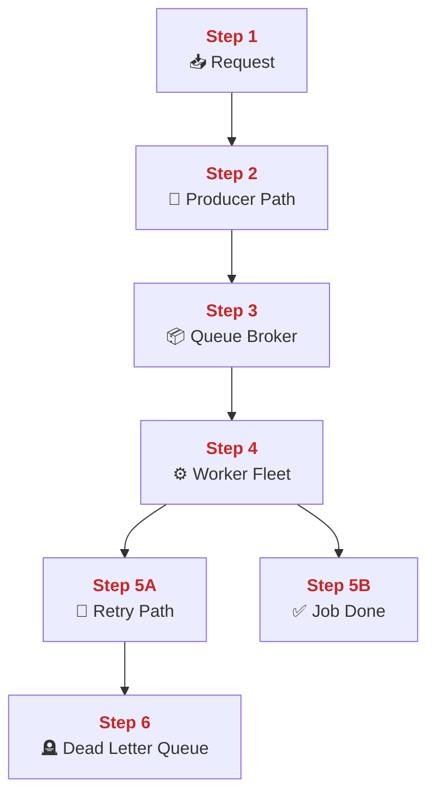
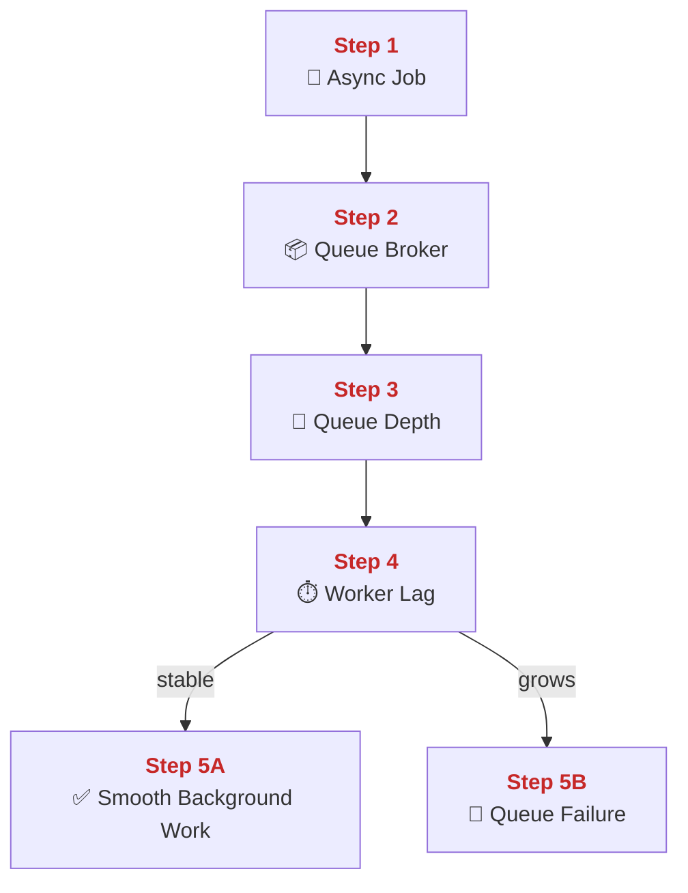
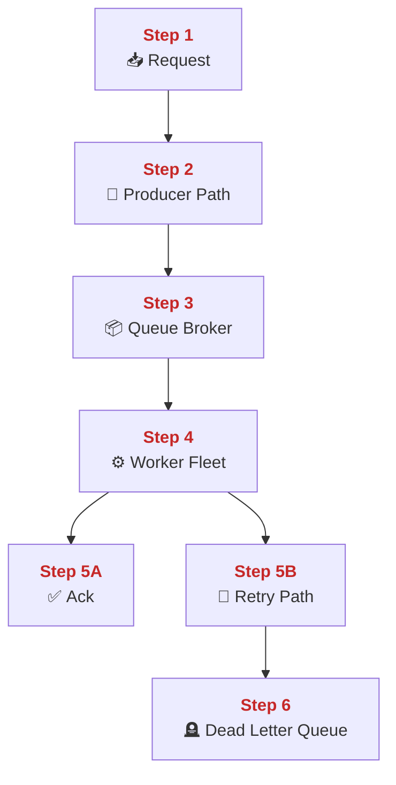
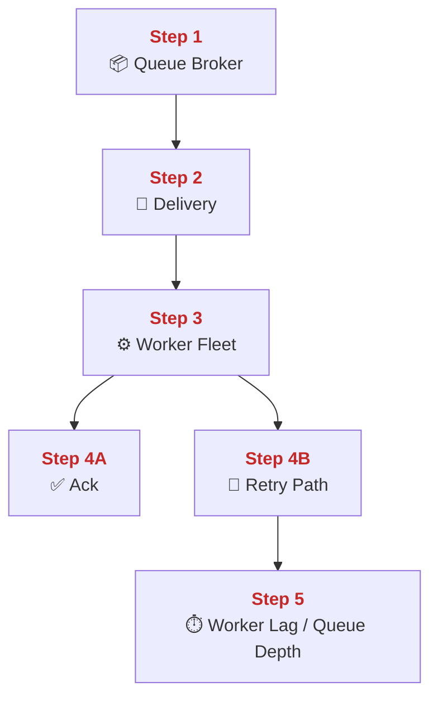
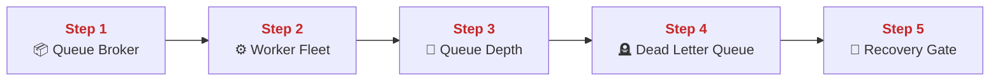
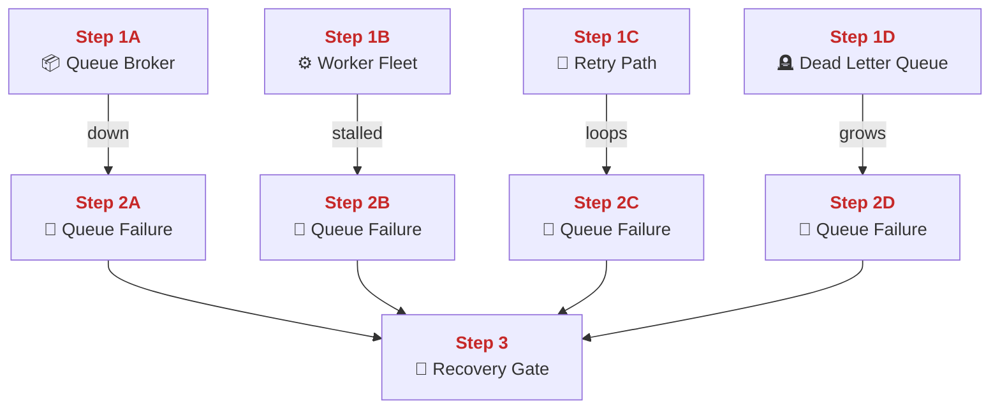
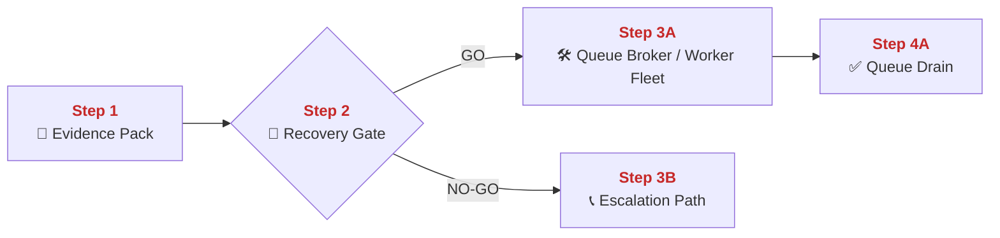
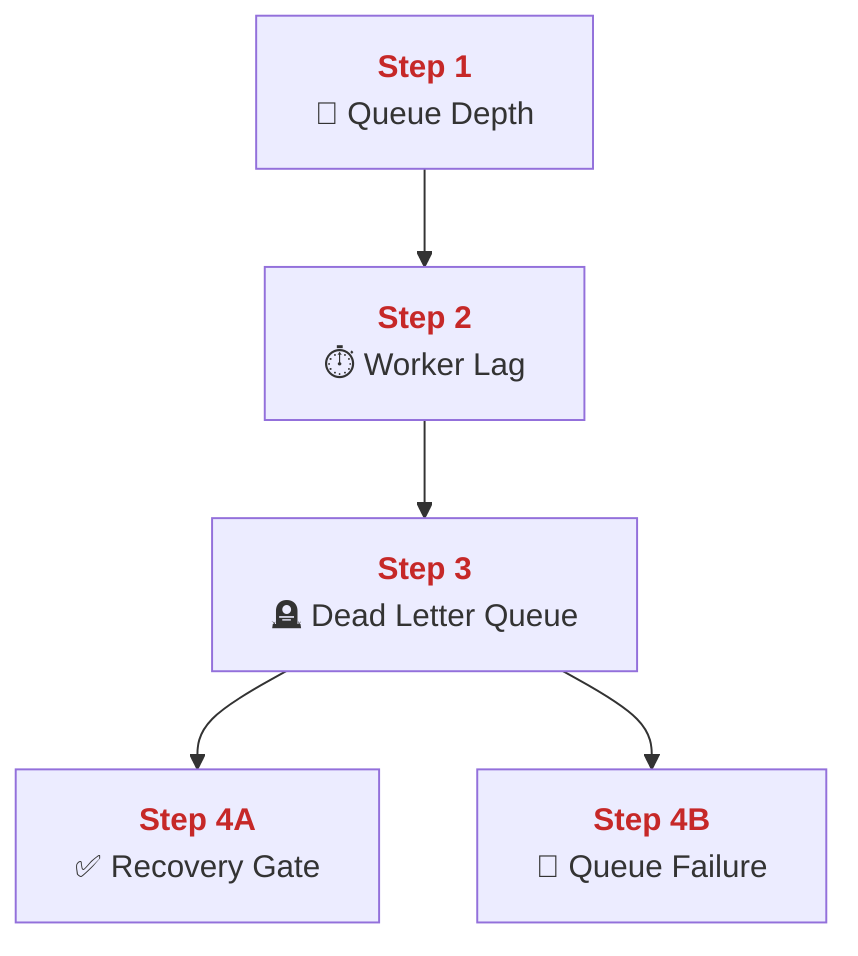

## 02 Async and Queues

This chapter explains how PolyMoly moves slow work out of the live request path and into background workers.
It also explains how RabbitMQ, worker fleets, retries, and dead-letter paths let the platform absorb bursts without forcing users to wait for every expensive task.

---

## Quick Jump

- [Visual Contract Map](#visual-contract-map)
- [Vocabulary Dictionary](#vocabulary-dictionary)
- [1. Problem and Purpose](#1-problem-and-purpose)
- [2. End User Flow](#2-end-user-flow)
- [3. How It Works](#3-how-it-works)
- [4. Architectural Decision (ADR Format)](#4-architectural-decision-adr-format)
- [5. How It Fails](#5-how-it-fails)
- [6. How To Fix (Runbook Safety Standard)](#6-how-to-fix-runbook-safety-standard)
- [7. GO / NO-GO Panels](#7-go--no-go-panels)
- [8. Evidence Pack](#8-evidence-pack)
- [9. Operational Checklist](#9-operational-checklist)
- [10. CI / Quality Gate Reference](#10-ci--quality-gate-reference)
- [What Did We Learn](#what-did-we-learn)

---

## Visual Contract Map

### ADU: Async Delivery Path

#### Technical Definition

- **[Async Job](#term-async-job)**: A unit of work moved out of the live request path.
- **[Queue Broker](#term-queue-broker)**: The message system that stores jobs until a worker consumes them.
- **[Producer Path](#term-producer-path)**: The application path that publishes a job into the broker.
- **[Worker Fleet](#term-worker-fleet)**: The set of background workers that consume queued jobs.
- **[Retry Path](#term-retry-path)**: The controlled reprocessing path for transient job failures.
- **[Dead Letter Queue](#term-dead-letter-queue)**: The queue that stores jobs that should not be retried forever.

#### Diagram



#### 📖 Deterministic Story

- <span style="color:#c62828"><strong>Step 1:</strong></span> A request creates an **[Async Job](#term-async-job)** instead of doing all work inline.
- <span style="color:#c62828"><strong>Step 2:</strong></span> The **[Producer Path](#term-producer-path)** publishes that job.
- <span style="color:#c62828"><strong>Step 3:</strong></span> The **[Queue Broker](#term-queue-broker)** stores the job until it is consumed.
- <span style="color:#c62828"><strong>Step 4:</strong></span> The **[Worker Fleet](#term-worker-fleet)** pulls and executes the job.
- <span style="color:#c62828"><strong>Step 5A:</strong></span> Temporary failures use the **[Retry Path](#term-retry-path)**.
- <span style="color:#c62828"><strong>Step 6:</strong></span> Repeated bad jobs land in the **[Dead Letter Queue](#term-dead-letter-queue)** instead of blocking the system forever.

#### 🧠 Conceptual Layer

Here is what physically happens inside the system:

Step 1 begins in the synchronous request handler. A user request reaches an app process, but the expensive part of the work is wrapped into an **[Async Job](#term-async-job)** instead of being completed before the response returns. The network action is the normal inbound request to the app. In memory, the app builds a job payload containing the minimum data needed for later execution. The decision is whether the current request should keep waiting for the expensive work or hand it off. If the answer is handoff, the next network action is a publish call to the broker.

Step 2 is the **[Producer Path](#term-producer-path)**. The application process opens a connection to RabbitMQ and publishes the job to the correct queue. The network action is an AMQP publish over the broker connection. In memory, the app keeps the payload long enough to serialize it and confirm that the publish call completed. The decision here is whether the job has been accepted by the broker. If yes, the next network action is the response back to the user and later broker-to-worker delivery.

Step 3 is the **[Queue Broker](#term-queue-broker)**. RabbitMQ stores the message in the queue until a worker is ready. The network action is broker I/O on the AMQP channel plus internal broker state changes. In memory, the broker keeps queue depth, delivery state, acknowledgement state, and message metadata. The decision is whether the message should stay queued, be delivered to a consumer, or be moved to a retry or dead-letter path later.

Step 4 is the **[Worker Fleet](#term-worker-fleet)**. A PHP, Node, or Go worker opens a consumer channel, receives the message, processes it, and decides whether to acknowledge it. The network action is AMQP delivery from broker to worker and any downstream calls the job itself makes. In memory, the worker keeps the current job payload, retry count, temporary execution state, and acknowledgement state. The decision is whether the job completed successfully or failed in a way that may be retried.

Step 5A is the **[Retry Path](#term-retry-path)**. If the job failed for a temporary reason, the system can requeue or route it through the retry setup rather than losing it immediately. The network action is the message state change back through RabbitMQ. In memory, the broker and worker track delivery attempts and current message status. The decision is whether the failure still looks temporary or whether it has crossed the allowed retry limit.

Step 5B is the success branch. The worker acknowledges the message and the broker removes it from the active queue. The next network action is simply the absence of another retry for that job.

Step 6 is the **[Dead Letter Queue](#term-dead-letter-queue)**. If the job keeps failing or is invalid, it is moved aside so it does not poison the main queue forever. The network action is broker routing into the DLQ. In memory, the broker now treats that job as quarantined instead of ready for normal processing.

#### 🧩 Imagine It Like

- The front desk writes a task card and drops it into the back-office tray.
- The tray system ([Queue Broker](#term-queue-broker)) holds the card until one worker takes it.
- If the card keeps failing, it goes into the problem tray ([Dead Letter Queue](#term-dead-letter-queue)) instead of blocking the main tray forever.

#### 🔎 Lemme Explain

- Async design is not “ignore the work.” It is “move the work to a controlled background path.”
- Retries and DLQ exist so one bad job does not block every good job behind it.

---

## Vocabulary Dictionary

### Technical Definition

- <a id="term-async-job"></a> **[Async Job](#term-async-job)**: A unit of work moved out of the live request path.
- <a id="term-queue-broker"></a> **[Queue Broker](https://www.rabbitmq.com/)**: The message system that stores jobs until a worker consumes them.
- <a id="term-producer-path"></a> **[Producer Path](#term-producer-path)**: The application path that publishes a job into the broker.
- <a id="term-worker-fleet"></a> **[Worker Fleet](#term-worker-fleet)**: The set of background workers that consume queued jobs.
- <a id="term-retry-path"></a> **[Retry Path](#term-retry-path)**: The controlled reprocessing path for transient job failures.
- <a id="term-dead-letter-queue"></a> **[Dead Letter Queue](#term-dead-letter-queue)**: The queue that stores jobs that should not be retried forever.
- <a id="term-queue-depth"></a> **[Queue Depth](#term-queue-depth)**: The current number of waiting messages in a queue.
- <a id="term-worker-lag"></a> **[Worker Lag](#term-worker-lag)**: The delay between message creation and successful processing.
- <a id="term-queue-failure"></a> **[Queue Failure](#term-queue-failure)**: A condition that breaks safe publish, consume, retry, or drain behavior.
- <a id="term-recovery-gate"></a> **[Recovery Gate](#term-recovery-gate)**: The GO / NO-GO decision made before queue mutation.
- <a id="term-evidence-pack"></a> **[Evidence Pack](#term-evidence-pack)**: The minimum broker, worker, and queue evidence gathered before mutation.
- <a id="term-escalation-path"></a> **[Escalation Path](#term-escalation-path)**: The responder route used when queue behavior cannot be restored safely by direct action.

---

## 1. Problem and Purpose

### Trust Boundary

- External entry: Producers publish work into the request-to-broker handoff path.
- Protected side: Queue state, delivery acknowledgements, and worker side effects stay behind the broker boundary.
- Failure posture: If publish, ack, or drain state is ambiguous, stop mutation and inspect the queue before continuing.

### ADU: Why We Delay Work On Purpose

#### Technical Definition

- **[Async Job](#term-async-job)**: A unit of work moved out of the live request path.
- **[Queue Broker](#term-queue-broker)**: The message system that stores jobs until a worker consumes them.
- **[Queue Depth](#term-queue-depth)**: The current number of waiting messages in a queue.
- **[Worker Lag](#term-worker-lag)**: The delay between message creation and successful processing.
- **[Queue Failure](#term-queue-failure)**: A condition that breaks safe publish, consume, retry, or drain behavior.

#### Diagram



#### 📖 Deterministic Story

- <span style="color:#c62828"><strong>Step 1:</strong></span> The system creates an **[Async Job](#term-async-job)** to keep the live request short.
- <span style="color:#c62828"><strong>Step 2:</strong></span> The **[Queue Broker](#term-queue-broker)** holds the job until a worker is ready.
- <span style="color:#c62828"><strong>Step 3:</strong></span> **[Queue Depth](#term-queue-depth)** shows how much work is waiting.
- <span style="color:#c62828"><strong>Step 4:</strong></span> **[Worker Lag](#term-worker-lag)** shows how long work waits before completion.
- <span style="color:#c62828"><strong>Step 5A:</strong></span> Stable depth and lag mean the async path is healthy.
- <span style="color:#c62828"><strong>Step 5B:</strong></span> Growing depth and lag become **[Queue Failure](#term-queue-failure)**.

#### 🧠 Conceptual Layer

Here is what physically happens inside the system:

Step 1 is the decision to create an **[Async Job](#term-async-job)**. The app sees work that does not need to block the user's response. The network action is still the live request. In memory, the app builds a message payload and keeps it briefly before publish. The decision is whether the work belongs to the fast user path or the slow background path. If it belongs to the background path, the next network action is message publish.

Step 2 is the **[Queue Broker](#term-queue-broker)** storing the job. The network action is AMQP publish and queue persistence or in-memory broker handling. In memory, the broker now has the message in queue state instead of inside the app process. The decision is whether a worker is available now or whether the message should wait.

Step 3 is **[Queue Depth](#term-queue-depth)**. This is not a concept in the abstract. It is the broker's current count of waiting messages. In memory, RabbitMQ keeps that count as messages enter and leave. The decision is whether current depth still matches expected consumer capacity.

Step 4 is **[Worker Lag](#term-worker-lag)**. Workers consume jobs later than they were published. The time gap between publish and completion is measured by the system. In memory, workers and monitoring tools compare timestamps or queue age. The decision is whether delay remains normal or is growing into backlog.

Step 5A is the healthy branch. Jobs wait a little, then workers drain them. Step 5B is **[Queue Failure](#term-queue-failure)**. If depth and lag both keep growing, the system is absorbing more work than the workers can finish. That is why queue metrics matter as much as queue existence.

#### 🧩 Imagine It Like

- You put job cards into a tray so the front desk can keep moving.
- The tray stack height is the queue depth ([Queue Depth](#term-queue-depth)).
- The age of the oldest card is the worker lag ([Worker Lag](#term-worker-lag)).

#### 🔎 Lemme Explain

- Async exists to trade immediate waiting for controlled background work.
- If backlog grows faster than workers drain it, users are only seeing delayed pain, not removed pain.

---

## 2. End User Flow

### ADU: Request To Background Completion

#### Technical Definition

- **[Producer Path](#term-producer-path)**: The application path that publishes a job into the broker.
- **[Queue Broker](#term-queue-broker)**: The message system that stores jobs until a worker consumes them.
- **[Worker Fleet](#term-worker-fleet)**: The set of background workers that consume queued jobs.
- **[Retry Path](#term-retry-path)**: The controlled reprocessing path for transient job failures.
- **[Dead Letter Queue](#term-dead-letter-queue)**: The queue that stores jobs that should not be retried forever.

#### Diagram



#### 📖 Deterministic Story

- <span style="color:#c62828"><strong>Step 1:</strong></span> A request reaches the application.
- <span style="color:#c62828"><strong>Step 2:</strong></span> The **[Producer Path](#term-producer-path)** publishes the background job.
- <span style="color:#c62828"><strong>Step 3:</strong></span> The **[Queue Broker](#term-queue-broker)** stores the job.
- <span style="color:#c62828"><strong>Step 4:</strong></span> The **[Worker Fleet](#term-worker-fleet)** consumes the job.
- <span style="color:#c62828"><strong>Step 5A:</strong></span> Successful jobs are acknowledged.
- <span style="color:#c62828"><strong>Step 5B:</strong></span> Temporary failures move through the **[Retry Path](#term-retry-path)**.
- <span style="color:#c62828"><strong>Step 6:</strong></span> Repeated bad jobs land in the **[Dead Letter Queue](#term-dead-letter-queue)**.

#### 🧠 Conceptual Layer

Here is what physically happens inside the system:

Step 1 begins when a live request reaches the app. The network action is a normal user-facing HTTP request. In memory, the app decides whether some part of the requested work should be delayed into the background.

Step 2 is the **[Producer Path](#term-producer-path)**. The app serializes the job payload and publishes it to RabbitMQ. The network action is AMQP publish over the broker socket. In memory, the app holds the message bytes only long enough to publish them.

Step 3 is the **[Queue Broker](#term-queue-broker)** holding the job. RabbitMQ now becomes the temporary owner of the task. In memory, the broker keeps queue state, delivery state, and message metadata. The decision is when a worker should receive the job.

Step 4 is the **[Worker Fleet](#term-worker-fleet)**. One background worker receives the message over its consumer connection. In memory, that worker now owns the current job payload and delivery state. The decision is whether the job succeeded, should be retried, or should be abandoned.

Step 5A is the success branch. The worker acknowledges the message and RabbitMQ removes it from the active queue. Step 5B is the temporary-failure branch. The job is sent through the **[Retry Path](#term-retry-path)** instead of being treated as complete.

Step 6 is the **[Dead Letter Queue](#term-dead-letter-queue)**. After enough failed attempts, the message is moved aside so it stops poisoning the main queue. That keeps the primary queue moving even when a few jobs are bad.

#### 🧩 Imagine It Like

- The front desk writes a task card.
- The tray system holds it until a back-office worker takes it.
- If the worker keeps failing the same card, it moves to the problem tray instead of blocking the whole office.

#### 🔎 Lemme Explain

- Async flow still has strict ownership at each step.
- The broker owns the message until a worker takes it, and the worker must then either ack it or return it to a controlled failure path.

---

## 3. How It Works

### ADU: RabbitMQ And Worker Mechanics

#### Technical Definition

- **[Queue Broker](#term-queue-broker)**: The message system that stores jobs until a worker consumes them.
- **[Worker Fleet](#term-worker-fleet)**: The set of background workers that consume queued jobs.
- **[Queue Depth](#term-queue-depth)**: The current number of waiting messages in a queue.
- **[Worker Lag](#term-worker-lag)**: The delay between message creation and successful processing.
- **[Retry Path](#term-retry-path)**: The controlled reprocessing path for transient job failures.

#### Diagram



#### 📖 Deterministic Story

- <span style="color:#c62828"><strong>Step 1:</strong></span> The **[Queue Broker](#term-queue-broker)** keeps waiting messages.
- <span style="color:#c62828"><strong>Step 2:</strong></span> A message is delivered to a consumer connection.
- <span style="color:#c62828"><strong>Step 3:</strong></span> The **[Worker Fleet](#term-worker-fleet)** executes the job.
- <span style="color:#c62828"><strong>Step 4A:</strong></span> Success leads to acknowledgement.
- <span style="color:#c62828"><strong>Step 4B:</strong></span> Temporary failure leads to the **[Retry Path](#term-retry-path)**.
- <span style="color:#c62828"><strong>Step 5:</strong></span> **[Queue Depth](#term-queue-depth)** and **[Worker Lag](#term-worker-lag)** reveal whether the system is keeping up.

#### 🧠 Conceptual Layer

Here is what physically happens inside the system:

Step 1 is RabbitMQ holding waiting messages. The network action is publish traffic entering the broker. In memory, RabbitMQ keeps per-queue counters, delivery tags, message routing state, and ready/unacked state. The decision is whether a message stays ready or is dispatched to a consumer.

Step 2 is delivery. RabbitMQ chooses a consumer channel and sends the message across the AMQP connection. The network action is the broker-to-worker delivery frame. In memory, the broker moves the message from ready to in-flight state for that worker.

Step 3 is the **[Worker Fleet](#term-worker-fleet)** doing the actual job. The worker process reads the payload, performs the business task, and decides how to finish. The network action can include database, HTTP, or cache calls triggered by the job. In memory, the worker keeps the current job state, retry count, and result state.

Step 4A is acknowledgement. The worker sends an ack and the broker removes the job from active delivery. Step 4B is the retry branch. The worker or broker returns the job to a controlled retry path if the failure looks temporary.

Step 5 is the visibility layer. **[Queue Depth](#term-queue-depth)** tells how many jobs are waiting. **[Worker Lag](#term-worker-lag)** tells how long they wait. Those two values together show whether the worker fleet is actually draining the broker or silently falling behind.

#### 🧩 Imagine It Like

- The tray stack is the queue depth ([Queue Depth](#term-queue-depth)).
- The age of the top waiting card is the worker lag ([Worker Lag](#term-worker-lag)).
- A healthy office keeps both small enough that people are not waiting forever.

#### 🔎 Lemme Explain

- Broker mechanics are not only about message existence. They are about message movement and drainage speed.
- If you only count published jobs and ignore lag, you can miss the real backlog problem.

---

## 4. Architectural Decision (ADR Format)

### ADU: Broker Before Burst

#### Technical Definition

- **[Queue Broker](#term-queue-broker)**: The message system that stores jobs until a worker consumes them.
- **[Worker Fleet](#term-worker-fleet)**: The set of background workers that consume queued jobs.
- **[Queue Depth](#term-queue-depth)**: The current number of waiting messages in a queue.
- **[Dead Letter Queue](#term-dead-letter-queue)**: The queue that stores jobs that should not be retried forever.
- **[Recovery Gate](#term-recovery-gate)**: The GO / NO-GO decision made before queue mutation.

#### Diagram



#### 📖 Deterministic Story

- <span style="color:#c62828"><strong>Step 1:</strong></span> The **[Queue Broker](#term-queue-broker)** is the buffer before burst pressure hits workers.
- <span style="color:#c62828"><strong>Step 2:</strong></span> The **[Worker Fleet](#term-worker-fleet)** drains work at its own pace.
- <span style="color:#c62828"><strong>Step 3:</strong></span> **[Queue Depth](#term-queue-depth)** reveals whether burst absorption is still healthy.
- <span style="color:#c62828"><strong>Step 4:</strong></span> The **[Dead Letter Queue](#term-dead-letter-queue)** protects the main queue from poison jobs.
- <span style="color:#c62828"><strong>Step 5:</strong></span> The **[Recovery Gate](#term-recovery-gate)** blocks unsafe mutations during backlog incidents.

#### 🧠 Conceptual Layer

Here is what physically happens inside the system:

Step 1 is why the broker exists. The request path can publish jobs faster than workers can finish them. The broker absorbs that mismatch. The network action is message publish into RabbitMQ. In memory, RabbitMQ keeps a queue of waiting jobs instead of forcing the user request to block on full job completion.

Step 2 is the worker side. Workers consume as fast as they can, but their rate is limited by CPU, downstream systems, and job cost. The network action is consumer delivery and downstream calls. In memory, each worker only holds the jobs it is currently processing, not the entire burst.

Step 3 is **[Queue Depth](#term-queue-depth)**. This number tells whether the broker is merely buffering a burst or accumulating a traffic debt. The decision is whether the current worker fleet is enough.

Step 4 is the **[Dead Letter Queue](#term-dead-letter-queue)**. Without it, poison jobs can circulate forever and keep the main queue unhealthy. The broker needs a quarantine path so that the main work path stays drainable.

Step 5 is the **[Recovery Gate](#term-recovery-gate)**. During a backlog incident, responders must decide whether to retry, scale, pause publishes, or escalate. This is not a blind restart problem. It is a queue-state decision problem.

#### 🧩 Imagine It Like

- The tray is there to absorb the rush.
- The problem tray is there to stop bad cards from poisoning the normal tray.
- The desk lead still has to decide whether the office needs more workers or a deeper fix.

#### 🔎 Lemme Explain

- The broker is not just storage. It is a shock absorber.
- DLQ is not optional cleanup. It is part of keeping the normal queue usable.

---

## 5. How It Fails

### ADU: Queue Failure Modes

#### Technical Definition

- **[Queue Broker](#term-queue-broker)**: The message system that stores jobs until a worker consumes them.
- **[Worker Fleet](#term-worker-fleet)**: The set of background workers that consume queued jobs.
- **[Retry Path](#term-retry-path)**: The controlled reprocessing path for transient job failures.
- **[Dead Letter Queue](#term-dead-letter-queue)**: The queue that stores jobs that should not be retried forever.
- **[Queue Failure](#term-queue-failure)**: A condition that breaks safe publish, consume, retry, or drain behavior.
- **[Recovery Gate](#term-recovery-gate)**: The GO / NO-GO decision made before queue mutation.

#### Diagram



#### 📖 Deterministic Story

- <span style="color:#c62828"><strong>Step 1A:</strong></span> The **[Queue Broker](#term-queue-broker)** can fail or become unreachable.
- <span style="color:#c62828"><strong>Step 1B:</strong></span> The **[Worker Fleet](#term-worker-fleet)** can stall or fall behind.
- <span style="color:#c62828"><strong>Step 1C:</strong></span> The **[Retry Path](#term-retry-path)** can loop instead of recovering.
- <span style="color:#c62828"><strong>Step 1D:</strong></span> The **[Dead Letter Queue](#term-dead-letter-queue)** can keep growing.
- <span style="color:#c62828"><strong>Step 3:</strong></span> Any of these becomes a **[Queue Failure](#term-queue-failure)** and requires the **[Recovery Gate](#term-recovery-gate)**.

#### 🧠 Conceptual Layer

Here is what physically happens inside the system:

Step 1A is broker failure. The producer or worker sockets to RabbitMQ break, time out, or refuse connections. In memory, the broker no longer keeps normal queue state for that path. The decision is whether messages can still be published or delivered at all.

Step 1B is worker stall. The broker is still alive, but the worker fleet is not draining messages quickly enough. In memory, queue depth and unacked state keep growing. The decision is whether the workers are actually making progress.

Step 1C is retry-loop failure. Messages keep bouncing through the **[Retry Path](#term-retry-path)** without real recovery. In memory, retry counters and requeue state keep changing, but the job never clears. The decision is whether the job is temporarily bad or permanently bad.

Step 1D is DLQ growth. More messages land in the **[Dead Letter Queue](#term-dead-letter-queue)** than responders can inspect or fix. In memory, the broker treats more and more messages as quarantined. The decision is whether DLQ growth reflects a few bad jobs or a larger system problem.

Step 3 is why this is one **[Queue Failure](#term-queue-failure)** family but not one identical incident. Broker outage, worker stall, retry loops, and DLQ growth all fail at different points in the path and need different responses. The **[Recovery Gate](#term-recovery-gate)** exists so responders classify before they mutate.

#### 🧩 Imagine It Like

- The tray system can stop moving.
- The workers can stop taking cards.
- The retry desk can keep bouncing the same broken card.
- The problem tray can fill up faster than people clear it.

#### 🔎 Lemme Explain

- Queue incidents are not all “Rabbit is down.”
- The exact failed stage tells you whether to fix the broker, the workers, the retry logic, or the poisoned jobs.

| Symptom | Root Cause | Severity | Fastest confirmation step |
| :--- | :--- | :--- | :--- |
| Publish fails | **[Queue Broker](#term-queue-broker)** unreachable | Sev-1 | `docker compose logs rabbitmq --tail=100` |
| Queue depth grows fast | stalled **[Worker Fleet](#term-worker-fleet)** | Sev-1 | worker logs + queue metrics |
| Same jobs repeat | broken **[Retry Path](#term-retry-path)** | Sev-2 | compare retry timestamps |
| DLQ grows non-zero | toxic jobs in **[Dead Letter Queue](#term-dead-letter-queue)** | Sev-1 | `RabbitDLQGrowing` alert |

---

## 6. How To Fix (Runbook Safety Standard)

### ADU: Restore Queue Drain Safely

#### Technical Definition

- **[Evidence Pack](#term-evidence-pack)**: The minimum broker, worker, and queue evidence gathered before mutation.
- **[Recovery Gate](#term-recovery-gate)**: The GO / NO-GO decision made before queue mutation.
- **[Queue Broker](#term-queue-broker)**: The message system that stores jobs until a worker consumes them.
- **[Worker Fleet](#term-worker-fleet)**: The set of background workers that consume queued jobs.
- **[Queue Failure](#term-queue-failure)**: A condition that breaks safe publish, consume, retry, or drain behavior.
- **[Escalation Path](#term-escalation-path)**: The responder route used when queue behavior cannot be restored safely by direct action.

#### Diagram



#### 📖 Deterministic Story

- <span style="color:#c62828"><strong>Step 1:</strong></span> The **[Evidence Pack](#term-evidence-pack)** is collected before restart or replay.
- <span style="color:#c62828"><strong>Step 2:</strong></span> The **[Recovery Gate](#term-recovery-gate)** decides whether direct queue mutation is safe.
- <span style="color:#c62828"><strong>Step 3A:</strong></span> If GO, operators repair the **[Queue Broker](#term-queue-broker)** or **[Worker Fleet](#term-worker-fleet)** path.
- <span style="color:#c62828"><strong>Step 4A:</strong></span> The queue must begin draining again.
- <span style="color:#c62828"><strong>Step 3B:</strong></span> If NO-GO, operators use the **[Escalation Path](#term-escalation-path)**.

#### 🧠 Conceptual Layer

Here is what physically happens inside the system:

Step 1 is evidence collection. The responder checks queue depth, worker lag, RabbitMQ logs, and worker logs before touching the system. The network actions are read-only dashboard reads, log reads, and broker health checks. In memory, the responder now has a snapshot of backlog, consumer state, and failure stage.

Step 2 is the **[Recovery Gate](#term-recovery-gate)**. The responder decides whether the issue is a simple broker/worker restart problem or a deeper poisoned-message or dependency problem. The network action is still read-only. In memory, the responder compares the current queue picture with the expected normal drain pattern.

Step 3A is the GO branch. The responder restarts RabbitMQ or the workers, or both, only after the failing stage is understood. The network action is a container runtime control call. In memory, the runtime replaces the live container state for those services. The decision is whether the restarted components reconnect and resume consuming safely.

Step 4A is verification. The queue depth should begin falling, worker lag should stop growing, and new jobs should complete or retry correctly. The network action is fresh observation of the broker and workers under live load. In memory, the responder compares before and after state to confirm actual drainage.

Step 3B is the NO-GO branch. If the queue picture suggests poison jobs, broken downstreams, or unknown replay risk, the responder escalates instead of blindly replaying work.

#### 🧩 Imagine It Like

- You count the waiting cards and check which desks are frozen before you touch the office.
- You only restart desks after you know whether the problem is the tray system, the workers, or a pile of toxic cards.

#### 🔎 Lemme Explain

- The real recovery target is queue drain, not simply “RabbitMQ process restarted.”
- If depth and lag do not improve, the async path is still broken.

### Exact Runbook Commands

```bash
# Read-only checks
docker compose ps rabbitmq php-worker node-worker go-worker
docker compose logs rabbitmq --tail=100
docker compose logs php-worker node-worker go-worker --tail=100
```

```bash
# Mutation (only after Evidence Pack is captured and Recovery Gate is GO)
docker compose restart rabbitmq php-worker node-worker go-worker
```

```bash
# Verify
docker compose ps rabbitmq php-worker node-worker go-worker
docker compose logs rabbitmq --since=2m
docker compose logs php-worker node-worker go-worker --since=2m
```

Rollback rule:
- Do not replay or purge queues blindly.
- Keep the main queue intact until the failing stage is classified.

---

## 7. GO / NO-GO Panels

### ADU: Queue Drain Decision

#### Technical Definition

- **[Queue Depth](#term-queue-depth)**: The current number of waiting messages in a queue.
- **[Worker Lag](#term-worker-lag)**: The delay between message creation and successful processing.
- **[Recovery Gate](#term-recovery-gate)**: The GO / NO-GO decision made before queue mutation.
- **[Queue Failure](#term-queue-failure)**: A condition that breaks safe publish, consume, retry, or drain behavior.
- **[Dead Letter Queue](#term-dead-letter-queue)**: The queue that stores jobs that should not be retried forever.

#### Diagram



#### 📖 Deterministic Story

- <span style="color:#c62828"><strong>Step 1:</strong></span> **[Queue Depth](#term-queue-depth)** must stay within expected range.
- <span style="color:#c62828"><strong>Step 2:</strong></span> **[Worker Lag](#term-worker-lag)** must remain stable enough for the current workload.
- <span style="color:#c62828"><strong>Step 3:</strong></span> The **[Dead Letter Queue](#term-dead-letter-queue)** must not grow as a hidden failure sink.
- <span style="color:#c62828"><strong>Step 4A:</strong></span> If those checks hold, the **[Recovery Gate](#term-recovery-gate)** may remain GO.
- <span style="color:#c62828"><strong>Step 4B:</strong></span> If they do not hold, the state remains **[Queue Failure](#term-queue-failure)**.

#### 🧠 Conceptual Layer

Here is what physically happens inside the system:

Step 1 checks queue depth. The broker reports how many jobs are waiting. The decision is whether backlog is bounded or growing without control.

Step 2 checks worker lag. The system compares enqueue time and completion time. The decision is whether workers are catching up or falling behind.

Step 3 checks DLQ growth. The system looks for messages that keep failing and getting quarantined. The decision is whether the queue system is degrading into a poison-message problem.

Step 4A is GO when those three signals stay healthy enough to trust mutation or continued rollout. Step 4B is NO-GO when they show a draining failure. That is the queue gate in practical terms.

#### 🧩 Imagine It Like

- Count how many cards are waiting.
- Check how old the cards are.
- Check how many are piling up in the problem tray.

#### 🔎 Lemme Explain

- Queue health is not one number.
- Depth, lag, and DLQ together tell whether the async path is really healthy.

---

## 8. Evidence Pack

Collect before mutation:

- RabbitMQ logs for the incident window.
- Worker logs for the same window.
- Queue depth trend.
- Worker lag trend.
- DLQ growth state.
- The last known successful job path.

---

## 9. Operational Checklist

- [ ] Broker health confirmed.
- [ ] Worker health confirmed.
- [ ] Queue depth confirmed.
- [ ] Worker lag confirmed.
- [ ] DLQ state confirmed.
- [ ] Mutation approved explicitly.

---

## 10. CI / Quality Gate Reference

Run:

```bash
task docs:governance
task docs:governance:strict
go run ./system/tools/poly/cmd/poly gate check performance-review
go run ./system/tools/poly/cmd/poly gate check hardening-core
```

Related workflows and evidence:

- `.github/workflows/performance-lab-gate.yml`
- `tools/artifacts/performance-review/*`
- `tools/artifacts/docs-governance/checks.tsv`
- `tools/artifacts/docs-links/checks.tsv`

---

## What Did We Learn

- Async work moves waiting, it does not erase waiting.
- Queue depth, lag, and DLQ show whether the broker path is healthy.
- Good retries protect throughput; bad retries hide broken jobs.

👉 Next Chapter: **[01-redis-and-caching.md](../backing-services/01-redis-and-caching.md)**
