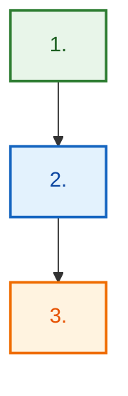
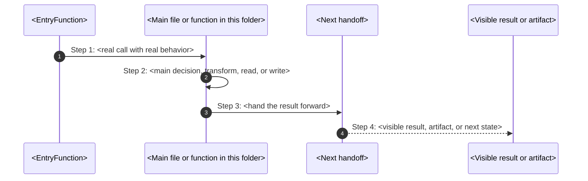
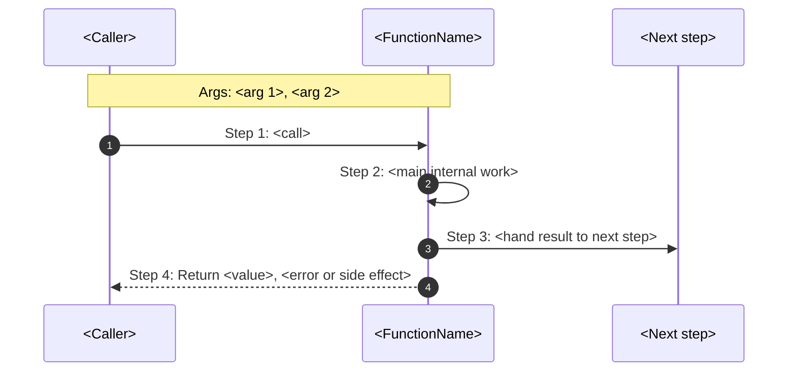

# How-This-Works Template

This file is a thin execution scaffold.

The real law lives in
[how-to-document-flow.md](./how-to-document-flow.md).

If this template and the flow law disagree, the flow law wins.

Use this template to start quickly.
Do not use it as an excuse to stay generic.

The target style is:

- easy enough for a new teammate who does not know Go yet
- concrete enough that an operator can debug from it
- direct enough that the reader can point to the first file and function

## 0) Before You Write

Collect these facts first:

1. one real command or trigger
2. the first file and first function
3. the main decision owner
4. the next handoff
5. the visible result
6. the failure path
7. what gets written, changed, observed, or printed
8. the terms a new reader will confuse

If you do not know those answers yet, keep reading code before you write prose.

## 1) Required Frontmatter

```yaml
---
title: <folder-name>-how-this-works
owner: <team-or-surface-owner>
last_reviewed: YYYY-MM-DD
classification: internal
---
```

## 2) Pick The Honest Folder Shape

Use one of these two openings.

### 2.1 Command-Facing Folder

Use this when a real typed `poly ...` command reaches the folder.

Required heading pair:

- `## Real commands that reach this folder`
- `## Exact CLI front doors`

### 2.2 Internal-Only Folder

Use this when the folder wakes up only after another code path hands work into
it.

Required heading pair:

- `## Real commands or triggers that reach this folder`
- `## Exact upstream handoffs`

Even internal-only pages must still tie themselves to a real command story
through the nearest honest caller.

## 3) Canonical Folder Skeleton

Use this as the starting point.
Replace every placeholder with real code truth.

````md
# <Folder Title> How This Works

## What this folder is

<one or two very plain sentences>

<say what real flow this folder owns>

<optional one-line PM-story bridge such as: "When you type `poly ...`, this is
the folder where the story becomes real.">

## Real commands that reach this folder

- `poly ...`
- `poly ...`

## Exact CLI front doors

- `<entry-file>.go`
- function: `<EntryFunction>(...)`
- `<command>` -> `<next function>(...)`

## The simplest story

- <what enters here>
- <what this folder decides, writes, reads, or renders>
- <where the result goes next>



## The first important path

When you type:

```bash
<exact command>
```

the important path is:



- **Step 1:** <what catches the command>
- **Step 2:** <what this folder really does>
- **Step 3:** <who receives the result next>
- **Step 4:** <what the user sees or what artifact now exists>

<add one or two plain sentences that say what got written, printed, refused,
or left behind on disk>

## Direct files in this folder

<file chapters live here>

## Child folders in this folder

### `<child>/`

Open `<child>/how-this-works.md`.

Use it when the story includes:

- `<command or trigger>`
- `<command or trigger>`

## Debug first

- start in `<FileOrFunction>` when <specific symptom>
- start in `<FileOrFunction>` when <specific symptom>

## What to remember

- <plain truth 1>
- <plain truth 2>
- <plain truth 3>

## Dictionary

<dictionary block lives here>
````

## 4) Internal-Only Folder Variant

If the folder is internal-only, keep the same skeleton but replace only these
headings:

````md
## Real commands or triggers that reach this folder

- `<real command that eventually reaches this slice>`
- `<runtime trigger or gate trigger>`

## Exact upstream handoffs

- `<caller-file>.go`
- function: `<CallerFunction>(...)`
- `<caller>` -> `<function in this folder>(...)`
````

Do not switch to vague wording just because there is no direct CLI entrypoint.

## 5) Direct File Chapter Skeleton

Use one chapter per direct first-party file.

````md
### `<file-name>.go`

This is the file where <one plain sentence>.

Why this name is honest:

- <one responsibility statement>

When the story opens this file:

- `<command or trigger>` -> `<caller>` -> `<this file>`

What arrives here:

- <input 1>
- <input 2>

What leaves this file:

- <returned value>
- <written artifact>
- <visible output if true>

Why you open it first:

```mermaid
sequenceDiagram
    autonumber
    participant Caller as <Caller>
    participant File as <file-name>.go
    participant Next as <Next handoff>

    Note over Caller,File: Input: <input 1>, <input 2>
    Caller->>File: Step 1: <enter this file>
    File->>File: Step 2: <main file-owned work>
    File->>Next: Step 3: <hand concrete result forward>
    Note over File,Next: Output: <return value, artifact, or side effect>
```

- <debug symptom 1>
- <debug symptom 2>



- **Step 1:** <what wakes the file up>
- **Step 2:** <what this file changes, reads, writes, or decides>
- **Step 3:** <what leaves the file and where it goes>

Important functions:

- `<FunctionA>(...)`
- `<FunctionB>(...)`
````

Add one short sentence under each function bullet that explains why that
function exists in human terms.

## 6) Contract-Only File Variant

Use this when a file defines types, constants, or request shape and has no
functions.

````md
### `<file-name>.go`

This file is only the `<command or config>` contract.

It defines:

- `<TypeOrConst>`
- `<TypeOrConst>`

There are no functions here.
That is fine.
Its job is only to name the request or config shape clearly.
````

## 7) Function Chapter Skeleton

Use a full block for Level A and Level B functions.

````md
#### `<FunctionName>(...)`

What this function does:

- <one plain sentence>

Why this function exists:

- <why the parent flow needs this exact action>

Input:

- <arg 1>
- <arg 2>

What it does with that input:

1. <check, normalize, choose, read, render, write, or refuse>
2. <main decision or transformation>
3. <return or handoff>

Output:

- <returned value>
- <side effect>

Why that matters next:

- <next caller benefit>

Where this shows up:

- `<command>`: <what this function contributes>

Open this first when:

- <symptom 1>
- <symptom 2>



- **Step 1:** <what the caller asks for>
- **Step 2:** <what the function decides or changes>
- **Step 3:** <how the work moves forward>
- **Step 4:** <what comes back>
````

## 8) Tiny Helper Variant

Use this for Level C helpers when a full standalone block would add noise.

````md
- `<helperName>(...)`
  Called by `<ParentFunction>(...)`.
  It exists so the parent can keep one small decision separate.
  It returns or changes: <value or side effect>.
  This matters because: <why the caller cares>.
````

## 9) Dictionary Skeleton

End the page with a real dictionary.

````md
## Dictionary

<a id="dictionary-project"></a>
- `project`: <simple and honest definition>

<a id="dictionary-intent"></a>
- `intent`: <simple and honest definition>

<a id="dictionary-runtime"></a>
- `runtime`: <simple and honest definition>
````

Rules:

1. use anchors like `dictionary-project`
2. use relative links when another page owns the better definition
3. explain terms like you are teaching a child, but do not lie

## 10) What You Must Not Forget

The page is not done until it says:

- which exact command or trigger starts the story
- which exact file and function catch it first
- which function makes the important decision
- what gets written, changed, observed, or printed
- what the user sees
- what refusal or failure looks like
- where to debug first
- what the confusing words mean

## 11) Ship Check

Ask these before you stop:

1. Could a new reader retell one exact path from command to result?
2. Did I use real file and function names instead of placeholders?
3. Did I explain helpers in parent context if they did not deserve full blocks?
4. Did I say what gets written to disk or left behind as evidence?
5. Did I say what the user sees?
6. Did I keep the page simple without becoming vague?

If any answer is `no`, revise the page.
