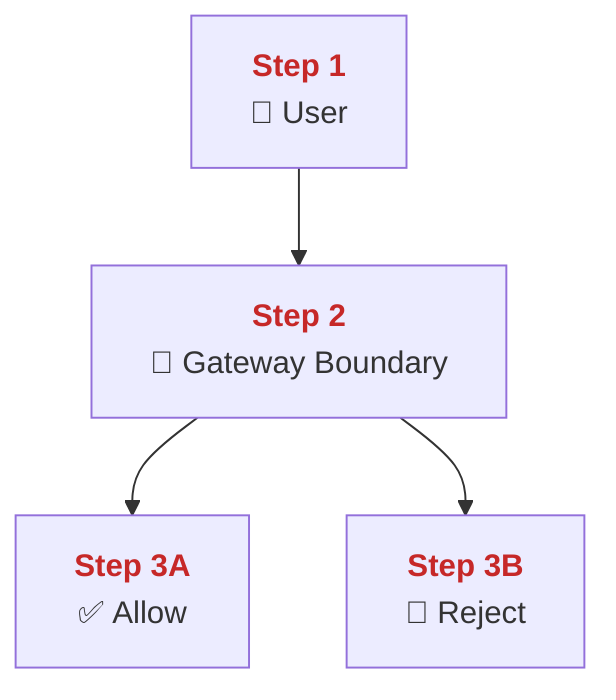
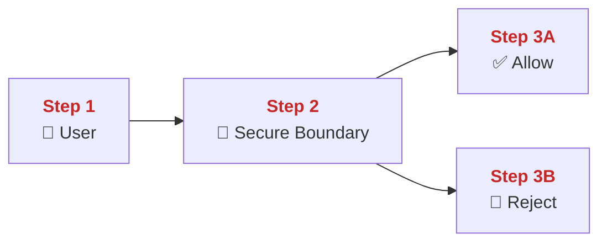

Shared baseline: `system/docs/development/governance/shared/agent-harness/how-to-document.md`
Upstream source: `system/docs/development/governance/upstream-source.lock.json`
Local role: PolyMoly-specific documentation style and operator language contract

# How To Document (Operational Standard)

Version: 3.1.0
Status: Normative / Enforced
Scope: `system/docs/**`

This document defines a repository-agnostic operational documentation standard.
In this repository it is REQUIRED for all technical documentation under `system/docs/**`.
It is designed to teach, enforce, and survive incidents through deterministic
knowledge units.

The doctrine in this file should stay reusable even if repository-specific
tooling, commands, or artifact paths change.

---

## 0) Meta-Governance: Machine-Verifiable Requirements (Normative)

This document is designed for automated validation. The following sections define the formal requirements that MUST be met for a document to be considered "Operational Ready."

### 0.1 Machine-Verifiable Scope

The following elements MUST be machine-verifiable:

- **Structural Integrity**: Presence and order of required headings.
- **ADU Conformance**: Adherence to the formal ADU grammar and layer ordering.
- **Terminology Contract**: First-use linking and declaration of canonical terms.
- **Diagram Taxonomy**: Presence of required diagram categories for specified Tiers.
- **Language Policy**: Detectable non-English narrative blocks.

### 0.2 Automation Hooks

Automation tools MUST implement the following logic:

- **Structural Hooks**: Verify that all 14 mandatory chapter headings exist.
- **Token Detection**: Fail on any occurrence of the **Forbidden Legacy Patterns** (Section 17).
- **Layer Enforcement**: Verify that every ADU block matches the **ADU Grammar** (Section 16.2).
- **Canonical Extraction**: Build a map of terms from `Vocabulary Dictionary` and verify their linked usage in ADUs.
- **Tier Enforcement Hook**: Validate diagram category requirements based on declared `tier` metadata.
- **Control Block Hook**: Validate Trust Boundary, Rollout Decision Matrix, and Incident Response Template blocks where required.

"Any FAIL code generated during validation MUST result in a non-zero exit status in CI/CD. Documentation governance failures MUST block merge."

### 0.3 Repository Binding (PolyMoly)

This standard is intentionally generic.
This repository binds it in these ways:

- scope enforcement currently applies to `system/docs/**`,
- execution inheritance comes from `AGENTS.md`,
- automation currently runs through the PolyMoly docs and gate entrypoints,
- artifact paths and preview commands in this file are current repository
  bindings, not the essence of the doctrine.
- first-party folder flow documents outside `system/docs/**` may reuse this
  writing law through
  `system/docs/development/governance/how-this-works-template.md`; those
  documents use a compact chapter shape, but they still inherit the same ADU,
  vocabulary, visual, and explanatory rules defined here.

If this standard is reused in another repository, keep the doctrine and replace
only the local bindings.

---

## 1) Execution Contract (Normative)

### 1.1 AGENTS.md Inheritance

In this repository, this document inherits the parent execution contract from
`AGENTS.md` -> `5) The "Talk" Rule (10/10 Documentation Standard)`.

Repository-inherited anchors (REQUIRED):

- **Visual Learning First**: Every architectural concept MUST include a diagram. The diagram MUST reinforce mental clarity and support deterministic understanding.
- **Flow Doctrine**: Content MUST start from the end user, then feature path, failure path, fix, and verification.
- **Flow-Based Naming**: File and folder naming MUST reflect documented flow lanes.
- **Creative Metaphors**: Metaphor consistency is REQUIRED. Every chapter MUST include a `Vocabulary Dictionary`.
- **Runbook Reality**: Fix steps MUST be executable, measurable, and safe.
- **Audit Trail**: Evidence MUST exist for every GO / NO-GO decision.
- **Technical Integrity**: Broken links, encoding glitches, or malformed markdown are FORBIDDEN.
- **English-Only**: All narrative content MUST be in English.

### 1.2 Tone Calibration (Normative)

- Keep wording concrete and operational.
- Avoid theatrical qualifiers (`military-grade`, `ultimate`, `invincible`, `magic`) in production docs.
- Prefer measurable claims over hype adjectives.
- Prefer plain English over abstract architecture slogans.
- A first-week junior developer should understand the first screen without
  already knowing the system vocabulary.
- If a smart non-expert cannot answer `what is this`, `when is it used`, `what
  goes in`, and `what comes out`, the opening is too abstract.
- Longer explanation is allowed when it materially improves understanding.
  Compression is not a virtue when it hides the mechanism.

### 1.3 Teaching Clarity Rule (Normative)

Production documentation in this repository must be readable in a
`for-dummies` posture:

- simple enough for a junior developer in week one,
- simple enough for a smart non-expert who is willing to learn,
- detailed enough that the reader does not need tribal knowledge.

This does NOT mean childish or inaccurate writing.
It means:

- say what the thing does before explaining why the architecture is elegant,
- use banal real-life examples when they help,
- use vivid diagrams when a picture explains faster than a paragraph,
- explain the job of a file before explaining the theory of the subsystem,
- explain the job of a function under the file that owns it,
- make debugging entrypoints obvious,
- prefer concrete verbs such as `reads`, `writes`, `builds`, `checks`,
  `copies`, `returns`, and `fails`.

Forbidden opening posture:

- abstract taxonomy before purpose,
- philosophy before responsibility,
- ceremonial language before operational clarity.

Required opening posture:

- `What this is`
- `When it is used`
- `Input`
- `Output`
- optional `If you are debugging`

The reader must be oriented before deep architecture begins.

---

## 2) Mental Discipline Doctrine (Advisory)

Operational documents are a training system for operational excellence.

Technicians MUST be trained to:

- Think under pressure using deterministic models.
- Isolate layers before attempting fixes.
- Move from boundary inward to identify failure nodes.
- Avoid random debugging behavior.
- Collect evidence before any system mutation.

---

## 3) Enforcement Layer: Failure Codes (Normative)

Any violation of this document MUST result in one or more of the following FAIL codes:

| Code | Description | Severity |
| :--- | :--- | :--- |
| **ADU-001** | Missing REQUIRED ADU Layer | Structural FAIL |
| **ADU-002** | Invalid Layer Order within ADU | Structural FAIL |
| **ADU-003** | Forbidden Phrase or Pattern used | Governance FAIL |
| **ADU-004** | Undeclared term used inside Deterministic Story | Terminology FAIL |
| **ADU-005** | Canonical Term used anywhere without declaration in Vocabulary Dictionary | Terminology FAIL |
| **LINK-001** | Missing First-Use Link for Canonical Term | Terminology FAIL |
| **DOC-LANG-001** | Non-English narrative content detected | Governance FAIL |
| **STORY-001** | Everyday Story reuses canonical terms without canonical anchors | Terminology FAIL |
| **STRUCT-001** | Missing any of the 14 REQUIRED headings defined in Section 7 | Structural FAIL |
| **DIAG-001** | Missing Diagram inside required ADU block | Coverage FAIL |
| **DIAG-002** | Diagram introduces undeclared canonical terms | Logic FAIL |
| **TAX-001** | Invalid Diagram Taxonomy (Flow/Elements) | Logic FAIL |
| **ADU-006** | Naked Paragraph detected | Structural FAIL |
| **ADU-007** | ADU Grammar Interleaving detected | Structural FAIL |
| **STRUCT-002** | Invalid Chapter Heading Order | Structural FAIL |
| **STRUCT-003** | Required Trust Boundary mini-block missing | Structural FAIL |
| **STRUCT-004** | Required Rollout Decision Matrix missing | Release FAIL |
| **STRUCT-005** | Required Incident Response Template missing | Operational FAIL |
| **DIAG-003** | Tier-level diagram category requirement missing | Coverage FAIL |

---

## 4) Canonical Term Contract (Normative)

### 4.1 Canonical Term Definition

A Canonical Term is a deterministic technical concept used within a chapter.

A Canonical Term MUST:

- Be declared in the chapter's `Vocabulary Dictionary`.
- Be unique within the chapter context.
- Be linked either to:
  (a) an authoritative external source, OR
  (b) a canonical internal anchor within the same chapter.

External authoritative links are REQUIRED when the term represents an industry-standard concept (RFC, protocol, vendor system, public technology).

Internal anchor linking is REQUIRED for chapter-specific abstractions.

### 4.2 Linking and Reuse Rules

- **First-Use Link Rule**: Any Canonical Term referenced inside ADU narrative layers MUST be linked on its first occurrence within that specific ADU.
- **Link Format**: Use `label -> #anchor-slug` for internal links or `label -> https://authoritative.example/spec` for external.
- **Synonym Prohibition**: Inside the **📖 Deterministic Story**, usage of synonyms for Canonical Terms is FORBIDDEN. Only the declared term or diagram label MUST be used.
- **No New Terms**: **🧠 Conceptual Layer** and **🧩 Imagine It Like** MUST NOT introduce new technical entities. They MAY only reuse Canonical Terms already declared in the same ADU.
- **Generic Implementation Words**: The **🧠 Conceptual Layer** MAY use plain implementation words such as `process`, `socket`, `connection`, `headers`, `in-memory table`, `request body`, `counter`, `span`, `query`, and `network call` without separate Canonical registration, as long as they are descriptive only and not introduced as new reusable system concepts.

---

## 5) Diagram Taxonomy Definition (Normative)

Every diagram MUST adhere to one of the following taxonomies. Mixing taxonomies in a single visual block is FORBIDDEN.

### 5.1 Boundary Diagram

- **Purpose**: Defines system scope and trust perimeters.
- **REQUIRED Elements**: External actors, perimeters, entry points, internal components.
- **Signal Flow**: MUST move from External -> Perimeter -> Internal.

### 5.2 Dynamic Flow Diagram

- **Purpose**: Defines chronological or event-based sequences.
- **REQUIRED Elements**: Triggering event, participating nodes, return values.
- **Signal Flow**: MUST be Left -> Right or Top -> Bottom.

### 5.3 Failure Diagram

- **Purpose**: Defines decision logic for error detection.
- **REQUIRED Elements**: Observation point, decision node, explicit FAIL path, explicit RECOVER/SUCCESS path.

### 5.4 Decision Diagram

- **Purpose**: Defines requirements for GO / NO-GO status.
- **REQUIRED Elements**: Evidence input, threshold check, status output.

### 5.5 Rendering and Preview Contract

- **Markdown Source of Truth**: The `.md` chapter file remains the canonical documentation source.
- **Standard Render Path**: Mermaid fenced blocks are the REQUIRED standard diagram format inside operational chapters.
- **Step Clarity Rule**: Any Mermaid diagram that describes flow, sequence, failure progression, or decision progression MUST make reader order explicit with `Step 1`, `Step 2`, `Step 3`, and so on. If a branch exists, `Step 2A` / `Step 2B` style labels are allowed.
- **Step Accent Rule**: Step markers MUST use the canonical red accent `#c62828` in Mermaid diagrams and in step-by-step narrative bullets whenever the renderer supports color styling.
- **Node Density Rule**: Mermaid node text MUST stay short and noun-oriented. Full sentences belong in the narrative layers, not inside diagram boxes.
- **Literal Node Rule**: If a diagram node names a system concept, the node label MUST carry a literal canonical core from the same ADU `Technical Definition` or the chapter `Vocabulary Dictionary`. Approved formula helper words may wrap that core, but the core itself must remain literal and recognizable.
- **Readability Rule**: A reader must be able to understand diagram order from the diagram alone, without first reading the surrounding paragraph.
- **Picture Rule**: When a flow can be explained visually, prefer a Mermaid
  diagram over a dense opening paragraph.
- **Everyday Visual Rule**: Diagrams should feel picture-like and concrete.
  Use familiar objects and simple labels where possible instead of abstract
  boxes with heavy jargon.
- **Fallback Export**: When an editor, platform, or repository viewer does not render Mermaid reliably, an optional standalone HTML preview MAY be generated from the same Markdown source.
- **Fallback Scope**: HTML preview is a rendering convenience only. It MUST NOT replace the Markdown chapter as the authoritative document.
- **Preview Tooling Rule**: The fallback preview command is repository-specific and MUST be clearly documented as a rendering convenience.
- **Repository Binding (PolyMoly)**: The current repository preview command is `go run ./system/tools/poly/cmd/poly docs preview <chapter>.md --out system/docs/docs.html`.
- **Reader Expectation**: `system/docs/docs.html` is an optional preview artifact, not a second source of truth.

### 5.6 Dual Narrative Contract (Normative)

Operational chapters MUST teach in two parallel lanes.
The ADU heading names stay fixed for engine compatibility, but their teaching roles are canonicalized as follows:

- `📖 Deterministic Story` = `🧭 Step Walkthrough (Diagram Explained)`
- `🧠 Conceptual Layer` = `🧠 Simple Technical Explanation (For Dummies)`
- `🧩 Imagine It Like` = `🌍 Everyday Story (With Canonical Terms)`

#### Lane A: 🧭 Step Walkthrough (Diagram Explained)

- The **📖 Deterministic Story** MUST explain the diagram step-by-step using the explicit Mermaid labels:
  - `Step 1`, `Step 2`, `Step 3` ...
  - Branches may use `Step 2A` / `Step 2B`.
- Each step MUST reference only Canonical Terms declared in the same ADU Technical Definition.
- Each Canonical Term MUST be linked on first use inside the ADU.
- This lane is NOT a metaphor. It is an operational walkthrough of the diagram.
- This lane MUST NOT use characters, props, atmosphere, or everyday metaphor objects.
- This lane MUST stay mechanically aligned to the diagram order and MUST NOT drift into rationale already reserved for **🔎 Lemme Explain**.
- Step bullets SHOULD use the canonical red accent `#c62828` when inline HTML styling is available.

#### Lane B: 🌍 Everyday Story (With Canonical Terms)

- The **🧩 Imagine It Like** layer MUST be a short everyday story.
- Every time the story references a system concept, it MUST include the Canonical Term in parentheses with a canonical link, for example:
  - `front door ([Gateway Boundary](#term-example-gateway-boundary))`
  - `ID card ([TLS Certificate](#term-example-tls-certificate))`
- If a concept is not declared in the same ADU `Technical Definition`, it is FORBIDDEN in this layer.
- This layer MUST NOT introduce any new technical entities or Canonical Terms.
- This layer MUST NOT reuse `Step 1`, `Step 2`, or other diagram-step labels.
- This layer MUST NOT retell the full execution sequence from **📖 Deterministic Story**. Its job is intuition, not repetition.
- This lane SHOULD remain visually plain: normal bullets, no step numbering, no operational command tone.

#### Translation Layer: 🧠 Slow-Motion Technical Walkthrough (For Dummies)

- The **🧠 Conceptual Layer** MUST explain the same mechanism described in **📖 Deterministic Story**, but in extremely simple English.
- The **🧠 Conceptual Layer** MUST start with the exact sentence: `Here is what physically happens inside the system:`
- The **🧠 Conceptual Layer** MUST read like a slow-motion replay of a real request, signal, or control action moving through production.
- A reader who sees only the **🧠 Conceptual Layer** MUST still be able to explain the mechanism without reading the rest of the chapter.
- This layer MUST be written as one continuous explanatory paragraph or as a few short explanatory paragraphs.
- This layer MUST NOT be written as summary bullets.
- This layer MUST NOT read like a debugger dump or a rigid checklist.
- This layer MUST mirror the **📖 Deterministic Story** step order, but explain HOW the mechanism happens under the hood.
- Each `Step` from **📖 Deterministic Story** MUST appear in the same order inside this layer. Branches such as `Step 2A` / `Step 2B` count as distinct steps and MUST be explained separately.
- For every step, this layer MUST make the following elements clear inside the prose:
  - the running process,
  - the network action,
  - the in-memory structure or stored state used,
  - the decision logic,
  - the next network action.
- This layer MUST explain, in plain words:
  - which process receives the request or signal,
  - what the browser, client, or calling process does first when that exists,
  - what happens at the network layer,
  - what happens at the socket or live connection level when that exists,
  - what data is read,
  - what decision is checked,
  - what memory or state is consulted,
  - what network action happens next,
  - what happens if validation or lookup fails.
- This layer MAY be more verbose than **📖 Deterministic Story** if that improves clarity.
- This layer MUST NOT introduce hidden branches, extra system behavior, or extra architecture beyond the same ADU `Technical Definition`.
- This layer MUST NOT use metaphor as its primary teaching method. Metaphor belongs to **🧩 Imagine It Like**.
- This layer MUST use short, simple sentences.
- This layer SHOULD prefer physical action verbs such as `opens`, `listens`, `accepts`, `reads`, `checks`, `stores`, `matches`, `forwards`, `returns`, and `stops`.
- This layer SHOULD avoid abstract explanation words such as `ensures`, `enables`, `centralizes`, `maintains`, or architecture-poetry phrasing.
- This layer SHOULD feel like a calm technical walkthrough that a smart 12-year-old can follow from first packet to final response.
- Minimum length is **400+ words per ADU**. If the explanation can be reduced to five short lines, it is too shallow and MUST be expanded.
- If a reader still cannot understand the technical mechanism after a few minutes, this layer is incomplete.

### 5.7 Everyday Example Rule (Normative)

When a chapter explains a flow, file, or function that is likely to confuse a
new reader, it SHOULD include a banal example.

Good example shapes:

- `Think of this like a shipping label on one box.`
- `This is the step that turns three loose values into one package.`
- `This file is where the tool writes the install recipe users actually run.`

The example must:

- stay technically honest,
- avoid introducing new undocumented system concepts,
- shorten time-to-understanding,
- sit near the thing it explains, not ten sections later.

### 5.8 Visual File and Function Flow Grammar (Normative)

When documentation explains source files or individual functions, Mermaid
diagrams are the preferred teaching surface.

Rules:

- in `how-this-works.md` chapters that are newly written or materially revised,
  each described direct file MUST include a `Visual file flow` Mermaid diagram,
- in `how-this-works.md` chapters that are newly written or materially revised,
  each described function MUST include a `Visual function flow` Mermaid
  diagram,
- every such diagram MUST use `Step 1`, `Step 2`, `Step 3`, and so on,
- function arguments or inbound inputs SHOULD be shown with green connector
  lines using `#2e7d32`,
- returned values or outbound outputs SHOULD be shown with orange connector
  lines using `#ef6c00`,
- step markers in nodes stay on the canonical red accent `#c62828`,
- every such diagram MUST be followed by a nearby prose walkthrough that uses
  the same `Step 1`, `Step 2`, `Step 3` numbering,
- that prose walkthrough MUST say, in plain English, what happens in the code
  at each step,
- file-level walkthroughs MUST describe what the file receives, what the file
  turns that into, and what the next caller or next system step receives,
- function-level walkthroughs MUST describe arguments or inputs, the main
  operation, the return value or side effect, and the next useful outcome for
  the caller,
- a file or function summary without both the visual flow and the nearby
  step-by-step prose walkthrough is incomplete and does not satisfy this
  contract,
- the diagram should be concrete enough that a reader can say `these are the
  inputs`, `this is the operation`, and `this is the output` without reading
  the prose first.

Recommended Mermaid technique:

- use input nodes on the left or top,
- put the file or function node in the middle,
- put output nodes on the right or bottom,
- use `linkStyle` to color input and output edges,
- keep node text short and move full explanation into the nearby prose.

#### Operational Compression (🔎 Lemme Explain)

- The **🔎 Lemme Explain** layer MUST stay focused on operational consequence: what breaks, what users see, what fails closed vs fails open.

#### Example (Mini ADU Snippet)

### ADU: Example Boundary Check

#### Technical Definition

<a id="term-example-user"></a>
- **[User](#term-example-user)**: The external actor attempting entry.
<a id="term-example-gateway-boundary"></a>
- **[Gateway Boundary](#term-example-gateway-boundary)**: The edge entry control point.
<a id="term-example-tls-certificate"></a>
- **[TLS Certificate](#term-example-tls-certificate)**: Identity proof used at the boundary.

#### Diagram



#### 📖 Deterministic Story

- <span style="color:#c62828"><strong>Step 1:</strong></span> The **[User](#term-example-user)** sends a request to the **[Gateway Boundary](#term-example-gateway-boundary)**.
- <span style="color:#c62828"><strong>Step 2:</strong></span> The **[Gateway Boundary](#term-example-gateway-boundary)** verifies the **[TLS Certificate](#term-example-tls-certificate)**.
- <span style="color:#c62828"><strong>Step 3A:</strong></span> If valid, the request is allowed.
- <span style="color:#c62828"><strong>Step 3B:</strong></span> If invalid, the request is rejected at the edge.

#### 🧠 Conceptual Layer

Here is what physically happens inside the system:

The client process opens a connection toward the **[Gateway Boundary](#term-example-gateway-boundary)**. That is the first network action. The boundary process is already listening, so the operating system hands the new socket to that process. In memory, the boundary keeps a small live connection record so it knows which request is being checked and which state belongs to that socket. The first decision is simple: did the request arrive at the correct entry point. If it did, the next network action is to keep the socket open and begin the identity check.

At the next step, the process running at the **[Gateway Boundary](#term-example-gateway-boundary)** reads the presented **[TLS Certificate](#term-example-tls-certificate)** data from the live connection. The network action is still happening on the same connection. No deeper internal hop starts yet. In memory, the process uses the current handshake state and the trust material loaded for this boundary. The decision is whether the certificate is valid for this boundary and whether the handshake may continue. If the answer is yes, the next network action is to finish the handshake and keep the request moving. If the answer is no, the next network action is to send a rejection and close the connection.

When the **[TLS Certificate](#term-example-tls-certificate)** is valid, the **[Gateway Boundary](#term-example-gateway-boundary)** marks the connection as accepted in its live memory state and continues reading request data on the same socket. When the certificate is invalid, the same process marks the connection as rejected, writes the failure back to the client, and closes the socket. That is the whole mechanism. One boundary process listens. One connection arrives. One trust check runs against loaded state. Then the request either keeps moving or stops at the edge before deeper work begins.

#### 🧩 Imagine It Like

- You arrive at a building entrance ([Gateway Boundary](#term-example-gateway-boundary)).
- You show your ID card ([TLS Certificate](#term-example-tls-certificate)).
- If it matches, you go inside. If not, you are turned away.

#### 🔎 Lemme Explain

- If this fails closed, users are blocked.
- If this fails open, the system loses its trust perimeter.

Tier Enforcement Rules:

- T0 chapters MUST include:
  Boundary Diagram
  Dynamic Flow Diagram
  Failure Diagram
  Decision Diagram

- T1 chapters MUST include:
  Boundary Diagram
  Dynamic Flow Diagram
  Failure Diagram

- T2 chapters MUST include at least:
  One Dynamic Flow Diagram

Missing required diagram category triggers DIAG-003.

---

## 6) Naming and Metadata (Normative)

### 6.1 Chapter Naming

File naming MUST be sequence-based and kebab-case: `NN-<primary-boundary>.md`.

### 6.2 Mandatory Metadata (Front Matter)

Every chapter MUST include:

- `title`, `owner`, `last_reviewed` (YYYY-MM-DD), `tier` (`T0`|`T1`|`T2`), `classification`, `blast_radius`, `escalation`, `dependencies`, `observability_anchors`, `slo`.

---

## 7) Chapter Structural Skeleton (Normative)

Every operational chapter MUST implement the following 14 headings in order:

1. `Quick Jump`
2. `Visual Contract Map`
3. `Vocabulary Dictionary`
4. `1. Problem and Purpose`
5. `2. End User Flow`
6. `3. How It Works`
7. `4. Architectural Decision (ADR Format)`
8. `5. How It Fails`
9. `6. How To Fix (Runbook Safety Standard)`
10. `7. GO / NO-GO Panels`
11. `8. Evidence Pack`
12. `9. Operational Checklist`
13. `10. CI / Quality Gate Reference`
14. `What Did We Learn`

All architectural and system-affecting content inside these headings MUST be expressed as Atomic Documentation Units (ADUs).
These headings are structural containers only.
Narrative explanation of boundaries, flows, controls, decisions, failures, or policies outside of ADU blocks is FORBIDDEN.

The 14 mandatory chapter headings MUST appear in the exact order defined.
Reordering triggers STRUCT-002; omission triggers STRUCT-001.

### 7.1 Standard Control Blocks (Normative)

The following machine-verifiable control blocks are allowed outside ADUs because they are chapter scaffolding, not narrative architecture.
They MUST use the exact headings and fields defined below.

#### Trust Boundary Mini-Block

- T0 and T1 chapters MUST include `### Trust Boundary` under `1. Problem and Purpose`.
- This block MUST contain exactly these bullets:
  - `- External entry:`
  - `- Protected side:`
  - `- Failure posture:`
- Missing this block triggers STRUCT-003.

#### Rollout Decision Matrix

- Chapters with `blast_radius: release` MUST include `### Rollout Decision Matrix` under `7. GO / NO-GO Panels`.
- This block MUST contain a table with these column headers:
  - `Signal`
  - `Canary Rule`
  - `Roll Forward`
  - `Rollback Trigger`
- Missing this block triggers STRUCT-004.

#### Incident Response Template

- Incident and postmortem chapters MUST include `### Incident Response Template` under `8. Evidence Pack`.
- This block MUST contain these H4 headings in order:
  - `#### Timeline`
  - `#### Impact`
  - `#### Detection Gap`
  - `#### Control Gap`
  - `#### Learning`
- Missing this block triggers STRUCT-005.

---

## 16) Atomic Documentation Unit (ADU) Model (Normative)

### 16.1 ADU Scope

The ADU is the REQUIRED container for all system-affecting concepts. Any content introducing boundaries, transitions, gates, failures, or policies MUST be wrapped in an ADU.

### 16.2 ADU Grammar and Grammar Lock

An ADU is formally defined as the following sequence of H4 headings:

```text
ADU :=
  #### Technical Definition
  #### Diagram
  #### 📖 Deterministic Story
  #### 🧠 Conceptual Layer
  #### 🧩 Imagine It Like
  #### 🔎 Lemme Explain
```

ADU layers MUST use H4 headings exactly.
No other headings (H1–H6) are allowed between ADU layers.
No foreign markdown blocks may appear between layer headings.
Each layer MUST contain non-empty content.

Violation triggers ADU-007.

### 16.3 Narrative Layer Hard Constraints

- **📖 Deterministic Story**: MUST reference ONLY terms declared in the **Technical Definition** of the same ADU. Introduction of undeclared canonical terms is FORBIDDEN.
- **🧠 Conceptual Layer**: Ultra-simple technical explanation only. MUST start with `Here is what physically happens inside the system:` and then restate the same mechanism as **📖 Deterministic Story** in 400+ words, paragraph form, and under-the-hood actions. It MUST stand on its own so a reader can understand the mechanism without the rest of the chapter. Every step MUST make clear process, network action, memory/state used, decision logic, and next network action, but it MUST do so as smooth prose rather than as a rigid checklist. MUST NOT add undeclared system entities, new branches, or metaphor as the primary teaching mode.
- **🧩 Imagine It Like**: Child-level physical intuition. MUST use only Canonical Terms declared in the same ADU. If a declared Canonical Term is reused in plain text, it MUST remain attached to its canonical anchor. FORBIDDEN to use abstract philosophy, technical repetition, or step-by-step restatement.
- **🔎 Lemme Explain**: Operational compression. MUST describe the failure consequence (what breaks).

### 16.4 No Naked Paragraph Rule (Normative)

Any paragraph introducing system structure, boundary, flow, decision logic, control, failure mechanism, invariant, or policy MUST be wrapped in an ADU.

Executive summaries and non-architectural context MAY exist outside ADUs, but MUST NOT exceed 5 lines and MUST NOT introduce system-affecting semantics.
The standardized control blocks from Section 7.1 are the only allowed non-ADU structural exceptions for system-affecting chapter scaffolding.

Violation triggers ADU-006.

---

## 17) Forbidden Legacy Patterns (Normative)

Usage of the following patterns is FORBIDDEN and MUST trigger a build failure:

- **"The Scenario"**: Headings or blocks titled "The Scenario" are FORBIDDEN. Use ADU layers instead.
- **"Real-World Example"**: FORBIDDEN. Integrate plain technical simplification into **🧠 Conceptual Layer** or everyday analogy into **🧩 Imagine It Like**.
- **"Story Example"**: FORBIDDEN. Use **📖 Deterministic Story**.
- **Free-floating mapping phrase**: Unlinked phrases such as `storm maps to traffic` are FORBIDDEN. Use Canonical Inline Linking in parentheses instead.
- **Free-floating Lemme Explain**: "Lemme Explain" blocks appearing outside the ADU structure are FORBIDDEN.
- **Narrative Architecture**: Describing system logic in plain paragraphs outside of an ADU is FORBIDDEN.

---

## 18) Normative ADU Reference Implementation

### ADU: Secure Boundary

#### Technical Definition

<a id="term-secure-boundary"></a>
<a id="term-user"></a>
- **[User](#term-user)**: The external actor attempting to cross the boundary.
- **[Secure Boundary](#term-secure-boundary)**: A perimeter control point that validates identity before entry.
<a id="term-identity"></a>
- **[Identity](#term-identity)**: Verified credentials required for boundary traversal.

#### Diagram



#### 📖 Deterministic Story

- <span style="color:#c62828"><strong>Step 1:</strong></span> The **[User](#term-user)** approaches the **[Secure Boundary](#term-secure-boundary)**.
- <span style="color:#c62828"><strong>Step 2:</strong></span> The **[Secure Boundary](#term-secure-boundary)** requests the **[Identity](#term-identity)**.
- <span style="color:#c62828"><strong>Step 3A:</strong></span> If the **[Identity](#term-identity)** is valid, the **[Secure Boundary](#term-secure-boundary)** allows entry.
- <span style="color:#c62828"><strong>Step 3B:</strong></span> If the **[Identity](#term-identity)** is invalid, the **[Secure Boundary](#term-secure-boundary)** rejects entry.

#### 🧠 Conceptual Layer

Here is what physically happens inside the system:

An external client starts by opening a connection to the **[Secure Boundary](#term-secure-boundary)** process. That is the first network action. The operating system receives the inbound packets on the listening port and hands the accepted socket to the boundary process. In memory, the process creates a small live session record so it can track which client is connected, what bytes have arrived so far, and which checks still need to run. The first decision is whether this request reached the correct boundary listener. If it did, the next network action is to keep the socket open and ask for the **[Identity](#term-identity)** data that will be checked before entry is allowed.

At the next step, the **[Secure Boundary](#term-secure-boundary)** reads the incoming **[Identity](#term-identity)** payload from that same connection. No deeper internal hop happens yet. The network action is still the same live client connection carrying the identity bytes. In memory, the process uses the current session state together with the stored validation data or rules that define which identities are allowed. The decision is whether the presented **[Identity](#term-identity)** matches those rules. If it matches, the next network action is to keep the connection alive and pass the accepted request to the next internal handler. If it does not match, the next network action is to write a rejection back across the same connection.

After that decision, the path splits. When the **[Identity](#term-identity)** is valid, the boundary process updates the live request state in memory to mark the session as trusted and keeps reading from the same connection so the request can continue inward. When the **[Identity](#term-identity)** is invalid, the same process marks the session as rejected, writes the denial back to the client, and closes the socket so the protected side of the system never sees this request. That is the full mechanism under the hood. One process listens. One connection arrives. One identity check uses live session state plus stored validation state. Then the request either moves deeper into the system or stops at the boundary.

#### 🧩 Imagine It Like

- There is one front door ([Secure Boundary](#term-secure-boundary)).
- You show your special name tag ([Identity](#term-identity)).
- If the tag is right, the door opens.

#### 🔎 Lemme Explain

- This component enforces the trust perimeter.
- If it fails closed, all traffic is blocked.
- If it fails open, the system is unprotected.

---

## 🏁 Closing Principle

Documentation is operational cartography. Precision is REQUIRED. Intent MUST be machine-verifiable.

Keep the doctrine generic. Keep the repository binding explicit. Document with rigor.
