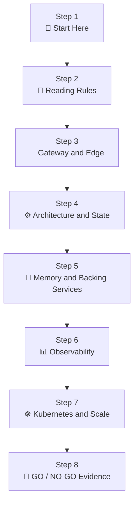

# PolyMoly Documentation Index

One sentence: This page is the official table of contents for the entire PolyMoly documentation book.
One sentence: It matters because people need one clear start page before they jump into routing, runtime, data, observability, or scale.

---

## Start Here

If this is your first time in the docs, read in this order:

1. [How To Read This Flow](./guides/getting-started.md)
2. [Gateway and Edge](./architecture/gateway-and-edge/01-user-entry-and-routing.md)
3. [Architecture and State](./architecture/state-and-runtime/01-stateless-design.md)
4. [Memory and Backing Services](./architecture/backing-services/01-redis-and-caching.md)
5. [Observability](./guides/troubleshooting/01-metrics-and-logs.md)
6. [Kubernetes and Scale](./architecture/deploy-and-scale/01-orchestration-and-ha.md)

---

## Operator Command Flows

If you want to understand what happens after a real CLI command, start here:

- [system/how-this-works.md](../how-this-works.md)
- [system/tools/poly/how-this-works.md](../tools/poly/how-this-works.md)
- [system/tools/poly/internal/cli/how-this-works.md](../tools/poly/internal/cli/how-this-works.md)
- [system/engine/how-this-works.md](../engine/how-this-works.md)
- [system/adapters/how-this-works.md](../adapters/how-this-works.md)

### Example: `poly up`

Read this chain in order:

1. [`system/tools/poly/cmd/poly/main.go`](../tools/poly/cmd/poly/main.go)
   starts the process and calls `cli.Run`.
2. [`system/tools/poly/internal/cli/route_root_commands.go`](../tools/poly/internal/cli/route_root_commands.go)
   parses globals, resolves the command root, and routes `up` into `runRuntimeCommand`.
3. [`system/tools/poly/internal/cli/route_runtime_commands.go`](../tools/poly/internal/cli/route_runtime_commands.go)
   runs `runRuntimeCommand` -> `runUp`.
4. `runUp` may call module/cache guards such as
   `modules.AssessOfflineReadiness` or `modules.EnsureConfiguratorImage`.
5. `runUp` then calls `contracts.ComposeCommand`.
6. [`system/tools/poly/internal/contracts/command_contracts.go`](../tools/poly/internal/contracts/command_contracts.go)
   bridges that request into the Docker adapter.
7. [`system/adapters/docker/fetch_docker_runtime_state.go`](../adapters/docker/fetch_docker_runtime_state.go)
   builds the compose `CommandSpec`.
8. `runUp` calls local `runCommand`, which executes the command spec.
9. [`system/engine/apply/apply_command_spec.go`](../engine/apply/apply_command_spec.go)
   resolves executable/args and runs the command through shared command helpers.
10. on success, `runUp` prints runtime-ready and discovery summaries back in
    the CLI layer.

This means `poly up` is currently a CLI-driven runtime path:

`main -> cli router -> runtime command handler -> contracts bridge -> docker adapter -> command execution -> CLI summary`

### Example: `poly status`

Read this chain in order:

1. `main -> cli.Run`
2. `route_root_commands.go` routes `status` into `runRuntimeCommand`
3. `route_runtime_commands.go` runs `runStatus`
4. `runStatus` loads project intent and effective environment via
   shared config helpers
5. `runStatus` reads live compose rows and combines them with intent-side data
6. `runStatus` prints service, health, and endpoint summaries

This means `poly status` is a mixed read path:

`cli router -> runtime status handler -> shared config intent read -> docker state read -> CLI render`

---

## The Big Picture



This is the shortest correct mental model of the PolyMoly docs.
You start with reading discipline.
Then you learn how traffic enters the platform.
Then you learn how workers behave.
Then you learn where state lives.
Then you learn how to see failure.
Then you learn how to run and scale the system.
At the end, you should be able to make a real GO / NO-GO decision with evidence.

---

## Quick Jump

### Core Entry Points

- [guides/getting-started.md](./guides/getting-started.md)
- [01-user-entry-and-routing.md](./architecture/gateway-and-edge/01-user-entry-and-routing.md)
- [01-stateless-design.md](./architecture/state-and-runtime/01-stateless-design.md)
- [01-redis-and-caching.md](./architecture/backing-services/01-redis-and-caching.md)
- [01-metrics-and-logs.md](./guides/troubleshooting/01-metrics-and-logs.md)
- [01-orchestration-and-ha.md](./architecture/deploy-and-scale/01-orchestration-and-ha.md)

### Governance Entry Points

- [how-to-document.md](./development/governance/how-to-document.md)
- [Development Source Map](./development/README.md)
- [product-quality.md](./development/standards/product-quality.md)
- [code-quality.md](./development/standards/code-quality.md)
- [release-proof-plan.md](./development/standards/release-proof-plan.md)
- [evidence-archive.md](./development/evidence/archives/evidence-archive.md)

### Product Design Entry Points

- [principles.md](./development/architecture/principles.md)
- [root-surface-contract.md](./development/architecture/root-surface-contract.md)
- [current.md](./development/release/current.md)

---

## Read By Goal

### I want to understand how a request enters the platform

Read:

1. [01-user-entry-and-routing.md](./architecture/gateway-and-edge/01-user-entry-and-routing.md)
2. [03-container-hardening.md](./architecture/gateway-and-edge/03-container-hardening.md)

### I want to understand how workers behave and why state is external

Read:

1. [01-stateless-design.md](./architecture/state-and-runtime/01-stateless-design.md)
2. [02-async-and-queues.md](./architecture/state-and-runtime/02-async-and-queues.md)

### I want to understand Redis, databases, backup, and durable truth

Read:

1. [01-redis-and-caching.md](./architecture/backing-services/01-redis-and-caching.md)
2. [02-databases-and-scaling.md](./architecture/backing-services/02-databases-and-scaling.md)
3. [03-backup-restore-and-pitr.md](./guides/troubleshooting/03-backup-restore-and-pitr.md)

### I want to understand detection, incidents, and response

Read:

1. [01-metrics-and-logs.md](./guides/troubleshooting/01-metrics-and-logs.md)
2. [02-incident-runbook.md](./guides/troubleshooting/02-incident-runbook.md)
3. [04-oncall-and-postmortem.md](./guides/troubleshooting/04-oncall-and-postmortem.md)

### I want to understand release safety, packaging, and cluster scale

Read:

1. [02-supply-chain-and-ci-cd.md](./architecture/gateway-and-edge/02-supply-chain-and-ci-cd.md)
2. [01-orchestration-and-ha.md](./architecture/deploy-and-scale/01-orchestration-and-ha.md)
3. [02-helm-and-packaging.md](./architecture/deploy-and-scale/02-helm-and-packaging.md)
4. [03-capacity-lab-go-no-go.md](./architecture/deploy-and-scale/03-capacity-lab-go-no-go.md)

---

## Full Table Of Contents

### 00. Reading Discipline

- [guides/getting-started.md](./guides/getting-started.md)
  What it is: the rulebook for how to read operational docs in the correct order.

### 01. Gateway and Edge

- [01-user-entry-and-routing.md](./architecture/gateway-and-edge/01-user-entry-and-routing.md)
  What it is: how traffic reaches the correct service through the edge.
- [02-supply-chain-and-ci-cd.md](./architecture/gateway-and-edge/02-supply-chain-and-ci-cd.md)
  What it is: how build, verification, and release trust are enforced.
- [03-container-hardening.md](./architecture/gateway-and-edge/03-container-hardening.md)
  What it is: how runtime isolation is kept safe at the container layer.

### 02. Architecture and State

- [01-stateless-design.md](./architecture/state-and-runtime/01-stateless-design.md)
  What it is: why workers stay disposable and state moves out of process memory.
- [02-async-and-queues.md](./architecture/state-and-runtime/02-async-and-queues.md)
  What it is: how slow work is pushed into queues and drained safely.

### 03. Memory and Backing Services

- [01-redis-and-caching.md](./architecture/backing-services/01-redis-and-caching.md)
  What it is: how fast memory works and when Redis is safe to trust.
- [02-databases-and-scaling.md](./architecture/backing-services/02-databases-and-scaling.md)
  What it is: how durable truth is reached through pooling boundaries.

### 04. Observability

- [01-metrics-and-logs.md](./guides/troubleshooting/01-metrics-and-logs.md)
  What it is: how to see system behavior through metrics, logs, and traces.
- [02-incident-runbook.md](./guides/troubleshooting/02-incident-runbook.md)
  What it is: how to recover a live incident without blind mutation.
- [03-backup-restore-and-pitr.md](./guides/troubleshooting/03-backup-restore-and-pitr.md)
  What it is: how backup evidence and restore proof protect durable data.
- [04-oncall-and-postmortem.md](./guides/troubleshooting/04-oncall-and-postmortem.md)
  What it is: how people run incidents, communicate clearly, and learn afterward.

### 05. Kubernetes and Scale

- [01-orchestration-and-ha.md](./architecture/deploy-and-scale/01-orchestration-and-ha.md)
  What it is: how desired state, readiness, and replica recovery work in cluster form.
- [02-helm-and-packaging.md](./architecture/deploy-and-scale/02-helm-and-packaging.md)
  What it is: how runtime intent becomes a reusable package.
- [03-capacity-lab-go-no-go.md](./architecture/deploy-and-scale/03-capacity-lab-go-no-go.md)
  What it is: how load proof and failure injection become a release decision.

---

## Read By Situation

### New engineer onboarding

Read from top to bottom in book order.
Do not skip from chapter 1 to chapter 5.
The later chapters assume the earlier ones.

### Incident at 3 AM

Read in this order:

1. [01-metrics-and-logs.md](./guides/troubleshooting/01-metrics-and-logs.md)
2. [02-incident-runbook.md](./guides/troubleshooting/02-incident-runbook.md)
3. the affected system chapter
4. [03-capacity-lab-go-no-go.md](./architecture/deploy-and-scale/03-capacity-lab-go-no-go.md) if release safety is in doubt

### Release review

Read in this order:

1. [02-supply-chain-and-ci-cd.md](./architecture/gateway-and-edge/02-supply-chain-and-ci-cd.md)
2. [03-container-hardening.md](./architecture/gateway-and-edge/03-container-hardening.md)
3. [02-helm-and-packaging.md](./architecture/deploy-and-scale/02-helm-and-packaging.md)
4. [03-capacity-lab-go-no-go.md](./architecture/deploy-and-scale/03-capacity-lab-go-no-go.md)
5. [product-quality.md](./development/standards/product-quality.md)
6. [release-proof-plan.md](./development/standards/release-proof-plan.md)

### Data risk or restore decision

Read in this order:

1. [02-databases-and-scaling.md](./architecture/backing-services/02-databases-and-scaling.md)
2. [03-backup-restore-and-pitr.md](./guides/troubleshooting/03-backup-restore-and-pitr.md)
3. [02-incident-runbook.md](./guides/troubleshooting/02-incident-runbook.md)

---

## Rules For Reading This Book

- Start with `flow.md`.
- Then open `guides/getting-started.md`.
- Then choose the lane that matches your task.
- Do not jump straight to commands without reading the chapter flow first.
- Do not make a GO decision without the Evidence Pack and GO / NO-GO panel in the target chapter.

---

## Visual Index Map

```text
[ flow.md ]
     |
     v
[ 00-how-to-read-this-flow ]
     |
     +--> [ 01-gateway-and-edge ]
     |
     +--> [ 02-architecture-and-state ]
     |
     +--> [ 03-memory-and-backing ]
     |
     +--> [ 04-observability ]
     |
     +--> [ 05-kubernetes-and-scale ]
```

---

## What This Index Is Not

- It is not a runbook.
- It is not a chapter template.
- It is not a backlog.
- It is not a policy file.

It is the front page and contents page of the PolyMoly documentation book.

---

## Recommended First Click

Start here:

- [guides/getting-started.md](./guides/getting-started.md)

Then continue with:

- [01-user-entry-and-routing.md](./architecture/gateway-and-edge/01-user-entry-and-routing.md)
