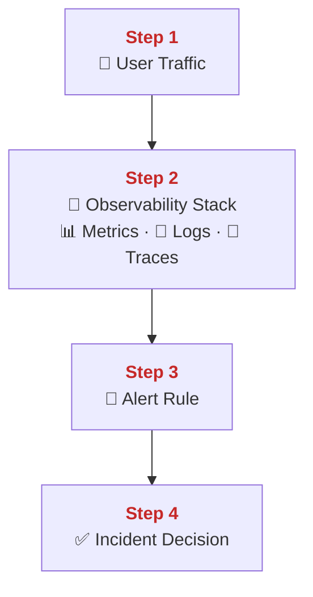
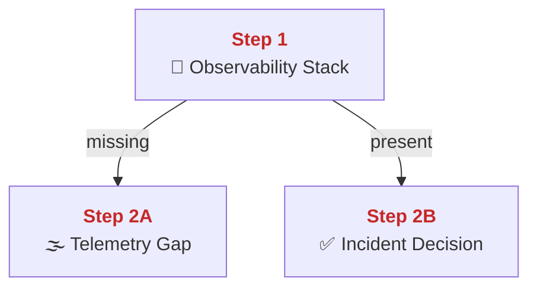
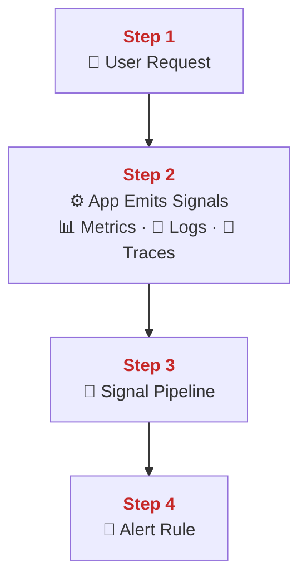
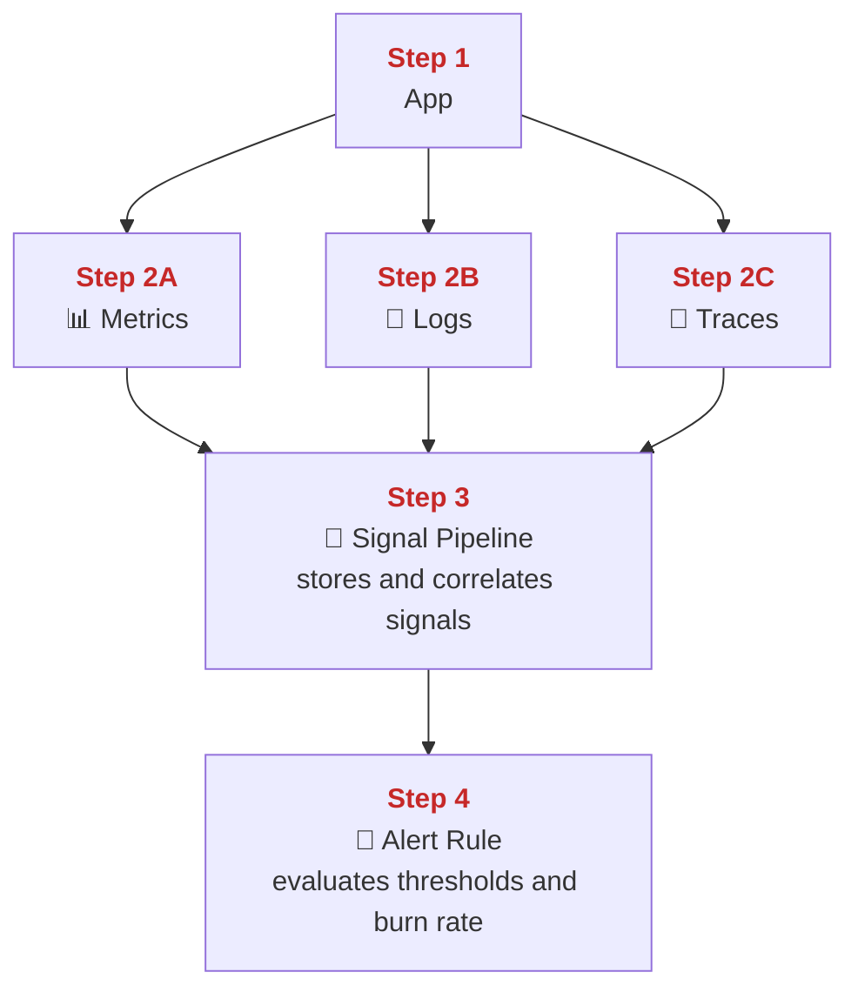
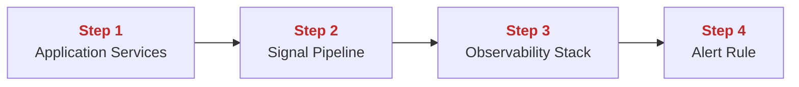
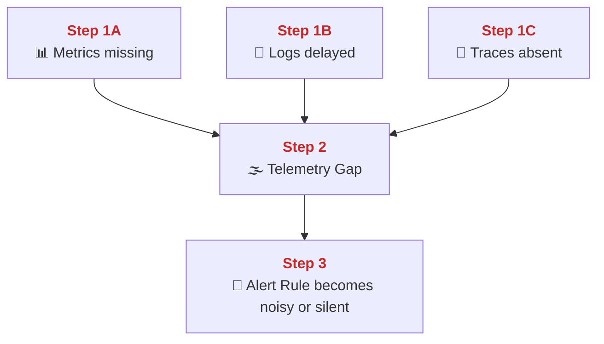
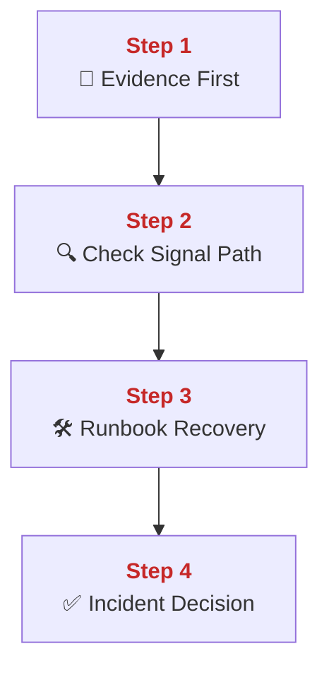
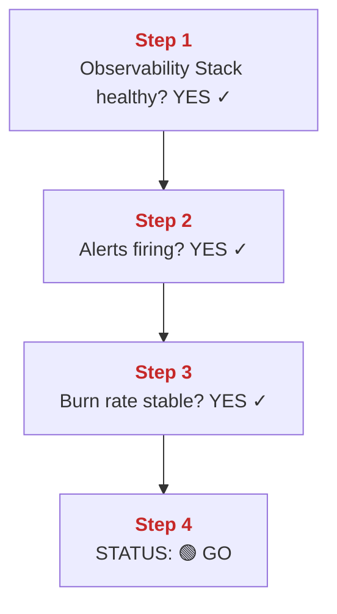

## 01 Metrics and Logs

This chapter explains PolyMoly observability architecture.
Focus is deterministic signal collection, failure detection, and safe incident decisions.

---

## Quick Jump

- [Visual Contract Map](#visual-contract-map)
- [Vocabulary Dictionary](#vocabulary-dictionary-watchtower)
- [Problem and Purpose](#1-problem-and-purpose)
- [End User Flow](#2-end-user-flow)
- [How It Works](#3-how-it-works)
- [Architectural Decision](#4-architectural-decision-adr-format)
- [How It Fails](#5-how-it-fails-sev-123)
- [How To Fix](#6-how-to-fix-runbook-safety-standard)
- [GO / NO-GO Panels](#7-go--no-go-panels)
- [Evidence Pack](#8-evidence-pack)
- [Operational Checklist](#9-operational-checklist)
- [CI/Quality Gate Reference](#10-ciquality-gate-reference)
- [What Did We Learn](#what-did-we-learn)

---

<a id="visual-contract-map"></a>

## Visual Contract Map

### ADU: Watchtower Control Loop

#### Technical Definition

- **[Observability Stack](#term-observability-stack)**: The combined telemetry system that exposes service behavior through stored signals.
- **[Metrics](#term-metrics)**: Time-series measurements used for trend and threshold detection.
- **[Logs](#term-logs)**: Timestamped event records used for exact failure context.
- **[Traces](#term-traces)**: Request path records used for cross-service latency localization.
- **[Alert Rule](#term-alert-rule)**: A threshold or burn-rate condition that turns telemetry into operator action.
- **[Incident Decision](#term-incident-decision)**: The operational choice to continue, investigate, or stop based on observed evidence.

#### Diagram



#### 📖 Deterministic Story

- <span style="color:#c62828"><strong>Step 1:</strong></span> Live user traffic reaches the **[Observability Stack](#term-observability-stack)** as signal input.
- <span style="color:#c62828"><strong>Step 2:</strong></span> The **[Observability Stack](#term-observability-stack)** collects **[Metrics](#term-metrics)**, **[Logs](#term-logs)**, and **[Traces](#term-traces)** from that traffic.
- <span style="color:#c62828"><strong>Step 3:</strong></span> The **[Alert Rule](#term-alert-rule)** evaluates those signals against policy thresholds.
- <span style="color:#c62828"><strong>Step 4:</strong></span> The resulting **[Incident Decision](#term-incident-decision)** determines whether operators continue, investigate, or stop.

#### 🧠 Conceptual Layer

Here is what physically happens inside the system:

Step 1: A real client request hits one application process that already has telemetry code loaded in memory. The network action is the normal inbound HTTP or gRPC connection from the client to that service. At the socket level, the service process accepts the connection or reads from an already open keep-alive socket. In memory, the process creates request state for this call. That state usually includes the start time, the route name, the method, the status placeholder, and the trace context for this request. The first decision is simple: did a real request or background job start. If yes, the next network action is not an alert yet. The next network action is the service continuing normal work while telemetry objects are attached to that work.

Step 2: While the request is running, the same application process updates the **[Metrics](#term-metrics)** objects, writes **[Logs](#term-logs)**, and opens **[Traces](#term-traces)** spans. The network action can happen in two patterns. For metrics, a scraper later opens a connection to read the current metric endpoint, or an exporter pushes the samples to the **[Observability Stack](#term-observability-stack)**. For logs, the runtime writes log bytes to stdout or a log file, and a collector ships them over the network to the log store. For traces, the process sends spans over HTTP or gRPC to the trace receiver. In memory, the application keeps counters, histograms, log buffers, and trace context while the request is alive. The decision at this step is whether the signal data is complete enough to describe the request correctly. If the request finishes, the next network action is that collectors, scrapers, or exporters move those signals into the shared telemetry stores.

Step 3: Inside the **[Observability Stack](#term-observability-stack)**, the storage and rule-evaluation processes receive those signals. The network action is a set of internal reads and writes between collectors, storage backends, and the rule engine. At the socket level, these are normal service-to-service connections on the monitoring network. In memory, the stack keeps recent metric series, indexed log chunks, active trace spans, and the current state of every **[Alert Rule](#term-alert-rule)**. The decision here is whether the new signal values cross a threshold, violate a burn-rate rule, or match a known failure pattern. If the rule stays below threshold, the next network action is no page. If the rule crosses threshold, the next network action is to publish a firing state and send it to the notification path.

Step 4: The **[Alert Rule](#term-alert-rule)** output becomes an **[Incident Decision](#term-incident-decision)** only after the rule engine stores the result and exposes it to operators or the paging path. The network action is an alert message, a dashboard refresh, or a poll from the incident tooling to the observability services. In memory, the rule engine now marks the alert as pending, firing, or resolved, and the operator tools read that state. The decision is whether people should continue normal work, investigate, or stop and escalate. The next network action is either no human notification, a page, or a dashboard query used to continue incident handling.

#### 🧩 Imagine It Like

- You stand in front of one big dashboard ([Observability Stack](#term-observability-stack)).
- It shows number lines ([Metrics](#term-metrics)), event notes ([Logs](#term-logs)), and travel paths ([Traces](#term-traces)).
- A warning light ([Alert Rule](#term-alert-rule)) tells you when the next move changes from safe to dangerous ([Incident Decision](#term-incident-decision)).

#### 🔎 Lemme Explain

- This control loop exists so incidents are detected from telemetry instead of guesswork.
- If the loop is weak, users report the outage before operators understand it.

---

<a id="vocabulary-dictionary-watchtower"></a>

## Vocabulary Dictionary (Watchtower)

### Technical Definition

- <a id="term-observability-stack"></a> **[Observability Stack](#term-observability-stack)**: The telemetry platform composed of storage, query, and alerting components.
- <a id="term-metrics"></a> **[Metrics](#term-metrics)**: Numerical time-series data used for trends, thresholds, and SLO evaluation.
- <a id="term-logs"></a> **[Logs](#term-logs)**: Event records that preserve exact failure context.
- <a id="term-traces"></a> **[Traces](#term-traces)**: Distributed request path records with latency per hop.
- <a id="term-alert-rule"></a> **[Alert Rule](#term-alert-rule)**: A signal evaluation rule that pages humans when conditions breach policy.
- <a id="term-signal-pipeline"></a> **[Signal Pipeline](#term-signal-pipeline)**: The end-to-end flow from emitted telemetry to operator-visible evidence.
- <a id="term-incident-decision"></a> **[Incident Decision](#term-incident-decision)**: The explicit GO, investigate, or stop outcome derived from evidence.
- <a id="term-telemetry-gap"></a> **[Telemetry Gap](#term-telemetry-gap)**: Missing or delayed signal coverage that hides real system behavior.
- <a id="term-runbook-recovery"></a> **[Runbook Recovery](#term-runbook-recovery)**: A controlled sequence of checks and mutations used to restore signal integrity.
- <a id="term-slo-burn-rate"></a> **[SLO Burn Rate](#term-slo-burn-rate)**: The speed at which a reliability budget is being consumed.

---

<a id="1-problem-and-purpose"></a>

## 1. Problem and Purpose

### Trust Boundary

- External entry: Services emit metrics, logs, and traces into the telemetry collection path.
- Protected side: Alerting truth and incident diagnosis stay behind the observability storage and query boundary.
- Failure posture: If telemetry is missing or untrusted, mutation becomes NO-GO because the team is effectively blind.

### ADU: Observability Purpose

#### Technical Definition

- **[Observability Stack](#term-observability-stack)**: The telemetry platform composed of storage, query, and alerting components.
- **[Telemetry Gap](#term-telemetry-gap)**: Missing or delayed signal coverage that hides real system behavior.
- **[Incident Decision](#term-incident-decision)**: The explicit GO, investigate, or stop outcome derived from evidence.

#### Diagram



#### 📖 Deterministic Story

- <span style="color:#c62828"><strong>Step 1:</strong></span> The **[Observability Stack](#term-observability-stack)** establishes whether evidence is available for incident handling.
- <span style="color:#c62828"><strong>Step 2A:</strong></span> If telemetry is missing, a **[Telemetry Gap](#term-telemetry-gap)** appears and delays safe action.
- <span style="color:#c62828"><strong>Step 2B:</strong></span> If telemetry is present, operators can form an **[Incident Decision](#term-incident-decision)** from evidence instead of intuition.

#### 🧠 Conceptual Layer

Here is what physically happens inside the system:

Step 1: The processes inside the **[Observability Stack](#term-observability-stack)** keep listening for incoming telemetry all the time. The network action is constant scrape traffic, push traffic, log shipping traffic, and query traffic from dashboards or alert evaluators. At the socket level, the stack owns listening ports for metric reads, log writes, trace ingestion, and query APIs. In memory, each service keeps its current working state: time-series samples waiting to be indexed, log chunks being buffered, spans being assembled, and query results being cached for active views. The first decision is whether current evidence for the system actually exists in these stores right now. If the answer is yes, the next network action is a query or rule evaluation against that live data. If the answer is no, the next network action is still a query, but it returns empty, stale, or incomplete data.

Step 2A: When telemetry is missing, a **[Telemetry Gap](#term-telemetry-gap)** appears because one or more stack processes cannot provide the expected state. The network action might be a failed scrape, a dropped log stream, a missing trace export, or a timeout when the query engine asks for data. At the socket level, that can mean refused connections, broken keep-alive sessions, or requests that return no samples even though traffic exists. In memory, the stack sees stale timestamps, empty label sets, or missing span trees where active request data should exist. The decision is that operators do not have enough evidence to trust the current picture of the system. The next network action is usually more read-only checks: more queries, more health calls, or a direct check of the broken collector path.

Step 2B: When telemetry is present, the same stack processes answer queries with current data, and the evidence path stays intact. The network action is successful dashboard queries, working alert evaluations, and normal reads from the telemetry stores. At the socket level, the query connections open, return data, and close cleanly. In memory, the stores hold recent samples, fresh log entries, and complete trace chains that match the time window of the incident. The decision is that operators can trust the evidence enough to form an **[Incident Decision](#term-incident-decision)**. The next network action is either human investigation through more queries or automated alert delivery if the evidence crosses the defined threshold.

#### 🧩 Imagine It Like

- You reach for a flashlight ([Observability Stack](#term-observability-stack)) when the room goes dark.
- If the battery is dead ([Telemetry Gap](#term-telemetry-gap)), you cannot see enough to choose the safe next move ([Incident Decision](#term-incident-decision)).

#### 🔎 Lemme Explain

- This section defines why telemetry is part of the system boundary, not optional decoration.
- If telemetry is absent, every incident takes longer and spreads further.

---

<a id="2-end-user-flow"></a>

## 2. End User Flow

### ADU: Signal Path From User Traffic

#### Technical Definition

- **[Signal Pipeline](#term-signal-pipeline)**: The end-to-end flow from emitted telemetry to operator-visible evidence.
- **[Metrics](#term-metrics)**: Numerical time-series data used for trends, thresholds, and SLO evaluation.
- **[Logs](#term-logs)**: Event records that preserve exact failure context.
- **[Traces](#term-traces)**: Distributed request path records with latency per hop.
- **[Alert Rule](#term-alert-rule)**: A signal evaluation rule that pages humans when conditions breach policy.

#### Diagram



#### 📖 Deterministic Story

- <span style="color:#c62828"><strong>Step 1:</strong></span> A user request begins the **[Signal Pipeline](#term-signal-pipeline)**.
- <span style="color:#c62828"><strong>Step 2:</strong></span> Application execution emits **[Metrics](#term-metrics)**, **[Logs](#term-logs)**, and **[Traces](#term-traces)**.
- <span style="color:#c62828"><strong>Step 3:</strong></span> The **[Signal Pipeline](#term-signal-pipeline)** collects and forwards those signals.
- <span style="color:#c62828"><strong>Step 4:</strong></span> The **[Alert Rule](#term-alert-rule)** evaluates the result against user-impact thresholds.

#### 🧠 Conceptual Layer

Here is what physically happens inside the system:

Step 1: A user request enters the application through a normal inbound network connection. The network action is an HTTP or gRPC request arriving at the service listener. At the socket level, the service process accepts the request or reuses an existing persistent connection. In memory, the application creates request-local state. That usually includes the route, start time, trace identifiers, and placeholders for status and latency. The decision at this first moment is not whether to emit telemetry later. The code path is already instrumented, so the request automatically becomes the source for the **[Signal Pipeline](#term-signal-pipeline)**. The next network action is the application continuing to execute business logic while instrumentation hooks collect data.

Step 2: As the request moves through the application, the process emits **[Metrics](#term-metrics)**, **[Logs](#term-logs)**, and **[Traces](#term-traces)**. The network action differs by signal type. Metrics are either exposed on a metrics endpoint for later scrape or pushed by an exporter. Logs are written to stdout or a file and then shipped by a log collector. Traces are sent by an exporter to a trace receiver over the network. At the socket level, this means additional short control connections or scrape reads happen beside the main request socket. In memory, the process updates counters and histograms, appends structured log entries to a buffer, and stores span timing in the active trace context. The decision is whether the signal data is valid enough to describe the request. The next network action is those signal payloads leaving the application boundary toward shared telemetry services.

Step 3: The **[Signal Pipeline](#term-signal-pipeline)** collects and forwards those signals through dedicated telemetry processes. The network action is scrape requests for metrics, shipper writes for logs, and exporter writes for traces. At the socket level, telemetry collectors keep their own connections to applications and to storage backends. In memory, the pipeline keeps sample batches, log batches, and span batches before handing them to storage. The decision is whether the batches were accepted, parsed, and stored without loss. If accepted, the next network action is internal delivery to storage and rule-evaluation services. If a batch is dropped, the next network action is retries, error logs, or a silent data gap depending on the failure mode.

Step 4: The **[Alert Rule](#term-alert-rule)** reads the stored result and evaluates it against thresholds tied to user impact. The network action is the rule engine querying metric series and, when needed, related data from the telemetry APIs. At the socket level, these are internal query connections from the rule evaluator to storage services. In memory, the evaluator keeps the rule expression, the recent sample window, and the previous alert state. The decision is whether the current data means healthy traffic, an investigation state, or an incident. The next network action is either no page, a notification, or a dashboard update that operators use for response.

#### 🧩 Imagine It Like

- Every click leaves breadcrumbs ([Metrics](#term-metrics)), little notes ([Logs](#term-logs)), and a path line ([Traces](#term-traces)).
- Those clues travel down one conveyor belt ([Signal Pipeline](#term-signal-pipeline)).
- A bell ([Alert Rule](#term-alert-rule)) rings when the clues point to danger.

#### 🔎 Lemme Explain

- User traffic must create telemetry as part of normal execution, not as an afterthought.
- If the signal path breaks, operators lose timing, causality, or exact failure context.

---

<a id="3-how-it-works"></a>

## 3. How It Works

### ADU: Signal Pipeline Mechanics

#### Technical Definition

- **[Signal Pipeline](#term-signal-pipeline)**: The end-to-end flow from emitted telemetry to operator-visible evidence.
- **[Metrics](#term-metrics)**: Numerical time-series data used for trends, thresholds, and SLO evaluation.
- **[Logs](#term-logs)**: Event records that preserve exact failure context.
- **[Traces](#term-traces)**: Distributed request path records with latency per hop.
- **[Alert Rule](#term-alert-rule)**: A signal evaluation rule that pages humans when conditions breach policy.

#### Diagram



#### 📖 Deterministic Story

- <span style="color:#c62828"><strong>Step 1:</strong></span> Application execution starts the telemetry path.
- <span style="color:#c62828"><strong>Step 2A:</strong></span> **[Metrics](#term-metrics)** are emitted for trend and threshold detection.
- <span style="color:#c62828"><strong>Step 2B:</strong></span> **[Logs](#term-logs)** are emitted for exact event explanation.
- <span style="color:#c62828"><strong>Step 2C:</strong></span> **[Traces](#term-traces)** are emitted for end-to-end latency localization.
- <span style="color:#c62828"><strong>Step 3:</strong></span> The **[Signal Pipeline](#term-signal-pipeline)** stores and correlates those signals.
- <span style="color:#c62828"><strong>Step 4:</strong></span> The **[Alert Rule](#term-alert-rule)** evaluates thresholds and burn rate from the correlated result.

#### 🧠 Conceptual Layer

Here is what physically happens inside the system:

Step 1: Application execution starts inside one running service process. The network action is a normal request entering through the service socket or an internal job starting from a queue consumer. At the socket level, the process either accepts inbound bytes from a client or reads a job payload from a queue connection. In memory, the process creates one active execution context that telemetry libraries can attach to. The decision is that this execution context becomes the parent for all signal generation. The next network action is the code continuing through its handlers while telemetry hooks activate.

Step 2A: The process updates **[Metrics](#term-metrics)** first by incrementing counters or observing latency in histograms. The network action is usually delayed until a scraper reads the metrics endpoint or an exporter pushes samples. At the socket level, the metric write often stays in-process until an external reader opens a connection later. In memory, the metric registry stores the current counter, gauge, and histogram values keyed by labels. The decision is whether the execution changed any metric series that matter for service health. The next network action is either scrape exposure or metric export.

Step 2B: The process emits **[Logs](#term-logs)** by building structured log records as the request moves forward. The network action is writing log bytes to stdout, stderr, or a file stream that a collector reads. At the socket level, a shipper later opens or reuses its own connection to send those log records to storage. In memory, the process keeps the current log entry fields until serialization finishes. The decision is whether the event is normal, warning, or error and what fields should be included. The next network action is the log record moving into the shipper path.

Step 2C: The process emits **[Traces](#term-traces)** by creating spans around important operations. The network action is exporter traffic that sends completed spans to the trace receiver. At the socket level, this is usually HTTP or gRPC traffic on a separate telemetry connection. In memory, the process keeps active span context, parent-child references, and duration timing until the span is closed. The decision is whether a child span should be opened for the next downstream call. The next network action is either span export or a child service call carrying the trace context.

Step 3: The **[Signal Pipeline](#term-signal-pipeline)** receives these three signal types and keeps them separate while also correlating them. The network action is metric samples, log batches, and trace batches moving into their storage paths. At the socket level, collectors and storage services talk over internal monitoring network connections. In memory, the pipeline holds queues, buffers, label indexes, and correlation identifiers so that signals from the same request or time window can be read together. The decision is whether the data is complete enough to write and index. The next network action is storage writes and later query reads.

Step 4: The **[Alert Rule](#term-alert-rule)** queries that stored data and evaluates threshold windows and burn rate. The network action is rule-engine queries against the telemetry APIs. At the socket level, the rule engine opens internal client connections to storage services. In memory, it uses the current rule expression, the retrieved samples, and the previous firing state. The decision is whether the correlated data means healthy, warning, or incident. The next network action is either no notification, a firing alert, or operator-facing state change in the dashboard path.

#### 🧩 Imagine It Like

- One box counts numbers ([Metrics](#term-metrics)).
- One box writes a diary ([Logs](#term-logs)).
- One box draws the trip map ([Traces](#term-traces)).
- All three boxes drop their papers into one shared chute ([Signal Pipeline](#term-signal-pipeline)).

#### 🔎 Lemme Explain

- This pipeline exists to separate detection, explanation, and localization into complementary signal types.
- If one signal type is missing, diagnosis quality drops even if the others still exist.

---

<a id="4-architectural-decision-adr-format"></a>

## 4. Architectural Decision (ADR Format)

### ADU: Unified Telemetry Decision

#### Technical Definition

- **[Observability Stack](#term-observability-stack)**: The telemetry platform composed of storage, query, and alerting components.
- **[Signal Pipeline](#term-signal-pipeline)**: The end-to-end flow from emitted telemetry to operator-visible evidence.
- **[Alert Rule](#term-alert-rule)**: A signal evaluation rule that pages humans when conditions breach policy.

#### Diagram



#### 📖 Deterministic Story

- <span style="color:#c62828"><strong>Step 1:</strong></span> Application services emit telemetry into one shared path.
- <span style="color:#c62828"><strong>Step 2:</strong></span> That shared path is the **[Signal Pipeline](#term-signal-pipeline)**.
- <span style="color:#c62828"><strong>Step 3:</strong></span> The **[Signal Pipeline](#term-signal-pipeline)** feeds one **[Observability Stack](#term-observability-stack)**.
- <span style="color:#c62828"><strong>Step 4:</strong></span> One shared **[Observability Stack](#term-observability-stack)** keeps **[Alert Rule](#term-alert-rule)** behavior consistent across services.

#### 🧠 Conceptual Layer

Here is what physically happens inside the system:

Step 1: Each application service process emits telemetry while requests are running. The network action is the same signal types leaving many different services at the same time: metric scrape responses, log shipping traffic, and trace export traffic. At the socket level, every service opens or responds on telemetry endpoints and exporter connections. In memory, each service keeps its own local counters, log fields, and span context during execution. The decision is whether telemetry leaves the service through the same shared conventions or through one-off local behavior. The next network action is that the emitted signals enter the collection path.

Step 2: The **[Signal Pipeline](#term-signal-pipeline)** is the shared path that receives those signals from all services. The network action is many service-to-collector and collector-to-storage connections flowing into one common telemetry fabric. At the socket level, collectors and exporters reuse standard protocols and ports instead of every service inventing a private path. In memory, the pipeline keeps one consistent model for labels, timestamps, and routing of telemetry data. The decision is whether signals from different services can be processed by the same storage and alerting path without translation chaos. If yes, the next network action is storage writes into one common stack.

Step 3: The **[Signal Pipeline](#term-signal-pipeline)** feeds one **[Observability Stack](#term-observability-stack)** rather than many isolated tools. The network action is collected telemetry moving into the shared metric, log, and trace stores. At the socket level, the stack services expose stable internal APIs for writes and queries. In memory, the stack holds one set of indexes, one set of evaluation windows, and one consistent view of service health across the platform. The decision is whether operators can query every service through the same tooling. The next network action is alert evaluation and dashboard queries against this shared backend.

Step 4: One shared **[Observability Stack](#term-observability-stack)** means one shared **[Alert Rule](#term-alert-rule)** execution path. The network action is the rule engine querying the same backend for every service instead of bouncing across many incompatible systems. At the socket level, the evaluator talks to one known set of APIs and then sends notifications through one known path. In memory, the evaluator keeps one rule model, one pending state model, and one firing state model for the whole platform. The decision is whether alert behavior stays consistent across services. The next network action is either a single standard notification path or a clean no-alert result.

#### 🧩 Imagine It Like

- Everyone drops letters into the same mailbox ([Signal Pipeline](#term-signal-pipeline)).
- The same tower room ([Observability Stack](#term-observability-stack)) reads every letter.
- The same bell rope ([Alert Rule](#term-alert-rule)) is pulled no matter which district sent the warning.

#### 🔎 Lemme Explain

- The architecture chooses consistency over per-service telemetry improvisation.
- Without shared telemetry plumbing, alerts become noisy and cross-service diagnosis becomes slow.

---

<a id="5-how-it-fails-sev-123"></a>

## 5. How It Fails (Sev 1/2/3)

### ADU: Telemetry Failure Modes

#### Technical Definition

- **[Telemetry Gap](#term-telemetry-gap)**: Missing or delayed signal coverage that hides real system behavior.
- **[Alert Rule](#term-alert-rule)**: A signal evaluation rule that pages humans when conditions breach policy.
- **[Metrics](#term-metrics)**: Numerical time-series data used for trends, thresholds, and SLO evaluation.
- **[Logs](#term-logs)**: Event records that preserve exact failure context.
- **[Traces](#term-traces)**: Distributed request path records with latency per hop.

#### Diagram



#### 📖 Deterministic Story

- <span style="color:#c62828"><strong>Step 1A:</strong></span> A **[Telemetry Gap](#term-telemetry-gap)** starts when **[Metrics](#term-metrics)** stop reflecting real traffic.
- <span style="color:#c62828"><strong>Step 1B:</strong></span> The same **[Telemetry Gap](#term-telemetry-gap)** deepens when **[Logs](#term-logs)** arrive late or incomplete.
- <span style="color:#c62828"><strong>Step 1C:</strong></span> Missing **[Traces](#term-traces)** remove the latency path entirely.
- <span style="color:#c62828"><strong>Step 2:</strong></span> Those failures combine into one **[Telemetry Gap](#term-telemetry-gap)** that hides real behavior.
- <span style="color:#c62828"><strong>Step 3:</strong></span> The **[Alert Rule](#term-alert-rule)** then becomes silent when it should fire or noisy when it should stay quiet.

#### 🧠 Conceptual Layer

Here is what physically happens inside the system:

Step 1A: The **[Telemetry Gap](#term-telemetry-gap)** starts when **[Metrics](#term-metrics)** stop representing the real request stream. The running process that fails here can be the application exporter, the scrape target, or the metric collector. The network action is a failed scrape, a timed-out scrape, or a successful scrape that returns stale series. At the socket level, this can look like a refused connection, an empty response, or a response with timestamps that no longer move. In memory, the metric registry or collector cache still holds old sample values, which makes graphs look flat or misleading. The decision is whether the data is fresh enough to trust. If not, the next network action is more health checks or retries against the metric path.

Step 1B: The same **[Telemetry Gap](#term-telemetry-gap)** gets worse when **[Logs](#term-logs)** arrive late or incomplete. The running process at fault can be the application logger, the log shipper, or the log storage path. The network action is delayed shipping, dropped batches, or broken writes into the log backend. At the socket level, the shipper may keep reconnecting or buffering data locally instead of delivering it. In memory, the shipper queue grows while the storage side still shows missing events. The decision is whether the log stream still matches the real event order. If not, the next network action is backlog drain, reconnection, or direct inspection of the shipper.

Step 1C: Missing **[Traces](#term-traces)** remove the path view entirely. The running process at fault can be the tracer in the app, the exporter, or the trace collector. The network action is failed span export or child calls that continue without trace context attached. At the socket level, the exporter connection may fail or never open. In memory, spans are dropped before they are flushed, or the collector never assembles a full tree because parent-child links are missing. The decision is whether latency can still be localized. If not, the next network action is trace receiver checks and exporter verification.

Step 2: These failures combine into one **[Telemetry Gap](#term-telemetry-gap)** because operators do not consume one signal in isolation. The network action now becomes repeated queries from dashboards and alert engines that return stale, partial, or contradictory results. At the socket level, the queries may succeed technically while still returning bad evidence. In memory, each telemetry store holds only part of the truth. The decision is whether incident evidence is still trustworthy. If not, the next network action is to stop relying on normal alert output and move into telemetry repair checks.

Step 3: The **[Alert Rule](#term-alert-rule)** then becomes silent or noisy because it is evaluating broken inputs. The network action is the rule engine querying the stores and then either failing to notify or notifying too often. At the socket level, the evaluator still talks to the backend, but the backend answers with misleading state. In memory, the rule engine keeps pending and firing state based on incomplete samples. The decision is wrong because the source data is wrong. The next network action is either a false page, a missing page, or a human investigation to confirm the gap.

#### 🧩 Imagine It Like

- The number box ([Metrics](#term-metrics)) goes dark.
- The note box ([Logs](#term-logs)) writes late.
- The path box ([Traces](#term-traces)) forgets the route.
- Together they create one blind spot ([Telemetry Gap](#term-telemetry-gap)) that confuses the alarm bell ([Alert Rule](#term-alert-rule)).

#### 🔎 Lemme Explain

- Observability fails when telemetry stops being timely, complete, or correlated.
- That failure does not just hide incidents; it also damages operator judgment.

| Symptom | Likely fault | Severity | Fastest confirmation |
| :--- | :--- | :--- | :--- |
| Dashboard flatlines | exporter or scrape failure | Sev-1 | `curl -sf http://prometheus:9090/-/healthy` |
| Alerts never fire | bad rule or missing series | Sev-1 | `docker compose logs alertmanager --tail=100` |
| Root cause unclear | trace coverage gap | Sev-2 | `docker compose logs tempo --tail=100` |

---

<a id="6-how-to-fix-runbook-safety-standard"></a>

## 6. How To Fix (Runbook Safety Standard)

### ADU: Restore Telemetry Safely

#### Technical Definition

- **[Runbook Recovery](#term-runbook-recovery)**: A controlled sequence of checks and mutations used to restore signal integrity.
- **[Signal Pipeline](#term-signal-pipeline)**: The end-to-end flow from emitted telemetry to operator-visible evidence.
- **[Telemetry Gap](#term-telemetry-gap)**: Missing or delayed signal coverage that hides real system behavior.
- **[Incident Decision](#term-incident-decision)**: The explicit GO, investigate, or stop outcome derived from evidence.

#### Diagram



#### 📖 Deterministic Story

- <span style="color:#c62828"><strong>Step 1:</strong></span> **[Runbook Recovery](#term-runbook-recovery)** starts by collecting evidence before any mutation begins.
- <span style="color:#c62828"><strong>Step 2:</strong></span> The operator checks the **[Signal Pipeline](#term-signal-pipeline)** to confirm whether the **[Telemetry Gap](#term-telemetry-gap)** is real.
- <span style="color:#c62828"><strong>Step 3:</strong></span> Only then does **[Runbook Recovery](#term-runbook-recovery)** perform controlled repair steps.
- <span style="color:#c62828"><strong>Step 4:</strong></span> The final **[Incident Decision](#term-incident-decision)** is made after telemetry is restored and verified.

#### 🧠 Conceptual Layer

Here is what physically happens inside the system:

Step 1: **[Runbook Recovery](#term-runbook-recovery)** starts with read-only evidence collection, not with a restart. The running processes at this moment are the operator shell, the telemetry services, and the health endpoints they expose. The network action is a set of HTTP requests to Prometheus, Loki, Tempo, and related endpoints, plus log reads through Docker or the API layer. At the socket level, these are short-lived query connections opened by the operator tools. In memory, the operator tools store current status codes, recent log lines, and timestamps for the incident window. The decision is whether the telemetry failure is real and which part of the path is broken. The next network action is a focused check of the shared telemetry path.

Step 2: The operator then checks the **[Signal Pipeline](#term-signal-pipeline)** itself. The running processes are the collectors, storage services, and any exporters or shippers involved in the broken path. The network action is more direct health requests and log reads against the collection and storage layer. At the socket level, this may include readiness probes, scrape checks, or local container status queries. In memory, the operator compares expected healthy states with the live states returned by those processes. The decision is whether the **[Telemetry Gap](#term-telemetry-gap)** comes from one collector, one backend, or the full pipeline. If the fault is confirmed, the next network action is a controlled mutation to the broken service set.

Step 3: Only after that confirmation does **[Runbook Recovery](#term-runbook-recovery)** send mutation traffic. The running process is the container control tool talking to Docker Engine or the runtime manager. The network action is a restart or repair command sent to the observability services. At the socket level, the management client opens a control connection to the engine API, and the engine then stops and starts the affected processes. In memory, the runtime updates container state, restart counters, and service metadata. The decision is whether the restarted telemetry processes came back healthy and connected to the pipeline again. The next network action is fresh health probes and live telemetry checks after restart.

Step 4: The final **[Incident Decision](#term-incident-decision)** is made only after the repaired services answer and data flows again. The running processes are now the restored telemetry services, the alert evaluator, and the operator tools reading them. The network action is a new round of HTTP checks, scrape reads, and query calls. At the socket level, these are the same health and query connections used earlier, but now they should return current data. In memory, the services should show fresh series, new log entries, and recent spans. The decision is whether telemetry is truly back and safe enough to trust again. The next network action is either normal alerting and dashboard use or further escalation if the repair did not restore the path.

#### 🧩 Imagine It Like

- You first open the evidence folder ([Runbook Recovery](#term-runbook-recovery)).
- Then you inspect the messenger road ([Signal Pipeline](#term-signal-pipeline)) before touching the reset switch.
- Only after the road is clear do you decide whether the city can move again ([Incident Decision](#term-incident-decision)).

#### 🔎 Lemme Explain

- This runbook exists to separate signal failures from service failures.
- If you mutate blindly, you can create a second incident while the first one is still unclear.

### Exact Runbook Commands

```bash
# Read-only baseline
curl -sf http://prometheus:9090/-/healthy
curl -sf http://loki:3100/ready
curl -sf http://tempo:3200/ready

docker compose logs prometheus --tail=100
docker compose logs alertmanager --tail=100
```

```bash
# Mutation (only after Evidence Pack and Preconditions are validated)
docker compose restart prometheus loki tempo alertmanager
```

```bash
# Verify
curl -sf http://prometheus:9090/-/healthy
curl -sf http://loki:3100/ready
curl -sf http://tempo:3200/ready
```

---

<a id="7-go-no-go-panels"></a>

## 7. GO / NO-GO Panels

### ADU: Observability Gate

#### Technical Definition

- **[Incident Decision](#term-incident-decision)**: The explicit GO, investigate, or stop outcome derived from evidence.
- **[Alert Rule](#term-alert-rule)**: A signal evaluation rule that pages humans when conditions breach policy.
- **[SLO Burn Rate](#term-slo-burn-rate)**: The speed at which a reliability budget is being consumed.
- **[Observability Stack](#term-observability-stack)**: The telemetry platform composed of storage, query, and alerting components.

#### Diagram



#### 📖 Deterministic Story

- <span style="color:#c62828"><strong>Step 1:</strong></span> The **[Observability Stack](#term-observability-stack)** must first be healthy.
- <span style="color:#c62828"><strong>Step 2:</strong></span> The **[Alert Rule](#term-alert-rule)** path must still be firing correctly.
- <span style="color:#c62828"><strong>Step 3:</strong></span> The **[SLO Burn Rate](#term-slo-burn-rate)** must remain stable enough to trust the system state.
- <span style="color:#c62828"><strong>Step 4:</strong></span> Only then does the **[Incident Decision](#term-incident-decision)** remain GO.

#### 🧠 Conceptual Layer

Here is what physically happens inside the system:

Step 1: The operator first checks whether the **[Observability Stack](#term-observability-stack)** itself is healthy. The running processes are the metric store, log store, trace store, dashboard path, and their health endpoints. The network action is a set of live health and readiness requests to those services. At the socket level, the operator tools open short query sockets to each monitoring component. In memory, those services return their current ready state, recent internal errors, and live status values. The decision is whether the telemetry platform is alive enough to be trusted as evidence. If yes, the next network action is to check the alert path. If not, the next network action is to stop and repair observability first.

Step 2: The **[Alert Rule](#term-alert-rule)** path is checked next because a healthy stack without working alert evaluation still leaves operators blind. The running processes are the rule evaluator and the notification or alert manager path attached to it. The network action is status queries, rule inspections, or controlled alert-path checks. At the socket level, the evaluator talks to storage APIs and the operator talks to the evaluator. In memory, the evaluator keeps active rule definitions, pending states, and firing states. The decision is whether rules are still evaluating and changing state when data changes. If that works, the next network action is to inspect the burn-rate signal itself.

Step 3: The **[SLO Burn Rate](#term-slo-burn-rate)** is then checked because it tells whether the current service state is consuming reliability budget too fast. The running process here is the metrics query engine plus the alert evaluator that reads burn-rate expressions. The network action is a query for the burn-rate series and its recent windows. At the socket level, this is an internal API read from the metric backend. In memory, the query engine uses recent request and error series stored in time windows. The decision is whether the burn rate is stable enough to trust the platform state. If stable, the next network action is to allow the green decision. If unstable, the next network action is to hold or escalate.

Step 4: Only after those checks does the **[Incident Decision](#term-incident-decision)** remain GO. The running process is the operator workflow or automation that consumes the gate result. The network action is not a packet forwarded through the app path yet; it is the continuation of planned operational work because the evidence path is trustworthy. At the socket level, the decision is represented by the final successful reads and the absence of blocking signals. In memory, the operator or automation now has a green state for this decision window. The decision is to continue because the evidence system is healthy enough to guide action. The next network action is the approved operational change or the continuation of normal traffic under monitored conditions.

#### 🧩 Imagine It Like

- You look at the tower panel ([Observability Stack](#term-observability-stack)) before moving the train.
- You wait for the bell system ([Alert Rule](#term-alert-rule)) and the fuel gauge ([SLO Burn Rate](#term-slo-burn-rate)) to stay calm.
- Only then do you let the trip continue ([Incident Decision](#term-incident-decision)).

#### 🔎 Lemme Explain

- The decision panel exists to stop unsafe changes during blind or noisy monitoring states.
- If operators ignore this gate, recovery gets slower and blast radius grows.

---

<a id="8-evidence-pack"></a>

## 8. Evidence Pack

- Metrics snapshot for request rate, p95 latency, error rate, and burn rate.
- Logs export from Prometheus, Loki, Tempo, and Alertmanager for the affected time window.
- Three trace IDs from the impacted user path.
- UTC time anchor and active rollout version.
- Screenshot or export of the watchtower dashboard used for the decision.

---

<a id="9-operational-checklist"></a>

## 9. Operational Checklist

- [ ] Confirm dashboards load and refresh.
- [ ] Confirm alert evaluation path is healthy.
- [ ] Confirm metrics, logs, and traces are all present.
- [ ] Confirm runbook commands remain copy-paste ready.
- [ ] Confirm rollback path is known before mutation.

---

<a id="10-ciquality-gate-reference"></a>

## 10. CI / Quality Gate Reference

- `task docs:governance`
- `task docs:governance:strict`
- `go run ./system/tools/poly/cmd/poly docs governance --phase development`
- `task docs:links:strict`

Artifact paths:

- `system/gates/artifacts/docs-governance/checks.tsv`
- `system/gates/artifacts/docs-governance/semantic-checks.tsv`
- `system/gates/artifacts/docs-links/checks.tsv`

---

## What Did We Learn

- Metrics detect trend shift.
- Logs explain exact failure context.
- Traces localize latency.
- Alert rules turn telemetry into action.
- Good observability shortens incidents before users feel the damage.

👉 Next Chapter: **[02-incident-runbook.md](./02-incident-runbook.md)**
