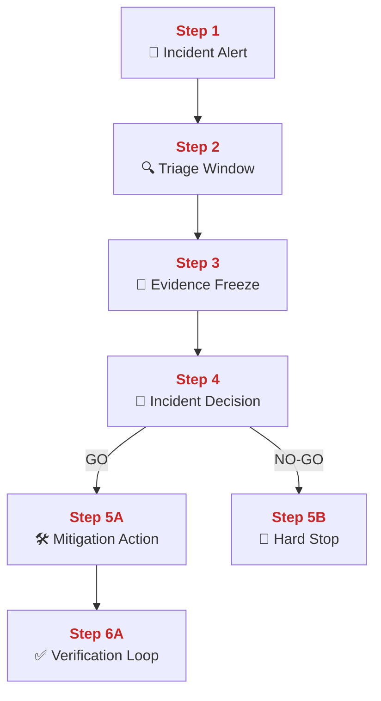
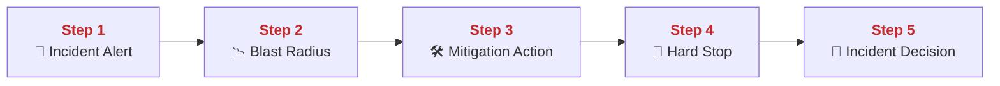
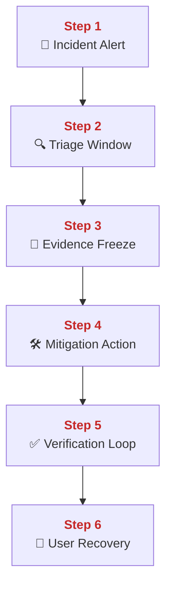
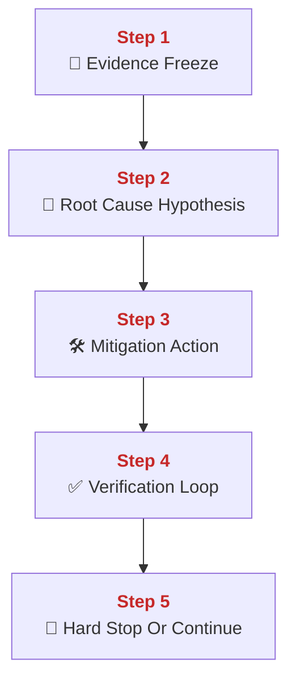
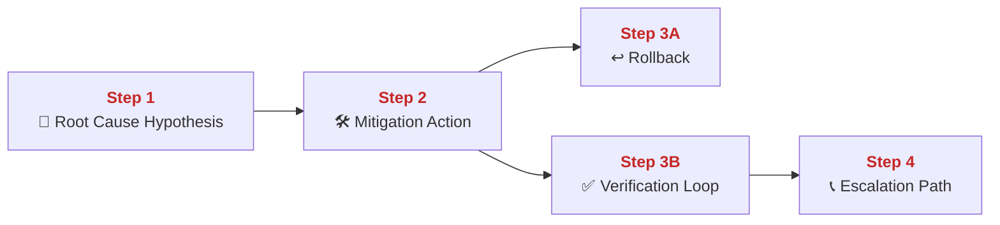
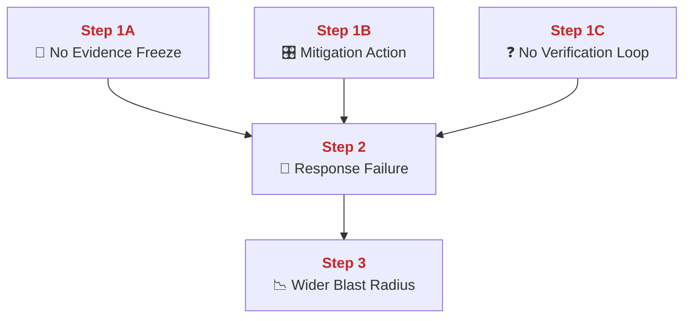
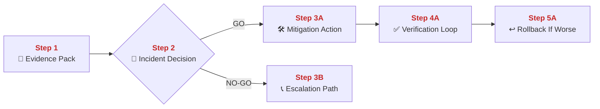
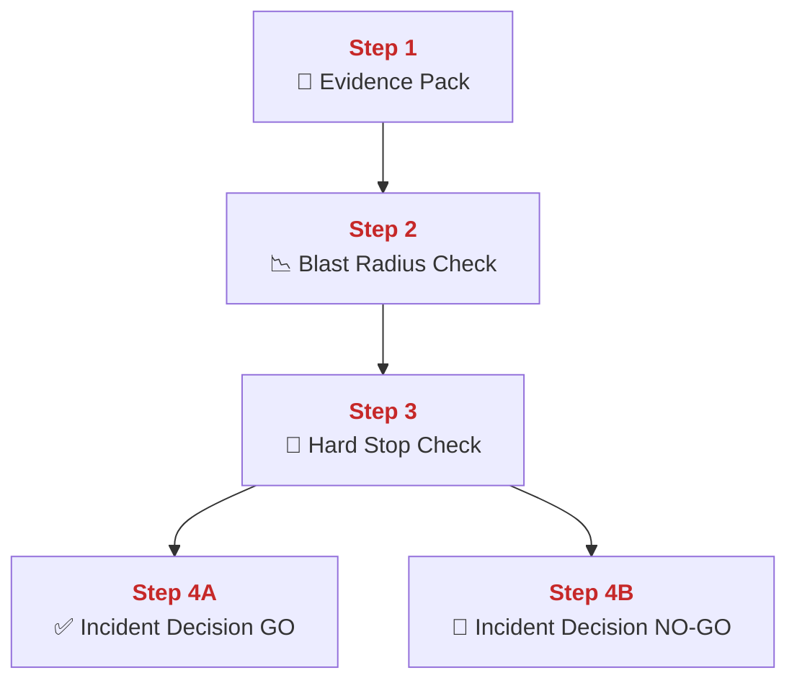

## 02 Incident Runbook

This chapter explains how PolyMoly responders move from alert to safe mitigation without guessing under pressure.
It also explains how to freeze evidence first, how to separate read-only triage from mutation, and how to decide GO or NO-GO before touching runtime state.

---

## Quick Jump

- [Visual Contract Map](#visual-contract-map)
- [Vocabulary Dictionary](#vocabulary-dictionary)
- [1. Problem and Purpose](#1-problem-and-purpose)
- [2. End User Flow](#2-end-user-flow)
- [3. How It Works](#3-how-it-works)
- [4. Architectural Decision (ADR Format)](#4-architectural-decision-adr-format)
- [5. How It Fails](#5-how-it-fails)
- [6. How To Fix (Runbook Safety Standard)](#6-how-to-fix-runbook-safety-standard)
- [7. GO / NO-GO Panels](#7-go--no-go-panels)
- [8. Evidence Pack](#8-evidence-pack)
- [9. Operational Checklist](#9-operational-checklist)
- [10. CI / Quality Gate Reference](#10-ci--quality-gate-reference)
- [What Did We Learn](#what-did-we-learn)

---

## Visual Contract Map

### ADU: Incident Control Loop

#### Technical Definition

- **[Incident Alert](#term-incident-alert)**: The signal that a service degradation or outage may be happening.
- **[Triage Window](#term-triage-window)**: The first read-only analysis phase used to classify impact and likely failure layer.
- **[Mitigation Action](#term-mitigation-action)**: The smallest safe change that reduces active user harm.
- **[Evidence Freeze](#term-evidence-freeze)**: The deliberate capture of logs, metrics, traces, and timestamps before mutation.
- **[Verification Loop](#term-verification-loop)**: The repeated check that confirms user impact is actually decreasing.
- **[Incident Decision](#term-incident-decision)**: The GO / NO-GO judgment before any state-changing step.

#### Diagram



#### 📖 Deterministic Story

- <span style="color:#c62828"><strong>Step 1:</strong></span> An **[Incident Alert](#term-incident-alert)** starts the runbook.
- <span style="color:#c62828"><strong>Step 2:</strong></span> The team uses the **[Triage Window](#term-triage-window)** to classify the problem without mutating state.
- <span style="color:#c62828"><strong>Step 3:</strong></span> An **[Evidence Freeze](#term-evidence-freeze)** is captured before any change.
- <span style="color:#c62828"><strong>Step 4:</strong></span> The **[Incident Decision](#term-incident-decision)** decides whether a direct mitigation is safe.
- <span style="color:#c62828"><strong>Step 5A:</strong></span> If GO, one **[Mitigation Action](#term-mitigation-action)** is executed.
- <span style="color:#c62828"><strong>Step 6A:</strong></span> The **[Verification Loop](#term-verification-loop)** checks whether user impact is falling.
- <span style="color:#c62828"><strong>Step 5B:</strong></span> If NO-GO, the incident stays in hold-and-escalate mode.

#### 🧠 Conceptual Layer

Here is what physically happens inside the system:

Step 1 starts when telemetry crosses a threshold or when user-visible failures are reported. The network action is an alert event flowing from Prometheus rule evaluation or another detection path to the responder surface. In memory, the alerting system keeps the current alert labels, the value that crossed threshold, and the time window that produced it. The first decision is whether the signal is real user impact, probable user impact, or only suspicious noise. If the signal is real enough to open an incident, the next action is not a restart. The next action is read-only triage.

Step 2 is the **[Triage Window](#term-triage-window)**. Responders open dashboards, logs, and traces without changing the system yet. The network actions are read-only HTTP requests to Grafana, Prometheus, Loki, and Tempo. In memory, the responder builds a working model of blast radius, affected routes, and likely failure layer. The decision here is what the active failure looks like: edge failure, backend failure, queue pressure, database pressure, or something else. That classification matters because it decides whether a mitigation is narrow enough to be safe.

Step 3 is the **[Evidence Freeze](#term-evidence-freeze)**. Before any mutation, the responder captures the current state: graphs, trace IDs, logs, timestamps, versions, and current health outputs. The network action is still read-only, but now the outputs are written into evidence notes or artifacts. In memory, the responder keeps a before-state picture that will later prove whether the mitigation helped or made things worse.

Step 4 is the **[Incident Decision](#term-incident-decision)**. This is the fork point. The responder compares the likely cause, blast radius, and mutation risk. If the path is narrow and reversible, the next network action can be a mitigation command. If the path is unclear or the blast radius is already high, the next action should be hold-and-escalate, not improvisation.

Step 5A is the **[Mitigation Action](#term-mitigation-action)** branch. One controlled command is sent to the runtime: rollback, targeted restart, traffic block, or another narrow action. The network action is now a real control-plane mutation against Docker, Kubernetes, or another runtime. In memory, the platform starts shifting from the old incident state toward a hopefully healthier one.

Step 6A is the **[Verification Loop](#term-verification-loop)**. The same dashboards, logs, and traces are checked again. The decision is whether error rate, latency, or user journey failure is actually decreasing. If not, the mitigation is not good enough and the next action is another deliberate decision, not blind repetition.

Step 5B is the NO-GO branch. No mutation happens yet. The incident stays in investigation or escalation mode until a safer action exists.

#### 🧩 Imagine It Like

- The alarm rings ([Incident Alert](#term-incident-alert)).
- You first look through the windows and take photos ([Triage Window](#term-triage-window), [Evidence Freeze](#term-evidence-freeze)).
- Only then do you decide whether to pull one lever ([Mitigation Action](#term-mitigation-action)) or keep hands off and call more people.

#### 🔎 Lemme Explain

- Good incident response is not fast typing. It is fast understanding plus controlled action.
- Evidence first is what stops panic from turning one outage into two.

---

## Vocabulary Dictionary

### Technical Definition

- <a id="term-incident-alert"></a> **[Incident Alert](https://prometheus.io/system/docs/alerting/latest/alertmanager/)**: The signal that a service degradation or outage may be happening.
- <a id="term-triage-window"></a> **[Triage Window](#term-triage-window)**: The first read-only analysis phase used to classify impact and likely failure layer.
- <a id="term-evidence-freeze"></a> **[Evidence Freeze](#term-evidence-freeze)**: The deliberate capture of logs, metrics, traces, and timestamps before mutation.
- <a id="term-mitigation-action"></a> **[Mitigation Action](#term-mitigation-action)**: The smallest safe change that reduces active user harm.
- <a id="term-verification-loop"></a> **[Verification Loop](#term-verification-loop)**: The repeated check that confirms user impact is actually decreasing.
- <a id="term-incident-decision"></a> **[Incident Decision](#term-incident-decision)**: The GO / NO-GO judgment before any state-changing step.
- <a id="term-blast-radius"></a> **[Blast Radius](https://en.wikipedia.org/wiki/Blast_radius)**: The number of users, routes, or systems currently affected.
- <a id="term-root-cause-hypothesis"></a> **[Root Cause Hypothesis](#term-root-cause-hypothesis)**: The current best explanation of the failure path before final proof exists.
- <a id="term-rollback"></a> **[Rollback](https://en.wikipedia.org/wiki/Rollback_(data_management))**: The controlled return to a previously known good runtime state.
- <a id="term-escalation-path"></a> **[Escalation Path](#term-escalation-path)**: The responder route used when direct mutation is unsafe or insufficient.
- <a id="term-evidence-pack"></a> **[Evidence Pack](#term-evidence-pack)**: The minimum set of graphs, logs, traces, and timestamps captured before mutation.
- <a id="term-hard-stop"></a> **[Hard Stop](#term-hard-stop)**: A condition that forbids further blind mutation and forces hold or rollback.

---

## 1. Problem and Purpose

### Trust Boundary

- External entry: Alerts, user reports, and dashboards enter the incident control path first.
- Protected side: Live service mutation stays behind the evidence and approval boundary.
- Failure posture: If evidence is incomplete or blast radius is unclear, pause mutation and escalate instead of guessing.

### ADU: Panic Is Not A Control System

#### Technical Definition

- **[Incident Alert](#term-incident-alert)**: The signal that a service degradation or outage may be happening.
- **[Blast Radius](#term-blast-radius)**: The number of users, routes, or systems currently affected.
- **[Mitigation Action](#term-mitigation-action)**: The smallest safe change that reduces active user harm.
- **[Hard Stop](#term-hard-stop)**: A condition that forbids further blind mutation and forces hold or rollback.
- **[Incident Decision](#term-incident-decision)**: The GO / NO-GO judgment before any state-changing step.

#### Diagram



#### 📖 Deterministic Story

- <span style="color:#c62828"><strong>Step 1:</strong></span> An **[Incident Alert](#term-incident-alert)** is the start signal, not the fix.
- <span style="color:#c62828"><strong>Step 2:</strong></span> The team measures the **[Blast Radius](#term-blast-radius)** first.
- <span style="color:#c62828"><strong>Step 3:</strong></span> A single **[Mitigation Action](#term-mitigation-action)** is chosen only after that.
- <span style="color:#c62828"><strong>Step 4:</strong></span> **[Hard Stop](#term-hard-stop)** rules prevent panic mutation.
- <span style="color:#c62828"><strong>Step 5:</strong></span> The **[Incident Decision](#term-incident-decision)** is what turns chaos into controlled response.

#### 🧠 Conceptual Layer

Here is what physically happens inside the system:

Step 1 is the moment a signal appears. A monitoring rule fires, synthetic probes fail, or users report visible breakage. The network action is the alert delivery path, not the service fix path. The responder's first job is to receive and understand the signal, not to change runtime state.

Step 2 is blast-radius measurement. The responder checks whether one route, one service, or the whole user journey is affected. The network actions are read-only telemetry queries. In memory, the responder builds a short list of impacted systems and current severity.

Step 3 is choosing one **[Mitigation Action](#term-mitigation-action)**. The system should not be hit with three guesses at once. The responder chooses the smallest plausible action that can reduce user harm quickly.

Step 4 is the **[Hard Stop](#term-hard-stop)** rule. If the first action worsens latency, increases 5xx rate, or widens impact, the responder must stop adding more blind actions. That is the safety brake.

Step 5 is the **[Incident Decision](#term-incident-decision)**. Every mutation must be a conscious fork point, not a panic reflex.

#### 🧩 Imagine It Like

- The fire alarm is not the hose.
- First you see which rooms are burning.
- Then you open one valve, not all the valves at once.

#### 🔎 Lemme Explain

- Incident process exists because uncontrolled speed creates secondary damage.
- The system needs fewer guesses and clearer forks.

---

## 2. End User Flow

### ADU: Alert To Restored User Path

#### Technical Definition

- **[Incident Alert](#term-incident-alert)**: The signal that a service degradation or outage may be happening.
- **[Triage Window](#term-triage-window)**: The first read-only analysis phase used to classify impact and likely failure layer.
- **[Evidence Freeze](#term-evidence-freeze)**: The deliberate capture of logs, metrics, traces, and timestamps before mutation.
- **[Mitigation Action](#term-mitigation-action)**: The smallest safe change that reduces active user harm.
- **[Verification Loop](#term-verification-loop)**: The repeated check that confirms user impact is actually decreasing.

#### Diagram



#### 📖 Deterministic Story

- <span style="color:#c62828"><strong>Step 1:</strong></span> An **[Incident Alert](#term-incident-alert)** announces a likely outage or degradation.
- <span style="color:#c62828"><strong>Step 2:</strong></span> The **[Triage Window](#term-triage-window)** identifies the likely failing layer.
- <span style="color:#c62828"><strong>Step 3:</strong></span> An **[Evidence Freeze](#term-evidence-freeze)** captures the before-state.
- <span style="color:#c62828"><strong>Step 4:</strong></span> One **[Mitigation Action](#term-mitigation-action)** is applied.
- <span style="color:#c62828"><strong>Step 5:</strong></span> The **[Verification Loop](#term-verification-loop)** checks whether the signals improve.
- <span style="color:#c62828"><strong>Step 6:</strong></span> Users recover only when the verified signal path improves.

#### 🧠 Conceptual Layer

Here is what physically happens inside the system:

Step 1 starts with an alert event entering the responder surface. The metrics backend or synthetic probe path has already evaluated a threshold and emitted a state change. The responder sees the alert labels, values, and timestamps.

Step 2 is the **[Triage Window](#term-triage-window)**. The responder opens dashboards and traces to find where the request path is actually breaking. The network actions are read-only calls to telemetry backends. The decision is whether the failing point is edge, service, queue, or data.

Step 3 is the **[Evidence Freeze](#term-evidence-freeze)**. The responder captures specific graphs, trace IDs, and logs before touching runtime state. This creates a before-image.

Step 4 is the **[Mitigation Action](#term-mitigation-action)**. The responder sends one control-plane command to reduce user impact. That command may restart a narrow component, roll back a release, or block a bad path.

Step 5 is the **[Verification Loop](#term-verification-loop)**. The same read-only checks are repeated. The decision is whether error rate, latency, or user journey failure is going down.

Step 6 is user recovery. Recovery is not declared because a command succeeded. Recovery is declared because verified signals show that user-facing behavior improved.

#### 🧩 Imagine It Like

- An alarm rings.
- You look at the map, take a photo, pull one lever, then watch the gauges again.
- Only when the gauges fall back do you say the hallway is safe again.

#### 🔎 Lemme Explain

- The user only cares about the verified end state.
- A successful command without a successful signal change is not recovery.

---

## 3. How It Works

### ADU: Evidence Before Mutation

#### Technical Definition

- **[Evidence Freeze](#term-evidence-freeze)**: The deliberate capture of logs, metrics, traces, and timestamps before mutation.
- **[Root Cause Hypothesis](#term-root-cause-hypothesis)**: The current best explanation of the failure path before final proof exists.
- **[Mitigation Action](#term-mitigation-action)**: The smallest safe change that reduces active user harm.
- **[Verification Loop](#term-verification-loop)**: The repeated check that confirms user impact is actually decreasing.
- **[Hard Stop](#term-hard-stop)**: A condition that forbids further blind mutation and forces hold or rollback.

#### Diagram



#### 📖 Deterministic Story

- <span style="color:#c62828"><strong>Step 1:</strong></span> The responder captures an **[Evidence Freeze](#term-evidence-freeze)** first.
- <span style="color:#c62828"><strong>Step 2:</strong></span> The responder builds a **[Root Cause Hypothesis](#term-root-cause-hypothesis)** from that evidence.
- <span style="color:#c62828"><strong>Step 3:</strong></span> One **[Mitigation Action](#term-mitigation-action)** is chosen to test that hypothesis safely.
- <span style="color:#c62828"><strong>Step 4:</strong></span> The **[Verification Loop](#term-verification-loop)** checks whether the hypothesis was useful.
- <span style="color:#c62828"><strong>Step 5:</strong></span> **[Hard Stop](#term-hard-stop)** rules decide whether to continue or stop.

#### 🧠 Conceptual Layer

Here is what physically happens inside the system:

Step 1 is evidence capture. The responder queries metrics, logs, and traces and writes down the time anchor. The important thing is that these reads happen before the system state is changed, so the before-state remains available.

Step 2 is hypothesis building. The responder looks at the frozen evidence and chooses the most likely failing control path. This is still a thinking step, not a mutation step.

Step 3 is one targeted action. The responder picks the smallest plausible change that can reduce impact and that can be observed afterwards.

Step 4 is the verification read. The same signal sources are queried again to compare before and after. The responder asks one question: did the user-facing signal improve.

Step 5 is the safety branch. If the signal improves, the responder may continue carefully. If the signal worsens or becomes unclear, the **[Hard Stop](#term-hard-stop)** rule takes over and prevents blind thrashing.

#### 🧩 Imagine It Like

- Take the picture first.
- Then make your best guess.
- Pull one lever and look at the same gauges again before touching anything else.

#### 🔎 Lemme Explain

- Evidence-first response turns incidents into controlled experiments instead of panic.
- Hard-stop rules are what keep bad guesses from compounding.

---

## 4. Architectural Decision (ADR Format)

### ADU: Restore Service Before Root Cause Perfection

#### Technical Definition

- **[Mitigation Action](#term-mitigation-action)**: The smallest safe change that reduces active user harm.
- **[Verification Loop](#term-verification-loop)**: The repeated check that confirms user impact is actually decreasing.
- **[Rollback](#term-rollback)**: The controlled return to a previously known good runtime state.
- **[Root Cause Hypothesis](#term-root-cause-hypothesis)**: The current best explanation of the failure path before final proof exists.
- **[Verification Loop](#term-verification-loop)**: The repeated check that confirms user impact is actually decreasing.
- **[Escalation Path](#term-escalation-path)**: The responder route used when direct mutation is unsafe or insufficient.

#### Diagram



#### 📖 Deterministic Story

- <span style="color:#c62828"><strong>Step 1:</strong></span> The responder forms a **[Root Cause Hypothesis](#term-root-cause-hypothesis)**.
- <span style="color:#c62828"><strong>Step 2:</strong></span> One **[Mitigation Action](#term-mitigation-action)** is chosen to restore service first.
- <span style="color:#c62828"><strong>Step 3A:</strong></span> If needed, the safest direct mitigation is **[Rollback](#term-rollback)**.
- <span style="color:#c62828"><strong>Step 3B:</strong></span> The result is checked in the **[Verification Loop](#term-verification-loop)**.
- <span style="color:#c62828"><strong>Step 4:</strong></span> If the path stays unclear, use the **[Escalation Path](#term-escalation-path)**.

#### 🧠 Conceptual Layer

Here is what physically happens inside the system:

Step 1 is the best current explanation of the outage. It is not final truth yet. It is the current narrowest plausible explanation supported by evidence.

Step 2 is the operational choice to reduce user harm before perfectly explaining every detail. The system under incident does not need a polished report first. It needs the smallest safe move that can improve availability.

Step 3A is rollback when rollback is the narrowest and safest move. The network action is a control-plane request to return to a previous release or runtime state. Step 3B is the post-mitigation verification read. Both branches are still tied to measured user impact, not to guesswork.

Step 4 is escalation when the responder cannot justify another direct action safely. That stops one person from improvising increasingly risky mutations alone.

#### 🧩 Imagine It Like

- You do not need to explain the whole fire before closing one gas valve.
- You need one safe move that lowers the flames.
- If the valve does not help, you call for a wider response instead of spinning more knobs.

#### 🔎 Lemme Explain

- This runbook prioritizes fast harm reduction over perfect first-pass diagnosis.
- Verification is what keeps that priority honest.

---

## 5. How It Fails

### ADU: Common Response Failure Modes

#### Technical Definition

- **[Evidence Freeze](#term-evidence-freeze)**: The deliberate capture of logs, metrics, traces, and timestamps before mutation.
- **[Mitigation Action](#term-mitigation-action)**: The smallest safe change that reduces active user harm.
- **[Verification Loop](#term-verification-loop)**: The repeated check that confirms user impact is actually decreasing.
- **[Hard Stop](#term-hard-stop)**: A condition that forbids further blind mutation and forces hold or rollback.
- **[Blast Radius](#term-blast-radius)**: The number of users, routes, or systems currently affected.

#### Diagram



#### 📖 Deterministic Story

- <span style="color:#c62828"><strong>Step 1A:</strong></span> Skipping the **[Evidence Freeze](#term-evidence-freeze)** destroys the before-state.
- <span style="color:#c62828"><strong>Step 1B:</strong></span> Too many **[Mitigation Action](#term-mitigation-action)** steps at once hide the real effect.
- <span style="color:#c62828"><strong>Step 1C:</strong></span> Skipping the **[Verification Loop](#term-verification-loop)** makes responders fly blind.
- <span style="color:#c62828"><strong>Step 2:</strong></span> These mistakes become runbook failure.
- <span style="color:#c62828"><strong>Step 3:</strong></span> The **[Blast Radius](#term-blast-radius)** can widen instead of shrink.

#### 🧠 Conceptual Layer

Here is what physically happens inside the system:

Step 1A is missing evidence. The responder changes runtime state before capturing logs, graphs, and traces. After that mutation, the original failure picture may be gone forever.

Step 1B is too many moves. Two or three changes are made together, so nobody can tell which one helped, which one hurt, and which one changed nothing.

Step 1C is missing verification. Commands are run, but the same telemetry is not re-queried. The system may still be degraded even though a command returned success.

Step 2 is the failed response pattern. The incident becomes harder to understand than it was at the start.

Step 3 is a wider **[Blast Radius](#term-blast-radius)**. Users keep failing longer, or a once-local problem spreads because the response path added confusion.

#### 🧩 Imagine It Like

- If you do not take the photo first, you lose the original scene.
- If you pull three levers at once, you do not know which lever mattered.
- If you never look back at the gauges, you might think the fire is smaller when it is not.

#### 🔎 Lemme Explain

- Bad incident response can become its own incident.
- The runbook exists to stop that from happening.

| Symptom | Root Cause | Severity | Fastest confirmation step |
| :--- | :--- | :--- | :--- |
| No before-state evidence | skipped freeze | Sev-1 | check missing timestamps / screenshots / IDs |
| Conflicting runtime state | multiple simultaneous mutations | Sev-1 | compare operator actions in incident log |
| False recovery claim | no verification | Sev-1 | re-check same alert and dashboard set |
| New impact after mitigation | missing hard stop | Sev-1 | compare before/after blast radius |

---

## 6. How To Fix (Runbook Safety Standard)

### ADU: Controlled Incident Recovery

#### Technical Definition

- **[Evidence Pack](#term-evidence-pack)**: The minimum set of graphs, logs, traces, and timestamps captured before mutation.
- **[Mitigation Action](#term-mitigation-action)**: The smallest safe change that reduces active user harm.
- **[Verification Loop](#term-verification-loop)**: The repeated check that confirms user impact is actually decreasing.
- **[Rollback](#term-rollback)**: The controlled return to a previously known good runtime state.
- **[Hard Stop](#term-hard-stop)**: A condition that forbids further blind mutation and forces hold or rollback.
- **[Escalation Path](#term-escalation-path)**: The responder route used when direct mutation is unsafe or insufficient.

#### Diagram



#### 📖 Deterministic Story

- <span style="color:#c62828"><strong>Step 1:</strong></span> Build the **[Evidence Pack](#term-evidence-pack)** first.
- <span style="color:#c62828"><strong>Step 2:</strong></span> Make an explicit incident GO / NO-GO decision.
- <span style="color:#c62828"><strong>Step 3A:</strong></span> If GO, run one **[Mitigation Action](#term-mitigation-action)**.
- <span style="color:#c62828"><strong>Step 4A:</strong></span> Use the **[Verification Loop](#term-verification-loop)** immediately after that action.
- <span style="color:#c62828"><strong>Step 5A:</strong></span> If signals worsen, use **[Rollback](#term-rollback)** and obey the **[Hard Stop](#term-hard-stop)**.
- <span style="color:#c62828"><strong>Step 3B:</strong></span> If NO-GO, take the **[Escalation Path](#term-escalation-path)**.

#### 🧠 Conceptual Layer

Here is what physically happens inside the system:

Step 1 is evidence build. The responder gathers alert values, graphs, trace IDs, logs, and a time anchor. These are read-only operations against telemetry systems.

Step 2 is the explicit fork point. The responder asks whether the next state-changing action is narrow, reversible, and supported by evidence. If not, the answer is NO-GO.

Step 3A is one mitigation command. The network action is now a real control-plane change: restart, rollback, block, or other bounded action. Step 3B is escalation instead of mutation.

Step 4A is verification. The same telemetry sources are queried again to see whether user impact has dropped.

Step 5A is rollback or stop when the action made things worse. The runbook does not permit piling more blind commands on top of a worsening state.

#### 🧩 Imagine It Like

- Build the evidence folder first.
- Decide if one lever is safe enough.
- Pull one lever, look again, and back out if the gauges move the wrong way.

#### 🔎 Lemme Explain

- Controlled incident work is a sequence of small, observable forks.
- The runbook fails when those forks are skipped.

### Exact Runbook Commands

```bash
# Read-only checks
go run ./system/tools/poly/cmd/poly gate check sre-observability
go run ./system/tools/poly/cmd/poly gate check incident-replay
rg -n "alert:|summary:" monitoring/prometheus/alerts.yaml | sed -n '1,20p'
```

```bash
# Mutation (only after Evidence Pack is captured and Incident Decision is GO)
go run ./system/tools/poly/cmd/poly resilience replay
```

```bash
# Verify
go run ./system/tools/poly/cmd/poly gate check sre-observability
go run ./system/tools/poly/cmd/poly gate check incident-replay
```

Rollback rule:
- If replay, rollback, or targeted mitigation increases error rate or widens blast radius, STOP immediately.
- Do not stack another runtime mutation until the same signal set is re-checked.

---

## 7. GO / NO-GO Panels

### ADU: Incident Change Gate

#### Technical Definition

- **[Incident Decision](#term-incident-decision)**: The GO / NO-GO judgment before any state-changing step.
- **[Evidence Pack](#term-evidence-pack)**: The minimum set of graphs, logs, traces, and timestamps captured before mutation.
- **[Blast Radius](#term-blast-radius)**: The number of users, routes, or systems currently affected.
- **[Hard Stop](#term-hard-stop)**: A condition that forbids further blind mutation and forces hold or rollback.
- **[Mitigation Action](#term-mitigation-action)**: The smallest safe change that reduces active user harm.

#### Diagram



#### 📖 Deterministic Story

- <span style="color:#c62828"><strong>Step 1:</strong></span> The **[Evidence Pack](#term-evidence-pack)** enters the gate.
- <span style="color:#c62828"><strong>Step 2:</strong></span> Current **[Blast Radius](#term-blast-radius)** is checked.
- <span style="color:#c62828"><strong>Step 3:</strong></span> **[Hard Stop](#term-hard-stop)** conditions are checked.
- <span style="color:#c62828"><strong>Step 4A:</strong></span> If impact is narrow enough and stop conditions are absent, the **[Incident Decision](#term-incident-decision)** can be GO.
- <span style="color:#c62828"><strong>Step 4B:</strong></span> If impact is widening or stop conditions are active, the decision stays NO-GO.

#### 🧠 Conceptual Layer

Here is what physically happens inside the system:

Step 1 starts with evidence already gathered. The responder has before-state information, not only intuition.

Step 2 is blast-radius check. The responder decides whether one action can realistically help the current impact scope.

Step 3 is hard-stop check. If previous actions worsened the system or if the failing path is still unclear, that blocks new blind mutation.

Step 4A is GO only when the action is narrow, observable, and reversible. Step 4B is NO-GO when those conditions are not true.

#### 🧩 Imagine It Like

- You bring the folder to the control desk.
- You check how many rooms are affected.
- You check whether a previous lever already made things worse.

#### 🔎 Lemme Explain

- GO is not permission to guess.
- GO means one controlled step is justified by current evidence.

---

## 8. Evidence Pack

Collect before mutation:

- Current alert name, labels, and values.
- Dashboard screenshot or time window reference.
- Representative error log lines.
- One or more trace IDs from the failing path when available.
- Current blast-radius statement.
- Exact current UTC timestamp for before-state anchoring.

---

## 9. Operational Checklist

- [ ] Alert is classified.
- [ ] Blast radius is stated explicitly.
- [ ] Evidence is frozen before mutation.
- [ ] One mitigation is chosen.
- [ ] Verification reuses the same signal set.
- [ ] Hard-stop rule is respected.

---

## 10. CI / Quality Gate Reference

Run:

```bash
task docs:governance
task docs:governance:strict
go run ./system/tools/poly/cmd/poly gate check sre-observability
go run ./system/tools/poly/cmd/poly gate check incident-replay
```

Related workflows and evidence:

- `.github/workflows/sre-observability-gate.yml`
- `.github/workflows/incident-replay-gate.yml`
- `tools/artifacts/sre-observability/`
- `tools/artifacts/incident-replay/`
- `tools/artifacts/docs-governance/`
- `tools/artifacts/docs-links/`

---

## What Did We Learn

- Incidents are controlled by evidence, not by typing speed.
- One mutation at a time is a safety feature, not a luxury.
- Verification is part of the fix, not a postscript.
- Hard-stop rules protect the system from responder-induced damage.

👉 Next Chapter: **[03-backup-restore-and-pitr.md](./03-backup-restore-and-pitr.md)**
