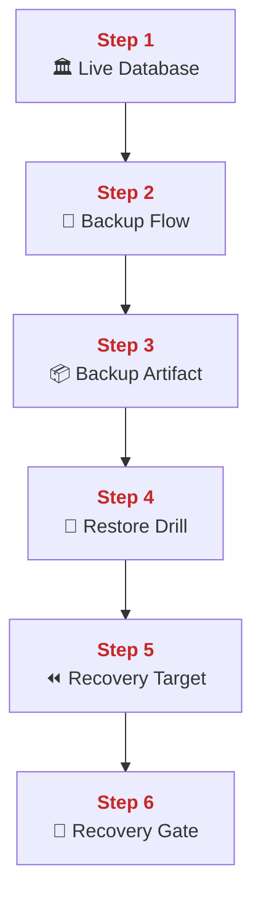
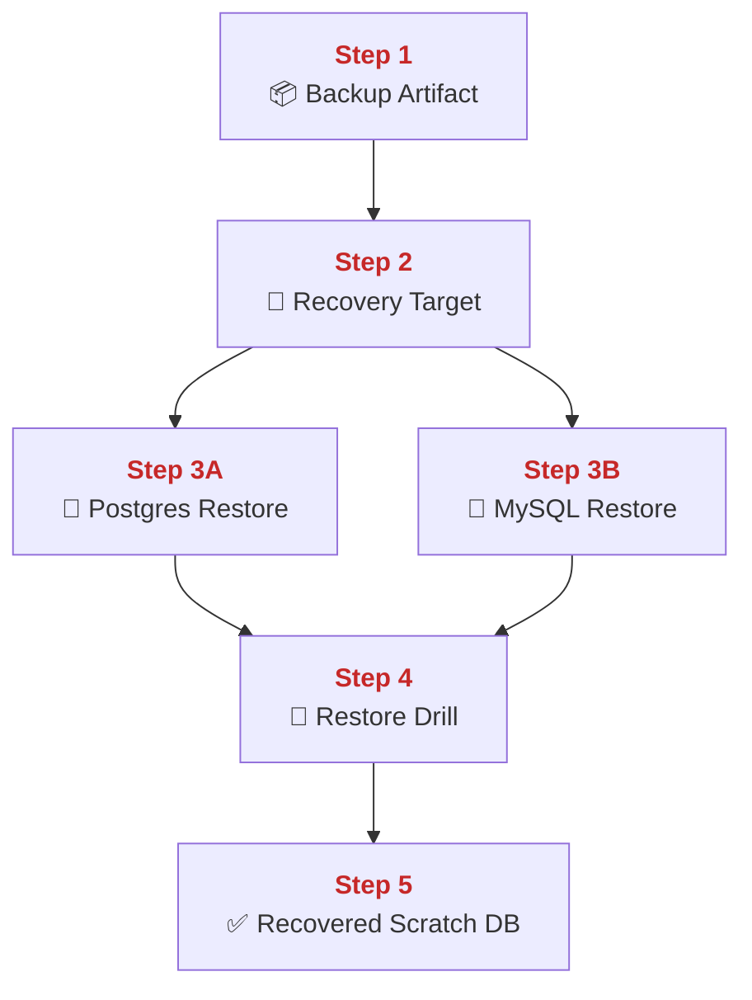
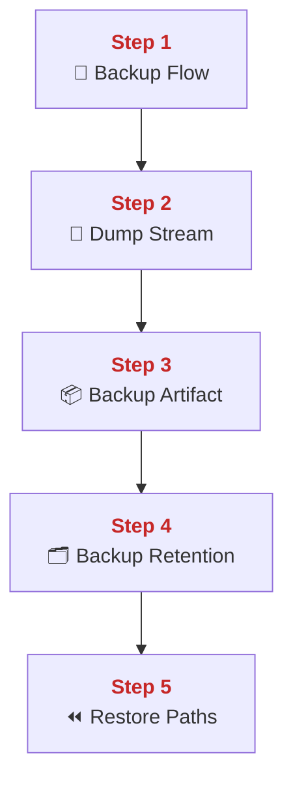
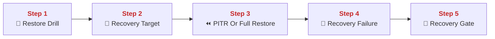
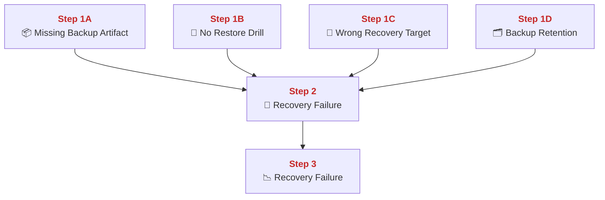
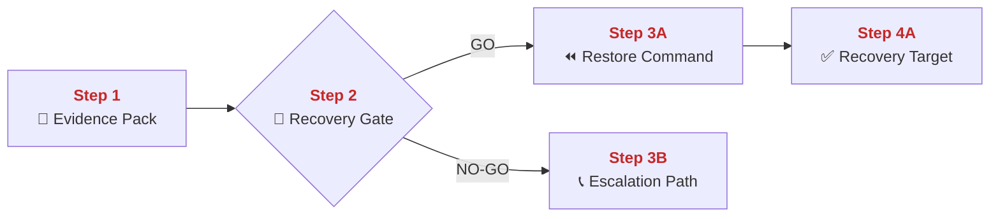
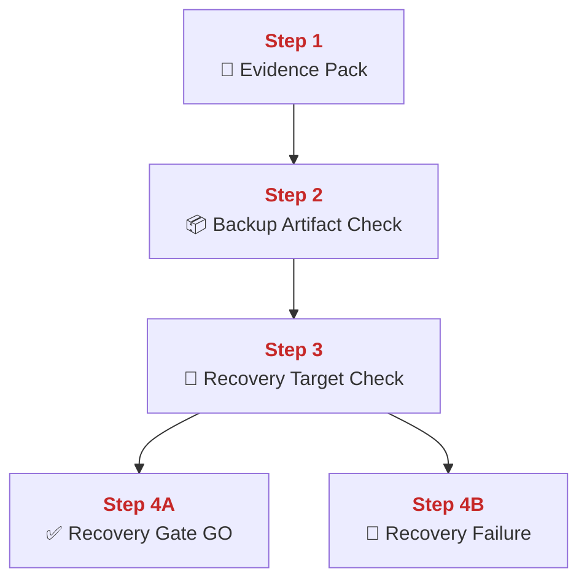

## 03 Backup Restore and PITR

This chapter explains how PolyMoly preserves durable data through backups, restore drills, and point-in-time recovery paths.
It also explains how to prove that backups are real, how restore commands are executed safely, and how GO or NO-GO is decided before touching live data.

---

## Quick Jump

- [Visual Contract Map](#visual-contract-map)
- [Vocabulary Dictionary](#vocabulary-dictionary)
- [1. Problem and Purpose](#1-problem-and-purpose)
- [2. End User Flow](#2-end-user-flow)
- [3. How It Works](#3-how-it-works)
- [4. Architectural Decision (ADR Format)](#4-architectural-decision-adr-format)
- [5. How It Fails](#5-how-it-fails)
- [6. How To Fix (Runbook Safety Standard)](#6-how-to-fix-runbook-safety-standard)
- [7. GO / NO-GO Panels](#7-go--no-go-panels)
- [8. Evidence Pack](#8-evidence-pack)
- [9. Operational Checklist](#9-operational-checklist)
- [10. CI / Quality Gate Reference](#10-ci--quality-gate-reference)
- [What Did We Learn](#what-did-we-learn)

---

## Visual Contract Map

### ADU: Backup To Recovery Path

#### Technical Definition

- **[Backup Artifact](#term-backup-artifact)**: The stored database dump or backup file created for later recovery.
- **[Live Database](#term-live-database)**: The currently serving database state that backup reads from.
- **[Backup Flow](#term-backup-flow)**: The scheduled process that creates and stores backup artifacts.
- **[Restore Drill](#term-restore-drill)**: A non-production restore test that proves backups can be used.
- **[PITR](#term-pitr)**: Point-in-time recovery using base backup plus change history.
- **[Recovery Target](#term-recovery-target)**: The database state or point in time that recovery aims to restore.
- **[Recovery Gate](#term-recovery-gate)**: The GO / NO-GO decision point before destructive restore action.

#### Diagram



#### 📖 Deterministic Story

- <span style="color:#c62828"><strong>Step 1:</strong></span> A **[Live Database](#term-live-database)** produces recoverable state.
- <span style="color:#c62828"><strong>Step 2:</strong></span> The **[Backup Flow](#term-backup-flow)** creates a copy of that state.
- <span style="color:#c62828"><strong>Step 3:</strong></span> The copy becomes a stored **[Backup Artifact](#term-backup-artifact)**.
- <span style="color:#c62828"><strong>Step 4:</strong></span> A **[Restore Drill](#term-restore-drill)** proves the artifact is usable.
- <span style="color:#c62828"><strong>Step 5:</strong></span> A real recovery chooses a **[Recovery Target](#term-recovery-target)** or **[PITR](#term-pitr)** point.
- <span style="color:#c62828"><strong>Step 6:</strong></span> The **[Recovery Gate](#term-recovery-gate)** decides whether destructive restore work is allowed.

#### 🧠 Conceptual Layer

Here is what physically happens inside the system:

Step 1 begins at the live database engines. PostgreSQL and MySQL are already serving production reads and writes. The network action here is ordinary application traffic, but the important fact is that durable data is changing over time.

Step 2 is the **[Backup Flow](#term-backup-flow)**. A scheduled process, such as the `db-backup` service or the local backup script path, opens read access to the database volumes or database clients and creates backup output. The network action may be a database dump stream or a volume backup stream heading into backup storage.

Step 3 is the creation of the **[Backup Artifact](#term-backup-artifact)**. The backup bytes are compressed and written to a named file. The system now has a concrete artifact that can be listed, copied, and restored later.

Step 4 is the **[Restore Drill](#term-restore-drill)**. This is where the system proves the artifact is not just a file but a usable recovery source. A scratch database is created, the backup is loaded, and the result is checked for real tables and rows. The network action is a restore stream into the scratch database.

Step 5 is the real recovery target selection. A responder chooses whether the goal is to restore the last full backup, a specific database name, or a **[PITR](#term-pitr)** time point. The decision here is critical because recovery always moves the system toward one chosen state, not all possible states.

Step 6 is the **[Recovery Gate](#term-recovery-gate)**. Because restore can overwrite or destroy current state, the system requires an explicit go or no-go decision before running the destructive command. That is what turns backup from a comfort story into a real recovery system.

#### 🧩 Imagine It Like

- The library makes sealed copies of its books ([Backup Flow](#term-backup-flow)).
- It opens one practice library room to test those copies ([Restore Drill](#term-restore-drill)).
- Only after that does anyone decide whether to rebuild the real library to a chosen time ([Recovery Target](#term-recovery-target), [PITR](#term-pitr)).

#### 🔎 Lemme Explain

- Backup without restore proof is just stored hope.
- Recovery is dangerous enough that it needs its own gate before action.

---

## Vocabulary Dictionary

### Technical Definition

- <a id="term-backup-flow"></a> **[Backup Flow](#term-backup-flow)**: The scheduled process that creates and stores backup artifacts.
- <a id="term-backup-artifact"></a> **[Backup Artifact](#term-backup-artifact)**: The stored database dump or backup file created for later recovery.
- <a id="term-live-database"></a> **[Live Database](#term-live-database)**: The currently serving database state that backup reads from.
- <a id="term-durable-data"></a> **[Durable Data](#term-durable-data)**: Data that must survive process exit, host loss, and operator mistakes.
- <a id="term-dump-stream"></a> **[Dump Stream](#term-dump-stream)**: The byte stream produced by a database dump client during backup creation.
- <a id="term-restore-drill"></a> **[Restore Drill](#term-restore-drill)**: A non-production restore test that proves backups can be used.
- <a id="term-pitr"></a> **[PITR](https://www.postgresql.org/system/docs/current/continuous-archiving.html)**: Point-in-time recovery using base backup plus change history.
- <a id="term-recovery-target"></a> **[Recovery Target](#term-recovery-target)**: The database state or point in time that recovery aims to restore.
- <a id="term-recovery-gate"></a> **[Recovery Gate](#term-recovery-gate)**: The GO / NO-GO decision point before destructive restore action.
- <a id="term-postgres-restore"></a> **[Postgres Restore](#term-postgres-restore)**: The restore command path for a PostgreSQL backup into a target database.
- <a id="term-mysql-restore"></a> **[MySQL Restore](#term-mysql-restore)**: The restore command path for a MySQL backup into a target database.
- <a id="term-backup-retention"></a> **[Backup Retention](#term-backup-retention)**: The policy that controls how long backup artifacts are kept.
- <a id="term-recovery-failure"></a> **[Recovery Failure](#term-recovery-failure)**: Any state where backup, restore, or target selection is insufficient for safe recovery.
- <a id="term-evidence-pack"></a> **[Evidence Pack](#term-evidence-pack)**: The minimum backup, artifact, and target proof gathered before mutation.
- <a id="term-escalation-path"></a> **[Escalation Path](#term-escalation-path)**: The responder path used when direct restore action is unsafe.

---

## 1. Problem and Purpose

### Trust Boundary

- External entry: Backup artifacts and recovery targets enter the restore path before any destructive action starts.
- Protected side: Serving data, recovery coordinates, and final restore state stay behind the restore boundary.
- Failure posture: If artifact identity or recovery target is uncertain, destructive restore must stop immediately.

### ADU: Stored Data Must Survive Mistakes

#### Technical Definition

- **[Backup Flow](#term-backup-flow)**: The scheduled process that creates and stores backup artifacts.
- **[Backup Artifact](#term-backup-artifact)**: The stored database dump or backup file created for later recovery.
- **[Durable Data](#term-durable-data)**: Data that must survive process exit, host loss, and operator mistakes.
- **[Restore Drill](#term-restore-drill)**: A non-production restore test that proves backups can be used.
- **[Recovery Failure](#term-recovery-failure)**: Any state where backup, restore, or target selection is insufficient for safe recovery.
- **[Recovery Gate](#term-recovery-gate)**: The GO / NO-GO decision point before destructive restore action.

#### Diagram


#### 📖 Deterministic Story

- <span style="color:#c62828"><strong>Step 1:</strong></span> **[Durable Data](#term-durable-data)** exists only because it survives past one process or one host.
- <span style="color:#c62828"><strong>Step 2:</strong></span> The **[Backup Flow](#term-backup-flow)** copies that state out of the live path.
- <span style="color:#c62828"><strong>Step 3:</strong></span> The copy becomes a reusable **[Backup Artifact](#term-backup-artifact)**.
- <span style="color:#c62828"><strong>Step 4:</strong></span> A **[Restore Drill](#term-restore-drill)** proves the copy is real.
- <span style="color:#c62828"><strong>Step 5:</strong></span> A **[Recovery Gate](#term-recovery-gate)** exists because restore can destroy current state if used badly.

#### 🧠 Conceptual Layer

Here is what physically happens inside the system:

Step 1 is the reality of live durable data. Databases are taking writes all day, so the current state of the system is moving over time. If that state is lost, the platform loses truth.

Step 2 is the **[Backup Flow](#term-backup-flow)** that copies data out of the live operational path into backup storage. This can be a dump stream or a volume backup stream. The important thing is that the copy leaves the hot path and becomes a separate object.

Step 3 is the **[Backup Artifact](#term-backup-artifact)**. The copy is not a vague concept anymore. It is a named file or backup object that can be listed and restored later.

Step 4 is the **[Restore Drill](#term-restore-drill)**. This is where the system proves that the backup can actually rebuild a database. Without this step, the system only knows that bytes were written somewhere, not that they can be used.

Step 5 is the **[Recovery Gate](#term-recovery-gate)**. Restore is destructive enough that it cannot be treated as a casual command. A clear decision must exist before it touches live targets.

#### 🧩 Imagine It Like

- You copy the important books out of the library every day.
- Then you test those copies in a practice room.
- Only after that do you trust them enough to rebuild the real shelves.

#### 🔎 Lemme Explain

- Backups matter because live data always moves and can always be lost.
- Restore drills matter because untested backups are not operationally trustworthy.

---

## 2. End User Flow

### ADU: Backup Artifact To Scratch Restore

#### Technical Definition

- **[Backup Artifact](#term-backup-artifact)**: The stored database dump or backup file created for later recovery.
- **[Restore Drill](#term-restore-drill)**: A non-production restore test that proves backups can be used.
- **[Postgres Restore](#term-postgres-restore)**: The restore command path for a PostgreSQL backup into a target database.
- **[MySQL Restore](#term-mysql-restore)**: The restore command path for a MySQL backup into a target database.
- **[Recovery Target](#term-recovery-target)**: The database state or point in time that recovery aims to restore.

#### Diagram



#### 📖 Deterministic Story

- <span style="color:#c62828"><strong>Step 1:</strong></span> A stored **[Backup Artifact](#term-backup-artifact)** is selected.
- <span style="color:#c62828"><strong>Step 2:</strong></span> A **[Recovery Target](#term-recovery-target)** is chosen.
- <span style="color:#c62828"><strong>Step 3A:</strong></span> PostgreSQL recovery uses the **[Postgres Restore](#term-postgres-restore)** path.
- <span style="color:#c62828"><strong>Step 3B:</strong></span> MySQL recovery uses the **[MySQL Restore](#term-mysql-restore)** path.
- <span style="color:#c62828"><strong>Step 4:</strong></span> The system runs a **[Restore Drill](#term-restore-drill)** or real restore.
- <span style="color:#c62828"><strong>Step 5:</strong></span> The target becomes a recovered scratch database or recovered live state.

#### 🧠 Conceptual Layer

Here is what physically happens inside the system:

Step 1 begins with one concrete backup file. The responder identifies the correct compressed dump or backup object from storage. The important state here is file identity and timestamp, not only file existence.

Step 2 is target selection. The responder chooses the destination database name or the target time point. This is the fork point because restore always aims at one chosen state.

Step 3A is **[Postgres Restore](#term-postgres-restore)**. The restore script creates or resets the target database, streams the decompressed SQL into PostgreSQL, and waits for completion. Step 3B is **[MySQL Restore](#term-mysql-restore)**, which does the same job for MySQL through its own client and target database.

Step 4 is the **[Restore Drill](#term-restore-drill)** or real restore execution. The restore stream is read by the engine and applied statement by statement. Table counts or similar checks are then used to confirm that the restored target is not empty.

Step 5 is the resulting recovered target. In a drill, this is a scratch database. In a real incident, it may become the restored live target after approval. That is the actual operational path from backup file to usable data again.

#### 🧩 Imagine It Like

- You pick one sealed copy box.
- You decide which shelf you want to rebuild.
- Then you pour the contents into a practice shelf first and check that books really appear.

#### 🔎 Lemme Explain

- Restore is a real replay of stored data into a target engine.
- The target selection step is as important as the backup file selection step.

---

## 3. How It Works

### ADU: Backup Script And Retention Mechanics

#### Technical Definition

- **[Backup Flow](#term-backup-flow)**: The scheduled process that creates and stores backup artifacts.
- **[Backup Artifact](#term-backup-artifact)**: The stored database dump or backup file created for later recovery.
- **[Backup Retention](#term-backup-retention)**: The policy that controls how long backup artifacts are kept.
- **[Dump Stream](#term-dump-stream)**: The byte stream produced by a database dump client during backup creation.
- **[Postgres Restore](#term-postgres-restore)**: The restore command path for a PostgreSQL backup into a target database.
- **[MySQL Restore](#term-mysql-restore)**: The restore command path for a MySQL backup into a target database.

#### Diagram



#### 📖 Deterministic Story

- <span style="color:#c62828"><strong>Step 1:</strong></span> The backup script starts the copy process.
- <span style="color:#c62828"><strong>Step 2:</strong></span> A **[Dump Stream](#term-dump-stream)** is produced from the live engines.
- <span style="color:#c62828"><strong>Step 3:</strong></span> The stream becomes a stored **[Backup Artifact](#term-backup-artifact)**.
- <span style="color:#c62828"><strong>Step 4:</strong></span> **[Backup Retention](#term-backup-retention)** removes artifacts that are too old.
- <span style="color:#c62828"><strong>Step 5:</strong></span> Restore paths exist because artifacts are meant to be reused, not only stored.

#### 🧠 Conceptual Layer

Here is what physically happens inside the system:

Step 1 starts in `poly backup backup`. The script prepares names, target directories, and credentials. The next network action is a client connection into PostgreSQL or MySQL.

Step 2 is the dump stream. `pg_dump` or `mysqldump` reads live database contents and writes SQL bytes into stdout or files. This is a real data extraction path, not a logical summary.

Step 3 is artifact creation. The dump output is compressed and written to a backup file. That file now exists outside the live database process and can be restored later.

Step 4 is **[Backup Retention](#term-backup-retention)**. The backup script removes files older than the configured retention window. This matters because unbounded backup growth creates its own storage failure risk.

Step 5 is why the scripts and files exist together with restore scripts. The backup path is only operationally complete when restore commands can consume the artifacts later.

#### 🧩 Imagine It Like

- A clerk copies every book into sealed boxes.
- Old boxes are cleared out on schedule so the safe room does not overflow.
- The boxes stay useful because the room also has instructions for unpacking them later.

#### 🔎 Lemme Explain

- Backup is a repeatable file-creation flow, not just a concept.
- Retention is part of reliability because storage can fail too.

---

## 4. Architectural Decision (ADR Format)

### ADU: Drill Before Disaster

#### Technical Definition

- **[Restore Drill](#term-restore-drill)**: A non-production restore test that proves backups can be used.
- **[Recovery Target](#term-recovery-target)**: The database state or point in time that recovery aims to restore.
- **[PITR](#term-pitr)**: Point-in-time recovery using base backup plus change history.
- **[Recovery Failure](#term-recovery-failure)**: Any state where backup, restore, or target selection is insufficient for safe recovery.
- **[Recovery Gate](#term-recovery-gate)**: The GO / NO-GO decision point before destructive restore action.

#### Diagram



#### 📖 Deterministic Story

- <span style="color:#c62828"><strong>Step 1:</strong></span> A **[Restore Drill](#term-restore-drill)** is the normal proof path before disaster.
- <span style="color:#c62828"><strong>Step 2:</strong></span> Real recovery requires a precise **[Recovery Target](#term-recovery-target)**.
- <span style="color:#c62828"><strong>Step 3:</strong></span> Recovery may use **[PITR](#term-pitr)** or a full restore path.
- <span style="color:#c62828"><strong>Step 4:</strong></span> If any part is unclear, the state is **[Recovery Failure](#term-recovery-failure)**.
- <span style="color:#c62828"><strong>Step 5:</strong></span> The **[Recovery Gate](#term-recovery-gate)** blocks destructive action until the path is safe.

#### 🧠 Conceptual Layer

Here is what physically happens inside the system:

Step 1 is the drill itself. The system restores recent backup data into scratch databases on purpose, before any disaster forces it. This proves the scripts, credentials, and artifacts still work together.

Step 2 is target precision. Recovery must know exactly what it is restoring and where. “Restore the database” is too vague. The target database name or point in time must be explicit.

Step 3 is the restore mode choice. Sometimes a full restore is enough. Sometimes **[PITR](#term-pitr)** is required to land at a specific time after the base backup. This is where the recovery path becomes technical rather than ceremonial.

Step 4 is **[Recovery Failure](#term-recovery-failure)** when any of those parts is missing. A missing file, wrong target, or unproven PITR path means the team does not yet have a safe recovery plan.

Step 5 is the gate. Destructive restore cannot proceed while the path is still ambiguous.

#### 🧩 Imagine It Like

- You rehearse rebuilding the library before the real fire.
- You choose the exact shelf and the exact time you want back.
- If either one is unclear, you do not start pouring books onto the real floor.

#### 🔎 Lemme Explain

- Restore drills are the normal path to recovery confidence.
- Recovery targets must be precise before destructive restore begins.

---

## 5. How It Fails

### ADU: Backup And Restore Failure Modes

#### Technical Definition

- **[Backup Artifact](#term-backup-artifact)**: The stored database dump or backup file created for later recovery.
- **[Restore Drill](#term-restore-drill)**: A non-production restore test that proves backups can be used.
- **[PITR](#term-pitr)**: Point-in-time recovery using base backup plus change history.
- **[Recovery Target](#term-recovery-target)**: The database state or point in time that recovery aims to restore.
- **[Recovery Failure](#term-recovery-failure)**: Any state where backup, restore, or target selection is insufficient for safe recovery.
- **[Backup Retention](#term-backup-retention)**: The policy that controls how long backup artifacts are kept.

#### Diagram



#### 📖 Deterministic Story

- <span style="color:#c62828"><strong>Step 1A:</strong></span> Missing **[Backup Artifact](#term-backup-artifact)** means there is nothing to restore.
- <span style="color:#c62828"><strong>Step 1B:</strong></span> Missing **[Restore Drill](#term-restore-drill)** means the artifact is unproven.
- <span style="color:#c62828"><strong>Step 1C:</strong></span> A wrong **[Recovery Target](#term-recovery-target)** risks restoring the wrong state.
- <span style="color:#c62828"><strong>Step 1D:</strong></span> Bad **[Backup Retention](#term-backup-retention)** can delete needed recovery history.
- <span style="color:#c62828"><strong>Step 2:</strong></span> These states become **[Recovery Failure](#term-recovery-failure)**.
- <span style="color:#c62828"><strong>Step 3:</strong></span> Recovery becomes delayed, unsafe, or impossible.

#### 🧠 Conceptual Layer

Here is what physically happens inside the system:

Step 1A is a missing file or missing object. The responder tries to find the backup and the storage path does not contain the expected artifact.

Step 1B is an unproven artifact. The file exists, but no recent **[Restore Drill](#term-restore-drill)** has shown that it can actually rebuild data.

Step 1C is target error. The responder chooses the wrong database, wrong timestamp, or wrong environment. The backup itself may be fine, but the recovery operation is pointed at the wrong destination.

Step 1D is retention error. Old artifacts or WAL history are removed too aggressively, so the needed recovery window no longer exists.

Step 2 is **[Recovery Failure](#term-recovery-failure)**. The system still has backup-related pieces, but not enough correct pieces to perform safe recovery.

Step 3 is impact. Recovery slows down or becomes dangerous because the responder must now solve backup problems while users are already waiting.

#### 🧩 Imagine It Like

- Sometimes the copy box is missing.
- Sometimes the box exists but nobody ever tested it.
- Sometimes the box is real but you aim it at the wrong shelf.

#### 🔎 Lemme Explain

- Backup failure is often discovered only at restore time.
- That is exactly why drills and retention checks matter.

| Symptom | Root Cause | Severity | Fastest confirmation step |
| :--- | :--- | :--- | :--- |
| Backup file missing | artifact failure | Sev-1 | list latest backup files |
| Restore creates empty DB | bad artifact or wrong restore path | Sev-1 | verify table count after drill |
| PITR target unavailable | missing change history | Sev-1 | verify recovery window artifacts |
| Old backups disappear too early | retention drift | Sev-2 | inspect retention setting and stored file dates |

---

## 6. How To Fix (Runbook Safety Standard)

### ADU: Restore Data Safely

#### Technical Definition

- **[Evidence Pack](#term-evidence-pack)**: The minimum backup, artifact, and target proof gathered before mutation.
- **[Recovery Gate](#term-recovery-gate)**: The GO / NO-GO decision point before destructive restore action.
- **[Recovery Target](#term-recovery-target)**: The database state or point in time that recovery aims to restore.
- **[Postgres Restore](#term-postgres-restore)**: The restore command path for a PostgreSQL backup into a target database.
- **[MySQL Restore](#term-mysql-restore)**: The restore command path for a MySQL backup into a target database.
- **[Escalation Path](#term-escalation-path)**: The responder path used when direct restore action is unsafe.

#### Diagram



#### 📖 Deterministic Story

- <span style="color:#c62828"><strong>Step 1:</strong></span> Build the **[Evidence Pack](#term-evidence-pack)** first.
- <span style="color:#c62828"><strong>Step 2:</strong></span> Use the **[Recovery Gate](#term-recovery-gate)** to approve or block restore.
- <span style="color:#c62828"><strong>Step 3A:</strong></span> If GO, run the right **[Postgres Restore](#term-postgres-restore)** or **[MySQL Restore](#term-mysql-restore)** path against the chosen **[Recovery Target](#term-recovery-target)**.
- <span style="color:#c62828"><strong>Step 4A:</strong></span> Verify that the recovered target contains real data.
- <span style="color:#c62828"><strong>Step 3B:</strong></span> If NO-GO, use the **[Escalation Path](#term-escalation-path)**.

#### 🧠 Conceptual Layer

Here is what physically happens inside the system:

Step 1 is evidence build. The responder identifies the right backup file, the right destination, and the reason recovery is needed. This is read-only work first.

Step 2 is the gate. The responder confirms that destructive restore is justified and that the target is correct. If the target or file is unclear, restore must not begin.

Step 3A is the restore stream. The chosen script decompresses the backup and pipes it into the database client for the selected engine. The network action is the stream of SQL or backup bytes into the target database.

Step 4A is verification. The responder checks that the recovered target exists, contains expected tables, and is not empty. Only then can the restore be considered technically successful.

Step 3B is escalation instead of destructive action when the inputs are not safe enough.

#### 🧩 Imagine It Like

- First you lay out the copy box and the exact shelf label.
- Then you decide whether this is the right rebuild move.
- After unpacking, you count real books before claiming the shelf is back.

#### 🔎 Lemme Explain

- Safe restore is file choice plus target choice plus verification.
- Missing any one of those three turns recovery into gambling.

### Exact Runbook Commands

```bash
# Read-only checks
ls -1 backups || true
go run ./system/tools/poly/cmd/poly backup restore-drill
```

```bash
# Mutation (only after Evidence Pack is captured and Recovery Gate is GO)
ALLOW_DESTRUCTIVE_RESTORE=true go run ./system/tools/poly/cmd/poly backup restore-postgres backups/<postgres_backup.sql.gz> <target_db>
ALLOW_DESTRUCTIVE_RESTORE=true go run ./system/tools/poly/cmd/poly backup restore-mysql backups/<mysql_backup.sql.gz> <target_db>
```

```bash
# Verify
go run ./system/tools/poly/cmd/poly backup restore-drill
```

Rollback rule:
- Never restore into a live destructive target without explicit approval and verified target selection.
- If target identity is unclear, STOP and escalate.

---

## 7. GO / NO-GO Panels

### ADU: Destructive Restore Gate

#### Technical Definition

- **[Recovery Gate](#term-recovery-gate)**: The GO / NO-GO decision point before destructive restore action.
- **[Evidence Pack](#term-evidence-pack)**: The minimum backup, artifact, and target proof gathered before mutation.
- **[Recovery Target](#term-recovery-target)**: The database state or point in time that recovery aims to restore.
- **[Backup Artifact](#term-backup-artifact)**: The stored database dump or backup file created for later recovery.
- **[Recovery Failure](#term-recovery-failure)**: Any state where backup, restore, or target selection is insufficient for safe recovery.

#### Diagram



#### 📖 Deterministic Story

- <span style="color:#c62828"><strong>Step 1:</strong></span> The **[Evidence Pack](#term-evidence-pack)** enters the gate.
- <span style="color:#c62828"><strong>Step 2:</strong></span> The **[Backup Artifact](#term-backup-artifact)** is checked.
- <span style="color:#c62828"><strong>Step 3:</strong></span> The **[Recovery Target](#term-recovery-target)** is checked.
- <span style="color:#c62828"><strong>Step 4A:</strong></span> If both are correct, the **[Recovery Gate](#term-recovery-gate)** may be GO.
- <span style="color:#c62828"><strong>Step 4B:</strong></span> If either one is unclear, the state is **[Recovery Failure](#term-recovery-failure)**.

#### 🧠 Conceptual Layer

Here is what physically happens inside the system:

Step 1 starts with the recovery inputs already collected. The responder has file name, timestamp, and intended restore destination in hand.

Step 2 checks the artifact itself. The question is whether the selected backup file is the right one and whether it actually exists.

Step 3 checks the target. The question is whether the chosen database name or time point is the one the incident really needs.

Step 4A is GO when both answers are explicit and verified. Step 4B is NO-GO when either input is unclear. That is the gate for destructive restore.

#### 🧩 Imagine It Like

- First you check the right box.
- Then you check the right shelf.
- If either label is wrong, you do not start unpacking.

#### 🔎 Lemme Explain

- The restore gate is mostly about preventing operator mistake.
- Wrong target is as dangerous as missing backup.

---

## 8. Evidence Pack

Collect before mutation:

- Exact backup file name and timestamp.
- Restore destination or time target.
- Last successful restore drill evidence.
- Current impact statement that justifies recovery.
- Verification plan for recovered data.
- Current UTC time anchor.

---

## 9. Operational Checklist

- [ ] Backup artifact is identified.
- [ ] Recovery target is explicit.
- [ ] Recent restore proof exists.
- [ ] Restore command is engine-correct.
- [ ] Verification check is prepared.
- [ ] Destructive restore is explicitly approved.

---

## 10. CI / Quality Gate Reference

Run:

```bash
task docs:governance
task docs:governance:strict
go run ./system/tools/poly/cmd/poly backup restore-drill
```

Related workflows and evidence:

- `.github/workflows/backup-restore-drill.yml`
- `poly backup backup`
- `poly backup restore-postgres`
- `poly backup restore-mysql`
- `poly backup restore-drill`
- `tools/artifacts/docs-governance/`
- `tools/artifacts/docs-links/`

---

## What Did We Learn

- Backups matter only when restore works in practice.
- Restore targets must be explicit before destructive action.
- Retention policy is part of recoverability, not an afterthought.
- PITR is a path choice, not a magic word.

👉 Next Chapter: **[04-oncall-and-postmortem.md](./04-oncall-and-postmortem.md)**
