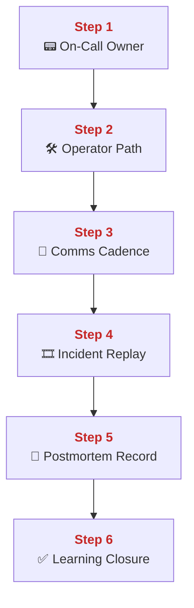
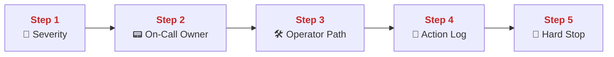
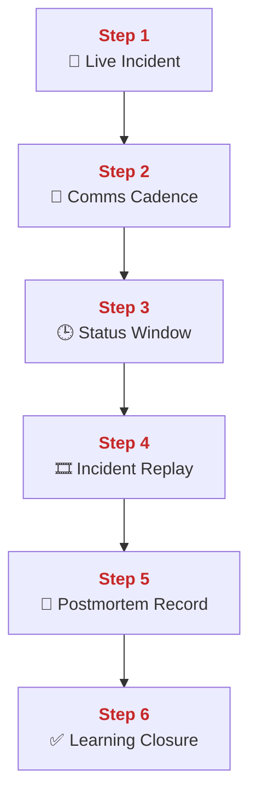
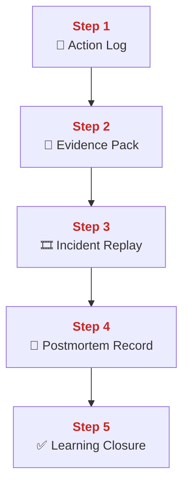
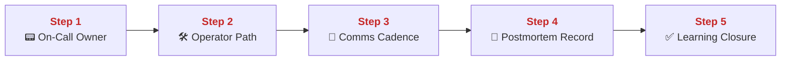
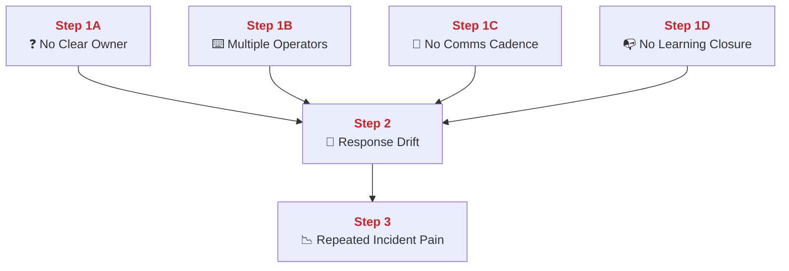
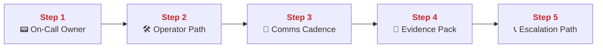
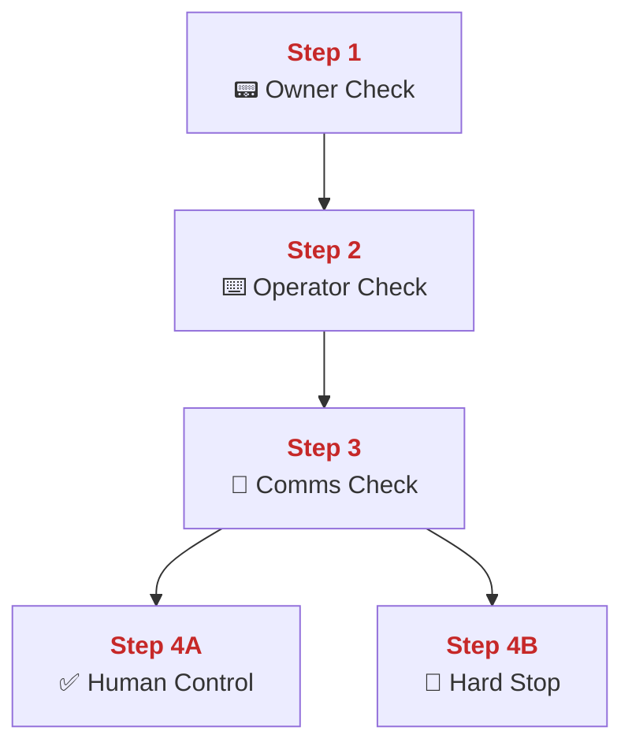

## 04 On Call and Postmortem

This chapter explains how PolyMoly assigns incident roles, keeps communication disciplined, and turns outages into reusable learning.
It also explains how on-call response hands off into replay, timeline review, and written follow-up without losing operational truth.

---

## Quick Jump

- [Visual Contract Map](#visual-contract-map)
- [Vocabulary Dictionary](#vocabulary-dictionary)
- [1. Problem and Purpose](#1-problem-and-purpose)
- [2. End User Flow](#2-end-user-flow)
- [3. How It Works](#3-how-it-works)
- [4. Architectural Decision (ADR Format)](#4-architectural-decision-adr-format)
- [5. How It Fails](#5-how-it-fails)
- [6. How To Fix (Runbook Safety Standard)](#6-how-to-fix-runbook-safety-standard)
- [7. GO / NO-GO Panels](#7-go--no-go-panels)
- [8. Evidence Pack](#8-evidence-pack)
- [9. Operational Checklist](#9-operational-checklist)
- [10. CI / Quality Gate Reference](#10-ci--quality-gate-reference)
- [What Did We Learn](#what-did-we-learn)

---

## Visual Contract Map

### ADU: Incident To Learning Loop

#### Technical Definition

- **[On-Call Owner](#term-on-call-owner)**: The person currently responsible for moving the incident response forward.
- **[Operator Path](#term-operator-path)**: The execution path where one responder performs the approved mutation.
- **[Comms Cadence](#term-comms-cadence)**: The fixed update rhythm used to keep stakeholders informed.
- **[Incident Replay](#term-incident-replay)**: The replay path that reconstructs incident traffic or logs for later analysis.
- **[Postmortem Record](#term-postmortem-record)**: The written learning output that captures timeline, impact, and control gaps.
- **[Learning Closure](#term-learning-closure)**: The point where operational lessons are tracked and not left as vague promises.

#### Diagram



#### 📖 Deterministic Story

- <span style="color:#c62828"><strong>Step 1:</strong></span> One **[On-Call Owner](#term-on-call-owner)** owns the response path.
- <span style="color:#c62828"><strong>Step 2:</strong></span> The approved mutation flows through one **[Operator Path](#term-operator-path)**.
- <span style="color:#c62828"><strong>Step 3:</strong></span> A fixed **[Comms Cadence](#term-comms-cadence)** keeps the status visible.
- <span style="color:#c62828"><strong>Step 4:</strong></span> The incident later feeds an **[Incident Replay](#term-incident-replay)** path.
- <span style="color:#c62828"><strong>Step 5:</strong></span> The replay and evidence become a **[Postmortem Record](#term-postmortem-record)**.
- <span style="color:#c62828"><strong>Step 6:</strong></span> Follow-up work reaches **[Learning Closure](#term-learning-closure)**.

#### 🧠 Conceptual Layer

Here is what physically happens inside the system:

Step 1 begins when a human ownership decision is made. One responder becomes the **[On-Call Owner](#term-on-call-owner)** for the active incident. This is not only a social rule. It changes how commands are issued and how evidence is interpreted, because one person now decides which path is official.

Step 2 is the **[Operator Path](#term-operator-path)**. One person executes the approved action. The network action is the real control-plane mutation against the runtime, but the important control rule is that the keyboard path stays singular. This avoids conflicting state changes from multiple responders.

Step 3 is **[Comms Cadence](#term-comms-cadence)**. At fixed intervals, status moves outward to stakeholders. The system action here is not a runtime change. It is information movement. It matters because silent incidents create their own operational pressure.

Step 4 is **[Incident Replay](#term-incident-replay)** after the live phase. Tools in the repo can reconstruct request patterns or logs into replay artifacts. This gives the team a mechanical way to look at the incident again without guessing from memory.

Step 5 is the **[Postmortem Record](#term-postmortem-record)**. Evidence, replay results, and timeline facts are written into one durable learning object.

Step 6 is **[Learning Closure](#term-learning-closure)**. Learning is only complete when the action items are tracked somewhere operationally real, not only spoken aloud in a meeting.

#### 🧩 Imagine It Like

- One captain holds the map ([On-Call Owner](#term-on-call-owner)).
- One engineer turns the valve ([Operator Path](#term-operator-path)).
- A town crier speaks on schedule ([Comms Cadence](#term-comms-cadence)).
- After the fire, the team replays the event and writes the lesson book ([Incident Replay](#term-incident-replay), [Postmortem Record](#term-postmortem-record)).

#### 🔎 Lemme Explain

- Incidents need role clarity during the event and learning discipline after the event.
- If either half is weak, the organization repeats pain instead of shrinking it.

---

## Vocabulary Dictionary

### Technical Definition

- <a id="term-on-call-owner"></a> **[On-Call Owner](#term-on-call-owner)**: The person currently responsible for moving the incident response forward.
- <a id="term-operator-path"></a> **[Operator Path](#term-operator-path)**: The execution path where one responder performs the approved mutation.
- <a id="term-comms-cadence"></a> **[Comms Cadence](#term-comms-cadence)**: The fixed update rhythm used to keep stakeholders informed.
- <a id="term-incident-replay"></a> **[Incident Replay](#term-incident-replay)**: The replay path that reconstructs incident traffic or logs for later analysis.
- <a id="term-postmortem-record"></a> **[Postmortem Record](#term-postmortem-record)**: The written learning output that captures timeline, impact, and control gaps.
- <a id="term-learning-closure"></a> **[Learning Closure](#term-learning-closure)**: The point where operational lessons are tracked and not left as vague promises.
- <a id="term-severity"></a> **[Severity](#term-severity)**: The declared level of incident impact used to guide response pace and escalation.
- <a id="term-status-window"></a> **[Status Window](#term-status-window)**: The current interval between stakeholder updates during an active incident.
- <a id="term-action-log"></a> **[Action Log](#term-action-log)**: The ordered record of who changed what and when during the incident.
- <a id="term-escalation-path"></a> **[Escalation Path](#term-escalation-path)**: The route used when the current owner or operator cannot safely continue alone.
- <a id="term-evidence-pack"></a> **[Evidence Pack](#term-evidence-pack)**: The minimum set of incident artifacts needed for replay and postmortem.
- <a id="term-hard-stop"></a> **[Hard Stop](#term-hard-stop)**: A condition that blocks further live mutation and forces pause or escalation.
- <a id="term-repeated-incident-pain"></a> **[Repeated Incident Pain](#term-repeated-incident-pain)**: The repeated cost of the same incident pattern returning because learning did not close.
- <a id="term-human-control"></a> **[Human Control](#term-human-control)**: The stable people-side condition where one owner, one operator path, and one comms cadence are explicit.

---

## 1. Problem and Purpose

### Trust Boundary

- External entry: Incident declaration, first alerts, and ownership assignment enter the human control path first.
- Protected side: Live operator mutation and postmortem learning stay behind one owned response line.
- Failure posture: If owner, operator path, or communication rhythm is unclear, pause mutation and re-establish control.

### ADU: One Incident Needs One Control Line

#### Technical Definition

- **[On-Call Owner](#term-on-call-owner)**: The person currently responsible for moving the incident response forward.
- **[Operator Path](#term-operator-path)**: The execution path where one responder performs the approved mutation.
- **[Severity](#term-severity)**: The declared level of incident impact used to guide response pace and escalation.
- **[Action Log](#term-action-log)**: The ordered record of who changed what and when during the incident.
- **[Hard Stop](#term-hard-stop)**: A condition that blocks further live mutation and forces pause or escalation.

#### Diagram



#### 📖 Deterministic Story

- <span style="color:#c62828"><strong>Step 1:</strong></span> The team declares the current **[Severity](#term-severity)**.
- <span style="color:#c62828"><strong>Step 2:</strong></span> One **[On-Call Owner](#term-on-call-owner)** owns the response line.
- <span style="color:#c62828"><strong>Step 3:</strong></span> One **[Operator Path](#term-operator-path)** performs the approved mutation.
- <span style="color:#c62828"><strong>Step 4:</strong></span> The action is written into the **[Action Log](#term-action-log)**.
- <span style="color:#c62828"><strong>Step 5:</strong></span> **[Hard Stop](#term-hard-stop)** rules prevent uncontrolled action overlap.

#### 🧠 Conceptual Layer

Here is what physically happens inside the system:

Step 1 is severity declaration. The team decides how large the current incident is and how quickly escalation or communication should move.

Step 2 is ownership assignment. One person becomes the active control point for this incident. This reduces split-brain decision making.

Step 3 is the single operator path. Only one keyboard path executes the live mutation. This keeps the runtime from receiving conflicting actions at the same time.

Step 4 is the **[Action Log](#term-action-log)**. Every significant command or decision is recorded with time and owner. This turns incident memory into a durable sequence of facts.

Step 5 is **[Hard Stop](#term-hard-stop)**. If actions begin to conflict or if the response grows unclear, the system pauses mutation and forces explicit re-alignment.

#### 🧩 Imagine It Like

- One captain names the emergency level.
- One engineer touches the controls.
- One notebook records every valve movement.

#### 🔎 Lemme Explain

- Role clarity is a control mechanism, not only a social preference.
- Without it, the runtime can receive contradictory commands faster than people realize.

---

## 2. End User Flow

### ADU: Live Incident To Written Learning

#### Technical Definition

- **[Comms Cadence](#term-comms-cadence)**: The fixed update rhythm used to keep stakeholders informed.
- **[Status Window](#term-status-window)**: The current interval between stakeholder updates during an active incident.
- **[Incident Replay](#term-incident-replay)**: The replay path that reconstructs incident traffic or logs for later analysis.
- **[Postmortem Record](#term-postmortem-record)**: The written learning output that captures timeline, impact, and control gaps.
- **[Learning Closure](#term-learning-closure)**: The point where operational lessons are tracked and not left as vague promises.

#### Diagram



#### 📖 Deterministic Story

- <span style="color:#c62828"><strong>Step 1:</strong></span> The incident is active.
- <span style="color:#c62828"><strong>Step 2:</strong></span> A fixed **[Comms Cadence](#term-comms-cadence)** is established.
- <span style="color:#c62828"><strong>Step 3:</strong></span> Each **[Status Window](#term-status-window)** produces a visible update.
- <span style="color:#c62828"><strong>Step 4:</strong></span> After stabilization, the team runs **[Incident Replay](#term-incident-replay)**.
- <span style="color:#c62828"><strong>Step 5:</strong></span> Replay evidence becomes a **[Postmortem Record](#term-postmortem-record)**.
- <span style="color:#c62828"><strong>Step 6:</strong></span> Follow-up work reaches **[Learning Closure](#term-learning-closure)**.

#### 🧠 Conceptual Layer

Here is what physically happens inside the system:

Step 1 is the live outage or degradation state. While operators are fixing runtime, the organization also needs a stable information path.

Step 2 is **[Comms Cadence](#term-comms-cadence)**. A fixed update rhythm is chosen so stakeholders know when the next update will come instead of interrupting the operator path constantly.

Step 3 is the **[Status Window](#term-status-window)**. At each interval, a factual update is written from the current action log and current signal state.

Step 4 is **[Incident Replay](#term-incident-replay)** after stabilization. The team uses replay tooling to reconstruct the incident path in a calmer environment.

Step 5 is the **[Postmortem Record](#term-postmortem-record)**. The team writes timeline, impact, what worked, and which controls were missing.

Step 6 is **[Learning Closure](#term-learning-closure)**. The lesson must be attached to real follow-up, not left as a discussion artifact only.

#### 🧩 Imagine It Like

- During the storm, one board shows timed updates.
- After the storm, the team rewinds the camera.
- Then it writes the lesson book and assigns real repairs.

#### 🔎 Lemme Explain

- Good incident communication protects the operator path.
- Good postmortems protect future incidents from repeating the same control gap.

---

## 3. How It Works

### ADU: Replay And Written Accountability

#### Technical Definition

- **[Incident Replay](#term-incident-replay)**: The replay path that reconstructs incident traffic or logs for later analysis.
- **[Postmortem Record](#term-postmortem-record)**: The written learning output that captures timeline, impact, and control gaps.
- **[Action Log](#term-action-log)**: The ordered record of who changed what and when during the incident.
- **[Evidence Pack](#term-evidence-pack)**: The minimum set of incident artifacts needed for replay and postmortem.
- **[Learning Closure](#term-learning-closure)**: The point where operational lessons are tracked and not left as vague promises.

#### Diagram



#### 📖 Deterministic Story

- <span style="color:#c62828"><strong>Step 1:</strong></span> The **[Action Log](#term-action-log)** preserves the live sequence of events.
- <span style="color:#c62828"><strong>Step 2:</strong></span> The **[Evidence Pack](#term-evidence-pack)** collects the technical proof.
- <span style="color:#c62828"><strong>Step 3:</strong></span> **[Incident Replay](#term-incident-replay)** reconstructs the incident path.
- <span style="color:#c62828"><strong>Step 4:</strong></span> The results are written into a **[Postmortem Record](#term-postmortem-record)**.
- <span style="color:#c62828"><strong>Step 5:</strong></span> Action items move to **[Learning Closure](#term-learning-closure)**.

#### 🧠 Conceptual Layer

Here is what physically happens inside the system:

Step 1 is the live log of human action. Commands, decisions, and timestamps are collected while the incident is still active.

Step 2 is the technical evidence bundle. Logs, traces, dashboards, and any replay inputs are kept together with the human action log.

Step 3 is the replay step. The tooling reads stored incident inputs and reconstructs a testable or reviewable version of the event.

Step 4 is the written output. The team now has enough ordered facts to write a useful postmortem instead of a memory-based story.

Step 5 is closure. A postmortem is only finished when the follow-up moves into tracked work.

#### 🧩 Imagine It Like

- First keep the captain's notebook.
- Then keep the photos and machine readings.
- Later replay the event and write one factual report from both.

#### 🔎 Lemme Explain

- Replay plus written record is how incidents become reusable engineering input.
- Memory alone is too unreliable for operational learning.

---

## 4. Architectural Decision (ADR Format)

### ADU: Separate Ownership, Execution, And Learning

#### Technical Definition

- **[On-Call Owner](#term-on-call-owner)**: The person currently responsible for moving the incident response forward.
- **[Operator Path](#term-operator-path)**: The execution path where one responder performs the approved mutation.
- **[Comms Cadence](#term-comms-cadence)**: The fixed update rhythm used to keep stakeholders informed.
- **[Postmortem Record](#term-postmortem-record)**: The written learning output that captures timeline, impact, and control gaps.
- **[Learning Closure](#term-learning-closure)**: The point where operational lessons are tracked and not left as vague promises.

#### Diagram



#### 📖 Deterministic Story

- <span style="color:#c62828"><strong>Step 1:</strong></span> One **[On-Call Owner](#term-on-call-owner)** keeps decision authority.
- <span style="color:#c62828"><strong>Step 2:</strong></span> One **[Operator Path](#term-operator-path)** keeps runtime mutation clear.
- <span style="color:#c62828"><strong>Step 3:</strong></span> **[Comms Cadence](#term-comms-cadence)** protects the operator from stakeholder interruption.
- <span style="color:#c62828"><strong>Step 4:</strong></span> The incident becomes a **[Postmortem Record](#term-postmortem-record)**.
- <span style="color:#c62828"><strong>Step 5:</strong></span> Action items reach **[Learning Closure](#term-learning-closure)**.

#### 🧠 Conceptual Layer

Here is what physically happens inside the system:

Step 1 is decision ownership. One person holds the official incident thread.

Step 2 is mutation ownership. One keyboard path executes approved runtime changes.

Step 3 is communication separation. Status messages leave on a schedule so the live fix path is not interrupted every minute.

Step 4 is the conversion from incident to record. Once the live phase ends, the facts become a durable write-up.

Step 5 is tracked learning. This is where the organization decides whether it really wants to improve or only to talk about improvement.

#### 🧩 Imagine It Like

- One person steers.
- One person turns the wrench.
- One person updates the crowd.
- Later the same event becomes a lesson file.

#### 🔎 Lemme Explain

- Role separation protects both the live fix and the later learning.
- Mixed roles create noise during incidents and vagueness after incidents.

---

## 5. How It Fails

### ADU: Role Confusion And Learning Drift

#### Technical Definition

- **[On-Call Owner](#term-on-call-owner)**: The person currently responsible for moving the incident response forward.
- **[Operator Path](#term-operator-path)**: The execution path where one responder performs the approved mutation.
- **[Comms Cadence](#term-comms-cadence)**: The fixed update rhythm used to keep stakeholders informed.
- **[Action Log](#term-action-log)**: The ordered record of who changed what and when during the incident.
- **[Learning Closure](#term-learning-closure)**: The point where operational lessons are tracked and not left as vague promises.
- **[Repeated Incident Pain](#term-repeated-incident-pain)**: The repeated cost of the same incident pattern returning because learning did not close.

#### Diagram



#### 📖 Deterministic Story

- <span style="color:#c62828"><strong>Step 1A:</strong></span> Missing **[On-Call Owner](#term-on-call-owner)** creates decision drift.
- <span style="color:#c62828"><strong>Step 1B:</strong></span> Multiple **[Operator Path](#term-operator-path)** threads create conflicting mutations.
- <span style="color:#c62828"><strong>Step 1C:</strong></span> Missing **[Comms Cadence](#term-comms-cadence)** creates silence and interruption pressure.
- <span style="color:#c62828"><strong>Step 1D:</strong></span> Missing **[Learning Closure](#term-learning-closure)** wastes the incident.
- <span style="color:#c62828"><strong>Step 2:</strong></span> These gaps become response drift.
- <span style="color:#c62828"><strong>Step 3:</strong></span> The organization repeats the same failure pain later.

#### 🧠 Conceptual Layer

Here is what physically happens inside the system:

Step 1A is no clear owner. Decisions branch in different directions because nobody has final operational authority.

Step 1B is multiple operators touching the same runtime. Commands overlap and the action log becomes hard to trust.

Step 1C is no update rhythm. Stakeholders ask ad hoc questions, which steals attention from the live operator path.

Step 1D is missing learning closure. The incident ends, but nothing durable changes afterwards.

Step 2 is response drift. The incident becomes noisier than it needs to be.

Step 3 is repeated pain. The same organization meets the same failure again because the lesson was never operationalized.

#### 🧩 Imagine It Like

- Too many captains.
- Too many hands on one wrench.
- No one updating the hallway board.
- No one fixing the broken rule after the smoke clears.

#### 🔎 Lemme Explain

- Human control failures are real outage multipliers.
- Postmortem without follow-up is only documentation theater.

| Symptom | Root Cause | Severity | Fastest confirmation step |
| :--- | :--- | :--- | :--- |
| Conflicting commands | no single operator path | Sev-1 | inspect incident action log |
| Repeated stakeholder interruption | no comms cadence | Sev-2 | inspect update timestamps |
| Same incident repeats later | no learning closure | Sev-2 | compare previous postmortem actions vs current outage |
| Nobody knows who decides | missing owner | Sev-1 | ask who has incident authority |

---

## 6. How To Fix (Runbook Safety Standard)

### ADU: Restore Human Control During Incident

#### Technical Definition

- **[On-Call Owner](#term-on-call-owner)**: The person currently responsible for moving the incident response forward.
- **[Operator Path](#term-operator-path)**: The execution path where one responder performs the approved mutation.
- **[Comms Cadence](#term-comms-cadence)**: The fixed update rhythm used to keep stakeholders informed.
- **[Evidence Pack](#term-evidence-pack)**: The minimum set of incident artifacts needed for replay and postmortem.
- **[Escalation Path](#term-escalation-path)**: The route used when the current owner or operator cannot safely continue alone.

#### Diagram



#### 📖 Deterministic Story

- <span style="color:#c62828"><strong>Step 1:</strong></span> Assign one **[On-Call Owner](#term-on-call-owner)**.
- <span style="color:#c62828"><strong>Step 2:</strong></span> Assign one **[Operator Path](#term-operator-path)**.
- <span style="color:#c62828"><strong>Step 3:</strong></span> Set one **[Comms Cadence](#term-comms-cadence)**.
- <span style="color:#c62828"><strong>Step 4:</strong></span> Keep one **[Evidence Pack](#term-evidence-pack)** updated.
- <span style="color:#c62828"><strong>Step 5:</strong></span> Use the **[Escalation Path](#term-escalation-path)** if current capacity is insufficient.

#### 🧠 Conceptual Layer

Here is what physically happens inside the system:

Step 1 is explicit ownership. One name becomes the active incident owner.

Step 2 is explicit execution ownership. One name becomes the person who runs runtime mutations.

Step 3 is communication scheduling. The team defines the next status interval instead of leaving updates to interruption.

Step 4 is artifact continuity. The team keeps the action log, screenshots, and replay inputs together while the incident is still active.

Step 5 is escalation when the current structure is not enough. This may mean adding more responders, handing ownership upward, or widening specialist involvement.

#### 🧩 Imagine It Like

- Put one captain at the board.
- Put one mechanic at the valve.
- Put one town crier on the clock.

#### 🔎 Lemme Explain

- Good incident control starts with role assignment before the next command.
- Postmortem quality depends on what the team records during the live event.

### Exact Runbook Commands

```bash
# Read-only checks
go run ./system/tools/poly/cmd/poly gate check incident-replay
bash go run ./system/tools/poly/cmd/poly gate check training-program
```

```bash
# Mutation (only after ownership, operator path, and comms cadence are explicit)
go run ./system/tools/poly/cmd/poly resilience replay
```

```bash
# Verify
go run ./system/tools/poly/cmd/poly gate check incident-replay
```

Rollback rule:
- If role confusion is still active, STOP live mutation until owner and operator are explicit.
- Do not let replay or postmortem work disrupt active outage control.

---

## 7. GO / NO-GO Panels

### ADU: Human Control Gate

#### Technical Definition

- **[On-Call Owner](#term-on-call-owner)**: The person currently responsible for moving the incident response forward.
- **[Operator Path](#term-operator-path)**: The execution path where one responder performs the approved mutation.
- **[Comms Cadence](#term-comms-cadence)**: The fixed update rhythm used to keep stakeholders informed.
- **[Action Log](#term-action-log)**: The ordered record of who changed what and when during the incident.
- **[Hard Stop](#term-hard-stop)**: A condition that blocks further live mutation and forces pause or escalation.
- **[Human Control](#term-human-control)**: The stable people-side condition where one owner, one operator path, and one comms cadence are explicit.

#### Diagram



#### 📖 Deterministic Story

- <span style="color:#c62828"><strong>Step 1:</strong></span> The gate checks for one owner.
- <span style="color:#c62828"><strong>Step 2:</strong></span> The gate checks for one **[Operator Path](#term-operator-path)**.
- <span style="color:#c62828"><strong>Step 3:</strong></span> The gate checks for active **[Comms Cadence](#term-comms-cadence)**.
- <span style="color:#c62828"><strong>Step 4A:</strong></span> If all are present, **[Human Control](#term-human-control)** is GO.
- <span style="color:#c62828"><strong>Step 4B:</strong></span> If any are missing, the state is NO-GO for further mutation.

#### 🧠 Conceptual Layer

Here is what physically happens inside the system:

Step 1 checks ownership. If nobody clearly owns the incident, the team is already at risk of split decisions.

Step 2 checks execution path. If multiple people are about to type commands, the runtime is at risk of conflicting changes.

Step 3 checks communication rhythm. If status updates are not controlled, interruption pressure will grow and harm the operator path.

Step 4A is GO only when the human control system is stable enough to support safe runtime mutation. Step 4B is NO-GO when the human side is already too noisy.

#### 🧩 Imagine It Like

- One captain.
- One wrench hand.
- One clock for updates.

#### 🔎 Lemme Explain

- The people layer has its own GO / NO-GO gate.
- A technically good fix path can still fail under bad human control.

---

## 8. Evidence Pack

### Incident Response Template

#### Timeline

- Record first alert time, first response action, stabilization time, and closure time in UTC.

#### Impact

- Record affected users, blast radius, degraded capability, and visible business effect.

#### Detection Gap

- Record what signal was late, missing, noisy, or misunderstood during detection.

#### Control Gap

- Record which ownership, runbook, guardrail, or safety rule failed during response.

#### Learning

- Record the follow-up change, owner, due path, and the evidence that will prove closure.

Collect before closing the incident or writing the postmortem:

- Incident action log with timestamps.
- Alert, dashboard, and trace references.
- Final blast-radius statement.
- Communication timeline.
- Replay artifact references if generated.
- Follow-up owner and due path.

---

## 9. Operational Checklist

- [ ] Owner is explicit.
- [ ] Operator path is singular.
- [ ] Comms cadence is active.
- [ ] Action log is current.
- [ ] Replay inputs are preserved.
- [ ] Follow-up has a real owner.

---

## 10. CI / Quality Gate Reference

Run:

```bash
task docs:governance
task docs:governance:strict
go run ./system/tools/poly/cmd/poly gate check incident-replay
bash go run ./system/tools/poly/cmd/poly gate check training-program
```

Related workflows and evidence:

- `.github/workflows/incident-replay-gate.yml`
- `.github/workflows/chaos-failure-modes.yml`
- `tools/artifacts/incident-replay/`
- `tools/artifacts/chaos-training/`
- `tools/artifacts/docs-governance/`
- `tools/artifacts/docs-links/`

---

## What Did We Learn

- One owner and one operator path reduce human-generated incident noise.
- Comms cadence protects the live fix path.
- Replay and postmortem convert incident pain into engineering input.
- Learning is incomplete until follow-up is tracked and owned.

👉 Next Chapter: **[01-orchestration-and-ha.md](../../architecture/deploy-and-scale/01-orchestration-and-ha.md)**
