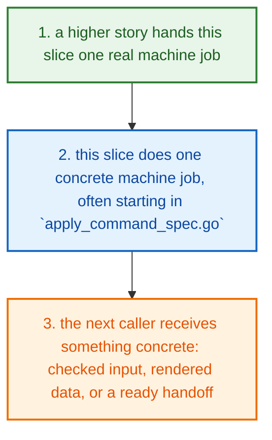
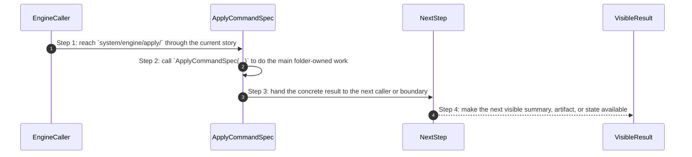
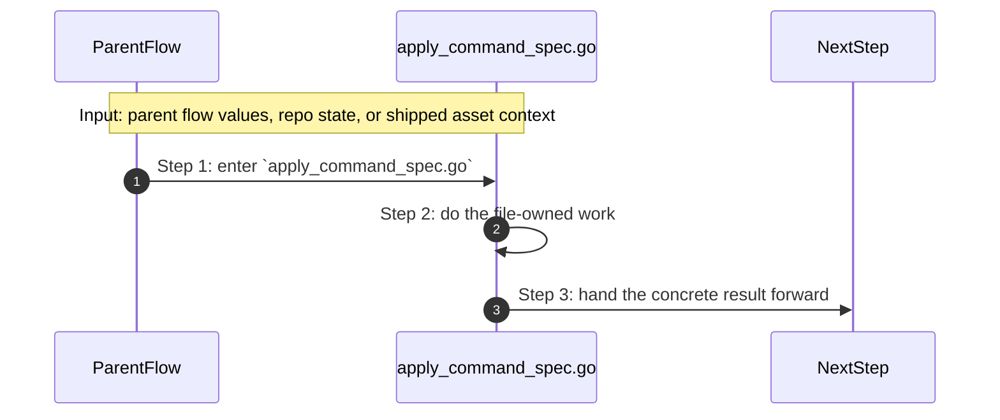
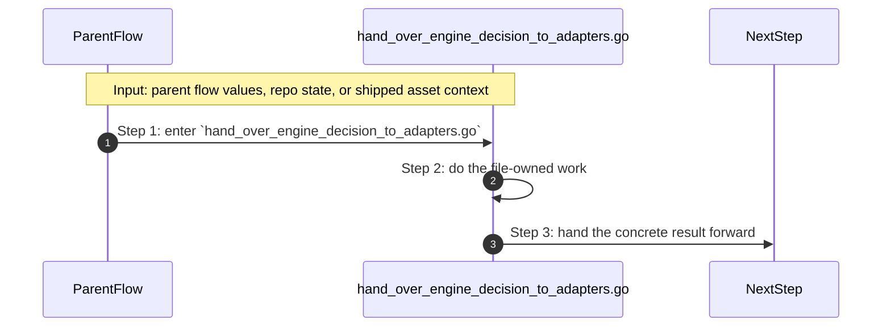

# System Engine Apply How This Works

## What this folder is

`system/engine/apply/` is where a resolved command spec becomes a safe handoff to adapters.

The engine is done deciding here. This folder is about handing the prepared step to the outside-world boundary without losing the contract.

## Real commands or triggers that reach this folder

- apply and runtime start flows after preview or resolution has produced command specs

## Exact upstream handoffs

- `system/engine/resolve/` and higher runtime flows hand a command spec into this folder after decision work is finished
- `ApplyCommandSpec(...)` and `HandOverEngineDecisionToAdapters(...)` are the key handoffs here

## The simplest story

- a higher product, engine, or tooling story reaches this slice because it needs one reusable step
- this folder does one small machine-facing job, often starting in `apply_command_spec.go`
- the next step gets something concrete back: a helper result, a rendered model, an adapter handoff, or a cleaner request



## The first important path

When a real caller reaches this slice for this exact reason:

```text
apply and runtime start flows after preview or resolution has produced command specs
```

the important path is:



- **Step 1:** This is the moment the story actually enters this folder instead of staying in a higher router or parent helper.
- **Step 2:** The first real work starts in `apply_command_spec.go` through `ApplyCommandSpec(...)`.
- **Step 3:** From here, the story moves to one smaller file, child slice, or boundary that can do the next concrete job.
- **Step 4:** At the end, the caller has something concrete to carry forward: a file on disk, a rendered asset, a proof artifact, or a clear next state.

## Direct files in this folder

### `apply_command_spec.go`

This file is one direct stop in the story for this folder.

Why this name is honest:

- its main action is still visible in the code, starting with `ApplyCommandSpec(...)`

When the story opens this file:

- when the `system/engine/apply/` story needs this responsibility, it opens `apply_command_spec.go`

What arrives here:

- caller-provided values from the parent flow

What leaves this file:

- the result of `ApplyCommandSpec(...)` for the next caller
- a concrete return value, file write, check result, or summary depending on the path

Why you open it first:

- open this file when the symptom points to `ApplyCommandSpec(...)` doing the wrong thing



- **Step 1:** The story reaches `apply_command_spec.go` because this file owns the next small responsibility.
- **Step 2:** The file does its own narrow action instead of mixing it into a bigger caller.
- **Step 3:** The next caller gets a concrete result, not another vague promise.

Important functions:

- `ScriptCommand(...)`
  Small helper for one narrow sub-step. It exists so the main path stays readable.
- `ToolCommand(...)`
  Small helper for one narrow sub-step. It exists so the main path stays readable.
- `SelfCommand(...)`
  Small helper for one narrow sub-step. It exists so the main path stays readable.
- `IsSelf(...)`
  Small helper for one narrow sub-step. It exists so the main path stays readable.
- `IsRepoRelative(...)`
  Small helper for one narrow sub-step. It exists so the main path stays readable.
- `Resolve(...)`
  Small helper for one narrow sub-step. It exists so the main path stays readable.
- `Display(...)`
  Small helper for one narrow sub-step. It exists so the main path stays readable.
- `ApplyCommandSpec(...)`
  This is the main action in the file. It does the folder's primary job and returns the next concrete result.

### `hand_over_engine_decision_to_adapters.go`

This file is one direct stop in the story for this folder.

Why this name is honest:

- its main action is still visible in the code, starting with `HandOverEngineDecisionToAdapters(...)`

When the story opens this file:

- when the `system/engine/apply/` story needs this responsibility, it opens `hand_over_engine_decision_to_adapters.go`

What arrives here:

- caller-provided values from the parent flow

What leaves this file:

- the result of `HandOverEngineDecisionToAdapters(...)` for the next caller
- a concrete return value, file write, check result, or summary depending on the path

Why you open it first:

- open this file when the symptom points to `HandOverEngineDecisionToAdapters(...)` doing the wrong thing



- **Step 1:** The story reaches `hand_over_engine_decision_to_adapters.go` because this file owns the next small responsibility.
- **Step 2:** The file does its own narrow action instead of mixing it into a bigger caller.
- **Step 3:** The next caller gets a concrete result, not another vague promise.

Important functions:

- `HandOverEngineDecisionToAdapters(...)`
  This is the main action in the file. It does the folder's primary job and returns the next concrete result.

## Child folders in this folder

This folder has no child folders in scope.

## Debug first

- start with `ApplyCommandSpec(...)` in `apply_command_spec.go` when that action looks wrong
- start with `HandOverEngineDecisionToAdapters(...)` in `hand_over_engine_decision_to_adapters.go` when that action looks wrong

## What to remember

- `system/engine/apply/` exists so this slice has one obvious home.
- The fastest map is still the naming law: folder for flow, file for responsibility, function for exact action.
- If the visible result is wrong, start with the first direct file that owns the next honest action in the flow.

## Dictionary

<a id="dictionary-system"></a>
- `system`: The system is the machine-facing body of PolyMoly. It holds the code, assets, checks, and boundaries that make product stories real.
<a id="dictionary-engine"></a>
- `engine`: The engine is the decision core. It reads intent, matches capabilities, prepares render data, and hands safe work to the next layer.
<a id="dictionary-adapter"></a>
- `adapter`: An adapter is the place where PolyMoly touches the outside world, like files, Docker, environment files, or the browser.
<a id="dictionary-gate"></a>
- `gate`: A gate is a verification run that decides PASS or FAIL before trust increases.
<a id="dictionary-artifact"></a>
- `artifact`: An artifact is a file, bundle, or proof another tool or operator can read later.
<a id="dictionary-runtime"></a>
- `runtime`: Runtime is the live or rendered execution world PolyMoly starts, previews, inspects, or validates.
