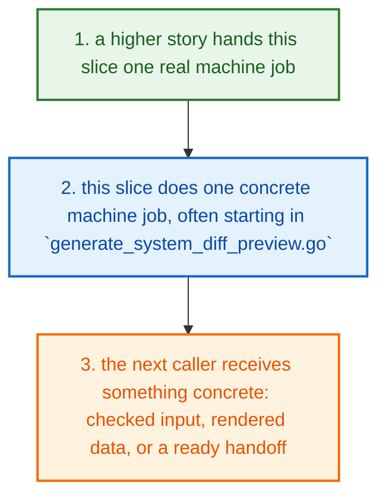
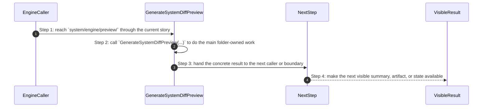
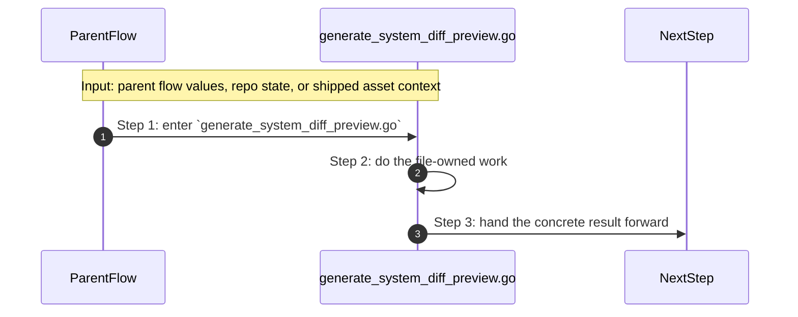
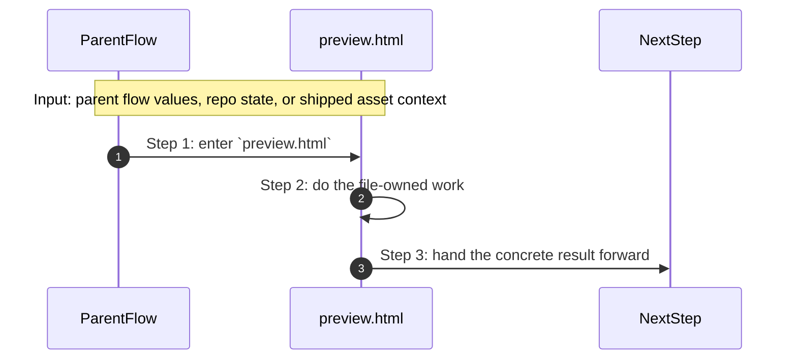
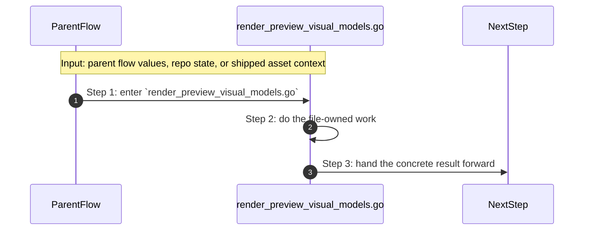
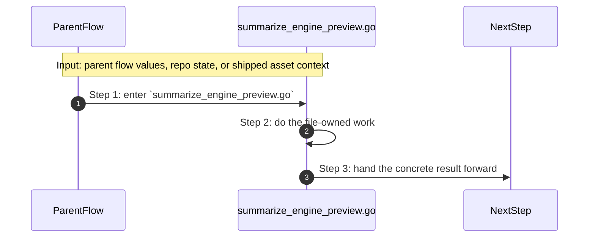

# System Engine Preview How This Works

## What this folder is

`system/engine/preview/` is where the engine turns a planned change into a readable preview and diff model.

This is the safety-shaped part that shows what would happen before the outside world is touched.

## Real commands or triggers that reach this folder

- preview flows before mutation work is allowed to continue

## Exact upstream handoffs

- `system/engine/request/` and project preview flows hand work here once the system owes the user a readable preview
- `GenerateSystemDiffPreview(...)` and the render-preview files take over from there

## The simplest story

- a higher product, engine, or tooling story reaches this slice because it needs one reusable step
- this folder does one small machine-facing job, often starting in `generate_system_diff_preview.go`
- the next step gets something concrete back: a helper result, a rendered model, an adapter handoff, or a cleaner request



## The first important path

When a real caller reaches this slice for this exact reason:

```text
preview flows before mutation work is allowed to continue
```

the important path is:



- **Step 1:** This is the moment the story actually enters this folder instead of staying in a higher router or parent helper.
- **Step 2:** The first real work starts in `generate_system_diff_preview.go` through `GenerateSystemDiffPreview(...)`.
- **Step 3:** From here, the story moves to one smaller file, child slice, or boundary that can do the next concrete job.
- **Step 4:** At the end, the caller has something concrete to carry forward: a file on disk, a rendered asset, a proof artifact, or a clear next state.

## Direct files in this folder

### `generate_system_diff_preview.go`

This file is one direct stop in the story for this folder.

Why this name is honest:

- its main action is still visible in the code, starting with `GenerateSystemDiffPreview(...)`

When the story opens this file:

- when the `system/engine/preview/` story needs this responsibility, it opens `generate_system_diff_preview.go`

What arrives here:

- caller-provided values from the parent flow

What leaves this file:

- the result of `GenerateSystemDiffPreview(...)` for the next caller
- a concrete return value, file write, check result, or summary depending on the path

Why you open it first:

- open this file when the symptom points to `GenerateSystemDiffPreview(...)` doing the wrong thing



- **Step 1:** The story reaches `generate_system_diff_preview.go` because this file owns the next small responsibility.
- **Step 2:** The file does its own narrow action instead of mixing it into a bigger caller.
- **Step 3:** The next caller gets a concrete result, not another vague promise.

Important functions:

- `GenerateSystemDiffPreview(...)`
  This is the main action in the file. It does the folder's primary job and returns the next concrete result.
- `CompareCurrentAgainstPreviousModel(...)`
  Small helper for one narrow sub-step. It exists so the main path stays readable.

### `preview.html`

This file ships the `preview.html` web or script asset that a later runtime or UI step reads directly.

Why this name is honest:

- the file name already tells you what concrete artifact or config lives here

When the story opens this file:

- when the `system/engine/preview/` story needs this responsibility, it opens `preview.html`

What arrives here:

- the next render, runtime, or browser step reads this shipped asset as-is

What leaves this file:

- the shipped `preview.html` asset
- a concrete file the next render or runtime step can read directly

Why you open it first:

- open this file when the generated or shipped asset itself looks wrong



- **Step 1:** The story reaches `preview.html` because this file owns the next small responsibility.
- **Step 2:** The file does its own narrow action instead of mixing it into a bigger caller.
- **Step 3:** The next caller gets a concrete result, not another vague promise.

Important functions:

This file does not expose top-level functions. That is fine. The file itself is the artifact the next step reads.

### `render_preview_visual_models.go`

This file is one direct stop in the story for this folder.

Why this name is honest:

- its main action is still visible in the code, starting with `BuildDiff(...)`

When the story opens this file:

- when the `system/engine/preview/` story needs this responsibility, it opens `render_preview_visual_models.go`

What arrives here:

- caller-provided values from the parent flow
- config or model values that need to be normalized, rendered, or checked

What leaves this file:

- the result of `BuildDiff(...)` for the next caller
- a concrete return value, file write, check result, or summary depending on the path

Why you open it first:

- open this file when the symptom points to `BuildDiff(...)` doing the wrong thing



- **Step 1:** The story reaches `render_preview_visual_models.go` because this file owns the next small responsibility.
- **Step 2:** The file does its own narrow action instead of mixing it into a bigger caller.
- **Step 3:** The next caller gets a concrete result, not another vague promise.

Important functions:

- `Diff(...)`
  Small helper for one narrow sub-step. It exists so the main path stays readable.
- `BuildDiff(...)`
  This is the main action in the file. It does the folder's primary job and returns the next concrete result.

### `summarize_engine_preview.go`

This file is one direct stop in the story for this folder.

Why this name is honest:

- its main action is still visible in the code, starting with `WriteRunnerSummary(...)`

When the story opens this file:

- when the `system/engine/preview/` story needs this responsibility, it opens `summarize_engine_preview.go`

What arrives here:

- caller-provided values from the parent flow

What leaves this file:

- the result of `WriteRunnerSummary(...)` for the next caller
- a concrete return value, file write, check result, or summary depending on the path

Why you open it first:

- open this file when the symptom points to `WriteRunnerSummary(...)` doing the wrong thing



- **Step 1:** The story reaches `summarize_engine_preview.go` because this file owns the next small responsibility.
- **Step 2:** The file does its own narrow action instead of mixing it into a bigger caller.
- **Step 3:** The next caller gets a concrete result, not another vague promise.

Important functions:

- `NewRunnerSummary(...)`
  Small helper for one narrow sub-step. It exists so the main path stays readable.
- `WriteRunnerSummary(...)`
  This is the main action in the file. It does the folder's primary job and returns the next concrete result.
- `PrintStepHeader(...)`
  Small helper for one narrow sub-step. It exists so the main path stays readable.

## Child folders in this folder

This folder has no child folders in scope.

## Debug first

- start with `GenerateSystemDiffPreview(...)` in `generate_system_diff_preview.go` when that action looks wrong
- start with `preview.html` when the shipped asset or contract itself looks wrong
- start with `BuildDiff(...)` in `render_preview_visual_models.go` when that action looks wrong
- start with `WriteRunnerSummary(...)` in `summarize_engine_preview.go` when that action looks wrong

## What to remember

- `system/engine/preview/` exists so this slice has one obvious home.
- The fastest map is still the naming law: folder for flow, file for responsibility, function for exact action.
- If the visible result is wrong, start with the first direct file that owns the next honest action in the flow.

## Dictionary

<a id="dictionary-system"></a>
- `system`: The system is the machine-facing body of PolyMoly. It holds the code, assets, checks, and boundaries that make product stories real.
<a id="dictionary-engine"></a>
- `engine`: The engine is the decision core. It reads intent, matches capabilities, prepares render data, and hands safe work to the next layer.
<a id="dictionary-adapter"></a>
- `adapter`: An adapter is the place where PolyMoly touches the outside world, like files, Docker, environment files, or the browser.
<a id="dictionary-gate"></a>
- `gate`: A gate is a verification run that decides PASS or FAIL before trust increases.
<a id="dictionary-artifact"></a>
- `artifact`: An artifact is a file, bundle, or proof another tool or operator can read later.
<a id="dictionary-runtime"></a>
- `runtime`: Runtime is the live or rendered execution world PolyMoly starts, previews, inspects, or validates.
