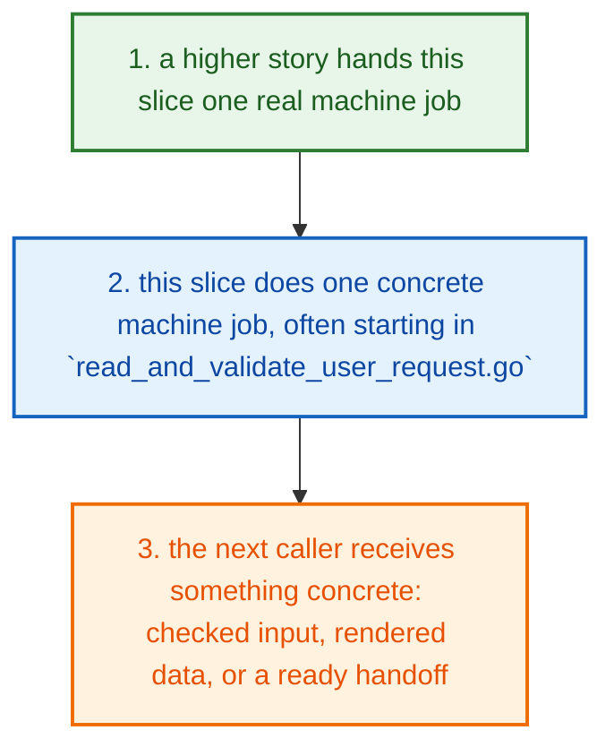
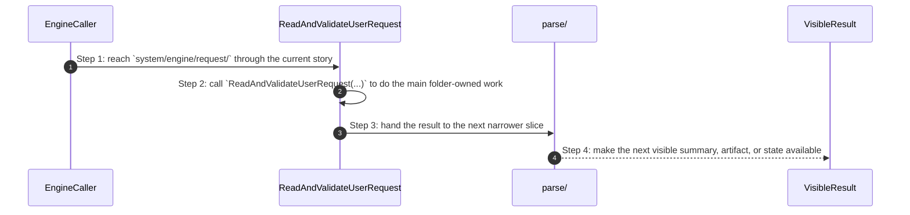
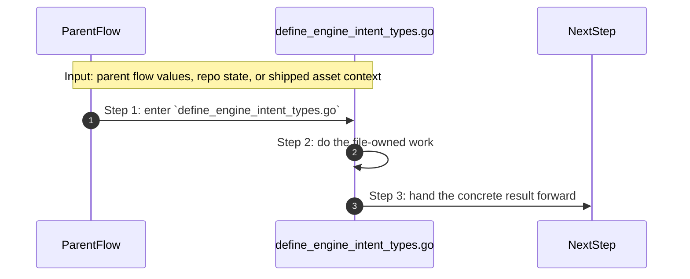
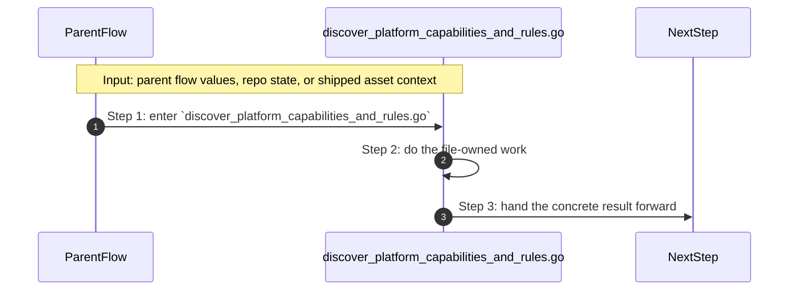
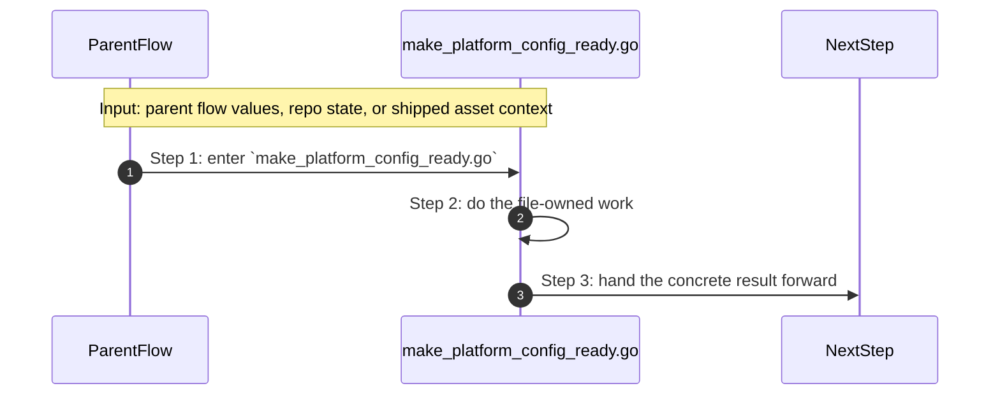
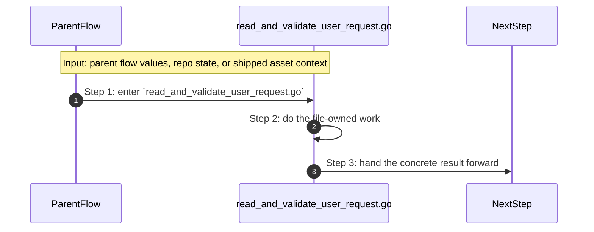

# System Engine Request How This Works

## What this folder is

`system/engine/request/` is where outside input becomes a clean engine request.

This folder is the intake side of the engine. It reads what the caller asked for and turns it into something the rest of the engine can trust.

## Real commands or triggers that reach this folder

- preview, up, and gate flows after CLI routing chooses an engine path

## Exact upstream handoffs

- `system/tools/poly/internal/cli/route_project_commands.go` and `system/tools/poly/internal/runner/run_gate_profile.go` are common callers above engine request intake
- `ReadAndValidateUserRequest(...)` and the request child files take over once a higher story needs a validated engine request

## The simplest story

- a higher product, engine, or tooling story reaches this slice because it needs one reusable step
- this folder does one small machine-facing job, often starting in `read_and_validate_user_request.go`
- the next step gets something concrete back: a helper result, a rendered model, an adapter handoff, or a cleaner request



## The first important path

When a real caller reaches this slice for this exact reason:

```text
preview, up, and gate flows after CLI routing chooses an engine path
```

the important path is:



- **Step 1:** This is the moment the story actually enters this folder instead of staying in a higher router or parent helper.
- **Step 2:** The first real work starts in `read_and_validate_user_request.go` through `ReadAndValidateUserRequest(...)`.
- **Step 3:** From here, the story moves to one smaller file, child slice, or boundary that can do the next concrete job.
- **Step 4:** At the end, the caller has something concrete to carry forward: a file on disk, a rendered asset, a proof artifact, or a clear next state.

## Direct files in this folder

### `define_engine_intent_types.go`

This Go file defines the `define engine intent types` contract or data shape.

Why this name is honest:

- the file name already tells you what concrete artifact or config lives here

When the story opens this file:

- when the `system/engine/request/` story needs this responsibility, it opens `define_engine_intent_types.go`

What arrives here:

- typed values the rest of the package needs to pass around safely

What leaves this file:

- a typed contract the rest of the package can trust

Why you open it first:

- open this file when the generated or shipped asset itself looks wrong



- **Step 1:** The story reaches `define_engine_intent_types.go` because this file owns the next small responsibility.
- **Step 2:** The file does its own narrow action instead of mixing it into a bigger caller.
- **Step 3:** The next caller gets a concrete result, not another vague promise.

Important functions:

This file does not expose top-level functions. That is fine. The file itself is the artifact the next step reads.

### `discover_platform_capabilities_and_rules.go`

This file is one direct stop in the story for this folder.

Why this name is honest:

- its main action is still visible in the code, starting with `DiscoverPlatformCapabilitiesAndRules(...)`

When the story opens this file:

- when the `system/engine/request/` story needs this responsibility, it opens `discover_platform_capabilities_and_rules.go`

What arrives here:

- caller-provided values from the parent flow
- repo or project paths that tell the file where to read or write

What leaves this file:

- the result of `DiscoverPlatformCapabilitiesAndRules(...)` for the next caller
- a concrete return value, file write, check result, or summary depending on the path

Why you open it first:

- open this file when the symptom points to `DiscoverPlatformCapabilitiesAndRules(...)` doing the wrong thing



- **Step 1:** The story reaches `discover_platform_capabilities_and_rules.go` because this file owns the next small responsibility.
- **Step 2:** The file does its own narrow action instead of mixing it into a bigger caller.
- **Step 3:** The next caller gets a concrete result, not another vague promise.

Important functions:

- `DiscoverPlatformCapabilitiesAndRules(...)`
  This is the main action in the file. It does the folder's primary job and returns the next concrete result.
- `resolveRepoRoot(...)`
  Small helper for one narrow sub-step. It exists so the main path stays readable.
- `isRepoRoot(...)`
  Small helper for one narrow sub-step. It exists so the main path stays readable.
- `dirExists(...)`
  Small helper for one narrow sub-step. It exists so the main path stays readable.
- `loadModules(...)`
  Small helper for one narrow sub-step. It exists so the main path stays readable.
- `loadCapabilities(...)`
  Small helper for one narrow sub-step. It exists so the main path stays readable.
- `loadRenderAssets(...)`
  Small helper for one narrow sub-step. It exists so the main path stays readable.
- `loadNamedDocuments(...)`
  Small helper for one narrow sub-step. It exists so the main path stays readable.
- `loadEnvironmentDocuments(...)`
  Small helper for one narrow sub-step. It exists so the main path stays readable.
- `loadYAML(...)`
  Small helper for one narrow sub-step. It exists so the main path stays readable.
- `mergeNamedDocuments(...)`
  Small helper for one narrow sub-step. It exists so the main path stays readable.
- `validatePlatformBundle(...)`
  Small helper for one narrow sub-step. It exists so the main path stays readable.
- `collectFiles(...)`
  Small helper for one narrow sub-step. It exists so the main path stays readable.

### `make_platform_config_ready.go`

This file is one direct stop in the story for this folder.

Why this name is honest:

- its main action is still visible in the code, starting with `MakePlatformConfigReady(...)`

When the story opens this file:

- when the `system/engine/request/` story needs this responsibility, it opens `make_platform_config_ready.go`

What arrives here:

- caller-provided values from the parent flow
- config or model values that need to be normalized, rendered, or checked

What leaves this file:

- the result of `MakePlatformConfigReady(...)` for the next caller
- a concrete return value, file write, check result, or summary depending on the path

Why you open it first:

- open this file when the symptom points to `MakePlatformConfigReady(...)` doing the wrong thing



- **Step 1:** The story reaches `make_platform_config_ready.go` because this file owns the next small responsibility.
- **Step 2:** The file does its own narrow action instead of mixing it into a bigger caller.
- **Step 3:** The next caller gets a concrete result, not another vague promise.

Important functions:

- `MakePlatformConfigReady(...)`
  This is the main action in the file. It does the folder's primary job and returns the next concrete result.

### `read_and_validate_user_request.go`

This file is one direct stop in the story for this folder.

Why this name is honest:

- its main action is still visible in the code, starting with `ReadAndValidateUserRequest(...)`

When the story opens this file:

- when the `system/engine/request/` story needs this responsibility, it opens `read_and_validate_user_request.go`

What arrives here:

- caller-provided values from the parent flow

What leaves this file:

- the result of `ReadAndValidateUserRequest(...)` for the next caller
- a concrete return value, file write, check result, or summary depending on the path

Why you open it first:

- open this file when the symptom points to `ReadAndValidateUserRequest(...)` doing the wrong thing



- **Step 1:** The story reaches `read_and_validate_user_request.go` because this file owns the next small responsibility.
- **Step 2:** The file does its own narrow action instead of mixing it into a bigger caller.
- **Step 3:** The next caller gets a concrete result, not another vague promise.

Important functions:

- `ReadAndValidateUserRequest(...)`
  This is the main action in the file. It does the folder's primary job and returns the next concrete result.

## Child folders in this folder

### `parse/`

Open [`parse/how-this-works.md`](./parse/how-this-works.md).

Use it when the story includes:

- preview, up, and gate flows after CLI routing chooses an engine path

## Debug first

- start with `define_engine_intent_types.go` when the shipped asset or contract itself looks wrong
- start with `DiscoverPlatformCapabilitiesAndRules(...)` in `discover_platform_capabilities_and_rules.go` when that action looks wrong
- start with `MakePlatformConfigReady(...)` in `make_platform_config_ready.go` when that action looks wrong
- start with `ReadAndValidateUserRequest(...)` in `read_and_validate_user_request.go` when that action looks wrong

## What to remember

- `system/engine/request/` exists so this slice has one obvious home.
- The fastest map is still the naming law: folder for flow, file for responsibility, function for exact action.
- If the folder overview feels too wide, jump to the child slice that matches the current symptom instead of reading sideways.

## Dictionary

<a id="dictionary-system"></a>
- `system`: The system is the machine-facing body of PolyMoly. It holds the code, assets, checks, and boundaries that make product stories real.
<a id="dictionary-engine"></a>
- `engine`: The engine is the decision core. It reads intent, matches capabilities, prepares render data, and hands safe work to the next layer.
<a id="dictionary-adapter"></a>
- `adapter`: An adapter is the place where PolyMoly touches the outside world, like files, Docker, environment files, or the browser.
<a id="dictionary-gate"></a>
- `gate`: A gate is a verification run that decides PASS or FAIL before trust increases.
<a id="dictionary-artifact"></a>
- `artifact`: An artifact is a file, bundle, or proof another tool or operator can read later.
<a id="dictionary-runtime"></a>
- `runtime`: Runtime is the live or rendered execution world PolyMoly starts, previews, inspects, or validates.
