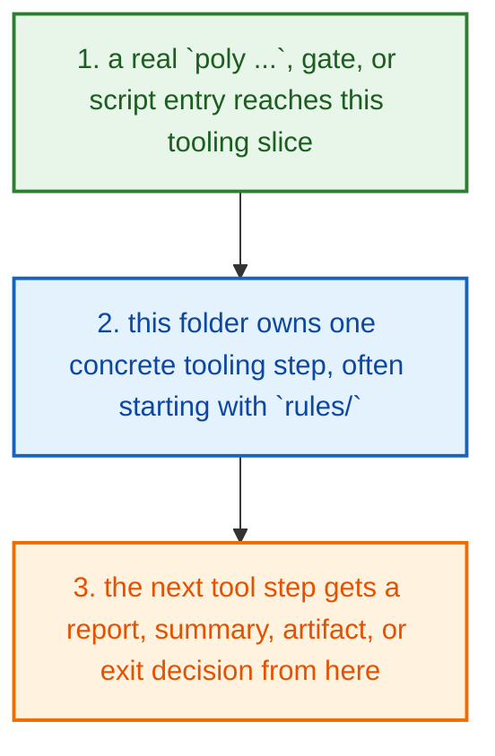
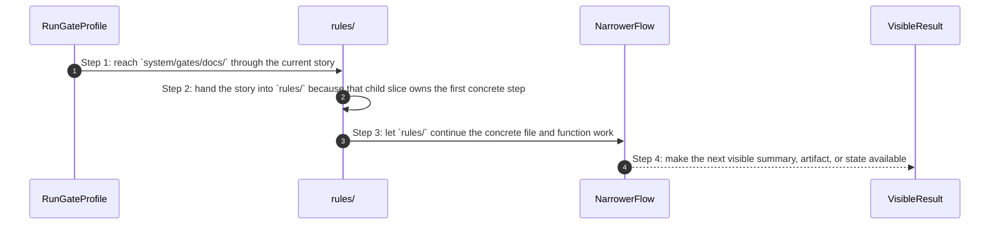

# System Gates Docs How This Works

## What this folder is

`system/gates/docs/` is one gate-specific slice.

This folder exists so one check family or gate fixture has a stable home that the runner and CI can point at.

## Real commands that reach this folder

- `poly gate run docs`
- `poly docs ...`

## Exact CLI front doors

- `system/tools/poly/cmd/poly/main.go`
- function: `main()`
- `poly gate run ...` -> `RunGateProfile(...)` in `system/tools/poly/internal/runner/run_gate_profile.go`
- `bash system/gates/run ...` wraps the same canonical gate profiles from shell entrypoints

## The simplest story

- a real `poly ...`, gate, or script entry reaches this tooling slice
- this folder owns one concrete tooling step, often starting with `rules/`
- the next tool step gets a report, summary, artifact, or exit decision from here



## The first important path

When you type:

```bash
poly gate run docs
```

the important path is:



- **Step 1:** This is the moment the story actually enters this folder instead of staying in a higher router or parent helper.
- **Step 2:** The first real work starts in `rules/`.
- **Step 3:** From here, the story moves to one smaller file, child slice, or boundary that can do the next concrete job.
- **Step 4:** At the end, the caller has something concrete to carry forward: a file on disk, a rendered asset, a proof artifact, or a clear next state.

## Direct files in this folder

This folder has no direct first-party files besides this guide.

## Child folders in this folder

### `rules/`

Open [`rules/how-this-works.md`](./rules/how-this-works.md).

Use it when the story includes:

- `poly gate run docs`
- `poly docs ...`

### `tests/`

Open [`tests/how-this-works.md`](./tests/how-this-works.md).

Use it when the story includes:

- `poly gate run docs`
- `poly docs ...`

## Debug first

- open `rules/how-this-works.md` when the symptom clearly belongs to that child story
- open `tests/how-this-works.md` when the symptom clearly belongs to that child story

## What to remember

- `system/gates/docs/` exists so this slice has one obvious home.
- The fastest map is still the naming law: folder for flow, file for responsibility, function for exact action.
- If the folder overview feels too wide, jump to the child slice that matches the current symptom instead of reading sideways.

## Dictionary

<a id="dictionary-command"></a>
- `command`: A command is the exact CLI sentence that starts the flow.
<a id="dictionary-gate"></a>
- `gate`: A gate is one named verification profile or check that decides whether trust can increase.
<a id="dictionary-review-pack"></a>
- `review pack`: A review pack is the merged workspace snapshot PolyMoly writes so a reviewer can inspect one deterministic bundle.
<a id="dictionary-artifact"></a>
- `artifact`: An artifact is a summary, report, bundle, or receipt another tool can read later.
<a id="dictionary-summary"></a>
- `summary`: A summary is the short machine-readable or operator-readable result a tool writes after it finishes.
<a id="dictionary-runtime"></a>
- `runtime`: Runtime here means the source-native CLI or external process world the tool starts or inspects.
