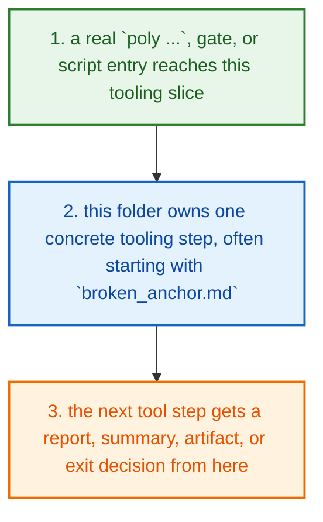
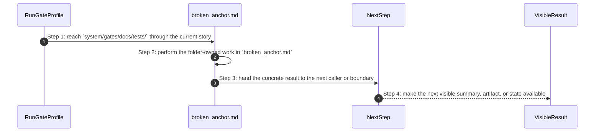
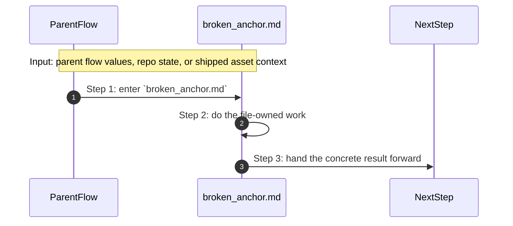
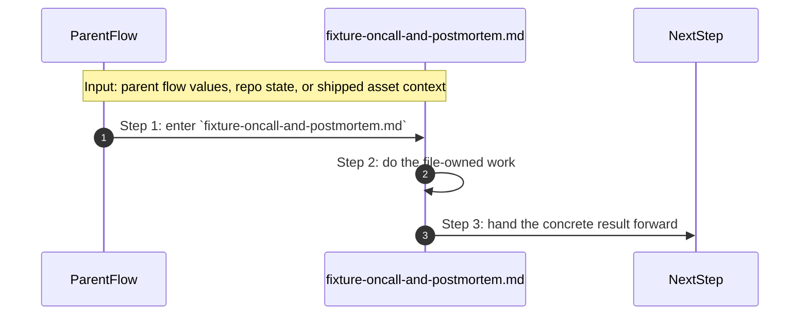
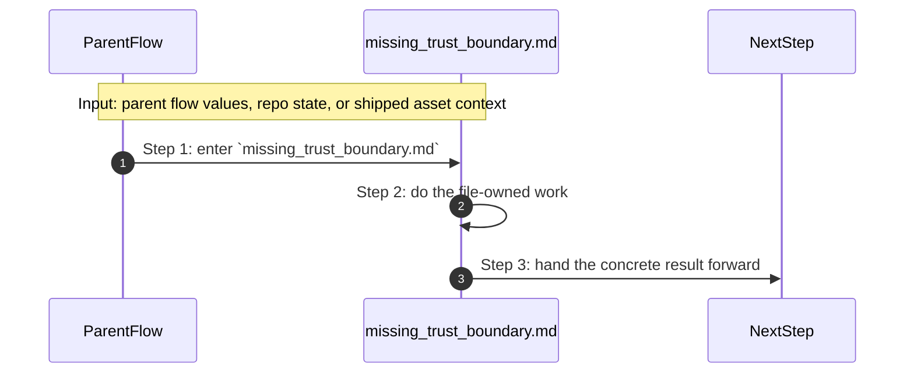
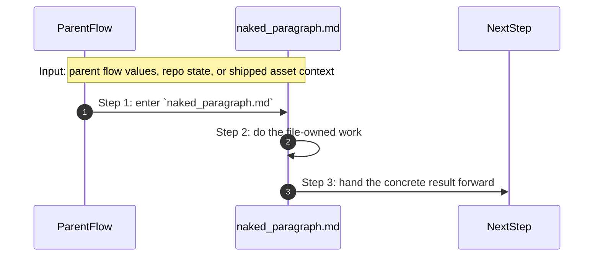
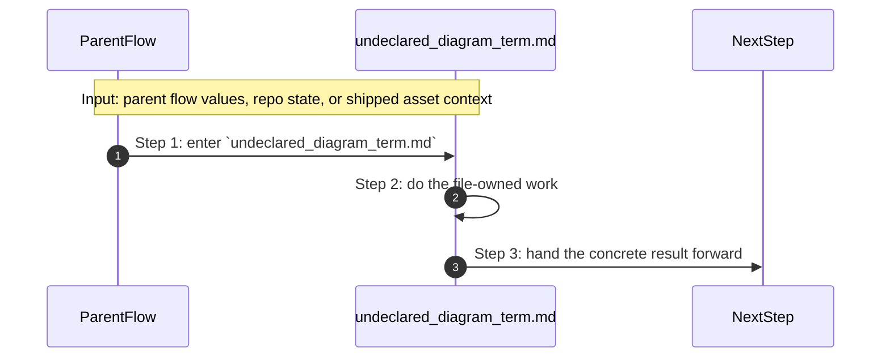
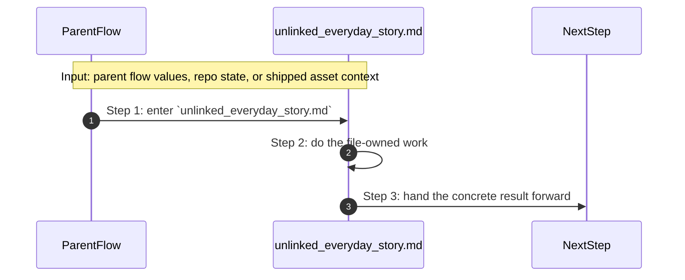
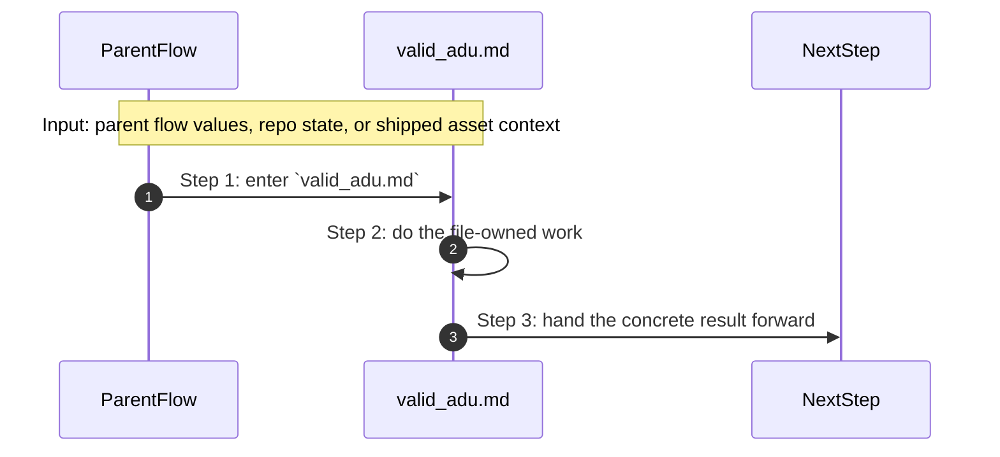

# System Gates Docs Tests How This Works

## What this folder is

`system/gates/docs/tests/` is one gate-specific slice.

This folder exists so one check family or gate fixture has a stable home that the runner and CI can point at.

## Real commands that reach this folder

- `poly gate run docs`
- `poly docs ...`

## Exact CLI front doors

- `system/tools/poly/cmd/poly/main.go`
- function: `main()`
- `poly gate run ...` -> `RunGateProfile(...)` in `system/tools/poly/internal/runner/run_gate_profile.go`
- `bash system/gates/run ...` wraps the same canonical gate profiles from shell entrypoints

## The simplest story

- a real `poly ...`, gate, or script entry reaches this tooling slice
- this folder owns one concrete tooling step, often starting with `broken_anchor.md`
- the next tool step gets a report, summary, artifact, or exit decision from here



## The first important path

When you type:

```bash
poly gate run docs
```

the important path is:



- **Step 1:** This is the moment the story actually enters this folder instead of staying in a higher router or parent helper.
- **Step 2:** The first real work starts in `broken_anchor.md`.
- **Step 3:** From here, the story moves to one smaller file, child slice, or boundary that can do the next concrete job.
- **Step 4:** At the end, the caller has something concrete to carry forward: a file on disk, a rendered asset, a proof artifact, or a clear next state.

## Direct files in this folder

### `broken_anchor.md`

This file ships the `broken_anchor.md` asset that the next technical step reads directly.

Why this name is honest:

- the file name already tells you what concrete artifact or config lives here

When the story opens this file:

- when the `system/gates/docs/tests/` story needs this responsibility, it opens `broken_anchor.md`

What arrives here:

- the next render, runtime, or browser step reads this shipped asset as-is

What leaves this file:

- the shipped `broken_anchor.md` asset
- a concrete file the next render or runtime step can read directly

Why you open it first:

- open this file when the generated or shipped asset itself looks wrong



- **Step 1:** The story reaches `broken_anchor.md` because this file owns the next small responsibility.
- **Step 2:** The file does its own narrow action instead of mixing it into a bigger caller.
- **Step 3:** The next caller gets a concrete result, not another vague promise.

Important functions:

This file does not expose top-level functions. That is fine. The file itself is the artifact the next step reads.

### `fixture-oncall-and-postmortem.md`

This file ships the `fixture-oncall-and-postmortem.md` asset that the next technical step reads directly.

Why this name is honest:

- the file name already tells you what concrete artifact or config lives here

When the story opens this file:

- when the `system/gates/docs/tests/` story needs this responsibility, it opens `fixture-oncall-and-postmortem.md`

What arrives here:

- the next render, runtime, or browser step reads this shipped asset as-is

What leaves this file:

- the shipped `fixture-oncall-and-postmortem.md` asset
- a concrete file the next render or runtime step can read directly

Why you open it first:

- open this file when the generated or shipped asset itself looks wrong



- **Step 1:** The story reaches `fixture-oncall-and-postmortem.md` because this file owns the next small responsibility.
- **Step 2:** The file does its own narrow action instead of mixing it into a bigger caller.
- **Step 3:** The next caller gets a concrete result, not another vague promise.

Important functions:

This file does not expose top-level functions. That is fine. The file itself is the artifact the next step reads.

### `missing_layer.md`

This file ships the `missing_layer.md` asset that the next technical step reads directly.

Why this name is honest:

- the file name already tells you what concrete artifact or config lives here

When the story opens this file:

- when the `system/gates/docs/tests/` story needs this responsibility, it opens `missing_layer.md`

What arrives here:

- the next render, runtime, or browser step reads this shipped asset as-is

What leaves this file:

- the shipped `missing_layer.md` asset
- a concrete file the next render or runtime step can read directly

Why you open it first:

- open this file when the generated or shipped asset itself looks wrong


- **Step 1:** The story reaches `missing_layer.md` because this file owns the next small responsibility.
- **Step 2:** The file does its own narrow action instead of mixing it into a bigger caller.
- **Step 3:** The next caller gets a concrete result, not another vague promise.

Important functions:

This file does not expose top-level functions. That is fine. The file itself is the artifact the next step reads.

### `missing_rollout_matrix.md`

This file ships the `missing_rollout_matrix.md` asset that the next technical step reads directly.

Why this name is honest:

- the file name already tells you what concrete artifact or config lives here

When the story opens this file:

- when the `system/gates/docs/tests/` story needs this responsibility, it opens `missing_rollout_matrix.md`

What arrives here:

- the next render, runtime, or browser step reads this shipped asset as-is

What leaves this file:

- the shipped `missing_rollout_matrix.md` asset
- a concrete file the next render or runtime step can read directly

Why you open it first:

- open this file when the generated or shipped asset itself looks wrong


- **Step 1:** The story reaches `missing_rollout_matrix.md` because this file owns the next small responsibility.
- **Step 2:** The file does its own narrow action instead of mixing it into a bigger caller.
- **Step 3:** The next caller gets a concrete result, not another vague promise.

Important functions:

This file does not expose top-level functions. That is fine. The file itself is the artifact the next step reads.

### `missing_trust_boundary.md`

This file ships the `missing_trust_boundary.md` asset that the next technical step reads directly.

Why this name is honest:

- the file name already tells you what concrete artifact or config lives here

When the story opens this file:

- when the `system/gates/docs/tests/` story needs this responsibility, it opens `missing_trust_boundary.md`

What arrives here:

- the next render, runtime, or browser step reads this shipped asset as-is

What leaves this file:

- the shipped `missing_trust_boundary.md` asset
- a concrete file the next render or runtime step can read directly

Why you open it first:

- open this file when the generated or shipped asset itself looks wrong



- **Step 1:** The story reaches `missing_trust_boundary.md` because this file owns the next small responsibility.
- **Step 2:** The file does its own narrow action instead of mixing it into a bigger caller.
- **Step 3:** The next caller gets a concrete result, not another vague promise.

Important functions:

This file does not expose top-level functions. That is fine. The file itself is the artifact the next step reads.

### `naked_paragraph.md`

This file ships the `naked_paragraph.md` asset that the next technical step reads directly.

Why this name is honest:

- the file name already tells you what concrete artifact or config lives here

When the story opens this file:

- when the `system/gates/docs/tests/` story needs this responsibility, it opens `naked_paragraph.md`

What arrives here:

- the next render, runtime, or browser step reads this shipped asset as-is

What leaves this file:

- the shipped `naked_paragraph.md` asset
- a concrete file the next render or runtime step can read directly

Why you open it first:

- open this file when the generated or shipped asset itself looks wrong



- **Step 1:** The story reaches `naked_paragraph.md` because this file owns the next small responsibility.
- **Step 2:** The file does its own narrow action instead of mixing it into a bigger caller.
- **Step 3:** The next caller gets a concrete result, not another vague promise.

Important functions:

This file does not expose top-level functions. That is fine. The file itself is the artifact the next step reads.

### `undeclared_diagram_term.md`

This file ships the `undeclared_diagram_term.md` asset that the next technical step reads directly.

Why this name is honest:

- the file name already tells you what concrete artifact or config lives here

When the story opens this file:

- when the `system/gates/docs/tests/` story needs this responsibility, it opens `undeclared_diagram_term.md`

What arrives here:

- the next render, runtime, or browser step reads this shipped asset as-is

What leaves this file:

- the shipped `undeclared_diagram_term.md` asset
- a concrete file the next render or runtime step can read directly

Why you open it first:

- open this file when the generated or shipped asset itself looks wrong



- **Step 1:** The story reaches `undeclared_diagram_term.md` because this file owns the next small responsibility.
- **Step 2:** The file does its own narrow action instead of mixing it into a bigger caller.
- **Step 3:** The next caller gets a concrete result, not another vague promise.

Important functions:

This file does not expose top-level functions. That is fine. The file itself is the artifact the next step reads.

### `undeclared_term.md`

This file ships the `undeclared_term.md` asset that the next technical step reads directly.

Why this name is honest:

- the file name already tells you what concrete artifact or config lives here

When the story opens this file:

- when the `system/gates/docs/tests/` story needs this responsibility, it opens `undeclared_term.md`

What arrives here:

- the next render, runtime, or browser step reads this shipped asset as-is

What leaves this file:

- the shipped `undeclared_term.md` asset
- a concrete file the next render or runtime step can read directly

Why you open it first:

- open this file when the generated or shipped asset itself looks wrong


- **Step 1:** The story reaches `undeclared_term.md` because this file owns the next small responsibility.
- **Step 2:** The file does its own narrow action instead of mixing it into a bigger caller.
- **Step 3:** The next caller gets a concrete result, not another vague promise.

Important functions:

This file does not expose top-level functions. That is fine. The file itself is the artifact the next step reads.

### `unlinked_everyday_story.md`

This file ships the `unlinked_everyday_story.md` asset that the next technical step reads directly.

Why this name is honest:

- the file name already tells you what concrete artifact or config lives here

When the story opens this file:

- when the `system/gates/docs/tests/` story needs this responsibility, it opens `unlinked_everyday_story.md`

What arrives here:

- the next render, runtime, or browser step reads this shipped asset as-is

What leaves this file:

- the shipped `unlinked_everyday_story.md` asset
- a concrete file the next render or runtime step can read directly

Why you open it first:

- open this file when the generated or shipped asset itself looks wrong



- **Step 1:** The story reaches `unlinked_everyday_story.md` because this file owns the next small responsibility.
- **Step 2:** The file does its own narrow action instead of mixing it into a bigger caller.
- **Step 3:** The next caller gets a concrete result, not another vague promise.

Important functions:

This file does not expose top-level functions. That is fine. The file itself is the artifact the next step reads.

### `valid_adu.md`

This file ships the `valid_adu.md` asset that the next technical step reads directly.

Why this name is honest:

- the file name already tells you what concrete artifact or config lives here

When the story opens this file:

- when the `system/gates/docs/tests/` story needs this responsibility, it opens `valid_adu.md`

What arrives here:

- the next render, runtime, or browser step reads this shipped asset as-is

What leaves this file:

- the shipped `valid_adu.md` asset
- a concrete file the next render or runtime step can read directly

Why you open it first:

- open this file when the generated or shipped asset itself looks wrong



- **Step 1:** The story reaches `valid_adu.md` because this file owns the next small responsibility.
- **Step 2:** The file does its own narrow action instead of mixing it into a bigger caller.
- **Step 3:** The next caller gets a concrete result, not another vague promise.

Important functions:

This file does not expose top-level functions. That is fine. The file itself is the artifact the next step reads.

## Child folders in this folder

This folder has no child folders in scope.

## Debug first

- start with `broken_anchor.md` when the shipped asset or contract itself looks wrong
- start with `fixture-oncall-and-postmortem.md` when the shipped asset or contract itself looks wrong
- start with `missing_layer.md` when the shipped asset or contract itself looks wrong
- start with `missing_rollout_matrix.md` when the shipped asset or contract itself looks wrong
- start with `missing_trust_boundary.md` when the shipped asset or contract itself looks wrong
- start with `naked_paragraph.md` when the shipped asset or contract itself looks wrong
- start with `undeclared_diagram_term.md` when the shipped asset or contract itself looks wrong
- start with `undeclared_term.md` when the shipped asset or contract itself looks wrong

## What to remember

- `system/gates/docs/tests/` exists so this slice has one obvious home.
- The fastest map is still the naming law: folder for flow, file for responsibility, function for exact action.
- If the visible result is wrong, start with the first direct file that owns the next honest action in the flow.

## Dictionary

<a id="dictionary-command"></a>
- `command`: A command is the exact CLI sentence that starts the flow.
<a id="dictionary-gate"></a>
- `gate`: A gate is one named verification profile or check that decides whether trust can increase.
<a id="dictionary-review-pack"></a>
- `review pack`: A review pack is the merged workspace snapshot PolyMoly writes so a reviewer can inspect one deterministic bundle.
<a id="dictionary-artifact"></a>
- `artifact`: An artifact is a summary, report, bundle, or receipt another tool can read later.
<a id="dictionary-summary"></a>
- `summary`: A summary is the short machine-readable or operator-readable result a tool writes after it finishes.
<a id="dictionary-runtime"></a>
- `runtime`: Runtime here means the source-native CLI or external process world the tool starts or inspects.
