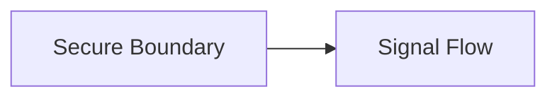

## Fixture Title

Short intro.

---

## Quick Jump

- [Visual Contract Map](#visual-contract-map)
- [Vocabulary Dictionary](#vocabulary-dictionary)
- [Problem and Purpose](#1-problem-and-purpose)
- [End User Flow](#2-end-user-flow)
- [How It Works](#3-how-it-works)
- [Architectural Decision](#4-architectural-decision-adr-format)
- [How It Fails](#5-how-it-fails-sev-123)
- [How To Fix](#6-how-to-fix-runbook-safety-standard)
- [GO / NO-GO Panels](#7-go--no-go-panels)
- [Evidence Pack](#8-evidence-pack)
- [Operational Checklist](#9-operational-checklist)
- [CI/Quality Gate Reference](#10-ciquality-gate-reference)
- [What Did We Learn](#what-did-we-learn)

---

<a id="visual-contract-map"></a>
## Visual Contract Map

### ADU: Secure Boundary
#### Technical Definition
- **[Secure Boundary](#term-secure-boundary)**: Boundary entry point.
- **[Signal Flow](#term-signal-flow)**: Deterministic request movement.
#### Diagram
```text
BOUNDARY DIAGRAM
User -> Secure Boundary
```
#### 📖 Deterministic Story
- The **[Secure Boundary](#term-secure-boundary)** starts the **[Signal Flow](#term-signal-flow)**.
#### 🧠 Conceptual Layer
- Think of one guarded front door.
#### 🧩 Imagine It Like
- One front door ([Secure Boundary](#term-secure-boundary)).
#### 🔎 Lemme Explain
- This protects entry before deeper execution.

---

<a id="vocabulary-dictionary"></a>
## Vocabulary Dictionary

### Technical Definition
- <a id="term-secure-boundary"></a> **[Secure Boundary](#term-secure-boundary)**: Boundary entry point.
- <a id="term-signal-flow"></a> **[Signal Flow](#term-signal-flow)**: Deterministic request movement.
- <a id="term-failure-gate"></a> **[Failure Gate](#term-failure-gate)**: Explicit failure decision node.
- <a id="term-recovery-step"></a> **[Recovery Step](#term-recovery-step)**: Controlled recovery mutation.
- <a id="term-release-decision"></a> **[Release Decision](#term-release-decision)**: Go or no-go status.

---

<a id="1-problem-and-purpose"></a>
## 1. Problem and Purpose

### ADU: Purpose Unit
#### Technical Definition
- **[Secure Boundary](#term-secure-boundary)**: Boundary entry point.
- **[Failure Gate](#term-failure-gate)**: Explicit failure decision node.
#### Diagram
```text
Boundary -> Failure Gate
```
#### 📖 Deterministic Story
- The **[Secure Boundary](#term-secure-boundary)** exists so the **[Failure Gate](#term-failure-gate)** has clear input.
#### 🧠 Conceptual Layer
- One gate is easier to reason about.
#### 🧩 Imagine It Like
- One hall leads to one guard.
#### 🔎 Lemme Explain
- This keeps control deterministic.

---

<a id="2-end-user-flow"></a>
## 2. End User Flow

### ADU: User Flow
#### Technical Definition
- **[Signal Flow](#term-signal-flow)**: Deterministic request movement.
- **[Secure Boundary](#term-secure-boundary)**: Boundary entry point.
#### Diagram
```text
User -> Secure Boundary -> Signal Flow
```
#### 📖 Deterministic Story
- The **[Signal Flow](#term-signal-flow)** begins at the **[Secure Boundary](#term-secure-boundary)**.
#### 🧠 Conceptual Layer
- Users move through one visible path.
#### 🧩 Imagine It Like
- One path, one door.
#### 🔎 Lemme Explain
- This makes entry observable.

---

<a id="3-how-it-works"></a>
## 3. How It Works

### ADU: Dynamic Unit
#### Technical Definition
- **[Signal Flow](#term-signal-flow)**: Deterministic request movement.
- **[Recovery Step](#term-recovery-step)**: Controlled recovery mutation.
#### Diagram
```text
DYNAMIC FLOW DIAGRAM
1. Signal Flow
2. Recovery Step
```
#### 📖 Deterministic Story
- The **[Signal Flow](#term-signal-flow)** remains deterministic before any **[Recovery Step](#term-recovery-step)**.
#### 🧠 Conceptual Layer
- Order matters under pressure.
#### 🧩 Imagine It Like
- First move, then fix.
#### 🔎 Lemme Explain
- Runtime order prevents confusion.

---

<a id="4-architectural-decision-adr-format"></a>
## 4. Architectural Decision (ADR Format)

### ADU: ADR Unit
#### Technical Definition
- **[Secure Boundary](#term-secure-boundary)**: Boundary entry point.
- **[Signal Flow](#term-signal-flow)**: Deterministic request movement.
#### Diagram

#### 📖 Deterministic Story
- The **[Secure Boundary](#term-secure-boundary)** owns the **[Signal Flow](#term-signal-flow)**.
#### 🧠 Conceptual Layer
- One owner reduces drift.
#### 🧩 Imagine It Like
- One captain steers one boat.
#### 🔎 Lemme Explain
- This is why the boundary remains centralized.

---

<a id="5-how-it-fails-sev-123"></a>
## 5. How It Fails (Sev 1/2/3)

### ADU: Failure Unit
#### Technical Definition
- **[Failure Gate](#term-failure-gate)**: Explicit failure decision node.
- **[Signal Flow](#term-signal-flow)**: Deterministic request movement.
#### Diagram
```text
FAILURE DIAGRAM
Signal Flow -> Failure Gate
```
#### 📖 Deterministic Story
- The **[Failure Gate](#term-failure-gate)** stops the **[Signal Flow](#term-signal-flow)** when evidence is bad.
#### 🧠 Conceptual Layer
- One red light blocks the lane.
#### 🧩 Imagine It Like
- Red means stop.
#### 🔎 Lemme Explain
- This isolates faults early.

---

<a id="6-how-to-fix-runbook-safety-standard"></a>
## 6. How To Fix (Runbook Safety Standard)

### ADU: Recovery Unit
#### Technical Definition
- **[Recovery Step](#term-recovery-step)**: Controlled recovery mutation.
- **[Failure Gate](#term-failure-gate)**: Explicit failure decision node.
#### Diagram
```text
Check -> Recovery Step -> Failure Gate
```
#### 📖 Deterministic Story
- The **[Recovery Step](#term-recovery-step)** runs only after the **[Failure Gate](#term-failure-gate)** confirms the condition.
#### 🧠 Conceptual Layer
- Fix after proof.
#### 🧩 Imagine It Like
- Check first, then press reset.
#### 🔎 Lemme Explain
- This prevents blind mutation.

### Exact Runbook Commands

```bash
echo check
echo verify
```

---

<a id="7-go-no-go-panels"></a>
## 7. GO / NO-GO Panels

### ADU: Decision Unit
#### Technical Definition
- **[Release Decision](#term-release-decision)**: Go or no-go status.
- **[Failure Gate](#term-failure-gate)**: Explicit failure decision node.
#### Diagram
```text
STATUS PANEL
Failure Gate -> Release Decision
```
#### 📖 Deterministic Story
- The **[Release Decision](#term-release-decision)** depends on the **[Failure Gate](#term-failure-gate)**.
#### 🧠 Conceptual Layer
- One panel says go or stop.
#### 🧩 Imagine It Like
- Green go, red stop.
#### 🔎 Lemme Explain
- This stops unsafe continuation.

---

<a id="8-evidence-pack"></a>
## 8. Evidence Pack

- Logs
- Metrics
- Time anchor

---

<a id="9-operational-checklist"></a>
## 9. Operational Checklist

- [ ] Checked

---

<a id="10-ciquality-gate-reference"></a>
## 10. CI / Quality Gate Reference

- `task docs:governance`

---

## What Did We Learn

- Deterministic docs are machine-verifiable.
