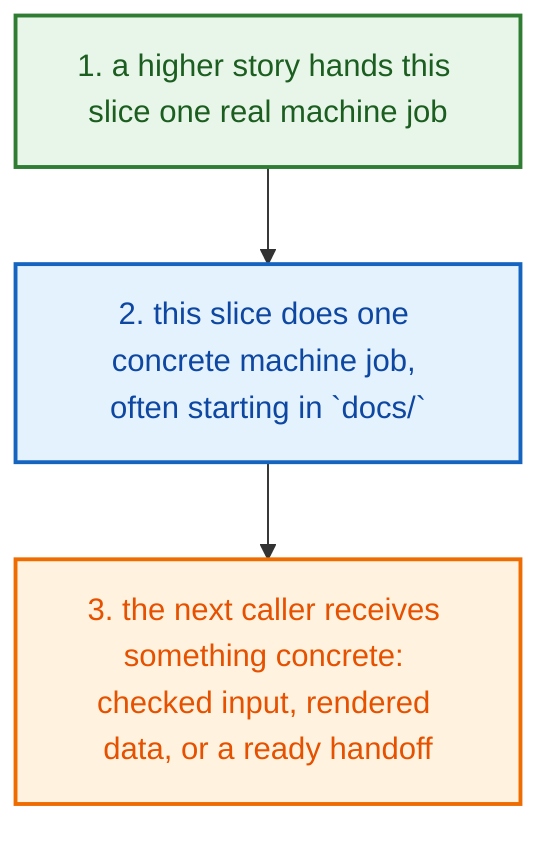
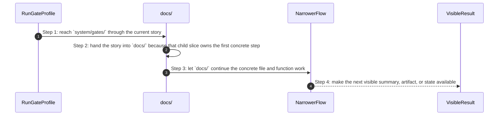
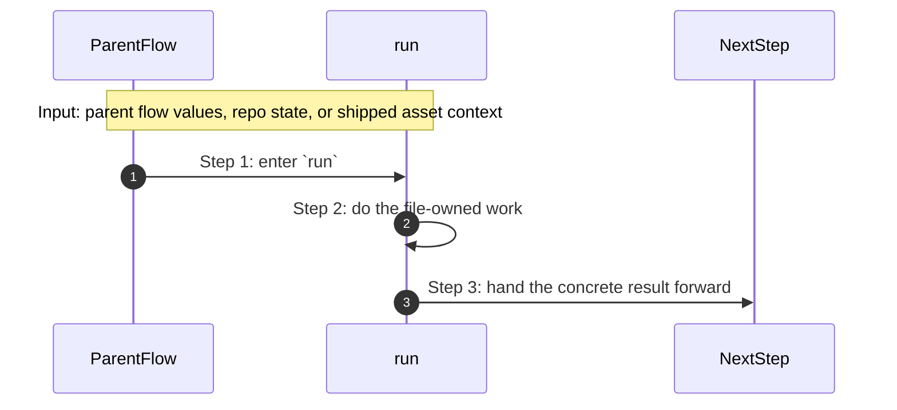

# System Gates How This Works

## What this folder is

`system/gates/` is the home of canonical verification profiles and gate fixtures.

It is the part of the repo that turns “trust this change” into named checks like docs, p0, full, and nightly.

## Real commands that reach this folder

- `poly gate run docs`
- `poly gate run p0`
- `bash system/gates/run p0`
- `bash system/gates/run nightly`

## Exact CLI front doors

- `system/tools/poly/cmd/poly/main.go`
- function: `main()`
- `poly gate run ...` -> `RunGateProfile(...)` in `system/tools/poly/internal/runner/run_gate_profile.go`
- `bash system/gates/run ...` wraps the same canonical gate profiles from shell entrypoints

## The simplest story

- a higher product, engine, or tooling story reaches this slice because it needs one reusable step
- this folder does one small machine-facing job, often starting in `docs/`
- the next step gets something concrete back: a helper result, a rendered model, an adapter handoff, or a cleaner request



## The first important path

When you type:

```bash
poly gate run docs
```

the important path is:



- **Step 1:** This is the moment the story actually enters this folder instead of staying in a higher router or parent helper.
- **Step 2:** The first real work starts in `docs/`.
- **Step 3:** From here, the story moves to one smaller file, child slice, or boundary that can do the next concrete job.
- **Step 4:** At the end, the caller has something concrete to carry forward: a file on disk, a rendered asset, a proof artifact, or a clear next state.

## Direct files in this folder

### `run`

This file ships the `run` asset that the next technical step reads directly.

Why this name is honest:

- the file name already tells you what concrete artifact or config lives here

When the story opens this file:

- when the `system/gates/` story needs this responsibility, it opens `run`

What arrives here:

- the next render, runtime, or browser step reads this shipped asset as-is

What leaves this file:

- the shipped `run` asset
- a concrete file the next render or runtime step can read directly

Why you open it first:

- open this file when the generated or shipped asset itself looks wrong



- **Step 1:** The story reaches `run` because this file owns the next small responsibility.
- **Step 2:** The file does its own narrow action instead of mixing it into a bigger caller.
- **Step 3:** The next caller gets a concrete result, not another vague promise.

Important functions:

This file does not expose top-level functions. That is fine. The file itself is the artifact the next step reads.

## Child folders in this folder

### `docs/`

Open [`docs/how-this-works.md`](./docs/how-this-works.md).

Use it when the story includes:

- `poly gate run docs`
- `poly docs ...`

### `engine/`

Open [`engine/how-this-works.md`](./engine/how-this-works.md).

Use it when the story includes:

- `poly gate run docs`
- `poly gate run p0`
- `bash system/gates/run p0`
- `bash system/gates/run nightly`

## Debug first

- start with `run` when the shipped asset or contract itself looks wrong

## What to remember

- `system/gates/` exists so this slice has one obvious home.
- The fastest map is still the naming law: folder for flow, file for responsibility, function for exact action.
- If the folder overview feels too wide, jump to the child slice that matches the current symptom instead of reading sideways.

## Dictionary

<a id="dictionary-system"></a>
- `system`: The system is the machine-facing body of PolyMoly. It holds the code, assets, checks, and boundaries that make product stories real.
<a id="dictionary-engine"></a>
- `engine`: The engine is the decision core. It reads intent, matches capabilities, prepares render data, and hands safe work to the next layer.
<a id="dictionary-adapter"></a>
- `adapter`: An adapter is the place where PolyMoly touches the outside world, like files, Docker, environment files, or the browser.
<a id="dictionary-gate"></a>
- `gate`: A gate is a verification run that decides PASS or FAIL before trust increases.
<a id="dictionary-artifact"></a>
- `artifact`: An artifact is a file, bundle, or proof another tool or operator can read later.
<a id="dictionary-runtime"></a>
- `runtime`: Runtime is the live or rendered execution world PolyMoly starts, previews, inspects, or validates.
