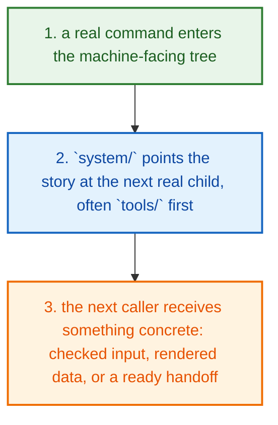
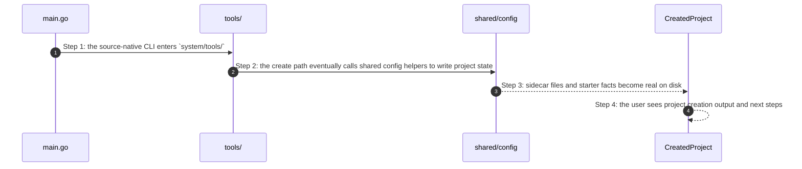

# System How This Works

## What this folder is

`system/` is the machine-facing body of PolyMoly.

When the product surface decides what story the user is in, this tree is where the code, shipped assets, checks, and boundaries make that story real.

If `product/` tells you "which story is this?", `system/` tells you "which machine parts now make that story true?"

## Real commands or triggers that reach this folder

- `poly new my-app --framework laravel`
- `poly up`
- `poly gate run docs`
- `poly review pack .`

## Exact upstream handoffs

- `system/tools/poly/cmd/poly/main.go` enters through `system/tools/`
- from there, the story can hop into `engine/`, `shared/`, `runtime/`, `adapters/`, or `gates/`
- the quickest first question is: "am I still routing a command, or am I already reading/writing machine state?"

## The simplest story

- a real command enters `system/` through tooling first
- tooling routes the story into the next machine slice: engine, shared config, runtime assets, adapters, or gates
- by the end, something real has happened: files were written, commands were prepared, checks ran, or proof artifacts appeared



## The first important path

When a real caller reaches this slice for this exact reason:

```bash
poly new my-app --framework laravel
```

the important path is:



- **Step 1:** The first machine stop is usually `tools/`, not adapters.
- **Step 2:** From there, the story fans out into narrower machine slices.
- **Step 3:** The exact next child depends on whether the command is routing, deciding, reading config, touching runtime, or proving something.
- **Step 4:** The system story is finished only when something concrete exists: output, state, or evidence.

## Direct files in this folder

This folder has no direct first-party files besides this guide.

## Child folders in this folder

### `adapters/`

Open [`adapters/how-this-works.md`](./adapters/how-this-works.md).

Use it when the story includes:

- engine apply and generate flows when PolyMoly must touch files, Docker, env files, or the browser

### `engine/`

Open [`engine/how-this-works.md`](./engine/how-this-works.md).

Use it when the story includes:

- product and gate flows after CLI routing hands work into the engine

### `gates/`

Open [`gates/how-this-works.md`](./gates/how-this-works.md).

Use it when the story includes:

- `poly gate run docs`
- `poly gate run p0`
- `bash system/gates/run p0`
- `bash system/gates/run nightly`

### `runtime/`

Open [`runtime/how-this-works.md`](./runtime/how-this-works.md).

Use it when the story includes:

- engine resolve, render, runtime start, and gate flows after CLI routing chooses a project story

### `scripts/`

Open [`scripts/how-this-works.md`](./scripts/how-this-works.md).

Use it when the story includes:

- developer, governance, and release shell flows outside the main Go CLI path

### `shared/`

Open [`shared/how-this-works.md`](./shared/how-this-works.md).

Use it when the story includes:

- engine, tools, and adapters call this shared slice instead of copying the same helpers

### `tools/`

Open [`tools/how-this-works.md`](./tools/how-this-works.md).

Use it when the story includes:

- `poly new my-app --framework laravel`
- `poly up`
- `poly gate run docs`
- `poly review pack .`

## Debug first

- open `adapters/how-this-works.md` when the symptom clearly belongs to that child story
- open `engine/how-this-works.md` when the symptom clearly belongs to that child story
- open `gates/how-this-works.md` when the symptom clearly belongs to that child story
- open `runtime/how-this-works.md` when the symptom clearly belongs to that child story
- open `scripts/how-this-works.md` when the symptom clearly belongs to that child story
- open `shared/how-this-works.md` when the symptom clearly belongs to that child story
- open `tools/how-this-works.md` when the symptom clearly belongs to that child story

## What to remember

- `system/` exists so this slice has one obvious home.
- The fastest map is still the naming law: folder for flow, file for responsibility, function for exact action.
- If the folder overview feels too wide, jump to the child slice that matches the current symptom instead of reading sideways.

## Dictionary

<a id="dictionary-system"></a>
- `system`: The system is the machine-facing body of PolyMoly. It holds the code, assets, checks, and boundaries that make product stories real.
<a id="dictionary-engine"></a>
- `engine`: The engine is the decision core. It reads intent, matches capabilities, prepares render data, and hands safe work to the next layer.
<a id="dictionary-adapter"></a>
- `adapter`: An adapter is the place where PolyMoly touches the outside world, like files, Docker, environment files, or the browser.
<a id="dictionary-gate"></a>
- `gate`: A gate is a verification run that decides PASS or FAIL before trust increases.
<a id="dictionary-artifact"></a>
- `artifact`: An artifact is a file, bundle, or proof another tool or operator can read later.
<a id="dictionary-runtime"></a>
- `runtime`: Runtime is the live or rendered execution world PolyMoly starts, previews, inspects, or validates.
