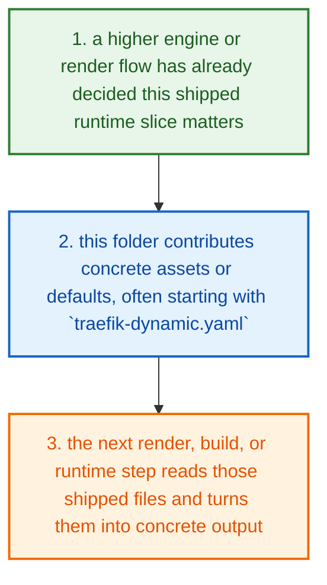
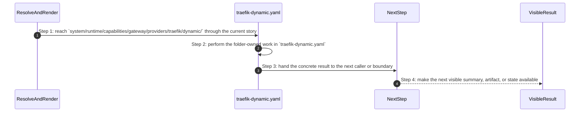
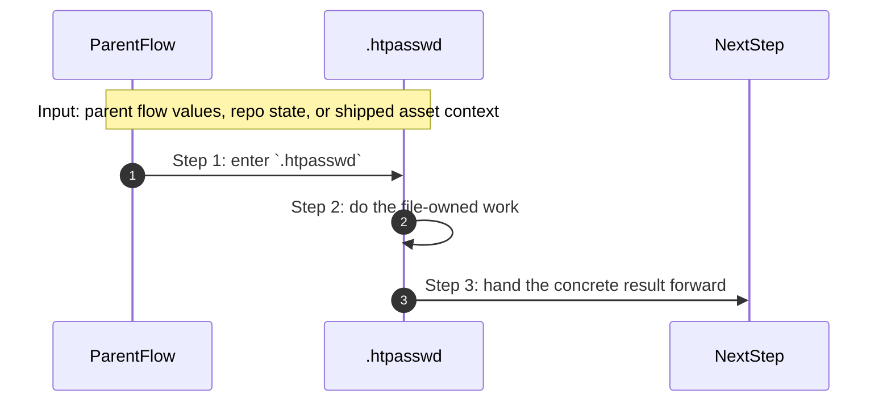
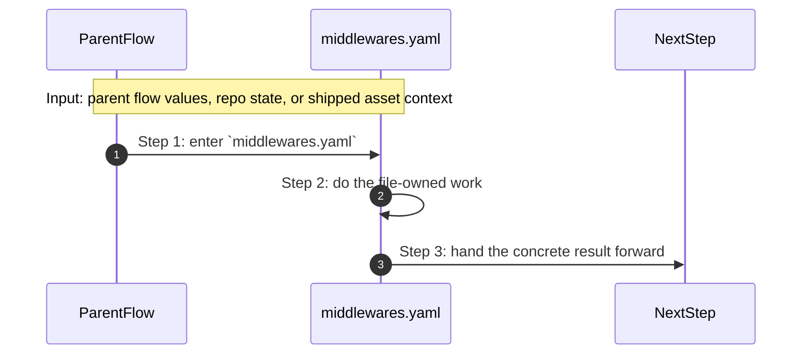
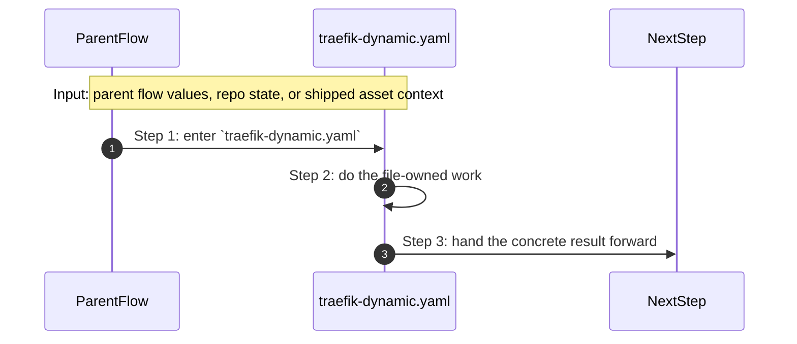
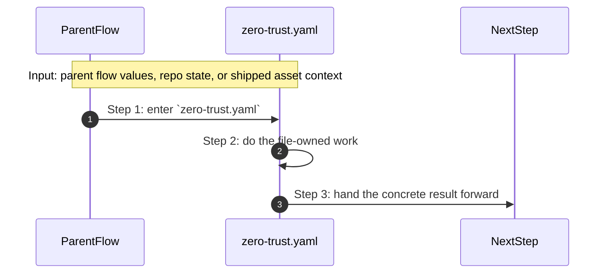
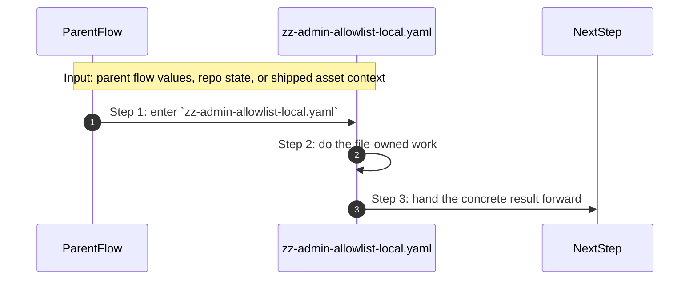
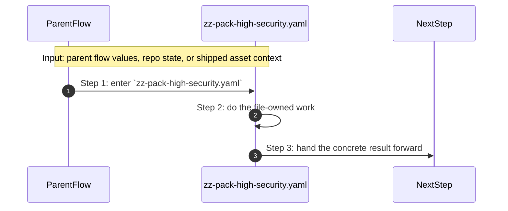
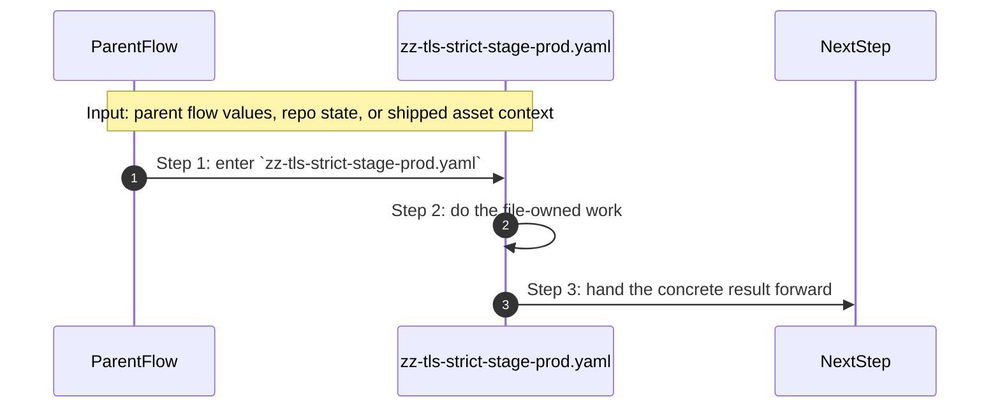

# System Runtime Capabilities Gateway Providers Traefik Dynamic How This Works

## What this folder is

`system/runtime/capabilities/gateway/providers/traefik/dynamic/` is one shipped runtime capability slice.

This folder mostly ships assets, config, or module defaults that later engine and render flows read after capability selection succeeds.

## Real commands or triggers that reach this folder

- `poly up`
- `poly status`
- `poly gate run p0`
- engine resolve and generate flows after a capability is selected

## Exact upstream handoffs

- `system/engine/resolve/capability/match_capabilities_to_modules.go` and `system/engine/generate/make_final_render_model.go` are the main callers above this shipped capability tree
- once the engine selects a capability or module, this folder provides the config, templates, images, and defaults the render path reads next

## The simplest story

- a higher engine or render flow has already decided this shipped runtime slice matters
- this folder contributes concrete assets or defaults, often starting with `traefik-dynamic.yaml`
- the next render, build, or runtime step reads those shipped files and turns them into concrete output



## The first important path

When a real caller reaches this slice for this exact reason:

```bash
poly up
```

the important path is:



- **Step 1:** This is the moment the story actually enters this folder instead of staying in a higher router or parent helper.
- **Step 2:** The first real work starts in `traefik-dynamic.yaml`.
- **Step 3:** From here, the story moves to one smaller file, child slice, or boundary that can do the next concrete job.
- **Step 4:** At the end, the caller has something concrete to carry forward: a file on disk, a rendered asset, a proof artifact, or a clear next state.

## Direct files in this folder

### `.htpasswd`

This file ships the `.htpasswd` asset that the next technical step reads directly.

Why this name is honest:

- the file name already tells you what concrete artifact or config lives here

When the story opens this file:

- when the `system/runtime/capabilities/gateway/providers/traefik/dynamic/` story needs this responsibility, it opens `.htpasswd`

What arrives here:

- the next render, runtime, or browser step reads this shipped asset as-is

What leaves this file:

- the shipped `.htpasswd` asset
- a concrete file the next render or runtime step can read directly

Why you open it first:

- open this file when the generated or shipped asset itself looks wrong



- **Step 1:** The story reaches `.htpasswd` because this file owns the next small responsibility.
- **Step 2:** The file does its own narrow action instead of mixing it into a bigger caller.
- **Step 3:** The next caller gets a concrete result, not another vague promise.

Important functions:

This file does not expose top-level functions. That is fine. The file itself is the artifact the next step reads.

### `middlewares.yaml`

This file ships the `middlewares.yaml` config, policy, or data asset that the next technical step reads directly.

Why this name is honest:

- the file name already tells you what concrete artifact or config lives here

When the story opens this file:

- when the `system/runtime/capabilities/gateway/providers/traefik/dynamic/` story needs this responsibility, it opens `middlewares.yaml`

What arrives here:

- the next render, runtime, or browser step reads this shipped asset as-is

What leaves this file:

- the shipped `middlewares.yaml` asset
- a concrete file the next render or runtime step can read directly

Why you open it first:

- open this file when the generated or shipped asset itself looks wrong



- **Step 1:** The story reaches `middlewares.yaml` because this file owns the next small responsibility.
- **Step 2:** The file does its own narrow action instead of mixing it into a bigger caller.
- **Step 3:** The next caller gets a concrete result, not another vague promise.

Important functions:

This file does not expose top-level functions. That is fine. The file itself is the artifact the next step reads.

### `traefik-dynamic.yaml`

This file ships the `traefik-dynamic.yaml` config, policy, or data asset that the next technical step reads directly.

Why this name is honest:

- the file name already tells you what concrete artifact or config lives here

When the story opens this file:

- when the `system/runtime/capabilities/gateway/providers/traefik/dynamic/` story needs this responsibility, it opens `traefik-dynamic.yaml`

What arrives here:

- the next render, runtime, or browser step reads this shipped asset as-is

What leaves this file:

- the shipped `traefik-dynamic.yaml` asset
- a concrete file the next render or runtime step can read directly

Why you open it first:

- open this file when the generated or shipped asset itself looks wrong



- **Step 1:** The story reaches `traefik-dynamic.yaml` because this file owns the next small responsibility.
- **Step 2:** The file does its own narrow action instead of mixing it into a bigger caller.
- **Step 3:** The next caller gets a concrete result, not another vague promise.

Important functions:

This file does not expose top-level functions. That is fine. The file itself is the artifact the next step reads.

### `zero-trust.yaml`

This file ships the `zero-trust.yaml` config, policy, or data asset that the next technical step reads directly.

Why this name is honest:

- the file name already tells you what concrete artifact or config lives here

When the story opens this file:

- when the `system/runtime/capabilities/gateway/providers/traefik/dynamic/` story needs this responsibility, it opens `zero-trust.yaml`

What arrives here:

- the next render, runtime, or browser step reads this shipped asset as-is

What leaves this file:

- the shipped `zero-trust.yaml` asset
- a concrete file the next render or runtime step can read directly

Why you open it first:

- open this file when the generated or shipped asset itself looks wrong



- **Step 1:** The story reaches `zero-trust.yaml` because this file owns the next small responsibility.
- **Step 2:** The file does its own narrow action instead of mixing it into a bigger caller.
- **Step 3:** The next caller gets a concrete result, not another vague promise.

Important functions:

This file does not expose top-level functions. That is fine. The file itself is the artifact the next step reads.

### `zz-admin-allowlist-local.yaml`

This file ships the `zz-admin-allowlist-local.yaml` config, policy, or data asset that the next technical step reads directly.

Why this name is honest:

- the file name already tells you what concrete artifact or config lives here

When the story opens this file:

- when the `system/runtime/capabilities/gateway/providers/traefik/dynamic/` story needs this responsibility, it opens `zz-admin-allowlist-local.yaml`

What arrives here:

- the next render, runtime, or browser step reads this shipped asset as-is

What leaves this file:

- the shipped `zz-admin-allowlist-local.yaml` asset
- a concrete file the next render or runtime step can read directly

Why you open it first:

- open this file when the generated or shipped asset itself looks wrong



- **Step 1:** The story reaches `zz-admin-allowlist-local.yaml` because this file owns the next small responsibility.
- **Step 2:** The file does its own narrow action instead of mixing it into a bigger caller.
- **Step 3:** The next caller gets a concrete result, not another vague promise.

Important functions:

This file does not expose top-level functions. That is fine. The file itself is the artifact the next step reads.

### `zz-pack-high-security.yaml`

This file ships the `zz-pack-high-security.yaml` config, policy, or data asset that the next technical step reads directly.

Why this name is honest:

- the file name already tells you what concrete artifact or config lives here

When the story opens this file:

- when the `system/runtime/capabilities/gateway/providers/traefik/dynamic/` story needs this responsibility, it opens `zz-pack-high-security.yaml`

What arrives here:

- the next render, runtime, or browser step reads this shipped asset as-is

What leaves this file:

- the shipped `zz-pack-high-security.yaml` asset
- a concrete file the next render or runtime step can read directly

Why you open it first:

- open this file when the generated or shipped asset itself looks wrong



- **Step 1:** The story reaches `zz-pack-high-security.yaml` because this file owns the next small responsibility.
- **Step 2:** The file does its own narrow action instead of mixing it into a bigger caller.
- **Step 3:** The next caller gets a concrete result, not another vague promise.

Important functions:

This file does not expose top-level functions. That is fine. The file itself is the artifact the next step reads.

### `zz-tls-strict-stage-prod.yaml`

This file ships the `zz-tls-strict-stage-prod.yaml` config, policy, or data asset that the next technical step reads directly.

Why this name is honest:

- the file name already tells you what concrete artifact or config lives here

When the story opens this file:

- when the `system/runtime/capabilities/gateway/providers/traefik/dynamic/` story needs this responsibility, it opens `zz-tls-strict-stage-prod.yaml`

What arrives here:

- the next render, runtime, or browser step reads this shipped asset as-is

What leaves this file:

- the shipped `zz-tls-strict-stage-prod.yaml` asset
- a concrete file the next render or runtime step can read directly

Why you open it first:

- open this file when the generated or shipped asset itself looks wrong



- **Step 1:** The story reaches `zz-tls-strict-stage-prod.yaml` because this file owns the next small responsibility.
- **Step 2:** The file does its own narrow action instead of mixing it into a bigger caller.
- **Step 3:** The next caller gets a concrete result, not another vague promise.

Important functions:

This file does not expose top-level functions. That is fine. The file itself is the artifact the next step reads.

## Child folders in this folder

This folder has no child folders in scope.

## Debug first

- start with `.htpasswd` when the shipped asset or contract itself looks wrong
- start with `middlewares.yaml` when the shipped asset or contract itself looks wrong
- start with `traefik-dynamic.yaml` when the shipped asset or contract itself looks wrong
- start with `zero-trust.yaml` when the shipped asset or contract itself looks wrong
- start with `zz-admin-allowlist-local.yaml` when the shipped asset or contract itself looks wrong
- start with `zz-pack-high-security.yaml` when the shipped asset or contract itself looks wrong
- start with `zz-tls-strict-stage-prod.yaml` when the shipped asset or contract itself looks wrong

## What to remember

- `system/runtime/capabilities/gateway/providers/traefik/dynamic/` exists so this slice has one obvious home.
- The fastest map is still the naming law: folder for flow, file for responsibility, function for exact action.
- If the visible result is wrong, start with the first direct file that owns the next honest action in the flow.

## Dictionary

<a id="dictionary-capability"></a>
- `capability`: A capability is one shipped building block PolyMoly can add to a project, like app, database, cache, or gateway.
<a id="dictionary-module"></a>
- `module`: A module is one packaged implementation of a capability. It usually carries images, config, templates, and defaults together.
<a id="dictionary-rendered-file"></a>
- `rendered file`: A rendered file is the concrete output the engine writes after it reads templates, config, and selected modules.
<a id="dictionary-runtime"></a>
- `runtime`: Runtime is the live or rendered world these shipped assets eventually shape.
<a id="dictionary-artifact"></a>
- `artifact`: An artifact is a generated or shipped file another step reads later, such as a Dockerfile, config file, or manifest.
