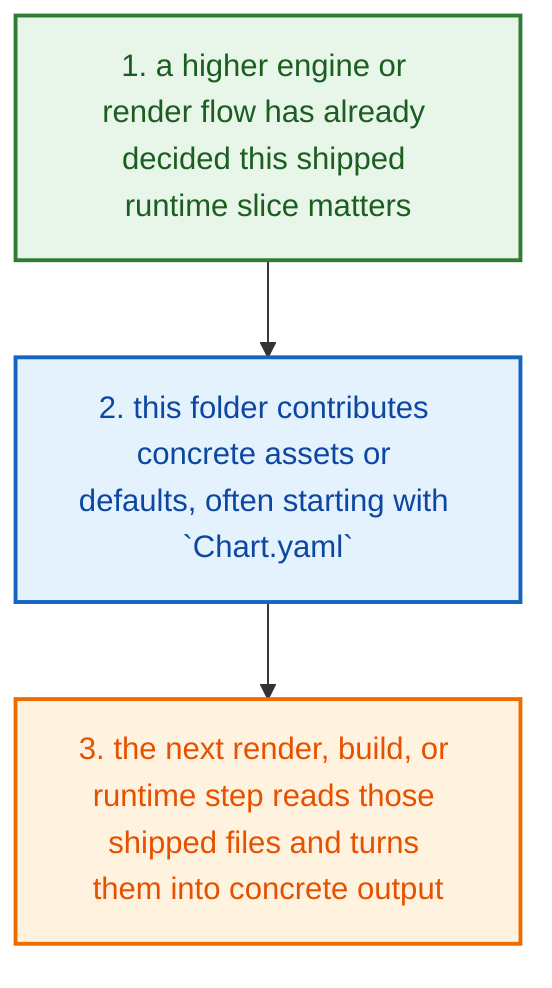
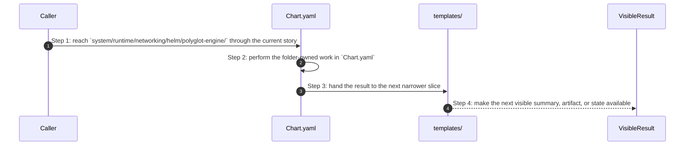
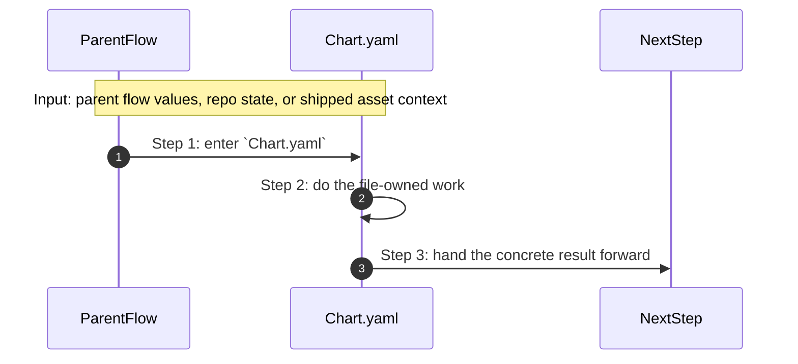
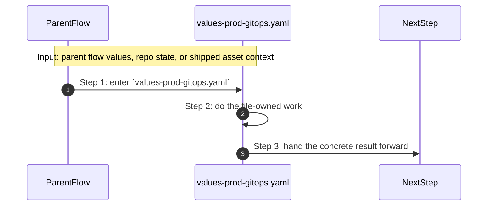
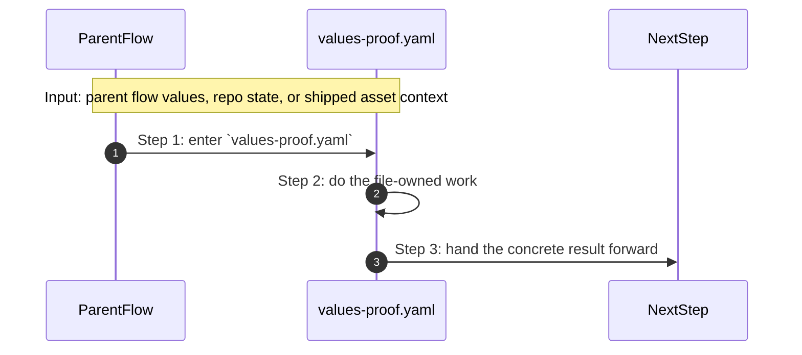

# System Runtime Networking Helm Polyglot Engine How This Works

## What this folder is

`system/runtime/networking/helm/polyglot-engine/` ships networking-side runtime assets.

These files matter after the engine has already chosen the networking shape and the render or deploy path needs real YAML, templates, or fallback assets.

## Real commands or triggers that reach this folder

- render and deploy flows after the engine selects networking assets

## Exact upstream handoffs

- `system/engine/generate/render/` and deploy-facing flows read from this tree after networking shape has already been decided
- this folder mostly ships the concrete networking assets the next render or deploy step consumes

## The simplest story

- a higher engine or render flow has already decided this shipped runtime slice matters
- this folder contributes concrete assets or defaults, often starting with `Chart.yaml`
- the next render, build, or runtime step reads those shipped files and turns them into concrete output



## The first important path

When a real caller reaches this slice for this exact reason:

```text
render and deploy flows after the engine selects networking assets
```

the important path is:



- **Step 1:** This is the moment the story actually enters this folder instead of staying in a higher router or parent helper.
- **Step 2:** The first real work starts in `Chart.yaml`.
- **Step 3:** From here, the story moves to one smaller file, child slice, or boundary that can do the next concrete job.
- **Step 4:** At the end, the caller has something concrete to carry forward: a file on disk, a rendered asset, a proof artifact, or a clear next state.

## Direct files in this folder

### `Chart.yaml`

This file ships the `Chart.yaml` config, policy, or data asset that the next technical step reads directly.

Why this name is honest:

- the file name already tells you what concrete artifact or config lives here

When the story opens this file:

- when the `system/runtime/networking/helm/polyglot-engine/` story needs this responsibility, it opens `Chart.yaml`

What arrives here:

- the next render, runtime, or browser step reads this shipped asset as-is

What leaves this file:

- the shipped `Chart.yaml` asset
- a concrete file the next render or runtime step can read directly

Why you open it first:

- open this file when the generated or shipped asset itself looks wrong



- **Step 1:** The story reaches `Chart.yaml` because this file owns the next small responsibility.
- **Step 2:** The file does its own narrow action instead of mixing it into a bigger caller.
- **Step 3:** The next caller gets a concrete result, not another vague promise.

Important functions:

This file does not expose top-level functions. That is fine. The file itself is the artifact the next step reads.

### `values-prod-gitops.yaml`

This file ships the `values-prod-gitops.yaml` config, policy, or data asset that the next technical step reads directly.

Why this name is honest:

- the file name already tells you what concrete artifact or config lives here

When the story opens this file:

- when the `system/runtime/networking/helm/polyglot-engine/` story needs this responsibility, it opens `values-prod-gitops.yaml`

What arrives here:

- the next render, runtime, or browser step reads this shipped asset as-is

What leaves this file:

- the shipped `values-prod-gitops.yaml` asset
- a concrete file the next render or runtime step can read directly

Why you open it first:

- open this file when the generated or shipped asset itself looks wrong



- **Step 1:** The story reaches `values-prod-gitops.yaml` because this file owns the next small responsibility.
- **Step 2:** The file does its own narrow action instead of mixing it into a bigger caller.
- **Step 3:** The next caller gets a concrete result, not another vague promise.

Important functions:

This file does not expose top-level functions. That is fine. The file itself is the artifact the next step reads.

### `values-proof.yaml`

This file ships the `values-proof.yaml` config, policy, or data asset that the next technical step reads directly.

Why this name is honest:

- the file name already tells you what concrete artifact or config lives here

When the story opens this file:

- when the `system/runtime/networking/helm/polyglot-engine/` story needs this responsibility, it opens `values-proof.yaml`

What arrives here:

- the next render, runtime, or browser step reads this shipped asset as-is

What leaves this file:

- the shipped `values-proof.yaml` asset
- a concrete file the next render or runtime step can read directly

Why you open it first:

- open this file when the generated or shipped asset itself looks wrong



- **Step 1:** The story reaches `values-proof.yaml` because this file owns the next small responsibility.
- **Step 2:** The file does its own narrow action instead of mixing it into a bigger caller.
- **Step 3:** The next caller gets a concrete result, not another vague promise.

Important functions:

This file does not expose top-level functions. That is fine. The file itself is the artifact the next step reads.

### `values-stage-gitops.yaml`

This file ships the `values-stage-gitops.yaml` config, policy, or data asset that the next technical step reads directly.

Why this name is honest:

- the file name already tells you what concrete artifact or config lives here

When the story opens this file:

- when the `system/runtime/networking/helm/polyglot-engine/` story needs this responsibility, it opens `values-stage-gitops.yaml`

What arrives here:

- the next render, runtime, or browser step reads this shipped asset as-is

What leaves this file:

- the shipped `values-stage-gitops.yaml` asset
- a concrete file the next render or runtime step can read directly

Why you open it first:

- open this file when the generated or shipped asset itself looks wrong


- **Step 1:** The story reaches `values-stage-gitops.yaml` because this file owns the next small responsibility.
- **Step 2:** The file does its own narrow action instead of mixing it into a bigger caller.
- **Step 3:** The next caller gets a concrete result, not another vague promise.

Important functions:

This file does not expose top-level functions. That is fine. The file itself is the artifact the next step reads.

### `values.yaml`

This file ships the `values.yaml` config, policy, or data asset that the next technical step reads directly.

Why this name is honest:

- the file name already tells you what concrete artifact or config lives here

When the story opens this file:

- when the `system/runtime/networking/helm/polyglot-engine/` story needs this responsibility, it opens `values.yaml`

What arrives here:

- the next render, runtime, or browser step reads this shipped asset as-is

What leaves this file:

- the shipped `values.yaml` asset
- a concrete file the next render or runtime step can read directly

Why you open it first:

- open this file when the generated or shipped asset itself looks wrong


- **Step 1:** The story reaches `values.yaml` because this file owns the next small responsibility.
- **Step 2:** The file does its own narrow action instead of mixing it into a bigger caller.
- **Step 3:** The next caller gets a concrete result, not another vague promise.

Important functions:

This file does not expose top-level functions. That is fine. The file itself is the artifact the next step reads.

## Child folders in this folder

### `templates/`

Open [`templates/how-this-works.md`](./templates/how-this-works.md).

Use it when the story includes:

- render and deploy flows after the engine selects networking assets

## Debug first

- start with `Chart.yaml` when the shipped asset or contract itself looks wrong
- start with `values-prod-gitops.yaml` when the shipped asset or contract itself looks wrong
- start with `values-proof.yaml` when the shipped asset or contract itself looks wrong
- start with `values-stage-gitops.yaml` when the shipped asset or contract itself looks wrong
- start with `values.yaml` when the shipped asset or contract itself looks wrong

## What to remember

- `system/runtime/networking/helm/polyglot-engine/` exists so this slice has one obvious home.
- The fastest map is still the naming law: folder for flow, file for responsibility, function for exact action.
- If the folder overview feels too wide, jump to the child slice that matches the current symptom instead of reading sideways.

## Dictionary

<a id="dictionary-capability"></a>
- `capability`: A capability is one shipped building block PolyMoly can add to a project, like app, database, cache, or gateway.
<a id="dictionary-module"></a>
- `module`: A module is one packaged implementation of a capability. It usually carries images, config, templates, and defaults together.
<a id="dictionary-rendered-file"></a>
- `rendered file`: A rendered file is the concrete output the engine writes after it reads templates, config, and selected modules.
<a id="dictionary-runtime"></a>
- `runtime`: Runtime is the live or rendered world these shipped assets eventually shape.
<a id="dictionary-artifact"></a>
- `artifact`: An artifact is a generated or shipped file another step reads later, such as a Dockerfile, config file, or manifest.
