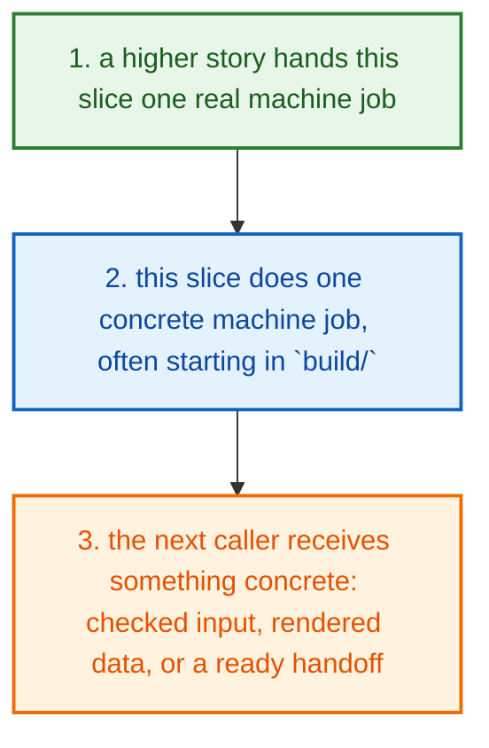
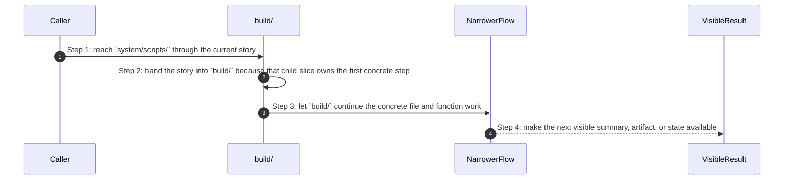

# System Scripts How This Works

## What this folder is

`system/scripts/` holds shell or script-side operational helpers.

These scripts are outside the main Go engine path, but they still matter because release, governance, and developer workflows call them directly.

## Real commands or triggers that reach this folder

- developer, governance, and release shell flows outside the main Go CLI path

## Exact upstream handoffs

- the CLI, runner, gates, and shipped runtime assets all eventually hand work into this tree
- open the narrower child slice once you know whether the story is product, engine, adapter, shared, runtime, gate, or tooling work

## The simplest story

- a higher product, engine, or tooling story reaches this slice because it needs one reusable step
- this folder does one small machine-facing job, often starting in `build/`
- the next step gets something concrete back: a helper result, a rendered model, an adapter handoff, or a cleaner request



## The first important path

When a real caller reaches this slice for this exact reason:

```text
developer, governance, and release shell flows outside the main Go CLI path
```

the important path is:



- **Step 1:** This is the moment the story actually enters this folder instead of staying in a higher router or parent helper.
- **Step 2:** The first real work starts in `build/`.
- **Step 3:** From here, the story moves to one smaller file, child slice, or boundary that can do the next concrete job.
- **Step 4:** At the end, the caller has something concrete to carry forward: a file on disk, a rendered asset, a proof artifact, or a clear next state.

## Direct files in this folder

This folder has no direct first-party files besides this guide.

## Child folders in this folder

### `build/`

Open [`build/how-this-works.md`](./build/how-this-works.md).

Use it when the story includes:

- developer, governance, and release shell flows outside the main Go CLI path

### `dev/`

Open [`dev/how-this-works.md`](./dev/how-this-works.md).

Use it when the story includes:

- developer, governance, and release shell flows outside the main Go CLI path

### `governance/`

Open [`governance/how-this-works.md`](./governance/how-this-works.md).

Use it when the story includes:

- developer, governance, and release shell flows outside the main Go CLI path

### `release/`

Open [`release/how-this-works.md`](./release/how-this-works.md).

Use it when the story includes:

- developer, governance, and release shell flows outside the main Go CLI path

## Debug first

- open `build/how-this-works.md` when the symptom clearly belongs to that child story
- open `dev/how-this-works.md` when the symptom clearly belongs to that child story
- open `governance/how-this-works.md` when the symptom clearly belongs to that child story
- open `release/how-this-works.md` when the symptom clearly belongs to that child story

## What to remember

- `system/scripts/` exists so this slice has one obvious home.
- The fastest map is still the naming law: folder for flow, file for responsibility, function for exact action.
- If the folder overview feels too wide, jump to the child slice that matches the current symptom instead of reading sideways.

## Dictionary

<a id="dictionary-system"></a>
- `system`: The system is the machine-facing body of PolyMoly. It holds the code, assets, checks, and boundaries that make product stories real.
<a id="dictionary-engine"></a>
- `engine`: The engine is the decision core. It reads intent, matches capabilities, prepares render data, and hands safe work to the next layer.
<a id="dictionary-adapter"></a>
- `adapter`: An adapter is the place where PolyMoly touches the outside world, like files, Docker, environment files, or the browser.
<a id="dictionary-gate"></a>
- `gate`: A gate is a verification run that decides PASS or FAIL before trust increases.
<a id="dictionary-artifact"></a>
- `artifact`: An artifact is a file, bundle, or proof another tool or operator can read later.
<a id="dictionary-runtime"></a>
- `runtime`: Runtime is the live or rendered execution world PolyMoly starts, previews, inspects, or validates.
