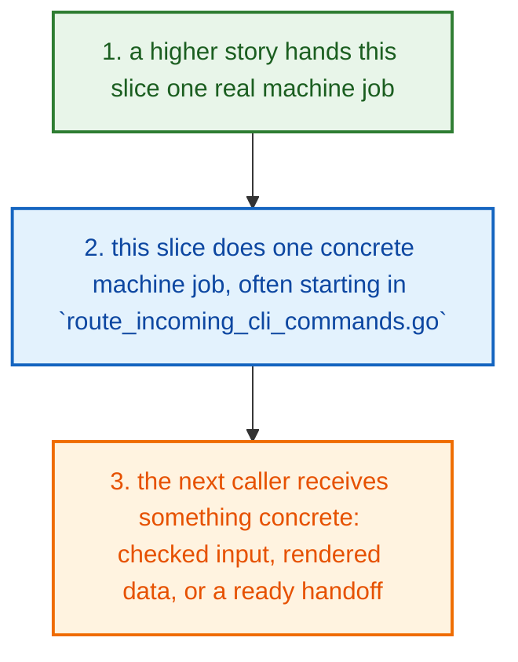
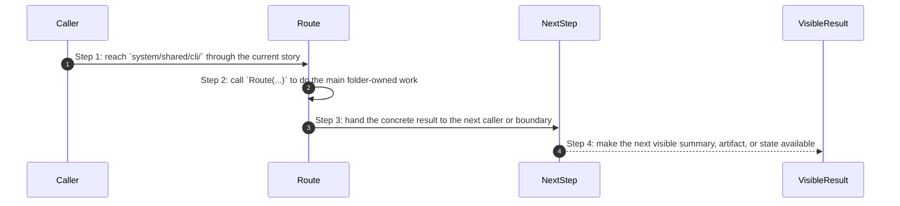
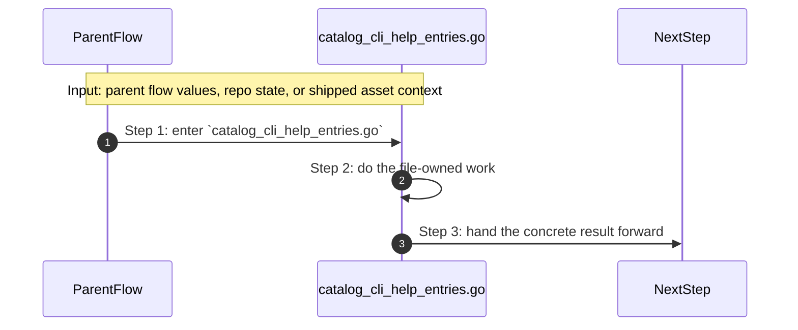
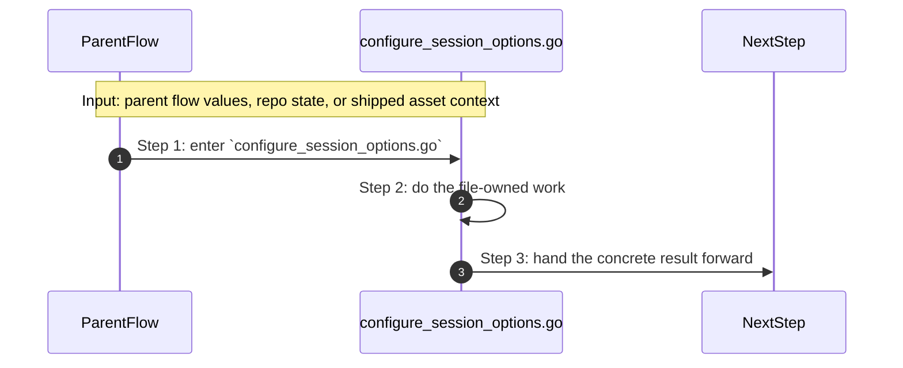
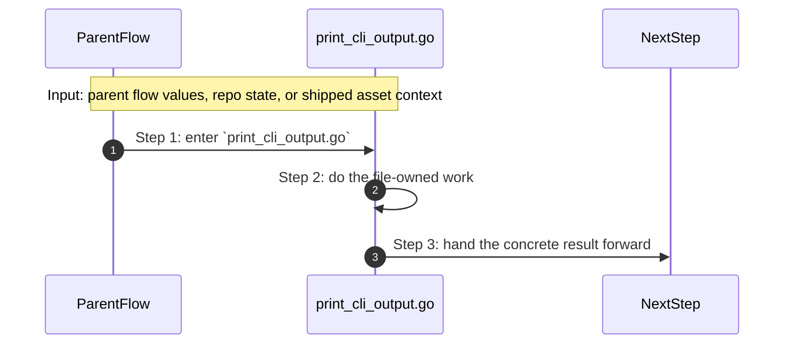
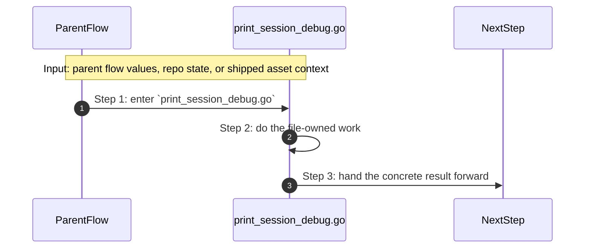
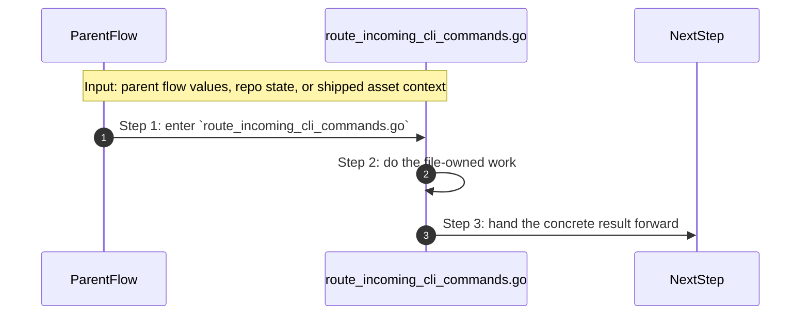

# System Shared Cli How This Works

## What this folder is

`system/shared/cli/` holds shared CLI output, help, and session formatting helpers.

It keeps the human-facing text and formatting rules reusable across command families.

## Real commands or triggers that reach this folder

- engine, tools, and adapters call this shared slice instead of copying the same helpers

## Exact upstream handoffs

- engine, tooling, and adapters call this shared tree instead of re-implementing the same helpers
- once you know the helper family, jump into the narrower child slice for config, CLI, logging, errors, or utilities

## The simplest story

- a higher product, engine, or tooling story reaches this slice because it needs one reusable step
- this folder does one small machine-facing job, often starting in `route_incoming_cli_commands.go`
- the next step gets something concrete back: a helper result, a rendered model, an adapter handoff, or a cleaner request



## The first important path

When a real caller reaches this slice for this exact reason:

```text
engine, tools, and adapters call this shared slice instead of copying the same helpers
```

the important path is:



- **Step 1:** This is the moment the story actually enters this folder instead of staying in a higher router or parent helper.
- **Step 2:** The first real work starts in `route_incoming_cli_commands.go` through `Route(...)`.
- **Step 3:** From here, the story moves to one smaller file, child slice, or boundary that can do the next concrete job.
- **Step 4:** At the end, the caller has something concrete to carry forward: a file on disk, a rendered asset, a proof artifact, or a clear next state.

## Direct files in this folder

### `catalog_cli_help_entries.go`

This file is one direct stop in the story for this folder.

Why this name is honest:

- its main action is still visible in the code, starting with `AllKnownCommands(...)`

When the story opens this file:

- when the `system/shared/cli/` story needs this responsibility, it opens `catalog_cli_help_entries.go`

What arrives here:

- caller-provided values from the parent flow

What leaves this file:

- the result of `AllKnownCommands(...)` for the next caller
- a concrete return value, file write, check result, or summary depending on the path

Why you open it first:

- open this file when the symptom points to `AllKnownCommands(...)` doing the wrong thing



- **Step 1:** The story reaches `catalog_cli_help_entries.go` because this file owns the next small responsibility.
- **Step 2:** The file does its own narrow action instead of mixing it into a bigger caller.
- **Step 3:** The next caller gets a concrete result, not another vague promise.

Important functions:

- `AllKnownCommands(...)`
  This is the main action in the file. It does the folder's primary job and returns the next concrete result.
- `PrintUnknownCommand(...)`
  Small helper for one narrow sub-step. It exists so the main path stays readable.
- `SuggestClosestCommand(...)`
  Small helper for one narrow sub-step. It exists so the main path stays readable.
- `levenshtein(...)`
  Small helper for one narrow sub-step. It exists so the main path stays readable.
- `min3(...)`
  Small helper for one narrow sub-step. It exists so the main path stays readable.

### `configure_session_options.go`

This file is one direct stop in the story for this folder.

Why this name is honest:

- its main action is still visible in the code, starting with `ConfigureSessionOptions(...)`

When the story opens this file:

- when the `system/shared/cli/` story needs this responsibility, it opens `configure_session_options.go`

What arrives here:

- caller-provided values from the parent flow
- config or model values that need to be normalized, rendered, or checked

What leaves this file:

- the result of `ConfigureSessionOptions(...)` for the next caller
- a concrete return value, file write, check result, or summary depending on the path

Why you open it first:

- open this file when the symptom points to `ConfigureSessionOptions(...)` doing the wrong thing



- **Step 1:** The story reaches `configure_session_options.go` because this file owns the next small responsibility.
- **Step 2:** The file does its own narrow action instead of mixing it into a bigger caller.
- **Step 3:** The next caller gets a concrete result, not another vague promise.

Important functions:

- `ConfigureSessionOptions(...)`
  This is the main action in the file. It does the folder's primary job and returns the next concrete result.

### `print_cli_output.go`

This file is one direct stop in the story for this folder.

Why this name is honest:

- its main action is still visible in the code, starting with `PrintFixSuggestions(...)`

When the story opens this file:

- when the `system/shared/cli/` story needs this responsibility, it opens `print_cli_output.go`

What arrives here:

- caller-provided values from the parent flow

What leaves this file:

- the result of `PrintFixSuggestions(...)` for the next caller
- a concrete return value, file write, check result, or summary depending on the path

Why you open it first:

- open this file when the symptom points to `PrintFixSuggestions(...)` doing the wrong thing



- **Step 1:** The story reaches `print_cli_output.go` because this file owns the next small responsibility.
- **Step 2:** The file does its own narrow action instead of mixing it into a bigger caller.
- **Step 3:** The next caller gets a concrete result, not another vague promise.

Important functions:

- `PrintSection(...)`
  Small helper for one narrow sub-step. It exists so the main path stays readable.
- `PrintKeyValue(...)`
  Small helper for one narrow sub-step. It exists so the main path stays readable.
- `PrintNextSteps(...)`
  Small helper for one narrow sub-step. It exists so the main path stays readable.
- `PrintFixSuggestions(...)`
  This is the main action in the file. It does the folder's primary job and returns the next concrete result.
- `filterLines(...)`
  Small helper for one narrow sub-step. It exists so the main path stays readable.

### `print_session_debug.go`

This file is one direct stop in the story for this folder.

Why this name is honest:

- its main action is still visible in the code, starting with `DebugEnabled(...)`

When the story opens this file:

- when the `system/shared/cli/` story needs this responsibility, it opens `print_session_debug.go`

What arrives here:

- caller-provided values from the parent flow

What leaves this file:

- the result of `DebugEnabled(...)` for the next caller
- a concrete return value, file write, check result, or summary depending on the path

Why you open it first:

- open this file when the symptom points to `DebugEnabled(...)` doing the wrong thing



- **Step 1:** The story reaches `print_session_debug.go` because this file owns the next small responsibility.
- **Step 2:** The file does its own narrow action instead of mixing it into a bigger caller.
- **Step 3:** The next caller gets a concrete result, not another vague promise.

Important functions:

- `HintsEnabled(...)`
  Small helper for one narrow sub-step. It exists so the main path stays readable.
- `DebugEnabled(...)`
  This is the main action in the file. It does the folder's primary job and returns the next concrete result.
- `PrintDebugf(...)`
  Small helper for one narrow sub-step. It exists so the main path stays readable.

### `route_incoming_cli_commands.go`

This file is one direct stop in the story for this folder.

Why this name is honest:

- its main action is still visible in the code, starting with `Route(...)`

When the story opens this file:

- when the `system/shared/cli/` story needs this responsibility, it opens `route_incoming_cli_commands.go`

What arrives here:

- caller-provided values from the parent flow

What leaves this file:

- the result of `Route(...)` for the next caller
- a concrete return value, file write, check result, or summary depending on the path

Why you open it first:

- open this file when the symptom points to `Route(...)` doing the wrong thing



- **Step 1:** The story reaches `route_incoming_cli_commands.go` because this file owns the next small responsibility.
- **Step 2:** The file does its own narrow action instead of mixing it into a bigger caller.
- **Step 3:** The next caller gets a concrete result, not another vague promise.

Important functions:

- `NewRouter(...)`
  Small helper for one narrow sub-step. It exists so the main path stays readable.
- `Register(...)`
  Small helper for one narrow sub-step. It exists so the main path stays readable.
- `Route(...)`
  This is the main action in the file. It does the folder's primary job and returns the next concrete result.

## Child folders in this folder

This folder has no child folders in scope.

## Debug first

- start with `AllKnownCommands(...)` in `catalog_cli_help_entries.go` when that action looks wrong
- start with `ConfigureSessionOptions(...)` in `configure_session_options.go` when that action looks wrong
- start with `PrintFixSuggestions(...)` in `print_cli_output.go` when that action looks wrong
- start with `DebugEnabled(...)` in `print_session_debug.go` when that action looks wrong
- start with `Route(...)` in `route_incoming_cli_commands.go` when that action looks wrong

## What to remember

- `system/shared/cli/` exists so this slice has one obvious home.
- The fastest map is still the naming law: folder for flow, file for responsibility, function for exact action.
- If the visible result is wrong, start with the first direct file that owns the next honest action in the flow.

## Dictionary

<a id="dictionary-system"></a>
- `system`: The system is the machine-facing body of PolyMoly. It holds the code, assets, checks, and boundaries that make product stories real.
<a id="dictionary-engine"></a>
- `engine`: The engine is the decision core. It reads intent, matches capabilities, prepares render data, and hands safe work to the next layer.
<a id="dictionary-adapter"></a>
- `adapter`: An adapter is the place where PolyMoly touches the outside world, like files, Docker, environment files, or the browser.
<a id="dictionary-gate"></a>
- `gate`: A gate is a verification run that decides PASS or FAIL before trust increases.
<a id="dictionary-artifact"></a>
- `artifact`: An artifact is a file, bundle, or proof another tool or operator can read later.
<a id="dictionary-runtime"></a>
- `runtime`: Runtime is the live or rendered execution world PolyMoly starts, previews, inspects, or validates.
