# System Shared Config How This Works

## What this folder is

`system/shared/config/` is the shared configuration and registry slice.

It is where platform modules, sidecar state, service graphs, history, and policy-facing config helpers stay in one reusable place.

## Real commands or triggers that reach this folder

- `poly new my-app --framework laravel`
- `poly status`
- `poly gate run docs`
- `poly cache warm`

## Exact upstream handoffs

- `runProjectNew(...)` reaches `WriteProject(...)` when a new sidecar must be created
- runtime and inspect paths reach helpers like `EffectiveIntent(...)`, `DiscoverServices(...)`, `MapServiceGraph(...)`, and `EstimatedEndpoints(...)`
- gates and policy checks reach contract helpers like `CheckDocsScopeDrift(...)`, `CheckEvidenceContract(...)`, and `CheckExternalModuleContract(...)`

## The simplest story

- this folder is where shared config truth lives: sidecar state, module lock data, service graph data, and contract checks
- some commands write state here, some commands read state here, and some commands only verify that the state is still honest
- that is why debugging here usually starts with one question: am I writing config, reading config, or checking config?

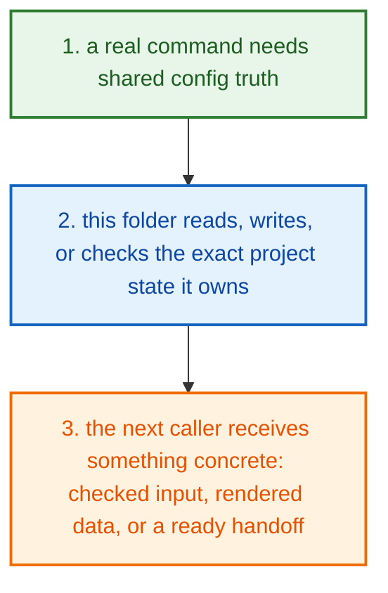

## The first important path

When a real caller reaches this slice for this exact reason:

```bash
poly new my-app --framework laravel
```

the important path is:

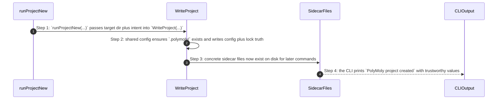

- **Step 1:** `WriteProject(...)` is the cleanest writing story in this folder, so it is the best first example.
- **Step 2:** The same folder also owns read stories like effective intent and service graph helpers.
- **Step 3:** It also owns check stories that docs and gates depend on.
- **Step 4:** If a project state fact is wrong, this folder is often where that wrong fact was first stored or first read.

## Direct files in this folder

### `catalog_platform_modules.go`

This file is one direct stop in the story for this folder.

Why this name is honest:

- its main action is still visible in the code, starting with `Load(...)`

When the story opens this file:

- when the `system/shared/config/` story needs this responsibility, it opens `catalog_platform_modules.go`

What arrives here:

- caller-provided values from the parent flow

What leaves this file:

- the result of `Load(...)` for the next caller
- a concrete return value, file write, check result, or summary depending on the path

Why you open it first:

- open this file when the symptom points to `Load(...)` doing the wrong thing

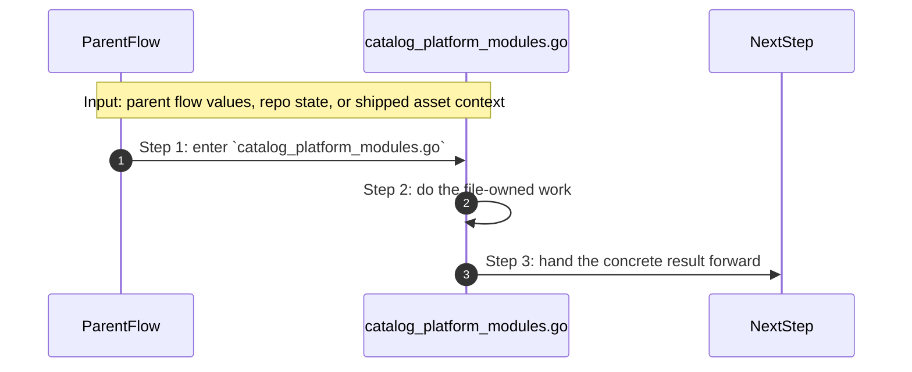

- **Step 1:** The story reaches `catalog_platform_modules.go` because this file owns the next small responsibility.
- **Step 2:** The file does its own narrow action instead of mixing it into a bigger caller.
- **Step 3:** The next caller gets a concrete result, not another vague promise.

Important functions:

- `Load(...)`
  This is the main action in the file. It does the folder's primary job and returns the next concrete result.
- `RuntimeEnvPath(...)`
  Small helper for one narrow sub-step. It exists so the main path stays readable.
- `RuntimeEnvRelativePath(...)`
  Small helper for one narrow sub-step. It exists so the main path stays readable.
- `EnsureRuntimeEnv(...)`
  Small helper for one narrow sub-step. It exists so the main path stays readable.
- `PinnedImageRef(...)`
  Small helper for one narrow sub-step. It exists so the main path stays readable.
- `DigestLooksSynthetic(...)`
  Small helper for one narrow sub-step. It exists so the main path stays readable.
- `Save(...)`
  Small helper for one narrow sub-step. It exists so the main path stays readable.
- `Configurator(...)`
  Small helper for one narrow sub-step. It exists so the main path stays readable.
- `DocEngine(...)`
  Small helper for one narrow sub-step. It exists so the main path stays readable.
- `required(...)`
  Small helper for one narrow sub-step. It exists so the main path stays readable.
- `imageWithoutTagOrDigest(...)`
  Small helper for one narrow sub-step. It exists so the main path stays readable.
- `isLowerHex(...)`
  Small helper for one narrow sub-step. It exists so the main path stays readable.

### `check_docs_scope_rules.go`

This file is one direct stop in the story for this folder.

Why this name is honest:

- its main action is still visible in the code, starting with `CheckDocsScopeDrift(...)`

When the story opens this file:

- when the `system/shared/config/` story needs this responsibility, it opens `check_docs_scope_rules.go`

What arrives here:

- caller-provided values from the parent flow

What leaves this file:

- the result of `CheckDocsScopeDrift(...)` for the next caller
- a concrete return value, file write, check result, or summary depending on the path

Why you open it first:

- open this file when the symptom points to `CheckDocsScopeDrift(...)` doing the wrong thing

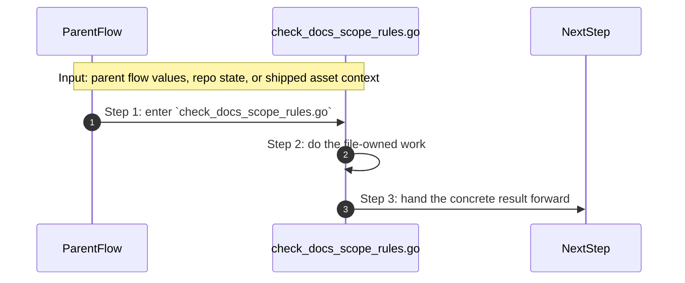

- **Step 1:** The story reaches `check_docs_scope_rules.go` because this file owns the next small responsibility.
- **Step 2:** The file does its own narrow action instead of mixing it into a bigger caller.
- **Step 3:** The next caller gets a concrete result, not another vague promise.

Important functions:

- `CheckDocsFrontmatter(...)`
  Small helper for one narrow sub-step. It exists so the main path stays readable.
- `CheckDocsScopeDrift(...)`
  This is the main action in the file. It does the folder's primary job and returns the next concrete result.
- `collectGovernedDocs(...)`
  Small helper for one narrow sub-step. It exists so the main path stays readable.
- `parseFrontMatter(...)`
  Small helper for one narrow sub-step. It exists so the main path stays readable.
- `mapPathToScope(...)`
  Small helper for one narrow sub-step. It exists so the main path stays readable.
- `splitScopes(...)`
  Small helper for one narrow sub-step. It exists so the main path stays readable.
- `anyScopeMatches(...)`
  Small helper for one narrow sub-step. It exists so the main path stays readable.
- `scopeMatches(...)`
  Small helper for one narrow sub-step. It exists so the main path stays readable.
- `sortedUnique(...)`
  Small helper for one narrow sub-step. It exists so the main path stays readable.
- `sanitizeTSV(...)`
  Small helper for one narrow sub-step. It exists so the main path stays readable.

### `check_evidence_contract.go`

This file is one direct stop in the story for this folder.

Why this name is honest:

- its main action is still visible in the code, starting with `CheckEvidenceContract(...)`

When the story opens this file:

- when the `system/shared/config/` story needs this responsibility, it opens `check_evidence_contract.go`

What arrives here:

- caller-provided values from the parent flow

What leaves this file:

- the result of `CheckEvidenceContract(...)` for the next caller
- a concrete return value, file write, check result, or summary depending on the path

Why you open it first:

- open this file when the symptom points to `CheckEvidenceContract(...)` doing the wrong thing


- **Step 1:** The story reaches `check_evidence_contract.go` because this file owns the next small responsibility.
- **Step 2:** The file does its own narrow action instead of mixing it into a bigger caller.
- **Step 3:** The next caller gets a concrete result, not another vague promise.

Important functions:

- `CheckEvidenceContract(...)`
  This is the main action in the file. It does the folder's primary job and returns the next concrete result.
- `gateArtifactDir(...)`
  Small helper for one narrow sub-step. It exists so the main path stays readable.
- `gitChangedFiles(...)`
  Small helper for one narrow sub-step. It exists so the main path stays readable.

### `check_external_module_contract.go`

This file is one direct stop in the story for this folder.

Why this name is honest:

- its main action is still visible in the code, starting with `CheckExternalModuleContract(...)`

When the story opens this file:

- when the `system/shared/config/` story needs this responsibility, it opens `check_external_module_contract.go`

What arrives here:

- caller-provided values from the parent flow

What leaves this file:

- the result of `CheckExternalModuleContract(...)` for the next caller
- a concrete return value, file write, check result, or summary depending on the path

Why you open it first:

- open this file when the symptom points to `CheckExternalModuleContract(...)` doing the wrong thing

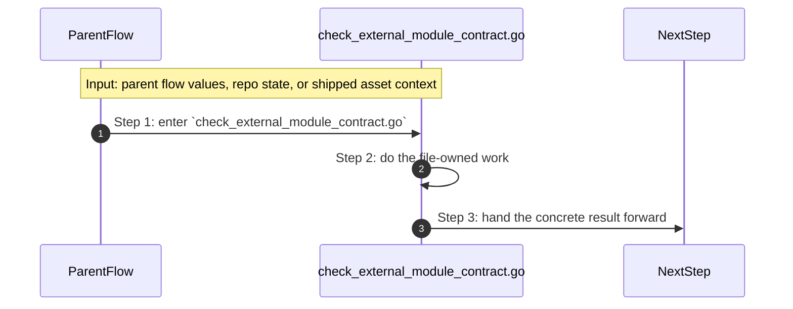

- **Step 1:** The story reaches `check_external_module_contract.go` because this file owns the next small responsibility.
- **Step 2:** The file does its own narrow action instead of mixing it into a bigger caller.
- **Step 3:** The next caller gets a concrete result, not another vague promise.

Important functions:

- `CheckExternalModuleContract(...)`
  This is the main action in the file. It does the folder's primary job and returns the next concrete result.
- `assertRequiredModule(...)`
  Small helper for one narrow sub-step. It exists so the main path stays readable.
- `assertNonEmpty(...)`
  Small helper for one narrow sub-step. It exists so the main path stays readable.
- `assertPinnedRevision(...)`
  Small helper for one narrow sub-step. It exists so the main path stays readable.
- `assertPinnedImage(...)`
  Small helper for one narrow sub-step. It exists so the main path stays readable.
- `assertDigestPinned(...)`
  Small helper for one narrow sub-step. It exists so the main path stays readable.
- `assertDigestQuality(...)`
  Small helper for one narrow sub-step. It exists so the main path stays readable.
- `assertContractVersionSupported(...)`
  Small helper for one narrow sub-step. It exists so the main path stays readable.
- `assertCapabilities(...)`
  Small helper for one narrow sub-step. It exists so the main path stays readable.
- `assertSignatureAndProvenance(...)`
  Small helper for one narrow sub-step. It exists so the main path stays readable.
- `assertExact(...)`
  Small helper for one narrow sub-step. It exists so the main path stays readable.
- `assertPattern(...)`
  Small helper for one narrow sub-step. It exists so the main path stays readable.
- `assertNoPattern(...)`
  Small helper for one narrow sub-step. It exists so the main path stays readable.
- `assertNoDir(...)`
  Small helper for one narrow sub-step. It exists so the main path stays readable.
- `assertNoFile(...)`
  Small helper for one narrow sub-step. It exists so the main path stays readable.
- `assertFile(...)`
  Small helper for one narrow sub-step. It exists so the main path stays readable.
- `assertDir(...)`
  Small helper for one narrow sub-step. It exists so the main path stays readable.
- `assertEnvValue(...)`
  Small helper for one narrow sub-step. It exists so the main path stays readable.
- `sanitizeModuleCheck(...)`
  Small helper for one narrow sub-step. It exists so the main path stays readable.
- `toSet(...)`
  Small helper for one narrow sub-step. It exists so the main path stays readable.

### `check_governance_references.go`

This file is one direct stop in the story for this folder.

Why this name is honest:

- its main action is still visible in the code, starting with `CheckGovernanceReferences(...)`

When the story opens this file:

- when the `system/shared/config/` story needs this responsibility, it opens `check_governance_references.go`

What arrives here:

- caller-provided values from the parent flow

What leaves this file:

- the result of `CheckGovernanceReferences(...)` for the next caller
- a concrete return value, file write, check result, or summary depending on the path

Why you open it first:

- open this file when the symptom points to `CheckGovernanceReferences(...)` doing the wrong thing

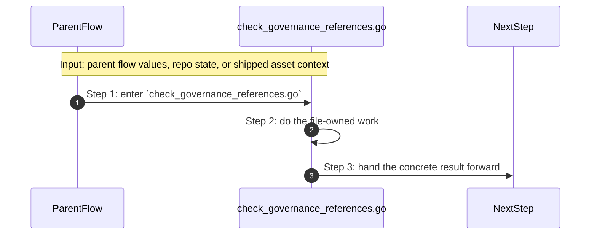

- **Step 1:** The story reaches `check_governance_references.go` because this file owns the next small responsibility.
- **Step 2:** The file does its own narrow action instead of mixing it into a bigger caller.
- **Step 3:** The next caller gets a concrete result, not another vague promise.

Important functions:

- `CheckGovernanceReferences(...)`
  This is the main action in the file. It does the folder's primary job and returns the next concrete result.
- `CheckCIProfileContract(...)`
  Small helper for one narrow sub-step. It exists so the main path stays readable.
- `CheckCIRunnerEntrypoint(...)`
  Small helper for one narrow sub-step. It exists so the main path stays readable.
- `readLines(...)`
  Small helper for one narrow sub-step. It exists so the main path stays readable.
- `collectGovernanceReference(...)`
  Small helper for one narrow sub-step. It exists so the main path stays readable.
- `normalizeDocPath(...)`
  Small helper for one narrow sub-step. It exists so the main path stays readable.
- `passFail(...)`
  Small helper for one narrow sub-step. It exists so the main path stays readable.

### `configure_module_runtime.go`

This file is one direct stop in the story for this folder.

Why this name is honest:

- its main action is still visible in the code, starting with `EnsureDocEngineImage(...)`

When the story opens this file:

- when the `system/shared/config/` story needs this responsibility, it opens `configure_module_runtime.go`

What arrives here:

- caller-provided values from the parent flow
- config or model values that need to be normalized, rendered, or checked

What leaves this file:

- the result of `EnsureDocEngineImage(...)` for the next caller
- a concrete return value, file write, check result, or summary depending on the path

Why you open it first:

- open this file when the symptom points to `EnsureDocEngineImage(...)` doing the wrong thing

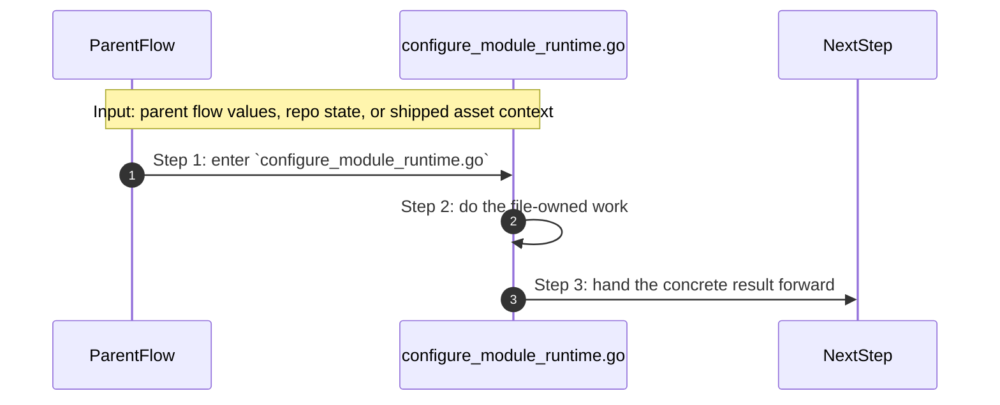

- **Step 1:** The story reaches `configure_module_runtime.go` because this file owns the next small responsibility.
- **Step 2:** The file does its own narrow action instead of mixing it into a bigger caller.
- **Step 3:** The next caller gets a concrete result, not another vague promise.

Important functions:

- `EnsureConfiguratorImage(...)`
  Small helper for one narrow sub-step. It exists so the main path stays readable.
- `EnsureDocEngineImage(...)`
  This is the main action in the file. It does the folder's primary job and returns the next concrete result.
- `ensureImage(...)`
  Small helper for one narrow sub-step. It exists so the main path stays readable.
- `imageAvailable(...)`
  Small helper for one narrow sub-step. It exists so the main path stays readable.
- `buildContextURL(...)`
  Small helper for one narrow sub-step. It exists so the main path stays readable.

### `discover_services.go`

This file is one direct stop in the story for this folder.

Why this name is honest:

- its main action is still visible in the code, starting with `DiscoverServices(...)`

When the story opens this file:

- when the `system/shared/config/` story needs this responsibility, it opens `discover_services.go`

What arrives here:

- caller-provided values from the parent flow

What leaves this file:

- the result of `DiscoverServices(...)` for the next caller
- a concrete return value, file write, check result, or summary depending on the path

Why you open it first:

- open this file when the symptom points to `DiscoverServices(...)` doing the wrong thing

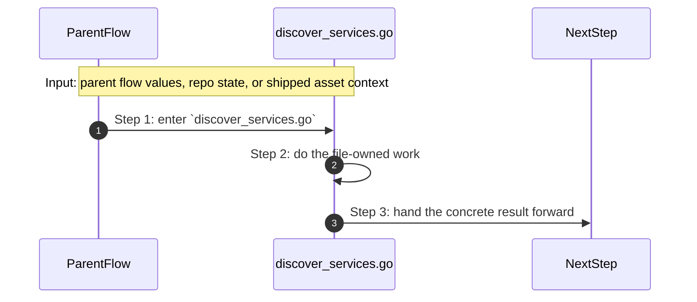

- **Step 1:** The story reaches `discover_services.go` because this file owns the next small responsibility.
- **Step 2:** The file does its own narrow action instead of mixing it into a bigger caller.
- **Step 3:** The next caller gets a concrete result, not another vague promise.

Important functions:

- `DiscoverServices(...)`
  This is the main action in the file. It does the folder's primary job and returns the next concrete result.
- `detectDependencies(...)`
  Small helper for one narrow sub-step. It exists so the main path stays readable.
- `isScannableSource(...)`
  Small helper for one narrow sub-step. It exists so the main path stays readable.
- `isInfraService(...)`
  Small helper for one narrow sub-step. It exists so the main path stays readable.
- `isKnownInfraName(...)`
  Small helper for one narrow sub-step. It exists so the main path stays readable.

### `external-modules.lock.json`

This file ships the `external-modules.lock.json` config, policy, or data asset that the next technical step reads directly.

Why this name is honest:

- the file name already tells you what concrete artifact or config lives here

When the story opens this file:

- when the `system/shared/config/` story needs this responsibility, it opens `external-modules.lock.json`

What arrives here:

- the next render, runtime, or browser step reads this shipped asset as-is

What leaves this file:

- the shipped `external-modules.lock.json` asset
- a concrete file the next render or runtime step can read directly

Why you open it first:

- open this file when the generated or shipped asset itself looks wrong


- **Step 1:** The story reaches `external-modules.lock.json` because this file owns the next small responsibility.
- **Step 2:** The file does its own narrow action instead of mixing it into a bigger caller.
- **Step 3:** The next caller gets a concrete result, not another vague promise.

Important functions:

This file does not expose top-level functions. That is fine. The file itself is the artifact the next step reads.

### `gitops_control.go`

This file is one direct stop in the story for this folder.

Why this name is honest:

- its main action is still visible in the code, starting with `ReadGitOpsApplication(...)`

When the story opens this file:

- when the `system/shared/config/` story needs this responsibility, it opens `gitops_control.go`

What arrives here:

- caller-provided values from the parent flow

What leaves this file:

- the result of `ReadGitOpsApplication(...)` for the next caller
- a concrete return value, file write, check result, or summary depending on the path

Why you open it first:

- open this file when the symptom points to `ReadGitOpsApplication(...)` doing the wrong thing


- **Step 1:** The story reaches `gitops_control.go` because this file owns the next small responsibility.
- **Step 2:** The file does its own narrow action instead of mixing it into a bigger caller.
- **Step 3:** The next caller gets a concrete result, not another vague promise.

Important functions:

- `ResolveOriginRepoURL(...)`
  Small helper for one narrow sub-step. It exists so the main path stays readable.
- `ResolveOriginDefaultRevision(...)`
  Small helper for one narrow sub-step. It exists so the main path stays readable.
- `ResolveGitHubToken(...)`
  Small helper for one narrow sub-step. It exists so the main path stays readable.
- `normalizeRepoURL(...)`
  Small helper for one narrow sub-step. It exists so the main path stays readable.
- `LockGitOpsRepo(...)`
  Small helper for one narrow sub-step. It exists so the main path stays readable.
- `replaceYAMLScalar(...)`
  Small helper for one narrow sub-step. It exists so the main path stays readable.
- `GitOpsRepoLocked(...)`
  Small helper for one narrow sub-step. It exists so the main path stays readable.
- `BridgeGitOpsRepo(...)`
  Small helper for one narrow sub-step. It exists so the main path stays readable.
- `ReadGitOpsApplication(...)`
  This is the main action in the file. It does the folder's primary job and returns the next concrete result.
- `WaitForGitOpsHealthy(...)`
  Small helper for one narrow sub-step. It exists so the main path stays readable.
- `WaitForGitOpsFailure(...)`
  Small helper for one narrow sub-step. It exists so the main path stays readable.
- `PatchGitOpsApplicationRevision(...)`
  Small helper for one narrow sub-step. It exists so the main path stays readable.
- `RefreshGitOpsApplication(...)`
  Small helper for one narrow sub-step. It exists so the main path stays readable.
- `extractYAMLScalar(...)`
  Small helper for one narrow sub-step. It exists so the main path stays readable.
- `extractOriginRevision(...)`
  Small helper for one narrow sub-step. It exists so the main path stays readable.
- `writeGitOpsLockArtifact(...)`
  Small helper for one narrow sub-step. It exists so the main path stays readable.
- `writeGitOpsBridgeArtifact(...)`
  Small helper for one narrow sub-step. It exists so the main path stays readable.
- `writeGitOpsAppArtifact(...)`
  Small helper for one narrow sub-step. It exists so the main path stays readable.
- `blankValue(...)`
  Small helper for one narrow sub-step. It exists so the main path stays readable.
- `isRetryableGitOpsCondition(...)`
  Small helper for one narrow sub-step. It exists so the main path stays readable.
- `sanitizeTSVValue(...)`
  Small helper for one narrow sub-step. It exists so the main path stays readable.

### `index_starter_templates.go`

This file is one direct stop in the story for this folder.

Why this name is honest:

- its main action is still visible in the code, starting with `SearchTemplates(...)`

When the story opens this file:

- when the `system/shared/config/` story needs this responsibility, it opens `index_starter_templates.go`

What arrives here:

- caller-provided values from the parent flow
- config or model values that need to be normalized, rendered, or checked

What leaves this file:

- the result of `SearchTemplates(...)` for the next caller
- a concrete return value, file write, check result, or summary depending on the path

Why you open it first:

- open this file when the symptom points to `SearchTemplates(...)` doing the wrong thing


- **Step 1:** The story reaches `index_starter_templates.go` because this file owns the next small responsibility.
- **Step 2:** The file does its own narrow action instead of mixing it into a bigger caller.
- **Step 3:** The next caller gets a concrete result, not another vague promise.

Important functions:

- `AvailableTemplates(...)`
  Small helper for one narrow sub-step. It exists so the main path stays readable.
- `SearchTemplates(...)`
  This is the main action in the file. It does the folder's primary job and returns the next concrete result.
- `DescribeTemplate(...)`
  Small helper for one narrow sub-step. It exists so the main path stays readable.
- `ResolveTemplate(...)`
  Small helper for one narrow sub-step. It exists so the main path stays readable.
- `ValidateTemplateImportLaw(...)`
  Small helper for one narrow sub-step. It exists so the main path stays readable.
- `SaveTemplateInstall(...)`
  Small helper for one narrow sub-step. It exists so the main path stays readable.
- `normalizeTemplateDescriptor(...)`
  Small helper for one narrow sub-step. It exists so the main path stays readable.
- `cloneTemplateDescriptor(...)`
  Small helper for one narrow sub-step. It exists so the main path stays readable.
- `cloneTemplateIntent(...)`
  Small helper for one narrow sub-step. It exists so the main path stays readable.
- `sha256Hex(...)`
  Small helper for one narrow sub-step. It exists so the main path stays readable.
- `stringSliceContains(...)`
  Small helper for one narrow sub-step. It exists so the main path stays readable.

### `initiate_module_updates.go`

This file is one direct stop in the story for this folder.

Why this name is honest:

- its main action is still visible in the code, starting with `UpdateLock(...)`

When the story opens this file:

- when the `system/shared/config/` story needs this responsibility, it opens `initiate_module_updates.go`

What arrives here:

- caller-provided values from the parent flow

What leaves this file:

- the result of `UpdateLock(...)` for the next caller
- a concrete return value, file write, check result, or summary depending on the path

Why you open it first:

- open this file when the symptom points to `UpdateLock(...)` doing the wrong thing


- **Step 1:** The story reaches `initiate_module_updates.go` because this file owns the next small responsibility.
- **Step 2:** The file does its own narrow action instead of mixing it into a bigger caller.
- **Step 3:** The next caller gets a concrete result, not another vague promise.

Important functions:

- `UpdateLock(...)`
  This is the main action in the file. It does the folder's primary job and returns the next concrete result.
- `applyLabels(...)`
  Small helper for one narrow sub-step. It exists so the main path stays readable.
- `splitCSV(...)`
  Small helper for one narrow sub-step. It exists so the main path stays readable.
- `ensureRuntimeEnvPins(...)`
  Small helper for one narrow sub-step. It exists so the main path stays readable.

### `module_cache.go`

This file is one direct stop in the story for this folder.

Why this name is honest:

- its main action is still visible in the code, starting with `ReadCacheStatus(...)`

When the story opens this file:

- when the `system/shared/config/` story needs this responsibility, it opens `module_cache.go`

What arrives here:

- caller-provided values from the parent flow

What leaves this file:

- the result of `ReadCacheStatus(...)` for the next caller
- a concrete return value, file write, check result, or summary depending on the path

Why you open it first:

- open this file when the symptom points to `ReadCacheStatus(...)` doing the wrong thing


- **Step 1:** The story reaches `module_cache.go` because this file owns the next small responsibility.
- **Step 2:** The file does its own narrow action instead of mixing it into a bigger caller.
- **Step 3:** The next caller gets a concrete result, not another vague promise.

Important functions:

- `CacheManifestPath(...)`
  Small helper for one narrow sub-step. It exists so the main path stays readable.
- `ReadCacheStatus(...)`
  This is the main action in the file. It does the folder's primary job and returns the next concrete result.
- `WarmCache(...)`
  Small helper for one narrow sub-step. It exists so the main path stays readable.
- `AssessOfflineReadiness(...)`
  Small helper for one narrow sub-step. It exists so the main path stays readable.
- `dockerAvailable(...)`
  Small helper for one narrow sub-step. It exists so the main path stays readable.
- `readCacheManifest(...)`
  Small helper for one narrow sub-step. It exists so the main path stays readable.
- `writeCacheManifest(...)`
  Small helper for one narrow sub-step. It exists so the main path stays readable.
- `runtimeEnvExists(...)`
  Small helper for one narrow sub-step. It exists so the main path stays readable.
- `allEntriesWarm(...)`
  Small helper for one narrow sub-step. It exists so the main path stays readable.

### `parse_project_configuration.go`

This file is one direct stop in the story for this folder.

Why this name is honest:

- its main action is still visible in the code, starting with `WriteProject(...)`

When the story opens this file:

- when the `system/shared/config/` story needs this responsibility, it opens `parse_project_configuration.go`

What arrives here:

- caller-provided values from the parent flow
- repo or project paths that tell the file where to read or write
- config or model values that need to be normalized, rendered, or checked

What leaves this file:

- the result of `WriteProject(...)` for the next caller
- a concrete return value, file write, check result, or summary depending on the path

Why you open it first:

- open this file when the symptom points to `WriteProject(...)` doing the wrong thing

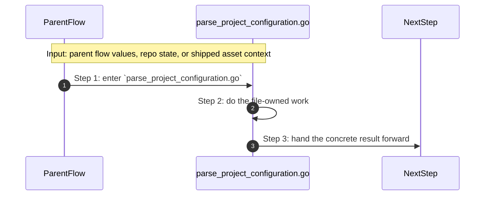

- **Step 1:** The story reaches `parse_project_configuration.go` because this file owns the next small responsibility.
- **Step 2:** The file does its own narrow action instead of mixing it into a bigger caller.
- **Step 3:** The next caller gets a concrete result, not another vague promise.

Important functions:

- `NormalizeUsage(...)`
  Small helper for one narrow sub-step. It exists so the main path stays readable.
- `NormalizeRuntime(...)`
  Small helper for one narrow sub-step. It exists so the main path stays readable.
- `NormalizeProfile(...)`
  Small helper for one narrow sub-step. It exists so the main path stays readable.
- `NormalizeRecipe(...)`
  Small helper for one narrow sub-step. It exists so the main path stays readable.
- `DefaultDatabaseProvider(...)`
  Small helper for one narrow sub-step. It exists so the main path stays readable.
- `DetectRuntime(...)`
  Small helper for one narrow sub-step. It exists so the main path stays readable.
- `NewIntent(...)`
  Small helper for one narrow sub-step. It exists so the main path stays readable.
- `NormalizeIntent(...)`
  Small helper for one narrow sub-step. It exists so the main path stays readable.
- `ValidateProfileLayering(...)`
  Small helper for one narrow sub-step. It exists so the main path stays readable.
- `ResolveCapabilities(...)`
  Small helper for one narrow sub-step. It exists so the main path stays readable.
- `EnsureSidecarLayout(...)`
  Small helper for one narrow sub-step. It exists so the main path stays readable.
- `WriteProject(...)`
  This is the main action in the file. It does the folder's primary job and returns the next concrete result.
- `LoadAt(...)`
  Small helper for one narrow sub-step. It exists so the main path stays readable.
- `FindProjectRoot(...)`
  Small helper for one narrow sub-step. It exists so the main path stays readable.
- `LoadFromCWD(...)`
  Small helper for one narrow sub-step. It exists so the main path stays readable.
- `NewLock(...)`
  Small helper for one narrow sub-step. It exists so the main path stays readable.
- `ValidateLock(...)`
  Small helper for one narrow sub-step. It exists so the main path stays readable.
- `DigestIntent(...)`
  Small helper for one narrow sub-step. It exists so the main path stays readable.
- `PlanIntentChanges(...)`
  Small helper for one narrow sub-step. It exists so the main path stays readable.
- `SavePlan(...)`
  Small helper for one narrow sub-step. It exists so the main path stays readable.
- `LoadPlan(...)`
  Small helper for one narrow sub-step. It exists so the main path stays readable.
- `ClearPlan(...)`
  Small helper for one narrow sub-step. It exists so the main path stays readable.
- `RenderPlan(...)`
  Small helper for one narrow sub-step. It exists so the main path stays readable.
- `SummarizePlan(...)`
  Small helper for one narrow sub-step. It exists so the main path stays readable.
- `RenderDiff(...)`
  Small helper for one narrow sub-step. It exists so the main path stays readable.
- `EstimatedEndpoints(...)`
  Small helper for one narrow sub-step. It exists so the main path stays readable.
- `ASCIITopology(...)`
  Small helper for one narrow sub-step. It exists so the main path stays readable.
- `MermaidTopology(...)`
  Small helper for one narrow sub-step. It exists so the main path stays readable.
- `RiskNudges(...)`
  Small helper for one narrow sub-step. It exists so the main path stays readable.
- `WriteGhostArtifacts(...)`
  Small helper for one narrow sub-step. It exists so the main path stays readable.
- `diffIntent(...)`
  Small helper for one narrow sub-step. It exists so the main path stays readable.
- `formatService(...)`
  Small helper for one narrow sub-step. It exists so the main path stays readable.
- `isSuperset(...)`
  Small helper for one narrow sub-step. It exists so the main path stays readable.
- `sanitize(...)`
  Small helper for one narrow sub-step. It exists so the main path stays readable.

### `project_history.go`

This file is one direct stop in the story for this folder.

Why this name is honest:

- its main action is still visible in the code, starting with `LoadHistory(...)`

When the story opens this file:

- when the `system/shared/config/` story needs this responsibility, it opens `project_history.go`

What arrives here:

- caller-provided values from the parent flow
- repo or project paths that tell the file where to read or write

What leaves this file:

- the result of `LoadHistory(...)` for the next caller
- a concrete return value, file write, check result, or summary depending on the path

Why you open it first:

- open this file when the symptom points to `LoadHistory(...)` doing the wrong thing

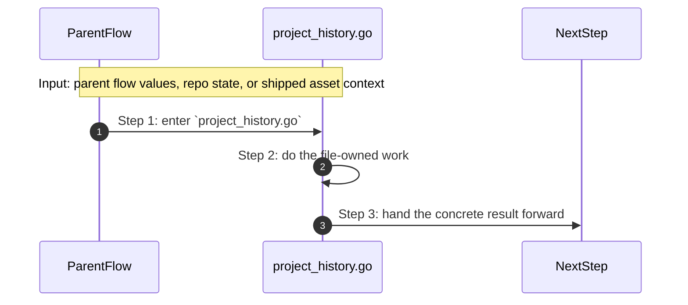

- **Step 1:** The story reaches `project_history.go` because this file owns the next small responsibility.
- **Step 2:** The file does its own narrow action instead of mixing it into a bigger caller.
- **Step 3:** The next caller gets a concrete result, not another vague promise.

Important functions:

- `AppendHistory(...)`
  Small helper for one narrow sub-step. It exists so the main path stays readable.
- `LoadHistory(...)`
  This is the main action in the file. It does the folder's primary job and returns the next concrete result.

### `resolve_module_from_registry.go`

This file is one direct stop in the story for this folder.

Why this name is honest:

- its main action is still visible in the code, starting with `ResolveRegistryMetadata(...)`

When the story opens this file:

- when the `system/shared/config/` story needs this responsibility, it opens `resolve_module_from_registry.go`

What arrives here:

- caller-provided values from the parent flow

What leaves this file:

- the result of `ResolveRegistryMetadata(...)` for the next caller
- a concrete return value, file write, check result, or summary depending on the path

Why you open it first:

- open this file when the symptom points to `ResolveRegistryMetadata(...)` doing the wrong thing


- **Step 1:** The story reaches `resolve_module_from_registry.go` because this file owns the next small responsibility.
- **Step 2:** The file does its own narrow action instead of mixing it into a bigger caller.
- **Step 3:** The next caller gets a concrete result, not another vague promise.

Important functions:

- `Resolve(...)`
  Small helper for one narrow sub-step. It exists so the main path stays readable.
- `ResolveRegistryMetadata(...)`
  This is the main action in the file. It does the folder's primary job and returns the next concrete result.
- `VerifyDescriptorRemote(...)`
  Small helper for one narrow sub-step. It exists so the main path stays readable.
- `ResolveLocalImageMetadata(...)`
  Small helper for one narrow sub-step. It exists so the main path stays readable.
- `verifyDescriptorMetadata(...)`
  Small helper for one narrow sub-step. It exists so the main path stays readable.
- `registryAccessDenied(...)`
  Small helper for one narrow sub-step. It exists so the main path stays readable.
- `registryRemoteOptions(...)`
  Small helper for one narrow sub-step. It exists so the main path stays readable.
- `resolveRegistryToken(...)`
  Small helper for one narrow sub-step. It exists so the main path stays readable.
- `digestFromImageReference(...)`
  Small helper for one narrow sub-step. It exists so the main path stays readable.

### `resolve_module_from_registry_test.go`

This test file locks one real behavior in this folder and fails loudly when that behavior drifts.

Why this name is honest:

- its main action is still visible in the code, starting with `TestVerifyDescriptorMetadataFailsSourceBootstrapWithoutDigest(...)`

When the story opens this file:

- when the `system/shared/config/` story needs this responsibility, it opens `resolve_module_from_registry_test.go`

What arrives here:

- caller-provided values from the parent flow

What leaves this file:

- test proof for one regression shape
- clear failure when the behavior drifts

Why you open it first:

- a test case in this file is the fastest proof of the contract that drifted

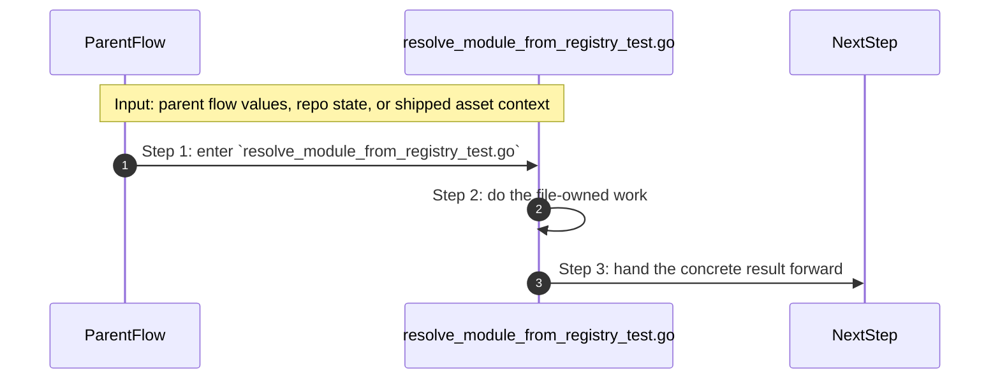

- **Step 1:** The story reaches `resolve_module_from_registry_test.go` because this file owns the next small responsibility.
- **Step 2:** The file does its own narrow action instead of mixing it into a bigger caller.
- **Step 3:** The next caller gets a concrete result, not another vague promise.

Important functions:

- `TestVerifyDescriptorMetadataFailsSourceBootstrapWithoutDigest(...)`
  One proof case in this file. It locks one expected behavior so a regression fails loudly.
- `TestVerifyDescriptorMetadataFailsWhenRegistryProofNeedsMissingLabels(...)`
  One proof case in this file. It locks one expected behavior so a regression fails loudly.
- `TestVerifyDescriptorMetadataAllowsStrictLocalBootstrapWhenDigestAndLabelsMatch(...)`
  One proof case in this file. It locks one expected behavior so a regression fails loudly.
- `TestRegistryAccessDenied(...)`
  One proof case in this file. It locks one expected behavior so a regression fails loudly.
- `Error(...)`
  Small helper for one narrow sub-step. It exists so the main path stays readable.

### `service_graph.go`

This file is one direct stop in the story for this folder.

Why this name is honest:

- its main action is still visible in the code, starting with `MapServiceGraph(...)`

When the story opens this file:

- when the `system/shared/config/` story needs this responsibility, it opens `service_graph.go`

What arrives here:

- caller-provided values from the parent flow

What leaves this file:

- the result of `MapServiceGraph(...)` for the next caller
- a concrete return value, file write, check result, or summary depending on the path

Why you open it first:

- open this file when the symptom points to `MapServiceGraph(...)` doing the wrong thing


- **Step 1:** The story reaches `service_graph.go` because this file owns the next small responsibility.
- **Step 2:** The file does its own narrow action instead of mixing it into a bigger caller.
- **Step 3:** The next caller gets a concrete result, not another vague promise.

Important functions:

- `MapServiceGraph(...)`
  This is the main action in the file. It does the folder's primary job and returns the next concrete result.
- `PersistServiceGraph(...)`
  Small helper for one narrow sub-step. It exists so the main path stays readable.
- `LoadServiceGraph(...)`
  Small helper for one narrow sub-step. It exists so the main path stays readable.
- `uniqueStrings(...)`
  Small helper for one narrow sub-step. It exists so the main path stays readable.

### `sidecar_state.go`

This file is one direct stop in the story for this folder.

Why this name is honest:

- its main action is still visible in the code, starting with `LoadEnvironment(...)`

When the story opens this file:

- when the `system/shared/config/` story needs this responsibility, it opens `sidecar_state.go`

What arrives here:

- caller-provided values from the parent flow

What leaves this file:

- the result of `LoadEnvironment(...)` for the next caller
- a concrete return value, file write, check result, or summary depending on the path

Why you open it first:

- open this file when the symptom points to `LoadEnvironment(...)` doing the wrong thing


- **Step 1:** The story reaches `sidecar_state.go` because this file owns the next small responsibility.
- **Step 2:** The file does its own narrow action instead of mixing it into a bigger caller.
- **Step 3:** The next caller gets a concrete result, not another vague promise.

Important functions:

- `SidecarOwnership(...)`
  Small helper for one narrow sub-step. It exists so the main path stays readable.
- `InspectSidecar(...)`
  Small helper for one narrow sub-step. It exists so the main path stays readable.
- `normalizeEnvironmentEnv(...)`
  Small helper for one narrow sub-step. It exists so the main path stays readable.
- `EnvironmentPath(...)`
  Small helper for one narrow sub-step. It exists so the main path stays readable.
- `ListEnvironments(...)`
  Small helper for one narrow sub-step. It exists so the main path stays readable.
- `LoadEnvironment(...)`
  This is the main action in the file. It does the folder's primary job and returns the next concrete result.
- `EffectiveIntent(...)`
  Small helper for one narrow sub-step. It exists so the main path stays readable.
- `LoadMigrationLog(...)`
  Small helper for one narrow sub-step. It exists so the main path stays readable.
- `appendMigrationRecord(...)`
  Small helper for one narrow sub-step. It exists so the main path stays readable.
- `MigrateLegacyProject(...)`
  Small helper for one narrow sub-step. It exists so the main path stays readable.
- `cloneIntentInternal(...)`
  Small helper for one narrow sub-step. It exists so the main path stays readable.

## Child folders in this folder

### `platform/`

Open [`platform/how-this-works.md`](./platform/how-this-works.md).

Use it when the story includes:

- engine, tools, and adapters call this shared slice instead of copying the same helpers

## Debug first

- start with `Load(...)` in `catalog_platform_modules.go` when that action looks wrong
- start with `CheckDocsScopeDrift(...)` in `check_docs_scope_rules.go` when that action looks wrong
- start with `CheckEvidenceContract(...)` in `check_evidence_contract.go` when that action looks wrong
- start with `CheckExternalModuleContract(...)` in `check_external_module_contract.go` when that action looks wrong
- start with `CheckGovernanceReferences(...)` in `check_governance_references.go` when that action looks wrong
- start with `EnsureDocEngineImage(...)` in `configure_module_runtime.go` when that action looks wrong
- start with `DiscoverServices(...)` in `discover_services.go` when that action looks wrong
- start with `external-modules.lock.json` when the shipped asset or contract itself looks wrong

## What to remember

- `system/shared/config/` exists so this slice has one obvious home.
- The fastest map is still the naming law: folder for flow, file for responsibility, function for exact action.
- If the folder overview feels too wide, jump to the child slice that matches the current symptom instead of reading sideways.

## Dictionary

<a id="dictionary-system"></a>
- `system`: The system is the machine-facing body of PolyMoly. It holds the code, assets, checks, and boundaries that make product stories real.
<a id="dictionary-engine"></a>
- `engine`: The engine is the decision core. It reads intent, matches capabilities, prepares render data, and hands safe work to the next layer.
<a id="dictionary-adapter"></a>
- `adapter`: An adapter is the place where PolyMoly touches the outside world, like files, Docker, environment files, or the browser.
<a id="dictionary-gate"></a>
- `gate`: A gate is a verification run that decides PASS or FAIL before trust increases.
<a id="dictionary-artifact"></a>
- `artifact`: An artifact is a file, bundle, or proof another tool or operator can read later.
<a id="dictionary-runtime"></a>
- `runtime`: Runtime is the live or rendered execution world PolyMoly starts, previews, inspects, or validates.
